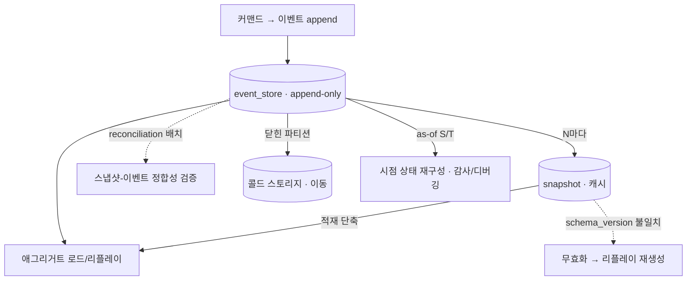
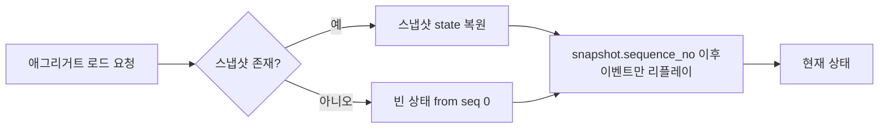
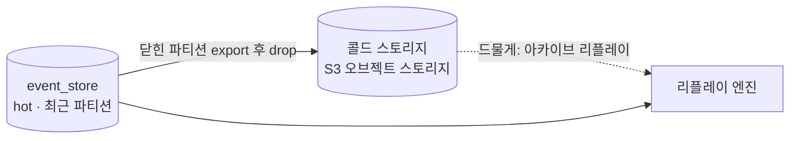

# DESIGN-009: Event Store Lifecycle

- **상태**: Accepted
- **작성자**: Team
- **작성일**: 2026-06-30
- **최종 수정일**: 2026-06-30
- **관련 RFC**: RFC-004-event-store-schema-evolution · RFC-017-disaster-recovery-event-store · RFC-021-event-identity-and-global-ordering · RFC-022-event-schema-evolution · RFC-005-pii-security
- **관련 ADR**: 05.event-store-mysql-table · 02.selective-event-sourcing-scope · 11.es-pii-crypto-shredding · 10.event-schema-evolution · 18.event-store-recovery-semantics · 22.event-identity-and-global-ordering
- **관련 Design Doc**: DESIGN-001-design-overview · DESIGN-003-write-model · DESIGN-004-read-model

---

## 1. Background

이벤트 스토어는 "쓰고 잊는 로그"가 아니라 **살아있는 자산**이다. append-only라 영구히 자라고, 스키마는 진화하며, 감사·디버깅은 과거 시점을 다시 묻는다. 본 문서는 ES 컨텍스트(`reservation`·`timetable`·`restaurant`)의 이벤트 스토어를 *시간 축에서 어떻게 운영하는가*를 다룬다.

ADR-05.event-store-mysql-table의 `event_store` 테이블은 한번 쓰면 수정·삭제하지 않는다. 이 불변성이 ES의 가치(완전한 이력·재구성)를 만들지만, 동시에 네 가지 운영 부담을 청구한다.

1. **리플레이 비용** — 애그리거트 하나를 복원하려고 수천 이벤트를 읽는다 → 스냅샷.
2. **영구 성장** — 테이블이 끝없이 커진다 → 파티셔닝·아카이빙.
3. **스키마 진화** — 페이로드 모양이 바뀐다 → 스냅샷 무효화·업캐스팅.
4. **시점 질의** — "그때 그 상태"를 묻는다 → temporal/as-of 조회.

본 문서는 이 넷을 *메커니즘 수준*에서 확정한다. 구체 수치(스냅샷 주기 N, 파티션 단위, 보존 기간)는 부하를 보고 구현 사이클에서 튜닝한다.

## 2. Goal

- G1: 스냅샷 전략(저장 모델, 생성 트리거, 스키마 진화 시 무효화·재생성, 정합성 검증) 확정
- G2: 이벤트 스토어 보존·아카이빙 메커니즘(파티셔닝, 콜드 스토리지, 핫/콜드 경계) 확정
- G3: Temporal/as-of 조회 메커니즘 및 적용 범위 확정
- G4: 재해 복구 의미론(복구 대상, 복구 방식, PII 불변식, 복구 순서) 확정

## 3. Non-Goal

- NG1: 스냅샷 주기 N 절대값 (운영 측정·k6 스윕으로 구현 사이클에서 결정)
- NG2: 파티션 보존 기간·아카이빙 스케줄의 구체 수치 (운영 백로그)
- NG3: RTO/RPO 절대값·런북 (T-18 운영 백로그)
- NG4: 이벤트 페이로드 업캐스터 카탈로그 (RFC-022-event-schema-evolution 의존)
- NG5: 콜드 이관 후 복호 결합도와 S3 이관 설계의 세부 구현 (TBD, §6.5)

## 4. Proposed Solution

### 4.1 High-Level Architecture

전체 이벤트 스토어 수명주기를 한 장으로 요약하면:



### 4.2 Key Design Decisions

| 결정 | 근거 |
|------|------|
| 스냅샷은 핫 DB에 최신 1개, 직전본은 S3 Glacier 이관 | 스냅샷은 버릴 수 있는 최적화(진실은 이벤트). 활성 경로가 여러 개를 들 이유 없음. 디버깅·감사용 콜드 아카이브로 유지 |
| 스냅샷은 업캐스팅하지 않고 폐기 후 재생성 | "버릴 수 있는 최적화"이므로 업캐스터 유지 비용을 지지 않고 이벤트 리플레이로 새 포맷 재생성 |
| 이벤트 페이로드 업캐스팅은 읽기 시점에 수행 | in-place 마이그레이션 기각. `event_version` + 읽기 시 업캐스팅으로 흡수 |
| 업캐스터·eventType 레지스트리는 명시 등록 | 어노테이션 스캔 배제. 데이터 정합성에 직결되는 코드라 "여기 다 적혀 있다"가 안전 |
| 파티셔닝은 시간(생성월) 기준 | 예약 애그리거트 수명이 짧아 핫패스 리플레이가 파티션 경계를 거의 넘지 않음. `(aggregate_id, sequence_no)` 인덱스로 스트림 조회 커버 |
| 콜드 스토리지는 S3 오브젝트 스토리지 | 같은 DB 아카이브 테이블은 용량·백업 부담 지속. 삭제가 아닌 이동으로 append-only 불변성·감사성 유지 |
| temporal 조회는 운영·디버깅 한정(YAGNI) | 일반 API 노출 시 인덱스·성능·권한 비용을 미리 부담. 제품 화면 요구가 증명되면 프로젝션화 |
| 재해 복구 1급 대상은 이벤트 스토어 한 곳 | query DB·Redis는 손실성 파생. 이벤트만 있으면 read model 재구축 가능. 파생물은 best-effort |
| 논리 사고는 보상 이벤트로 정정 | 과거 절단은 append-only 불변성 위반 + 다운스트림이 이미 본 이벤트는 되돌릴 수 없음 |

### 4.3 Interface / Contract

#### 스냅샷 적재(load) 경로



#### Temporal as-of 조회 (개념 인터페이스)

```kotlin
// 개념 예시 — 실제 시그니처는 구현 사이클에서 확정
fun loadAsOf(aggregateId: AggregateId, atSequence: Long): Aggregate {
    val base = snapshotStore.latestBefore(aggregateId, atSequence) // 없으면 빈 상태
    val events = eventStore.read(aggregateId, after = base.sequenceNo, upTo = atSequence)
    return events.fold(base.state) { state, e -> state.apply(e) }
}
```

#### 복구 순서 불변식

**① 이벤트 스토어 복원·검증 → ② DESIGN-004-read-model 재구축 트리거 → ③ readiness 회복.**

### 4.4 Data Model

#### 스냅샷 테이블

```
snapshot(
  aggregate_type, aggregate_id,
  sequence_no,            -- 이 스냅샷이 반영한 마지막 이벤트의 sequence_no
  schema_version,         -- 스냅샷 직렬화 스키마 버전
  state(JSON),            -- 애그리거트 상태 직렬화
  created_at
)
-- (aggregate_id) 당 핫 DB엔 최신 1개. 밀려난 직전본은 S3 Glacier로 이관(콜드).
-- 진실은 이벤트, 스냅샷은 버릴 수 있는 캐시.
```

#### 콜드 스토리지 흐름



## 5. Alternatives Considered

### 5.1 Option A: 핫 DB에 최근 N개 스냅샷 보관

- **설명**: 최신 1개 대신 최근 N개(예: 5개)를 핫 DB에 유지
- **장점**: 과거 시점 복원 시 더 빠른 출발점 제공 가능
- **단점**: 활성 경로에서 여러 스냅샷을 관리하는 복잡도 증가. 스냅샷은 진실 원천이 아니라 최적화임에도 과도한 저장 부담
- **기각 사유**: 과거 시점 조회는 이벤트 리플레이(§3)로 충분. 스냅샷은 "버릴 수 있는 캐시"라는 원칙에 부합하지 않음

### 5.2 Option B: 스냅샷 업캐스팅

- **설명**: 스냅샷 `schema_version`이 변경되면 이벤트처럼 업캐스팅 코드로 마이그레이션
- **장점**: 초기 리플레이 없이 즉시 새 포맷 스냅샷 확보
- **단점**: 업캐스터 유지 비용 발생. 스냅샷이 "버릴 수 있는 최적화"임에도 이벤트 수준의 진화 관리 부담
- **기각 사유**: 폐기 후 이벤트 리플레이로 재생성이 더 단순하고 안전. 업캐스팅은 이벤트에만 둔다

### 5.3 Option C: aggregate_type 기준 파티셔닝

- **설명**: 시간 기준 대신 `aggregate_type`으로 파티션 분리
- **장점**: aggregate_type별 독립적 보존 정책 적용 가능
- **단점**: 보존·아카이빙의 자연스러운 축은 시간. `aggregate_type` 파티셔닝은 핫패스 성능 이득이 없고 관리 복잡도만 증가
- **기각 사유**: 시간 기준 파티셔닝이 핫패스 스트림 조회를 `(aggregate_id, sequence_no)` 인덱스로 충분히 커버. 장수 애그리거트 비중이 전제를 흔들 만큼 크면 측정 후 재검토

### 5.4 Option D: 같은 DB의 아카이브 테이블로 콜드 이관

- **설명**: S3가 아닌 같은 MySQL 인스턴스 내 별도 아카이브 테이블로 이관
- **장점**: 단일 DB 내 SQL 조인 가능
- **단점**: 같은 인스턴스의 용량·백업 부담을 콜드 데이터가 계속 지게 됨. 핫/콜드 분리의 실질 이득 없음
- **기각 사유**: 콜드에는 그 비용을 지킬 가치 없음. S3 오브젝트 스토리지가 비용·운영 면에서 적합

### 5.5 Option E: 절단형 PITR로 논리 사고 복구

- **설명**: 잘못된 이벤트 주입·truncate 등 논리 사고 발생 시 DB를 과거 시점으로 되감기
- **장점**: 직관적인 되감기 복구
- **단점**: T 이후 이벤트는 이미 발행돼 다운스트림이 봤을 수 있음. 진실 원천만 되감아도 세상은 안 되감김. append-only 불변성과 정면 충돌
- **기각 사유**: 깨끗한 되감기는 없음. 보상 이벤트로 논리적 정정이 올바른 접근

## 6. Details

### 6.1 Error Handling

#### 스냅샷 생성 실패

스냅샷 생성 실패는 **치명적이지 않다**. 다음 적재가 더 긴 리플레이를 할 뿐, 정합성은 깨지지 않는다. 동기 경로에 넣지 않고 비동기로 처리한다.

#### 스냅샷 무효화

`schema_version`이 코드의 현재 버전과 다르면 그 스냅샷을 무효 취급하고 무시한다. 무효 스냅샷은 이벤트 리플레이로 안전하게 재생성된다. 삭제·마이그레이션이 강제되지 않는다.

#### 스냅샷-이벤트 불일치

- 불일치가 잡히면 해당 스냅샷을 **폐기하고 이벤트 리플레이로 재생성**하며 경보를 띄운다.
- **불변식**: `snapshot.sequence_no <= max(event_store.sequence_no)` 가 항상 성립해야 한다. 위반(이벤트보다 앞선 스냅샷)은 데이터 손상 신호.

#### 업캐스터 레지스트리 키 충돌

- 업캐스터는 `(eventType, fromVersion)`을 키로 명시 등록하고, 애플리케이션 시작 시 키 충돌을 탐지해 **빠르게 실패**시킨다.

### 6.2 Security Considerations

#### PII 셰딩과 콜드 경로

콜드로 빠진 이벤트도 키 삭제 *한 번*으로 같이 셰딩돼야 한다(RFC-005-pii-security). 정합 규칙:

- **콜드(S3) 본문은 이관하되 셰딩 키는 핫 키 저장소에 영속(콜드 이관 금지)**
- **콜드 이벤트 재생 시 핫 키 저장소를 참조해 복호**

콜드엔 풀 수 없는 암호문만 가고 키는 핫 경로 전용 키 저장소에 남으므로, 키 저장소에서 키를 지우는 한 번의 동작이 핫·콜드를 가리지 않고 셰딩을 성립시킨다(키/blind index 본체는 ADR-11.es-pii-crypto-shredding).

#### 복원은 셰딩된 PII를 부활시키지 않는다

크립토 셰딩(DESIGN-016-pii-security)과 백업은 본질적으로 위험한 조합 — 옛 백업 복원이 *지운 PII를 부활*시켜 삭제 의무를 위반할 수 있다. 막는 불변식:

- 이벤트 스토어 백업은 **암호문만** 담고 키를 포함하지 않는다.
- 키 저장소 백업은 셰딩 의미론을 깨지 않는다 — 셰딩된 키는 키 백업에서도 무효화되거나 애초에 백업 대상에서 빠진다.
- **복원은 이벤트의 시계를 되돌리지만 키의 시계는 되돌리지 않는다** — 이 비대칭이 셰딩을 지킨다.

### 6.3 Performance & Scalability

#### 스냅샷 주기 N

- N은 기본 100, `aggregate_type`별로 설정 가능(RFC-004-event-store-schema-evolution).
- 작으면 저장·쓰기 부담, 크면 리플레이 길이 — 절대값은 부하를 보고 결정.
- **재검토 트리거**: 재구성 p99 > 50ms이면 k6 스윕(DESIGN-012-environments-and-testing §5.4)으로 N을 조정한다.
- 예약 애그리거트는 한 스트림이 짧아 `N=100`이면 스냅샷이 사실상 거의 안 찍힌다 — 단점이 아니라 의도다(짧은 스트림에 공격적으로 스냅샷을 찍는 건 과최적화).

#### 리플레이 성능 가드레일

- 일상 적재는 **스냅샷+증분**으로 리플레이 길이를 N 이하로 묶는다.
- 전체 리플레이(스냅샷 폐기/검증/프로젝션 재구축)는 **배치·오프피크** 작업으로 분리. 핫 경로에서 seq 0 전체 리플레이가 일어나면 안 된다.
- 프로젝션 재구축(DESIGN-004-read-model)도 이벤트 스토어 전체 스캔이므로 같은 가드레일 적용. 콜드 파티션 포함 여부를 재구축 목적에 따라 선택.
- 스캔은 `event_id`(UUIDv7) keyset(`WHERE event_id > :last ORDER BY event_id`)로 **열거·재개**한다(ADR-22.event-identity-and-global-ordering) — 이는 진행 커서이지 교차-애그리거트 순서 보장이 아니며, 프로젝터 정확성은 per-aggregate 순서+멱등+버전 가드가 진다(RFC-011-projection-rebuild-catchup).

### 6.4 Observability

- 스냅샷-이벤트 정합성 불일치 감지 시 경보 발생
- 스냅샷 생성 실패율 메트릭
- 리플레이 p99 지연 메트릭 (N 조정 트리거 기준)
- reconciliation 배치 수행 결과 (표본률·불일치 건수)
- 콜드 이관 성공/실패 메트릭

세부 SLI/경보 임계값은 RFC-008-observability에서 통합 확정.

### 6.5 Migration / Rollback

#### 스냅샷 스키마 변경 시

1. `schema_version` 증분
2. 기존 스냅샷은 자동으로 무효 취급(버전 불일치 감지)
3. 다음 적재 시 전체 리플레이 → 새 포맷 스냅샷 재생성
4. 배경 배치가 표본 검증으로 재생성 정합성 확인

#### 콜드 이관 설계 정합 (TBD)

콜드 본문 복호가 핫 키 저장소를 참조하는 결합도와 S3 이관 설계 정합은 구현 사이클에서 검증 — **TBD**.

## 7. Risks & Mitigations

| 위험 | 영향 | 완화 전략 |
|------|------|-----------|
| 스냅샷 schema_version 미관리로 역직렬화 오류 | 애그리거트 로드 실패 | schema_version 필드 필수화, 버전 불일치 시 전체 리플레이 폴백 |
| 업캐스터 누락으로 옛 이벤트 역직렬화 실패 | 히스토리 재생 불가 | 명시 등록 레지스트리 + 시작 시 키 충돌 fast-fail |
| 콜드 이관 후 키 저장소 분리 실패로 PII 재노출 | GDPR/개인정보보호법 위반 | 이벤트 스토어 백업에 키 미포함 불변식, 키 저장소 별도 백업 정책 |
| 옛 백업 복원으로 셰딩된 PII 부활 | 삭제 의무 위반 | 이벤트 암호문+키 분리 백업 정책 강제(§6.2) |
| 전체 리플레이 핫 경로 유입 | 서비스 지연 급증 | 배치·오프피크 격리, 스냅샷 주기 N 적절 설정 |
| 파티션 경계 걸친 핫패스 리플레이 (장수 애그리거트) | 쿼리 성능 저하 | aggregate_type별 N 세분화, 비중 측정 후 파티셔닝 전략 재검토 |
| reconciliation 미실행으로 드리프트 누적 | 스냅샷 오염 감지 지연 | reconciliation 실패 경보, 주기적 실행 보장 |

## 8. Milestones & Phases

| Phase | 내용 | 완료 조건 |
|-------|------|-----------|
| 1 | 스냅샷 저장 모델·적재 경로 구현 (§4.3, §4.4) | 스냅샷 생성·로드·무효화 동작 확인, unit test 통과 |
| 2 | 스냅샷-이벤트 정합성 검증 (§4 인라인 검증) | 인라인 검증 로직 구현, 불일치 시 폐기·재생성 동작 확인 |
| 3 | 업캐스터·eventType 레지스트리 명시 등록 구현 | 레지스트리 빈 구현, 시작 시 키 충돌 fast-fail 확인 |
| 4 | 시간 기준 파티셔닝 설계 반영 | 파티션 키 정의, 인덱스 정합성 확인 |
| 5 | Temporal as-of 조회 구현 | `loadAsOf` 인터페이스 구현, 운영·디버깅 한정 노출 확인 |
| 6 | reconciliation 배치 구현 | 표본 검증 배치 동작 확인, 불일치 경보 확인 |
| 7 | 콜드 스토리지(S3) 이관 파이프라인 (localstack 검증) | 닫힌 파티션 export·drop 동작, PII 키 분리 불변식 확인 |

## 9. Appendix

### 9.1 Glossary

| 용어 | 정의 |
|------|------|
| 스냅샷 | 특정 `sequence_no`까지의 애그리거트 상태를 직렬화한 최적화 캐시. 진실 원천은 아님 |
| 업캐스터 | 낡은 버전 이벤트를 읽는 시점에 최신 모양으로 변환하는 함수. `(eventType, fromVersion)` 키로 등록 |
| schema_version | 스냅샷 직렬화 포맷의 버전. 코드 버전과 불일치 시 스냅샷 무효 처리 |
| 콜드 스토리지 | 활성 핫 DB 밖에 위치한 저비용 장기 보관 스토리지. 이 시스템에서는 S3 오브젝트 스토리지 |
| 핫/콜드 경계 | 도메인 종결 상태 + 유예 기간(감사·분쟁 윈도우)으로 판정. 미종결이거나 유예 내이면 핫 |
| as-of sequence | `sequence_no <= S`인 이벤트만 apply해 "S번째 이벤트 직후" 상태를 재구성하는 temporal 조회 |
| as-of time | `occurred_at <= T`인 이벤트만 apply해 "시점 T의 상태"를 재구성하는 temporal 조회 |
| reconciliation | 스냅샷+증분 리플레이 결과와 seq 0 전체 리플레이 결과를 비교해 드리프트를 잡는 배경 배치 |
| 보상 이벤트 | 논리 사고 시 과거를 절단하지 않고 "기존 이벤트를 무효화한다"는 새 이벤트를 append하는 정정 패턴 |
| 크립토 셰딩 | 암호화 키를 삭제해 해당 키로 암호화된 개인정보를 논리적으로 삭제하는 기법 |
| 2-슬롯 토글 | 현재+직전 2개 슬롯을 원자적으로 교체하고 밀려난 슬롯을 Glacier로 export하는 스냅샷 교체 패턴 |

### 9.2 Calculations / Benchmarks

- 스냅샷 주기 N 기본값 100 — 재구성 p99 > 50ms 시 k6 스윕으로 조정 (DESIGN-012-environments-and-testing §5.4)
- 핫/콜드 유예 기간 예시: 종결 +90일 (감사·분쟁 윈도우). 컨텍스트별 종결 상태 목록은 각 도메인 작업에서 채움
- reconciliation 표본률·주기: 운영 측정에 맡김

### 9.3 Reference

- ADR-05.event-store-mysql-table — `event_store` 테이블 스키마·인덱스 정의
- ADR-02.selective-event-sourcing-scope — ES 적용 컨텍스트 범위
- ADR-10.event-schema-evolution — in-place 마이그레이션 기각, 읽기 시 업캐스팅 결정
- ADR-11.es-pii-crypto-shredding — 크립토 셰딩 키/blind index 본체
- ADR-18.event-store-recovery-semantics — 복구 의미론 상세
- ADR-22.event-identity-and-global-ordering — UUIDv7 event_id, keyset 열거
- RFC-004-event-store-schema-evolution — 스냅샷 보관 정책, N 설정, temporal 조회 범위
- RFC-005-pii-security — PII 셰딩과 콜드 경로 통합 정합
- RFC-017-disaster-recovery-event-store — 복구 근거·기각된 대안
- RFC-021-event-identity-and-global-ordering — UUIDv7 시간정렬 기반 keyset
- RFC-022-event-schema-evolution — 업캐스터 카탈로그·스키마 레지스트리 결정
- DESIGN-003-write-model — 애그리거트 커밋·Outbox 연동
- DESIGN-004-read-model — 프로젝션 재구축·catch-up 경로
- DESIGN-016-pii-security — 크립토 셰딩 전체 설계

## Changelog

| 날짜 | 변경 내용 |
|------|-----------|
| 2026-06-30 | 초안 작성 — 08-event-store-lifecycle.md를 DESIGN 템플릿으로 재구성 |
