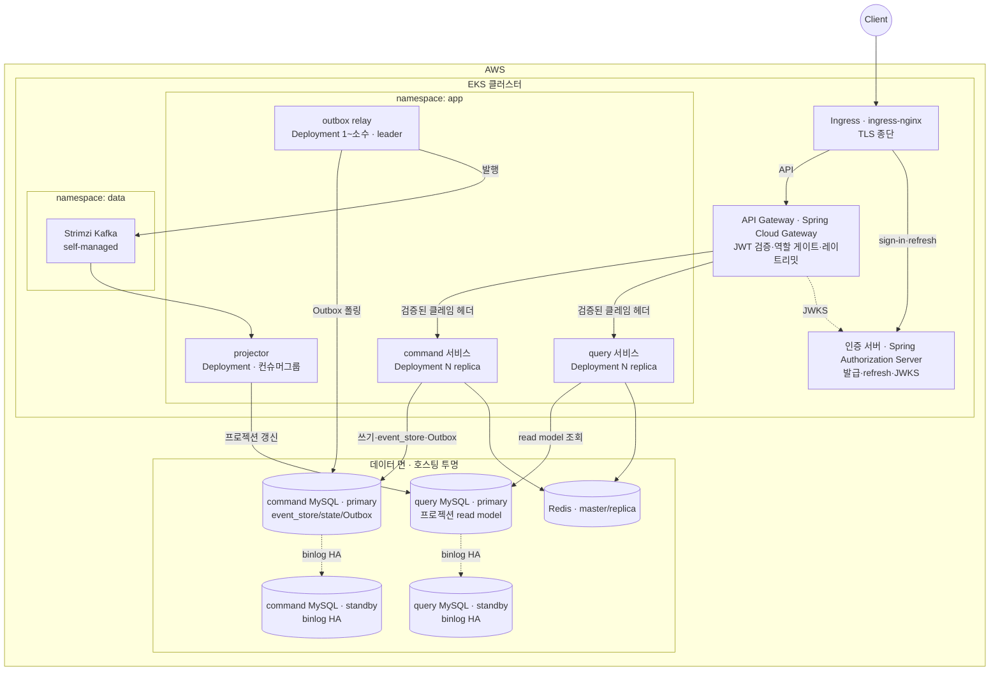
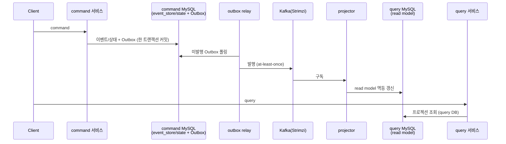

# DESIGN-010: Deployment / Runtime View (물리·배포 뷰)

- **상태**: Accepted
- **작성자**: Team
- **작성일**: 2026-06-30
- **최종 수정일**: 2026-06-30
- **관련 RFC**: RFC-007-deployment-infra-ops
- **관련 ADR**: ADR-012(kafka-hosting-msk-vs-self-managed) · ADR-013(db-hosting-and-read-write-topology) · ADR-005(event-store-mysql-table)
- **관련 Design Doc**: DESIGN-001(design-overview) · DESIGN-002(module-structure) · DESIGN-003(write-model) · DESIGN-004(read-model) · DESIGN-005(migration) · DESIGN-012(environments-and-testing)

---

## 1. Background

앞선 design doc(DESIGN-001~DESIGN-006)이 *논리적으로 어떻게 짓는가*였다면, 본 문서는 그것이 *물리적으로 어디서 도는가*다. 모듈(DESIGN-002)은 빌드·코드 경계이고, 여기서 다루는 워크로드는 그 모듈이 런타임에 어떤 프로세스·파드로 배치되는가다. 둘은 1:1이 아니다.

현재(V1)는 단일 `adapter-module` 부트 앱 + docker-compose(MySQL·Redis)로 돈다. 이 단일 배포 구조는 비동기 경계·이벤트 스토어·CQRS를 도입하는 V2에서 워크로드별 독립 스케일·장애 격리·수명주기 분리를 제공하지 못한다.

> 본 문서는 **목표 런타임 토폴로지**다. 아래 EKS/Kafka(self-managed)/RDS 구성은 V2의 도착점이며, 전환은 DESIGN-007(strangler-migration) 순서대로 단계적으로 깐다. 인프라부터 빅뱅으로 세우지 않는다(YAGNI).

## 2. Goal

V2의 목표 런타임 토폴로지를 확정한다:

- 7개 워크로드의 역할·상태성·배치 근거를 정의한다.
- EKS 클러스터 토폴로지(namespace, Ingress, 워크로드 배치)를 확정한다.
- 데이터 면(Kafka, command/query MySQL, Redis) 배치 정책을 확정한다.
- 이벤트·트래픽 흐름을 런타임 관점에서 명시한다.
- 운영 관심사(헬스/레디니스, 확장 축, SLI 목록)의 정책 형태를 잠근다.

## 3. Non-Goal

- GitOps 도구 선정 및 파이프라인 설계 (별도 todo)
- HPA 수치·복제 지연 허용치 등 구체 임계 숫자 (운영 측정 후 확정)
- outbox relay 단일성의 구체 구현(leader election vs SKIP LOCKED) (구현 사이클)
- command/query 서비스의 물리적 분리 시점 결정 (읽기 스케일 요구가 증명될 때)
- 폴링 relay → CDC(Debezium) 전환 결정 (트래픽·운영 성숙도 의존)

## 4. Proposed Solution

> **[2026-07-20 개정]** 아래 §4의 엣지 서술은 **Ingress(ingress-nginx, TLS) + Spring Cloud Gateway** 두 홉으로 쓰였으나, ADR-024(authentication-boundary) 결정 4와 정합화해 **Envoy Gateway(Gateway API) 단일 홉**으로 대체됐다(SCG는 ADR-024가 기각한 ①). 원 서술은 이력으로 남기며, 확정 내용은 하단 "## 개정 (2026-07-20) — 엣지" 참조.
> **[2026-07-20 개정]** 아래 §4.1의 "command/query 초기 배포 합침"과 §4.2의 `app-ns`/`data-ns` 분리 서술은 [[ADR-026-workload-runtime-placement]]으로 대체됐다 — **각 앱 워크로드는 처음부터 별도 배포 + 노드 분리, namespace는 단일 평탄, 격리는 노드에서**. 원 서술은 이력으로 남기며, 확정 내용은 하단 "## 개정 (2026-07-20) — 워크로드 배치" 참조.

### 4.1 배치 단위 (logical workload)

V2의 런타임 구성요소는 일곱이다. 모듈과의 대응 관계를 먼저 못 박는다.

| 워크로드 | 책임 | 출처 모듈 | 상태성 |
|----------|------|-----------|--------|
| **command 서비스** | 명령 수신·검증·쓰기(이벤트 스토어/상태+Outbox) | `command-module` | stateless (DB가 상태) |
| **query 서비스** | 조회 — query DB의 read model → DTO | `query-module` (web/service/repository) | stateless |
| **projector** | Kafka 구독 → read model 갱신 | `query-module` (projection) | stateless, **컨슈머 그룹 상태는 Kafka가 보관** |
| **outbox relay** | Outbox 테이블 → Kafka 발행 | `infrastructure-module` (Outbox 배관) | stateless, leader 단일성 필요 |
| **API 게이트웨이** | 엣지 — JWT 검증·거친 역할 게이트·레이트리밋·검증된 클레임 헤더 전달 | 별도 배포(Spring Cloud Gateway) | stateless |
| **인증 서버** | 토큰 발급(sign-in)·refresh rotation·JWKS 노출 | `user`·`authenticate` 컨텍스트(Spring Authorization Server) | stateless (DB가 상태) |
| **(데이터 면)** | Kafka(Strimzi) · command/query 분리 MySQL(각 binlog HA) · Redis(master/replica) | 호스팅 투명 | stateful |

핵심 결정 — ~~command/query는 코드(모듈)로는 분리하되, 초기 배포는 같이 갈 수 있다. …물리 분리는 읽기 부하가 그것을 요구할 때 떼면 된다.~~ → **[2026-07-20 개정 · [[ADR-026-workload-runtime-placement]]]** command/query를 포함한 **각 앱 워크로드는 처음부터 별도 배포(별 Deployment, 파드당 컨테이너 1개) + 노드 분리**한다. 원 서술은 RFC-001-v2의 비목표 "command/query의 물리적 서비스 분리(별도 배포)"에 기댔으나, 그 항목은 CQRS/ES RFC 범위 밖으로 잘못 적힌 비목표라 ADR-026이 supersede했다. **projector와 outbox relay가 처음부터 별 워크로드인 근거**(요청-응답과 다른 동시성·스케일·장애 특성, §4.4)는 그대로이며, ADR-026은 이 "처음부터 분리" 원칙을 모든 앱 워크로드로 확장한 것이다.

### 4.2 목표 클러스터 토폴로지

> Kafka=**self-managed Strimzi**(ADR-012), DB=**command/query 분리 MySQL**(각각 binlog HA, ADR-013). **command→query 다리는 Kafka/projector**(이벤트)이지 binlog가 아니다 — binlog는 각 DB의 이중화(HA)용. query DB엔 프로젝션만 있어 경계가 물리로 성립.

> **[2026-07-20 개정 · [[ADR-026-workload-runtime-placement]]]** 위 그림은 `app`/`data` 두 namespace로 그렸지만, **트리거 개념은 폐기됐다 — namespace는 항상 단일 평탄**이다. 격리는 namespace가 아니라 **노드 분리**(각 앱 워크로드가 서로 다른 노드)에서 온다. namespace 분리(app/data)는 RBAC 경계·리소스 쿼터·배포 수명주기 독립 중 하나가 실제로 압박일 때만 도입하며(그전까진 순수 비용 — 매니페스트 중복·NetworkPolicy·디버깅 동선), 지금은 그 압박이 없어 도입하지 않는다(RFC-007-deployment-infra-ops). 위 다이어그램의 `app`/`data` subgraph는 이제 *예시*로만 읽는다.

### 4.3 이벤트·트래픽 흐름 (런타임)

쓰기 가용성과 읽기 신선도가 **분리**된다: relay/projector가 느려도 command는 계속 커밋되고, 읽기만 잠깐 뒤처진다(최종 일관성, DESIGN-004).

### 4.4 워크로드 배치 근거

#### API 게이트웨이 / 인증 서버 — 인클러스터, 검증 모델 A

근거·기각된 대안은 RFC-020-authentication-boundary-gateway. 핵심만 —

- **흐름**: `Client → Ingress(ingress-nginx · TLS) → Spring Cloud Gateway(검증·필터) → command/query 서비스`. nginx=클러스터 입구·TLS, SCG=앱 레벨 인증/레이트리밋/클레임. 둘 다 인클러스터(관리형 아님) — k3s~EKS 패리티로 인증·리스너 동작 정합을 로컬에서 검증(RFC-007-deployment-infra-ops, ADR-012 Strimzi와 같은 결).
- **검증 모델 A**: SCG가 엣지에서 JWT를 한 번 검증(인증 서버 JWKS로)하고, 검증된 신원·역할을 헤더로 전달. 앱은 토큰을 다시 풀지 않고 그 헤더를 신뢰한다. 이게 DESIGN-014(authorization) "역할=엣지"·DESIGN-017(auth-token) 클레임 전파의 런타임 실체.
- **모델 A의 의무 두 가지(안 지키면 위조로 뚫림)**: ① SCG가 클라이언트 인입 신원 헤더(`X-User-Id` 등)를 **반드시 strip/덮어쓰기**, ② **NetworkPolicy로 "SCG만 command/query에 도달"** 강제(게이트웨이 우회 차단). 헤더 신뢰 = 네트워크 신뢰 가정이다. (제로트러스트 모델 B[서비스마다 Resource Server 재검증]는 분산 신뢰가 빡빡해질 때의 승격 경로 — RFC-020-authentication-boundary-gateway.)
- **인증 서버**: 발급(sign-in)·refresh rotation(DESIGN-017 무상태 서명 JWT)·JWKS 노출 전담. `user`·`authenticate` 컨텍스트(상태+Outbox). 도메인 앱은 발급을 모른다. 서명 키 회전·OIDC는 인프라 백로그 T-13.

#### command 서비스 / query 서비스

- 둘 다 stateless HTTP. EKS `Deployment` + HPA(CPU/RPS). Ingress(ALB)로 라우팅.
- 초기엔 **한 배포에 합쳐도 무방**(RFC 비목표). 읽기 스케일이 쓰기와 독립적으로 커지면 `query-module`만 별 Deployment로 떼어 독립 스케일·독립 장애 격리를 얻는다. top-level 모듈 분리가 이 분리를 *값싸게* 만든다(DESIGN-002).

#### projector — 왜 별 워크로드인가

- Kafka 컨슈머라 **요청-응답이 아니라 구독 루프**다. HTTP 트래픽과 스케일·재시작 특성이 다르다.
- read model 갱신은 **멱등**해야 한다(Zero Payload·재처리, DESIGN-004·DESIGN-008(reservation)). 같은 이벤트를 두 번 받아도 안전.
- 스케일은 **파티션 수에 종속**된다 — 컨슈머 그룹 replica는 토픽 파티션 수를 넘어도 노는 인스턴스만 는다. 따라서 HPA 상한은 파티션 수에 맞춘다.
- 장애 격리: projector가 막혀도 command 쓰기는 계속된다(최종 일관성). 별 워크로드라 read 지연이 write 가용성을 끌어내리지 않는다.

#### outbox relay — 왜 단일성(leader)이 필요한가

- Outbox 테이블을 폴링해 미발행분을 Kafka로 흘린다(DESIGN-003 발행 경로). v1의 `AFTER_COMMIT REQUIRES_NEW` + 스케줄러 재처리를 워크로드로 격상한 것.
- 여러 replica가 같은 Outbox 행을 동시에 집으면 **중복 발행** 위험 → leader election(또는 `SELECT ... FOR UPDATE SKIP LOCKED` 기반 경합 회피, 구현 사이클 결정)으로 단일 처리자를 보장한다.
- Kafka는 어차피 **at-least-once**이므로 중복 발행 자체는 컨슈머 멱등(Zero Payload)으로 흡수되지만, relay는 불필요한 중복을 줄이는 게 책임이다.
- 따라서 relay는 `replicas: 1`(+ 무중단 위해 standby) 또는 분산 락 기반 소수 replica로 둔다. HPA 대상이 아니다.

> **대안 — 폴링 relay 대신 CDC(Debezium).** Outbox 테이블 변경을 CDC로 Kafka에 직결하면 relay 워크로드를 없앨 수 있다. ADR-008(reservation)의 CDC 후속 계획·ADR-005(event-store-mysql-table)의 "CDC로의 전환 기준"과 정합한다. 다만 Kafka Connect/Debezium이라는 새 운영 표면이 생긴다 → **초기엔 폴링 relay, CDC는 트래픽·운영 성숙도가 정당화할 때**(YAGNI). TBD.

### 4.5 데이터 면 배치

| 구성요소 | 위치(권고) | 근거 |
|----------|-----------|------|
| Kafka | **EKS/k3s 위 Strimzi**(self-managed) · 메타데이터 **KRaft** | ADR-012(kafka-hosting-msk-vs-self-managed) |
| **command MySQL** (event_store/state/Outbox) | 쓰기 모델 DB · 1 인스턴스 + **standby 1대**(binlog HA) | ADR-013(db-hosting-and-read-write-topology) |
| **query MySQL** (프로젝션 read model) | 읽기 모델 DB · 1 인스턴스 + HA 레플리카 · read model은 도메인별 스키마로 분리 · projector가 Kafka로 채움 | ADR-013(db-hosting-and-read-write-topology) |
| Redis (read=replica, write=master) | 호스팅 투명(ElastiCache/자가) · **v1 Sentinel 계승** | 읽기/쓰기 엔드포인트 분리·failover — ADR-013 |

- **command MySQL**: event_store·상태·Outbox가 한 트랜잭션(ADR-005)이라 *같은 인스턴스*. binlog standby로 이중화(HA).
- **query MySQL**: projector가 Kafka 이벤트를 받아 프로젝션 read model을 여기에 쓰고, query가 읽는다. **command→query 다리는 Kafka/projector**(binlog 아님). query DB엔 프로젝션만 있어 "query가 command 테이블을 못 본다"가 *물리적으로* 성립. **앱 라우팅 코드 없음**(command-module→command DB, query-module→query DB 정적 바인딩). read model은 화면·조회 용도마다 여럿이라 **한 query 인스턴스 안에서 도메인별 스키마로 분리**해 담는다(도메인 경계=스키마 경계). 읽기 확장은 인스턴스 분할이 아니라 HA 레플리카로 분산하고, '무거운 도메인을 별 인스턴스로 뗀다'는 접는다(RFC-007-deployment-infra-ops). 상세 ADR-013.
- **HA 정책의 *형태*는 지금, *숫자*는 측정 후**: 두 DB 모두 **standby 1대 + 복제 지연 허용치 + 임계 초과 시 알람**이라는 정책 형태로 고정한다. 다만 허용 지연의 절대값(몇 초/밀리초)과 자동 페일오버 도입 여부는 *지금 박지 않는다* — 측정 없이 정하면 허구의 SLO가 된다. 운영에서 정상 범위를 관측한 뒤 튜닝한다(RFC-007-deployment-infra-ops).
- **Strimzi=KRaft**: 신규 클러스터를 ZooKeeper 앙상블에 묶을 이유가 없다(업스트림이 KRaft로 표준 이동). 브로커 수·복제 팩터·PDB·스토리지 클래스·리소스 한도 같은 *규격*은 처리량·내구성을 측정해 구현 사이클에서 확정한다(ADR-012).
- **Redis=Sentinel 계승**: v1이 이미 Sentinel로 도니 계승이 기본선. Cluster(샤딩·수평 확장)는 단일 마스터 메모리/처리량이 *실제로* 압박받을 때로 미룬다 — 현재 워크로드(세션·캐시)는 그 신호가 없다(ADR-013).

### 4.6 운영 관심사 (요약)

- **헬스/레디니스**: command·query는 HTTP probe. projector·relay의 readiness는 *프로세스가 떴는가*가 아니라 *진척이 따라붙었는가*를 반영해야 한다 — **projector는 consumer lag이 임계 아래, relay는 Outbox 적체 건수·연령이 임계 아래**일 때 ready. 단순 liveness로 ready를 신고하면 적체가 쌓인 채 트래픽을 받는다. 신호의 *정의*는 지금 고정하고, 임계 *숫자*는 정상 범위를 관측한 뒤 튜닝한다(RFC-007-deployment-infra-ops).
- **확장 축**: query·projector는 읽기 부하로, command는 쓰기 부하로 독립 스케일. relay는 스케일하지 않음(단일성).
- **웹 티어 IO 확장 레버 = virtual thread(레버만 박고 지금은 off)**: 영속화가 블로킹 JPA라 non-blocking(코루틴/WebFlux)은 이득 없이 복잡도만 진다 — 채택 안 한다(RFC-008-observability 코루틴 기각). command·query 웹 티어의 동시성 확장이 필요해지면 `spring.threads.virtual.enabled=true`(JDK21·Boot 3.4) 한 줄로 명령형 MVC·JPA 코드 그대로 블로킹 비용을 낮춘다(MDC·추적도 안 깨짐). 지금 켤 필요는 없고 *레버*만 박아 둔다(RFC-007-deployment-infra-ops).
- **핵심 SLI 목록(확정) / 임계(측정)**: 이 시스템에서 의미 있는 SLI는 넷이다 — **프로젝션 지연, Outbox 적체, 소비 lag, 페일오버 소요 시간**(최종 일관성 건강도 + HA 건강도). 이 *목록*은 지금 못 박는다. 대시보드 패널·알람 임계 *숫자*는 운영 측정의 몫이고, 구체 계측·대시보드는 DESIGN-011(observability)/RFC-008-observability와 연계해 중복을 피한다(RFC-007-deployment-infra-ops).
- **GitOps**: 매니페스트를 Git 단일 출처로 두고 ArgoCD/Flux로 동기화하는 방향을 **선호**한다. 다만 채택·도구 선정·파이프라인 설계는 본 사이클 범위 밖 — **별도 todo로 보류**한다(아키텍처 결정 아님).

## 5. Alternatives Considered

- **API 게이트웨이 관리형(AWS API Gateway)**: 인클러스터 SCG 대신 AWS API Gateway를 엣지로 쓰는 방안. k3s 로컬과 EKS 운영 간 패리티 검증이 어려워져 "로컬에서 됐는데 운영에서 안 된다"를 당기지 못한다 — 기각. 상세 RFC-020-authentication-boundary-gateway.
- **Kafka MSK(관리형)**: self-managed Strimzi 대신 AWS MSK 채택 검토. 비용·운영 오버헤드와 k3s~EKS 패리티 훼손을 이유로 self-managed Strimzi 선택 — 상세 ADR-012.
- **단일 MySQL**: command/query DB를 한 인스턴스로. CQRS 경계가 코드에만 남고 물리로 성립하지 않아 query가 command 테이블을 볼 수 있는 상태가 된다 — 기각. ADR-013.
- **CDC(Debezium) 직결**: outbox relay 워크로드 없이 Debezium으로 Outbox 변경을 Kafka에 직결. Kafka Connect라는 새 운영 표면 추가 → YAGNI, 초기엔 폴링 relay 유지. TBD.
- **코루틴/WebFlux**: 블로킹 JPA와 함께 쓰면 MDC 전파 비용만 지고 처리량 이득은 없음 — 기각. Virtual Thread 레버로 대체.

## 6. Details

### 미결정 (TBD) — 형태는 확정, 숫자·목록은 구현/측정으로

> 방향·정책 형태는 위에서 고정했고, 다음 값들은 운영 측정·구현에서 확정한다(RFC-007-deployment-infra-ops "Design으로 넘기는 것").

- outbox relay의 단일성 구현(leader election vs `SKIP LOCKED`) — 구현 사이클.
- 폴링 relay → CDC(Debezium) 전환 기준 — ADR-005(event-store-mysql-table)·ADR-008(reservation)와 정합, 트래픽 의존.
- command/query 서비스(앱) 물리 분리 시점 — 읽기 스케일 요구가 증명되거나 장애 격리가 필요할 때(DESIGN-002). (DB 토폴로지는 query 1 인스턴스+HA 레플리카로 고정·read model 도메인 스키마 분리로 확정 — ADR-013.)
- standby 복제 지연 허용치의 절대 숫자, 자동 페일오버 도입 여부 — 운영 측정.
- 환경별 DB 축소 매트릭스(어디까지 단일 인스턴스/스키마 분리를 허용하나) — 프로덕션 물리 분리 불변식은 유지, 하위 환경만 축소(DESIGN-012).
- k3s~EKS Strimzi 패리티로 묶을 속성(리스너·인증·토픽 토폴로지 동형) / 축소 허용 속성(브로커 수·스토리지 용량)의 정확한 목록 — DESIGN-012.
- projector·outbox readiness 임계 숫자, 핵심 SLI 대시보드·알람 임계 — 운영 측정(DESIGN-011 연계).
- GitOps 도구·파이프라인 — 별도 todo.

## 7. Risks & Mitigations

| 위험 | 완화 |
|------|------|
| relay 중복 발행으로 read model 오염 | projector 멱등성(Zero Payload) 보장으로 흡수. relay는 불필요 중복 최소화(leader 단일성) |
| projector 적체 시 read 지연 누적 | 별 워크로드 분리로 write 가용성 보호. consumer lag SLI로 조기 감지 |
| namespace 분리 없이 RBAC 경계 부재 | 기본 평탄 namespace + NetworkPolicy로 SCG→서비스 경로 강제. namespace 분리는 트리거 발생 시 |
| 검증 모델 A — 헤더 위조 | SCG의 인입 신원 헤더 strip 의무 + NetworkPolicy로 SCG 우회 차단 |
| Strimzi KRaft 운영 미숙 | k3s~EKS 패리티 환경에서 먼저 검증. 브로커 수·규격은 측정 후 확정 |

## 8. Appendix

### 8.1 Glossary

| 용어 | 설명 |
|------|------|
| Outbox relay | Outbox 테이블 폴링 → Kafka 발행 전담 워크로드 |
| projector | Kafka 이벤트 구독 → read model 갱신 전담 워크로드 |
| KRaft | ZooKeeper 없이 Kafka 자체 메타데이터 관리하는 Kafka Raft 합의 프로토콜 |
| Strimzi | Kubernetes 위에서 Kafka를 운영하는 오픈소스 오퍼레이터 |
| leader election | 여러 인스턴스 중 하나만 처리자 역할을 갖도록 보장하는 분산 합의 메커니즘 |
| binlog HA | MySQL binary log 기반 비동기 복제로 구현하는 고가용성 |

### 8.2 Reference

- DESIGN-001(design-overview) · DESIGN-002(module-structure) · DESIGN-003(write-model) · DESIGN-004(read-model) · DESIGN-005(migration) · DESIGN-012(environments-and-testing)
- RFC: RFC-007-deployment-infra-ops
- ADR: ADR-012(kafka-hosting-msk-vs-self-managed) · ADR-013(db-hosting-and-read-write-topology) · ADR-005(event-store-mysql-table)
- 계승: ADR-008(reservation)

## 개정 (2026-07-20) — 엣지: Ingress(ingress-nginx)+SCG → Envoy Gateway(Gateway API)

§4.1·§4.2·§4.4·§5와 다이어그램은 엣지를 **Ingress(ingress-nginx, TLS) + API Gateway(Spring Cloud Gateway, 검증)** 두 홉으로 그렸다. 이 서술을 **Envoy Gateway(Gateway API) 단일 홉**으로 대체한다. 원문은 이력 보존을 위해 남긴다.

**바뀐 것**
- 엣지 = **Envoy Gateway** 하나. TLS 종단·경로 라우팅·무상태 JWT 검증(`SecurityPolicy`, JWKS 참조)·클레임 헤더 주입·rate limit을 한 제품이 진다. 별도 Ingress(ingress-nginx)와 SCG 앱은 두지 않는다.
- 흐름: `Client → Envoy Gateway(TLS+JWT+strip+헤더+rate limit) → command/query`. `/auth/**`는 JWT 정책 미부착으로 통과 → 인증 서버.
- 인증 서버(Spring Authorization Server)의 역할은 그대로 — 발급·refresh rotation·JWKS 노출. Envoy Gateway가 그 JWKS URL을 `SecurityPolicy`에 걸어 검증한다.

**이유**
- **SCG는 ADR-024 결정 4가 이미 기각한 ①(게이트웨이 앱 직접)이다.** 본 문서(2026-06-30)는 ADR-024 확정 전 서술이라 SCG를 그대로 뒀고, Accepted ADR와 충돌 상태였다 — 이 개정으로 정합화.
- **ingress-nginx는 OSS에서 무상태 JWT 검증이 1급 기능이 아니다**(NGINX Plus 상용) → `auth_request`로 외부 검증 앱을 하나 더 세워야 함 = ADR-024가 피하려던 "인증 위해 앱 세우기". 기각.
- **Envoy Gateway = Gateway API 표준 구현**(구세대 ingress controller 개념 대체), 내부 엔진 Envoy라 모델 B(mesh mTLS) 승격 경로도 이어짐.
- 근거 상세·로컬 실습 확인 경로: 07-k8s-edge-gateway-study.

§5의 "관리형(AWS API Gateway) 기각"(k3s~EKS 패리티) 논거는 유효하며, 인클러스터 엣지 = **Envoy Gateway**로 읽는다.

## 개정 (2026-07-20) — 워크로드 배치: 별도 배포+노드 분리, NS 평탄 고정 (ADR-026)

§4.1은 "command/query 초기 배포 합침(물리 분리는 부하가 요구할 때)"으로, §4.2 다이어그램·주석은 `app-ns`/`data-ns` namespace 분리(트리거 시 도입)로 그렸다. 이 서술을 [[ADR-026-workload-runtime-placement]]으로 대체한다. 원문은 이력 보존을 위해 남긴다.

**바뀐 것**
- **각 앱 워크로드는 처음부터 별도 배포 + 노드 분리.** 6개 앱 워크로드(Envoy Gateway·인증 서버·command·query·projector·outbox relay)가 각자 별도 Deployment(파드당 컨테이너 1개)로 뜨고, **서로 다른 노드**에 놓인다.
- **namespace는 단일 평탄 고정.** app-ns/data-ns 분리는 하지 않는다. "부하가 요구할 때 물리 분리" / "트리거 당겨질 때 namespace 분리"라는 유예 트리거는 폐기.
- **격리의 근거 = 노드 분리.** namespace는 장애 도메인이 아니므로 격리 수단으로 쓰지 않는다.
- 데이터 면(Kafka/Strimzi·command/query MySQL·Redis)은 stateful 별 축으로 그대로(ADR-012·013).

**이유**
- RFC-001-v2 비목표 "command/query의 물리적 서비스 분리(별도 배포)"는 CQRS/ES RFC 범위 밖으로 잘못 적힌 항목이었고 실제 배치 의도(처음부터 별도 배포)와 반대였다 — ADR-026이 그 비목표를 supersede.
- 모듈만 나누고 물리 배포를 합치면 모듈 분리 비용만 선불하고 런타임 격리 이득은 못 받는다. 처음부터 분리하면 그 구도가 없다.
- namespace 분리는 매니페스트 중복·NetworkPolicy·디버깅 동선 비용만 더하고 장애 격리는 주지 않는다(K8s 공식 원칙). 격리는 노드에서.

**미결(→ 08-k6 측정 후)**: 노드 분리 구현 방식(전용 node pool + taint/toleration vs anti-affinity)·node pool 수·규격. 작업가설로 taint/toleration 전용 배치를 두되 블로커로 세우지 않는다.

## Changelog

| 날짜 | 변경 내용 |
|------|-----------|
| 2026-06-30 | 초안 작성 — DESIGN-010 템플릿 적용, 09-deployment-runtime.md에서 변환 |
| 2026-07-20 | 개정 — 엣지 프록시를 Ingress(ingress-nginx)+SCG에서 Envoy Gateway(Gateway API) 단일 홉으로 대체(ADR-024 결정 4와 정합, 07-k8s-edge-gateway-study 수용). 원 서술은 §개정 참조. |
| 2026-07-20 | 개정 — 워크로드 배치를 "command/query 초기 합침 + namespace 분리 트리거"에서 "워크로드별 별도 배포 + 노드 분리, 단일 평탄 NS"로 대체(ADR-026). RFC-001-v2 L90 비목표 supersede. 원 서술은 §개정 참조. |

---

## Weakness (Devil's Advocate 반박 포인트)

- **self-managed Strimzi를 솔로가 운영** — KRaft·PDB·스토리지클래스·리밸런스·브로커 디스크 압박·버전 업그레이드는 오퍼레이터가 대신 눌러주는 게 아니라 사람이 값을 정해야 하는 표면이다. §4.5는 "규격은 측정 후 확정"으로 미루지만, 미확정 규격으로 뜬 브로커가 디스크 풀·리밸런스 폭주를 일으키면 그건 학습이 아니라 사고 대응이다. MSK 회피의 명분이 "k3s~EKS 패리티"인데, 정작 패리티가 필요한 건 앱 리스너 동작이지 브로커 운영 자체가 아니다 — 운영 부담이 학습을 압도할 위험을 문서가 저울질하지 않는다.
- **outbox relay `replicas:1`의 가용성 공백** — §4.4는 leader 단일성을 강조하면서 "+ standby"를 괄호로만 언급한다. 단일 relay 파드가 죽고 리더 재선출/standby 승격 사이의 공백 동안 Outbox 발행이 멈추면, command는 계속 커밋되어 미발행 행이 쌓이고 read model 신선도가 그 공백만큼 통째로 뒤처진다. HPA 대상이 아니라고 못박은 이 워크로드의 **failover 시간이 곧 프로젝션 지연의 하한**인데, 그 SLI(§4.6 "페일오버 소요 시간")를 relay에는 적용하지 않았다.
- **검증 모델 A = 네트워크 신뢰의 단일 실패점** — "SCG만 command/query에 도달"을 NetworkPolicy로 강제한다지만, 앱이 헤더를 무조건 신뢰하는 이상 NetworkPolicy 오적용·CNI 미지원·디버그용 임시 노출 한 번이면 신원 위조가 그대로 관통한다. 모델 B(재검증)로의 승격을 "분산 신뢰가 빡빡해질 때"로 미뤘는데, 그 시점을 감지할 신호(우회 시도 탐지·게이트 바이패스 알람)가 정의돼 있지 않아 뚫린 뒤에야 알게 된다.
- ~~**command/query 배포 합침과 HPA 축 충돌**~~ → **[해소 · [[ADR-026-workload-runtime-placement]]]** command/query가 처음부터 별도 배포라 독립 스케일이 성립한다. "합친 상태" 전제가 사라져 이 충돌은 발생하지 않는다. (원 지적: 한 파드에 합치면 읽기 폭증이 쓰기 경로까지 끌고 스케일시켜 분리 판단 지표가 오염된다.)
- **단일 평탄 namespace + data 면 동거의 폭발 반경** — §4.2 주석은 기본값을 평탄 namespace로 두고 Strimzi/MySQL 같은 stateful을 같은 평면에 놓는다. 리소스 쿼터·PDB 경계 없이 앱 파드의 폭주(메모리·파일디스크립터)가 같은 노드의 브로커/DB를 압박하면 데이터 면 장애로 번진다. → **[부분 완화 · [[ADR-026-workload-runtime-placement]]]** 각 앱 워크로드가 데이터 면과 **다른 노드**에 놓여 노드 단위 자원 경합은 끊긴다(namespace는 여전히 단일이나, 격리는 노드에서 옴). 다만 노드 분리 방식·규격은 08-k6 측정 후 확정할 학습 변수이므로, 그 전까지 requests/limits 없는 상태에서의 노드 내 경합은 잔존 위험으로 남는다.
- **binlog HA와 이벤트 스토어 내구성의 미스매치** — command MySQL은 event_store가 진실 원천(ADR-005)인데 HA를 **비동기** binlog standby로 둔다(§4.5, 용어집도 "비동기 복제"로 명시). primary 유실 시 아직 복제 안 된 tail 이벤트가 사라지면 그건 캐시 손실이 아니라 **진실 원천의 소실**이다 — projector가 이미 소비·프로젝션한 이벤트를 재구축 시 복원할 수 없는 상태가 될 수 있다. "복제 지연 허용치는 측정 후"라지만, 이벤트 스토어에 대해 허용 가능한 데이터 유실 지연이 0이 아닌 게 맞는지부터가 결정 사항이다.
- **projector HPA 상한=파티션 수의 경직성** — §4.4는 컨슈머 그룹 스케일을 파티션 수로 캡한다. 그러면 프로젝션 적체를 스케일아웃으로 푸는 최대치가 토픽 생성 시 정한 파티션 수에 고정되고, Kafka 파티션은 사후 증설은 되지만 감축이 안 되며 키 파티셔닝·순서 보장을 재편한다. 적체가 파티션 상한에 부딪히는 순간 남는 레버는 "파티션 재설계"뿐인데, 그 운영 비용을 리스크 표가 다루지 않는다.

> 본 절은 리뷰용 반박 정리이며, 문서의 결정을 뒤집지 않는다. 각 항목은 후속 검토 대상.
