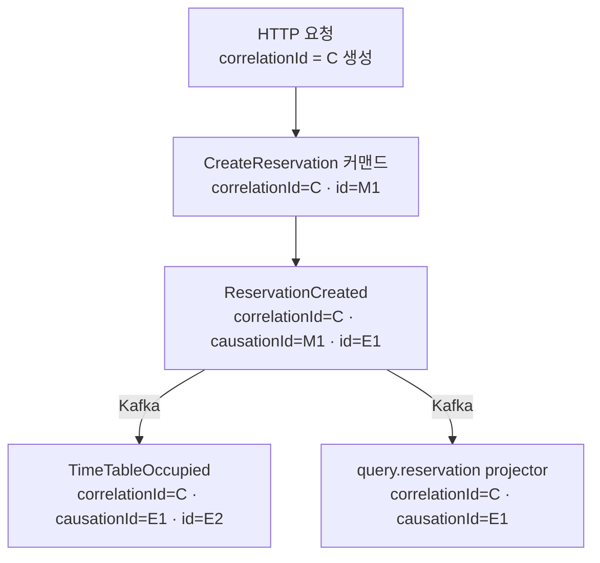
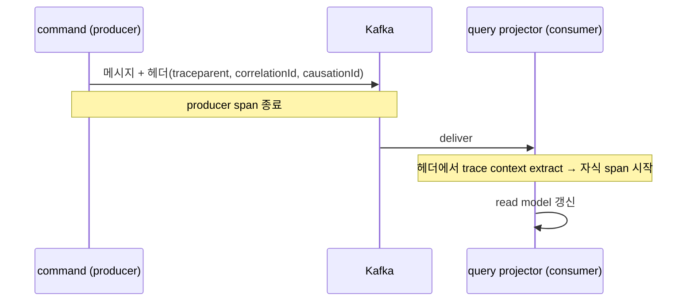

# DESIGN-011: Observability (관측성 횡단)

- **상태**: Accepted
- **작성자**: Team
- **작성일**: 2026-06-30
- **최종 수정일**: 2026-06-30
- **관련 RFC**: RFC-001-v2-cqrs-and-event-sourcing · RFC-008-observability · RFC-007-deployment-infra-ops
- **관련 ADR**: ADR-005(event-store-mysql-table)
- **관련 Design Doc**: DESIGN-001(design-overview) · DESIGN-003(write-model) · DESIGN-008(messaging-topology) · DESIGN-007(consistency-and-sagas)

---

## 1. Background

이벤트 드리븐 + 비동기 경계로 가면 "한 요청이 어디까지 번졌나"가 한 트랜잭션·한 스레드 안에 안 남는다. 커맨드 하나가 이벤트를 낳고, 그 이벤트가 Kafka를 건너 다른 컨텍스트의 프로젝터·다음 커맨드를 깨운다(DESIGN-007). V1의 동기 단일 프로세스에서는 스택 트레이스와 트랜잭션 로그로 충분했지만, V2의 비동기·최종 일관성 구조에서는 경계를 넘는 추적이 없으면 장애 원인을 찾을 수 없다.

Spring Boot 3의 기본 계층(Micrometer Tracing + OTel 브리지)은 HTTP·JDBC 같은 동기 경계에서 span을 자동 생성하고 trace_id를 로그에 찍는다. 그러나 Kafka 비동기 경계·비즈니스 인과 식별자·도메인 메트릭·구조화 로깅은 우리 아키텍처가 강제하는 규약으로 추가 정의해야 한다.

## 2. Goal

- correlationId / causationId 의 정의와 전파 규약을 확정한다.
- `AbstractEvent` 메타데이터 스키마 확장을 확정한다.
- Kafka 비동기 경계의 span 연결 개념(OTel)을 정의한다.
- 구조화 로깅의 필수 필드와 도메인 스코프 주입 방식을 확정한다.
- 메트릭 카탈로그(이름·라벨·단위)를 고정한다.
- 추적 백엔드 스택(OSS)을 선택 고정한다(배선은 보류).

## 3. Non-Goal

- 추적 백엔드 배포 (Grafana/Tempo/Prometheus/Loki) — 별도 운영 작업으로 보류
- 메트릭 수집기 배포 (Prometheus) — 보류
- 대시보드·알림 구성 (Grafana) — 보류
- 로그 수집 파이프라인 구성 (Loki 등) — 보류
- 계측 라이브러리·비동기 경계 context 전파 구체 구현 — 구현 사이클

> 이번 사이클은 *어떤 id를 어디에 심고 어떻게 넘기는가*만 잠근다. YAGNI — 코드에 id 전파 자리만 만들어두면, 백엔드는 나중에 붙여도 추적이 성립한다.

## 4. Proposed Solution

### 4.1 전파 매체 — OTel Context를 진실 원천으로, MDC는 투영

블로킹 MVC라 *한 요청 안*에서는 MDC(ThreadLocal)가 그대로 살아 있다(RFC-008-observability — 코루틴은 기각). 기본 trace_id가 끊기는 곳은 스레드가 바뀌는 *비동기·메시지 경계*뿐이다 — `@Async`·스케줄러, 그리고 Kafka 소비. 그 경계를 넘는 순간 ThreadLocal MDC는 조용히 사라진다 — correlationId가 로그에 찍히다 말다 하는 전형적 증상이 여기서 나온다.

> **왜 블로킹 MVC를 유지하나 — 코루틴 기각(RFC-008-observability).** 영속화가 블로킹 JPA/QueryDSL이라 코루틴을 얹어도 결국 스레드풀로 디스패치돼 throughput 이득은 없고, 디스패처 전환으로 MDC가 깨지는 전파 비용만 진다 — 성능상 마이너스다. 그래서 V2도 블로킹 MVC를 유지하고, IO 확장이 필요해지면 코루틴/WebFlux가 아니라 **virtual thread**(JDK21·Boot 3.4)를 레버로 둔다(DESIGN-010) — 명령형 코드 그대로, MDC도 안 깨진다. 그 결과 본 문서는 "코루틴 컨텍스트 전파" 규약을 다루지 않는다 — 끊김은 위 비동기·메시지 경계에만 남고, 요청 내 MDC 유지가 §4.1~§4.4 전 규약의 전제다.

전파 매체를 **OTel Context로 일급화**하고, MDC는 그것을 로그 포맷에 비추는 *투영*으로만 둔다. 경계별로 — **인-프로세스 비동기(`@Async`·스케줄러)**는 Micrometer context-propagation(`ContextSnapshot`/`taskDecorator`)으로 OTel Context를 넘긴 스레드에 복원하고, **Kafka 경계**는 봉투에 traceparent를 직렬화해 consumer 진입 시 복원한다(§4.3). 어느 쪽이든 로깅 시점에 그 값을 MDC로 복사해 찍는다.

> 이 "전파는 OTel Context, MDC는 투영" 원칙은 trace_id·correlationId뿐 아니라 §4.4의 도메인 스코프 키에도 똑같이 적용된다. 아래 모든 규약(§4.3 Kafka 경계 span 복원, §4.4 구조화 로깅의 스코프 키)이 이 한 매체 위에 선다. 어느 `taskDecorator`·context-propagation 수단으로 비동기 경계를 잇고 어느 경계마다 거는지는 구현 디테일이라 구현 사이클에서 검증한다.

### 4.2 핵심 규약 — correlation id + causation id

분산·비동기에서 인과를 복원하는 두 식별자를 **이벤트 메타데이터에 의무화**한다.

| id | 의미 | 전파 규칙 |
|----|------|-----------|
| `correlationId` | 하나의 **최초 트리거**(사용자 요청·스케줄러 틱)가 낳은 사슬 전체의 공통 id | 사슬 내내 **불변 복사** — 첫 진입에서 생성, 이후 모든 이벤트·커맨드가 그대로 물려받음 |
| `causationId` | 이 이벤트를 **직접 유발한** 메시지(직전 커맨드 또는 직전 이벤트)의 id | 매 단계 **재설정** — "나를 낳은 것의 id" |

핵심 구분: `correlationId` 는 "어느 요청에서 시작됐나"(사슬 전체), `causationId` 는 "바로 직전 무엇이 나를 낳았나"(부모 한 칸). 둘이 있으면 평평한 이벤트 목록에서 **인과 트리**를 재구성할 수 있다.



- `correlationId = C` 는 요청부터 프로젝션까지 동일.
- `causationId` 는 한 칸씩 부모를 가리킨다(`E2` 의 부모는 `E1`).
- 이 그래프가 곧 "어느 커맨드가 어떤 이벤트 사슬을 낳았나"의 답이다.

#### 전파가 끊기면 안 되는 두 경계

1. **command 내부** — 유스케이스가 커맨드의 `correlationId/messageId` 를 받아, 애그리거트가 낸 모든 도메인 이벤트의 메타데이터에 `correlationId=요청의 C`, `causationId=커맨드 messageId` 로 채운다. (DESIGN-003의 `handle→event` 직후 단계.)
2. **이벤트 → 이벤트** — 사가/리액션이 이벤트를 받아 새 커맨드를 낼 때(DESIGN-007), 들어온 이벤트의 `correlationId` 를 그대로 잇고 `causationId = 들어온 이벤트 id` 로 설정한다.

> 끊김 방지의 핵심은 **Outbox 기록 시점**이다. 이벤트가 event_store/Outbox로 들어갈 때 메타데이터가 이미 채워져 있어야 한다 — 발행 단계에서 뒤늦게 채우면 트랜잭션 경계 밖이라 유실 위험.

### 4.3 이벤트 메타데이터 스키마 (`AbstractEvent` 확장)

기존 `AbstractEvent`(`eventType`/`eventVersion`/논리 타입명 다형성 — ADR-010(event-schema-evolution))에 **추적 메타데이터**를 추가한다. 페이로드(비즈니스 데이터)와 메타데이터(추적)는 분리한다 — Zero Payload(DESIGN-003) 원칙과 정합한다.

```kotlin
// 개념 예시 — 실제 필드/이름은 구현 사이클에서 확정
abstract class AbstractEvent(
    val eventType: OutboxEventType,
    val eventVersion: Double,
    // ── 추적 메타데이터 (신규) ──
    val eventId: String,          // 이 이벤트 고유 id (시간기반 UUID 재사용)
    val correlationId: String,    // 사슬 전체 공통 — 불변 전파(필수)
    val causationId: String,      // 직전 메시지 id — 매 단계 재설정(루트에선 비거나 자기 자신)
    val traceparent: String?,     // W3C Trace Context — OTel 추적을 봉투로 직렬화(메시지·재생 경계 넘김)
    val occurredAt: Instant,
)
```

- `eventId` 는 기존 **시간 기반 UUID**(DESIGN-003 재활용 자산)로 생성 — 별도 시퀀스 불필요.
- `traceparent` 는 W3C Trace Context 포맷으로 OTel 추적을 봉투에 직렬화해 메시지·재생 경계를 넘긴다(§4.4). 셋(`correlationId`·`causationId`·`traceparent`)은 DESIGN-003의 **공통 발행 경로**에서 채워져, 발행자가 일일이 신경 쓰지 않아도 추적이 자동으로 흐른다. 구체 타입(문자열 vs 값 객체)과 `traceparent` 를 봉투 헤더에 둘지 페이로드에 둘지는 DESIGN-003 스키마와 맞춰 확정.
- event_store 에 저장될 때 메타데이터도 함께 직렬화된다(ADR-005) — 이벤트 스토어가 곧 **감사 추적 로그**가 된다(시점·인과 포함).
- Kafka 메시지는 메타데이터를 **헤더**로도 노출해, 컨슈머가 페이로드 역직렬화 전에 추적 컨텍스트를 잡게 한다(DESIGN-008의 메시지 봉투).

> 메타데이터는 `contract-module` 의 `AbstractEvent` 에 둔다 — command/query 양측이 공유하는 계약이기 때문(DESIGN-002). 추적은 횡단이므로 컨텍스트별 이벤트가 아니라 공통 봉투에 싣는다.

### 4.4 Kafka 비동기 경계의 분산 추적 (OTel — 개념만)

동기 호출과 달리 Kafka는 producer 스레드와 consumer 스레드가 끊긴다. 분산 추적은 이 끊긴 지점을 **span으로 잇는다.**

- **개념**: producer 가 trace context(traceparent)를 Kafka **메시지 헤더**에 주입 → consumer 가 헤더에서 복원해 자식 span 으로 이어붙임. OTel 의 inject/extract 규약이 이를 표준화한다.
- **두 추적 축의 관계 — 다른 *층*이다(RFC-008-observability)**:
  - `correlationId/causationId` = **비즈니스 인과**(이벤트 스토어에 영구 보존, 우리가 정의·소유).
  - OTel trace/span = **실행 추적**(레이턴시·홉, 백엔드가 단기 보존, 표준 도구가 소유).
  - 둘은 직교한다. OTel `trace_id` 는 *추적 하나*(대개 요청 하나)에 매여 재처리하면 새 값이 발급되지만, "같은 예약 건"이라는 비즈니스 흐름은 여러 추적·여러 재처리에 걸쳐 한 묶음으로 조회돼야 한다. 그래서 `correlationId` 는 **trace_id 위에 얹는 별도 층의 식별자**이며 trace_id가 자동이라고 따라오지 않는다.
  - **규약(격상)**: `correlationId` 를 **모든 root span의 attribute로 심는 것을 필수**로 둔다(과거 "권고"에서 격상). 그래야 Tempo에서 추적을 찾아 `correlationId` 를 뽑고 그 값으로 Loki 로그를 한 번에 끌어오는 교차 조회가 *모든* 흐름에서 보장된다 — 관측성에서 "권고"는 빠진 한 흐름이 하필 장애 흐름이라 사실상 "없음"과 같다. attribute 키 이름·네임스페이스 표준은 구현 사이클에서 못박는다.
- **재처리 시 추적 보존(규약)**: 스케줄러 Outbox 재발행·PoisonMessage 재처리(ADR-008(reservation)) 시 원 `correlationId` 는 **그대로 유지**해 원 흐름과 한 묶음으로 조회되게 하고, "재처리됨"이라는 사실은 `causationId`(재처리를 일으킨 직전 원인) 또는 재처리 표식 attribute로 따로 드러낸다. 새 추적 발급(원 흐름과 인과 끊김)도, 원 추적의 무표식 재사용(재처리 은폐)도 둘 다 피한다 — `correlationId` 는 "같은 비즈니스 흐름"을 묶는 끈이므로 재처리에도 끊지 않고, "재처리"는 인과 한 칸으로 드러낸다. 표식을 attribute로 둘지 메타 필드로 둘지는 ADR-008 재처리 경로와 맞춰 확정.
- **자리만 확보**: 메시지 봉투에 헤더 슬롯(`traceparent`)을 비워두고, 계측 SDK 배선은 todo. 헤더가 있으면 백엔드를 나중에 붙여도 span 연결이 성립한다.



> **보류(todo)**: OTel SDK·Kafka 계측·Collector·백엔드(Tempo 등) 배포. 이번 결정은 "메시지 봉투에 trace 헤더를 싣는다 + correlationId 를 span 속성으로 심는다"는 **규약**까지다.

### 4.5 구조화 로깅 — MDC 구조화 키 + 도메인 스코프 아스펙트

로그는 사슬 추적의 최소 안전망이다(추적 백엔드가 없어도 grep 가능해야 한다). 나아가 로그 자체가 *질의 가능*해야 한다 — 자유 텍스트는 grep만 되고 "이 예약 건의 모든 로그"처럼 구조화된 조회가 안 된다(RFC-008-observability). 그러려면 로그 한 줄마다 구조화된 키 — `trace_id`, `correlationId`, **도메인 스코프**(어느 애그리거트·어느 운영인지) — 가 실려 인덱싱돼야 한다.

- **포맷**: JSON 구조적 로그. 자유 텍스트 금지.
- **필수 필드(모든 로그)**: `trace_id`, `correlationId`, `causationId`(있으면), `context`(예약/식당…)와 도메인 스코프(애그리거트 id·운영 이름), `eventType` 또는 `commandType`.
- **키를 *누가* 넣는가 — 도메인 경계 AOP 아스펙트**: 도메인 메서드마다 손으로 `MDC.put` 을 흩뿌리면 빠뜨리고 일관성이 깨진다. 대신 **도메인 경계(도메인 서비스/커맨드 핸들러 진입)에 AOP 아스펙트를 걸어 스코프 키를 자동 주입**한다 — 그 스코프 안의 모든 로그가 자동으로 키를 달고 나가, 가시성이 코드 산발이 아니라 경계 한 곳에서 일관 보장된다.
- **키가 *경계를 넘어 살아남는가* — 전파 매체=OTel 컨텍스트, MDC=투영**: 블로킹 MVC라 요청 안에선 MDC가 유지되지만, 아스펙트가 raw `MDC.put`(ThreadLocal)만 하면 `@Async`·스케줄러·Kafka 경계를 넘는 순간 그 스코프 키도 trace_id처럼 증발한다(§4.1 전파 원칙과 정합). 그래서 스코프 키도 MDC에 *직접* 박지 않고, **OTel 컨텍스트(특히 키-값을 함께 나르는 Baggage)로 전파**하고 **로깅 시점에 MDC로 투영**해 찍는다. "전파 매체는 OTel 컨텍스트, MDC는 투영" 원칙을 trace_id뿐 아니라 도메인 스코프 키에도 똑같이 적용한다. Kafka 경계는 consumer 진입 시 봉투 헤더에서 복원해 같은 컨텍스트에 싣는다.
- **민감정보**: 페이로드 전체를 찍지 않는다(Zero Payload 와 정합) — 식별자·타입 중심.

> 백엔드 없이도 `correlationId` 한 값으로 한 사슬의 전 로그를 모을 수 있어야 한다 — 이것이 도구 배포를 미뤄도 추적이 성립하는 이유다.

> 표준 스코프 키 집합·아스펙트 적용 경계·OTel Baggage 전파 범위(비동기·메시지 경계별)는 구현 사이클에서 구체화한다(RFC-008-observability).

### 4.6 메트릭 카탈로그 (이름·라벨·단위 — 지금 고정)

무엇을 재느냐는 *지금* 정의한다(RFC-008-observability). 절대 임계 숫자는 측정 전엔 의미가 없어 RFC-007-deployment-infra-ops의 측정 트리거로 미루지만, **이름·라벨·단위**를 카탈로그로 못 박지 않으면 각자 멋대로 메트릭을 찍어 대시보드가 파편화된다. v2 CQRS/ES 구조에서 막히면 가장 먼저 신호가 떠야 할 내부 파이프라인 건강 지표가 대상이다.

| 메트릭 | 무엇을 재나 | 단위 | 라벨(예시) |
|--------|-------------|------|------------|
| 프로젝션 지연 | 이벤트 발생→read model 반영까지 지연(DESIGN-004 최종 일관성 창) | ms (히스토그램) | `context`, `projection` |
| consumer lag | 프로젝터/컨슈머 그룹이 토픽 끝에서 뒤처진 정도 | 메시지 수 (게이지) | `topic`, `partition`, `group` |
| Outbox 적체 | 미발행 Outbox 행 수·최장 대기 시간(DESIGN-008 발행 경계) | 건수·ms (게이지) | `context` |
| PoisonMessage 건수 | 재처리 한도 초과로 격리된 메시지(ADR-008(reservation) 계승) | 건수 (카운터) | `context`, `eventType` |
| 리플레이/스냅샷 복원 시간 | 애그리거트 1건 상태 재구성 비용(DESIGN-009(event-store-lifecycle) 스냅샷 효과) | ms (히스토그램) | `context`, `withSnapshot` |

> **SLI와 층이 다르다** — RFC-007-deployment-infra-ops의 SLI는 "사용자가 느끼는 수준"을, 이 카탈로그는 "내부 파이프라인 건강"을 잰다. 같은 현상을 두 이름으로 재면 혼선이 나므로, 구체 목록 확장·라벨 카디널리티는 RFC-007-deployment-infra-ops SLI 경계와 맞춰 Design에서 다듬는다.

### 4.7 결정 요약

1. **전파 매체는 OTel Context, MDC는 투영.** 블로킹 MVC라 요청 내 MDC는 그대로 살고, 비동기·메시지 경계(`@Async`·스케줄러·Kafka)만 OTel Context로 넘긴다 — trace_id·correlationId·도메인 스코프 키 모두 이 한 매체 위에 선다.
2. **모든 이벤트는 `correlationId` + `causationId` 를 메타데이터로 의무 보유.** `correlationId` 불변 전파, `causationId` 매 단계 재설정. 재처리 시 `correlationId` 유지 + 재처리 사실은 `causationId`/표식으로 드러냄.
3. 추적 메타데이터(`correlationId`·`causationId`·`traceparent`)는 `contract` 의 `AbstractEvent` 에 싣고 event_store·Kafka 헤더에 함께 보존.
4. Kafka 경계는 메시지 헤더로 trace context(traceparent)와 추적 id 를 운반 — **봉투 슬롯만 확보**, SDK 배선은 보류. `correlationId` 는 모든 root span attribute 필수.
5. 구조적(JSON) 로그에 추적 id·도메인 스코프 키 필수 — 스코프 주입은 도메인 경계 AOP 아스펙트로 자동화, 비동기·메시지 경계 전파(OTel Baggage)를 타게. 백엔드 없이도 사슬 복원 가능.
6. **메트릭 카탈로그 이름·라벨·단위 고정**(§4.6) — 임계 숫자는 RFC-007-deployment-infra-ops 측정으로 미룸.
7. **백엔드 스택 = OSS(선택 고정, 배선은 보류)**: OTel 계측(vendor-neutral) → **Prometheus**(메트릭)·**Grafana**(대시보드)·**Tempo**(트레이스)·**Loki**(로그), 자가호스팅. exporter만 교체하면 Datadog 등 상용으로 전환 가능 — 계측은 코드, 백엔드는 설정이라 호스팅/Kafka와 **같은 투명성 원칙**(ADR-012·ADR-013).

## 5. Alternatives Considered

- **correlationId 없이 OTel trace_id만 사용**: trace_id는 추적 하나(보통 요청 하나)에 매이고 재처리 시 새 값이 발급된다. "같은 예약 건"이라는 비즈니스 흐름 묶음이 여러 재처리·재구축을 거쳐도 한 묶음으로 조회될 수 없다 — 기각. correlationId는 trace_id 위에 얹는 별도 층이다.
- **MDC만 사용(OTel Context 없이)**: 블로킹 MVC 요청 내는 충분하지만 `@Async`·스케줄러·Kafka 경계에서 ThreadLocal이 사라진다. 장애가 비동기 경계에서 나면 로그가 끊겨 원인 추적 불가 — 기각.
- **Pact/Schema Registry 기반 이벤트 계약 추적**: 팀 규모·현재 성숙도에서 overspec. 외부 소비자·배포 스큐 발생 시 졸업 경로로 보류.
- **상용 APM(Datadog 등) 즉시 채택**: OTel 계측을 vendor-neutral로 유지하면 exporter 교체만으로 전환 가능. 현재 단계에서 OSS로 시작이 비용·학습 면에서 적합 — OSS 선택, 상용 전환은 운영 성숙도에 따라.

## 6. Details

### 미결정 사항 및 보류(todo)

- **도구 배포** (범위 밖, 스택은 OSS로 고정): OTel SDK/Collector, **Tempo·Prometheus·Grafana·Loki** 배선 — 운영 작업으로 별도 진행.
- 계측 라이브러리·비동기 경계(`@Async`·스케줄러) context 전파 구현 방식 (구현 사이클).
- 스케줄러 재처리·Outbox 재발행 시 추적 id 보존 정책(원 correlationId 유지 vs 재처리 표식 추가) — ADR-008 재처리 경로와 정합 필요.
- 메트릭 카탈로그의 구체 임계 숫자(프로젝션 지연, Outbox 적체, PoisonMessage 건수 등) — RFC-007-deployment-infra-ops 측정 트리거.
- `correlationId` root span attribute 키 이름·네임스페이스 표준 — 구현 사이클에서 못박는다.
- `traceparent` 를 봉투 헤더에 둘지 페이로드에 둘지 — DESIGN-003 스키마와 맞춰 확정.

## 7. Risks & Mitigations

| 위험 | 완화 |
|------|------|
| correlationId 전파 누락으로 추적 끊김 | 공통 발행 경로(DESIGN-003)에서 자동 채움. Outbox 기록 시점에 메타데이터 검증 |
| 비동기 경계에서 MDC 유실 | OTel Context를 진실 원천으로 일급화, MDC는 로깅 시점 투영. `taskDecorator`/ContextSnapshot으로 경계 복원 |
| 재처리 시 원 흐름 추적 끊김 | correlationId 불변 유지 규약. "재처리됨" 사실은 causationId/표식으로 별도 드러냄 |
| 메트릭 파편화 (각자 다른 이름 사용) | 카탈로그(§4.6)를 이름·라벨·단위 수준에서 먼저 고정 |
| 백엔드 미배포 상태에서 추적 불가 | 봉투에 헤더 슬롯 확보 + JSON 구조화 로그로 백엔드 없이도 correlationId grep 가능 |

## 8. Appendix

### 8.1 Glossary

| 용어 | 설명 |
|------|------|
| correlationId | 최초 트리거(요청/스케줄러)가 낳은 이벤트 사슬 전체의 공통 식별자. 사슬 내내 불변 |
| causationId | 이 이벤트를 직접 유발한 직전 메시지 id. 매 단계 재설정 |
| traceparent | W3C Trace Context 포맷. OTel 추적을 메시지 봉투에 직렬화해 비동기 경계를 넘김 |
| OTel Baggage | OTel Context에서 키-값 쌍을 전파하는 메커니즘. 도메인 스코프 키를 경계 넘어 나르는 데 사용 |
| MDC | Mapped Diagnostic Context. SLF4J의 ThreadLocal 기반 로그 컨텍스트. 투영 용도로만 사용 |
| PoisonMessage | 재처리 한도를 초과해 DLQ/격리 큐로 이동된 메시지 |

### 8.2 Reference

- DESIGN-001(design-overview) · DESIGN-003(write-model) · DESIGN-004(read-model) · DESIGN-008(messaging-topology) · DESIGN-007(consistency-and-sagas) · DESIGN-009(event-store-lifecycle) · DESIGN-010(deployment-runtime)
- RFC: RFC-001-v2-cqrs-and-event-sourcing · RFC-008-observability · RFC-007-deployment-infra-ops
- ADR: ADR-005(event-store-mysql-table) · ADR-010(event-schema-evolution)
- 계승: ADR-008(reservation)

## Changelog

| 날짜 | 변경 내용 |
|------|-----------|
| 2026-06-30 | 초안 작성 — DESIGN-011 템플릿 적용, 10-observability.md에서 변환 |

---

## Weakness (Devil's Advocate 반박 포인트)

- **OTel Context 일급화의 구현 리스크를 "구현 디테일"로 밀어냄** — §4.1/§4.5는 "전파 매체=OTel Context, MDC는 투영"을 전 규약의 전제로 삼으면서, 정작 `taskDecorator`/ContextSnapshot으로 경계를 잇는 부분을 구현 사이클로 넘긴다. 그러나 이 전제가 깨지는 곳(스케줄러 스레드풀 경계, Kafka 리스너 컨테이너의 concurrency 스레드, `@Async` 커스텀 executor)이 바로 관측성이 가장 필요한 장애 지점이다. 설계가 "된다고 가정"한 메커니즘이 실제로 안 이어지면, 백엔드를 붙이기도 전에 §4.3~§4.5 규약 전체가 종이 위에서만 성립한다.
- **traceparent 위치 미결정이 스키마를 인질로 잡음** — §4.3은 `traceparent`를 봉투 헤더에 둘지 페이로드에 둘지를 DESIGN-003과 맞춰 확정하겠다고 미룬다. 그런데 event_store에 이벤트를 영구 직렬화(§4.3 "감사 추적 로그")하는 이상, 이 위치 결정은 나중에 바꾸면 **이미 저장된 과거 이벤트의 재직렬화/업캐스팅**을 부른다. "자리만 확보"가 실제로는 되돌리기 비싼 스키마 결정을 미결로 남긴 것이고, ADR-010 스키마 진화 축과의 상호작용을 짚지 않았다.
- **correlationId를 이벤트 메타데이터에 의무화하는 비용** — §4.2/§4.3은 모든 이벤트에 correlationId/causationId/traceparent를 강제한다. Zero Payload(DESIGN-003)로 페이로드를 줄인 이벤트에 추적 메타데이터 3필드가 매 이벤트·매 Kafka 헤더·event_store 매 행에 붙으면, 고빈도 이벤트에서 메타데이터가 페이로드보다 커지는 역전이 생긴다. 감사 로그로서의 값은 인정하되, 이 저장·전송 비용과 카디널리티(§4.6 라벨 폭발과 연동)를 문서가 저울에 올리지 않는다.
- **재처리 시 correlationId 불변 유지 규약의 조회 함정** — §4.4는 재발행/PoisonMessage 재처리에서 원 correlationId를 유지하고 "재처리됨"은 causationId/표식으로 드러낸다. 그러면 한 correlationId 아래 원 시도와 N번의 재처리가 뒤섞여, "이 흐름이 성공했나 실패했나"를 correlationId만으로는 판별할 수 없다(성공 뒤 무관한 재처리, 혹은 실패 뒤 재처리 성공이 같은 끈에 매달림). 인과 트리 재구성은 되지만 흐름의 *결과 상태* 질의는 오히려 흐려진다.
- **AOP 아스펙트 스코프 주입의 경계 정의 공백** — §4.5는 "도메인 경계(도메인 서비스/커맨드 핸들러 진입)에 아스펙트를 걸어 스코프 키 자동 주입"을 결정으로 박지만, 표준 스코프 키 집합·적용 경계·Baggage 전파 범위는 전부 구현 사이클로 미룬다. 아스펙트가 도는 경계 정의가 없으면 어떤 도메인 메서드는 키가 붙고 어떤 건 안 붙는 불균일이 생기고, 이는 "손으로 MDC.put 흩뿌리기"를 자동화로 포장했을 뿐 일관성 보장은 여전히 미결이다. Baggage는 또한 페이로드로 전 하류에 전파되어 카디널리티·PII 유출 표면을 넓힌다.
- **백엔드 배선 전면 보류가 규약을 검증 불가로 만듦** — §3/§4.7은 Tempo·Prometheus·Grafana·Loki 배선을 전부 별도 운영 작업으로 미룬다. 그 결과 "correlationId를 root span attribute로 필수 심는다"(§4.4 격상)나 교차 조회(Tempo→correlationId→Loki) 같은 핵심 규약이 실제로 성립하는지 이 사이클 안에서 확인할 방법이 없다. 규약만 확정하고 그 규약이 도구 위에서 동작하는지는 미확인이라, "권고는 사실상 없음"이라며 필수로 격상한 항목조차 배선 전까지는 검증되지 않은 선언에 머문다.
- **"메트릭 카탈로그 vs SLI"의 이중 계측 위험** — §4.6은 카탈로그(내부 파이프라인)와 RFC-007 SLI(사용자 체감)를 "다른 층"이라며 분리하지만, 프로젝션 지연·consumer lag·Outbox 적체는 양쪽에 사실상 같은 현상으로 등장한다. 두 문서가 각자 이름·라벨·단위를 고정하면 같은 값을 두 계측·두 대시보드로 재는 중복이 생기고, "경계는 Design에서 다듬는다"는 미룸이 그 중복을 봉합하지 못한 채 남긴다.

> 본 절은 리뷰용 반박 정리이며, 문서의 결정을 뒤집지 않는다. 각 항목은 후속 검토 대상.
