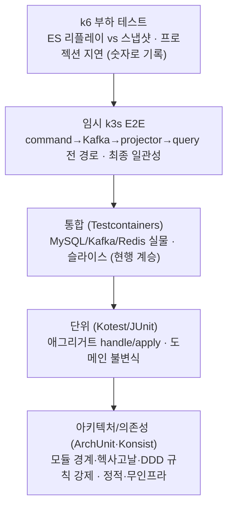
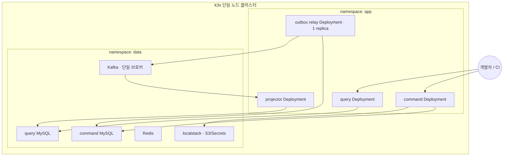

# DESIGN-012: Environments & Testing (로컬·테스트 환경)

- **상태**: Accepted
- **작성자**: Team
- **작성일**: 2026-06-30
- **최종 수정일**: 2026-06-30
- **관련 RFC**: RFC-009-testing-quality-gates, RFC-023-event-schema-contract-management, RFC-004, RFC-005, RFC-012, RFC-013, RFC-015, RFC-022, RFC-002
- **관련 ADR**: [[14.testing-strategy]], [[05.event-store-mysql-table]], [[02.selective-event-sourcing-scope]]
- **관련 Design Doc**: [[DESIGN-001]], [[DESIGN-002]], [[DESIGN-003]], [[DESIGN-004]], [[DESIGN-005]], [[DESIGN-009]], [[DESIGN-010]]

---

## 1. Background

[[DESIGN-010]]이 *프로덕션이 어디서 도는가*(EKS/Kafka/RDS)였다면, 본 문서는 *그 토폴로지를 개발자 노트북과 CI에서 어떻게 재현하고 무엇으로 검증하는가*다. V2는 비동기·최종 일관성·이벤트 스토어라는 새 표면을 들였다 — **"로컬에서 됐는데 운영에서 안 된다"의 표면적이 V1보다 넓다.** 그래서 환경 패리티와 측정을 1급 설계 관심사로 둔다.

> ⚠️ 본 문서는 **목표 환경 전략**이다. 현재(V1)는 docker-compose(MySQL·Redis) + Testcontainers 슬라이스 테스트로 돈다([[DESIGN-001]] current-state 참조). 아래 k3s/localstack/k6는 V2의 도착점이며, 컨텍스트 전환([[DESIGN-005]])에 맞춰 단계적으로 깐다. 인프라부터 빅뱅으로 세우지 않는다(YAGNI).

---

## 2. Goal

- 개발자 노트북과 CI에서 운영(EKS) 토폴로지를 재현할 수 있는 환경 전략을 확립한다.
- 비동기·최종 일관성·이벤트 스토어 표면을 체계적으로 검증하는 테스트 피라미드를 정의한다.
- 분산·ES 패턴의 성능 특성을 추측이 아니라 숫자로 기록하는 측정 습관을 확립한다.
- 환경별 책임(속도 vs 패리티 vs 측정)을 명확히 분리하여 불필요한 과투자를 방지한다.

---

## 3. Non-Goal

- k3s/localstack/k6를 V2 시작 시점에 빅뱅으로 일괄 도입하지 않는다(컨텍스트 전환 단계에 맞춰 점진 도입).
- compose에서 토폴로지 충실도를 추구하지 않는다(과투자).
- k3s를 매 코드 변경마다 띄우지 않는다(과부하).
- 절대 SLO를 지금 정의하지 않는다(베이스라인 측정 후 결정).
- 인프라 레벨 카오스 도구(Chaos Mesh)를 선제 도입하지 않는다.

---

## 4. Proposed Solution

### 4.1 High-Level Architecture

#### 원칙: 두 개의 로컬, 하나의 측정

V2 로컬·테스트 환경은 세 축으로 선다.

1. **속도용 로컬(compose)** — 빠른 피드백. 데이터 면만 띄우고 앱은 IDE에서 부트. 인스턴스 토폴로지는 신경 안 쓴다.
2. **패리티용 로컬·CI(k3s)** — 운영(EKS) 토폴로지를 *모양 그대로* 미러링. 워크로드 분리(command/query/projector/relay)·매니페스트·AWS 서비스(localstack)까지 재현.
3. **측정(k6)** — 비동기·ES의 성능 특성을 **숫자로 기록**한다. 특히 ES 리플레이 vs 스냅샷, 프로젝션 지연.

> 핵심 경계 — **compose는 "코드가 도는가", k3s는 "운영처럼 도는가", k6은 "얼마나 빠른가/뒤처지는가"**를 답한다. 셋을 섞지 않는다. compose에서 토폴로지 충실도를 추구하지 말고(과투자), k3s를 매 코드 변경마다 띄우지 말 것(과부하).

#### 테스트 피라미드

#### k3s 클러스터 구성

### 4.2 Key Design Decisions

- **매니페스트 overlay = Helm** — 차트 + 환경별 values로 운영/로컬 분리. [[DESIGN-010]] GitOps 방향과 정합.
- **E2E 최종 일관성 await = Awaitility, 폴링 50ms / 타임아웃 5s** (기본 컨벤션, 시나리오별 조정 가능).
- **k6 시드 데이터 = 고정 시드 + 스크립트 이벤트 스트림을 픽스처로 커밋** — 재현성(측정·기록 학습목표 직결).
- **이벤트 계약 = 얇은 통합 이벤트 공유 모듈 + 직렬화/스키마 테스트** — 공유 모듈이 컴파일 보장, 직렬화 테스트가 wire 모양 보장. 내부 도메인 이벤트는 공유 금지, 컴파일 보장은 같은 버전 한정. Pact/SCC는 overspec → 외부 소비자·배포 스큐 시 졸업. 계약 본체(생산자·소비자 어긋남 방지)는 [[RFC-009-testing-quality-gates]]에서 [[RFC-023-event-schema-contract-management]]로 분리(topical, not parked) — 본 문서는 그 분리를 참조·요약만 하고, 업캐스팅 축은 [[RFC-022-event-schema-evolution]] 소관이다.
- **행위 명세 = Kotest `BehaviorSpec`** (usecase·service·controller standalone 슬라이스). `.feature`+Cucumber는 비개발자 명세가 실제로 필요해질 때.
- **동적 분산 행위 게이트 = 결정적(멱등성·재생 등가·동시성)은 CI 필수, 무거운 통합(재구축·종단·사가)은 정기/통합 단계.**
- **게이트 차단성 분류**([[RFC-009-testing-quality-gates]]) — 테스트를 "머지 차단 게이트"와 "비-차단 관측"으로 가른다.
  - **차단 게이트(통과 못 하면 머지 불가)**: 아키텍처/의존성 강제(ArchUnit·Konsist, 1순위)·속성 기반·이벤트 계약·업캐스팅 회귀.
  - **비-차단 관측(추세만 본다, 머지 안 막음)**: Chaos Monkey 카오스 주입·k6 부하.
- **비-차단 관측은 별도 리포팅 경로로 가시화한다**([[RFC-009-testing-quality-gates]]) — 게이트로 머지를 막지 않는 테스트(Chaos Monkey·k6)는 그냥 두면 아무도 안 보고 죽은 테스트가 된다. 결과를 게이트 밖에 방치하지 않고 CI 아티팩트·추세 리포트로 매 실행 가시화해(k6는 §5.4의 반복 가능·기록 보존 결과를 전 대비 회귀로, Chaos Monkey는 주입 시나리오별 무손실·복구 관측 결과로) 추세 회귀를 사람이 읽게 둔다. 자동 차단 임계로의 졸업은 베이스라인 측정 후 별도 결정.
- **커버리지 = ratchet(후퇴 금지) 정책**([[RFC-009-testing-quality-gates]]) — 절대 임계 숫자는 측정 후 정하되, 일단 정해지면 **내려가지 않게(점진 상향만)** 잠근다. 숫자는 측정 의존(TBD)이나, "후퇴 금지"라는 정책 자체는 지금 고정.

### 4.3 Interface / Contract

각 환경 계층이 답하는 질문과 책임 경계:

| | compose(속도) | k3s(패리티) | Testcontainers | k6(측정) |
|--|---------------|-------------|----------------|----------|
| 답하는 질문 | 코드가 도는가 | 운영처럼 도는가 | 어댑터가 실물과 맞물리는가 | 얼마나 빠른가/뒤처지는가 |
| 워크로드 분리 | 평탄(모놀리식) | **운영 동일 4분리** | 슬라이스 단위 | k3s 위 측정 |
| 실행 빈도 | 항상(개발 중) | PR/머지 게이트 | 매 빌드 | 주기적·릴리스 전 |
| AWS 서비스 | localstack(선택) | localstack | mock/없음 | k3s 따름 |

### 4.4 Data Model

- **k6 시드 데이터**: 고정 시드 + 이벤트 스트림 픽스처를 리포지터리에 커밋. 재현성 보장.
- **스키마 진화 픽스처**: `(eventType, eventVersion)`별 고정 JSON 픽스처를 버전 관리. 업캐스팅 회귀 검증용.
- **이벤트 계약 공유 모듈**: 얇은 통합 이벤트 모델만 공유. 내부 도메인 이벤트는 절대 공유 금지.

---

## 5. Alternatives Considered

### compose에서 워크로드 분리를 재현하는 방안

compose에도 4개 서비스(command/query/projector/relay)를 올릴 수 있으나, 채택하지 않는다. compose는 토폴로지를 평탄화한다 — 모든 게 한 네트워크의 컨테이너다. 쿠버네티스 스케줄링·probe·매니페스트 정합성은 k3s에서만 검증 가능하다. 분리 재현을 compose에서 추구하면 패리티 환경의 존재 이유가 사라진다.

### Pact/SCC로 이벤트 계약 관리

외부 소비자가 없는 현재 단계에서 Pact/Spring Cloud Contract는 overspec이다. 얇은 공유 모듈 + 직렬화 테스트로 충분하다. 외부 소비자·배포 스큐가 실제로 발생할 때 졸업한다.

### Chaos Mesh 선제 도입

인프라 레벨 카오스(파드 kill·네트워크 분단·broker 파티션·DB failover)는 클러스터 운영 성숙도 비용을 먼저 문다. T-05(무손실·effectively-once) 검증이 실제 운영 리스크로 올라오는 시점을 트리거로 **Chaos Mesh를 1순위 후보**로 예약하되, 지금 도입하지 않는다(YAGNI).

### Cucumber + `.feature` 파일

비개발자가 읽는 `.feature` 명세가 실제로 필요해지면 Cucumber를 얹는다. 현재는 Kotest `BehaviorSpec`으로 Gherkin 구조의 가독성을 얻으면서 `.feature`+Cucumber 글루 machinery를 피한다.

---

## 6. Details

### 6.1 Error Handling

- **동시 append 충돌**: 낙관적 동시성([[05.event-store-mysql-table]])으로 409 반환. 재시도 로직은 command 슬라이스 통합 테스트에서 실물 MySQL 제약으로 검증.
- **projector 다운 중 command 계속 커밋**: Outbox + Kafka로 최종 일관성 보장. E2E에서 projector kill 후 catch-up 검증.
- **사가 타임아웃·보상 실패**: 부분 보상 후에도 종결 도달 여부를 동적 분산 행위 테스트(§5.7)로 검증.

### 6.2 Security Considerations

- **Secrets Manager / SSM**: localstack으로 JWT 시크릿 등 자격 주입 경로 검증. v1 보안 경고 맥락([[DESIGN-001]]).
- **인가 시나리오**: 역할 기반 인가(USER·SELLER·ADMIN)가 command/query 경로마다 옳게 걸리는지 controller(standalone) 행위 명세 위에 인가 시나리오로 검증([[RFC-015-authorization-model]]).
- 토큰 발급·검증 자체는 인증 서버 책임이므로 우리 테스트는 *인가 결정*에 집중한다.

### 6.3 Performance & Scalability

k6 측정 시나리오:

| 시나리오 | 측정값 | 검증 가설 |
|----------|--------|-----------|
| **ES 리플레이 vs 스냅샷** | 애그리거트 로드 p50/p95 — 스냅샷 ON vs OFF | 스냅샷이 리플레이 길이를 N 이하로 묶어 로드 지연을 *유의미하게* 낮추는가([[DESIGN-009]] §1) |
| **스냅샷 주기 N 스윕** | N=50/100/200별 로드 지연·스토리지 증가 | N의 적정값([[DESIGN-009]] TBD)을 데이터로 추천 |
| **이벤트 스트림 성장** | 이벤트 수 1k→10k→100k에서 로드 지연 곡선 | append-only 성장이 핫 경로를 언제 아프게 하는가(파티셔닝 트리거, [[DESIGN-009]] §2) |
| **동시 append 경합** | 같은 애그리거트 동시 command의 충돌율·재시도·처리량 | 낙관적 동시성([[05.event-store-mysql-table]])이 경합에서 어떻게 무너지는가 |
| **프로젝션 지연(lag)** | command→query 반영까지의 시간 분포, Kafka 컨슈머 lag | 최종 일관성의 *실제 지연 예산*([[DESIGN-004]] 미확정 SLI) |
| **쓰기/읽기 독립 스케일** | command 부하가 query 지연에 미치는 영향(분리 효과) | CQRS 분리가 읽기를 쓰기 부하로부터 지키는가([[DESIGN-010]]) |

- **리플레이 vs 스냅샷이 1순위**다 — ES 도입을 정당화/반증하는 가장 직접적인 숫자이고, [[DESIGN-009]]의 N·파티셔닝 TBD를 닫는 근거가 된다.
- k6 결과는 **반복 가능·기록 보존**해야 한다 — 같은 시드 데이터·같은 시나리오로 회귀 추적. 임계 미달 시 실패가 아니라(절대 SLO는 미확정) **추세를 본다**(전 대비 회귀 감지). 측정 환경은 k3s(패리티) 위에서 — compose는 토폴로지가 평탄해 수치가 운영을 대표하지 못한다.

### 6.4 Observability

- k6 결과: CI 아티팩트·추세 리포트로 매 실행 가시화. 전 대비 회귀 감지.
- Chaos Monkey: 주입 시나리오별 무손실·복구 관측 결과를 별도 리포팅 경로로 가시화.
- 비-차단 관측 테스트는 그냥 두면 죽은 테스트가 되므로 반드시 가시화 경로를 가진다.
- [[DESIGN-011]] 관측가능성 전략과 연동.

### 6.5 Migration / Rollback

- k3s/localstack/k6는 [[DESIGN-005]] 컨텍스트 전환 일정에 맞춰 단계적으로 도입한다.
- compose 기반 V1 전략은 V2 전환 완료 전까지 병행 유지.
- V1↔V2 등가성 회귀: [[RFC-013-data-migration-genesis-events]]가 컷오버 게이트로 소유한다(이행 건수·핵심 필드·재구성 상태 일치). 컨텍스트 전환이 끝난 뒤에도 V1 스냅샷과 V2 재구성 상태가 계속 일치하는지 회귀로 지킨다.

---

## 7. Risks & Mitigations

| 리스크 | 완화 |
|--------|------|
| k3s 구축 비용이 과도해 도입이 지연됨 | compose로 먼저 기능 검증. k3s는 PR/머지 게이트 시점에만 띄움(ephemeral). YAGNI 원칙으로 단계 진입 |
| compose와 k3s 매니페스트가 분리되어 드리프트 발생 | Helm 차트 + 환경별 values 단일 출처. [[DESIGN-010]] GitOps와 정합 |
| 절대 SLO 없이 k6 결과가 무시됨 | 비-차단 관측이라도 CI 아티팩트·추세 리포트로 가시화 의무화. 베이스라인 확보 후 절대 임계 설정 |
| 카오스 테스트가 CI를 불안정하게 만듦 | Chaos Monkey 앱 레벨(지연·예외 주입)만 CI 편입. 인프라 레벨(Chaos Mesh)은 T-05 리스크 부상 시까지 연기 |
| 동적 분산 행위 테스트가 빌드를 지나치게 무겁게 함 | 결정적 항목(멱등성·재생 등가·동시성)만 CI 필수. 무거운 통합(재구축·종단·사가)은 정기/통합 단계 분리 |

---

## 8. Milestones & Phases

단계적 도입 순서는 [[DESIGN-005]] 컨텍스트 전환 일정을 따른다.

| 단계 | 환경 목표 | 테스트 목표 |
|------|-----------|-------------|
| **Phase 1: 현행 계승** | compose(MySQL·Redis·Kafka) | 단위 + Testcontainers 통합 슬라이스(V1 계승) |
| **Phase 2: V2 핵심 메커니즘** | compose + 이벤트 스토어 스키마 | 이벤트 스토어 어댑터·Outbox·스냅샷 통합 테스트, ArchUnit/Konsist 도입 |
| **Phase 3: 토폴로지 패리티** | k3s 도입 | E2E(최종 일관성·장애 격리), 동적 분산 행위 결정적 항목 CI 편입 |
| **Phase 4: 측정 확립** | k3s + k6 | k6 베이스라인 측정, 추세 리포트 가시화 |
| **Phase 5: 졸업 트리거** | TBD | 절대 SLO 설정, Chaos Mesh 검토, Pact/SCC 검토 |

---

## 9. Appendix

### 9.1 Glossary

| 용어 | 설명 |
|------|------|
| **패리티** | 로컬/CI 환경이 운영(EKS) 토폴로지를 얼마나 충실하게 재현하는가 |
| **ephemeral k3s** | CI가 테스트를 위해 띄우고 파기하는 임시 k3s 클러스터 |
| **리플레이 결정성** | 같은 이벤트 시퀀스를 fold 하면 항상 같은 상태가 나오는 속성 |
| **최종 일관성 계약** | command 직후 query는 아직 비어있을 수 있고, 짧은 폴링/await 후 일치해야 한다는 V2 사양 |
| **ratchet** | 커버리지 등 품질 지표가 한번 정해지면 내려가지 않게 잠그는 정책 |
| **비-차단 관측** | 머지를 막지 않지만 반드시 가시화해야 하는 추세 측정 테스트 |
| **T-05** | 무손실·effectively-once 보장 요건(사가/Outbox 관련 리스크 항목) |

### 9.2 Calculations / Benchmarks

- k6 측정 시 고정 시드 데이터로 재현성 보장.
- 스냅샷 주기 N 권고값은 §5.4 k6 스윕 결과([[DESIGN-009]])로 도출.
- E2E Awaitility 폴링 50ms / 타임아웃 5s는 기본 컨벤션이며 시나리오별 조정 가능.

### 9.3 Reference

- 속도용 로컬 — docker-compose (§ 아래 본문 §1)
- 패리티용 로컬·CI — k3s (§ 아래 본문 §2)
- AWS 서비스 에뮬레이션 — localstack (§ 아래 본문 §3)
- Docker 이미지 전략 (§ 아래 본문 §4)
- 테스트 피라미드 전체 (§ 아래 본문 §5)
- [[RFC-009-testing-quality-gates]] — 게이트 차단성·커버리지 ratchet·비-차단 관측 가시화 정책 상위 RFC
- [[RFC-023-event-schema-contract-management]] — 이벤트 계약 생산자·소비자 어긋남 방지
- [[RFC-022-event-schema-evolution]] — 업캐스팅 스키마 진화 축
- [[RFC-013-data-migration-genesis-events]] — V1↔V2 등가성 컷오버 게이트 소유
- [[RFC-015-authorization-model]] — 인가 모델 확정(인가 시나리오 슬라이스 결정 트리거)
- [[RFC-012-command-query-api-contract]] — 게이트웨이·인증 서버 전제, command 202·에러 분류 계약
- [[14.testing-strategy]] ADR — 테스트 전략 결정 기록
- [[05.event-store-mysql-table]] ADR — 이벤트 스토어 MySQL 테이블 구조 및 낙관적 동시성
- [[02.selective-event-sourcing-scope]] ADR — 선택적 이벤트 소싱 범위 결정

---

## 상세 내용 (원본 보존)

### §1. 속도용 로컬 — docker-compose

목적: 컨텍스트 하나를 코딩하는 동안의 *초 단위 피드백*. [[DESIGN-010]]의 데이터 면만 컨테이너로 띄우고, command/query 앱은 IDE에서 부트한다.

| compose 서비스 | 운영 대응 | 비고 |
|----------------|-----------|------|
| command MySQL | event_store/state + Outbox | Flyway 마이그레이션 그대로 |
| query MySQL (프로젝션 read model) | projector가 Kafka로 채움 | 로컬은 같은 인스턴스·다른 스키마로 축소 가능 |
| Kafka (단일 브로커, KRaft) | Strimzi (self-managed) | 토픽 자동생성 on |
| Redis | ElastiCache | 세션·캐시(v1 계승) |
| localstack (선택) | AWS S3/Secrets 등 | §3 |

- 워크로드 분리(projector·relay 별 프로세스)는 compose에서 **재현하지 않는다.** 앱은 모놀리식 부트로 띄워 빠르게 돌린다 — 토폴로지 충실도는 k3s의 일이다.
- Outbox relay·projector는 같은 부트 앱 안의 스레드/스케줄러로 돌아도 *기능 검증*엔 충분하다. "별 워크로드여야 한다"([[DESIGN-010]])는 *런타임 격리* 관심사이지 *기능* 관심사가 아니다.

### §2. 패리티용 로컬·CI — k3s 경량 클러스터

목적: 운영(EKS)과 **같은 매니페스트·같은 워크로드 분리**로 도는지 검증. k3s(경량 쿠버네티스)로 EKS를 미러링한다.

#### §2.1 무엇을 미러링하나 (vs 무엇을 단순화하나)

| EKS([[DESIGN-010]]) | k3s 로컬 | 단순화 |
|----------------------|----------|--------|
| 워크로드 4분리(command/query/projector/relay) | **그대로** 4 Deployment | 없음 — 분리는 패리티의 핵심 |
| Strimzi Kafka | namespace 내 단일 브로커 Kafka | 파티션 수 축소·복제 1 |
| command DB + query DB (각 binlog HA) | command/query 2 MySQL(또는 1 인스턴스·2 스키마) | HA standby는 생략, command/query 분리는 유지 |
| ElastiCache | Redis 컨테이너 | |
| AWS S3/Secrets | localstack(§3) | |
| ALB Ingress | k3s 내장 ServiceLB / Ingress | |
| HPA, leader election | 정적 replica | relay는 운영처럼 `replicas: 1` 유지 |

- **분리 토폴로지는 절대 단순화하지 않는다.** "projector/relay가 별 파드"라는 사실이 V2 운영 가정의 핵심이고([[DESIGN-010]] §배치 근거), 로컬에서 합쳐버리면 패리티 환경의 존재 이유가 사라진다.
- **데이터 면 규모는 마음껏 줄인다.** Kafka 파티션·복제, DB 인스턴스 수는 토폴로지가 아니라 용량이므로 축소가 정당하다.
- 매니페스트는 **운영과 단일 출처**를 지향한다 — **Helm 차트 + 환경별 values**로 차이만 분리(결정·미결정에서 Helm 확정). [[DESIGN-010]]의 GitOps 방향과 정합.

#### §2.2 왜 compose만으로 부족한가

compose는 토폴로지를 평탄화한다 — 모든 게 한 네트워크의 컨테이너다. k3s가 추가로 잡아내는 것:

- **워크로드 분리의 실제 동작** — projector가 죽어도 command가 계속 커밋되는가(최종 일관성 격리, [[DESIGN-010]]). compose 모놀리식에선 검증 불가.
- **relay 단일성** — `replicas: 1` 제약과 중복 발행 회피가 쿠버네티스 스케줄링 위에서 성립하는가.
- **매니페스트 자체의 정합성** — probe·리소스·환경변수 주입이 운영 매니페스트와 같은 모양인가. "운영 배포에서 처음 깨지는" 클래스의 버그를 로컬로 당긴다.

### §3. AWS 서비스 에뮬레이션 — localstack

운영이 RDS 외에도 S3·Secrets Manager 등 AWS 서비스에 의존하면, 로컬에서 **localstack**으로 에뮬레이션한다. 데이터 면(MySQL/Kafka/Redis)은 실제 OSS 컨테이너로 띄우는 게 충실도가 높으므로 localstack에 맡기지 않고, **AWS-고유 서비스만** 위임한다.

| AWS 서비스 | 로컬 처리 | 근거 |
|------------|-----------|------|
| S3 (이미지·아카이브 등) | localstack | OSS 동등물이 없는 AWS API |
| Secrets Manager / SSM | localstack | JWT 시크릿 등 자격 주입 경로 검증(v1 보안 경고 맥락) |
| Kafka(Strimzi) | **실제 Kafka 컨테이너** | OSS Kafka = 운영 Strimzi와 동일, 충실도↑ |
| MySQL(RDS) | **실제 MySQL 컨테이너** | 동일 |
| Redis(ElastiCache) | **실제 Redis 컨테이너** | 동일 |

- 원칙: **"AWS여서 다른 것"만 localstack, "어디서나 같은 것"은 실물.** 이벤트 스토어·Outbox·프로젝션은 전부 MySQL/Kafka 위에 있으므로 localstack 의존 0 — V2 핵심 메커니즘 검증은 localstack 없이 가능하다.
- §2.2의 콜드 스토리지 아카이빙([[DESIGN-009]] §2.2)이 오브젝트 스토리지를 쓰게 되면 그 경로는 localstack S3로 검증한다.

### §4. Docker 이미지 전략

command/query/projector/relay는 **같은 빌드 산출물**에서 나온다(워크로드는 같은 Gradle 모듈의 다른 진입점·프로파일, [[DESIGN-010]]). 따라서 이미지 전략의 목표는 *작고 빠르고 재현 가능한* 단일 베이스다.

- **멀티스테이지 빌드**: build 스테이지(JDK + Gradle)와 run 스테이지(JRE만) 분리. 빌드 도구·소스가 런타임 이미지에 새지 않는다.
- **이미지 슬림**: distroless 또는 JRE-slim 베이스. 레이어 캐시가 듣도록 의존성 레이어와 애플리케이션 레이어를 분리(Spring Boot layered jar 활용).
- **단일 이미지, 다중 진입점**: 워크로드 분리가 이미지 4개를 강제하지 않는다 — 같은 이미지에 실행 프로파일(`--spring.profiles.active=command|query|projector|relay`)이나 진입 인자로 역할을 고른다. 빌드·취약점 스캔 표면을 하나로 유지.
- **재현성**: 베이스 이미지 다이제스트 핀(`@sha256`), 빌드 시 의존성 락. CI와 로컬이 같은 이미지를 본다.

> 경계 — compose는 **로컬 빌드 이미지/`bootRun`** 으로 빠르게, k3s는 **CI가 푸시한(또는 로컬 빌드 후 import한) 슬림 이미지**로 운영 패리티를 본다. 둘은 같은 Dockerfile에서 나오되 쓰는 맥락이 다르다.

### §5. 테스트 피라미드

V2의 테스트는 V1의 슬라이스 전략(레이어별 Testcontainers, [[DESIGN-001]] current-state)을 **유지·계승**하고, 그 위에 비동기·토폴로지·성능을 검증하는 두 층을 얹는다.

#### §5.1 단위 — 애그리거트가 1급 시민

- V2에서 애그리거트는 `handle(command) → List<Event>` + `apply(event) → newState`를 스스로 진다([[DESIGN-003]] §A, [[DESIGN-006]]). 이건 **순수 함수에 가깝다 — 인프라 없이 테스트 가능**하고, 가장 값싸고 많아야 한다(피라미드 바닥).
- 핵심 케이스: 불변식 위반 시 예외(취소 기한 등), `handle`이 내는 이벤트의 정확성, `apply` 후 상태 전이, **리플레이 결정성**(같은 이벤트 시퀀스 → 같은 상태).
- Kotest(도메인·core) + JUnit/MockK/AssertJ(application) — v1 레이어 전략 그대로. 도메인이 JPA를 모르므로([[07.command-domain-jpa-separation]]) 단위 테스트에 컨테이너가 필요 없다.

#### §5.2 통합 — Testcontainers (현행 계승)

- 어댑터 슬라이스를 **실물 MySQL/Kafka/Redis 컨테이너**로 검증. V1의 Testcontainers 전략을 그대로 잇되, V2 신규 표면을 추가한다.
- **이벤트 스토어 어댑터**: append 시 `(aggregate_id, sequence_no)` UNIQUE 낙관적 동시성([[05.event-store-mysql-table]]) — *동시 append 충돌 시 한쪽이 실패하고 재시도되는가*를 실물 MySQL 제약으로 검증(단위로는 못 잡는다).
- **Outbox 경로**: BEFORE_COMMIT 기록 + AFTER_COMMIT 발행, 커밋 롤백 시 미발행([[DESIGN-003]]·[[07.reservation]]).
- **스냅샷 적재**: 스냅샷+증분 리플레이 결과 == 전체 리플레이 결과([[DESIGN-009]] §1.5 reconciliation 불변식의 테스트판).
- **projector 멱등성**: 같은 이벤트 2회 소비 → read model 동일([[DESIGN-004]]·[[DESIGN-010]]).

#### §5.3 E2E — 임시 k3s

- 한 컨텍스트의 **전 경로**를 토폴로지 위에서: command 호출 → 이벤트 스토어 append → Outbox relay → Kafka → projector → read model → query 조회.
- **최종 일관성을 명시적으로 테스트**한다 — command 직후 query는 *아직 비어있을 수 있고*, 짧은 폴링/await 후 일치해야 한다. V2에서 "쓰고 바로 읽으면 없다"는 버그가 아니라 사양이다([[DESIGN-004]]). E2E가 이 계약을 고정한다.
- **장애 격리 검증**: projector를 죽인 채 command가 계속 커밋되는지, 되살리면 밀린 이벤트를 따라잡는지([[DESIGN-010]] §배치 근거).
- **임시(ephemeral)**: CI가 k3s를 띄우고 → 테스트 → 파기. 비싸므로 매 커밋이 아니라 PR/머지 게이트에. compose·Testcontainers가 먼저 거른 뒤의 마지막 관문.

#### §5.4 부하 — k6 ("측정·기록" 학습 장치)

> V2의 학습 목표 중 하나는 **분산·ES 패턴의 비용을 추측이 아니라 숫자로 아는 것**이다. k6로 핵심 가설을 부하 시나리오로 박제하고, 결과를 문서·CI 아티팩트로 **기록**한다.

측정 대상 가설은 §6.3 표 참조.

- **리플레이 vs 스냅샷이 1순위**다 — ES 도입을 정당화/반증하는 가장 직접적인 숫자이고, [[DESIGN-009]]의 N·파티셔닝 TBD를 닫는 근거가 된다.
- k6 결과는 **반복 가능·기록 보존**해야 한다. 절대 SLO·자동 게이트화는 TBD — 먼저 **측정 습관과 베이스라인**을 확립하는 게 학습 목표.

#### §5.5 정확성·경계·진화 테스트 — 부하보다 의미 있는 것 (→ ADR [[14.testing-strategy]])

부하 테스트가 *"얼마나 빠른가"*(성능)를 답한다면, ES/EDA/CQRS에서 더 본질적인 건 *"비동기·최종일관성·리플레이·진화 조건에서 맞는가"*(정확성·경계)다. 일부는 §5.2/5.3에 이미 박혀 있고(멱등성·리플레이 결정성·스냅샷 reconciliation·최종일관성 계약·장애 격리), 그 위에 *경계와 진화*를 지키는 층을 명시한다.

| 테스트 | 무엇을 지키나 | 어디서 | 우선 |
|--------|---------------|--------|------|
| **아키텍처/의존성 (ArchUnit·Konsist)** | 모듈 경계·헥사고날·DDD 규칙을 *코드로 강제*: `query↛command 스키마`·`도메인↛JPA`([[07.command-domain-jpa-separation]])·`command↔query는 이벤트로만`. 빈약 도메인·경계 침식을 CI가 잡는다 | 정적·무인프라(단위와 함께) | **1순위** |
| **속성 기반 (Fixture Monkey 확장)** | 무작위 command 시퀀스에서 `fold(events)==state`·불변식·read model 수렴 — ES 정확성의 정수 | 단위~통합 | 상 |
| **이벤트 계약 (공유 통합 이벤트 모듈 + 직렬화 테스트)** | 생산자가 이벤트 모양을 깨면 *컴파일/직렬화 테스트*가 런타임 전에 잡음 — 얇은 통합 이벤트를 공유 모듈로 두어 컴파일 보장을, 직렬화/스키마 테스트로 wire 모양 보장을. 내부 도메인 이벤트는 공유 금지, 컴파일 보장은 같은 버전 한정. Pact/SCC는 overspec, 외부 소비자·배포 스큐 시 졸업. 계약 본체는 [[RFC-023-event-schema-contract-management]]가 소유(생산자·소비자 어긋남 방지), 과거 이벤트를 새 코드로 읽는 업캐스팅 축은 [[RFC-022-event-schema-evolution]]로 분리 | 통합 | 상 |
| **스키마 진화 회귀 (업캐스팅 픽스처 리플레이)** | `(eventType, eventVersion)`별 고정 JSON 픽스처를 최신 코드가 모두 읽어내는지([[10.event-schema-evolution]]) — 영구 이벤트 안전망 | 통합 | 상 |
| **카오스/장애 주입** | "느린가"가 아니라 *"깨져도 사는가"* — 앱 레벨 **Chaos Monkey for Spring Boot**(지연·예외 주입), 인프라 레벨 broker 파티션·DB failover·projector kill 중 무손실·effectively-once(T-05) | E2E+ | 중 |

- **ArchUnit/Konsist가 이 프로젝트 1순위다.** 헥사고날·DDD·빈약 도메인 극복이 핵심 목표인데([[DESIGN-002]]·[[DESIGN-006]]), 그 규칙을 사람 리뷰가 아니라 *테스트가 강제*하면 경계 침식이 머지 전에 막힌다 — 부하 테스트보다 일상적 가치가 크다.
- 속성 기반·계약·업캐스팅 회귀는 단위/통합 층에 얹히고, 카오스는 E2E 위에서 T-05와 만난다.
- **카오스 도구 — 앱 레벨은 확정, 인프라 레벨은 연기**([[RFC-009-testing-quality-gates]]). 앱 레벨(지연·예외 주입)은 **Chaos Monkey for Spring Boot**로 지금 확정한다. 그러나 인프라 레벨(파드 kill·네트워크 분단·broker 파티션·DB failover)은 *지금 도구를 도입하지 않는다* — T-05(무손실·effectively-once) 검증이 실제 운영 리스크로 올라오는 시점을 트리거로 **Chaos Mesh를 1순위 후보**로 둔다. 인프라 카오스를 선제 도입하면 클러스터 운영 성숙도 비용만 먼저 무는 과투자다(YAGNI).

#### §5.6 행위 명세(Gherkin) — 살아있는 명세

테스트가 "도는가"를 넘어 "이 동작이 무엇인가"를 비즈니스 언어로 적으면 곧 살아있는 명세가 된다([[RFC-009-testing-quality-gates]]). Given-When-Then을 세 슬라이스에 깐다(현행 슬라이스 전략과 같은 결).

- **usecase(application)**: 출력 포트를 목으로 두고 "주어진 커맨드·포트 상태 → 어떤 포트 호출·결과"를 시나리오로. 오케스트레이션 행위를 고정한다.
- **service(domain)**: "주어진 도메인 상태 → 도메인 서비스 호출 → 어떤 불변식·결과". 순수 도메인 로직을 비즈니스 언어로 박는다.
- **controller(standalone)**: 전체 Spring 컨텍스트 없이 standalone MockMvc로 "주어진 HTTP 요청 → 어떤 상태·바디". [[RFC-012-command-query-api-contract]]의 계약(202·에러 분류 등)이 여기서 행위로 검증되고 REST Docs와 엮인다.

도구는 **Kotest `BehaviorSpec`을 기본**으로 본다 — Gherkin 구조의 가독성은 얻으면서 `.feature`+Cucumber 글루 machinery는 피한다(§5.5 계약 절과 같은 overspec 회피 결). 비개발자가 읽는 `.feature` 명세가 실제로 필요해지면 그때 Cucumber를 얹는다. property-based(§5.5)와는 층이 다르다 — 행위 명세는 *명명된 시나리오*로 동작을 고정하고, property-based는 *무작위 입력*으로 불변식을 흔든다(보완 관계).

#### §5.7 동적 분산 행위 — 정적 구조 너머

§5.5까지가 코드의 *구조*(경계·계약·불변식)를 잡는다면, 여기서는 런타임에 분산이 일으키는 *행위*를 잡는다. ES/EDA가 실제로 깨지는 곳이고, 각 항목은 다른 RFC가 결정한 메커니즘과 짝지어 "그 결정이 진짜 도는지"를 본다([[RFC-009-testing-quality-gates]]).

| 행위 | 무엇을 본다 | 출처 | 게이트 |
|------|-------------|------|--------|
| **멱등성·재전달** | 같은 이벤트·요청 2회 적용 → 상태 동일(전달 멱등·프로젝터 멱등·요청 멱등) | [[RFC-003-messaging-delivery]]·[[RFC-011-projection-rebuild-catchup]]·[[RFC-012-command-query-api-contract]] | 결정적 → CI 필수 |
| **프로젝션 재구축·catch-up** | 리플레이로 세운 read model == 라이브 투영, blue-green 스왑 원자성, catch-up이 readiness까지 수렴 | [[RFC-011-projection-rebuild-catchup]] | 무거움 → 정기/통합 |
| **사가 보상·타임아웃** | 타임아웃 → `SeatReleased`, 확정 실패 → `PaymentRefunded` 되감기, 부분 보상 후에도 종결 도달 | [[RFC-006-saga-process-manager]] | 무거움 → 정기/통합 |
| **이벤트 재생·스냅샷 등가** | 스냅샷+이후 이벤트 재수화 == 처음부터 풀 리플레이(업캐스팅 회귀와는 다른 축 — 리플레이 정확성) | [[RFC-004-event-store-schema-evolution]] | 결정적 → CI 필수 |
| **동시성·낙관적 락** | 같은 애그리거트 동시 append → 기대 버전 충돌이 409로 정확히 걸림 | [[RFC-004-event-store-schema-evolution]]·[[RFC-012-command-query-api-contract]] | 결정적 → CI 필수 |
| **종단 비동기 라운드트립** | command→이벤트→프로젝션→query 끝까지 흐름, 그 사이 read-your-writes 신선도가 규약대로 | [[RFC-002-read-model-consistency]]·[[RFC-012-command-query-api-contract]] | 무거움(TC+Kafka) → 정기/통합 |

- 일부는 §5.2/5.3에 이미 박혀 있다(projector 멱등성·스냅샷 reconciliation·최종 일관성 계약·장애 격리) — 이 표는 그 묶음을 *동적 분산 행위*라는 한 범주로 묶고, 빠진 축(사가 보상·동시성 충돌·재구축 수렴)을 채운다.
- 보상 경로는 가장 안 짜이고 가장 늦게 터지는 곳이라 명시적으로 테스트한다.
- 게이트 성격이 갈린다 — **결정적**(멱등성·재생 등가·동시성)은 CI 필수, **무거운 통합**(재구축·종단·사가)은 정기/통합 단계. (⚠️) 이 범주는 스토어·Kafka를 띄워야 해 빌드가 무거워진다 — 무엇을 모킹으로 경량화하고 무엇을 실물(Testcontainers+Kafka)로 도울지는 항목별로 Design에서 가른다.

##### V1↔V2 등가성 회귀

[[RFC-013-data-migration-genesis-events]]가 컷오버 게이트로 **소유**한다(이행 건수·핵심 필드·재구성 상태 일치). 본 전략에서는 그 등가성 검증을 *회귀 스위트로 편입*하는 자리만 잡는다 — 컨텍스트 전환이 끝난 뒤에도 V1 스냅샷과 V2 재구성 상태가 계속 일치하는지 회귀로 지킨다.

#### §5.8 인가·인증을 행위로 검증한다

[[RFC-012-command-query-api-contract]]가 게이트웨이·인증 서버를 전제로 깔지만, 역할 기반 인가(USER·SELLER·ADMIN)가 command/query 경로마다 옳게 걸리는지는 별도 범주로 둔다([[RFC-015-authorization-model]]). 권한 없는 호출이 거부되고 권한 경계가 컨텍스트마다 일관된지를, controller(standalone) 행위 명세(§5.6) 위에 인가 시나리오로 얹는다. 토큰 발급·검증 자체는 인증 서버 책임이므로 우리 테스트는 *인가 결정*에 집중한다. (인가 규칙이 도메인 깊숙이 들어가는 경우 controller 슬라이스만으로 부족할 수 있어, usecase 슬라이스에도 인가 시나리오가 필요한지는 Design에서 본다.)

---

## Changelog

| 날짜 | 버전 | 변경 내용 | 작성자 |
|------|------|-----------|--------|
| 2026-06-30 | 1.0 | 최초 작성 (11-environments-and-testing.md에서 DESIGN-012 템플릿으로 재구성, 크로스레퍼런스 새 번호 체계로 업데이트) | Team |
