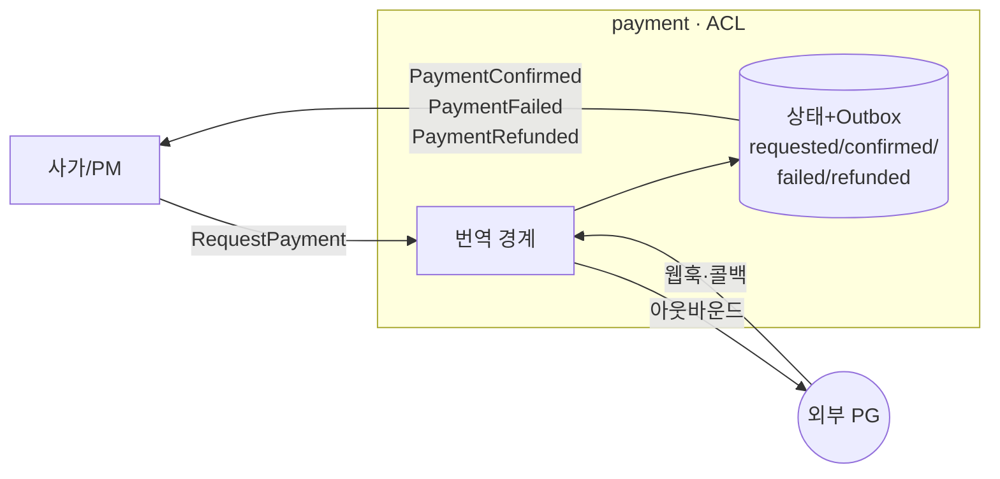
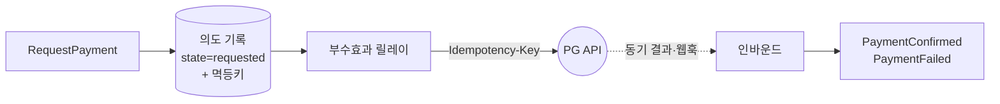

# DESIGN-015: Payment Integration (결제 연동 경계)

- **상태**: Accepted
- **작성자**: Team
- **작성일**: 2026-06-30
- **최종 수정일**: 2026-06-30
- **관련 RFC**: [[RFC-016-payment-integration-boundary]] · [[RFC-006-saga-process-manager]] · [[RFC-003-messaging-delivery]]
- **관련 ADR**: [[08.saga-orchestration-vs-choreography]] · [[09.event-ordering-and-delivery-guarantee]] · [[15.payment-acl-boundary]]
- **관련 Design Doc**: [[DESIGN-001]] · [[DESIGN-003]] · [[DESIGN-007]] · [[DESIGN-008]] · [[DESIGN-013]]

---

## 1. Background

`payment`는 V2에서 새로 끌어들인 컨텍스트다([[RFC-006-saga-process-manager]] 사가의 결제 단계). 두 가지가 다른 컨텍스트와 다르다. 첫째, **계승할 V1이 없다** — V1 코드베이스에 결제 흔적(payment·refund `.kt`·마이그레이션)이 0건이라 "어떻게 옮기나"가 아니라 그린필드 경계 설계다. 둘째, **우리가 통제하지 못하는 외부 PG(결제 게이트웨이)와 말한다** — `PaymentConfirmed`는 우리가 마음대로 내는 이벤트가 아니라 외부 세계가 그렇다고 말해 줘야 비로소 낼 수 있는 이벤트다.

이 문서는 그 외부 진실을 우리 도메인 이벤트로 들이는 길, 우리 의도를 밖으로 내보내는 길, 둘이 어긋났을 때 맞추는 길을 *어떻게 짓는가*로 푼다.

> ⚠️ 본 문서는 **목표 경계 설계**다. 지금 붙일 실 PG가 없으므로 구현은 PG 포트 + 스텁/시뮬레이터로 시작하며(아래 §6.5), 실 PG 연동 시점·벤더는 별도 사이클이다. 단 *경계의 모양*은 실 PG 유무와 무관하게 동일하다.

## 2. Goal

- `payment` 컨텍스트를 ACL(Anti-Corruption Layer)로 정의하고, 외부 PG와의 번역 책임 경계를 확정한다.
- PG 알림(웹훅·콜백)을 도메인 이벤트로 안전하게 들이는 인바운드 규율을 확정한다.
- 아웃바운드 PG 호출에서 dual-write 함정을 회피하는 의도-먼저 기록 패턴을 확정한다.
- 보상(환불)에서 PM과 ACL의 책임 경계를 확정한다.
- 주기적 대사(reconciliation)를 통해 외부 진실과 우리 상태를 안전망으로 맞추는 원칙을 확정한다.
- 실 PG 없이 경계를 검증하는 포트+스텁 전략을 확정한다.
- 사가에 노출하는 이벤트 표면을 3개로 동결한다.

## 3. Non-Goal

- 실 PG 벤더 선정 및 실 연동 구현 (별도 사이클).
- 결제 거래 상태 모델 스키마 상세 (구현 사이클에 위임).
- 인바운드 ACL 웹훅 서명 검증 알고리즘 선택 (구현 사이클에 위임).
- 아웃바운드 릴레이를 전용으로 둘지 공용으로 둘지 (구현 사이클에 위임).
- 대사 주기·소스(정산 파일 vs 조회 API) 구체값 (구현 사이클에 위임).
- ES(이벤트 소싱) vs 상태+Outbox 내부 선택 (컨텍스트 내부 결정으로 미룸).

## 4. Proposed Solution

### 4.1 High-Level Architecture

`payment`를 V2의 쓰기 모델 두 갈래([[DESIGN-003]] §A·§B) 중 하나(ES냐 상태+Outbox냐)에 욱여넣으면 출발점이 틀린다. `payment`의 본질은 *데이터 모델*이 아니라 **외부 시스템과의 번역**이다.

PG는 자기 어휘로 말한다 — `transactionId`, `paid`/`failed`/`cancelled`/`partially_refunded`, 자기 타임스탬프·재시도 규약. 이걸 날것으로 도메인에 흘리면 벤더 모델이 사가 안으로 새어 들어온다(벤더를 바꾸면 사가가 깨진다). 그래서 `payment`는 **ACL(Anti-Corruption Layer)** 로 짓는다. 바깥으로는 PG의 언어를 받고, 안쪽으로는 우리 도메인 이벤트로 번역한다 — 이것이 이 컨텍스트의 유일한 책임이다.

**PG가 무엇이든(토스·아임포트·스트라이프·가짜 스텁) 사가가 보는 표면은 세 이벤트로 고정된다** — `PaymentConfirmed`/`PaymentFailed`/`PaymentRefunded`.

데이터는 **상태+Outbox 패턴**으로 둔다([[DESIGN-003]] §B). 결제 거래의 현재 상태를 테이블로 들고, 같은 트랜잭션에서 도메인 이벤트를 Outbox에 적어 사가로 흘린다. ES로 갈 이유는 약하다 — 결제 거래의 진실 원천은 우리가 아니라 PG의 원장이고, 우리 이력은 콜백을 받아 적은 *그림자*다.

> 이의 여지(Design): 분쟁·부분환불·재시도가 겹치면 내부 상태 전이가 풍부해져 ES가 다시 후보가 된다. 어느 쪽이든 사가가 보는 바깥 표면은 세 이벤트로 같으므로 ES↔상태 선택은 컨텍스트 내부 결정으로 미뤄도 사가 계약은 흔들리지 않는다.

### 4.2 Key Design Decisions

1. **사가 계약 동결**: `payment`가 사가에 노출하는 이벤트는 **`PaymentConfirmed`·`PaymentFailed`·`PaymentRefunded` 셋으로 동결**한다([[DESIGN-007]] 보강). 컨텍스트 내부가 ES든 상태든, PG가 무엇이든 이 표면은 바뀌지 않는다.

2. **진실 원천은 PG**: 우리 상태는 PG 원장의 사본이다. 확정의 근거는 콜백이 아니라 웹훅 + verify 조회다.

3. **의도-먼저 기록**: PG 호출(부수효과)과 이벤트 기록을 원자적으로 묶으려는 시도를 포기하고, 기록된 의도 + 멱등키 + 재시도 가능한 릴레이로 at-least-once 호출을 effectively-once 청구로 만든다.

4. **환불은 새 정방향**: 보상을 롤백이 아닌 정방향 흐름과 동일한 경로로 처리한다. 환불도 아웃바운드 릴레이를 타고 멱등을 보장한다.

5. **대사는 단방향 안전망**: PG가 진실이므로 자동 보정은 우리 상태를 PG에 맞추는 방향으로만 한다.

### 4.3 Interface / Contract

`payment`가 사가에 노출하는 인바운드 커맨드와 아웃바운드 이벤트:

| 방향 | 이름 | 설명 |
|------|------|------|
| 인바운드 커맨드 | `RequestPayment` | 사가/PM이 결제 요청 위임 |
| 인바운드 커맨드 | `RefundPayment` | 사가/PM이 환불 요청 위임 |
| 아웃바운드 이벤트 | `PaymentConfirmed` | PG 결제 확정 → 도메인 이벤트 번역 (동결) |
| 아웃바운드 이벤트 | `PaymentFailed` | PG 결제 실패 → 도메인 이벤트 번역 (동결) |
| 아웃바운드 이벤트 | `PaymentRefunded` | PG 환불 완료 → 도메인 이벤트 번역 (동결) |

PG 인터페이스(포트) — ACL이 외부 PG와 말하는 경계:

| 방향 | 설명 |
|------|------|
| 아웃바운드 (포트) | PG API 호출: 결제 요청, 환불 요청, verify 조회 |
| 인바운드 (웹훅 엔드포인트) | PG 서버-투-서버 알림 수신 |
| 인바운드 (리다이렉트 콜백) | 브라우저 경유 UX 신호 수신 (비신뢰, verify 트리거용) |

멱등키 계약: ACL이 PG를 호출할 때 PG의 `Idempotency-Key` 헤더에 우리가 생성한 멱등키를 넘긴다. 사가에는 멱등키 계약을 강제하지 않는다([[DESIGN-013]]).

### 4.4 Data Model

결제 거래 상태 — 상태+Outbox 패턴 ([[DESIGN-003]] §B):

| 상태 | 의미 |
|------|------|
| `requested` | 결제 의도 기록 완료, PG 호출 전 또는 응답 대기 중 |
| `confirmed` | PG verify 통과 후 `PaymentConfirmed` 발행 완료 |
| `failed` | PG 실패 확정 후 `PaymentFailed` 발행 완료 |
| `refunded` | PG 환불 완료 후 `PaymentRefunded` 발행 완료 |
| `partially_refunded` | 부분 환불 완료 (상세 표현은 구현 사이클) |

인바운드 디듀프 테이블: PG 거래 ID를 멱등키로 하여 처리한 거래 ID를 기록. GC 정책은 구현 사이클에 위임.

## 5. Alternatives Considered

### ES(이벤트 소싱) 도입

- **검토 이유**: V2 쓰기 모델의 한 갈래이므로 payment에도 적용 가능.
- **기각 이유**: 결제 거래의 진실 원천은 PG 원장이고 우리 이력은 그림자다. 상태+Outbox로 충분하며, ES를 도입하면 불필요한 복잡도가 늘어난다. 단, 분쟁·부분환불·재시도가 겹쳐 내부 상태 전이가 풍부해지면 ES를 재검토할 수 있다. 사가 표면(세 이벤트)은 어느 쪽이든 동일하다.

### 콜백을 결제 확정 근거로 사용

- **검토 이유**: 브라우저 리다이렉트 콜백이 먼저 도착하므로 빠른 확정 가능.
- **기각 이유**: 콜백은 "사용자가 결제창을 마쳤다"는 UX 신호일 뿐 돈이 움직였다는 근거가 아니다. 콜백을 위조·재전송하면 미결제 예약이 확정될 수 있다. 진실은 웹훅 + verify 조회다.

### 공용 부수효과 릴레이 사용

- **검토 이유**: [[DESIGN-008]] 메시징 토폴로지의 공용 릴레이를 재사용하면 인프라 단순화.
- **상태**: 미결. 결제 전용 릴레이 vs 공용 릴레이는 구현 사이클에서 결정한다.

## 6. Details

### 6.1 Error Handling

**인바운드 — PG 알림을 도메인 이벤트로 들이는 세 겹**

PG는 결과를 두 경로로 알린다. **리다이렉트 콜백**(브라우저 경유 — 비신뢰·유실 가능)과 **웹훅**(서버-투-서버)이다. 둘 다 비동기이고 둘 다 못 믿는다.

**결제 확정의 진실은 콜백이 아니라 웹훅 + 검증 조회(verify)로 받는다.** 콜백이 와도 곧장 `PaymentConfirmed`로 승격시키지 않고, **PG에 거래를 역조회해 금액·상태가 우리 기대와 일치하는지 확인한 뒤** 이벤트를 낸다.

들어오는 알림 자체가 비신뢰·순서 어긋남·중복·유실이 기본값이므로, ACL 인바운드 입구에 세 겹을 둔다.

| 겹 | 막는 것 | 방법 |
|----|---------|------|
| **진위 검증** | 위조 알림 | 웹훅 서명(HMAC/공개키) 검증, 통과 못 하면 도메인에 닿기 전 폐기 |
| **멱등 흡수** | 중복 통지(웹훅 2회, 콜백+웹훅 같은 사실 2경로) | PG 거래 ID를 멱등키로 한 **인바운드 디듀프 테이블** — 처리한 거래 ID면 no-op |
| **순서 무력화** | `refunded`가 `confirmed`보다 먼저 도착 | 도착 순서로 전이하지 않고, 알림이 실어 온 PG 측 상태/타임스탬프(또는 verify 결과)로 *수렴* — 늦게 온 옛 상태는 무시 |

멱등 흡수는 [[RFC-003-messaging-delivery]]의 전달 멱등(컨슈머 inbox)과 같은 발상을 ACL 입구에 적용한 것이고, [[DESIGN-013]]의 요청-단 멱등과는 또 다른 층이다 — 셋 다 독립적으로 필요하다(우리 클라이언트 더블클릭 ↔ 전달 중복 ↔ 외부 PG 중복 통지).

한 줄 요약 — **외부의 비신뢰 입력 → (검증·디듀프·verify) → 신뢰할 수 있는 도메인 이벤트**.

**아웃바운드 — 의도를 먼저 기록한다 (dual-write 함정 회피)**

사가가 `RequestPayment`를 보내면 ACL은 PG API를 호출해야 하는데, 이건 **부수효과이자 비-트랜잭션**이다. 순진하게 한 트랜잭션에서 (a) PG에 HTTP 결제 요청 + (b) 결과를 우리 상태/이벤트로 기록하면, 둘은 원자 단위가 아니다 — PG 호출은 성공했는데 커밋 직전 죽으면 **돈은 빠져나갔는데 우리는 모른다.** at-least-once 재처리 아래선 곧장 **이중 청구**다.

[[RFC-003-messaging-delivery]]의 부수효과-Outbox 노선을 그대로 적용한다 — **의도를 먼저 로컬 트랜잭션으로 기록하고, 별도 릴레이가 그 의도를 보고 PG를 호출하며, 결과를 다시 이벤트로 적는다.**

1. `RequestPayment` 수신 → *PG를 부르지 않고* "결제 요청 의도"를 로컬 트랜잭션으로 기록(state=requested, **멱등키 생성**).
2. 부수효과 릴레이가 의도를 집어 PG API 호출 — **PG의 Idempotency-Key에 그 멱등키를 넘긴다.** 릴레이가 재시도해 같은 호출이 두 번 나가도 PG 쪽 멱등으로 *돈은 한 번만* 움직인다. (우리 클라이언트에는 멱등키 계약을 안 지웠지만 — [[DESIGN-013]] — *우리가 PG의 클라이언트일 때*는 정확히 그 패턴을 우리가 쓴다.)
3. PG 응답(동기 또는 웹훅)은 인바운드(§6.1 세 겹)로 들어와 `PaymentConfirmed`/`PaymentFailed`로 번역된다.

요지 — PG 호출과 이벤트 append를 원자적으로 묶으려는 시도 자체를 포기하고, "기록된 의도 + 멱등키 + 재시도 가능한 릴레이"로 **at-least-once 호출을 effectively-once 청구로** 만든다([[DESIGN-008]]와 같은 결).

> 이의 여지(Design): Idempotency-Key 미지원 PG에선 호출 전 verify로 "이미 청구됐나"를 확인하는 보수 경로가 필요하다. 부수효과 릴레이를 결제 전용으로 둘지 공용 릴레이에 태울지도 Design.

**보상 — 환불은 새 정방향이지 롤백이 아니다**

결제까지 됐는데 예약 확정이 깨지면 사가는 환불로 되감는다([[DESIGN-007]] 보상: `PaymentConfirmed` ↔ `PaymentRefunded`). 두 가지를 못 박는다.

먼저 **PM과 ACL의 책임 경계**를 분명히 한다([[RFC-006-saga-process-manager]]). 보상을 *언제* 돌릴지 — 흐름의 현재 위치를 보고 "확정이 깨졌으니 환불하라"를 판단하고 트리거하는 것 — 은 흐름 전체 상태를 든 **PM(프로세스 매니저)의 몫**이다. PM은 오케스트레이션·보상 트리거(환불 명령)·타임아웃 감시를 소유한다. 반면 그 환불 명령을 받아 *어떻게* 외부 PG에 환불을 성사시킬지 — 호출 실패 흡수·재시도·중복 통지 무력화·verify·대사 — 는 전적으로 ACL이 자기 경계 안에서 흡수한다. 즉 PM은 외부 PG의 비동기·실패를 보지 않고 `payment`에 `RefundPayment` 한 단계를 위임할 뿐이며, 그 결과는 `PaymentRefunded` 한 이벤트로만 돌아온다 — 외부 연동의 불확실성이 예약 사가 본류로 새지 않게 하는 것이 이 경계의 목적이다.

- **환불도 아웃바운드 호출**이라 dual-write 함정을 똑같이 탄다 → "의도 기록 → 멱등키 단 릴레이 호출 → 결과 이벤트"의 같은 경로를 쓴다. 보상이라고 특별 취급하지 않는다.
- **환불은 반드시 멱등**이다([[DESIGN-007]]). 사가가 타임아웃에 보상을 두 번 트리거하거나 환불 웹훅이 중복으로 와도 *이중 환불*이 나면 안 된다. 정방향 청구와 같은 멱등키 공간을 쓰되, "이미 환불된 거래면 무시"를 PG verify로 판별한다 — 외부 상태를 진실로 삼는 인바운드 규율을 보상에도 적용한다.

### 6.2 Security Considerations

- **웹훅 서명 검증**: 모든 인바운드 PG 알림은 HMAC 또는 공개키 서명을 검증한다. 검증 실패 시 도메인 로직에 닿기 전 즉시 폐기한다.
- **멱등키 공간 분리**: 청구 멱등키와 환불 멱등키는 이중 청구·이중 환불을 방지하기 위해 충돌하지 않도록 설계한다. 구체 키 생성·전달 규약은 구현 사이클에 위임.
- **PG 자격 증명 관리**: PG API 키·웹훅 시크릿은 환경 변수 또는 시크릿 스토어로 관리한다. 코드·로그에 노출 금지.
- **verify 조회 강제**: 콜백만으로 결제를 확정하지 않는다. PG를 역조회해 금액·상태 일치를 확인한 뒤 이벤트를 낸다.

### 6.3 Performance & Scalability

- **부수효과 릴레이 재시도**: 릴레이가 재시도하더라도 PG 멱등키가 보호하므로 이중 청구 없이 수평 확장 가능하다.
- **인바운드 디듀프 테이블 GC**: 오래된 거래 ID 항목은 주기적으로 정리해 테이블 크기를 관리한다. 주기는 구현 사이클에 위임.
- **대사 주기**: 대사 작업은 PG 조회 API 또는 정산 파일을 소스로 주기적으로 실행한다. 주기·소스는 벤더에 달리며 구현 사이클에 위임.

### 6.4 Observability

- 인바운드 각 겹(진위 검증 실패·디듀프 히트·순서 무력화)별 카운터 지표를 노출한다.
- 부수효과 릴레이 재시도 횟수·실패 이벤트를 추적한다.
- 대사 미스매치(우리 상태 vs PG 원장 불일치)는 운영 보정 큐 알람으로 노출한다.
- 자동으로 못 푸는 어긋남(금액 불일치·정체불명 거래)은 [[RFC-003-messaging-delivery]]의 DLQ 수동 루프처럼 **운영 보정 큐**로 올린다.

### 6.5 Migration / Rollback

- 계승할 V1이 없다 — 그린필드이므로 마이그레이션은 불필요하다.
- **실 PG 없이 학습하기 — 포트 + 스텁**: 지금 붙일 실 PG가 없다. "가짜 인라인 호출"로 때우면 ACL·웹훅·멱등·대사라는 *배울 가치가 있는 구조*가 통째로 증발한다. 그래서 **PG 인터페이스(포트)는 실제처럼 정의하고, 그 뒤에 비동기·실패·중복을 흉내 내는 PG 스텁/시뮬레이터를 꽂는다** — 스텁이 지연 후 웹훅을 콜백으로 쏘고, 가끔 중복·유실·순서뒤집기를 일으켜 우리 인바운드 방어(§6.1 세 겹)가 진짜로 동작하는지 검증한다. 핵심은 *경계의 모양*(ACL 포트 + 웹훅 인바운드 + 부수효과 릴레이 + 대사)이 실 PG 유무와 무관하게 동일하다는 것이다.
- 실 PG 롤백: 실 PG 연동 사이클에서 포트 구현체만 교체하면 된다. 사가 계약(세 이벤트)과 내부 ACL 구조는 변경 없다.

## 7. Risks & Mitigations

| 위험 | 완화 |
|------|------|
| PG 웹훅 유실 → `PaymentConfirmed` 미발행 → 예약 확정 안 됨 | 대사(§6.4)가 주기적으로 PG 원장과 비교해 누락된 이벤트를 늦게라도 발행한다 |
| 멱등키 미지원 PG → 릴레이 재시도 시 이중 청구 | verify-before-call 보수 경로: 호출 전 PG verify로 "이미 청구됐나" 확인 후 호출. 구현 사이클에 위임 |
| 보상 이중 트리거 → 이중 환불 | 환불도 동일 멱등키 공간 + PG verify로 "이미 환불됐나" 판별. PG 원장이 진실이므로 이중 환불 차단 |
| verify 조회 타임아웃 → 확정 지연 | 재시도 정책 + 대사 안전망 병행. 구현 사이클에 위임 |
| 스텁과 실 PG 동작 차이 → 운영 환경 예상 외 동작 | 스텁에 결함 주입(지연·중복·유실·순서뒤집기)을 충분히 구현해 실 PG 유사 시나리오를 사전 검증 |
| 벤더 변경 시 도메인 영향 | ACL 경계가 벤더 모델을 흡수. 사가가 보는 세 이벤트 표면은 변경 없음 |

## 8. Milestones & Phases

| 단계 | 목표 | 산출물 |
|------|------|--------|
| **Phase 1 — ACL 경계 확립** | PG 포트 + 스텁 구현, 인바운드 세 겹 구현 | PGPort 인터페이스, PGStub/Simulator, 인바운드 디듀프 테이블 |
| **Phase 2 — 아웃바운드 릴레이** | 의도-먼저 기록 + 부수효과 릴레이 구현 | payment_intent 테이블, 릴레이 워커, 멱등키 생성 규약 |
| **Phase 3 — 인바운드 결과 처리** | 웹훅 엔드포인트 + verify + Outbox 이벤트 발행 | 웹훅 핸들러, verify 조회 로직, `PaymentConfirmed`/`PaymentFailed` Outbox |
| **Phase 4 — 보상** | `RefundPayment` 처리 + `PaymentRefunded` 발행 | 환불 아웃바운드 릴레이, 환불 멱등키 공간, `PaymentRefunded` Outbox |
| **Phase 5 — 대사** | 주기적 대사 + 운영 보정 큐 | 대사 워커, 미스매치 알람, 운영 보정 큐 |
| **Phase 6 — 실 PG 연동** | 실 PG 벤더 선정 후 포트 구현체 교체 | PG 벤더별 어댑터 (별도 사이클) |

> 구현 사이클에 넘기는 세부 항목:
> - 결제 거래 상태 모델 — 상태+Outbox 테이블 스키마, 전이(requested/confirmed/failed/refunded/partially_refunded), 부분환불 표현, ES 재검토 트리거.
> - 인바운드 ACL 상세 — 웹훅 엔드포인트·서명 검증 알고리즘, 디듀프 테이블 키·GC, verify 조회 정책.
> - 아웃바운드 릴레이 — 전용 vs 공용, 멱등키 생성·전달 규약, Idempotency-Key 미지원 시 verify-before-call 보수 경로.
> - 보상·멱등키 공간 — 청구·환불 멱등키 공유 모델, 이중 환불 가드.
> - 대사 — 주기·소스·미스매치 처리(자동 보정 범위 vs 운영 큐).
> - PG 스텁/시뮬레이터 — 충실도, 결함 주입(지연·중복·유실·순서뒤집기) 시나리오.

## 9. Appendix

### 9.1 Glossary

| 용어 | 설명 |
|------|------|
| ACL (Anti-Corruption Layer) | 외부 시스템의 모델이 우리 도메인을 오염시키지 않도록 번역하는 경계 레이어 |
| PG (Payment Gateway) | 외부 결제 게이트웨이. 토스·아임포트·스트라이프 등 |
| 웹훅 (Webhook) | PG가 서버-투-서버로 결제 결과를 알리는 HTTP 콜백 |
| verify | PG에 거래 ID를 역조회해 금액·상태 일치를 확인하는 조회 |
| 인바운드 디듀프 테이블 | PG 거래 ID를 멱등키로 한 중복 알림 흡수용 테이블 |
| 부수효과 릴레이 | 기록된 의도를 보고 실제 PG API를 호출하는 별도 워커 |
| 대사 (Reconciliation) | PG 원장과 우리 상태를 주기적으로 비교해 불일치를 보정하는 작업 |
| 운영 보정 큐 | 자동으로 해소할 수 없는 대사 미스매치를 수동 처리 대기열로 올리는 구조 |
| PM (Process Manager) | 사가 흐름의 단계·보상 트리거·타임아웃을 소유하는 조율 컴포넌트 |
| effectively-once | at-least-once 전달 + 멱등 처리로 결과적으로 한 번만 처리된 것과 같은 효과 |

### 9.2 Calculations / Benchmarks

현 단계(탐색 사이클)에서 구체 수치 없음. 실 PG 연동 사이클에서 다음 항목을 측정한다:
- 인바운드 웹훅 처리 p99 지연
- 부수효과 릴레이 평균 재시도 횟수
- 대사 주기별 미스매치 발견율
- verify 조회 타임아웃율

### 9.3 Reference

- [[RFC-016-payment-integration-boundary]] — payment 경계 설계 결정 원본
- [[RFC-006-saga-process-manager]] — 사가 및 PM 설계
- [[RFC-003-messaging-delivery]] — 전달 멱등·부수효과-Outbox·DLQ
- [[DESIGN-007]] (구 `06-consistency-and-sagas`) — 일관성 경계 및 사가 계약
- [[DESIGN-003]] (구 `02-write-model`) — 상태+Outbox·ES 쓰기 모델
- [[DESIGN-008]] (구 `07-messaging-topology`) — Outbox·전달 멱등 토폴로지
- [[DESIGN-013]] (구 `12-api-contract`) — 요청-단 멱등 계약
- ADR [[08.saga-orchestration-vs-choreography]] — 코레오그래피 채택 근거
- ADR [[09.event-ordering-and-delivery-guarantee]] — 이벤트 순서·전달 보장
- ADR [[15.payment-acl-boundary]] — payment ACL 경계 ADR
- 계승: [[07.reservation]] (Outbox·PoisonMessage 규율; `payment`는 계승할 V1 없음 = 그린필드)

## Changelog

| 날짜 | 내용 |
|------|------|
| 2026-06-30 | 최초 작성 — `14-payment-integration.md`를 DESIGN-015 템플릿으로 재구성 |
