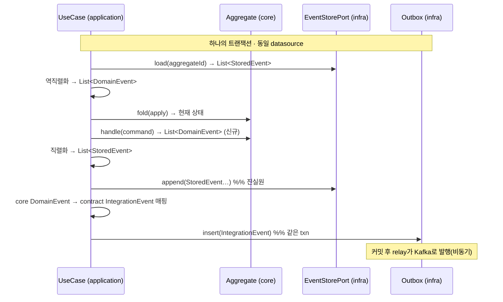
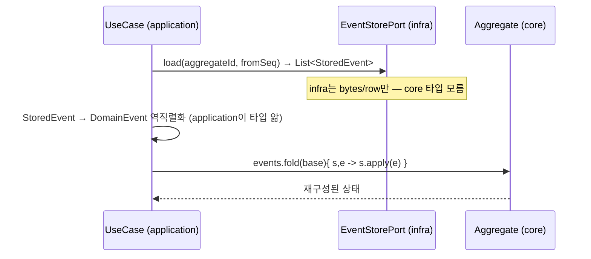

# DESIGN-019: 이벤트 실행 모델의 계층 분업 (타입 소유·매핑·리플레이)

- **상태**: Accepted (2026-07-04) — [[RFC-024-domain-event-type-and-replay-layering]] 합의 반영 (ADR 비준은 후속)
- **작성자**: Team
- **작성일**: 2026-07-04
- **최종 수정일**: 2026-07-04
- **관련 RFC**: [[RFC-024-domain-event-type-and-replay-layering]]
- **관련 ADR**: 신규 예정
- **관련 Design Doc**: [[DESIGN-002-module-structure]] · [[DESIGN-008-messaging-topology]] · [[DESIGN-009-event-store-lifecycle]]

---

## 1. Background

[[DESIGN-002-module-structure]] §4.4가 서브모듈 의존성 매트릭스를 확정했고, [[RFC-023-event-schema-contract-management]]가 "내부 도메인 이벤트 ≠ 통합 이벤트(contract)"를 확정했다. 그러나 애그리거트가 반환하는 이벤트의 *타입 소유*, core→contract *번역 주체*, 리플레이 `apply` *조립 주체*는 어느 문서도 배정하지 않았다([[06-design-weakness-triage]] C03; D-002 자기리뷰 라인 299–300).

이 문서는 그 공백을 매트릭스 **변경 없이** 채운다 — 매트릭스가 이미 허용한 의존 위에 실행 책임을 배정한다.

## 2. Goal

- 이벤트의 타입 소유, 매핑·발행 주체, 리플레이 조립 주체, event_store 저장 형태, append↔발행 트랜잭션 경계를 계층별로 확정한다.
- 매트릭스([[DESIGN-002-module-structure]] §4.4)와의 정합을 명시한다.

## 3. 계층 책임 배정

| 계층 | 이벤트 관련 책임 | core 타입을 쥐나 | contract 타입을 쥐나 |
|------|------------------|:---:|:---:|
| `command-core` | `handle(cmd) → List<DomainEvent>` · `apply(event) → newState` | ✅ (자기 자신) | ❌ (매트릭스 금지) |
| `command-application` (UseCase) | ① 애그리거트 rehydrate(역직렬화+fold) ② `handle` 호출 ③ 이벤트 직렬화→append 위임 ④ core→contract 매핑→outbox insert | ✅ **유일** | ✅ |
| `command-infrastructure` | event_store 경로: `StoredEvent`(직렬화 레코드) read/write · 발행 경로: outbox의 contract 이벤트를 relay가 Kafka로 | ❌ (매트릭스 금지) | ✅ (발행 경로 한정) |

**핵심 불변식**
> `command-infrastructure`는 core 이벤트 타입을 **절대 쥐지 않는다**. event_store 경로에서 오가는 것은 타입-불가지의 직렬화 레코드(`StoredEvent`)뿐이다. **core 이벤트 타입을 아는 유일한 계층은 `command-application`이다.**

이 불변식이 append(직렬화)와 리플레이(역직렬화+fold)를 대칭으로 닫고, 매트릭스의 `infra ↛ core` 를 지키면서도 리플레이 조립을 계층 안에 둔다.

## 4. 쓰기 경로 (command → append → emit, 단일 트랜잭션)



## 5. 리플레이 경로 (state hydration)



## 6. event_store 저장 형태 & 포트 경계

infra는 도메인 타입이 아니라 직렬화 레코드를 다룬다. 포트 시그니처가 core/contract 타입을 노출하지 않는 것이 불변식의 강제 지점이다.

```kotlin
// command-application 소유 포트 (out port). infra가 구현하되 core 타입 없음.
data class StoredEvent(
    val aggregateId: String,
    val sequenceNo: Long,
    val eventType: String,   // 타입 태그(FQCN 아님) — 업캐스팅은 RFC-022
    val payload: String,     // 직렬화된 JSON (bytes-only 경계)
    val occurredAt: Instant,
)

interface EventStorePort {                 // infra 구현: StoredEvent I/O만
    fun load(aggregateId: String, fromSeq: Long = 0): List<StoredEvent>
    fun append(events: List<StoredEvent>)   // outbox insert와 동일 트랜잭션
}
```

- **append**: application이 core `DomainEvent`를 `StoredEvent`로 직렬화해 넘긴다. infra는 payload를 저장만 한다.
- **load**: infra가 `StoredEvent`를 올려주면 application이 `eventType`으로 core `DomainEvent`를 복원(역직렬화)한다.
- `eventType → DomainEvent` 복원 레지스트리와 스키마 진화는 [[RFC-022-event-schema-evolution]] 소관 — 여기선 "application이 그 복원을 소유한다"만 배정.

## 7. 매트릭스 정합 (변경 없음)

[[DESIGN-002-module-structure]] §4.4 매트릭스를 그대로 만족한다 — 신규 허용/금지 없음:

| 이 설계의 의존 | 매트릭스 |
|---|---|
| application → core | ✅ 허용(`command-application`: `command-core`) |
| application → contract | ✅ 허용(`command-application`: `contract`) |
| infra → core (금지) | 이 설계는 **하지 않음** — `StoredEvent`만 |
| core → contract (금지) | 이 설계는 **하지 않음** — core는 core 이벤트만 반환 |

> §4.4의 "command-infrastructure는 contract 이벤트 타입만 안다"는 서술은 *발행 경로(relay → Kafka)* 한정으로 읽는다. event_store append/replay 경로에서 infra는 `StoredEvent`만 다뤄 어떤 도메인/계약 타입도 쥐지 않는다.

## 8. 기각한 대안

- **애그리거트가 contract 타입 반환** — `core → contract` 매트릭스 위반. 물리적으로 불가.
- **contract를 shared처럼 취급(매트릭스 완화)** — 내부↔통합 분리 붕괴·의존 안정성 역전·컨텍스트 격리 파괴·event_store가 계약 버저닝 인질. Accepted 매트릭스·[[RFC-023-event-schema-contract-management]]를 뒤집어야 함.
- **event_store에 contract(통합) 이벤트 저장** — published 계약을 진실원으로 삼아 수년치 리플레이가 발행 계약에 묶임. §6의 `StoredEvent`(내부 이벤트 직렬화)로 대체.

## 9. 미해결 · 후속

- **ADR 비준**: RFC-024 합의 완료. 대응 ADR 신설은 후속(사용자 권한).
- **event_store ↔ outbox 동일 datasource 전제**: §4의 단일 트랜잭션은 둘이 같은 datasource일 때만 성립 — 트리아지 C06와 함께 구현 시 확인.
- **outbox → Kafka 순서 계약**: relay 병렬성·DLQ 재생의 순서 보존은 이 문서 범위 밖(트리아지 C09).
- **스냅샷과의 상호작용**: §5 fold의 base 상태를 스냅샷에서 시작하는 최적화는 [[DESIGN-009-event-store-lifecycle]] 소관.

## 10. 관련 문서

- RFC: [[RFC-024-domain-event-type-and-replay-layering]]
- 분석: [[06-design-weakness-triage]] (C03)
- 매트릭스: [[DESIGN-002-module-structure]] §4.4
- 이웃: [[DESIGN-008-messaging-topology]] · [[DESIGN-009-event-store-lifecycle]] · [[RFC-022-event-schema-evolution]] · [[RFC-023-event-schema-contract-management]]
