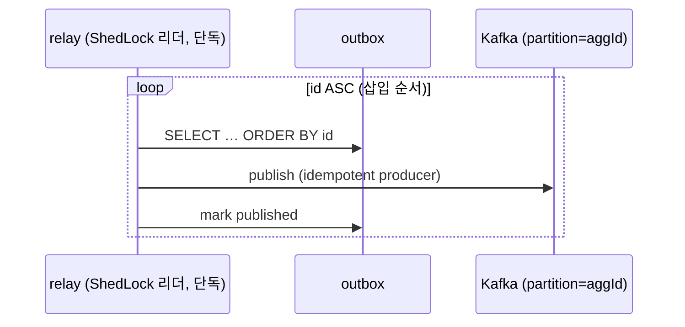
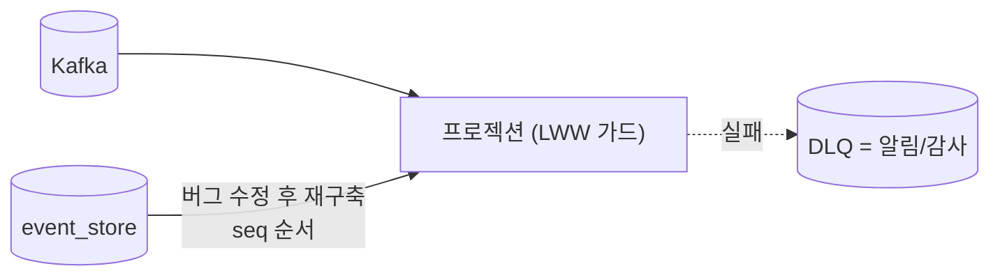

# DESIGN-020: aggregate 순서 보장과 컨슈머 실패 처리 (단일 relay · LWW 가드 · DLQ=재구축)

- **상태**: Accepted (2026-07-04) — [[RFC-025-ordering-relay-dlq-reconciliation]] 합의 반영 (ADR 비준은 후속)
- **작성자**: Team
- **작성일**: 2026-07-04
- **최종 수정일**: 2026-07-04
- **관련 RFC**: [[RFC-025-ordering-relay-dlq-reconciliation]] · [[RFC-032-non-es-state-copy-reordering]](비-ES 사본 — §4a)
- **관련 ADR**: 신규 예정
- **관련 Design Doc**: [[DESIGN-008-messaging-topology]] · [[DESIGN-007-consistency-and-sagas]] · [[DESIGN-006-aggregate-design]]

---

## 1. Background

파티션 키=`aggregate_id`로 aggregate별 순서를 보장하기로 했으나([[RFC-021-event-identity-and-global-ordering]]), 두 메커니즘이 그 계약을 깬다: SKIP LOCKED 경쟁 relay(발행 측)와 DLQ 수동 재생(소비 측). [[RFC-025-ordering-relay-dlq-reconciliation]]이 이를 봉합했고, 이 문서가 그 실행 설계를 담는다.

정상 흐름에서 순서는 Kafka(단일 파티션·순차 소비)가 이미 지킨다. 순서가 깨지는 것은 **relay 병렬성**과 **실패 시 건너뛰기·되쏘기**뿐이므로, 설계는 그 두 지점만 닫는다.

## 2. 발행 측 — 단일 순차 relay

- **ShedLock 리더**가 outbox 폴링을 단독 수행. outbox를 **삽입 순서(`id` ASC)**로 읽어 순차 발행(전역 단조 키 = PK `id` — `sequence_no`는 애그리거트별 순번이라 혼합 outbox의 전역 정렬 키가 될 수 없다).
- **Kafka 프로듀서**: `enable.idempotence=true`(순서·중복 보장). 같은 `aggregate_id` → 같은 파티션 → 순차 도착.
- SKIP LOCKED 경쟁 소비(D-008 §4.9)는 **폐기**. 처리량이 실증 문제가 되면 → 파티션드 relay(`aggregate_id` 해시로 분할, 각 relay가 자기 파티션 순서만 보장) 또는 CDC 졸업(트리아지 C47).



## 3. 소비 측 — 컨슈머 종류별 순서 처리

| 컨슈머 종류 | 순서 처리 | 실패 처리 |
|---|---|---|
| **프로젝션 (state-snapshot)** | **LWW seq 가드** — 아래 §4 | 옛 이벤트 무시(가드), 최신 미반영분은 재구축 |
| **프로젝션 (commutative 집계)** | 순서 무관 | `event_id` dedup(현 inbox)만 |
| **순서 결정적 (사가·부수효과·비가환)** | 엄격 순서 | 바운드 재시도 → 꼬리 격리(§5) |

## 4. LWW seq 가드 (프로젝션)

inbox를 확장해 **aggregate별 마지막 적용 `sequence_no`** 를 둔다. 적용 규칙:

```
on event(aggregateId, seq, payload):
    applied = inbox.lastSeq(aggregateId)      // 없으면 0
    if seq <= applied:  drop                  // superseded — 무시 (옛 DLQ 재유입 포함)
    else:               apply; inbox.set(aggregateId, seq)
```

- e2(seq 6) 먼저, e1(seq 5) 나중 → e2 적용(6), e1은 5 ≤ 6 → **drop**. 최종 상태 = 취소(정확).
- **핵심**: "무시"는 무조건이 아니라 **더 새 이벤트가 이미 이겼을 때만**. 실패분이 아직 최신(seq > applied)이면 가드가 **적용**한다 → 유실 없음.
- [[RFC-021-event-identity-and-global-ordering]] §63 "더 과거를 덮지 마라" 가드의 구체화.

## 4a. 비-ES 상태 사본 — 별도 순서 토큰 불요 ([[RFC-032-non-es-state-copy-reordering]])

§4 LWW 가드는 ES의 `sequence_no`(애그리거트별 단조)를 전제한다. 비-ES 컨텍스트(schedule·user·menu·category·company)에는 그 토큰이 없다([[RFC-021-event-identity-and-global-ordering]] §54). 그럼 비-ES 상태가 query DB 사본(`MenuView` 등, [[DESIGN-004-read-model]] §4.2)으로 복제될 때 순서를 무엇으로 지키나.

**결론: 지키는 것은 사본별 토큰이 아니라 §2의 단일 순차 relay다.** produce 재정렬의 유일한 발생 지점은 `relay→produce`이고, 단일 순차 relay(삽입 순서 단독 드레인 + partition=`aggregate_id` + idempotent producer)가 그것을 이미 닫는다. ES/비-ES 공통이라 비-ES 사본에 추가 순서 토큰이 필요 없다.

- **중복**(relay 페일오버 재발행 = at-least-once): relay 작업이 outbox 행 락에 묶여 두 인스턴스가 겹쳐도 순서를 뒤집지 못하고 재발행만 중복될 뿐 — `event_id` dedup(현 inbox)이 흡수.
- **freshness**: 비-ES는 bounded staleness 유지([[RFC-030-read-freshness-command-response-contract]]) — 이 절은 사본의 *최종 정확성*만 다룬다.
- **잔여** — dedup 보존창 밖 stale 재전달(inbox가 `event_id`를 GC한 뒤 아주 늦은 중복이 새 값을 덮음): 무트래픽 프로토타입 스코프 밖. 발생 시 재구축(§6·[[RFC-011-projection-rebuild-catchup]])으로 자가치유. 실측으로 문제화되면 그때 가드를 도입하되, 쓸 토큰은 비-ES 동시성이 `@Version` 낙관락을 택할 경우([[RFC-014-aggregate-concurrency-control]]) 그 컬럼의 부산물이다 — 이 설계가 지금 신설하지 않는다.

## 5. 꼬리 격리 (순서 결정적 컨슈머)

사가·부수효과는 재구축으로 되돌릴 수 없으므로(외부 결제 등 이미 발생) LWW로 못 덮는다.

1. **transient 실패**(DB blip·락 타임아웃): 제자리 백오프 재시도.
2. **poison**(N회 초과): 그 `aggregate_id`를 **stuck**으로 표시하고, 이후 그 aggregate의 이벤트를 **seq 순서로 park**(다른 aggregate는 계속 처리 — 파티션 head-of-line 블로킹 회피). 알림.
3. **복구**: 버그 수정 후 park 큐를 **seq 순서로 드레인**, stuck 해제.

## 6. DLQ의 위치 — 되쏘지 않는다

- DLQ는 **라이브 스트림에 재주입하지 않는다**(수동 재생 = 순서 파괴, D-008 §4.10 폐기).
- 실패 이벤트는 **event_store에 그대로** 있으므로 유실이 아니다.
- **복구 = 프로젝션 재구축**([[RFC-011-projection-rebuild-catchup]]): event_store를 seq 순서로 재적용 → 순서 보장.
- DLQ의 역할 = **알림·감사 로그**(무엇이 왜 실패했나).



## 7. 핵심 불변식

> **순서는 발행에서 단일 relay가, 소비에서 seq 가드/꼬리 격리가 지킨다. DLQ는 순서 복구 경로가 아니다 — 순서 복구는 event_store 재구축이다.**

## 8. 정합 · supersede

- **supersede**: SKIP LOCKED 경쟁 relay(D-008 §4.9), DLQ 수동 재생(D-008 §4.10). [[DESIGN-008-messaging-topology]] 해당 절 갱신 필요.
- **재사용**: 순서 가드([[RFC-021-event-identity-and-global-ordering]] §63), 재구축([[RFC-011-projection-rebuild-catchup]]), inbox dedup.

## 9. 미해결 · 후속

- **outbox↔event_store 동일 datasource 전제**(트리아지 C06) — §2 단일 트랜잭션 발행의 원자성 근거. 구현 시 확인.
- **비가환·순서 의존 프로젝션**이 실제로 등장하면 꼬리 격리 대상으로 분류(대부분 read model은 state-snapshot 또는 commutative라 해당 없음).
- **CDC 전환 임계값**(트리아지 C47) — 폴링 부채 SLI 기준은 별도.
- **park 저장소 스키마**(stuck aggregate + 순서 큐)의 구체는 사가 구현 사이클.

## 10. 관련 문서

- RFC: [[RFC-025-ordering-relay-dlq-reconciliation]] · [[RFC-032-non-es-state-copy-reordering]]
- 분석: [[06-design-weakness-triage]] (C09, 연계 C06·C46·C47) · [[12-non-es-outbox-ordering]] · [[11-data-schema-contract-conformance]] §1
- 이웃: [[DESIGN-008-messaging-topology]] · [[DESIGN-007-consistency-and-sagas]] · [[RFC-011-projection-rebuild-catchup]] · [[RFC-021-event-identity-and-global-ordering]]
