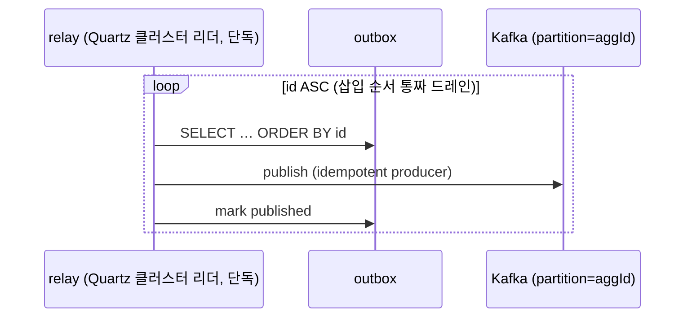
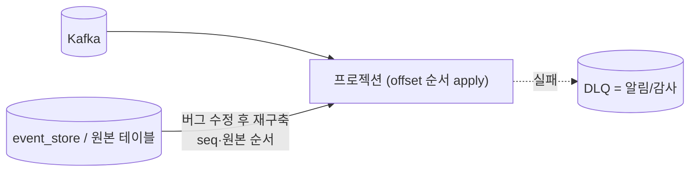

# DESIGN-020: aggregate 순서 보장과 컨슈머 실패 처리 (단일 relay · Kafka offset 순서 · DLQ=재구축)

- **상태**: Accepted (2026-07-04) — [[RFC-025-ordering-relay-dlq-reconciliation]] 합의 반영 (ADR 비준은 후속) · **개정 2026-08-03**: LWW seq 가드 폐기 → offset 순서, ShedLock → Quartz 클러스터 ([[ADR-009-event-ordering-and-delivery-guarantee]] 2026-08-03 정정 반영)
- **작성자**: Team
- **작성일**: 2026-07-04
- **최종 수정일**: 2026-08-03
- **관련 RFC**: [[RFC-025-ordering-relay-dlq-reconciliation]] · [[RFC-032-non-es-state-copy-reordering]](비-ES 사본 — §4a)
- **관련 ADR**: [[ADR-009-event-ordering-and-delivery-guarantee]]
- **관련 Design Doc**: [[DESIGN-008-messaging-topology]] · [[DESIGN-007-consistency-and-sagas]] · [[DESIGN-006-aggregate-design]] · [[DESIGN-010-deployment-runtime]]

---

## 1. Background

파티션 키=`aggregate_id`로 aggregate별 순서를 보장하기로 했으나([[RFC-021-event-identity-and-global-ordering]]), 두 메커니즘이 그 계약을 깬다: SKIP LOCKED 경쟁 relay(발행 측)와 DLQ 수동 재생(소비 측). [[RFC-025-ordering-relay-dlq-reconciliation]]이 이를 봉합했고, 이 문서가 그 실행 설계를 담는다.

정상 흐름에서 순서는 Kafka(파티션 내 순차 소비)가 이미 지킨다. 순서가 깨지는 것은 **relay 병렬성(경쟁 드레인)**과 **실패 시 건너뛰기·되쏘기**뿐이므로, 설계는 그 두 지점만 닫는다.

> **개정 노트 (2026-08-03).** 구안은 소비 측 순서 보존을 **LWW seq 가드**로 세우고 inbox에 aggregate별 `last-applied sequence_no`를 두었다. 이번 개정은 그 가드를 **폐기**하고 순서 보존을 **Kafka 파티션 offset 순서**에 둔다. 이유는 [[ADR-009-event-ordering-and-delivery-guarantee]] 2026-08-03 정정과 같다: ① 순서를 깨는 발행-측 발생원은 경쟁 드레인 하나뿐이라, 단일 순차 relay(삽입 순서 통짜 드레인) + 소비 측 offset 순서 apply + `event_id` dedup이면 리더 교체 창의 이중 발행도 중복만 만들어(역전 아님) 가드가 잉여였다. ② 파트별 세부(delta) 이벤트에서 낮은-seq drop이 다른 필드 갱신을 유실시키는 결함이었다. 동반: relay 단일성 기전 ShedLock → **Quartz 클러스터**, inbox `last-applied sequence_no` 제거(dedup은 `event_id`만), 꼬리 park 판정을 seq → **offset(도착) 순서**로.

## 2. 발행 측 — 단일 순차 relay

- **Quartz 클러스터 리더**가 outbox 폴링을 단독 수행(JDBC JobStore `isClustered=true` + `@DisallowConcurrentExecution` — 트리거를 단일 노드에서만 발화, 같은 job의 클러스터 전역 동시 실행 금지). outbox를 **삽입 순서(`id` ASC)로 통짜 드레인**해 순차 발행(전역 단조 키 = PK `id` — `sequence_no`는 애그리거트별 순번이라 혼합 outbox의 전역 정렬 키가 될 수 없다). Quartz는 [[ADR-008-saga-orchestration-vs-choreography]]의 예약 타임아웃 스케줄러로 어차피 도입하는 인프라라 새 코디네이터가 아니다.
- **Kafka 프로듀서**: `enable.idempotence=true`(순서·중복 보장). 같은 `aggregate_id` → 같은 파티션 → 순차 도착.
- **경쟁 드레인 금지(불변식 I-RELAY-ORDER).** 여러 relay 인스턴스가 서로 다른 outbox 행을 나눠 집는 SKIP LOCKED 경쟁 소비(D-008 §4.9)는 **폐기** — 그것이 애그리거트별 순서를 역전시키는 유일한 발행-측 발생원이다. 리더 교체 창에서 구·신 리더가 잠깐 겹쳐도 **둘 다 삽입 순서로** 드레인하므로 중복만 생기고(역전 아님) `event_id` dedup이 흡수한다. 처리량이 실증 문제가 되면 → 파티션드 relay(`aggregate_id` 해시로 분할, 각 relay가 자기 파티션 순서만 보장) 또는 CDC 졸업(트리아지 C47), 그때 producer 펜싱 검토.



## 3. 소비 측 — 컨슈머 종류별 순서 처리

| 컨슈머 종류 | 순서 처리 | 실패 처리 |
|---|---|---|
| **프로젝션 (state-snapshot, ES·비-ES 공통)** | **파티션 offset 순서 apply + `event_id` dedup** — 아래 §4 | 재시도(재정렬 발생원 없음), 미반영분은 재구축 |
| **프로젝션 (commutative 집계)** | 순서 무관 | `event_id` dedup(현 inbox)만 |
| **순서 결정적 (사가·부수효과·비가환)** | 엄격 순서 | 바운드 재시도 → 꼬리 격리(§5) |

## 4. offset 순서 소비 (프로젝션)

inbox는 `event_id` dedup만 둔다(순서 토큰 없음). 순서 보존은 소비 측 비교 토큰이 아니라 **파티션 offset 순서 + 단일 순차 relay**에 기댄다.

```
on event(aggregateId, eventId, payload) [파티션당 단일 스레드, offset 순서]:
    if inbox.seen(eventId):  drop        // 중복(at-least-once·재발행) — event_id dedup
    else:                    apply; inbox.mark(eventId)
```

- 컨슈머가 파티션을 **단일 스레드로 offset 순서대로** 소비하므로, 같은 `aggregate_id`의 이벤트는 항상 발행 순서(=seq 순서)로 apply된다.
- **왜 가드가 없어도 서는가**: 각 producer가 삽입 순서로 통짜 드레인하므로, relay 겹침(좀비 중첩)이 나도 각 이벤트의 **최초 등장 offset이 seq 순서**다. 뒤늦은 재등장은 `event_id` dedup이 버린다 — 겹침은 중복이지 역전이 아니다.
- **delta 이벤트 안전**: offset 순서 apply는 drop이 없어, 파트별 세부 이벤트(한 행의 일부 필드만 갱신)도 유실 없이 순서대로 반영된다. (구안 LWW의 `seq ≤ 적용됨 → drop`이 다른 필드 갱신을 잃던 결함이 사라진다.)
- **불변식 I-CONSUME-ORDER**: 컨슈머는 파티션당 단일 스레드로 offset 순서 apply한다. 레코드를 스레드풀로 넘기는 멀티스레드 async apply를 금지한다 — 그것이 소비 측의 유일한 재정렬 발생원이다.
- [[RFC-021-event-identity-and-global-ordering]] §63 "더 과거를 덮지 마라"는 이제 파티션 offset 순서가 구조적으로 보장한다(가드로 사후 교정하지 않는다).

## 4a. 비-ES 상태 사본 — 별도 순서 토큰 불요 ([[RFC-032-non-es-state-copy-reordering]])

비-ES 컨텍스트(schedule·user·menu·category·company)에는 ES의 `sequence_no` 같은 애그리거트별 순서 토큰이 없다([[RFC-021-event-identity-and-global-ordering]] §54). 그런데 이번 개정으로 **ES 프로젝션도 순서 토큰(LWW)을 쓰지 않으므로**, ES·비-ES가 같은 메커니즘(offset 순서 + `event_id` dedup)으로 선다 — 비-ES에 추가 순서 토큰이 필요 없다는 결론은 그대로이고, 오히려 ES와 대칭이 되어 더 단순해진다.

**결론: 지키는 것은 사본별 토큰이 아니라 §2의 단일 순차 relay + §4의 offset 순서 소비다.** produce 재정렬의 유일한 발생 지점은 `relay→produce`의 경쟁 드레인이고, 단일 순차 relay(삽입 순서 통짜 드레인 + partition=`aggregate_id` + idempotent producer)가 그것을 이미 닫는다.

- **중복**(relay 페일오버 재발행 = at-least-once): 두 인스턴스가 겹쳐도 삽입 순서를 유지해 순서를 뒤집지 못하고 재발행만 중복될 뿐 — `event_id` dedup(현 inbox)이 흡수.
- **freshness**: 비-ES는 bounded staleness 유지([[RFC-030-read-freshness-command-response-contract]]) — 이 절은 사본의 *최종 정확성*만 다룬다.
- **잔여** — dedup 보존창 밖 stale 재전달(inbox가 `event_id`를 GC한 뒤 아주 늦은 중복이 새 값을 덮음): 무트래픽 프로토타입 스코프 밖. 발생 시 재구축(§6·[[RFC-011-projection-rebuild-catchup]])으로 자가치유. 실측으로 문제화되면 그때 가드를 도입하되, 쓸 토큰은 비-ES 동시성이 `@Version` 낙관락을 택할 경우([[RFC-014-aggregate-concurrency-control]]) 그 컬럼의 부산물이다 — 이 설계가 지금 신설하지 않는다.

## 5. 꼬리 격리 (순서 결정적 컨슈머)

사가·부수효과는 재구축으로 되돌릴 수 없으므로(외부 결제 등 이미 발생) offset 순서 소비만으로 부족하다 — 앞 이벤트가 실패로 미적용인 채 뒤 이벤트가 먼저 부수효과를 일으키면 안 되기 때문이다. 그래서 꼬리를 격리한다.

1. **transient 실패**(DB blip·락 타임아웃): 제자리 백오프 재시도.
2. **poison**(N회 초과): 그 `aggregate_id`를 **stuck**으로 표시하고, 이후 그 aggregate의 이벤트를 **offset(도착) 순서로 park**(다른 aggregate는 계속 처리 — 파티션 head-of-line 블로킹 회피). 알림.
3. **복구**: 버그 수정 후 park 큐를 **offset 순서로 드레인**, stuck 해제.

> park·드레인 판정은 `sequence_no`가 아니라 **도착 offset 순서**를 전제하므로, `sequence_no`가 없는 비-ES 이벤트(예: `payment`)를 구독하는 순서 결정적 소비자(`reservation` 사가, [[ADR-008-saga-orchestration-vs-choreography]])에도 동일하게 적용된다 — 구안이 "비-ES엔 꼬리 격리 등가물이 없다"고 남긴 미결이 offset 기반으로 흡수된다.

## 6. DLQ의 위치 — 되쏘지 않는다

- DLQ는 **라이브 스트림에 재주입하지 않는다**(수동 재생 = 순서 파괴, D-008 §4.10 폐기).
- 실패 이벤트는 **event_store에 그대로** 있으므로 유실이 아니다(ES 컨텍스트). 비-ES·lookup은 원본 상태 테이블이 진실이라 재구축 원천이 된다.
- **복구 = 프로젝션 재구축**([[RFC-011-projection-rebuild-catchup]]): ES는 event_store를 seq 순서로 재적용, 비-ES·lookup은 원본 테이블에서 read model 재빌드 → 순서 보장.
- DLQ의 역할 = **알림·감사 로그**(무엇이 왜 실패했나).



## 7. 핵심 불변식

> **순서는 발행에서 단일 순차 relay(삽입 순서 통짜 드레인, I-RELAY-ORDER)가, 소비에서 파티션 offset 순서 apply(단일 스레드, I-CONSUME-ORDER) + `event_id` dedup이 지킨다. 순서 결정적 소비자만 offset 순서 꼬리 격리를 더한다. DLQ는 순서 복구 경로가 아니다 — 순서 복구는 재구축이다.**

## 8. 정합 · supersede

- **supersede**: SKIP LOCKED 경쟁 relay(D-008 §4.9), DLQ 수동 재생(D-008 §4.10). [[DESIGN-008-messaging-topology]] 해당 절 갱신 필요.
- **개정 supersede (2026-08-03)**: LWW seq 가드 + inbox `last-applied sequence_no`(구안 §4·RFC-025 결정 5)를 폐기하고 offset 순서로 대체. relay 단일성 기전 ShedLock → Quartz 클러스터([[DESIGN-010-deployment-runtime]] 배치 `replicas:1+standby` → N 대칭 동반 갱신).
- **재사용**: 순서 가드 의도([[RFC-021-event-identity-and-global-ordering]] §63)는 offset 순서가 구조적으로 충족, 재구축([[RFC-011-projection-rebuild-catchup]]), inbox `event_id` dedup.

## 9. 미해결 · 후속

- **outbox↔event_store 동일 datasource 전제**(트리아지 C06) — §2 단일 트랜잭션 발행의 원자성 근거. [[ADR-027-event-store-outbox-atomicity]]로 확정. 구현 시 확인.
- **비가환·순서 의존 프로젝션**이 실제로 등장하면 꼬리 격리 대상으로 분류(대부분 read model은 state-snapshot 또는 commutative라 해당 없음).
- **CDC 전환 임계값**(트리아지 C47) — 폴링 부채 SLI 기준은 별도. producer 펜싱 도입도 이때 함께 검토.
- **park 저장소 스키마**(stuck aggregate + offset 순서 큐)의 구체는 사가 구현 사이클.

## 10. 관련 문서

- ADR: [[ADR-009-event-ordering-and-delivery-guarantee]]
- RFC: [[RFC-025-ordering-relay-dlq-reconciliation]] · [[RFC-032-non-es-state-copy-reordering]]
- 분석: [[06-design-weakness-triage]] (C09, 연계 C06·C46·C47) · [[12-non-es-outbox-ordering]] · [[11-data-schema-contract-conformance]] §1
- 이웃: [[DESIGN-008-messaging-topology]] · [[DESIGN-007-consistency-and-sagas]] · [[DESIGN-010-deployment-runtime]] · [[RFC-011-projection-rebuild-catchup]] · [[RFC-021-event-identity-and-global-ordering]]
