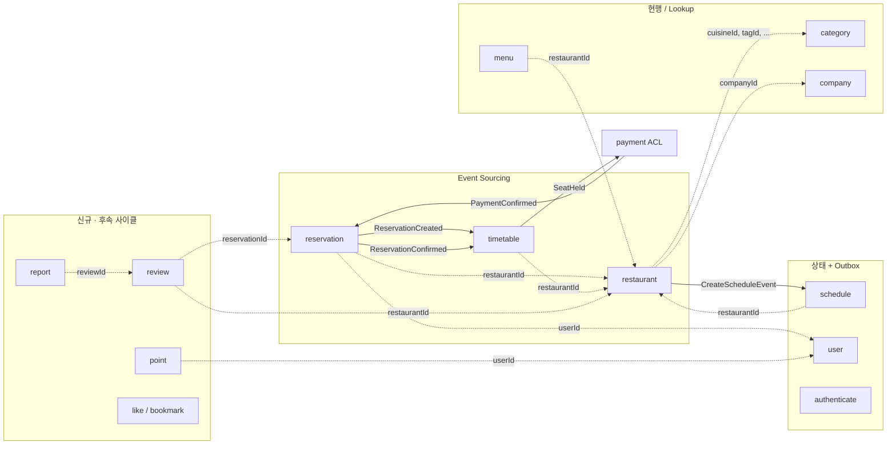

# V2 Domain Overview

> 이 디렉토리는 V2 도메인 모델의 **컨텍스트별 분석·이벤트 스토밍 결과**를 담는다.
> 각 문서는 V1 현행 분석 → V2 이벤트 스토밍 → 애그리거트 설계 순서로 구성된다.

---

## 컨텍스트 맵



---

## 컨텍스트 분류

| # | 컨텍스트 | 쓰기 모델 | 문서 | 비고 |
|---|----------|-----------|------|------|
| 1 | `reservation` | ES | [[01-reservation]] | 예약 라이프사이클 |
| 2 | `timetable` | ES | [[02-timetable]] | 좌석 점유·해제 |
| 3 | `restaurant` | ES | [[03-restaurant]] | 매장 정보 관리 |
| 4 | `schedule` | 상태+Outbox | [[04-schedule]] | 운영시간·휴일·테이블 |
| 5 | `user` | 상태+Outbox | [[05-user]] | 회원 관리 |
| 6 | `authenticate` | 상태+Outbox | [[06-authenticate]] | 인증·로그인 |
| 7 | `menu` | 현행 | [[07-menu]] | 메뉴 CRUD |
| 8 | `category` | 현행 | [[08-category]] | 카테고리·태그·국적·요리 |
| 9 | `company` | 현행 | [[09-company]] | 업체·브랜드 |
| — | `payment` | ACL·상태+Outbox | [[DESIGN-015]] | 결제 ACL (별도 설계) |

### 신규 도메인 (후속 사이클)

레퍼런스 컨텍스트 전환 완료 후 투입 ([[DESIGN-002]] §4.6).

| 컨텍스트 | 출처 | 비고 |
|----------|------|------|
| `review` | 이벤트 스토밍 — 리뷰 및 별점 | 예약 확정 후 작성, 7일 내 수정, 이후 확정 |
| `point` | 이벤트 스토밍 — 포인트 | 방문 확정·리뷰 작성 시 적립 |
| `report` | 이벤트 스토밍 — 신고 | 10회 누적 시 리뷰 숨김 |
| `like` / `bookmark` | 이벤트 스토밍 — 좋아요·찜 | 매장 좋아요·찜하기 토글 |

---

## 문서 구조 (각 컨텍스트)

```
1. V1 현행 분석
   - 애그리거트 / VO / 도메인 서비스 / 이벤트 / 불변식
   - V1 한계·빈약 도메인 징후

2. V2 이벤트 스토밍
   - 액터 → 커맨드 → 애그리거트 → 도메인 이벤트 → 정책
   - 상태 머신 (상태 전이 다이어그램)
   - 불변식 (비즈니스 규칙)
   - 읽기 모델 (뷰)

3. V1→V2 변경 요약
   - 리치 애그리거트로의 로직 이전
   - 신규 이벤트·상태 전이
```

---

## 관련 문서

- 아키텍처: [[DESIGN-001]] · [[DESIGN-002]] · [[DESIGN-003]]
- 애그리거트 설계 원칙: [[DESIGN-006]]
- 사가·코레오그래피: [[DESIGN-007]]
- 요구사항: [[request.md]]
- V1 분석: [[01-current-state]] · [[02-domain-limitations]]
