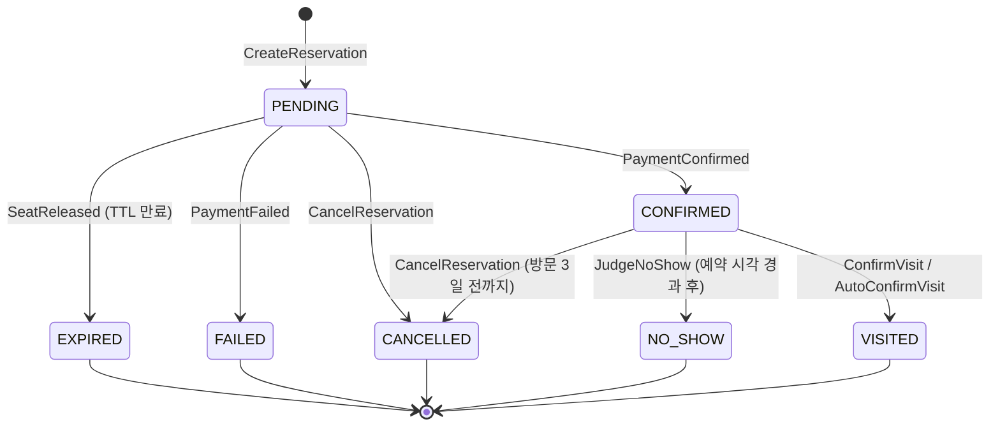

# reservation 컨텍스트

> 쓰기 모델: **Event Sourcing** · 코레오그래피 참여자 · 예약 라이프사이클의 중심

---

## 1. V1 현행 분석

### 애그리거트: Reservation

```
Reservation
├── id: String?
├── booker: ReservationBooker(userId)
├── restaurantInformation: ReservationRestaurantInformation(restaurantId, tableNumber, tableSize)
├── schedule: ReservationSchedule(timeTableId, date, day, startTime, endTime)
├── occupancy: ReservationOccupancy(timeTableOccupancyId, occupiedDatetime)
└── reservationStatus: ReservationStatus (= RESERVED)
```

- **VO**: `ReservationBooker`, `ReservationRestaurantInformation`, `ReservationSchedule`, `ReservationOccupancy`
- **도메인 서비스**: `CreateReservationDomainService` — ID 포맷 검증 후 생성, 스냅샷 반환
- **이벤트**: 없음
- **상태**: `RESERVED` 하나뿐 — 취소·확정·노쇼 상태 없음

### V1 검증 규칙 (코드 기반)

`CreateReservationDomainService`가 4개의 Validate 클래스를 순차 실행. 각 Validate는 Policy 체인(Empty → Format)으로 구성.

| # | 대상 필드 | Policy 클래스 | 규칙 | 예외 |
|---|-----------|--------------|------|------|
| 1 | `userId` | `ReservationUserIdEmptyValidationPolicy` | 비어있으면 안 됨 (`isNotBlank`) | `ReservationUserIdException` |
| 2 | `userId` | `ReservationUserIdFormatValidationPolicy` | UUID 포맷 (`^[0-9a-fA-F]{8}-…{12}$`) — V1은 v4, **V2는 v7로 변경** | `ReservationUserIdException` |
| 3 | `restaurantId` | `ReservationRestaurantIdEmptyValidationPolicy` | 비어있으면 안 됨 (`isNotBlank`) | `ReservationRestaurantIdException` |
| 4 | `restaurantId` | `ReservationRestaurantIdFormatValidationPolicy` | UUID 포맷 (V1: v4 → **V2: v7**) | `ReservationRestaurantIdException` |
| 5 | `timeTableId` | `ReservationTimeTableIdEmptyValidationPolicy` | 비어있으면 안 됨 (`isNotBlank`) | `ReservationTimeTableIdException` |
| 6 | `timeTableId` | `ReservationTimeTableIdFormatValidationPolicy` | UUID 포맷 (V1: v4 → **V2: v7**) | `ReservationTimeTableIdException` |
| 7 | `timeTableOccupancyId` | `ReservationTimeTableOccupancyIdEmptyValidationPolicy` | 비어있으면 안 됨 (`isNotBlank`) | `ReservationTimeTableOccupancyIdException` |
| 8 | `timeTableOccupancyId` | `ReservationTimeTableOccupancyIdFormatValidationPolicy` | UUID 포맷 (V1: v4 → **V2: v7**) | `ReservationTimeTableOccupancyIdException` |

**구조 특징**:
- **Policy 인터페이스 패턴**: 필드별 Policy 인터페이스(`ReservationUserIdPolicy` 등) → Empty/Format 구현체 2개씩
- **Validate 클래스**: 필드별 `ValidateUserId`, `ValidateRestaurantId`, `ValidateTimeTableId`, `ValidateTimeTableIdOccupancy` — Policy 리스트를 순회하며 첫 실패 시 예외
- **예외 계층**: 모두 `ClientException`을 상속하는 필드별 예외 클래스
- **검증 위치**: 애그리거트 외부 (`CreateReservationDomainService.validate()`)
- **검증 범위**: ID 포맷(UUID)만 검증. 비즈니스 규칙(상태 전이, 취소 가능 시점 등)은 없음
- **VO 내부 검증 없음**: `ReservationBooker`, `ReservationSchedule` 등 VO 생성자에 불변식이 없다

> **파일 참조**:
> - `core-module/.../reservation/service/CreateReservationDomainService.kt`
> - `core-module/.../reservation/service/validate/Validate*.kt` (4개)
> - `core-module/.../reservation/policy/validations/Reservation*Policy.kt` (8개)

### V1 한계

| 한계 | 설명 |
|------|------|
| 빈약 애그리거트 | `Reservation`은 `toSnapshot()` 외에 행위가 없다. 생성 로직이 서비스에 있다. |
| 상태 머신 부재 | `RESERVED` 단일 상태. 취소·확정·만료·노쇼 전이가 없다. |
| 이벤트 부재 | 예약 생성/취소/확정 이벤트가 없다. 코레오그래피에 참여할 수 없다. |
| 보상 없음 | 취소 시 `timetable` 좌석 해제 보상이 정의되지 않았다 (V1 미결정 항목). |
| 검증이 ID 포맷뿐 | 8개 Policy 전부 Empty+UUID 포맷 검증. 도메인 비즈니스 규칙(예: 과거 날짜 예약 불가, 시간 범위 정합성)이 없다. |
| Policy 과잉 분해 | 동일 패턴(Empty+UUID) 반복이 4세트 × 2개 = 8클래스. 공통 `IdValidationPolicy`로 충분한 로직. |

---

## 2. V2 이벤트 스토밍

### 액터 → 커맨드 → 이벤트

| 액터 | 커맨드 | 애그리거트 | 도메인 이벤트 | 정책 / 후속 |
|------|--------|-----------|-------------|-------------|
| 손님 | `CreateReservation` | Reservation | `ReservationCreated` | → timetable 구독 (`HoldSeat`) |
| — (이벤트) | `ConfirmReservation` ← `PaymentConfirmed` | Reservation | `ReservationConfirmed` | → timetable 구독 (`ConfirmSeat`) |
| — (이벤트) | `FailReservation` ← `PaymentFailed` | Reservation | `ReservationFailed` | → timetable 구독 (`ReleaseSeat`) |
| — (이벤트) | `ExpireReservation` ← `SeatReleased` | Reservation | `ReservationExpired` | 사가 종료 |
| 손님 | `CancelReservation` | Reservation | `ReservationCancelled` | → payment 환불, timetable 좌석 해제 |
| 매장 점주 | `CancelReservation` | Reservation | `ReservationCancelled` | 사유 필수 (30~200자) |
| 스케줄러 | `JudgeNoShow` | Reservation | `ReservationNoShow` | → payment 수수료, timetable 좌석 해제 |
| 매장 점주 | `ConfirmVisit` | Reservation | `VisitConfirmed` | → point 적립 트리거 |
| 타이머 (7일) | `AutoConfirmVisit` | Reservation | `VisitConfirmed` | 7일 미확정 시 자동 확정 |

### 상태 머신



> V1은 `RESERVED` 하나. V2는 7개 상태로 예약 라이프사이클을 완전히 표현한다.

### 불변식 (비즈니스 규칙)

#### 생성 시 (`handle(CreateReservation)`)

| # | 불변식 | 비고 |
|---|--------|------|
| 1 | 예약 날짜는 미래여야 한다 (과거 날짜 불가) | V1에 없던 규칙 |
| 2 | `startTime < endTime` (시간 범위 정합성) | V1에 없던 규칙 |
| 3 | `date`의 요일 = `day` (DayOfWeek 정합성) | V1에 없던 규칙 |
| 4 | `tableNumber ≥ 1` (테이블 번호 양수) | V1에 없던 규칙 |
| 5 | `tableSize ≥ 1` (테이블 인원 양수) | V1에 없던 규칙 |
| 6 | 참조 ID (userId, restaurantId 등) 비어있지 않음 + UUID v7 포맷 | V1 Policy 8개에서 이전 (v4→v7 변경) |

#### 취소 시 (`handle(CancelReservation)`)

| # | 불변식 | 비고 |
|---|--------|------|
| 7 | **손님** 취소: 방문 **3일 전**까지만 가능 | 요구사항 명시 |
| 8 | **매장 점주** 취소: **방문일시 전**까지 가능 (손님보다 완화) | 요구사항 "방문일시를 넘지 않으면 가능" |
| 9 | 매장 점주 취소 시 사유 필수 (30자 이상 200자 미만) | 요구사항 "30글자 이상 200글자 미만" |
| 10 | 취소 권한: 예약자 본인 또는 해당 매장 점주만 | 액터 검증 |

#### 확정·방문 시

| # | 불변식 | 검증 위치 |
|---|--------|-----------|
| 11 | EXPIRED 상태에서 `PaymentConfirmed` → 확정 거부 + 환불 트리거 | `handle(ConfirmReservation)` 상태 가드 |
| 12 | 방문 확정은 **예약 시각 이후**에만 가능 | `handle(ConfirmVisit)` — 요구사항 "예약 시간 이후에 방문을 확정" |
| 13 | 7일 미확정 시 자동 확정 | 스케줄러 → `AutoConfirmVisit` |

> **미결**: #11의 "환불 트리거"를 나타내는 도메인 이벤트가 액터→커맨드→이벤트 표에 없다. Reservation이 별도 이벤트(예: `LateConfirmationRejected`)를 발행하는지, payment ACL이 상태 조회로 직접 처리하는지 미정.

#### 노쇼 시

| # | 불변식 | 검증 위치 |
|---|--------|-----------|
| 14 | 노쇼 판정은 예약 시각 경과 후에만 | `handle(JudgeNoShow)` |

#### 공통

| # | 불변식 | 검증 위치 |
|---|--------|-----------|
| 15 | 상태 전이는 유효한 이전 상태에서만 (상태 가드) | 모든 `handle` |
| 16 | 동일 사용자 동일 시간대 중복 예약 불가 | 애그리거트 단독 판단 불가 — 도메인 서비스 또는 읽기 모델 조회 필요 |

### 읽기 모델 (뷰)

| 뷰 | 소비자 | 데이터 |
|----|--------|--------|
| 내 예약 목록 | 손님 | 예약 상태, 매장명, 날짜, 시간 |
| 매장 예약 현황 | 매장 점주 | 예약자, 날짜, 시간, 테이블, 상태 |
| 예약 상세 | 손님 / 매장 점주 | 전체 예약 정보 |

---

## 3. V1→V2 변경 요약

| 항목 | V1 | V2 |
|------|----|----|
| 애그리거트 행위 | `toSnapshot()` 뿐 | `handle/apply` 7개 커맨드, 불변식 내재 |
| 상태 | `RESERVED` 단일 | 7개 상태 전이 |
| 이벤트 | 없음 | 7개 도메인 이벤트 |
| 코레오그래피 | 없음 | timetable·payment와 이벤트 교환 |
| 보상 | 미정의 | `ReservationCancelled` → 환불·좌석 해제 |
| 도메인 서비스 | `CreateReservationDomainService` (검증+생성) | 검증 로직 → 애그리거트 `handle`로 이전 |
| ID 포맷 | UUID v4 | UUID v7 (시간 순서 정렬 가능, 정규식 패턴은 동일) |
