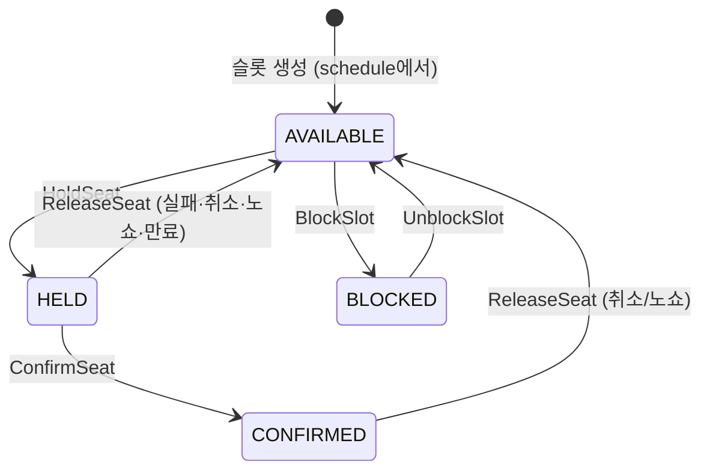

# timetable 컨텍스트

> 쓰기 모델: **Event Sourcing** · 좌석 점유/해제의 소유자 (결제 대기 타임아웃은 reservation 소유 — ADR-008 개정 2026-07-31)

---

## 1. V1 현행 분석

### 애그리거트: TimeTable

```
TimeTable
├── id: String?
├── restaurantId: String
├── date: LocalDate
├── day: DayOfWeek
├── startTime / endTime: LocalTime
├── tableNumber: Int
├── tableSize: Int
├── tableStatus: TableStatus (EMPTY | OCCUPIED)
├── timeTableConfirmStatus: TimeTableConfirmStatus
└── timetableOccupancy: TimetableOccupancy?
    ├── timeTableId, userId
    ├── occupiedStatus: OccupyStatus (OCCUPIED | UNOCCUPIED)
    ├── occupiedDatetime / unoccupiedDatetime
    └── unoccupied()
```

- **행위**: `attachOccupied(userId)` — 상태를 OCCUPIED로, Occupancy 생성. `detachOccupied()` — EMPTY로, Occupancy unoccupied. 둘 다 이미 점유/해제된 상태에 대해서는 idempotent no-op.
- **도메인 서비스**: `CreateTimeTableOccupancyDomainService` (검증+점유), `CreateTimeTableOccupiedDomainEventService` (이벤트 생성 전 timetableId·occupancyId 재검증)
- **검증 규칙**: timeTableId·userId·occupancyId 모두 비어있지 않음 + UUID 포맷. 점유는 `tableStatus == EMPTY`(정책 클래스명은 `TimeTableStatusIsNotVacantPolicy`)일 때만 가능
- **이벤트**: `TimeTableOccupiedDomainEvent(timeTableId, timeTableOccupancyId)` — V1 유일한 도메인 이벤트 중 하나
- **Outbox**: V1에서 이미 Transactional Outbox로 `reservation` 컨텍스트에 점유 알림

### V1 한계

| 한계 | 설명 |
|------|------|
| 점유/해제만 | 임시 점유(hold) → 확정(confirm) 구분 없음. TTL 만료도 없음. |
| 슬롯 = 행 단위 | 1 TimeTable 행 = 1 슬롯(날짜×시간×테이블). 애그리거트 경계와 슬롯 granularity가 혼재. |
| 이벤트 1개 | `TimeTableOccupiedDomainEvent` 하나만. 해제·확정·만료 이벤트 없음. |
| 검증 서비스 외부 | 점유 검증이 `CreateTimeTableOccupancyDomainService`에 있다. |
| 네이밍 트랩 | `TableStatus.isOccupied()`가 실제로는 상태가 `EMPTY`일 때 `true`를 반환한다 (반전된 이름). 정책 로직 자체는 올바르게 동작하지만 읽는 사람을 오도한다. |

---

## 2. V2 이벤트 스토밍

### 애그리거트 재설계 — Slot (슬롯 단위)

V2에서 timetable의 애그리거트는 **슬롯**(날짜×시간대×테이블)이다. 핫 애그리거트 경합을 슬롯 단위로 격리한다 ([[DESIGN-006]] §6.3).

### 액터 → 커맨드 → 이벤트

| 액터 | 커맨드 | 애그리거트 | 도메인 이벤트 | 정책 / 후속 |
|------|--------|-----------|-------------|-------------|
| — (이벤트) | `HoldSeat` ← `ReservationCreated` | Slot | `SeatHeld` | → payment 구독 (결제 요청) |
| — (이벤트) | `ConfirmSeat` ← `ReservationConfirmed` | Slot | `SeatConfirmed` | 임시→확정 |
| — (이벤트) | `ReleaseSeat` ← `ReservationFailed` / `ReservationCancelled` / `ReservationNoShow` / `ReservationExpired` | Slot | `SeatReleased` | 좌석 해제 (보상) — 만료 포함 모든 해제가 reservation 이벤트 구독으로 수렴 (ADR-008 개정, timetable 자체 `ExpireSeat`·TTL 소멸) |
| 매장 점주 | `BlockSlot` | Slot | `SlotBlocked` | 수동 차단 |
| 매장 점주 | `UnblockSlot` | Slot | `SlotUnblocked` | 차단 해제 |

### 상태 머신



### 불변식

| # | 불변식 | 검증 위치 |
|---|--------|-----------|
| 1 | AVAILABLE 상태에서만 점유 가능 (이중 점유 방지) | `handle(HoldSeat)` 상태 가드 |
| 2 | 결제 대기 타임아웃은 reservation이 소유 — reservation 스케줄러가 만료를 판정하고 timetable은 `ReservationExpired`를 구독해 좌석 해제 (ADR-008 개정) | reservation 스케줄러 폴링 |
| 3 | 해제/만료된 슬롯에 뒤늦은 확정 거부 | `handle(ConfirmSeat)` 상태 가드 |
| 4 | BLOCKED 슬롯은 점유 불가 | `handle(HoldSeat)` 상태 가드 |

> **~~미결~~ 해소 (2026-07-31, ADR-008 개정 · 이벤트 스토밍 07-H1)**: `ReleaseSeat`(실패·취소·노쇼)와 `ExpireSeat`(TTL)가 동일 `SeatReleased`로 합쳐지던 문제는 **타임아웃 소유권을 reservation으로 옮겨 해소**됐다 — timetable 자체 `ExpireSeat`이 사라지고, 만료도 `ReservationExpired → ReleaseSeat → SeatReleased`로 취소·실패·노쇼와 동일 경로가 된다. `SeatReleased`는 이제 단일 내부 이벤트이며 `cause` 필드도 TTL 전용 이벤트도 불필요하다.

### 읽기 모델

| 뷰 | 소비자 | 데이터 |
|----|--------|--------|
| 예약 가능 슬롯 목록 | 손님 | 날짜별 시간대×테이블, 상태(AVAILABLE만) |
| 매장 타임테이블 현황 | 매장 점주 | 전체 슬롯 상태 (AVAILABLE/HELD/CONFIRMED/BLOCKED) |

---

## 3. V1→V2 변경 요약

| 항목 | V1 | V2 |
|------|----|----|
| 애그리거트 | `TimeTable` (행 단위, 행위 빈약) | `Slot` (슬롯 단위, handle/apply) |
| 상태 | EMPTY / OCCUPIED | AVAILABLE / HELD / CONFIRMED / BLOCKED |
| 이벤트 | `TimeTableOccupiedDomainEvent` 1개 | 6개 (SeatHeld, SeatConfirmed, SeatReleased, SlotBlocked, SlotUnblocked + 생성) |
| TTL | 없음 | 스케줄러 폴링 기반 임시 점유 만료 |
| 코레오그래피 | Outbox로 reservation에 알림 | 양방향 이벤트 교환 (reservation ↔ timetable ↔ payment) |
| Occupancy | 별도 엔티티 (`TimetableOccupancy`) | Slot 애그리거트 상태에 흡수 |
