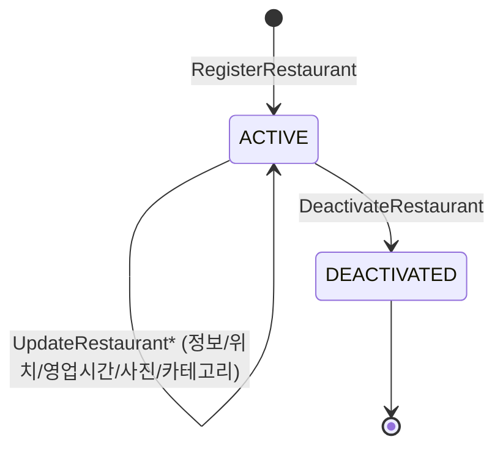

# restaurant 컨텍스트

> 쓰기 모델: **Event Sourcing** · 매장 정보 관리 · schedule 트리거

---

## 1. V1 현행 분석

### 애그리거트: Restaurant

```
Restaurant
├── id: String?
├── companyId: String
├── userId: String (소유자)
├── introduce: RestaurantDescription(name, introduce)
├── contact: RestaurantContact(phone)
├── address: RestaurantAddress(zipCode, address, detail, coordinate)
│   └── coordinate: RestaurantCoordinate(latitude, longitude)
├── routine: RestaurantRoutine → List<RestaurantWorkingDay(day, startTime, endTime)>
├── photos: RestaurantPhotoBook → List<RestaurantPhoto(url)>  (max 10)
├── tags: RestaurantTags → List<Long>  (max 10)
├── nationalities: RestaurantNationalities → List<Long>  (max 10)
└── cuisines: RestaurantCuisines → List<Long>  (max 10)
```

- **행위**: `updateDescription`, `updateLocation`, `updateContact`, `manipulateRoutine/Photo/Tags/Nationalities/Cuisines`, `snapshot()`
- **도메인 서비스**: `CreateRestaurantDomainService` (검증+생성), `ChangeRestaurantDomainService` (검증+수정) + 6개 위임 서비스 (`UpdateRoutine`, `UpdatePhoto`, `UpdateTag`, `UpdateNationalities`, `UpdateCuisines`, `ValidateXxx` 6개)
- **이벤트**: `CreateScheduleEvent(restaurantId)` — 매장 생성 시 schedule 생성 트리거

### V1 검증 규칙 (코드 실측)

| 필드 | 규칙 | 근거 |
|------|------|------|
| 이름 | 1~64자 | `RestaurantNameLengthValidationPolicy` |
| 소개 | 0~6000자 | `RestaurantIntroduceLengthPolicy` |
| 전화 | 11~13자 + 휴대폰/지역번호 포맷 | `RestaurantPhoneLengthValidationPolicy`, `RestaurantPhoneFormatValidationPolicy` |
| 주소 | 256자 미만 | `RestaurantAddressLengthValidationPolicy` |
| 우편번호 | 정확히 5자리 숫자 | `RestaurantZipCodeLengthValidationPolicy`, `RestaurantZipCodeFormatValidationPolicy` |
| 좌표 | 정수부 최대 3자리·소수부 최대 5자리, 위도 33.0~38.7 · 경도 124.0~131.2 (대한민국 bounding box) | `RestaurantCoordinateFormatValidationPolicy`, `RestaurantCoordinateBoundaryValidationPolicy` |
| 태그/국적/요리 | 각각 최대 **10개** (동일 패턴, 0개 허용) | `RestaurantTags`/`Nationalities`/`Cuisines` (`MAX_*_SIZE = 10`) |
| 사진 | 최대 10장 | `RestaurantPhotoBook` (`MAX_PHOTO_SIZE = 10`) |

- 태그·국적·요리·사진·영업시간(routine) 모두 중복 추가 시 예외 없이 **조용히 무시**(no-op)된다. `RestaurantWorkingDay`의 중복 판정은 `day`만 기준 — 같은 요일에 시간이 다른 두 영업시간을 추가해도 첫 번째만 유지된다.

### V1 한계

| 한계 | 설명 |
|------|------|
| 빈약 도메인 최대 사례 | 검증 로직이 16개 Policy + 2개 DomainService에 분산. 애그리거트는 setter 홀더. |
| 이벤트 1개 | `CreateScheduleEvent`만. 매장 수정·삭제 이벤트 없음. |
| 가변 상태 | `var` 필드 + 외부 manipulator. 불변 전이 아님. |
| 도메인 서비스 과다 | `CreateRestaurantDomainService`, `ChangeRestaurantDomainService` + Update/Validate 서비스 8개 |
| 소유권 검증 없음 | `userId`는 생성 시 저장만 되고, 수정 서비스 어디에서도 비교·검증되지 않는다 (액터 파라미터 자체가 없음). |

---

## 2. V2 이벤트 스토밍

### 액터 → 커맨드 → 이벤트

| 액터 | 커맨드 | 애그리거트 | 도메인 이벤트 | 정책 / 후속 |
|------|--------|-----------|-------------|-------------|
| 매장 점주 | `RegisterRestaurant` | Restaurant | `RestaurantRegistered` | → schedule 생성 트리거 |
| 매장 점주 | `UpdateRestaurantInfo` | Restaurant | `RestaurantInfoUpdated` | 이름·소개·전화 |
| 매장 점주 | `UpdateRestaurantLocation` | Restaurant | `RestaurantLocationUpdated` | 주소·좌표 |
| 매장 점주 | `UpdateRestaurantRoutine` | Restaurant | `RestaurantRoutineUpdated` | 영업시간 |
| 매장 점주 | `UpdateRestaurantPhotos` | Restaurant | `RestaurantPhotosUpdated` | 사진 (max 10) |
| 매장 점주 | `UpdateRestaurantCategories` | Restaurant | `RestaurantCategoriesUpdated` | 태그·국적·요리 |
| 관리자 | `DeactivateRestaurant` | Restaurant | `RestaurantDeactivated` | 비활성화 |

### 상태 머신



> **미결**: 재활성화(`ReactivateRestaurant`) 커맨드가 없다 — 비활성화가 되돌릴 수 없는 최종 상태인지, 재활성화 경로가 누락된 것인지 확인 필요.

### 불변식

| # | 불변식 |
|---|--------|
| 1 | 매장 이름: 1~20자 |
| 2 | 소개: 0~2000자 |
| 3 | 위치: 대한민국 내 좌표 |
| 4 | 사진: 최대 10장 |
| 5 | 태그: 최대 3개 (요구사항) / 10개 (V1 코드) — **재확인 필요** |
| 6 | 카테고리(cuisine): 택 1 |
| 7 | 영업시간: 월~일, 00:00~23:59 |
| 8 | 소유자(userId)만 수정 가능 — 소유권 불변식 |

> **코드 대조 메모** (V1 코드 실측 vs 위 V2 목표치 — 의도적 변경인지 확인 필요):
> - #1 이름 1~20자 ↔ V1 코드는 1~64자
> - #2 소개 0~2000자 ↔ V1 코드는 0~6000자
> - #5 태그 3개 ↔ V1 코드는 태그·국적·요리 전부 10개로 동일 — "3개"의 근거(요구사항 문서)를 재확인
> - #6 cuisine 택1 ↔ V1 코드는 태그와 동일하게 리스트(최대 10, 0개도 허용)로 구현되어 있어 "택 1" 제약이 코드 어디에도 없음
> - #8 소유권 검증 ↔ V1 코드에는 애그리거트/서비스 레벨의 소유권 체크가 전혀 없음 (인가 레이어에서 처리한다면 [[ADR-017]]과 연결 지어 명시 필요)

### 읽기 모델

| 뷰 | 소비자 | 데이터 |
|----|--------|--------|
| 매장 검색 결과 | 손님 | 이름, 위치, 별점, 카테고리, 대표사진 |
| 매장 상세 | 손님 | 전체 매장 정보 + 메뉴 + 리뷰 |
| 내 매장 관리 | 매장 점주 | 매장 정보 + 예약 현황 |

---

## 3. V1→V2 변경 요약

| 항목 | V1 | V2 |
|------|----|----|
| 검증 위치 | 16개 Policy + DomainService | 애그리거트 `handle` 내부 |
| 도메인 서비스 | 8개+ | 거의 0 (진짜 교차 로직만 남김) |
| 이벤트 | `CreateScheduleEvent` 1개 | 7개 |
| 상태 변경 | `var` setter | `apply(event)` 불변 전이 |
| 태그 상한 | 코드 10개 vs 요구사항 3개 | 요구사항 기준 재확정 필요 |
