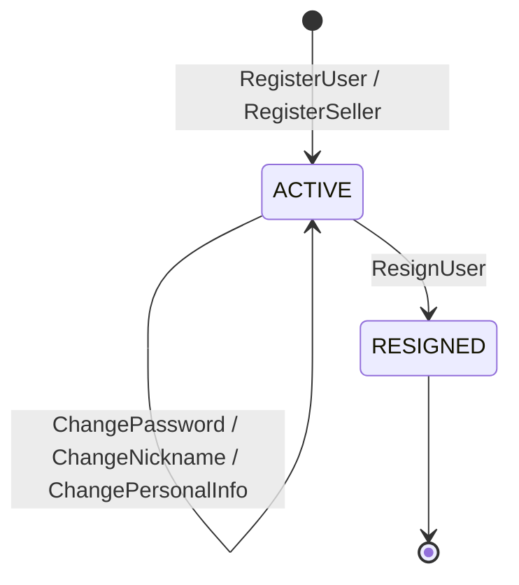

# user 컨텍스트

> 쓰기 모델: **상태 + Outbox** · 회원 관리 (일반 사용자 · 매장 점주 · 관리자)

---

## 1. V1 현행 분석

### 애그리거트: User 계층

```
ServiceUser (interface)
├── PasswordChangeable · PersonalAttributesChangeable · UserResignable · UserAttributeChangeable
│
├── User (일반 사용자)
│   ├── id, loginId: LoginId, password: Password
│   ├── personalAttributes: PersonalAttributes(email, mobile)
│   ├── userAttributes: UserAttribute(nickname, role=USER)
│   └── 행위: resign(), changePassword(), changePersonalAttributes(), changeUserNickname()
│
├── RestaurantOwner (매장 점주)
│   ├── 동일 구조, role=RESTAURANT_OWNER
│   └── 행위: 동일
│
└── Admin (관리자)
    ├── id, loginId, password, role=ROOT
    └── 행위: resign(), changePassword() only
```

- **VO**: `LoginId`, `Password`(encodedPassword, oldPassword, changedDateTime, isNeedToChange), `PersonalAttributes`(email, mobile), `UserAttribute`(nickname, role)
- **도메인 서비스**: 5개 — `CreateGeneralUserDomainService`, `CreateSellerUserDomainService`, `ChangeGeneralUserPasswordDomainService`, `ChangeUserNicknameDomainService`, `ResignUserDomainService`
- **이벤트**: 없음
- **보조 엔티티**: `ResignedUser`(탈퇴 사용자 — 암호화된 개인정보 보관)

### V1 한계

| 한계 | 설명 |
|------|------|
| 빈약 도메인 | 검증 로직이 5개 DomainService에 분산. 애그리거트는 getter+setter. |
| 이벤트 없음 | 가입·탈퇴·정보변경 이벤트가 없다. |
| 암호화 의존 | `ResignUserDomainService`가 `PasswordEncoderUtility`(인프라)에 의존 |
| User/Owner 중복 | 구조가 거의 동일한데 별도 클래스 |

---

## 2. V2 이벤트 스토밍

### 액터 → 커맨드 → 이벤트

| 액터 | 커맨드 | 애그리거트 | 도메인 이벤트 | 정책 / 후속 |
|------|--------|-----------|-------------|-------------|
| 일반 사용자 | `RegisterUser` | User | `UserRegistered` | |
| 관리자 | `RegisterSeller` | User | `SellerRegistered` | role=RESTAURANT_OWNER |
| 사용자 | `ChangePassword` | User | `PasswordChanged` | 이전 비밀번호와 동일 불가 → authenticate 구독 필요 (동기화) |
| 사용자 | `ChangeNickname` | User | `NicknameChanged` | |
| 사용자 | `ChangePersonalInfo` | User | `PersonalInfoChanged` | email, mobile |
| 사용자 | `ResignUser` | User | `UserResigned` | PII 암호화 후 보관 |

> **미결**: `User.password`와 [[06-authenticate]]의 `Authenticate.password`가 별도 애그리거트에 중복 보관된다. `PasswordChanged`/`TemporaryPasswordIssued`가 서로를 구독해 동기화하는지, 아니면 password를 한쪽으로 일원화할지(예: authenticate만 보관, user는 참조) 경계를 확정해야 한다.

### 상태 머신



### 불변식

| # | 불변식 |
|---|--------|
| 1 | 아이디: 영문+숫자, 4~20자 |
| 2 | 비밀번호: 대문자+소문자+숫자+특수문자, 8~18자 (+ UTF-8 72바이트 이하 — bcrypt 입력 한도) |
| 3 | 이메일: 필수, 유효 형식 |
| 4 | 닉네임: 필수, 5~12자 |
| 5 | 모바일: 형식 검증 (`01[016789]-?\d{3,4}-?\d{4}`) — 일반 사용자 가입 시에만 적용 |
| 6 | 비밀번호 변경 시 이전과 동일 불가 |
| 7 | 임시 비밀번호 로그인 시 변경 강제 (`isNeedToChangePassword` 플래그) — 강제 자체는 authenticate 로그인 경로에서 수행 |

> **코드 대조 메모**: 위 1~4 수치는 V1 코드 실측값으로 정정함 (기존 문서엔 8~12자·12~20자·2~20자로 잘못 기재돼 있었음). `RegisterSeller`(`CreateSellerUserDomainService`)는 위 규칙을 **전혀 검증하지 않는다** — 일반 사용자 가입과 달리 검증 없이 바로 `RestaurantOwner`를 생성한다. V2에서 동일 규칙을 적용할지 결정 필요.

### 읽기 모델

| 뷰 | 소비자 | 데이터 |
|----|--------|--------|
| 내 정보 | 사용자 | 닉네임, 이메일(마스킹), 모바일 |
| 아이디 찾기 결과 | 사용자 | 아이디 60% 마스킹 |

---

## 3. V1→V2 변경 요약

| 항목 | V1 | V2 |
|------|----|----|
| 도메인 서비스 | 5개 | 검증 → 애그리거트 handle |
| User/Owner | 별도 클래스 | 단일 User + role 구분 검토 |
| 이벤트 | 없음 | 6개 |
| PII 처리 | 서비스에서 암호화 | 포트 경계로 분리 ([[DESIGN-016]]) |
