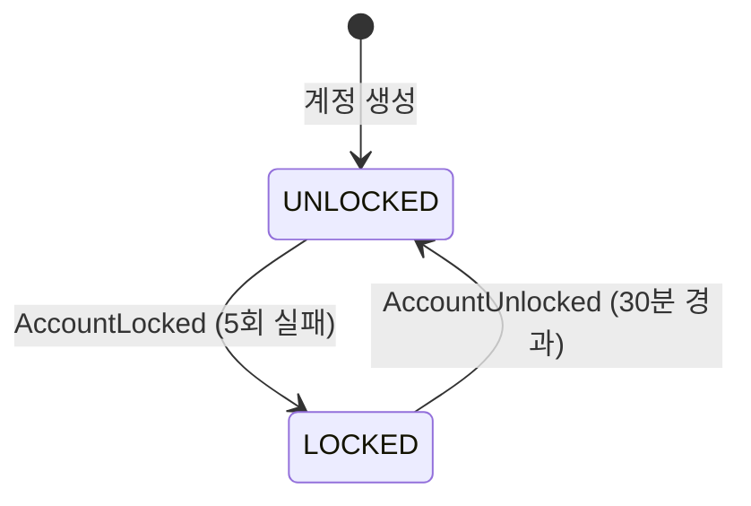

# authenticate 컨텍스트

> 쓰기 모델: **상태 + Outbox** · 로그인·잠금·접근 이력

---

## 1. V1 현행 분석

### 애그리거트: Authenticate

```
Authenticate
├── id: String
├── loginId: LoginId
├── password: Password (encoded)
├── lockState: LockState
│   ├── failCount: Int
│   ├── lockedDateTime: LocalDateTime?
│   ├── userStatus: UserStatus (ACTIVATED | DEACTIVATED)
│   └── 행위: hasExceededFailCount(), isLockdownTimeOver(), deactivate(), activate(), addFailureCount()
├── role: Role
└── accessLog: List<AccessHistory>
    └── AccessHistory(authenticateId, loginId, accessDetails)
        └── AccessDetails(accessStatus, accessDateTime)
```

- **행위**: `canISignIn(rawPassword, policy)` — 비밀번호 확인 + 잠금 체크 + 접근 이력 기록
- **도메인 서비스**: `AuthenticateSignInDomainService` — `NormalSignInPolicy`(5회, 30분)로 `canISignIn` 호출
- **정책**: `SignInPolicy` 인터페이스 → `NormalSignInPolicy`(limitCount=5, interval=30, unit=MINUTES)

### V1 한계

| 한계 | 설명 |
|------|------|
| 행위 있음 (예외) | `canISignIn`은 V1에서 거의 유일하게 애그리거트 안에 행위가 있는 사례 |
| 부수효과 내재 | `canISignIn` 안에서 lockState 변이 + accessLog 추가가 동시에 일어남 |
| 이벤트 없음 | 로그인 성공/실패/잠금 이벤트가 없다 |
| 네이밍 혼동 | `LockState.userStatus: UserStatus(ACTIVATED\|DEACTIVATED)`는 잠금 여부를 뜻하는데, 이름은 회원 전체 상태([[05-user]]의 탈퇴 여부)처럼 읽힌다 |
| password 중복 보관 | `Authenticate.password`와 [[05-user]]의 `User.password`가 별도로 존재 — 동기화 경로 없음 |

---

## 2. V2 이벤트 스토밍

### 액터 → 커맨드 → 이벤트

| 액터 | 커맨드 | 애그리거트 | 도메인 이벤트 | 정책 / 후속 |
|------|--------|-----------|-------------|-------------|
| 사용자 | `SignIn` | Authenticate | `SignInSucceeded` / `SignInFailed` | 접근 이력 기록 |
| — (이벤트) | `LockAccount` ← `SignInFailed` (5회 누적) | Authenticate | `AccountLocked` | 30분 잠금 |
| 스케줄러 | `UnlockAccount` (30분 경과) | Authenticate | `AccountUnlocked` | 자동 해제 |
| 사용자 | `SignOut` | — | `SignedOut` | 세션/토큰 무효화 |
| 사용자 | `FindLoginId` | — (조회) | — | 이메일로 조회 → 60% 마스킹 |
| 사용자 | `ResetPassword` | Authenticate | `TemporaryPasswordIssued` | 이메일 발송 → user 구독 필요 (`isNeedToChangePassword`) |

### 상태 머신 (잠금 상태)



### 불변식

| # | 불변식 |
|---|--------|
| 1 | 5회 연속 실패 → 30분 잠금 |
| 2 | 잠금 상태에서도 로그인 시도 자체는 접수·기록된다 (거부만 될 뿐 차단은 아님) — 실패 시도가 있을 때마다 잠금 타이머가 다시 30분으로 리셋된다 |
| 3 | 임시 비밀번호 발급 → `isNeedToChangePassword = true` |
| 4 | 로그인 성공/실패 기록은 항상 남긴다 |

> **코드 대조 메모**: V1 코드는 "잠금 시 시도 자체를 막는다"가 아니라 "잠금 중에도 비밀번호 대조·이력 기록을 계속 수행하고, 그 시도가 실패든(재시도) 성공이든(잠금 중 정답) `lockedDateTime`을 현재 시각으로 재설정한다" — 즉 공격자가 계속 틀리면 잠금이 끝없이 연장될 수 있다. 완전 실패(비번+잠금 모두 실패) 시에만 재연장되고, `failCount`는 성공적 로그인(비번+잠금 둘 다 통과) 시에만 리셋된다. V2에서 "잠금 중 시도 자체를 차단"으로 바꿀지, 현재 동작(재시도마다 연장)을 유지할지 결정 필요 — 후자는 가용성 관점에서 잠재적 문제.

---

## 3. V1→V2 변경 요약

| 항목 | V1 | V2 |
|------|----|----|
| 리치 정도 | 비교적 양호 (`canISignIn` 행위 존재) | handle/apply 패턴으로 정규화 |
| 이벤트 | 없음 | 5개 (성공/실패/잠금/해제/임시비밀번호) |
| 부수효과 | `canISignIn` 안에서 상태 변이+이력 동시 | 이벤트 분리 (SignInSucceeded → apply로 이력 추가) |
