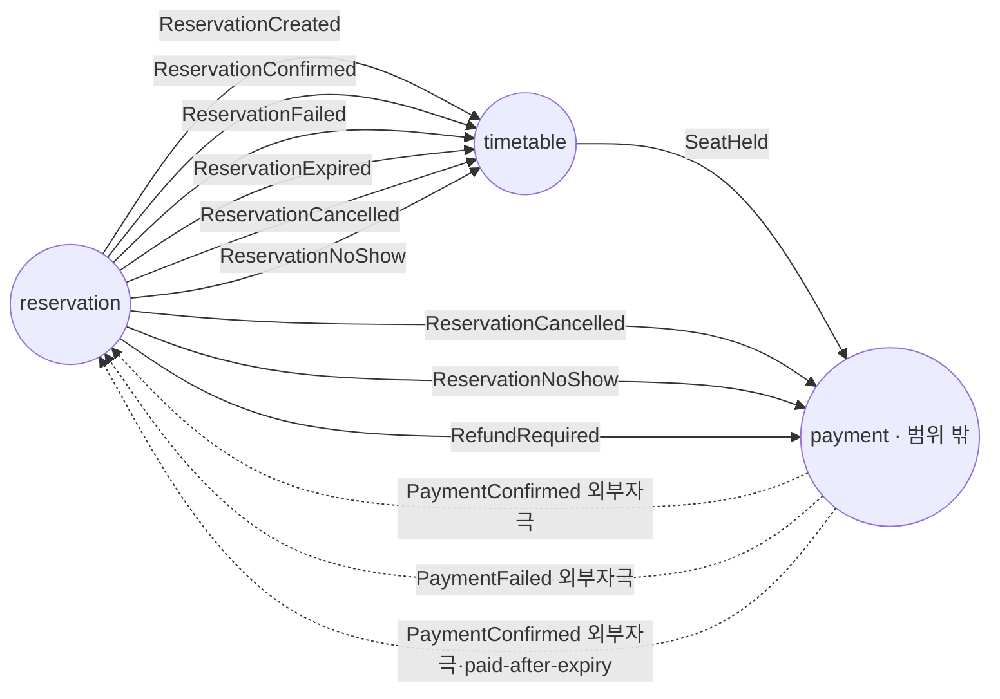

# 사가 정책과 코레오그래피 — 트리거·정책·컨텍스트 횡단 이벤트 흐름

- **상태**: 초안
- **작성일**: 2026-07-29
- **사이클**: `20260612-v2-cqrs-es-architecture`
- **역할 고지**: 이 문서는 결론을 미리 정하지 않고 ADR-008·DESIGN-007·도메인 문서를 대조한 조사 결과를 그대로 적는다. 문서 간 어긋남을 발견하면 봉합하지 않고 있는 그대로 남긴다.
- **규약**: [[_conventions]] §2(태그 3어휘·금지 인프라 토큰)를 따른다. 단 이 문서의 표 대부분은 ADR-008/DESIGN-007을 1차 근거로 삼고 `docs/v2/domain/*.md`를 근거로 삼지 않는 행이 많다 — 그런 행에 `V2 도메인 문서 근거`를 오용하지 않도록 §0.1에서 이 파일 전용 4번째 태그를 하나 더 연다(3어휘를 재정의하는 것이 아니라, 3어휘로 커버되지 않는 사례를 위해 스코프를 좁혀 추가한다).
- **근거 문서**: [[DESIGN-007-consistency-and-sagas]](`Accepted`, 1차 근거) · [[ADR-008-saga-orchestration-vs-choreography]](`Proposed`) · [[ADR-015-payment-acl-boundary]](`Proposed`) · [[02-design-timetable]] · [[03-design-reservation]]

---

## 0. 스코프 선언

이 문서는 ADR-008이 코레오그래피 기본으로 채택한 **컨텍스트 횡단 정책**만 다룬다 — 애그리거트 내부 상태 전이(이미 01~03 파일이 닫음)나 브로커 배선(§4가 인용만 함)은 다루지 않는다.

### 0.1 이 파일 전용 4번째 태그

[[_conventions]] §2.1의 3어휘(`V1 코드에서 확인` · `V2 도메인 문서 근거` · `제안(근거 없음, 사용자 판단 필요)`)에 더해, 이 파일에서만 다음을 쓴다:

- **`V2 설계/ADR 근거(도메인 문서 없음)`** — DESIGN-007·ADR-008·ADR-015가 근거이고 `docs/v2/domain/*.md`에는 대응 서술이 없는 행. `payment`는 `docs/v2/domain/` 아래 도메인 문서 자체가 없다(디렉터리 실측: `00,01~07,09`뿐, payment 없음) — 이 태그는 그 사실을 감추지 않기 위한 것이다. 이 4번째 태그는 [[_conventions]] §2.5 "규약 확장 로그"에 등록돼 있다 — §2.1의 3어휘를 몰래 바꾸는 것이 아니라, 이 파일에서만 유효한 등록된 확장이다.

### 0.2 범위 밖 컨텍스트 — `payment`

`payment`는 [[00-index]] §1 빅픽처 6개 쓰기 컨텍스트에 없다. 이 문서가 `payment`를 언급하는 것은 그것이 ADR-008 코레오그래피의 실제 참여자이기 때문이지, `payment`를 이 카탈로그가 새로 다루기 시작한다는 뜻이 아니다. `payment`발(發) 이벤트의 표시는 §1 표의 태그·출처 열과 §3 범례에서 구분한다; `RefundRequired`의 발행 방향 정정은 §2.1에서 별도로 다룬다.

---

## 1. 코레오그래피 정책 표

트리거 이벤트(또는 시간 경과) → 정책 → 발행 커맨드 → 결과 이벤트. 1차 근거는 [[DESIGN-007-consistency-and-sagas]] §4.4 — 이 절은 `#### ` 제목 기준(L84/115/135/154/177/198) 6개 시퀀스(확정·타임아웃·결제실패·취소·노쇼·paid-after-expiry)를 담고 있으며 §4.5는 L225에서 시작한다. paid-after-expiry는 §4.4의 6번째 시퀀스이지 §4.7(라)의 내용이 아니다 — §4.7(라)는 같은 레이스를 요약하는 `graph LR` 하나와 "§4.4 paid-after-expiry 레이스 시퀀스 참조"라는 지시문뿐, 별도 시퀀스를 담고 있지 않다. ADR-008 결정 본문을 함께 인용한다.

| # | 트리거 이벤트(컨텍스트) | 정책 | 발행 커맨드(컨텍스트) | 결과 이벤트 | 태그 | 원문 상태 | 출처 |
|---|---|---|---|---|---|---|---|
| P1 | `ReservationCreated`(reservation) | 예약 생성 시 자리 임시 점유 | `HoldSeat`(timetable) | `SeatHeld` | `V2 도메인 문서 근거` | `Accepted`([[DESIGN-007-consistency-and-sagas]]) | DESIGN-007 §4.4 확정(Happy Path) · domain/02 §2 |
| P2 | `SeatHeld`(timetable) | 점유 성사 시 결제 처리 개시 | *(payment 내부, 명명 없음 — ACL 경계 밖)* | `PaymentConfirmed` 또는 `PaymentFailed`(payment, 외부 자극) | `V2 설계/ADR 근거(도메인 문서 없음)` | `Accepted`([[DESIGN-007-consistency-and-sagas]]) · `Proposed`([[ADR-015-payment-acl-boundary]]) | DESIGN-007 §4.6("사가 입장에서 payment는 SeatHeld를 듣고 결제를 처리해 PaymentConfirmed/PaymentFailed를 돌려주는 참여자") · [[ADR-015-payment-acl-boundary]] |
| P3 | `PaymentConfirmed`(payment, **외부 자극**) | 결제 확정 시 예약 확정 | `ConfirmReservation`(reservation) | `ReservationConfirmed` | `V2 도메인 문서 근거`(reservation 쪽 반응은 domain/01) + 트리거 자체는 `V2 설계/ADR 근거(도메인 문서 없음)`(payment 도메인 문서 없음) | `Accepted`([[DESIGN-007-consistency-and-sagas]]) · `Proposed`([[ADR-015-payment-acl-boundary]]) | DESIGN-007 §4.4 확정 · [[ADR-015-payment-acl-boundary]]("3개 이벤트로 번역하는 것이 유일 책임") |
| P4 | `ReservationConfirmed`(reservation) | 예약 확정 시 좌석 확정 | `ConfirmSeat`(timetable) | `SeatConfirmed` | `V2 도메인 문서 근거` | `Accepted`([[DESIGN-007-consistency-and-sagas]]) | DESIGN-007 §4.4 확정 · domain/02 §2 |
| P5 | `PaymentFailed`(payment, **외부 자극**) | 결제 실패 시 예약 실패 전이 | `FailReservation`(reservation) | `ReservationFailed` | `V2 설계/ADR 근거(도메인 문서 없음)`(트리거) | `Accepted`([[DESIGN-007-consistency-and-sagas]]) · `Proposed`([[ADR-015-payment-acl-boundary]]) | DESIGN-007 §4.4 결제 실패 · [[ADR-015-payment-acl-boundary]] |
| P6 | `ReservationFailed`(reservation) | 예약 실패 시 좌석 해제 보상 | `ReleaseSeat`(timetable) | `SeatReleased` | `V2 도메인 문서 근거` | `Accepted`([[DESIGN-007-consistency-and-sagas]]) | DESIGN-007 §4.4 결제 실패 · domain/02 §2 |
| P7 | (reservation 스케줄러, 결제 대기 만료 탐색 — 이벤트 아님) | 결제 대기 타임아웃 시 예약 만료 전이 | `ExpireReservation`(reservation) | `ReservationExpired` | `V2 도메인 문서 근거` | `Accepted`([[DESIGN-007-consistency-and-sagas]]) · `Proposed`([[ADR-008-saga-orchestration-vs-choreography]]) | DESIGN-007 §4.4 타임아웃(개정) · [[ADR-008-saga-orchestration-vs-choreography]]("타임아웃 = reservation 소유") · domain/01 §2 |
| P8 | `ReservationExpired`(reservation) | 예약 만료 시 좌석 해제 보상(취소·실패·노쇼와 동일 경로) | `ReleaseSeat`(timetable) | `SeatReleased` | `V2 도메인 문서 근거` | `Accepted`([[DESIGN-007-consistency-and-sagas]]) | DESIGN-007 §4.4 타임아웃(개정) · [[02-design-timetable]] §2 · domain/02 §2 |
| P9 | `ReservationCancelled`(reservation, 손님/점주 커맨드 결과) | 취소 시 결제 상태를 보고 환불 여부 판단(자기 상태 가드 — payment가 Confirmed가 아니면 무시) | *(payment 내부, 명명 없음)* | `PaymentRefunded`(payment, **외부 자극** — ADR-015 L46 노출 선언, 소비자 미확인) — **조건부**(§2.2 참조) | `V2 설계/ADR 근거(도메인 문서 없음)` | `Accepted`([[DESIGN-007-consistency-and-sagas]]) · `Proposed`([[ADR-015-payment-acl-boundary]]) | DESIGN-007 §4.4 예약 취소("payment가 Confirmed 상태가 아니면 환불 없이 무시") · [[ADR-015-payment-acl-boundary]] |
| P10 | `ReservationCancelled`(reservation) | 취소 시 좌석 해제 보상 | `ReleaseSeat`(timetable) | `SeatReleased` | `V2 도메인 문서 근거` | `Accepted`([[DESIGN-007-consistency-and-sagas]]) | DESIGN-007 §4.4 예약 취소 · domain/02 §2 |
| P11 | (reservation 스케줄러, 예약 시각 경과 후 미방문 탐색 — 이벤트 아님) | 노쇼 판정 | `JudgeNoShow`(reservation) | `ReservationNoShow` | `V2 도메인 문서 근거` | `Accepted`([[DESIGN-007-consistency-and-sagas]]) | DESIGN-007 §4.7(나) · domain/01 §2 |
| P12 | `ReservationNoShow`(reservation) | 노쇼 시 수수료 부과 | *(payment 내부, 명명 없음)* | `NoShowFeeCharged` — **ACL 경계를 넘는 화살표 없음**(§2.3 참조) | `V2 설계/ADR 근거(도메인 문서 없음)` | `Accepted`([[DESIGN-007-consistency-and-sagas]]) | DESIGN-007 §4.4 노쇼 |
| P13 | `ReservationNoShow`(reservation) | 노쇼 시 좌석 해제 | `ReleaseSeat`(timetable) | `SeatReleased` | `V2 도메인 문서 근거` | `Accepted`([[DESIGN-007-consistency-and-sagas]]) | DESIGN-007 §4.4 노쇼 · domain/02 §2 |
| P14 | `PaymentConfirmed`(payment, **외부 자극**, paid-after-expiry — reservation이 이미 EXPIRED인 상태에서 뒤늦게 도착) | 만료 후 지연 결제 확정 거부 + 환불 트리거(상태 가드) | `ConfirmReservation`(reservation, 거부 분기) | `RefundRequired`(reservation → payment) | `V2 도메인 문서 근거`(반응은 domain/01 §2 불변식#11 · 03-design-reservation §4) + `V2 설계/ADR 근거(도메인 문서 없음)`(트리거) | `Accepted`([[DESIGN-007-consistency-and-sagas]]) · `Proposed`([[ADR-008-saga-orchestration-vs-choreography]]) | DESIGN-007 §4.4 paid-after-expiry · §4.7(라) · [[ADR-008-saga-orchestration-vs-choreography]] 결정 본문("reservation이 EXPIRED 상태에서 PaymentConfirmed를 받으면 확정을 거부하고 RefundRequired를 발행") |
| P15 | `RefundRequired`(reservation, **범위 안 발행** — §2.2 참조) | 환불 요청 처리 | *(payment 내부, 명명 없음)* | `PaymentRefunded`(payment, **외부 자극** — ADR-015 L46 노출 선언, 소비자 미확인) | `V2 설계/ADR 근거(도메인 문서 없음)` | `Accepted`([[DESIGN-007-consistency-and-sagas]]) · `Proposed`([[ADR-015-payment-acl-boundary]]) | DESIGN-007 §4.4 paid-after-expiry(L219) · [[ADR-015-payment-acl-boundary]] |

### 1.1 스코프 밖 후보 — `point` 적립 (표에 넣지 않음)

`docs/v2/domain/01-reservation.md` §2 "정책/후속" 열은 `ConfirmVisit`(방문 확정)에 "→ point 적립 트리거"를 적어 뒀다. 이 문서는 이 행을 위 표에 넣지 않는다 — ADR-008·DESIGN-007 어느 쪽도 `point` 컨텍스트나 방문 확정 이후의 적립 흐름을 다루지 않고(코레오그래피 정책 문서의 범위 밖), `docs/v2/domain/` 아래 `point` 도메인 문서 자체도 없다. domain/01만 이 정책 존재를 서술하고 있다는 사실 하나만 기록하고, 정책의 실재·이벤트명·소비자는 판단하지 않는다.

---

## 2. 조사 중 발견한 문서 간 어긋남 (봉합하지 않음)

### 2.1 `RefundRequired`의 실제 방향 — "payment에서 오는 이벤트"가 아니다

acceptance 스펙 문구는 `RefundRequired`를 `PaymentRefunded`와 나란히 "범위 밖 payment 컨텍스트에서 오는 이벤트"의 예로 든다. 그러나 ADR-008 원문을 그대로 읽으면 방향이 반대다: **`RefundRequired`는 `reservation`이 발행하고 `payment`가 소비한다**("reservation이 ... 확정을 거부하고 RefundRequired를 발행해 payment가 환불을 처리한다"). 즉 `RefundRequired`의 발행 주체는 범위 안(`reservation`)이고, 그 이벤트가 향하는 곳이 범위 밖(`payment`)일 뿐이다. 이 문서는 그 차이를 그대로 적는다 — "payment에서 오는 이벤트"로 뭉뚱그리지 않는다. `PaymentRefunded`야말로 진짜 `payment`발 외부 자극 후보이나, 아래 2.2가 그 소비자 자체가 불명확함을 별도로 짚는다.

### 2.2 `PaymentRefunded` — ADR-015는 노출을 선언하지만 DESIGN-007 시퀀스 어디에도 그 화살표가 없다

[[ADR-015-payment-acl-boundary]]는 "payment가 코레오그래피에서 다른 컨텍스트에 노출하는 이벤트는 `PaymentConfirmed`/`PaymentFailed`/`PaymentRefunded` 3개로 동결"이라 명시한다(L46). 그런데 DESIGN-007 §4.4의 6개 시퀀스 다이어그램(확정·타임아웃·결제실패·취소·노쇼·paid-after-expiry, §1의 재확인대로 전부 §4.4 안)을 전수 확인한 결과, `PaymentConfirmed`·`PaymentFailed`는 둘 다 `PAY-->>RES: ...` 형태로 다른 참여자(reservation)에게 향하는 화살표가 실제로 그려져 있는 반면, **`PaymentRefunded`는 이 6개 시퀀스 중 2곳(예약 취소 L168, paid-after-expiry L219 — paid-after-expiry는 §4.4의 6번째 시퀀스 자체다)에서만 등장하고 둘 다 `Note over PAY: PaymentRefunded`로만 그려진다.** 노쇼 시퀀스(L192)에는 `PaymentRefunded`가 전혀 등장하지 않는다 — 그 자리에는 `Note over PAY: NoShowFeeCharged`가 그려져 있다(같은 `Note over PAY` 표기이지만 다른 이벤트, §2.3 참조). §4.4의 6개 시퀀스 밖, §4.7(라)(L266–282)에는 같은 레이스를 요약하는 `graph LR`이 별도로 있고 거기에 `RF --> REFUND[PaymentRefunded]`라는 화살표가 하나 더 있으나, 이는 새 시퀀스가 아니라 §4.4 paid-after-expiry 시퀀스를 가리키는 요약 그림이며(§4.7(라) 본문 "§4.4 paid-after-expiry 레이스 시퀀스 참조"), 그 화살표도 시퀀스 다이어그램의 참여자(participant) 간 화살표가 아니라 `graph LR`의 이벤트-레이블 노드 간 화살표다.

이는 DESIGN-007(`Accepted`)과 ADR-015(`Proposed`) 두 문서 사이의 실제 불일치다 — ADR-015는 `PaymentRefunded`를 외부 노출 이벤트라 선언하지만, §4.4의 시퀀스 다이어그램에서 `PaymentRefunded`가 다른 컨텍스트(reservation·timetable)로 향하는 참여자 간 화살표로 그려진 곳은 한 군데도 없다. 이 카탈로그는 이 불일치를 해소하지 않는다 — ADR-015가 노출을 선언한 이상 `PaymentRefunded`는 아래 §1·§3에서 **외부 자극**으로 표시하되, 그 실제 소비자가 이 6개 컨텍스트 범위 안에 있는지조차 이 문서가 인용한 자료로는 판정할 수 없다는 사실만 함께 기록한다(→ 07 후보).

### 2.3 `NoShowFeeCharged` — ACL 경계를 넘지 않는 것으로 보이는 이벤트

DESIGN-007 §4.4 노쇼 시퀀스도 마찬가지로 `Note over PAY: NoShowFeeCharged`이며 화살표가 없다. 이 사건이 `payment` 내부에만 머무는 것이라면 ADR-015의 "3개로 동결"과 충돌하지 않는다(3개는 "노출"되는 것만 세므로) — 다만 이 판정도 DESIGN-007의 그림 표기(화살표 유무)에 의존한 추정이며, `PaymentRefunded`와 마찬가지로 명시적으로 "내부 전용"이라 선언한 원문 문장은 없다. 이 문서는 §3 컨텍스트 횡단 다이어그램에 `NoShowFeeCharged`를 엣지로 넣지 않는다(화살표 근거 없음) — 이것이 "이 이벤트가 존재하지 않는다"는 뜻은 아니다.

---

## 3. 컨텍스트 횡단 이벤트 흐름

노드 = 컨텍스트, 실선 엣지 = [[02-design-timetable]]·[[03-design-reservation]]이 닫은 카탈로그 이벤트명(문자열 그대로 일치). 점선 엣지 = `payment`발 외부 자극(카탈로그가 닫지 않음, §2.1의 방향 수정 반영).

- 실선(카탈로그 명명 확정, S4가 닫은 문자열과 일치): `ReservationCreated`·`SeatHeld`·`ReservationConfirmed`·`ReservationFailed`·`ReservationExpired`·`ReservationCancelled`·`ReservationNoShow`·`RefundRequired`. **`SeatReleased`는 타임아웃 소유권 이전([[ADR-008-saga-orchestration-vs-choreography]] 개정) 이후 항상 timetable 내부 이벤트**라 컨텍스트 횡단 엣지가 아니다 — 그래프에서 빼고, 그 자리를 `reservation → timetable`의 `ReservationExpired`가 대신한다([[06-internal-vs-integration]] §3).
- 점선(`payment`발 외부 자극, 이 카탈로그가 닫지 않은 이름): `PaymentConfirmed`·`PaymentFailed`. `PaymentRefunded`도 외부 자극이다 — ADR-015 L46이 `payment`가 노출하는 3개 이벤트 중 하나로 선언한다. 다만 §2.2가 밝힌 대로 DESIGN-007 §4.4 6개 시퀀스 어디에도 `PaymentRefunded`가 다른 컨텍스트로 향하는 참여자 간 화살표로 그려진 곳이 없어 소비자가 확인되지 않으므로, 이 그래프에는 엣지로 넣지 않고 범례에서만 외부 자극으로 표시한다. `NoShowFeeCharged`는 ADR-015의 3개 목록에 없어 외부 자극 여부 자체가 §2.3 기준으로도 불명하며, 범례·그래프 어디에도 넣지 않았다.

---

## 4. 브로커·순서 보장 — 설계하지 않음, 인용만

이 문서는 메시지 브로커·파티셔닝·전달 보장 메커니즘을 설계하지 않는다. 필요한 지점만 한 줄로 가리킨다.

- 애그리거트별 발행 순서·DLQ 처리: [[ADR-009-event-ordering-and-delivery-guarantee]](`Proposed`, 상위 [[RFC-003-messaging-delivery]] `🏷 합의 (2026-06-21) — ADR 비준 대기` · [[RFC-025-ordering-relay-dlq-reconciliation]] `🏷 합의 (2026-07-04) — ADR 비준 대기`).
