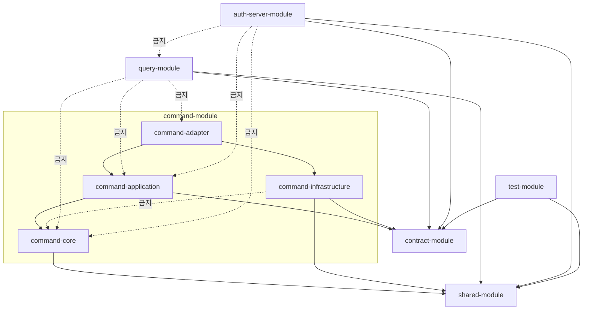

# V2 Module Index

> Cycle: `20260612-v2-cqrs-es-architecture` | Phase 7 준비 문서 (모듈 허브)
> 근거: [[DESIGN-002]] (모듈 구조) · [[DESIGN-001]] (목표 아키텍처) · [[DESIGN-010]] (런타임 뷰) · [[00-status-and-plan]] (Phase 7)

이 문서는 **허브**다. 각 모듈의 상세(책임·의존·사용 라이브러리·패키지·할 일)는 아래 개별 문서로 분리했다. 여기서는 전체 맵·전환 대응표·의존성 그래프·문서 색인만 둔다.

---

## 0. 모듈 문서 색인

| # | 문서 | 대상 | 구조 | 구현 시점 |
|---|------|------|------|-----------|
| 01 | [[01-shared-module]] | shared-module | 공유 커널 | Phase 7-0 |
| 02 | [[02-contract-module]] | contract-module | 이벤트 계약 | Phase 7-1 |
| 03 | [[03-command-core]] | command-core | 순수 도메인 | Phase 7-2 |
| 04 | [[04-command-application]] | command-application | 유스케이스·포트 | Phase 7-3 |
| 05 | [[05-command-adapter]] | command-adapter | 인바운드·아웃바운드 어댑터 | Phase 7-4 |
| 06 | [[06-command-infrastructure]] | command-infrastructure | 횡단 기술 배관 | Phase 7-4 |
| 07 | [[07-query-projection-server]] | query — projection 서버 | 이벤트 구독 → read model 갱신 | Phase 7-5 |
| 08 | [[08-query-read-model-server]] | query — read model 서버 | read model → 조회 API | Phase 7-5 |
| 09 | [[09-auth-server-module]] | auth-server-module | 독립 인증 서버 | Phase 7-4 |
| 10 | [[10-test-module]] | test-module | 테스트 유틸 | Phase 7-2~ |
| 11 | [[11-runtime-topology]] | 워크로드↔모듈 배치 | 런타임 뷰 | 참조 |
| 12 | [[12-implementation-plan]] | Phase 7 세부 순서·미결 | 실행 계획 | 참조 |

> **query-module을 두 문서로 나눈 이유**: query 측은 하나의 코드 모듈이지만 런타임에는 성격이 전혀 다른 두 워크로드로 뜬다 — 이벤트를 소비해 read model을 **쓰는** projection 서버(07)와, read model을 **읽어** 조회 API를 서빙하는 read model 서버(08). 둘은 동시성·스케일·장애 격리 특성이 달라([[DESIGN-010]] §4.1) 별도 문서로 상세화한다.

---

## 1. 모듈 전체 맵

```
prototype-reservation-system
├── shared-module                          # [유지] enum, 추상예외, 유틸           → 01
├── contract-module                        # [신규] 이벤트 계약, 공유 ID/타입       → 02
│
├── command-module/                        # [신규] hexagonal, 서브모듈 4층
│   ├── command-core/                      #   순수 도메인 (JPA/Spring 금지)        → 03
│   ├── command-application/               #   유스케이스, 포트 in/out              → 04
│   ├── command-adapter/                   #   REST controller, persistence 어댑터  → 05
│   └── command-infrastructure/            #   ES 엔진, Outbox relay, Kafka producer → 06
│
├── query-module/                          # [신규] layered (projection + read model)
│   └── com.reservation.query
│       ├── {domain}/projection/           #   이벤트 구독 → read model 갱신        → 07 (projection 서버)
│       └── {domain}/web·service·repository·model/   # 조회 API                      → 08 (read model 서버)
│
├── auth-server-module/                    # [신규] Spring Authorization Server      → 09
│
└── test-module                            # [유지] FixtureMonkey, 공통 픽스처        → 10
```

### V1 → V2 모듈 전환 대응표

| V1 모듈 | V2 행선지 | 상세 |
|---------|----------|------|
| `core-module` | `command-core` | [[03-command-core]] |
| `application-module` | `command-application` | [[04-command-application]] |
| `adapter-module` (쓰기) | `command-adapter` | [[05-command-adapter]] |
| `adapter-module` (읽기) | `query-module` (projection+read model) | [[07-query-projection-server]] · [[08-query-read-model-server]] |
| `infrastructure-module` | `command-infrastructure` | [[06-command-infrastructure]] |
| `batch-module` | `command-infrastructure` 흡수 or 별도 유지 (미결 M-1) | [[12-implementation-plan]] |
| `shared-module` | `shared-module` (유지) | [[01-shared-module]] |
| `test-module` | `test-module` (유지) | [[10-test-module]] |
| (V1 adapter-module 인증) | `auth-server-module` | [[09-auth-server-module]] |

---

## 2. 의존성 다이어그램 (모듈 경계 계약)



### 의존성 매트릭스 ([[DESIGN-002]] §4.4)

| 모듈 | 허용 의존 | 금지 |
|------|-----------|------|
| `command-core` | `shared` | JPA·Spring·`contract`·나머지 command-*·`query` |
| `command-application` | `command-core`, `contract`, `shared` | `command-adapter`·`command-infrastructure`·`query` |
| `command-adapter` | `command-application`, `command-infrastructure`, `contract`, `shared` | `query` |
| `command-infrastructure` | `contract`, `shared` | **`command-core`**·`command-application`·`query` |
| `query` | `contract`, `shared` | **`command-*` 전체** |
| `contract` | `shared` | `command-*`·`query` |
| `auth-server` | `contract`, `shared` | `command-*`·`query` |

> **핵심 불변식** ([[DESIGN-019]]): core 이벤트 타입을 아는 유일한 계층은 `command-application`이다. `command-infrastructure`는 event_store 경로에서 타입-불가지의 `StoredEvent`(직렬화 레코드)만 다룬다. 이 규칙이 07/08 query 측이 command 도메인을 절대 import하지 않는 CQRS 경계와 대칭을 이룬다.

---

## 3. settings.gradle.kts (목표)

```kotlin
rootProject.name = "reservation"
enableFeaturePreview("TYPESAFE_PROJECT_ACCESSORS")

include(
    "shared-module",
    "contract-module",
    "command-module:command-core",
    "command-module:command-application",
    "command-module:command-adapter",
    "command-module:command-infrastructure",
    "query-module",
    "auth-server-module",
    "test-module",
)
```

> V1 현재값: `shared/core/application/infrastructure/adapter/test/batch`. 전환은 [[DESIGN-005]] Strangler 순서, 세부 순서는 [[12-implementation-plan]].

---

## 4. 공통 기술 스택 (버전은 `gradle/libs.versions.toml` 기준)

모듈별 상세 라이브러리는 각 문서의 "사용 라이브러리" 표를 본다. 전 모듈 공통 기반만 여기 둔다.

| 항목 | 버전 | 비고 |
|------|------|------|
| Kotlin | `2.0.10` | JVM toolchain 21, `-Xjsr305=strict` |
| Spring Boot | `3.4.5` | BOM |
| Spring Framework | `6.2.1` | |
| Gradle | Version Catalog(`libs.versions.toml`) + TYPESAFE_PROJECT_ACCESSORS | |
| Detekt | `1.23.7` (maxIssues: 0) | 스타일·정적분석 전용 |
| Konsist | (신규 — [[RFC-031]]) | 컨텍스트 경계·계층 방향·core 순수성 재확인(Tier 2, Gradle 그래프 보완). **한계**: `eventType` 문자열/enum 판별자 기반 런타임 분기(타입 미참조)는 이 도구로도 못 잡음 — 코드 리뷰 컨벤션으로 보완 필요 |
| Spotless | `6.25.0` + Ktlint `1.2.1` | |
| Jacoco | `0.8.11` | |

---

## 5. 관련 문서

- 목표 아키텍처: [[DESIGN-001]] · 모듈 구조: [[DESIGN-002]] · 이벤트 실행 계층: [[DESIGN-019]]
- 쓰기 모델: [[DESIGN-003]] · 읽기 모델: [[DESIGN-004]] · 메시징: [[DESIGN-008]]
- 재구축·catch-up: [[RFC-011]] · 이벤트 스토어 수명주기: [[DESIGN-009]]
- 런타임 뷰: [[DESIGN-010]] · 인증 토큰: [[DESIGN-017]] · 인증 경계: [[ADR-024]] · 인가: [[DESIGN-014]]
- 로드맵: [[00-status-and-plan]]
