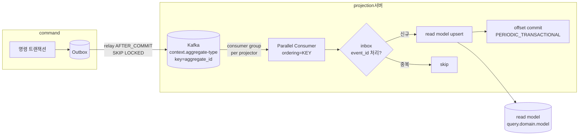
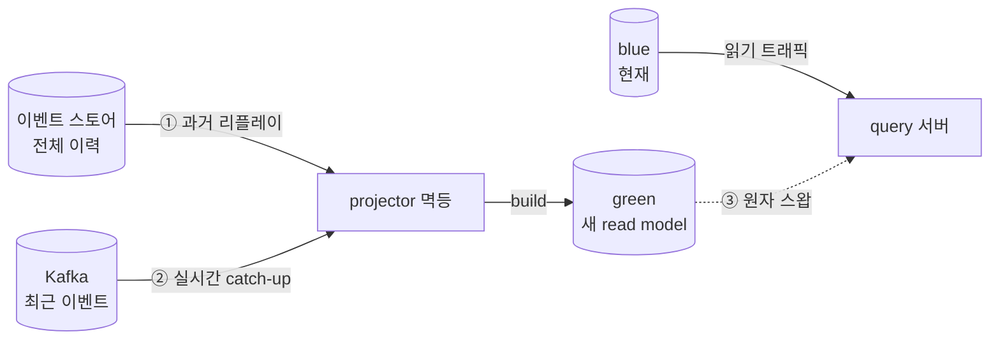

# 07 · query — Projection 서버 (command 결과 → 투영) [신규]

> 허브: [[00-module-index]] | 근거: [[DESIGN-004]] (읽기 모델) · [[DESIGN-008]] (메시징·전달보장) · [[RFC-011]] (재구축·catch-up) · [[DESIGN-010]] §4 (workload) · 루트 `kafka-parallel-consumer-architecture.md`

query-module은 **한 코드 모듈**이지만 런타임엔 두 워크로드로 뜬다. 이 문서는 그중 **쓰기 경로** — Kafka 이벤트를 소비해 read model을 **갱신하는 projection 서버**를 상세화한다. 읽기 경로(조회 API)는 [[08-query-read-model-server]].

> **왜 별도 워크로드인가**([[DESIGN-010]] §4.1): projector는 요청-응답이 아니라 **컨슈머 루프**다. 동시성(파티션 병렬), 스케일 축(컨슈머 수 = 파티션 수 상한), 장애 격리(lag이 쌓여도 조회 API는 계속 서빙)가 조회 서버와 완전히 다르다. 그래서 처음부터 별 Deployment로 분리한다.

---

## 1. 책임

- Kafka `contract` 통합 이벤트 구독 → 비정규화 read model(`model/`) 갱신
- 멱등 처리(inbox 또는 자연 멱등 upsert)로 at-least-once 중복 흡수 → effectively-once
- 프로젝션 재구축·catch-up·무중단 교체(blue-green)
- DLQ 운영 루프 (poison message 격리·알람)

## 2. 의존성

| 항목 | 값 |
|------|-----|
| **허용 의존** | `contract-module`, `shared-module` |
| **금지** | **`command-*` 전체** — query는 contract 이벤트만 안다 |
| **구조** | Layered — `projection/`(쓰기 경로) |
| **구현 시점** | **Phase 7-5** |

## 3. 사용 라이브러리 ⭐

projection 서버의 **성능 핵심**은 Confluent Parallel Consumer다.

| 라이브러리 | 버전 | 용도 |
|-----------|------|------|
| `io.confluent.parallelconsumer:parallel-consumer-core` | `0.5.3.2` | **Key별 순서 보장 + 병렬 처리**. `@KafkaListener` 순차(20 msg/s) 한계를 10배 개선(200 msg/s) — 루트 kafka 노트 |
| `spring-kafka` | `3.3.1` | Consumer 팩토리·설정·오프셋 관리 기반 |
| `spring-boot-starter-data-jpa` | `3.4.5` | read model + inbox 테이블 upsert |
| `mysql-connector-j` | `8.0.33` | query MySQL 드라이버 |
| `flyway-core` + `flyway-mysql` | `10.0.0` | read model·inbox·offset 스키마 (도메인별 스키마 분리) |
| `spring-retry` | (Boot BOM) | 즉시 3회 재시도 → 백오프([[DESIGN-008]] §4.10) |
| `jackson-module-kotlin` | (Boot BOM) | 이벤트 역직렬화 |
| `spring-boot-starter-actuator` | `3.4.5` | consumer lag·헬스/레디니스 노출 |
| (테스트) `testcontainers-kafka`·`-mysql`·`-junit` | `2.0.3` | E2E: 발행→소비→투영 |
| (테스트) `spring-kafka-test` | `3.3.1` | 임베디드 Kafka |
| (테스트) `kotest-*` | `5.9.0` | projector 멱등·순서 테스트 |

### 3.1 왜 Parallel Consumer인가 (루트 `kafka-parallel-consumer-architecture.md`)

- **문제**: 기본 `@KafkaListener` 순차 처리 = 20 msg/sec 병목
- **해법**: `PERIODIC_TRANSACTIONAL` 오프셋 모드 + Key별 순서 보장 병렬 처리
- **Key 설계**: `timeTableId_timeTableOccupancyId` 같은 복합 키로 독립 처리 보장, 동일 키는 순서대로
- **성과**: 200 msg/sec(10배), 에러율 <0.1%, CPU 15%→70%, `max-concurrency` 4→8→16 점진 튜닝

## 4. 구조

```
query-module/com.reservation.query
├── reservation/projection/
│   ├── ReservationListProjector.kt        # reservation.reservation 구독 → 예약 목록/상세 갱신
│   ├── ReservationRestaurantNameProjector.kt  # restaurant.restaurant 구독 → 식당명 비정규화
│   └── inbox/ReservationInbox.kt           # 멱등 기록(event_id)
├── timetable/projection/
│   └── TimeTableAvailabilityProjector.kt   # timetable.timetable 구독 → 가용시간 뷰
├── restaurant/projection/
│   └── RestaurantSearchProjector.kt
└── config/
    ├── ParallelConsumerConfig.kt           # max-concurrency, ordering=KEY, PERIODIC_TRANSACTIONAL
    ├── KafkaConsumerConfig.kt              # consumer group per projector, cooperative-sticky
    └── ProjectionRebuildConfig.kt          # 재구축/catch-up 오케스트레이션
```

---

## 5. 소비 파이프라인 (command 결과가 read model이 되기까지)



### 5.1 컨슈머 그룹 = projector별 pub/sub 팬아웃 ([[DESIGN-008]] §4.4)

각 projector는 **자기 전용 컨슈머 그룹**을 가진다. `reservation.reservation` 토픽을 `ReservationListProjector`와 (식당명 비정규화가 필요한) 다른 projector가 각자 오프셋으로 독립 소비.

- **리밸런싱 전략**: `cooperative-sticky`(incremental) — stop-the-world 방지, 영향받는 파티션만 점진 이양
- **competing consumers**: 한 projector 수평 확장 = 같은 그룹에 인스턴스 추가. 병렬 상한 = 파티션 수. 동일 `aggregate_id`는 한 인스턴스가 순서대로

### 5.2 멱등 — inbox 패턴 ([[DESIGN-008]] §4.5)

```kotlin
// read model 갱신 + inbox 기록을 한 트랜잭션으로
@Transactional
fun on(event: ReservationCancelled) {
    if (inbox.exists(event.eventId)) return          // 이미 처리 → skip
    readModel.upsert(project(event))                 // 비정규화 갱신
    inbox.mark(event.eventId)                         // 처리완료 (같은 txn)
}
```

- **inbox 생략 자격**: "순서 역전 없음 **+** 자연 멱등 upsert"를 **동시에** 만족할 때만. 둘 중 하나라도 깨지면 inbox 유지. Zero Payload upsert는 두 번 처리해도 결과 동일이라 생략 후보지만, 파티션 증설·리밸런싱·relay 재시도가 순서 가정을 국소적으로 깰 수 있어([[DESIGN-008]] 자기리뷰) **컨슈머별 검증 후** 결정
- **inbox 수명**: 무한 축적 금지. 재처리 윈도를 덮을 만큼 짧게 보존 + 주기적 GC

### 5.3 오프셋·드레인 ([[DESIGN-008]] §4.6)

- 오프셋 모드 = `PERIODIC_TRANSACTIONAL` (메시지 유실 방지)
- **그레이스풀 셧다운**: 현재 배치를 끝까지 처리하고 오프셋 커밋 후 종료(인플라이트 드레인). 드레인 없이 죽어도 멱등이 흡수하나 비효율 → 드레인으로 재처리량 축소
- 한 줄: **멱등은 안전망, 드레인은 효율**

---

## 6. 다중 소스 프로젝션 — 교차 컨텍스트 비정규화 ([[DESIGN-004]] §4.5)

한 예약 read model 행은 **두 소스**에서 갱신된다 — 예약 이벤트 스트림 + 식당 이벤트 스트림.

```
restaurant(ES) --RestaurantRenamed--> reservation.projection --식당명 칼럼 갱신--> read model
reservation(ES) --ReservationCreated--> reservation.projection --예약행 생성--> read model
```

예약 조회는 **조인 없이** 빠르게 읽고, 컨텍스트 결합은 이벤트로만 한다.

> **미해결(반박 — [[DESIGN-004]] 자기리뷰)**: "한 이벤트 = 한 트랜잭션 + 오프셋 커밋" 아래서 식당명이 바뀐 뒤 리네임 이벤트를 아직 처리 못 한 예약 행과 이미 처리한 행이 공존하는 **부분 갱신**이 정상 동작이 된다. 다중 소스 갱신의 순서·원자성·"어느 시점 스냅샷"은 구현 사이클에서 확정 필요. 비-ES lookup(메뉴/카테고리)을 ES 예약이 함께 보여줘야 하는 화면도 첫 레퍼런스에서 바로 터질 결정.

---

## 7. 재구축 · catch-up · 무중단 교체 ([[RFC-011]])

read model은 이벤트에서 파생된 2차 구조물이라 **언제든 버리고 다시 만들 수 있어야** 한다. 재구축이 필요한 순간 넷: (1) 스키마 변경, (2) projector 버그 정정, (3) 신규 read model 무중단 투입, (4) PII 셰딩 정정([[RFC-005]]).



- **진실 원천 = 이벤트 스토어**(전체 이력 무한 보관). 토픽은 retention이 짧아([[DESIGN-008]] §4.11) 경계 이전이 비므로 **재구축 소스로 못 씀**. 2단 구조: 과거는 스토어 리플레이, 현재는 토픽 catch-up
- **무중단 교체**: blue-green — green을 뒤에서 채우고 catch-up 완료 후 원자 스왑. 읽기 트래픽 무중단
- **정확성 불변식 재사용**([[RFC-021]]): per-aggregate 순서(파티션 키) + 멱등 upsert + `sequence_no` 버전 가드를 그대로 운영면에서 재사용 — 새로 발명하지 않음
- **미결(반박)**: 과거 리플레이 시 Zero Payload projector가 "최신 상태 조회"로 채우면 v3 재처리에 v5 값이 박히는 **time-travel 오염** 위험. → contract 페이로드 ES=event-carried 분기([[02-contract-module]] §5.2)로 해소 방향

---

## 8. 백프레셔 · lag · DLQ

### 8.1 consumer lag = 읽기 신선도 지표 ([[DESIGN-008]] §4.7)

lag = 토픽 최신 오프셋 − 컨슈머 커밋 오프셋 = read model 최종 일관성 지연의 **직접 지표**. Actuator + Kafka lag exporter로 관측. 백프레셔 대응: (1) competing consumers 병렬 확장(상한=파티션), (2) 갱신 경량화(upsert), (3) 파티션 증설(정지 감수).

> **미결(반박)**: 읽기 확장을 "HA 레플리카"로만 풀면 프로젝션 **쓰기** 병목은 안 풀린다(프라이머리 집중). 핫 스트림 lag은 레플리카로 안 줄어듦 — projector 쪽 스케일 축을 별도로 관리해야([[DESIGN-004]] 자기리뷰).

### 8.2 DLQ 운영 루프 ([[DESIGN-008]] §4.10)

즉시 3회 재시도 → 지수 백오프 → DLQ 격리 → **알람 채널(Slack) + 기본 수동 재생**.

> **미결(반박)**: DLQ 수동 재생이 순서 보장을 깬다 — seq 5가 DLQ로 빠지고 6·7이 처리된 뒤 5를 재생하면 애그리거트별 순서 역전. inbox는 "중복"만 보지 "앞 순서 건너뜀"은 못 봄 → [[RFC-025]] ordering-relay-dlq-reconciliation에서 확정.

### 8.3 비-멱등 부수효과 ([[DESIGN-008]] §4.8)

알림·외부 결제 연동은 upsert로 흡수 안 됨 → at-least-once 재처리에서 두 번 발사. 기본: 모든 비-멱등 부수효과를 inbox(수신)/부수효과 outbox(발신)로 래핑.

---

## 9. 할 일

- [ ] `ParallelConsumerConfig` — `ordering=KEY`, `PERIODIC_TRANSACTIONAL`, `max-concurrency` 4→8→16 점진
- [ ] consumer group per projector + `cooperative-sticky`
- [ ] 레퍼런스: `TimeTableAvailabilityProjector`
- [ ] 레퍼런스: `ReservationListProjector` (+ 식당명 비정규화 다중 소스)
- [ ] 레퍼런스: `RestaurantSearchProjector`
- [ ] inbox 테이블 + 멱등 기록/GC (도메인별 스키마)
- [ ] Flyway: read model + inbox 스키마 (도메인별 분리)
- [ ] 재구축·catch-up·blue-green 오케스트레이션([[RFC-011]])
- [ ] DLQ + 재시도/백오프 + Slack 알람
- [ ] Actuator lag 관측
- [ ] E2E 테스트 (Command → Event → Projection → Query, Testcontainers Kafka+MySQL)

## 10. 미결 요약

| # | 항목 | 귀속 |
|---|------|------|
| P-1 | 다중 소스 프로젝션 원자성·순서 | 구현 사이클 · [[DESIGN-004]] |
| P-2 | inbox 생략 자격 컨슈머별 검증 | 구현 사이클 · [[DESIGN-008]] |
| P-3 | Zero Payload 재처리 time-travel 오염 | [[02-contract-module]] · [[RFC-029]] |
| P-4 | DLQ 재생·relay 병렬성 순서 보존 | [[RFC-025]] |
| P-5 | projector 쓰기 병목 스케일 | [[DESIGN-004]] · [[DESIGN-010]] |

## 11. 악마의 변호인 (Devil's Advocate)

> 이 문서 설계에 대한 가장 강한 반론 (구현 전 스트레스 테스트용).

**Position (한 줄)**: read model은 이벤트에서 파생된 버릴 수 있는 2차 구조물이니, Parallel Consumer(KEY 순서) + inbox 멱등 + blue-green 재구축이면 at-least-once를 effectively-once로 흡수하며 안전하게 쓰기 경로를 운영할 수 있다.

**Steel-man (한 줄)**: 조회 API와 컨슈머 루프를 별 Deployment로 갈라 장애를 격리하고, 정확성 불변식(per-aggregate 순서·멱등·버전 가드)을 발명하지 않고 재사용하며, 틀리면 통째로 다시 만들 수 있게 설계한 것은 CQRS/ES 읽기 모델 운영의 정석이다.

### 숨은 가정

1. **inbox는 `event_id` dedup만으로 충분하다** (§5.2 예시가 `inbox.exists(eventId)`만 본다). 즉 "중복은 흡수, 순서는 Kafka 파티션이 지켜준다"를 전제한다.
2. **projector의 스케일 축 = concurrency 노브 / 파티션 수**(§5.1, §8.1). DB upsert 자체가 병목이 아니라는 가정.
3. **부분 갱신(다중 소스 순서 역전)은 "정상 동작"으로 받아들일 수 있다**(§6). 즉 최종 일관성 지연이 비즈니스적으로 허용된다는 가정.

### 반론

**반론 1 — 이 문서는 자기 의존 문서(RFC-025)에 이미 superseded된 결정을 그대로 싣고 있다.**
Steel-man: 재시도→DLQ→수동 재생(§8.2)과 competing-consumers/SKIP LOCKED(§5.1)는 표준 메시징 운영 패턴이다.
이 문서 한정 비판: [[RFC-025]]는 상태 **🏷 합의(2026-07-04)**로, (a) SKIP LOCKED 경쟁 relay를 **단일 순차 relay(ShedLock)**로 supersede하고, (b) **DLQ는 라이브 스트림에 절대 되쏘지 않음 — 복구는 event_store 재구축**으로 수동 재생을 supersede했다. 그런데 §8.2는 여전히 "기본 수동 재생"을, §5.1은 여전히 "competing consumers"를 규범으로 적는다. P-4는 이걸 "[[RFC-025]]에서 확정"이라며 미결로 미루지만 RFC-025는 이미 확정됐다 — 문서가 자기 의존성보다 뒤처져 있다. 구현자가 이 문서만 보면 이미 폐기된 복구 절차를 코딩한다.
`[구조적 / structural]` · **치명적(critical)** · 선례: 상류 결정과 하류 런북이 어긋난 채 배포되어 on-call이 폐기된 절차를 따라 사고를 키운 사례는 흔하다 — Knight Capital(구·신 코드 경로 혼재로 45분 만에 $440M 손실).

**반론 2 — 이 projector의 inbox 스키마로는 문서가 약속한 정확성 불변식을 구현할 수 없다.**
Steel-man: §7이 "정확성 불변식 재사용(per-aggregate 순서 + 멱등 upsert + `sequence_no` 버전 가드)"을 명시했으니 순서 역전은 가드가 잡는다.
이 문서 한정 비판: 그 가드의 물리적 토대를 [[RFC-025]] 결정 5가 못박았다 — "inbox에 **aggregate별 last-applied `sequence_no`** 추가". 그런데 §5.2의 inbox는 `event_id`만 기록한다("봤나?"만 봄). sequence_no가 없으면 Last-Writer-Wins 가드도, 갭 감지도 불가능하다. 즉 §7이 "재사용한다"고 선언한 불변식은 §5.2가 정의한 자료구조 위에서 **성립하지 않는다**. §9 할 일 목록에도 "inbox 테이블 + 멱등 기록/GC"만 있고 seq 칼럼이 없다. 문서가 스스로 모순된다.
`[구조적 / structural]` · **높음(high)** · 선례: dedup만 하고 순서 갭을 못 보는 컨슈머가 재정렬 하에 조용히 오염되는 것은 at-least-once 프로젝션의 전형적 실패다(RFC-025 §59가 직접 자인).

**반론 3 — "병렬 상한 = 파티션 수"와 "Parallel Consumer로 파티션 한계 돌파"는 같은 문서 안에서 충돌하고, 진짜 상한(DB 쓰기)은 아무도 재지 않았다.**
Steel-man: 파티션 증설로 competing consumers를 늘리면 lag이 준다(§8.1).
이 문서 한정 비판: §3은 Parallel Consumer의 존재 이유가 "파티션=동시성" 한계를 깨서 단일 컨슈머로 20→200 msg/s를 내는 것이라고 자랑한다. 그런데 §5.1·§8.1은 "병렬 상한 = 파티션 수"라는 **정반대** 스케일 모델을 규범으로 삼는다. 두 모델이 공존한다. 게다가 무트래픽 프로토타입에서 실제 상한은 파티션도 concurrency도 아니라 **read model DB upsert**다 — 특히 RFC-025의 LWW seq 가드는 aggregate 행에 대한 read-modify-write(버전 비교)라 핫 애그리거트(예: 식당 리네임이 수천 예약 행에 팬아웃)에서 **행 잠금 경합**을 만든다. concurrency를 4→8→16으로 올릴수록 경합은 악화된다. 문서는 이 상한을 한 번도 측정하지 않는다(P-5는 "레플리카로 안 풀린다"까지만 말하고 쓰기 상한 자체는 미측정).
`[가정 / assumption]` · **높음(high)** · 선례: 컨슈머 병렬도를 올려도 downstream DB 쓰기에서 막혀 lag이 안 줄고 오히려 락 경합으로 악화되는 것은 CDC/프로젝션 파이프라인의 흔한 벽이다.

### 다중 페르소나 공격

**On-call / SRE — 새벽 3시.**
`reservation.reservation` lag이 임계치를 넘겨 페이지가 뜬다. 런북대로 projector 인스턴스를 4→6으로 스케일아웃한다 — 파티션이 4개라 5·6번째 인스턴스는 그냥 놀고(idle) lag은 안 줄어든다(§5.1의 "상한=파티션"이 물어버린 함정). 진짜 원인은 한 인기 식당의 `RestaurantRenamed`가 수천 예약 행에 팬아웃하며 LWW 버전 가드가 행 잠금을 붙잡는 DB 경합인데, 대시보드엔 그 지표가 없다(lag만 있음, §8.1). 동시에 DLQ Slack 알람이 울리고 이 문서 §8.2 런북은 "수동 재생"을 지시한다. 그대로 seq 5를 되쏘지만 6·7은 이미 처리됐고, 순서 역전을 잡아줄 LWW 가드는 이 projector에 구현돼 있지 않다(반론 2) — 한 예약이 취소→확정으로 뒤집힌 채 굳는다. 최후 수단인 blue-green 재구축을 걸지만 event_store 전체 리플레이는 진행률 표시도 fencing도 없어(§7 "원자 스왑"은 한 줄), 몇 시간짜리 리플레이가 끝날 때까지 green이 blue의 마지막 오프셋을 실제로 따라잡았는지 확인할 길이 없다.

**주니어 — 입사 첫날.**
§5.2의 깔끔한 inbox 예시를 그대로 베껴 `ReservationListProjector`를 짠다 — `event_id`만 기록. RFC-025가 요구하는 aggregate `sequence_no`는 이 문서 어디에도 코드로 없으니 넣을 생각을 못 한다. 그리고 §3.1의 "복합 키 `timeTableId_timeTableOccupancyId`"를 Parallel Consumer의 ordering 키로 쓴다 — 하지만 §5 mermaid와 RFC-021의 파티션 키는 `aggregate_id`다. 순서 단위가 갈린다: 같은 aggregate의 두 이벤트가 서로 다른 KEY 레인으로 흩어져 부하 상황에서 재정렬된다. 로컬 단일 스레드 E2E(§10)는 통과한다 — 재정렬은 동시성이 있어야 드러나므로. 프로덕션 concurrency=16에서만 조용히 깨진다.

### 핵심 취약점 (하나)

**projector의 inbox가 `event_id`-only라는 점.** relay 재정렬·DLQ·재구축 하의 정확성 서사(§7·§8) 전체가, 문서가 정의하지도 스케줄하지도 않은 자료구조(aggregate별 last-applied `sequence_no`, [[RFC-025]] 결정 5)에 의존한다. 이 한 칼럼의 부재가 반론 1·2·3과 두 페르소나 시나리오를 모두 관통한다.

### 가역성

**혼합 — read model 값 오류는 reversible(재구축이 이 설계의 최강 카드), 그러나 inbox 스키마 + 파티션 키 계약은 one-way door.** 첫 레퍼런스 projector가 `event_id`-only inbox와 복합 키를 굳히고 나면 나머지 projector들이 그 패턴을 복제하고 Flyway 마이그레이션·토픽 키가 그 위에 쌓여, 되돌리려면 전 projector 재작성 + 토픽 재키잉이 필요해진다. 지금(첫 레퍼런스 착수 전, Phase 7-5)이 그 문을 닫기 전 마지막 지점이다.
