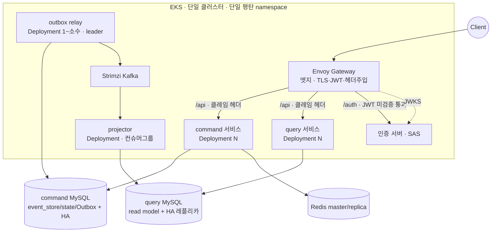

# 11 · Runtime Topology (워크로드 ↔ 모듈 배치)

> 허브: [[00-module-index]] | 근거: [[DESIGN-010]] (배포·런타임 뷰) · [[RFC-007]] (배포·인프라·운영)

모듈(빌드·코드 경계)과 워크로드(런타임 프로세스)는 **1:1이 아니다**. 이 문서는 그 대응을 못 박는다. 특히 query-module 하나가 **두 워크로드**(projection 서버 / read model 서버)로 갈라지는 이유를 여기서 정리한다.

## 1. 7개 워크로드 ↔ 모듈 ([[DESIGN-010]] §4.1)

| 워크로드 | 책임 | 출처 모듈 | 상태성 | 상세 문서 |
|----------|------|-----------|--------|-----------|
| **command 서비스** | 명령 수신·검증·쓰기(event_store/state+Outbox) | `command-module` | stateless(DB가 상태) | [[05-command-adapter]] |
| **query 서비스** (read model 서버) | 조회 — read model → DTO | `query-module` (web/service/repository) | stateless | [[08-query-read-model-server]] |
| **projector** (projection 서버) | Kafka 구독 → read model 갱신 | `query-module` (projection) | stateless, 컨슈머 그룹 상태는 Kafka | [[07-query-projection-server]] |
| **outbox relay** | Outbox → Kafka 발행 | `command-infrastructure` | 단일성(Quartz 클러스터 리더), N 대칭 배치 | [[06-command-infrastructure]] · [[ADR-009-event-ordering-and-delivery-guarantee]] |
| **Envoy Gateway** (엣지) | 엣지 단일 홉 — TLS 종단·무상태 JWT 검증(JWKS)·클레임 헤더 주입·rate limit | 별도(Envoy Gateway · Gateway API) | stateless | [[ADR-024-authentication-boundary]] |
| **인증 서버** | 토큰 발급·refresh rotation·JWKS | `auth-server-module` | stateless | [[09-auth-server-module]] |
| **(데이터 면)** | Kafka(Strimzi)·command/query 분리 MySQL(binlog HA)·Redis(master/replica) | 호스팅 투명 | stateful | — |

## 2. 핵심 배치 결정 ([[DESIGN-010]] §4.1)

- **command/query를 포함한 각 앱 워크로드는 처음부터 별도 배포 + 노드 분리.** 코드(모듈) 분리에 더해 런타임도 워크로드별 별도 Deployment(파드당 컨테이너 1개)로 뜨고 각자 다른 노드에 놓인다. 격리는 네임스페이스가 아니라 **노드 분리**에서 온다([[ADR-026-workload-runtime-placement]] — RFC-001 L90 비목표를 대체). "부하가 요구할 때 물리 분리"라는 유예 트리거는 폐기
- **projector와 outbox relay는 처음부터 별 워크로드로 분리.** 요청-응답 수명주기와 다른 동시성·스케일·장애 격리 특성 때문
  - projector: 컨슈머 루프, 스케일 축 = 컨슈머 수(상한 = 파티션 수), lag이 쌓여도 조회는 무중단
  - relay: 폴링 + 단일성(Quartz 클러스터 리더), 발행 실패가 조회/명령과 격리

## 3. 목표 클러스터 토폴로지 ([[DESIGN-010]] §4.2)

> 각 앱 워크로드(Envoy Gateway·인증 서버·command·query·projector·relay)는 별도 Deployment로 **서로 다른 노드**에 배치된다. namespace는 **단일 평탄** — 격리는 노드에서 온다([[ADR-026-workload-runtime-placement]]). 데이터 면(Kafka/Strimzi·MySQL·Redis)은 stateful 별 축([[ADR-012]]·[[ADR-013]]).

## 4. 확장 축

| 워크로드 | 확장 방법 | 상한/제약 |
|----------|-----------|-----------|
| command 서비스 | replica 증설 | DB 커넥션 |
| query 서비스 | replica 증설 + query DB **HA 레플리카** | 캐시 아님, 인스턴스 분할 아님 |
| projector | 같은 컨슈머 그룹에 인스턴스 추가(competing consumers) | **파티션 수** |
| outbox relay | N 대칭 replica + Quartz 중재(한 트리거=한 노드) | 단일성 우선 |

## 5. 관련 문서

- 배포·런타임: [[DESIGN-010]] · 인프라·운영 RFC: [[RFC-007]]
- 워크로드 배치: [[ADR-026-workload-runtime-placement]] · 인증 경계/엣지: [[ADR-024-authentication-boundary]]
- Kafka 호스팅: [[ADR-012]] · DB 토폴로지: [[ADR-013]]
