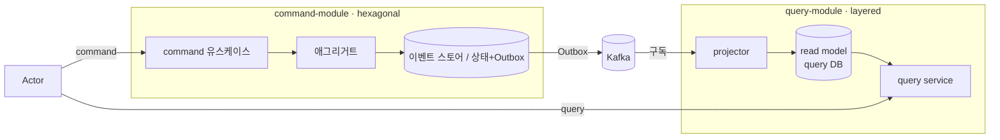

# RFC-001: V2 — CQRS 모듈 분리와 선택적 이벤트 소싱

- **상태**: 합의됨 (2026-06-12)
- **사이클**: `20260612-v2-cqrs-es-architecture` (exploration)
- **범위**: V1 → V2 전환의 아키텍처 방향 결정
- **선행 분석**: [[00-overview]] · [[01-current-state]] · [[02-domain-limitations]] · [[03-open-decisions]]
- **계승**: [[07.reservation]] (v1 — Kafka 기반 Timetable·Reservation EDA)

## 맥락

V1은 헥사고날 아키텍처와 DDD로 시작했고, 도메인/JPA 엔티티 분리([[01.ddd]])·포트와 어댑터([[02.hexagonal]])·Kafka EDA([[07.reservation]])라는 좋은 토대를 갖췄다. 그러나 이벤트 소싱·CQRS 관점에서 진단하면 다음 한계가 드러난다(상세 [[02-domain-limitations]]).

- 도메인이 **빈약(anemic)** 하다 — 상태 변경 로직의 ~95%가 `*DomainService`에 있고, 애그리거트는 `var` + setter 데이터 홀더다.
- **도메인 이벤트가 거의 없다** — 9개 컨텍스트 중 `timetable`·`restaurant` 둘만 각 1건의 도메인 이벤트를 가진다.
- **읽기와 쓰기가 같은 모델·DB를 공유**한다 — 포트 인터페이스만 분리돼 있다.

동시에 **이미 검증된 자산**이 있다 — `timetable` 컨텍스트는 Transactional Outbox + Kafka가 작동하며([[07.reservation]]), 이는 V2 이벤트 드리븐의 레퍼런스다.

V2의 목표는 세 가지다 — **(1) Read/Write 모델 분리(CQRS), (2) 이벤트 소싱, (3) 이벤트 드리븐.** 본 RFC는 이 세 목표를 어떤 강도로, 어떤 구조로 달성할지 결정한 과정과 결론을 기록한다.

## 목표 / 비(非)목표

**목표**
- 핵심 예약 플로우의 이력·감사·동시성을 이벤트로 다룬다.
- 읽기를 쓰기로부터 독립시켜(CQRS) 모델·확장을 분리한다.
- 컨텍스트 간 통합을 이벤트(메시지)로 느슨하게 묶는다.

**비목표 (이번 V2에서 하지 않음)**
- 9개 전 컨텍스트 전면 이벤트 소싱.
- 전용 이벤트 스토어 제품(EventStoreDB/Axon 등) 도입.
- command/query의 물리적 서비스 분리(별도 배포).
- 빅뱅 전환.

## 결정 요약

| # | 결정 | ADR |
|---|------|-----|
| 1 | command / query 를 **top-level Gradle 모듈로 분리**, 도메인은 각 모듈 내 패키지 | [[01.cqrs-command-query-module-split]] |
| 2 | **선택적 이벤트 소싱** — `reservation`·`timetable`·`restaurant` 만 진짜 ES | [[02.selective-event-sourcing-scope]] |
| 3 | **command = hexagonal, query = layered** (아키텍처 비대칭) | [[03.command-hexagonal-query-layered]] |
| 4 | 읽기 = 이벤트 프로젝션 read model(query DB), 저빈도는 **경량 lookup 프로젝션**. replica는 HA 전용 | [[04.read-model-projection-and-replica]] · [[13.db-hosting-and-read-write-topology]] |
| 5 | 이벤트 스토어 = **MySQL 이벤트 테이블 직접 구현** | [[05.event-store-mysql-table]] |
| 6 | **Strangler 점진 전환** — timetable 선행을 템플릿으로 | [[06.strangler-migration]] |

목표 아키텍처의 상세 설계는 [[00-design-overview]] 이하 design_doc 을 참조.

## 검토와 결정

각 결정의 원자적 기록(검토한 옵션·근거·트레이드오프)은 해당 ADR에 있다. 여기서는 **결정에 이른 맥락과 연결**만 서술한다.

### 1. 이벤트 소싱을 어디까지 적용하는가 → [[02.selective-event-sourcing-scope]]
"전면 ES / 선택적 ES / CQRS 먼저" 를 검토했다. 전면 ES는 `category` 같은 lookup 컨텍스트에 과잉이고, CQRS-먼저는 목표 미달이다. **핵심 예약 플로우(`reservation`·`timetable`·`restaurant`)만 진짜 ES**, 나머지는 상태 기반 + Outbox 또는 현행으로 결정했다. 이력·감사·동시성 충돌이 본질인 곳에만 ES의 비용을 지불한다.

### 2. 비-ES 컨텍스트도 이벤트 드리븐에 참여한다 → [[02.selective-event-sourcing-scope]]
ES가 아니어도 다른 컨텍스트가 그 변화를 구독해야 하면 **Outbox로 통합 이벤트를 발행**한다(timetable 패턴 일반화). ES냐 비-ES냐의 차이는 "내 상태를 이벤트로 쌓느냐, 테이블로 들고 있느냐"일 뿐, **대외 이벤트 발행 방법은 동일(Outbox→Kafka)** 하다.

### 3. command / query 모듈 분리 → [[01.cqrs-command-query-module-split]]
가장 길게 논의한 지점이다. 세 가지를 저울질했다.
- **풀 버티컬(top-level command/query 분리)** — command↔query 격리가 가장 깔끔, "읽기 전체를 query 서비스로 분리"가 쉬움.
- **공유 core + 애플리케이션/읽기에서만 분리** — 모듈 수가 적음.
- **컨텍스트(도메인)-top 분리** — "도메인별 서비스 분할"이 쉬움.

`풀 버티컬`은 top-level 축이 CQRS라 **"도메인별 분할"이 비싸진다**는 트레이드오프를 검토했으나, **도메인을 각 모듈 내 깨끗한 패키지로 분리**하면(나중에 같은 이름 패키지를 양쪽에서 들어내면 됨) 그 비용이 수용 가능하다고 판단해 **풀 버티컬 + 도메인 패키지**를 택했다.

### 4. command 와 query 의 아키텍처 비대칭 → [[03.command-hexagonal-query-layered]]
**command = hexagonal**(리치 도메인·포트/어댑터), **query = layered**(web→service→repository)로 둔다. 쓰기는 도메인 격리가 값어치를 하고, 읽기는 "DB→DTO"라 hexagonal 격식이 낭비다 — 경제성을 위한 의도된 비대칭이다. query는 도메인 core에 **의존하지 않고**, `contract`의 이벤트로만 read model을 채운다.

### 5. 읽기 모델 전략 → [[04.read-model-projection-and-replica]]
top-level 분리의 귀결로 query는 command의 테이블을 직접 못 읽는다(스키마 결합 = 안티패턴). 따라서 읽기는 **이벤트 프로젝션 read model**(query DB)이 기본이며, 저빈도 컨텍스트도 query DB 안의 **경량 lookup 프로젝션**으로 조회한다(command DB·replica 직접 읽기 금지 — replica는 HA 전용).

### 6. 이벤트 스토어 구현 → [[05.event-store-mysql-table]]
ES 컨텍스트의 쓰기 저장소는 **MySQL의 append-only 이벤트 테이블로 직접 구현**한다. 현 규모에서 전용 제품은 운영 복잡도가 과하며, 기존 스냅샷 패턴을 ES 스냅샷 최적화로 재활용한다.

### 7. 마이그레이션 전략 → [[06.strangler-migration]]
**Strangler 점진 전환**. `timetable`(이미 이벤트 인지)을 템플릿으로, 컨텍스트 단위로 V2로 옮기며 기존과 병행한다.

## 결과 (목표 아키텍처 요약)

- command 측은 ES/비-ES에 따라 이벤트 스토어 또는 상태+Outbox에 쓴다.
- 모든 쓰기는 Outbox→Kafka로 통합 이벤트를 흘린다.
- query 측은 projector로 구독해 read model을 만들거나, 저빈도는 replica를 읽는다.

상세 모듈 트리·시퀀스는 [[01-module-structure]] · [[02-write-model]] · [[03-read-model]] 참조.

## 미결정 사항 및 선행 작업

- **이벤트 스토밍 재실시** — 기존 보드(`eventstoming.excalidraw`)는 DDD 입문기 산출물로 **참고용**이다. 도메인 이벤트 카탈로그는 재실시 후 확정한다.
- **도메인 이벤트 카탈로그** — 컨텍스트별 이벤트 목록·스키마·버전 정책 (TBD, 이벤트 스토밍 의존).
- **신규 기능** — 리뷰/별점·포인트·신고는 V2 요구사항에 포함되나 본 RFC의 아키텍처 결정 범위 밖이며, 컨텍스트로 추가될 때 동일 원칙을 따른다.
- **읽기 일관성 기준** — 프로젝션 지연 허용치, 동기 프로젝션 예외 케이스 (design_doc에서 구체화).

## 관련 문서
- 분석: [[00-overview]] · [[02-domain-limitations]] · [[03-open-decisions]]
- ADR: [[01.cqrs-command-query-module-split]] · [[02.selective-event-sourcing-scope]] · [[03.command-hexagonal-query-layered]] · [[04.read-model-projection-and-replica]] · [[05.event-store-mysql-table]] · [[06.strangler-migration]]
- 설계: [[00-design-overview]]
- 계승: [[07.reservation]] · [[02.hexagonal]] · [[01.ddd]]
