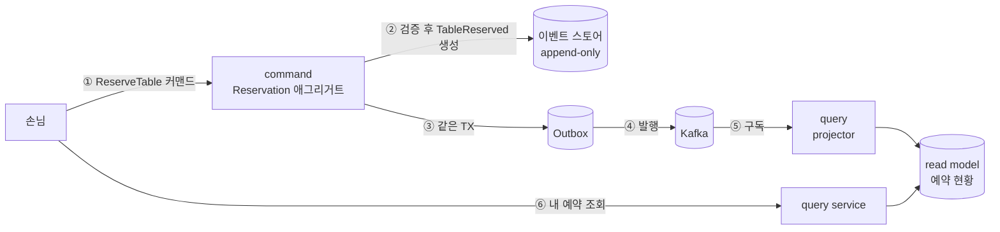
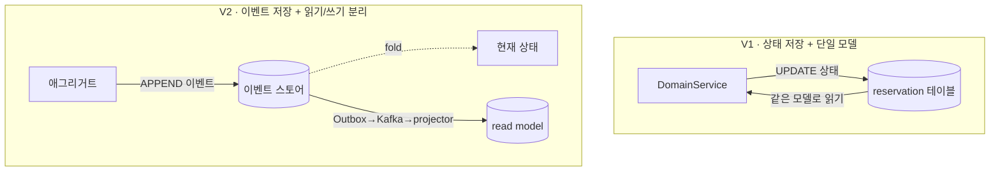
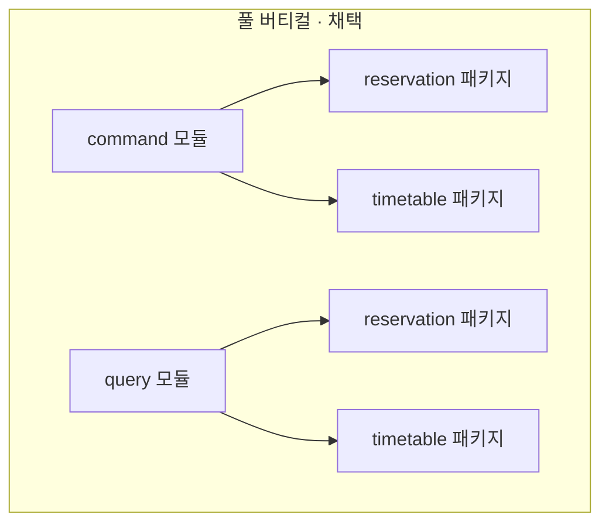
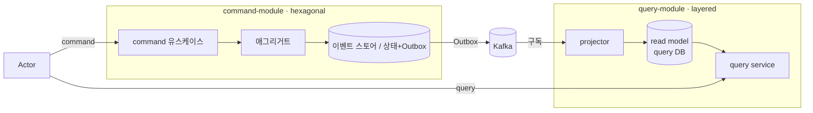

# RFC-001: V2 — CQRS 모듈 분리와 선택적 이벤트 소싱

- **상태**: 🏷 합의 (2026-06-12)
- **사이클**: `20260612-v2-cqrs-es-architecture` (exploration)
- **범위**: V1 → V2 전환의 아키텍처 방향 결정
- **선행 분석**: [[00-overview]] · [[01-current-state]] · [[02-domain-limitations]] · [[03-open-decisions]]
- **계승**: [[07.reservation]] (v1 — Kafka 기반 Timetable·Reservation EDA)

---

## 배경 (Background)

### 시나리오: 손님이 "오늘 19:00, 2인석"을 예약한다

**V1에서는 이렇게 흐른다.**
컨트롤러가 `ReservationDomainService`를 부르고, 서비스가 예약 가능 여부를 따진 뒤 `reservation` 테이블의 행을 직접 `UPDATE`한다. 끝나면 그 행이 곧 "현재 상태"다. 같은 테이블을 조회에도 그대로 쓴다. 문제는 — **무슨 일이 있었는지는 어디에도 안 남는다.** 누가 언제 예약했고 취소했는지, 왜 지금 이 상태인지는 마지막 한 줄만 보고는 알 수 없다. 읽기 트래픽과 쓰기 트래픽이 같은 모델·같은 DB를 두고 경합한다.

**V2에서는 이렇게 흐른다.**

1. **커맨드 수신** — `ReserveTable` 커맨드가 command 측으로 들어온다.
2. **규칙 검증 + 이벤트 생성** — `Reservation` 애그리거트가 "그 시간에 그 테이블이 비어 있나" 같은 불변식을 직접 검증하고, 통과하면 상태를 바꾸는 대신 **`TableReserved` 라는 '일어난 일(이벤트)'을 만든다.**
3. **이벤트 저장(append-only)** — 그 이벤트를 이벤트 스토어에 **덧붙인다.** 기존 행을 고치지 않는다. 예약의 "현재 상태"는 저장된 게 아니라, 이 스트림의 이벤트들을 처음부터 되짚으면(fold) 나오는 결과다.
4. **통합 이벤트 발행(Outbox)** — 같은 트랜잭션 안에서 Outbox 테이블에도 대외용 이벤트를 적는다(원자성 보장).
5. **전파** — Outbox가 Kafka로 이벤트를 흘려보낸다.
6. **읽기 모델 갱신** — query 측 projector가 그 이벤트를 구독해 "예약 현황" 같은 **조회 전용 read model**을 갱신한다. 이후 손님의 "내 예약 보기"는 이 read model만 읽는다 — 쓰기 경로를 건드리지 않는다.

### V1 ↔ V2, 무엇이 달라지나

V2가 손대는 건 결국 세 가지이고, 서로 독립적이다:

| 개념 | V1 | V2 | 한 줄 정의 |
|------|-----|-----|-----------|
| **CQRS** | 읽기·쓰기가 같은 모델·DB | 읽기 모델/쓰기 모델을 분리 | "조회용 모델과 변경용 모델을 따로 둔다" |
| **이벤트 소싱(ES)** | 현재 상태를 저장 | 일어난 일(이벤트)을 저장, 상태는 재생으로 도출 | "스냅샷이 아니라 변경 이력 자체가 진실" |
| **이벤트 드리븐** | (timetable만) Outbox+Kafka | 컨텍스트 통합을 이벤트 메시지로 | "컨텍스트끼리 이벤트로 느슨하게 묶는다" |

> **주의 — 이 셋은 전부-아니면-전무가 아니다.** V2의 핵심 결정(아래 논의)은 "어디까지, 어떤 강도로" 적용하느냐다. 이 RFC가 ES를 *전 컨텍스트에* 강제하지 않는 이유가 여기서 출발한다.

---

## 맥락 (Context)

V1은 헥사고날 아키텍처와 DDD로 시작했고, **좋은 토대를 이미 갖췄다** — 도메인/JPA 엔티티 분리([[01.ddd]]), 포트와 어댑터([[02.hexagonal]]), 그리고 `timetable` 컨텍스트의 Kafka EDA([[07.reservation]]). 다만 이벤트 소싱·CQRS 관점에서 진단하면(상세 [[02-domain-limitations]]) 세 가지 한계가 드러난다.

- **도메인이 빈약(anemic)하다.** 상태 변경 로직의 약 95%가 `*DomainService`에 모여 있고, 애그리거트는 `var` + setter를 가진 데이터 홀더에 가깝다. → 변경 규칙이 도메인 객체가 아니라 서비스에 흩어져 있으니, "이벤트를 만드는 주체"가 될 애그리거트가 비어 있다. ES로 가려면 여기를 먼저 채워야 한다.
- **도메인 이벤트가 거의 없다.** 9개 컨텍스트 중 `timetable`·`restaurant` 둘만 각각 1건의 도메인 이벤트를 가진다. → 시스템이 "무슨 일이 일어났는지"를 거의 말하지 않는다. 이벤트 드리븐의 원재료 자체가 부족하다.
- **읽기와 쓰기가 같은 모델·DB를 공유한다.** 포트 인터페이스만 갈라져 있을 뿐, 물리 모델은 하나다. → 읽기 최적화와 쓰기 정합성이 한 모델 안에서 충돌한다.

동시에 **이미 검증된 자산**이 있다 — `timetable` 컨텍스트의 Transactional Outbox + Kafka가 실제로 작동한다([[07.reservation]]). 이건 V2 이벤트 드리븐 전환의 살아있는 레퍼런스이자, "처음부터 다시"가 아니라 "검증된 패턴을 일반화"하면 된다는 근거다.

**그래서 V2의 목표는 세 가지다 — (1) Read/Write 모델 분리(CQRS), (2) 이벤트 소싱, (3) 이벤트 드리븐.** 본 RFC는 이 셋을 *어떤 강도로, 어떤 구조로* 달성할지 정한 논의와 결론을 기록한다. 핵심 긴장은 처음부터 분명하다 — **세 목표를 전부 최대 강도로 밀면 트래픽도 없는 프로토타입에 과한 복잡도를 지불하게 된다.** 아래 논의는 전부 "어디에 비용을 쓰고 어디서 아끼나"의 변주다.

---

## Goal / Non-goal

**Goal**
- 핵심 예약 플로우의 **이력·감사·동시성**을 이벤트로 다룬다.
- 읽기를 쓰기로부터 독립시켜(CQRS) 모델·확장을 분리한다.
- 컨텍스트 간 통합을 이벤트(메시지)로 느슨하게 묶는다.

**Non-goal (이번 V2에서 하지 않음)**
- 9개 전 컨텍스트 전면 이벤트 소싱.
- 전용 이벤트 스토어 제품(EventStoreDB/Axon 등) 도입.
- command/query의 물리적 서비스 분리(별도 배포).
- 빅뱅 전환.

---

## 논의 (Discussion)

### 논점 1. 이벤트 소싱을 어디까지 적용하는가 → [[02.selective-event-sourcing-scope]]

**맥락에서 나온 질문.** 도메인 이벤트가 거의 없고 도메인도 빈약한 상태(맥락 2·1)에서, ES를 *전부에* 깔면 가장 일관되지만 가장 비싸다. 어디까지가 적정선인가?

검토한 선택지:
- **전면 ES** — 9개 컨텍스트 전부. 일관성 최고, 비용 최고.
- **선택적 ES** — 이력·감사·동시성이 본질인 컨텍스트만.
- **CQRS 먼저, ES는 나중** — 읽기/쓰기 분리만 먼저.

**내 의견(AI):** `category` 같은 lookup성 컨텍스트에 ES는 명백한 과잉이다(거기엔 "이력"이라 부를 변화 자체가 거의 없다). 반대로 CQRS만 먼저 하면 V2의 핵심 목표인 이력·감사를 미달한다. **핵심 예약 플로우(`reservation`·`timetable`·`restaurant`)만 진짜 ES**, 나머지는 상태 기반으로 두는 게 비용 대비 학습/효용이 가장 크다.

**네 결정:** 선택적 ES 채택. 이력·감사·동시성 충돌이 본질인 곳에만 ES의 비용을 지불한다. 〔근거 확인/보강 필요〕

**결론:** `reservation`·`timetable`·`restaurant` = 진짜 ES. 그 외 = 상태 기반(+ 필요 시 Outbox) 또는 현행 유지.

### 논점 2. 비-ES 컨텍스트도 이벤트 드리븐에 참여하는가 → [[02.selective-event-sourcing-scope]]

**맥락에서 나온 질문.** 논점 1로 컨텍스트가 "ES / 비-ES"로 갈렸다. 그러면 비-ES 컨텍스트의 변화를 다른 컨텍스트가 알아야 할 때는 어떻게 전파하나?

**내 의견(AI):** ES냐 아니냐는 *내 상태를 어떻게 저장하느냐*(이벤트로 쌓기 vs 테이블로 들기)의 문제일 뿐, **대외 발행 방법까지 다르게 갈 이유가 없다.** 비-ES라도 구독 대상이 있으면 `timetable`이 쓰던 **Outbox로 통합 이벤트를 발행**하면 된다. 전파 메커니즘을 컨텍스트마다 다르게 두면 통합 지점이 누더기가 된다.

**네 결정:** 발행 경로는 ES/비-ES 공통으로 **Outbox→Kafka** 단일화. 〔근거 확인/보강 필요〕

**결론:** 저장 방식은 갈리되, 대외 이벤트 발행은 전부 Outbox→Kafka로 통일.

### 논점 3. command / query 모듈을 어떻게 가르는가 → [[01.cqrs-command-query-module-split]]

**맥락에서 나온 질문.** CQRS를 "모델 분리"로만 둘지, "모듈(빌드 단위) 분리"까지 갈지. **가장 길게 저울질한 지점이다.**

검토한 선택지:
- **풀 버티컬** — top-level을 `command`/`query` 모듈로 분리. command↔query 격리가 가장 깔끔하고, "읽기 전체를 query로 떼어내기"가 쉽다. 대신 top-level 축이 CQRS라 **"도메인별 분할"이 비싸진다.**
- **공유 core + 애플리케이션/읽기에서만 분리** — 모듈 수가 적다. 대신 격리가 약하다.
- **컨텍스트(도메인)-top 분리** — "도메인별 서비스 분할"이 쉽다. 대신 CQRS 축이 흐려진다.

**내 의견(AI):** 풀 버티컬의 유일한 약점은 "도메인별 분할 비용"인데, **각 모듈 안에서 도메인을 깨끗한 패키지로 갈라두면** 나중에 같은 이름 패키지를 양쪽에서 들어내는 것으로 그 비용을 대부분 상쇄한다. CQRS가 V2의 1순위 축이므로 top-level을 CQRS로 잡는 게 의도에 맞다.

**네 결정:** **풀 버티컬 + 모듈 내 도메인 패키지** 채택. 〔근거 확인/보강 필요〕

**결론:** `command`/`query`를 top-level Gradle 모듈로 분리, 도메인은 각 모듈 내 패키지로.

### 논점 4. command 와 query 의 아키텍처를 같게 둘까 → [[03.command-hexagonal-query-layered]]

**맥락에서 나온 질문.** 모듈을 갈랐으면, 양쪽 내부 구조도 같아야 하나? 쓰기는 리치 도메인이 필요하지만 읽기는 "DB→DTO"에 가깝다.

**내 의견(AI):** 대칭을 위한 대칭은 낭비다. **command = hexagonal**(리치 도메인·포트/어댑터로 불변식을 격리), **query = layered**(web→service→repository)로 두는 게 경제적이다. 읽기에 hexagonal 격식을 강요하면 얻는 것 없이 보일러플레이트만 는다. 단, query는 도메인 core에 **의존하지 않고** `contract`의 이벤트로만 read model을 채워야 결합이 끊긴다.

**네 결정:** 의도된 비대칭 채택. query는 core 비의존. 〔근거 확인/보강 필요〕

**결론:** command = hexagonal, query = layered. query는 이벤트(contract)로만 read model 구성.

### 논점 5. 읽기는 무엇을 읽는가 → [[04.read-model-projection-and-replica]]

**맥락에서 나온 질문.** 논점 3으로 top-level이 갈렸으니 query는 command의 테이블을 직접 못 읽는다(스키마 결합 = 안티패턴). 그럼 읽기 소스는 무엇인가? 저빈도 조회까지 전부 프로젝션을 만들어야 하나?

**내 의견(AI):** 읽기 기본은 **이벤트 프로젝션 read model**(query DB). 저빈도 컨텍스트라고 command DB나 replica를 직접 읽게 열어주면 결합이 되살아난다. 저빈도도 query DB 안의 **경량 lookup 프로젝션**으로 흡수하는 게 일관된다. replica는 읽기 분산용이 아니라 **HA 전용**으로 못 박는다.

**네 결정:** 프로젝션 기본 + 저빈도는 경량 lookup 프로젝션, replica는 HA 전용. 〔근거 확인/보강 필요〕

**결론:** 읽기는 전부 query DB(프로젝션). command DB·replica 직접 읽기 금지.

### 논점 6. 이벤트 스토어를 무엇으로 구현하는가 → [[05.event-store-mysql-table]]

**맥락에서 나온 질문.** 진짜 ES 컨텍스트(논점 1)의 쓰기 저장소가 필요하다. 전용 제품을 들이나, 직접 만드나?

**내 의견(AI):** 현 규모·트래픽에서 EventStoreDB/Axon 같은 전용 제품은 운영 복잡도가 과하다(배워야 할 운영 표면이 시스템보다 크다). **MySQL의 append-only 이벤트 테이블로 직접 구현**하면 충분하고, 기존 스냅샷 패턴을 ES 스냅샷 최적화로 재활용할 수 있다. 학습 목적상으로도 "직접 만들어보는" 쪽이 남는 게 많다.

**네 결정:** MySQL 이벤트 테이블 직접 구현. 〔근거 확인/보강 필요〕

**결론:** 이벤트 스토어 = MySQL append-only 테이블. 전용 제품 미도입.

### 논점 7. 어떻게 옮겨갈 것인가 → [[06.strangler-migration]]

**맥락에서 나온 질문.** 비목표에서 빅뱅은 배제했다(맥락의 "이미 검증된 자산" 활용 기조). 그럼 전환 순서와 방식은?

**내 의견(AI):** 이미 이벤트를 인지하는 `timetable`을 **첫 템플릿**으로 삼아, 컨텍스트 단위로 V2로 옮기며 기존과 병행하는 **Strangler**가 위험이 가장 낮다. 한 컨텍스트에서 패턴을 굳히고 나머지에 복제한다.

**네 결정:** Strangler 점진 전환, timetable 선행. 〔근거 확인/보강 필요〕

**결론:** Strangler. timetable을 레퍼런스 템플릿으로 컨텍스트별 점진 이행.

---

## 결정 요약

| # | 결정 | ADR |
|---|------|-----|
| 1 | **선택적 이벤트 소싱** — `reservation`·`timetable`·`restaurant` 만 진짜 ES | [[02.selective-event-sourcing-scope]] |
| 2 | 비-ES 컨텍스트도 **Outbox→Kafka로 통합 이벤트 발행** | [[02.selective-event-sourcing-scope]] |
| 3 | command / query 를 **top-level Gradle 모듈로 분리**, 도메인은 각 모듈 내 패키지 | [[01.cqrs-command-query-module-split]] |
| 4 | **command = hexagonal, query = layered** (의도된 아키텍처 비대칭) | [[03.command-hexagonal-query-layered]] |
| 5 | 읽기 = 이벤트 프로젝션 read model(query DB), 저빈도는 **경량 lookup 프로젝션**. replica는 HA 전용 | [[04.read-model-projection-and-replica]] · [[13.db-hosting-and-read-write-topology]] |
| 6 | 이벤트 스토어 = **MySQL 이벤트 테이블 직접 구현** | [[05.event-store-mysql-table]] |
| 7 | **Strangler 점진 전환** — timetable 선행을 템플릿으로 | [[06.strangler-migration]] |

목표 아키텍처의 상세 설계는 [[00-design-overview]] 이하 design_doc 을 참조.

---

## 결과 (목표 아키텍처 요약)

- command 측은 ES/비-ES에 따라 이벤트 스토어 또는 상태+Outbox에 쓴다.
- 모든 쓰기는 Outbox→Kafka로 통합 이벤트를 흘린다.
- query 측은 projector로 구독해 read model을 만들고, 저빈도도 query DB의 **경량 lookup 프로젝션**으로 읽는다(replica는 HA 전용).

상세 모듈 트리·시퀀스는 [[01-module-structure]] · [[02-write-model]] · [[03-read-model]] 참조.

---

## 관련 문서
- 분석: [[00-overview]] · [[02-domain-limitations]] · [[03-open-decisions]]
- ADR: [[01.cqrs-command-query-module-split]] · [[02.selective-event-sourcing-scope]] · [[03.command-hexagonal-query-layered]] · [[04.read-model-projection-and-replica]] · [[05.event-store-mysql-table]] · [[06.strangler-migration]]
- 설계: [[00-design-overview]]
- 계승: [[07.reservation]] · [[02.hexagonal]] · [[01.ddd]]
