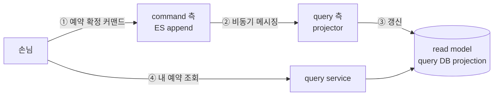
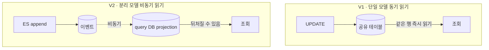
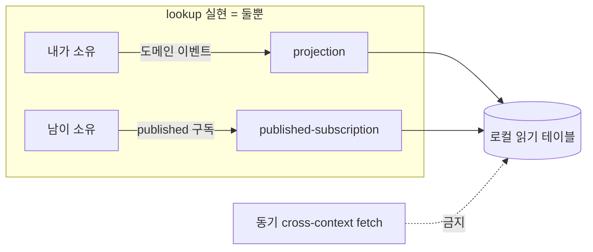
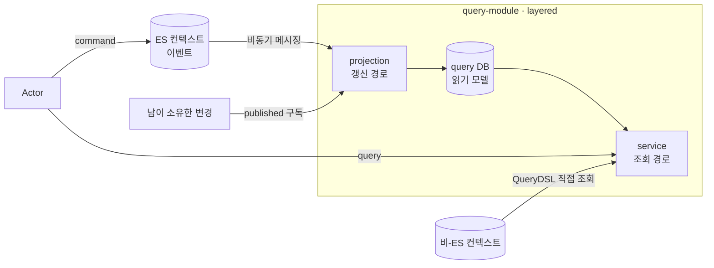

# RFC-002 — 읽기 모델·일관성

- **상태**: 🏷 합의 (2026-06-21) · design [[03-read-model]] 반영 · ADR [[04.read-model-projection-and-replica]] 개정 대기
- **선행**: [[RFC-001-v2-cqrs-and-event-sourcing]] · 인덱스 [[RFC-INDEX]]
- **닫으면**: [[03-read-model]] 보강 + [[04.read-model-projection-and-replica]] 개정/비준 (필요 시 신규 ADR)

---

## 배경 (Background)

### 시나리오: 손님이 예약을 확정하고 곧바로 "내 예약 보기"를 누른다

**V1에서는 이렇게 흐른다.**
예약을 `UPDATE`한 그 테이블을 조회도 그대로 읽는다. 쓴 직후 읽어도 같은 행을 보니 "방금 쓴 게 안 보인다"는 일이 없다. 대신 읽기·쓰기가 한 모델·한 DB를 두고 경합하고, lookup 데이터(category·company·menu)든 핵심 예약 데이터든 전부 같은 조회 경로(QueryDSL)로 한 덩어리로 읽는다.

**V2에서는 이렇게 흐른다.**

1. **커맨드 → 이벤트** — command 측이 ES로 예약 확정 이벤트를 append한다.
2. **비동기 전파** — 그 이벤트가 메시징을 타고 query 측 projector로 흘러간다.
3. **읽기 모델 갱신** — projector가 query DB의 읽기 전용 projection 테이블을 갱신한다.
4. **조회** — 손님의 "내 예약 보기"는 이 projection만 읽는다.

여기서 2~3이 **비동기**라는 게 핵심이다. 확정 직후 4를 누르면 projection이 아직 갱신 전이라 **"방금 쓴 게 안 보일 수 있다."** V2 읽기 모델은 본질적으로 *뒤처진다.*

### 무엇이 달라지나

| 개념 | V1 | V2 | 한 줄 정의 |
|------|-----|-----|-----------|
| **읽기 소스** | 쓰기와 공유한 테이블 | query DB의 projection | "쓰기 모델이 아니라 따로 갱신되는 읽기 전용 모델을 읽는다" |
| **projection** | 없음(상태가 곧 읽기) | 이벤트를 받아 읽기 모델을 갱신 | "내가 소유한 이벤트로 내 읽기 테이블을 채운다" |
| **published-subscription** | 없음 | 남이 흘린 변경을 구독해 로컬에 카피 | "남이 소유한 데이터를 비동기로 받아 로컬 읽기 테이블에 적재" |
| **최종 일관성** | 해당 없음(즉시 일관) | 읽기 모델이 잠시 뒤처짐을 정상으로 수용 | "쓰고 바로 읽으면 아직 없을 수 있다 — 곧 따라잡는다" |

---

## 맥락 (Context)

[[RFC-001-v2-cqrs-and-event-sourcing]]에서 V2의 읽기 전략은 한 문장으로 잠갔다 — query는 query DB의 projection만 읽고, replica는 HA 목적일 뿐 읽기 라우팅에 끼지 않는다. 전략은 깔끔하지만, 그 한 문장은 "무엇을 어떻게 읽기 모델에 둘지"라는 실제 질문을 거의 건드리지 않은 채 남겨 둔다.

- **읽기 모델이 본질적으로 뒤처진다.** command 측은 ES로 가고 이벤트가 비동기로 흘러 projection을 갱신한다. → 이 지연을 정상으로 받아들이면 "쓰고 바로 읽었더니 없다"가 기본 사양이 되고, 받아들이지 않으면 동기 프로젝션이나 command DB 직접 읽기 같은 예외를 열어 CQRS 분리를 군데군데 무너뜨려야 한다.
- **모든 컨텍스트가 이벤트를 흘리는 건 아니다.** 자주 안 변하는 lookup 데이터(category·company·menu)나 아예 ES로 가지 않는 비-ES 컨텍스트가 있다. → 이들을 "projection만 읽는다"는 규칙에 어떻게 끼워 맞출지가 애매하다.
- **자산.** 출처가 될 설계·결정이 이미 깔려 있다 — [[03-read-model]] · [[04.read-model-projection-and-replica]] · [[13.db-hosting-and-read-write-topology]]. 이 RFC는 그 위에서 애매함을 따라가며 방향을 잡는다.

핵심 긴장은 하나다 — **비동기 projection의 지연과 일관성 예외를 어디까지 정상으로 수용하고, lookup·비-ES 데이터를 어떻게 그 규칙 안에 귀속시키느냐.**

---

## Goal / Non-goal

**Goal**
- 읽기 모델 실현 수단을 정리하고, 데이터별 귀속 원칙(소유자 기준)을 정한다.
- 읽기 신선도(read-your-writes·지연)에 대한 *정책*을 정한다.
- projection 적용 범위와 비-ES 컨텍스트의 읽기 방식을 정한다.

**Non-goal (이번에 하지 않음)**
- lookup 항목별 귀속 표·1차 projection 대상 목록의 *확정* (방향만; 표는 design).
- 프로젝션 지연 p99 목표의 절대값 (측정 후 운영 튜닝).
- query layered 트랜잭션 경계·책임 분리의 코드 수준 구체 (design_doc).
- read-your-writes 예외 화면의 구체 목록과 수단 선택 (증거 나오는 화면별로).

---

## 논의 (Discussion)

### 논점 1. 저빈도 lookup을 어떻게 읽기 모델에 실현하나 → [[03-read-model]]

**맥락에서 나온 질문.** "모든 컨텍스트가 이벤트를 흘리는 건 아니다"(맥락 2)에서, category·company·menu처럼 거의 안 변하는 참조 데이터를 "projection만 읽는다"는 규칙에 어떻게 끼워 맞추나.

검토한 선택지:
- **(a) query DB에 경량 projection 테이블** — 내 컨텍스트의 도메인 이벤트로 채운다.
- **(b) published-subscription** — 소유 컨텍스트가 published한 변경을 구독해 채운 테이블.
- **(c) seed** — 배포 시점에 적재되는 초기 행.

**내 의견(AI):** (a)와 (b)는 같은 층위가 아니라 같은 *메커니즘*이다 — 둘 다 "남이 흘리는 걸 비동기로 받아 query DB의 로컬 읽기 테이블을 갱신"하고, 소스만 다르다((a) 내 도메인 이벤트, (b) 다른 소유 컨텍스트의 published 변경). 읽기 지연이 당연한 이유도 둘 다 async-fed라 동일하다. 그래서 lookup 실현 수단은 사실상 **projection ∨ published-subscription 둘뿐**이고, 어느 쪽이냐는 *그 데이터의 소유자가 누구냐*로만 갈린다 — 내가 소유하면 projection, 남이 소유하면 그쪽 published 구독. 반면 (c) seed는 *읽기 전략*이 아니라 *적재 방법*이라 층위가 다르다 — projection/published가 "이 테이블을 어떻게 최신으로 읽느냐"라면 seed는 "테이블 초기 행을 어떻게 채웠느냐"다. "static해서 seed로 두자"는 케이스를 분해하면 셋 다 seed가 사라진다: 진짜 불변이면 그건 데이터가 아니라 *코드 상수*라 읽기 테이블 자체가 없고(논의 밖), 런타임에 가끔이라도 바뀌면 소유자가 있으니 published-subscription이며, 테이블형인데 배포로만 바뀌면 여전히 로컬 읽기 테이블을 flyway로 초기 적재한 것일 뿐("어떻게 읽나"는 똑같은 로컬 조회). 그래서 seed는 수단 분류에서 뺀다. 한 가지 함정 — published를 *조회 시점에 원본을 동기 호출*해 가져오는 것으로 읽으면 안 된다. 그건 읽기 경로에 cross-context 호출을 붙여 CQRS가 떼어내려던 런타임 결합을 다시 들인다. published는 어디까지나 *구독해 로컬에 적재*하는 비동기 카피를 뜻한다.

**네 결정:** lookup 실현 수단 = projection ∨ published-subscription 둘뿐. 소유자로 가름(내 소유=projection, 남의 소유=published 구독). 동기 cross-context fetch 금지, seed는 전략 아님. 〔근거 확인/보강 필요〕

**결론:** lookup은 둘 다 async 로컬 카피인 projection·published-subscription으로만 실현하고 소유자로 가른다. 동기 cross-context fetch 금지. seed는 수단 분류에서 제외. (이의 여지: company/menu의 실제 소유권이 불명확하면 projection이냐 published냐의 귀속이 흔들린다 — 항목별 귀속 표 확정은 [[03-read-model]]에서.)

### 논점 2. read-your-writes를 어디까지 인정하나 → 필요 시 신규 ADR("읽기 신선도 예외 정책")

**맥락에서 나온 질문.** "읽기 모델이 본질적으로 뒤처진다"(맥락 1)의 직접적 귀결 — "방금 쓴 걸 바로 읽으면 아직 없을 수 있다"를 버그로 볼 것인가 사양으로 볼 것인가.

검토한 선택지(예외를 여는 수단):
- **(b) 동기 프로젝션** — 특정 화면에 한정.
- **(c) 버전 토큰** — 클라이언트가 자기 쓰기 반영을 기다리는 read-your-writes.
- **(d) 정적 바인딩 예외** — 특정 read만 command DB를 직접 읽음.

**내 의견(AI):** "방금 쓴 걸 바로 읽으면 아직 없을 수 있다"를 버그가 아니라 *기본 사양*으로 못박는 게 출발점이다. 그러지 않으면 일관성 예외가 시스템 전체로 번져 CQRS의 이점이 사라진다. (b)·(c)·(d) 셋 다 분리를 깨는 비용이 있으므로 기본값으로 깔면 안 된다. 그래서 *정책*을 먼저 정한다 — 기본은 최종 일관성, 예외는 "이 화면이 즉시 반영을 요구한다"가 증명된 경우에만 승인. 어떤 수단((b)/(c)/(d))을 쓸지는 그 화면의 성격을 보고 그때 고른다. 지금 화면 목록을 미리 못박지 않는 이유는, 증거 없이 예외를 여는 게 바로 우리가 막으려는 것이기 때문이다.

**네 결정:** 기본 = 최종 일관성(즉시 반영 안 됨을 사양으로 수용). 예외는 즉시 반영 요구가 증명된 화면만 승인, 수단은 화면별 선택. 〔근거 확인/보강 필요〕

**결론:** read-your-writes는 기본 미보장, 예외는 증명된 화면에 한해 (b)/(c)/(d) 중 택일로 연다. (이의 여지: 예약 확정 직후 내 예약 목록처럼 명백히 즉시 반영이 필요한 화면이 이미 있다면 그건 RFC 단계에서 예외로 인정해도 된다 — 후보가 나오면 여기에 적는다.)

### 논점 3. 프로젝션 지연을 얼마나 허용하나 → [[RFC-003-messaging-delivery]]

**맥락에서 나온 질문.** 지연을 정상으로 받아들이기로 했으니(논점 2), 남는 건 "얼마까지"다.

**내 의견(AI):** 절대 숫자(p99 몇 ms)는 지금 정할 수 없다 — 실제 메시징 lag을 측정하기 전엔 근거 없는 숫자가 된다. 그래서 여기서는 *측정 트리거*와 정책 형태만 정한다: p99 지연 목표를 두고 초과 시 알람을 건다는 골격은 지금, 그 목표의 절대값은 [[RFC-003-messaging-delivery]]의 lag 측정과 함께 운영 단계에서 튜닝한다. 방향은 여기서, 숫자는 거기서.

**네 결정:** 지연 정책 = "p99 목표 + 초과 시 알람" 골격을 채택. 절대값은 미정(측정 후). 〔근거 확인/보강 필요〕

**결론:** 지연은 측정 트리거 정책으로 둔다. p99 목표 절대값은 [[RFC-003-messaging-delivery]] lag 측정 후 운영 튜닝.

### 논점 4. projection을 어느 컨텍스트까지 만드나 → [[03-read-model]]

**맥락에서 나온 질문.** [[03-read-model]]의 컨텍스트별 초기 읽기 전략 표가 "초안" 상태이고, 특히 schedule이 "변화 빈도 보고 결정"이라며 projection이냐 경량 lookup이냐를 미뤄 둔 채다 — 어디까지 projection을 깔 것인가.

**내 의견(AI):** 확정의 *원칙*은 분명하다 — "실제 읽기 요구가 있는 곳부터" projection을 만든다(YAGNI). 모든 컨텍스트에 선제적으로 projection을 깔지 않는다. 따라서 1차 전환에서 실제로 projection을 만들 컨텍스트는 읽기 요구가 입증된 것으로 한정한 목록으로 못박는다. schedule처럼 빈도 판단이 필요한 항목은 그 빈도가 높고 읽기 요구가 분명하면 projection, 그렇지 않으면 경량 lookup으로 귀속시킨다.

**네 결정:** projection은 읽기 요구가 입증된 컨텍스트부터(YAGNI). 1차 대상은 입증된 목록으로 한정, schedule 등은 빈도로 projection/경량 lookup 귀속. 〔근거 확인/보강 필요〕

**결론:** projection은 읽기 요구 입증된 곳부터 만든다(선제 적용 금지). 1차 대상 목록과 귀속의 실제 표는 [[03-read-model]]에서 확정. (이의 여지: "읽기 요구가 입증됐다"의 기준이 느슨하면 결국 다 projection이 된다 — 기준을 표와 함께 명시.)

### 논점 5. 비-ES 컨텍스트도 projection으로 통일하나 → [[03-open-decisions]] (Decision C-4)

**맥락에서 나온 질문.** [[03-open-decisions]] Decision C-4가 남긴 질문 — ES로 가지 않는 컨텍스트(맥락 2)도 query DB projection으로 읽기를 통일할지, 아니면 기존 QueryDSL 조회를 그대로 둘지.

**내 의견(AI):** 통일은 모델이 깔끔해지지만, 발생시킬 이벤트도 없는 컨텍스트에 projection 파이프라인을 억지로 얹는 건 비용 대비 이득이 의심스럽다. 비-ES 컨텍스트는 기존 QueryDSL 조회를 유지하는 쪽이다 — "query는 projection만 읽는다"는 규칙은 ES로 전환된 컨텍스트에 적용되는 규칙이지, 시스템 전체를 강제로 ES화하라는 요구가 아니다.

**네 결정:** 비-ES 컨텍스트는 기존 QueryDSL 조회 유지(projection 통일 안 함). 〔근거 확인/보강 필요〕

**결론:** 비-ES 컨텍스트는 QueryDSL 유지. "projection만 읽는다"는 ES 전환 컨텍스트에 한정된 규칙. (이건 Design에서 검증: 비-ES 컨텍스트가 ES 컨텍스트의 데이터를 조인해 읽어야 하는 경우가 있으면 통일 압력이 생긴다.)

### 논점 6. query 측 layered의 책임·트랜잭션 경계를 어떻게 가르나 → [[03.command-hexagonal-query-layered]]

**맥락에서 나온 질문.** [[03.command-hexagonal-query-layered]]가 깐 구조의 세부다 — command 측은 hexagonal, query 측은 layered(web/service/repository/projection/model)인데, 레이어 간 트랜잭션 경계와 projection·service의 책임 분리가 미정이다.

**내 의견(AI):** 방향은 잡을 수 있다 — projection은 이벤트를 받아 읽기 모델을 *갱신*하는 쓰기 경로, service는 그 모델을 *조회*하는 읽기 경로로 책임을 가른다. 트랜잭션 경계는 조회 경로가 단순 읽기인 만큼 service에서 닫고, projection 갱신은 메시징 소비 단위에 맞춰 별도로 닫는 게 자연스럽다.

**네 결정:** projection = 읽기 모델 갱신(쓰기 경로), service = 조회(읽기 경로)로 책임 분리. TX는 service에서 닫고 projection 갱신은 메시징 소비 단위로 별도. 〔근거 확인/보강 필요〕

**결론:** layered는 projection=갱신/service=조회로 책임을 가른다. 다만 이 레이어 규약의 구체는 코드 구조에 직접 닿으므로 design_doc에서 확정한다.

---

## 결정 요약

| # | 결정 | ADR |
|---|------|-----|
| 1 | lookup 실현 = **projection ∨ published-subscription 둘뿐** (둘 다 async 로컬 카피, 소유자로 가름·동기 cross-context fetch 금지·seed는 전략 아님) | [[04.read-model-projection-and-replica]] · [[03-read-model]] |
| 2 | read-your-writes = **기본 최종 일관성**, 예외는 증명된 화면만((b)/(c)/(d) 택일) | 필요 시 신규 ADR("읽기 신선도 예외 정책") |
| 3 | 프로젝션 지연 = **측정 트리거 정책**(p99 목표+알람 골격, 절대값은 운영 튜닝) | [[RFC-003-messaging-delivery]] |
| 4 | projection은 **읽기 요구 입증된 곳부터**(YAGNI, 선제 적용 금지) | [[03-read-model]] |
| 5 | 비-ES 컨텍스트는 **QueryDSL 유지**(projection 통일 안 함) | [[03-open-decisions]] (Decision C-4) |
| 6 | query layered = **projection 갱신 / service 조회**로 책임 분리 | [[03.command-hexagonal-query-layered]] |

상세 설계는 [[03-read-model]] 참조.

---

## 결과 (목표 아키텍처 요약)

- 읽기 모델은 projection(내 소유 이벤트)과 published-subscription(남의 소유 변경)으로만 채운다 — 둘 다 async 로컬 카피, 동기 cross-context fetch 금지.
- 기본은 최종 일관성(읽기 모델이 뒤처짐을 수용), read-your-writes는 증명된 화면에만 예외.
- 지연은 p99 목표+알람 골격으로 두되 절대값은 측정 후 튜닝([[RFC-003-messaging-delivery]]).
- projection은 읽기 요구 입증된 곳부터(YAGNI), 비-ES는 QueryDSL 유지, layered는 projection=갱신/service=조회로 가른다.

상세 표·시퀀스는 [[03-read-model]] 참조.

---

## 관련 문서
- 분석: [[03-open-decisions]]
- ADR: [[04.read-model-projection-and-replica]] · [[03.command-hexagonal-query-layered]]
- 설계: [[03-read-model]] · [[13.db-hosting-and-read-write-topology]]
- 선행/인덱스: [[RFC-001-v2-cqrs-and-event-sourcing]] · [[RFC-INDEX]] · [[RFC-003-messaging-delivery]]
