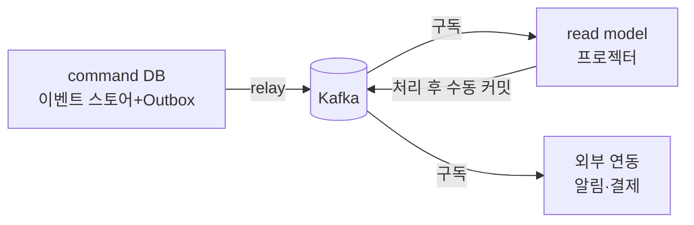
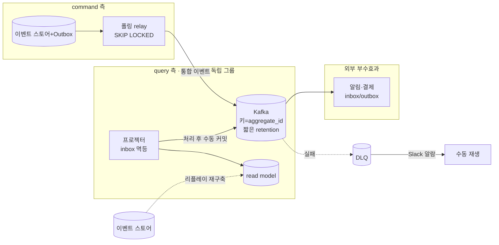

# RFC-003 — 메시징·전달 보장

- **상태**: 🏷 합의 (2026-06-21) · design [[07-messaging-topology]] 반영 · ADR [[09.event-ordering-and-delivery-guarantee]] 비준 대기
- **선행**: [[RFC-001-v2-cqrs-and-event-sourcing]] · 인덱스 [[RFC-INDEX]]
- **닫으면**: [[07-messaging-topology]] 보강 + [[09.event-ordering-and-delivery-guarantee]] 비준

---

## 배경 (Background)

### 시나리오: write 측이 만든 사실을 read·외부가 알아야 한다

**V1에서는 이렇게 흐른다.**
V1은 DB를 진실 원천으로 두고 동기 호출로 묶인 모놀리식이었다. 한 트랜잭션 안에서 상태를 바꾸고, 그 변경을 알아야 할 곳은 같은 호출 스택에서 바로 읽거나 같은 DB를 조회한다. 메시지를 "전달"한다는 개념 자체가 거의 없으니, 누가·언제·몇 번 그 사실을 받았는지 따질 일도 없다.

**V2에서는 이렇게 흐른다.**

CQRS·이벤트 소싱으로 가면서([[RFC-001-v2-cqrs-and-event-sourcing]]), write 측이 만든 사실을 read model·프로젝터·외부 연동에게 **비동기로** 전달해야 한다.

1. **write가 사실을 적는다** — command DB(이벤트 스토어 + Outbox)에 변경과 발행할 이벤트를 같은 트랜잭션으로 적는다.
2. **relay가 Kafka로 잇는다** — Outbox relay가 그 행을 읽어 Kafka로 흘린다.
3. **consumer가 받아 처리한다** — read model 프로젝터·외부 연동이 토픽을 구독해 자기 일을 한다.
4. **처리 뒤 커밋한다** — 처리를 끝낸 뒤에야 오프셋을 커밋한다(중간에 죽으면 재처리).

### 핵심 개념 — 전달 의미론

분산 메시징에서 exactly-once는 끝단까지 공짜로 주어지지 않는다. 그래서 V2의 기본 골격은 **at-least-once 전달 + 멱등 컨슈머로 effectively-once를 합성**하는 것이다. 순서는 `aggregate_id`를 파티션 키로 써서 aggregate 단위로만 보장하고, command DB에서 Kafka까지는 Outbox relay가 잇는다. 이 *메커니즘*은 [[09.event-ordering-and-delivery-guarantee]]에서 이미 잡았다.

| 개념 | 한 줄 정의 |
|------|-----------|
| **at-least-once** | 메시지는 최소 한 번은 도착한다 — 즉 두 번 올 수 있다 |
| **멱등 컨슈머** | 같은 메시지를 두 번 처리해도 결과가 같다 |
| **effectively-once** | at-least-once + 멱등으로 합성하는 "사실상 한 번" 효과 |
| **Outbox relay** | command DB의 Outbox 행을 읽어 Kafka로 발행하는 중계 |

---

## 맥락 (Context)

메커니즘(at-least-once + aggregate 단위 순서 + Outbox relay)은 [[09.event-ordering-and-delivery-guarantee]]에서 잡혔다. 문제는 메커니즘만으로 운영이 굴러가지 않는다는 데 있다.

- **커밋 시점.** at-least-once를 진짜로 성립시키려면 오프셋을 언제 찍느냐가 결정적이다. → 처리 전에 커밋하면 처리 중 죽었을 때 메시지가 사라져 at-most-once로 퇴화한다.
- **중복 흡수의 책임 소재.** "재처리는 정상"을 받아들이는 순간 같은 이벤트가 두 번 온다. → 누가(어느 컨슈머가) 어떻게 중복을 걸러낼지를 정하지 않으면 read model이 오염된다.
- **멱등으로 못 막는 부수효과.** upsert는 거저 멱등이지만 알림·결제 같은 외부 부수효과는 재처리에서 두 번 발사된다. → 멱등 합성으로 흡수되지 않는 잔여를 따로 다뤄야 한다.
- **relay 단일성.** relay는 가용성을 위해 여러 인스턴스로 뜬다. → 같은 Outbox 행을 둘이 집으면 중복 발행이 된다.
- **이미 검증된 자산.** V1의 PoisonMessage·스케줄러 재처리(v1 [[07.reservation]])와 T-20 그레이스풀 셧다운 규율이 작동한다. → 실패 루프·드레인은 처음부터 만들 필요 없이 계승하면 된다.

핵심 긴장은 하나다 — **메커니즘은 잡혔으나, at-least-once가 줄줄이 끌고 오는 운영 긴장(커밋·중복·부수효과·relay·실패 루프)에 대해 "방향"을 정해야 한다.** 절대 수치와 직렬화 규약은 Design으로 넘긴다.

---

## Goal / Non-goal

**Goal**
- at-least-once 전달을 실제로 성립시키는 커밋·중복 흡수 방향을 정한다.
- 멱등으로 못 막는 외부 부수효과의 처리 갈래를 정한다.
- Outbox relay의 단일성·읽기 방식·실패 루프 운영 방향을 정한다.
- Kafka로 나가는 메시지의 *경계*(통합 이벤트)를 확정한다.

**Non-goal (이번에 하지 않음)**
- 절대 수치(파티션 초기값, DLQ 재시도 횟수·백오프 곡선, retention 구체 기간).
- 컨슈머별 inbox 귀속·부수효과 유형별 귀속의 확정(Design).
- Kafka 통합 이벤트 페이로드의 *모양*(thin/fat·직렬화·스키마 버저닝) — 별도 RFC.
- consumer lag 임계·SLI 단일화 — 별도 RFC.
- 실제 토픽 목록 확정(이벤트 스토밍 선행).

---

## 논의 (Discussion)

### 논점 1. 커밋과 중복, 그리고 멱등의 책임 소재 → [[09.event-ordering-and-delivery-guarantee]]

**맥락에서 나온 질문.** 커밋 시점과 중복 흡수의 책임 소재(맥락 1·2)를 어떻게 잡나. at-least-once의 핵심은 사실 단순하다 — 컨슈머가 메시지를 *처리하기 전에* 오프셋을 커밋하면, 처리 중 죽었을 때 그 메시지는 영영 사라진다(at-most-once로 퇴화).

**내 의견(AI):** Kafka auto-commit은 끄고 **처리가 끝난 뒤 수동 커밋**한다. 그레이스풀 셧다운 때는 인플라이트 메시지를 드레인하고 내려간다(V1 T-20 셧다운 규율 계승, [[07-messaging-topology]]·[[09.event-ordering-and-delivery-guarantee]]). 이 선택은 곧 "재처리는 정상"이라는 뜻 — 같은 이벤트가 두 번 올 수 있다. 그러면 중복은 컨슈머별로 처리한 event id를 inbox에 적어 재처리 때 걸러낸다(기본은 inbox 유지). 다만 read model 갱신이 Zero Payload upsert(id 기준 덮어쓰기)처럼 *자연 멱등*이면 inbox를 생략할 수 있다 — 단 **순서 역전이 없을 때뿐**이다. 역전이 가능하면 오래된 값으로 덮어쓰는 사고가 난다.

**네 결정:** 수동 커밋 + 드레인 셧다운, 기본 inbox 유지. inbox 생략은 "순서 역전 없음 + 자연 멱등 upsert"를 동시에 만족하는 컨슈머에만 허용하고, 유지하는 inbox는 보존 기간을 짧게 가져가며 GC. 〔근거 확인/보강 필요〕

**결론:** auto-commit off, 처리 후 수동 커밋, 셧다운 시 드레인. 중복은 inbox로 흡수(기본 유지), 자연 멱등+순서 역전 무풍 컨슈머만 생략 허용. (이의 여지: 어떤 프로젝터가 실제로 순서 역전 무풍지대인지는 토폴로지에 달렸다 — Design에서 컨슈머별 검증.)

### 논점 2. 멱등으로 못 막는 것 — 외부 부수효과 → [[09.event-ordering-and-delivery-guarantee]]

**맥락에서 나온 질문.** upsert는 재적용해도 같은 상태로 수렴하니 멱등이 거저 얻어진다. 문제는 그렇게 흡수되지 않는 부수효과다(맥락 3) — 알림 발송·외부 결제 연동은 at-least-once 재처리에서 **두 번 발사**된다.

검토한 갈래:
- **inbox(기본)** — Kafka에서 받은 이벤트를 `event_id` + 페이로드 + 상태(PENDING/DONE/FAILED)로 inbox 테이블에 기록. 이미 처리한 `event_id`면 스킵. 프로젝터(논점 1)와 같은 패턴 — Outbox(발신) ↔ Inbox(수신) 대칭. 페이로드를 보존하므로 DLQ 수동 재생(논점 5) 시 inbox에서 꺼내 재처리할 수 있다.
- **부수효과 outbox** — 외부 시스템 연동처럼 자기 트랜잭션에 묶을 수 없는 건 outbox로 빼서 발행 자체를 한 번만 보장.
- **수동 보정** — 자동 보정이 불가능한 잔여.

**내 의견(AI):** 단일 해법은 없고 부수효과의 성격을 따라 갈래가 나뉜다. "재처리는 정상"을 전제로 깔았으니 **모든 비-멱등 부수효과는 inbox로 감싸는 게 기본값**이고, 수동은 예외다. inbox는 페이로드까지 기록하므로 단순 멱등키 기록보다 넓은 개념이며, 프로젝터(논점 1)와 패턴이 통일된다. 외부 API 호출 자체의 멱등은 inbox와 별개로 외부 API의 idempotency-key 또는 부수효과 outbox로 처리한다.

**네 결정:** inbox 기본(`event_id` + 페이로드 + 상태 기록), 트랜잭션에 못 묶는 외부 연동은 부수효과 outbox, 자동 불가 잔여만 수동 보정. 〔근거 확인/보강 필요〕

**결론:** 비-멱등 부수효과 = inbox(기본)/부수효과 outbox로 감싸는 게 기본, 수동은 예외. (이의 여지: outbox-of-side-effects는 relay를 하나 더 늘리는 비용이 있다 — 부수효과 유형별 귀속은 Design.)

### 논점 3. Outbox relay의 단일성 → [[09-deployment-runtime]]

**맥락에서 나온 질문.** relay는 가용성을 위해 여러 인스턴스로 뜬다(맥락 4). 그러면 같은 outbox 행을 두 인스턴스가 동시에 집어 **중복 발행**할 수 있다.

검토한 선택지:
- **leader election** — 코디네이터(주키퍼/etcd류)로 하나만 일하게 함. 리더 교체 로직·운영 짐을 새로 진다.
- **`SELECT … FOR UPDATE SKIP LOCKED`** — 행을 잠그며 경쟁 소비. relay가 이미 DB에 붙어 있으니 DB가 직렬화를 대신해준다.

**내 의견(AI):** relay가 이미 DB에 붙어 있는 마당에, **`SKIP LOCKED`로 DB가 직렬화를 대신해주게** 하는 쪽이 가볍다 — 여러 relay 인스턴스가 서로 다른 잠기지 않은 행만 집어가니 중복 없이 경쟁 소비가 된다. 별도 코디네이터가 필요 없다는 게 결정적이다.

**네 결정:** `SKIP LOCKED` 경쟁 소비 채택, leader election 미도입. 〔근거 확인/보강 필요〕

**결론:** relay 단일성 = `SELECT … FOR UPDATE SKIP LOCKED`([[09-deployment-runtime]]).

### 논점 4. 폴링이냐 CDC냐 — 그리고 언제 넘어가나 → [[05.event-store-mysql-table]]

**맥락에서 나온 질문.** relay가 outbox를 읽는 방식은 폴링과 CDC(Debezium) 두 갈래다. CDC는 듀얼 라이트를 없애고 지연도 줄지만, Kafka Connect 클러스터를 운영하는 성숙도 비용이 든다([[05.event-store-mysql-table]]·[[12.kafka-hosting-msk-vs-self-managed]]).

**내 의견(AI):** 초기 트래픽에서 그 운영비를 먼저 무는 건 과투자다. **폴링 relay로 시작**하되, CDC는 "언젠가"가 아니라 명시적 **전환 트리거**로 정의해 둔다 — 폴링 지연이 SLI를 위협하거나, 듀얼 라이트 제거가 정합성 요구로 올라오거나, Connect 운영 성숙도가 충분해질 때. 트리거를 못 박지 않으면 폴링이 영구 부채로 굳는다.

**네 결정:** 폴링 relay로 시작, CDC 전환은 명시적 트리거(폴링 지연 SLI 위협 / 듀얼 라이트 제거 정합성 요구 / Connect 성숙도)로 정의. 〔근거 확인/보강 필요〕

**결론:** 폴링 시작 + CDC 전환 트리거 명문화.

### 논점 5. 실패 메시지의 운영 루프 → [[07-messaging-topology]]

**맥락에서 나온 질문.** 처리에 실패하는 poison message는 무한 재시도로 파티션을 막거나, 조용히 버려져선 안 된다. V1의 검증된 자산(맥락 5)을 어떻게 잇나.

**내 의견(AI):** V1의 PoisonMessage·스케줄러 재처리(v1 [[07.reservation]])를 계승해, **즉시 3회 재시도 → 지수 백오프 → DLQ 격리**의 단계를 둔다. DLQ로 격리된 건 **메시지 채널(Slack)로 알람을 발송**하고 기본은 수동 재생한다 — DLQ는 조용히 쌓이면 의미가 없으니 사람이 즉시 인지할 채널로 밀어내는 게 핵심이다. 자동 재생은 원인이 일시적임을 확신할 수 있을 때만이라 기본값으로 두지 않는다.

**네 결정:** 3회 재시도 → 지수 백오프 → DLQ, DLQ는 Slack 알람 + 수동 재생 기본, 자동 재생은 예외. 〔근거 확인/보강 필요〕

**결론:** 실패 루프 = 재시도→백오프→DLQ→Slack 알람→수동 재생. (이의 여지: 재시도 횟수·백오프 곡선의 구체 값은 Design.)

### 논점 6. 컨슈머 그룹과 리밸런싱 → [[07-messaging-topology]]

**맥락에서 나온 질문.** read model·프로젝터는 같은 이벤트 스트림을 각자 다르게 소비한다. 어떻게 격리하고 스케일하나?

**내 의견(AI):** **프로젝터별로 독립 컨슈머 그룹**을 둬서 fan-out 한다 — 한 프로젝터의 지연이 다른 프로젝터를 막지 않는다. 그룹 안에서는 competing consumers로 스케일하되 동시 처리 단위는 **파티션 수를 넘지 못한다**(초과 컨슈머는 놀 뿐). 리밸런싱은 정지를 최소화하는 cooperative-sticky를 기본으로 본다.

**네 결정:** 프로젝터별 독립 컨슈머 그룹 + 그룹 내 competing consumers, cooperative-sticky 리밸런싱. 〔근거 확인/보강 필요〕

**결론:** 프로젝터별 독립 그룹으로 fan-out, 그룹 내 스케일은 파티션 수 상한, cooperative-sticky([[07-messaging-topology]]).

### 논점 7. 토픽의 retention과 재구축의 진실 원천 → [[RFC-011-projection-rebuild-catchup]]

**맥락에서 나온 질문.** 토픽을 얼마나 오래 보관할지는 재구축을 어디서 하느냐와 묶여 있다. read model을 토픽 처음부터 다시 흘려 재구축하려면 retention이 그만큼 길어야 한다.

**내 의견(AI):** V2에서 진실 원천은 **이벤트 스토어**다 — 토픽은 전달 채널일 뿐 영속 기록이 아니다. 그러니 토픽 retention은 **짧게** 두고, 재구축은 **스토어 리플레이**로 한다([[RFC-011-projection-rebuild-catchup]] 재구축 소스와 정합). 상태성 lookup 토픽처럼 "최신 상태"가 의미를 갖는 것만 log compaction을 쓴다.

**네 결정:** retention 짧게 + 재구축은 스토어 리플레이, 상태성 lookup 토픽만 log compaction. 〔근거 확인/보강 필요〕

**결론:** 토픽은 전달 채널(짧은 retention), 진실 원천은 이벤트 스토어(리플레이로 재구축). (이의 여지: 짧은 retention의 구체 기간과 compaction 대상 토픽 식별은 Design.)

### 논점 8. 무엇을 Kafka로 내보내는가 — 통합 이벤트 → [[07-messaging-topology]]

**맥락에서 나온 질문.** 내부 도메인 이벤트를 그대로 Kafka에 흘리면, 내부 모델 변경이 외부 컨슈머를 깨뜨린다. Kafka로 나가는 건 무엇이어야 하나?

**내 의견(AI):** Kafka로 나가는 건 **통합 이벤트(published language)**여야 하고, 내부 도메인 이벤트와 분리한다([[07-messaging-topology]]·[[02-write-model]]) — 이 *경계*는 여기서 못 박는다. 그러나 그 페이로드를 thin으로 둘지 fat으로 둘지, 직렬화 규약·스키마 버저닝을 어떻게 가져갈지는 결합도와 스키마 진화 전략이 얽혀 단독으로 결론 내기 애매하다.

**네 결정:** 통합 이벤트라는 *경계*만 확정(내부 도메인 이벤트와 분리). 페이로드의 *모양*은 별도 RFC로 분리. 〔근거 확인/보강 필요〕

**결론:** Kafka 발행 = 통합 이벤트(published language), 내부 도메인 이벤트와 분리. 모양은 별도 RFC(아래 §별도 RFC로 분리).

### 논점 9. 파티션 수 — 정책은 여기, 숫자는 운영 → [[09.event-ordering-and-delivery-guarantee]]

**맥락에서 나온 질문.** 파티션 수는 순서 계약의 일부다 — 파티션 키가 `aggregate_id`인 이상, 파티션 수를 사후에 바꾸면 키 해싱이 재분배돼 순서 보장이 깨진다. 그럼 파티션 수를 어떻게 다루나?

**내 의견(AI):** **고정 지향**으로 가고 보수적 초기값(일반 토픽 3, 고처리량 6~12 수준)을 둔다. 증설이 정말 필요하면 in-place 변경이 아니라 **새 토픽으로 마이그레이션**한다.

**네 결정:** 파티션 수 고정 지향 + 보수적 초기값, 증설은 새 토픽 마이그레이션. 〔근거 확인/보강 필요〕

**결론:** 파티션 고정 지향, 증설=새 토픽 마이그레이션. 절대 초기값은 처리량 추정으로 Design([[09.event-ordering-and-delivery-guarantee]]·[[07-messaging-topology]]·[[12.kafka-hosting-msk-vs-self-managed]]). consumer lag(임계·SLI)은 [[RFC-002-read-model-consistency]]의 프로젝션 지연과 한 지표 체계라 별도 RFC로 분리 — lag을 핵심 SLI로 본다는 *전제*만 여기서 깐다.

---

## 결정 요약

| # | 결정 | ADR |
|---|------|-----|
| 1 | **수동 커밋 + 드레인 셧다운**, 중복은 inbox로 흡수(기본 유지), 자연 멱등+순서 역전 무풍 컨슈머만 생략 | [[09.event-ordering-and-delivery-guarantee]] |
| 2 | 비-멱등 외부 부수효과는 **inbox(기본) / 부수효과 outbox로 감싸는 게 기본**, 수동 보정은 예외 | [[09.event-ordering-and-delivery-guarantee]] |
| 3 | Outbox relay 단일성 = **`SELECT … FOR UPDATE SKIP LOCKED`** 경쟁 소비(leader election 미도입) | [[09-deployment-runtime]] |
| 4 | **폴링 relay로 시작** + CDC 전환은 명시적 트리거로 정의 | [[05.event-store-mysql-table]] · [[12.kafka-hosting-msk-vs-self-managed]] |
| 5 | 실패 루프 = **재시도→지수 백오프→DLQ→Slack 알람→수동 재생** | [[07-messaging-topology]] |
| 6 | **프로젝터별 독립 컨슈머 그룹**으로 fan-out, 그룹 내 스케일은 파티션 수 상한, cooperative-sticky | [[07-messaging-topology]] |
| 7 | 토픽 retention **짧게** + 재구축은 **이벤트 스토어 리플레이**, 상태성 lookup만 log compaction | [[RFC-011-projection-rebuild-catchup]] |
| 8 | Kafka 발행 = **통합 이벤트(published language)**, 내부 도메인 이벤트와 분리(경계만 확정) | [[07-messaging-topology]] · [[02-write-model]] |
| 9 | 파티션 수 **고정 지향** + 보수적 초기값, 증설=새 토픽 마이그레이션 | [[09.event-ordering-and-delivery-guarantee]] |

절대 수치·직렬화 규약 등 상세는 [[07-messaging-topology]] design 참조.

---

## 결과 (목표 동작 요약)

- 전달은 **at-least-once + 멱등 컨슈머**로 effectively-once를 합성한다(순서는 `aggregate_id` 단위).
- relay는 폴링 + `SKIP LOCKED`로 단일 발행, CDC는 명시 트리거로 전환.
- 프로젝터는 처리 후 수동 커밋·inbox 멱등, 외부 부수효과도 inbox(기본)/부수효과 outbox로 감싼다 — 컨슈머는 모두 inbox 패턴으로 통일(Outbox↔Inbox 대칭).
- 실패는 재시도→백오프→DLQ→Slack 알람→수동 재생, 재구축 진실 원천은 이벤트 스토어(토픽 retention 짧게).

상세 토폴로지·시퀀스는 [[07-messaging-topology]] · [[09.event-ordering-and-delivery-guarantee]] 참조.

---

## 관련 문서

- 인덱스: [[RFC-INDEX]]
- ADR: [[09.event-ordering-and-delivery-guarantee]] · [[05.event-store-mysql-table]] · [[12.kafka-hosting-msk-vs-self-managed]]
- 설계: [[07-messaging-topology]] · [[09-deployment-runtime]] · [[02-write-model]]
- 연계: [[RFC-001-v2-cqrs-and-event-sourcing]] · [[RFC-002-read-model-consistency]] · [[RFC-011-projection-rebuild-catchup]] · [[RFC-008-observability]] · [[RFC-007-deployment-infra-ops]] · [[10.event-schema-evolution]] · [[11-environments-and-testing]]
- 계승: [[07.reservation]]
