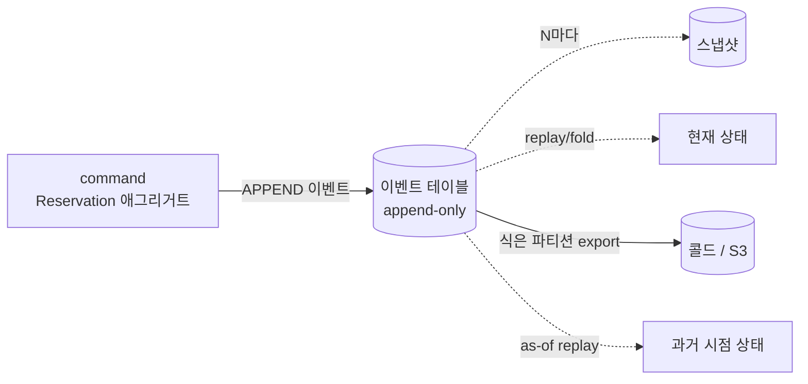
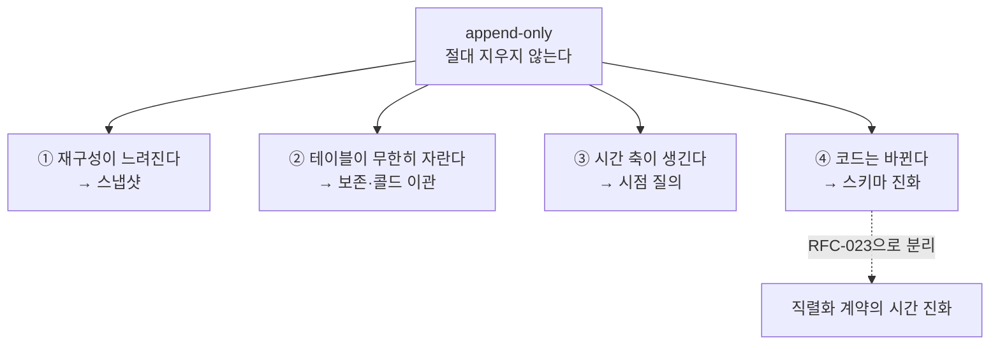
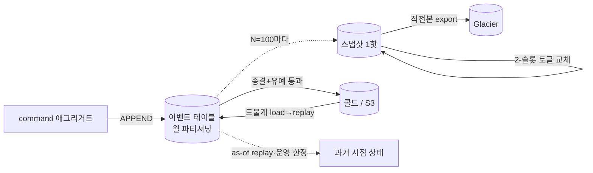

# RFC-004 — 이벤트 스토어·스키마 진화

- **상태**: 🏷 합의 (2026-06-21) · design [[08-event-store-lifecycle]] 반영 · ADR [[05.event-store-mysql-table]] 비준 대기 · 스키마 진화는 [[RFC-023-event-schema-evolution]]로 분리
- **선행**: [[RFC-001-v2-cqrs-and-event-sourcing]] · 인덱스 [[RFC-INDEX]]
- **닫으면**: [[08-event-store-lifecycle]] · [[05.event-store-mysql-table]] 보강·비준 (스키마 진화·업캐스터·[[10.event-schema-evolution]]은 [[RFC-023-event-schema-evolution]]가 닫음)

---

## 배경 (Background)

### 시나리오: 한 예약 스트림이 1년을 산다

**append-only 이벤트 스토어를 켜면 이렇게 흐른다.**
손님이 예약을 만들면 `ReservationCreated` 이벤트가 이벤트 테이블에 한 줄 추가된다. 변경·확정·취소가 일어날 때마다 또 한 줄씩 덧붙는다 — 기존 행은 절대 고치지 않는다. 예약의 "현재 상태"는 어딘가에 저장된 게 아니라, 이 스트림의 이벤트들을 `version 0`부터 되짚으면(replay/fold) 나오는 결과다.

여기서 운영의 압력이 시작된다.

1. **스트림이 길어진다** — 매번 처음부터 되짚으면 재구성이 느려진다. 그래서 N번째마다 "지금까지의 상태"를 통째로 박제한 **스냅샷**을 둔다.
2. **테이블이 무한히 자란다** — 절대 지우지 않으니 디스크가 끝없이 차오른다. 그래서 식은 데이터를 떼어내는 **보존·콜드 이관**이 필요하다.
3. **시간 축이 공짜로 생긴 듯 보인다** — 모든 변경이 남아 있으니 "작년 3월 시점의 예약은 어땠나(temporal/as-of)"를 재구성할 수 있다. 그래서 이걸 어디까지 열 것인가가 떠오른다.
4. **코드는 계속 바뀐다** — 이벤트는 영원히 남는데 그걸 읽는 코드는 진화한다. 그래서 옛 이벤트를 새 코드로 읽는 **스키마 진화** 장치가 필요하다.

### 이 RFC가 가르는 네 압력

| 압력 | append-only가 주는 것 | 따라오는 질문 | 이 RFC가 다루나 |
|------|----------------------|---------------|------------------|
| 스냅샷 | 재구성 가속 | 얼마나 자주·몇 개·이벤트와 일치하나 | ✅ |
| 보존·콜드 | 무한 이력 | 어떤 단위로 보존·어디에 식히나·언제 식나 | ✅ |
| 시점 질의 | as-of 재구성 | 운영 한정인가 제품 API인가 | ✅ |
| 스키마 진화 | (없음 — 부담만) | 업캐스터·eventType 매핑·스키마 레지스트리 | → [[RFC-023-event-schema-evolution]] |

---

## 맥락 (Context)

[[RFC-001-v2-cqrs-and-event-sourcing]]에서 쓰기 모델의 진실 원천을 append-only 이벤트 스토어로 잡았다. 메커니즘 자체 — MySQL에 이벤트를 추가만 하고, N마다 스냅샷을 찍고, 읽을 때 업캐스팅하고, 페이로드는 JSON으로, 디스크리미네이터는 논리 타입명(eventType)으로 — 는 그 논의에서 이미 합의됐다.

- **메커니즘은 합의됐으나, 운영에 닿는 순간 미해결 긴장이 드러난다.** "절대 지우지 않는다"는 약속은 그 자체로는 깔끔하지만, 재구성 지연·무한 증가·시간 축·코드 진화라는 네 갈래 압력을 곧장 만든다. → 각 압력은 "정책(형태)"과 "수치"가 섞여 있어, 책상에서 정할 것과 측정으로 미룰 것을 가려야 한다.
- **수치가 걸린 결정은 k6·운영 측정 자리가 필요하다.** 스냅샷 주기 N, 검증 표본률, 파티셔닝 전제(애그리거트 수명)는 트레이드오프 곡선 위의 값이라 책상에서 확정할 수 없다([[11-environments-and-testing]] §5.4). → 정책 형태만 지금 잠그고, 절대값은 재검토 트리거와 함께 측정으로 넘긴다.
- **자산 — 예약 도메인 애그리거트의 수명이 짧다.** 한 예약 스트림은 길지 않고 빨리 종결된다. → 이 전제가 스냅샷 빈도·시간 파티셔닝·핫패스 비용 판단의 근거가 된다(전제가 흔들리면 측정으로 확인).

핵심 긴장 — **append-only를 운영 수준에서 지속 가능하게 만들되, 책상에서 정할 정책과 측정으로 미룰 수치를 갈라, 스토어 라이프사이클(스냅샷·파티셔닝·콜드·시점 질의·직렬화)을 직렬화 계약의 시간 진화(별도 RFC)와 분리해 결정한다.**

---

## Goal / Non-goal

**Goal**
- 스냅샷의 주기·보관·정합성 정책을 정한다(절대값은 측정 트리거와 함께 위임).
- append-only 테이블의 보존·파티셔닝·콜드 이관 구조와 핫/콜드 경계 기준을 정한다.
- 시점(temporal) 질의의 노출 범위를 정한다.
- 이벤트 JSON 직렬화 규약을 못박는다.
- 스냅샷 포맷 변경 시의 처방을 정한다.

**Non-goal (이번에 하지 않음)**
- 스키마 진화 — 업캐스터(명시 등록 vs 어노테이션 스캔), eventType↔클래스 매핑, Avro/Protobuf 스키마 레지스트리 도입. → [[RFC-023-event-schema-evolution]]로 분리.
- 컨텍스트별 "종결 상태" 카탈로그의 실제 작성(경계 기준의 형태만 합의).
- crypto-shredding 등 셰딩이 콜드까지 닿는 경로. → [[RFC-005-pii-security]].

---

## 논의 (Discussion)

### 논점 1. 스냅샷을 얼마나 자주 찍을 것인가 → [[05.event-store-mysql-table]]

**맥락에서 나온 질문.** 압력 ①(재구성 지연)을 스냅샷으로 푼다 치고, 주기 N의 초안은 50~100이었다([[05.event-store-mysql-table]] · [[02-write-model]] · [[08-event-store-lifecycle]] · [[11-environments-and-testing]]). 정책("주기를 둔다, 트리거는 이벤트 카운트")은 지금 정할 수 있지만, 절대 N은 재구성 지연과 스냅샷 쓰기 비용이 만드는 트레이드오프 곡선 위의 값이다.

**내 의견(AI):** 절대 N은 책상에서 정할 값이 아니다 — 그 곡선은 [[11-environments-and-testing]] §5.4의 k6 스윕으로 그려야 보인다. `N=100`을 기본값으로 두되 `aggregate_type`별로 설정 가능하게 열고, 재검토 트리거를 명시한다(재구성 p99 > 50ms이면 k6 스윕으로 조정). 예약 도메인은 스트림이 짧아 100이면 스냅샷이 사실상 거의 안 찍히는데, 이건 단점이 아니라 의도다 — 짧은 스트림에 공격적으로 찍는 건 과최적화다. (인정하는 트레이드오프: 장수 애그리거트가 섞이면 타입별 N 기본값을 더 잘게 나눠야 할 수 있다 — 비중은 측정으로 확인.)

**네 결정:** `N=100` 기본 + `aggregate_type`별 설정 가능, 재검토 트리거는 재구성 p99 > 50ms → k6 스윕. 〔근거 확인/보강 필요〕

**결론:** 스냅샷 주기 정책 = 이벤트 카운트 트리거, 기본 N=100, 타입별 오버라이드 가능. 절대값 튜닝은 측정으로.

### 논점 2. 스냅샷을 몇 개나 보관할 것인가 → [[08-event-store-lifecycle]]

**맥락에서 나온 질문.** 스냅샷을 두기로 한 이상(논점 1), 핫(DB)에 몇 개를 들고 있을지 정해야 한다.

검토한 선택지:
- **최신 1개만 덮어쓰며 유지** — 핫이 가볍다. 대신 과거 시점·디버깅 편의가 줄어든다.
- **최근 N개 보존** — 디버깅·롤백이 편하다. 대신 보관량이 늘고 GC 기준을 또 만들어야 한다.

**내 의견(AI):** 핫에는 최신 1개만. 스냅샷은 언제든 버릴 수 있는 최적화일 뿐 진실 원천은 이벤트이므로, 활성 경로가 여러 개를 들고 있을 이유가 없다(과거 시점이 필요하면 그 시점까지 이벤트를 리플레이 — 논점 7). 다만 덮어쓸 때 직전 스냅샷을 *버리지 않고* S3 Glacier로 이관한다. 안전 교체는 현재+직전 2-슬롯 토글로 원자적으로 갈아끼우고, 교체가 확정되면 밀려난 슬롯을 Glacier로 export한다. 이건 "핫에 최근 N개 보존"이 아니라 **1핫 + 콜드(Glacier) 아카이브** 구조다 — 콜드를 S3로 두는 흐름(논점 6)과 같은 결이고, DB 용량·백업 부담은 지지 않는다. (정합성 의존이 아니라 편의 — 진실은 여전히 이벤트다.)

**네 결정:** 1핫 + 콜드(Glacier) 아카이브, 2-슬롯 토글로 원자 교체 후 밀려난 슬롯 Glacier export. 〔근거 확인/보강 필요〕

**결론:** 핫(DB)에는 스냅샷 최신 1개만. 직전본은 Glacier로 이관해 디버깅·롤백·감사용으로 거의 공짜로 쌓는다.

### 논점 3. 스냅샷이 이벤트와 정말 일치하는가 → [[08-event-store-lifecycle]]

**맥락에서 나온 질문.** 스냅샷을 최적화로 신뢰하려면(논점 1·2) "스냅샷 = 0..version 이벤트를 재생한 결과"라는 등식이 깨지지 않아야 한다. 여기서도 검증을 돌린다는 정책은 지금 정하고, 표본률·주기는 운영 부하를 보고 튜닝한다.

**내 의견(AI):** 2겹 검증이다. 하나는 스냅샷을 만든 직후 인라인으로 한 번 검증 — 저비용이고 항상 돈다. 다른 하나는 배경에서 주기적으로 표본을 떠서 검증 — 시간이 지나며 누적되는 드리프트를 조기에 잡는다. 불일치가 잡히면 그 스냅샷은 폐기하고 이벤트 리플레이로 재생성하며(논점 8과 같은 처방), 알람을 띄운다. 표본률과 주기의 구체 값은 운영 측정에 맡긴다.

**네 결정:** 인라인 1회 + 배경 표본의 2겹 검증, 불일치 시 폐기 후 리플레이 재생성 + 알람, 표본률·주기는 운영 측정. 〔근거 확인/보강 필요〕

**결론:** 스냅샷 정합성은 인라인+배경 2겹으로 보증하고, 불일치 스냅샷은 이벤트 리플레이로 재생성한다.

### 논점 4. 무엇을 단위로 보존·파티셔닝할 것인가 → [[05.event-store-mysql-table]]

**맥락에서 나온 질문.** 압력 ②(무한 증가)를 다루려면 파티셔닝 축을 정해야 한다([[05.event-store-mysql-table]] · [[08-event-store-lifecycle]]).

검토한 선택지:
- **시간(생성월 등) 파티셔닝** — 보존·아카이빙의 자연 축. 옛 파티션을 통째로 drop/이관하기 쉽다.
- **`aggregate_type` 파티셔닝** — 핫패스 조회(특정 스트림 재생)와 정렬된다.

**내 의견(AI):** 긴장은 분명하다 — 보존·아카이빙은 시간이 자연스러운 축이지만 핫패스 조회는 aggregate 단위라, 두 축이 어긋나면 핫패스가 여러 파티션을 가로지르며 느려진다. 그럼에도 시간(생성월) 파티셔닝을 택한다. 핵심 근거는 예약 애그리거트의 수명이 짧다는 것(맥락의 자산) — 수명이 짧으면 한 스트림이 한두 파티션에 모이고, 따라서 핫패스 리플레이가 파티션 경계를 거의 넘지 않는다. 시간 축의 이득(옛 파티션 통째 drop/이관)은 그대로 가져가면서 핫패스 손해는 거의 없다. 스트림 조회는 `aggregate_id` 인덱스로 커버한다. (인정하는 트레이드오프: 장수 애그리거트의 비중이 생각보다 크면 이 전제가 흔들린다 — 측정으로 확인.)

**네 결정:** 시간(생성월) 파티셔닝, 스트림 조회는 `aggregate_id` 인덱스로 커버. 〔근거 확인/보강 필요〕

**결론:** 보존·파티셔닝 단위 = 시간(생성월). 핫패스는 `aggregate_id` 인덱스로, 콜드 이관은 옛 파티션 drop/export로.

### 논점 5. 언제 식은 스트림으로 볼 것인가 → [[08-event-store-lifecycle]]

**맥락에서 나온 질문.** 파티션을 콜드로 이관하려면(논점 4) "종료된 스트림"의 정의가 필요한데, 그건 기술이 줄 수 없다 — 예약이 끝났다는 건 도메인이 말하는 것이다([[08-event-store-lifecycle]]).

**내 의견(AI):** 핫/콜드 경계 판정은 도메인 종결 상태 + 유예 기간으로 잡는다 — 미종결이거나 유예 안에 있으면 핫, 종결됐고 유예가 지났으면 콜드. 유예는 감사·분쟁 윈도우다(예: 종결 +90일). 컨텍스트마다 어떤 상태가 "종결"인지는 목록으로 모아야 하는데, 그건 각 도메인 작업에서 채운다. RFC 단계에서 도메인 이벤트 카탈로그를 먼저 확정할 필요는 없다 — 경계 기준의 형태(상태+유예)만 합의하면 된다.

**네 결정:** 핫/콜드 경계 = 도메인 종결 상태 + 유예 기간(예: +90일), 종결 상태 카탈로그는 도메인 작업에서 채움. 〔근거 확인/보강 필요〕

**결론:** 식은 스트림 판정은 "도메인 종결 상태 + 유예 통과". 형태만 합의하고 상태 목록은 도메인 작업으로 위임.

### 논점 6. 콜드 스토리지를 어디에 둘 것인가 → [[08-event-store-lifecycle]]

**맥락에서 나온 질문.** 식은 스트림(논점 5)을 어디로 보낼지([[08-event-store-lifecycle]] · [[11-environments-and-testing]]). 콜드는 재구성 빈도가 낮으니 판단 기준은 복원 경로와 운영 단순성이다.

검토한 선택지:
- **같은 DB의 아카이브 테이블** — 별도 인프라 없음. 대신 같은 인스턴스의 용량·백업 부담을 계속 진다.
- **S3 같은 오브젝트 스토리지** — DB 부담을 벗는다. 대신 복원 시 로드·리플레이 경로가 필요하다.

**내 의견(AI):** 오브젝트 스토리지(S3)를 택한다. 흐름은 — 식은 시간 파티션(논점 4)을 S3로 export한 뒤 drop하고, 드물게 복원이 필요하면 로드해서 리플레이한다. DB 안에 아카이브 테이블을 두면 결국 같은 인스턴스의 용량·백업 부담을 계속 지는데, 콜드는 그럴 가치가 없다. 셰딩(crypto-shredding 등)이 콜드까지 닿는 경로는 여기서 풀지 않고 [[RFC-005-pii-security]]에 맡긴다. 검증은 localstack S3로 한다([[RFC-009-testing-quality-gates]]).

**네 결정:** 콜드 = S3 오브젝트 스토리지(파티션 export→drop, 복원 시 로드→리플레이), 검증은 localstack S3. 〔근거 확인/보강 필요〕

**결론:** 콜드 스토리지 = S3. 셰딩 경로는 [[RFC-005-pii-security]]로 위임.

### 논점 7. 시점 질의를 어디까지 열 것인가 → [[08-event-store-lifecycle]]

**맥락에서 나온 질문.** 압력 ③ — append-only는 "as-of 재구성"을 거의 공짜로 주는 듯 보인다. 운영·디버깅에만 쓸 것인가, 일반 API로도 열 것인가([[08-event-store-lifecycle]])? 제품 기능으로 열면 인덱스·성능·권한 부담이 따라붙는다.

**내 의견(AI):** 운영·디버깅 한정을 기본으로 둔다. temporal 질의는 사고 조사나 데이터 복구에는 값지지만, 제품 화면이 정말 그걸 요구한다는 증거가 나오기 전에 일반 API로 노출하면 비용만 미리 진다. 화면 요구가 증명되면 그때 다시 본다.

**네 결정:** 시점 질의는 운영·디버깅 한정, 제품 API 노출은 화면 요구가 증명될 때까지 보류. 〔근거 확인/보강 필요〕

**결론:** temporal 질의는 운영·디버깅 전용. 일반 API 노출은 YAGNI 보류.

### 논점 8. 스냅샷 포맷이 바뀌면 어떻게 할 것인가 → [[10.event-schema-evolution]]

**맥락에서 나온 질문.** 압력 ④의 한 갈래 — 이벤트는 업캐스팅으로 진화시킨다 치고, 스냅샷 포맷 자체가 바뀌면?([[10.event-schema-evolution]] · [[08-event-store-lifecycle]])

검토한 선택지:
- **옛 스냅샷 폐기 후 이벤트 재생으로 재생성** — 스냅샷 진화 코드가 불필요하다.
- **스냅샷도 이벤트처럼 업캐스팅** — 재생성 비용은 줄지만 진화 코드를 또 둬야 한다.

**내 의견(AI):** 폐기 후 이벤트 리플레이로 재생성하는 쪽이다. 이건 스냅샷을 "버릴 수 있는 최적화"로 본 입장(논점 2)과 일관된다 — 스냅샷이 최적화일 뿐이라면 포맷이 바뀌었을 때 굳이 그것까지 업캐스팅 코드를 둘 이유가 없다. 배경에서 이벤트를 다시 재생해 새 포맷으로 찍으면 된다. 스냅샷은 업캐스팅하지 않는다 — 업캐스팅은 이벤트에만 둔다.

**네 결정:** 스냅샷 포맷 변경 시 폐기 후 이벤트 리플레이로 재생성, 스냅샷 업캐스팅은 두지 않음. 〔근거 확인/보강 필요〕

**결론:** 스냅샷은 업캐스팅하지 않고 폐기·재생성한다. 업캐스팅은 이벤트 전용.

### 논점 9. JSON 페이로드를 어떻게 직렬화할 것인가 → [[05.event-store-mysql-table]]

**맥락에서 나온 질문.** JSON 방향은 이미 합의됐고, 남은 건 직렬화 규약의 세부다([[05.event-store-mysql-table]]) — null·기본값 처리, enum 표현, 시간·금액 타입, 모르는 필드 처리, 컬럼 타입. 세부지만 한번 저장된 이벤트는 영원히 남으니, 규약을 흔들면 옛 데이터가 깨진다.

**내 의견(AI):** 여기서 못박아 둔다. 저장은 MySQL JSON 컬럼으로 한다. 역직렬화 시 모르는 필드는 무시한다(forward-compat — 새 필드가 추가된 이벤트를 옛 코드가 만나도 깨지지 않게). enum은 이름(문자열)으로, 시간은 ISO-8601 UTC로, 금액은 정수 최소단위(분 단위 등)로 적고, null은 생략하지 않고 명시적으로 직렬화한다. (인정하는 트레이드오프: TEXT 대비 JSON 컬럼의 인덱싱·검증 이득이 핫패스에서 실제로 값을 하는지는 측정으로 확인할 수 있다.)

**네 결정:** MySQL JSON 컬럼, 모르는 필드 무시(forward-compat), enum=이름, 시간=ISO-8601 UTC, 금액=정수 최소단위, null 명시 직렬화. 〔근거 확인/보강 필요〕

**결론:** 이벤트 직렬화 규약을 위와 같이 고정. JSON 컬럼 이득은 측정으로 재확인 가능.

### 논점 10. 스키마 진화는 어디서 다루는가 → [[RFC-023-event-schema-evolution]]

**맥락에서 나온 질문.** 압력 ④의 본체 — 옛 이벤트를 새 코드로 읽는 **업캐스터**(명시 등록 vs 어노테이션 스캔), 논리 타입명(**eventType**)↔클래스 매핑(`@JsonTypeName` 스캔 vs 명시 빈), JSON+업캐스팅을 **Avro/Protobuf 스키마 레지스트리**로 갈아탈지.

**내 의견(AI):** 이 세 갈래는 *저장소를 시간 축에서 운영하는* 이 RFC의 라이프사이클 관심사와 결이 다르다 — 직렬화 계약이 시간에 따라 진화하는 문제라 한 묶음으로 [[RFC-023-event-schema-evolution]]에서 다룬다. 원래 여기 있던 입장(명시 등록 레지스트리 빈, `@JsonTypeName` 스캔 배제, Avro/Protobuf YAGNI 보류)도 그쪽으로 옮겼다.

**네 결정:** 스키마 진화 일체를 [[RFC-023-event-schema-evolution]]로 분리(기존 입장 이관). 〔근거 확인/보강 필요〕

**결론:** 업캐스터·eventType 매핑·스키마 레지스트리는 본 RFC 범위 밖, [[RFC-023-event-schema-evolution]]가 닫는다.

---

## 결정 요약

| # | 결정 | ADR |
|---|------|-----|
| 1 | 스냅샷 주기 = 이벤트 카운트 트리거, **기본 N=100**·타입별 설정, 재검토 트리거 재구성 p99 > 50ms → k6 스윕 | [[05.event-store-mysql-table]] · [[11-environments-and-testing]] |
| 2 | 스냅샷 보관 = **1핫 + Glacier 콜드 아카이브**, 2-슬롯 토글 원자 교체 후 직전본 Glacier export | [[08-event-store-lifecycle]] |
| 3 | 스냅샷 정합성 = **인라인+배경 2겹 검증**, 불일치 시 폐기 후 리플레이 재생성 + 알람 | [[08-event-store-lifecycle]] |
| 4 | 보존·파티셔닝 = **시간(생성월) 파티셔닝**, 스트림 조회는 `aggregate_id` 인덱스 | [[05.event-store-mysql-table]] · [[08-event-store-lifecycle]] |
| 5 | 핫/콜드 경계 = **도메인 종결 상태 + 유예 기간**, 종결 상태 카탈로그는 도메인 작업으로 | [[08-event-store-lifecycle]] |
| 6 | 콜드 스토리지 = **S3 오브젝트 스토리지**(export→drop, 복원 시 load→replay), 검증 localstack | [[08-event-store-lifecycle]] |
| 7 | 시점(temporal) 질의 = **운영·디버깅 한정**, 제품 API 노출 보류(YAGNI) | [[08-event-store-lifecycle]] |
| 8 | 스냅샷 포맷 변경 = **폐기 후 이벤트 리플레이 재생성**, 스냅샷 업캐스팅 없음 | [[10.event-schema-evolution]] · [[08-event-store-lifecycle]] |
| 9 | 직렬화 규약 = **MySQL JSON 컬럼**, 모르는 필드 무시, enum=이름·시간 ISO-8601 UTC·금액 정수 최소단위·null 명시 | [[05.event-store-mysql-table]] |
| 10 | 스키마 진화(업캐스터·eventType·스키마 레지스트리)는 **[[RFC-023-event-schema-evolution]]로 분리** | [[10.event-schema-evolution]] |

상세 설계는 [[08-event-store-lifecycle]] · [[05.event-store-mysql-table]] 참조.

---

## 결과 (목표 라이프사이클 요약)

- **스냅샷**: N=100(타입별 조정 가능) 트리거, 핫에는 1개만, 직전본은 Glacier로, 정합성은 인라인+배경 2겹으로 보증.
- **보존·콜드**: 월 파티셔닝으로 식은 파티션을 S3로 export 후 drop, 핫/콜드 경계는 도메인 종결 상태 + 유예.
- **시점 질의**: as-of 재구성은 운영·디버깅 전용.
- **직렬화**: MySQL JSON 컬럼, 모르는 필드 무시·enum 이름·ISO-8601 UTC·금액 정수 최소단위·null 명시.
- **스키마 진화**: 이벤트만 업캐스팅(스냅샷은 폐기·재생성), 업캐스터·eventType·스키마 레지스트리는 [[RFC-023-event-schema-evolution]]가 닫는다.

상세 라이프사이클·시퀀스는 [[08-event-store-lifecycle]] 참조.

---

## 관련 문서

- 분석/인덱스: [[RFC-INDEX]]
- ADR: [[05.event-store-mysql-table]] · [[10.event-schema-evolution]]
- 설계: [[08-event-store-lifecycle]] · [[11-environments-and-testing]]
- 후속/분리: [[RFC-023-event-schema-evolution]] · [[RFC-005-pii-security]] · [[RFC-009-testing-quality-gates]]
- 계승: [[RFC-001-v2-cqrs-and-event-sourcing]]
