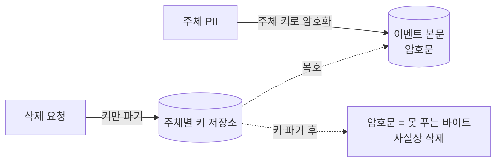
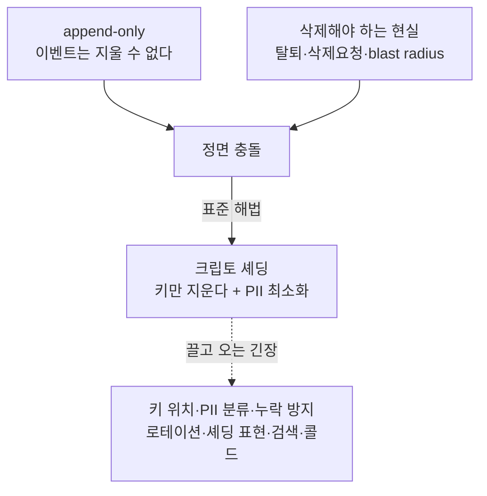
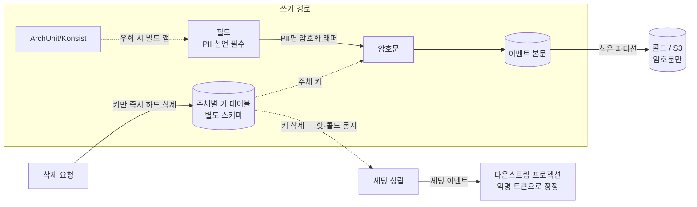

# RFC-005 — PII·보안

- **상태**: 🏷 합의 (2026-06-21) · design [[15-pii-security]] 반영 · ADR [[11.es-pii-crypto-shredding]] 비준 대기 (Proposed→Accepted)
- **선행**: [[RFC-001-v2-cqrs-and-event-sourcing]] · 인덱스 [[RFC-INDEX]]
- **닫으면**: [[11.es-pii-crypto-shredding]] 보강·비준 (Proposed→Accepted)

---

## 배경 (Background)

### 시나리오: 한 회원이 탈퇴하며 "내 데이터를 지워달라" 한다

**V1에서는 이렇게 흐른다.**
회원 정보는 테이블의 행으로 들고 있으니, 탈퇴·삭제 요청이 오면 그 행을 `DELETE` 하거나 개인정보 컬럼을 `UPDATE` 로 비우면 끝이다. 상태를 저장하는 모델에서는 "지운다"가 곧 "행을 고친다"여서, 삭제는 그저 또 하나의 쓰기다.

**append-only 이벤트 스토어에서는 그게 통하지 않는다.**

1. **삭제 요청 수신** — 한 주체(data subject)가 탈퇴하거나 데이터 삭제를 요청한다.
2. **하지만 이벤트는 지울 수 없다** — 그 사람의 이름·이메일이 이미 `ReservationCreated` 같은 이벤트 본문에 박혀 있고, append-only는 정의상 기존 이벤트를 고치거나 지우지 않는다([[RFC-001-v2-cqrs-and-event-sourcing]]).
3. **그래서 키를 지운다(크립토 셰딩)** — PII는 애초에 평문이 아니라 암호문으로 적혀 있고, 복호 키는 주체별로 따로 보관돼 있다. 삭제 요청이 오면 이벤트는 그대로 둔 채 **그 주체의 키만 파기**한다.
4. **암호문이 못 푸는 바이트가 된다** — 키가 사라지면 그 주체의 암호문은 영구히 복호 불가능한 덩어리가 되니, 사실상 삭제와 같다.

### "지울 수 없는 저장소"와 "지워야 하는 현실"

| 개념 | 현행/전제 | 변경/대응 | 한 줄 정의 |
|------|-----------|-----------|-----------|
| **append-only 삭제 문제** | 상태 모델은 행을 지우면 끝 | 이벤트는 못 지움 → 키를 지움 | "본문은 두고 키를 파기해 복호 불가로 만든다" |
| **크립토 셰딩** | (없음) | PII는 암호문, 키는 주체별, 삭제=키 파기 | "키가 사라지면 암호문은 못 푸는 바이트" |
| **PII 최소화** | 평문 PII 산재 | 저장 PII 자체를 줄인다 | "셰딩 부담을 애초에 줄인다" |

---

## 맥락 (Context)

[[RFC-001-v2-cqrs-and-event-sourcing]]에서 쓰기 모델의 진실 원천을 append-only 이벤트 스토어로 잡았다. 한 번 추가된 이벤트는 물리적으로 지울 수 없고, 그게 append-only의 정의다. 그런데 운영하다 보면 *어떤 사람의 데이터는 진짜로 없애야 하는* 순간이 온다 — 회원 탈퇴, 삭제 요청, 키·DB 유출 시 노출 면적(blast radius)을 줄여야 할 때.

- **"지울 수 없는 저장소"와 "지워야 하는 현실"이 정면으로 부딪친다.** 이건 규제 이전의 엔지니어링 긴장이다. → 실유저가 붙는 순간 GDPR·국내 개인정보보호법이 그 삭제를 *비-옵션*으로 굳히는 외부 압력으로 합류한다. 동인은 규제가 아니라 이 긴장 자체다.
- **표준적인 답은 크립토 셰딩이고, 메커니즘 자체는 이미 잠겼다.** 이벤트 본문에는 PII를 평문이 아니라 암호문으로 적고, 복호 키는 정보주체별로 따로 보관한다. 삭제 요청이 오면 이벤트는 그대로 둔 채 그 주체의 키만 파기한다 — 키가 사라지면 암호문은 영구히 풀 수 없으니 사실상 삭제와 같다. 여기에 더해 저장하는 PII를 최소화한다. 메커니즘은 [[11.es-pii-crypto-shredding]]에서 라운드1에 잠갔다. → 문제는 그게 끝이 아니라는 점이다.
- **"주체별 키"라는 한 문장이 그 뒤로 줄줄이 긴장을 끌고 온다.** 그 키를 *어디에* 두는가, *어떤 필드*가 PII라서 암호화 대상인가, 셰딩한 뒤 그 자리를 *무엇으로* 표현하며 이미 만들어진 프로젝션은 어떻게 갱신하는가, 암호화된 PII를 *검색*해야 하면 어쩌는가, 키를 백업했다가 셰딩이 *부활*하면 어쩌는가, 콜드 스토리지로 빠진 이벤트도 키 한 번 지우면 같이 셰딩되는가.

핵심 긴장 — **append-only 위에서 "삭제"를 크립토 셰딩으로 성립시키되, "주체별 키" 한 문장이 끌고 오는 키 위치·PII 분류·누락 방지·로테이션·셰딩 표현·검색·콜드 경로의 긴장들을, 정말 키를 지웠는가의 보장이 깨지지 않게 하나씩 잡는다.**

---

## Goal / Non-goal

**Goal**
- 셰딩 키의 저장 매체와 라이프사이클(생성·조회·즉시 삭제) 경계를 정한다.
- 미분류 PII가 평문으로 새지 않게 하는 분류 강제 규율을 정한다.
- 셰딩 누락을 빌드 타임에 막는 방법을 정한다.
- 키 로테이션·백업·접근통제의 정책 방향을 정한다(수치는 운영으로 위임).
- 셰딩된 자리의 표현과 다운스트림 프로젝션 정정 방식을 정한다.
- 암호화된 PII의 검색 전략을 정한다.
- 콜드 스토리지로 빠진 이벤트의 셰딩 경로를 정한다.

**Non-goal (이번에 하지 않음)**
- PII 필드 분류표의 실제 작성 — 이벤트 스토밍/도메인 작업 완료 후 별도 ADR로 비준(분류를 강제하는 *장치*만 결정). → 🌱 [[08-event-store-lifecycle]] 이후.
- 키 로테이션 주기·백업 보존 기간 같은 운영 수치 확정. → 별도 ADR + 운영 측정.
- 봉투 암호화(마스터 키 래핑) 도입 — 격리·규제 요구가 실제로 올라올 때의 졸업 경로로만 둔다.

---

## 논의 (Discussion)

### 논점 1. 셰딩 키를 어디에 둘 것인가 → [[11.es-pii-crypto-shredding]]

**맥락에서 나온 질문.** "주체별 키"를 잠근 순간 가장 먼저 따라오는 게 *그 키를 어디에 두는가*다. 매체를 고르기 전에 개념을 못박아야 한다 — 셰딩 키는 *주체(data subject)당 하나*다. 한 사람 = 키 하나여서 삭제 요청 단위와 셰딩 단위가 정확히 일치한다. 그 키로 그 주체의 PII를 암호화해 이벤트에 싣고, 삭제 요청이 오면 그 키 하나를 *즉시·완전히* 파기한다. 그래서 키 저장소 요건은 넷이다 — 주체가 생길 때 키를 **동적 생성**(미래 주체를 미리 알 수 없으니 사전 등록이 아니라 런타임 생성), 재생·조회 시 **조회**, 삭제 요청 시 **즉시 하드 삭제**, 그리고 저장소가 **이벤트 데이터와 분리**되어 백업·복원 한 번에 셰딩이 무효화되지 않을 것.

검토한 선택지:
- **전용 KMS** — 관리형 암호 인프라. 대신 CMK는 7~30일 예약 삭제 지연이 있어 "즉시 하드 삭제" 요건과 어긋난다.
- **외부 시크릿 스토어** — 분리 보관. 대신 동적 생성·즉시 삭제·이벤트와의 분리 스코프가 곧게 맞지 않는다.
- **Vault Transit (Encryption as a Service)** — 키가 Vault 안에만 존재하고 API로 암호화/복호화, 즉시 삭제 가능, DB와 물리적 분리. 대신 Vault 클러스터 운영 부담이 크고, Vault 가용성에 의존(Vault 다운 시 복호 불가)해 프로토타입 단계에서 인프라 복잡도가 과하다.
- **전용 키 테이블(새 스키마)** — INSERT=동적 생성, SELECT=조회, DELETE=즉시·완전 삭제, 새 스키마로 백업 스코프 분리. 요건과 가장 곧게 맞는다. 한계: "별도 스키마"는 논리적 분리일 뿐 물리적 분리(같은 MySQL 인스턴스·디스크·백업)가 아니므로 DB 유출 시 키와 암호문이 함께 노출될 수 있다 — 포트 캡슐화로 매체 교체 경로를 열어둬 물리적 분리가 필요해지면 Vault 등으로 졸업한다.

**내 의견(AI):** **전용 키 테이블을 새 스키마로 따로 파서 거기 두는** 쪽이다. 요건 넷과 가장 곧게 맞는다 — INSERT가 동적 생성, SELECT가 조회, **DELETE가 즉시·완전 삭제**(KMS CMK처럼 예약 삭제 지연이 없다), *새 스키마*로 파면 애플리케이션 데이터와 갈라져 백업을 따로 스코프할 수 있다. 매체를 바꿔 끼울 수 있도록 "키 라이프사이클(생성·조회·삭제)은 한 포트 뒤에 캡슐화한다"는 인터페이스 경계는 유지한다 — 크립토 셰딩의 신뢰성은 매체가 무엇이냐보다 *키를 정말 지웠는가*에 달렸고, 그 보장은 라이프사이클을 한 군데 모았느냐에서 나오기 때문이다.

**네 결정:** 전용 키 테이블(새 스키마) 채택, 키 라이프사이클은 단일 포트 뒤에 캡슐화. 〔근거 확인/보강 필요〕

**결론:** 셰딩 키 = 주체당 1행의 전용 키 테이블(새 스키마), 동적 생성·즉시 하드 삭제·이벤트와 분리 스코프, 라이프사이클은 포트로 캡슐화. (이의 여지: 테이블의 키는 그 스키마 접근통제만큼만 안전해 테이블이 읽히면 전 PII가 복호 가능하므로, 키 스키마는 별도 자격/역할로 접근을 좁히고 봉투 암호화(상위 마스터 키 래핑) 강화는 격리·규제 요구가 올라올 때 도입한다 — 마스터 키의 거처라는 또 다른 질문이 따라오므로 지금은 분리 스키마 + 접근통제를 경계로 삼는다. "키 스키마 백업을 이벤트와 분리 스코프"가 실제 백업 도구로 되는지는 Design/운영에서 검증.)

### 논점 2. 어떤 필드가 PII인가 → [[11.es-pii-crypto-shredding]]

**맥락에서 나온 질문.** 키를 잠갔으면 그 키로 *무엇을* 암호화할지가 따라온다. 🌱 이건 솔직히 지금 닫을 수 없다 — 암호화·셰딩 대상 필드 집합을 컨텍스트별로 확정하려면 이벤트 카탈로그가 먼저 서야 하는데, 그 카탈로그는 이벤트 스토밍과 도메인 작업의 산출물이고([[08-event-store-lifecycle]]) 그 작업이 아직 끝나지 않았다. 분류 없이 셰딩 범위를 박으면 그건 추측이지 결정이 아니다.

**내 의견(AI):** **분류 자체를 결정하지 않고, 분류를 강제로 끌어내는 장치를 결정한다.** "PII로 표시되지 않은 필드는 암호화 경로를 통과할 수 없다"가 아니라 그 반대로, **모든 필드는 PII 여부를 명시적으로 선언해야 한다**는 규율을 디폴트로 둔다. 그러면 카탈로그가 자라는 동안 미분류 필드가 조용히 평문으로 새는 일을 막는다. 분류 결과 자체는 스토밍 이후 별도 ADR("PII 분류 정책")로 비준한다.

**네 결정:** "모든 필드 PII 여부 명시 선언" 규율을 디폴트로, 분류표는 스토밍 후 별도 ADR. 〔근거 확인/보강 필요〕

**결론:** 🌱 PII 분류표는 지금 닫지 않고, 대신 "모든 필드 PII 여부 명시 선언"을 강제 디폴트로 둔다. (이의 여지: 분류표 실제 작성은 이벤트 스토밍/도메인 작업 완료 후 별도 ADR로 비준 — Non-goal.)

### 논점 3. 셰딩 누락을 어떻게 막을 것인가 → [[11.es-pii-crypto-shredding]]

**맥락에서 나온 질문.** 분류 선언(논점 2)이 있어도, PII 필드가 암호화 경로를 우회해 평문으로 저장되면 셰딩은 처음부터 불가능하다 — 키를 지워봐야 평문이 그대로 남는다. 그러니 이건 리뷰에 기대선 안 되는 종류의 실수다.

검토한 선택지:
- **ArchUnit/Konsist 정적 규칙** — 빌드 타임 강제. PII 선언 필드가 암호화 래퍼 없이 페이로드에 실리면 빌드를 깬다.
- **사람 리뷰** — 유연. 대신 반드시 빠뜨린다.
- **스키마 어노테이션** — 표시는 되지만 그 자체로 강제력이 없다.

**내 의견(AI):** **ArchUnit/Konsist 규칙으로 빌드 타임에 강제하는 쪽**이다 — PII로 선언된 필드가 암호화 래퍼를 거치지 않고 이벤트 페이로드에 실리면 빌드를 깬다. 위의 "모든 필드 PII 선언" 규율과 짝이 맞는다: 선언이 있어야 규칙이 검사할 대상이 생긴다. [[14.testing-strategy]]의 ArchUnit 레이어에 얹는다.

**네 결정:** ArchUnit/Konsist 빌드 타임 규칙으로 강제, [[14.testing-strategy]] ArchUnit 레이어에 탑재. 〔근거 확인/보강 필요〕

**결론:** 셰딩 누락은 ArchUnit/Konsist 규칙으로 빌드 타임에 차단. (이의 여지: 정적 규칙이 잡는 건 "선언과 경로의 불일치"까지고, "이 필드가 사실 PII인데 비-PII로 선언됐다"는 오분류는 못 잡는다 — 그건 분류 정책의 몫. ArchUnit/Konsist의 정확한 술어는 Design.)

### 논점 4. 키 로테이션·백업·접근통제를 어떻게 둘 것인가 → [[11.es-pii-crypto-shredding]]

**맥락에서 나온 질문.** 키 저장소(논점 1)에 함정이 하나 있다 — 셰딩은 키를 지워서 성립하는데, 그 키가 백업에 남아 있으면 복원 한 번으로 셰딩이 통째로 무효가 된다. 그러니 키 백업·접근통제는 셰딩의 부수 주제가 아니라 셰딩 정합성의 *전제*다.

**내 의견(AI):** **정책의 방향은 지금 박고, 운영 수치는 운영 시점으로 미룬다.** 방향이란: (1) 키 백업은 셰딩 의미론을 깨지 않는 형태여야 한다 — 셰딩된 키는 백업에서도 함께 무효화되거나 애초에 백업 대상에서 제외돼야 한다, (2) 키 접근은 최소권한으로 통제하고 접근을 감사한다, (3) 로테이션은 셰딩과 충돌하지 않는 범위에서 정책으로 둔다. 로테이션 주기·백업 보존 기간 같은 구체 수치는 운영 부하를 봐야 정해지니 지금 숫자를 박지 않는다. 별도 ADR("키 로테이션·접근통제 정책")로 분리한다.

**네 결정:** 백업=셰딩 의미론 보존, 접근=최소권한+감사, 로테이션=셰딩과 무충돌 정책, 수치는 별도 ADR로 위임. 〔근거 확인/보강 필요〕

**결론:** 키 백업은 셰딩 시 함께 무효화/제외, 접근은 최소권한+감사, 로테이션은 셰딩 무충돌 정책으로 두고 운영 수치는 별도 ADR. (이의 여지: "백업에서 키를 함께 무효화"가 실제 백업 도구로 구현 가능한지는 Design/운영에서 검증.)

### 논점 5. 셰딩한 자리를 무엇으로 표현하고 다운스트림 프로젝션은 어떻게 갱신하나 → [[11.es-pii-crypto-shredding]]

**맥락에서 나온 질문.** 키가 사라진 뒤 그 이벤트를 재생하면 복호가 실패한다. 그 실패를 어떻게 표현할지가 첫 갈래고, 이미 그 PII로 만들어져 떠 있는 다운스트림 프로젝션을 어떻게 갱신/재구성하는가가 진짜 어려운 둘째 갈래다.

검토한 선택지(표현):
- **`"[redacted]"`** — 직관적. 대신 문자열 자리에만 맞고 숫자·구조화 필드엔 안 맞는다.
- **`null`** — 단순. 대신 "값 없음"과 "셰딩됨"을 구분 못 한다.
- **익명 토큰** — "여기 셰딩된 PII가 있었다"를 타입과 무관하게 표현한다.

**내 의견(AI):** **복호 실패를 예외가 아니라 정상 경로로 다루고, 표현은 익명 토큰으로 통일하는 쪽**이다. `null`은 "값 없음"과 "셰딩됨"을 구분 못 하고, `"[redacted]"`는 문자열 자리에만 맞다. 익명 토큰은 타입과 무관하게 표현한다. 프로젝션 갱신은 **셰딩을 하나의 이벤트로 취급해 다운스트림이 그 이벤트에 반응해 자기 투영을 정정**하게 한다 — 재생 시 복호 실패 처리와 같은 규칙을 쓰니 일관된다.

**네 결정:** 복호 실패는 정상 경로·표현은 익명 토큰 통일, 프로젝션은 "셰딩 이벤트"에 반응해 자기 정정. 〔근거 확인/보강 필요〕

**결론:** 셰딩 자리는 익명 토큰으로 통일하고, 다운스트림은 셰딩을 이벤트로 받아 자기 투영을 정정. (이의 여지: 프로젝션이 PII를 이미 비정규화해 인덱스·캐시에 흩뿌렸다면 토큰 한 번으로 전부 정정되는지는 프로젝션별로 Design에서 따진다. 익명 토큰의 직렬화 표현·정정 경로도 Design.)

### 논점 6. 암호화된 PII를 검색해야 하면 → [[11.es-pii-crypto-shredding]]

**맥락에서 나온 질문.** 암호문은 그 자체로 동등·부분·범위 검색이 막힌다. read model에서 "이메일로 예약 찾기" 같은 게 필요해지면 암호화가 그 길을 끊는다 — 셰딩을 위해 치른 대가다.

**내 의견(AI):** **기본적으로 PII를 쿼리 키로 쓰지 않는다.** read model은 불투명 식별자(`userId`·`reservationId`)로 조회하고, PII(이름·이메일·전화)는 그 위에 *표시용* 암호문으로 따라붙는다 — 조회는 식별자로, 복호는 표시 시점에만. 대부분의 화면이 이 모양으로 떨어지고, PII로 자유 검색이 되는 read model 자체가 위험 표면이라 프라이버시 관점에서도 옳다. 진짜 PII *동등* 검색이 필요한 좁은 경우(관리자 조회·로그인 식별)에는 **blind index** — PII의 keyed-HMAC를 암호문 옆에 저장해 동등 일치만 가능하게 — 를 쓴다. 결정적인 것은 이 인덱스가 반드시 **주체별 셰딩 키에서 파생**돼야 한다는 점이다. 전역 키로 만든 인덱스는 키를 지워도 남아 "이 값과 같다 / 그 사람이 있었다"를 여전히 확인시켜주는 *셰딩 누수*가 된다. 주체 키로 파생하면 키 삭제가 인덱스도 함께 무효화하니 핫/콜드를 가리지 않는 셰딩 원리와 결이 같다.

**네 결정:** PII는 쿼리 키 아님(불투명 식별자로 조회·표시 시점에만 복호), 동등 검색 한정 시 주체키 파생 blind index. 〔근거 확인/보강 필요〕

**결론:** 읽기는 불투명 식별자로, PII는 표시용 암호문, 좁은 동등 검색만 주체키 파생 blind index로 허용. (이의 여지: blind index는 동등 일치만 지원하므로 부분·범위·정렬을 PII에 요구하는 요구사항이 나오면 그건 암호화를 푸는 신호가 아니라 *요구사항을 재검토할 신호*다. 어떤 PII 필드에 동등 검색이 실제로 필요한지는 PII 분류(🌱 논점 2)와 함께 정해지고, HMAC 구성·주체키 파생은 Design.)

### 논점 7. 콜드 스토리지로 빠진 이벤트의 셰딩 경로 → [[11.es-pii-crypto-shredding]]

**맥락에서 나온 질문.** [[RFC-004-event-store-schema-evolution]]에서 오래된 이벤트를 S3 콜드 스토리지로 이관하기로 한 결정이 여기에 그림자를 드리운다 — 콜드로 빠진 이벤트도 키 삭제 *한 번*으로 같이 셰딩돼야 한다. 그러려면 셰딩은 이벤트 *본문*이 어디 있느냐와 무관해야 한다.

**내 의견(AI):** 다행히 크립토 셰딩의 구조가 이미 그 답을 준다 — 셰딩은 본문을 건드리는 게 아니라 키를 지우는 행위다. 그러니 **콜드 스토리지에 이벤트 본문(암호문)을 두더라도 키는 콜드로 함께 이관하지 않는다** — 키는 핫 경로의 키 저장소에 남기고, 콜드엔 풀 수 없는 암호문만 보낸다. 그러면 키 저장소에서 키를 지우는 한 번의 동작이 핫·콜드를 가리지 않고 셰딩을 성립시킨다.

**네 결정:** 콜드엔 암호문만 이관·키는 핫 키 저장소에 잔류, 키 1회 삭제가 핫·콜드 동시 셰딩. 〔근거 확인/보강 필요〕

**결론:** 콜드 본문은 암호문만, 키는 핫에 남겨 키 삭제 한 번이 핫·콜드를 가리지 않고 셰딩. (이의 여지: 콜드 본문을 복호해야 하는 정당한 재생 시나리오에서 핫 키 저장소를 항상 참조 가능한지, 그 결합도가 [[RFC-004-event-store-schema-evolution]]의 S3 이관 설계와 충돌하지 않는지는 Design에서 검증.)

---

## 결정 요약

| # | 결정 | ADR |
|---|------|-----|
| 1 | 셰딩 키 = **주체당 1행 전용 키 테이블(새 스키마)**, 동적 생성·즉시 하드 삭제·이벤트와 분리, 라이프사이클은 포트로 캡슐화 | [[11.es-pii-crypto-shredding]] |
| 2 | 🌱 PII 분류표는 보류, 대신 **"모든 필드 PII 여부 명시 선언"** 강제 디폴트(분류표는 스토밍 후 별도 ADR) | [[11.es-pii-crypto-shredding]] · [[08-event-store-lifecycle]] |
| 3 | 셰딩 누락 = **ArchUnit/Konsist 빌드 타임 규칙**으로 차단 | [[11.es-pii-crypto-shredding]] · [[14.testing-strategy]] |
| 4 | 키 로테이션·백업·접근통제 = **정책 방향만 고정**(백업 셰딩 보존·최소권한+감사·셰딩 무충돌 로테이션), 수치는 별도 ADR | [[11.es-pii-crypto-shredding]] |
| 5 | 셰딩 표현 = **익명 토큰 통일**·복호 실패는 정상 경로, 다운스트림은 **셰딩 이벤트로 자기 정정** | [[11.es-pii-crypto-shredding]] |
| 6 | 암호화 PII 검색 = **PII는 쿼리 키 아님**(불투명 식별자 조회·표시 시점 복호), 좁은 동등 검색만 **주체키 파생 blind index** | [[11.es-pii-crypto-shredding]] |
| 7 | 콜드 셰딩 경로 = **콜드엔 암호문만·키는 핫 잔류**, 키 1회 삭제가 핫·콜드 동시 셰딩 | [[11.es-pii-crypto-shredding]] · [[RFC-004-event-store-schema-evolution]] |

상세 설계는 [[15-pii-security]] 참조.

---

## 결과 (목표 보안 구조 요약)

- **키**: 주체당 1행 전용 키 테이블(별도 스키마), 동적 생성·즉시 하드 삭제, 라이프사이클은 포트로 캡슐화, 접근은 최소권한+감사.
- **분류·강제**: 모든 필드 PII 여부 명시 선언 + ArchUnit/Konsist 빌드 타임 차단(분류표 자체는 스토밍 후 ADR).
- **셰딩 표현**: 복호 실패는 정상 경로, 익명 토큰으로 통일, 다운스트림은 셰딩 이벤트로 자기 정정.
- **검색**: PII는 쿼리 키 아님(불투명 식별자 조회·표시 복호), 동등 검색만 주체키 파생 blind index.
- **콜드**: 암호문만 이관·키는 핫 잔류로, 키 1회 삭제가 핫·콜드를 가리지 않고 셰딩.

상세 라이프사이클·시퀀스는 [[15-pii-security]] 참조.

---

## 관련 문서

- 분석/인덱스: [[RFC-INDEX]]
- ADR: [[11.es-pii-crypto-shredding]]
- 설계: [[15-pii-security]] · [[08-event-store-lifecycle]] · [[14.testing-strategy]]
- 계승/연계: [[RFC-001-v2-cqrs-and-event-sourcing]] · [[RFC-004-event-store-schema-evolution]]
