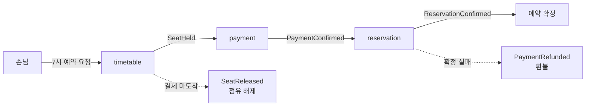
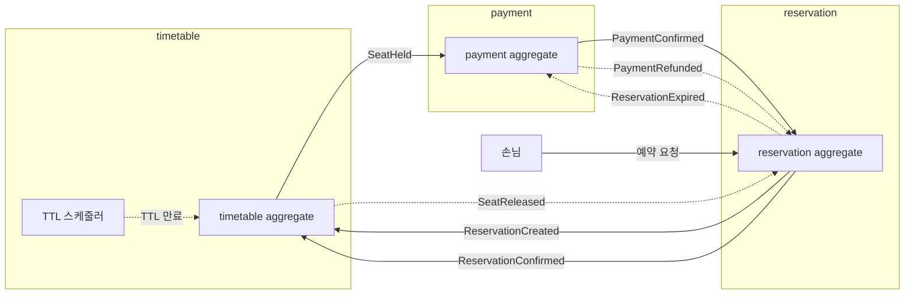

# RFC-006 — Saga·사가 조율 방식

- **상태**: 합의 (2026-06-28 개정) · design [[06-consistency-and-sagas]] 반영 · ADR [[08.saga-orchestration-vs-choreography]] 비준 대기
- **선행**: [[RFC-001-v2-cqrs-and-event-sourcing]] · 인덱스 [[RFC-INDEX]]
- **닫으면**: [[06-consistency-and-sagas]] 보강 + [[08.saga-orchestration-vs-choreography]] 비준

---

## 배경 (Background)

### 시나리오: 손님이 7시 테이블을 예약한다

**V1에서는 이렇게 흐른다.**
예약 하나를 만드는 건 사실상 DB 트랜잭션 하나였다 — 자리를 확인하고, 잡고, 끝. 전부 한 트랜잭션이라 중간에 실패하면 통째로 롤백되니 따로 조율할 게 없었다.

**V2에서는 이렇게 흐른다.** 컨텍스트가 쪼개진다([[RFC-001-v2-cqrs-and-event-sourcing]]). "예약하기"가 여러 컨텍스트에 걸친다 — 시간대 자리를 잡는 쪽, 결제를 받는 쪽, 예약을 확정하는 쪽이 각자 다른 데이터를 들고 이벤트로 대화한다. 이제 이걸 한 번에 묶는 단일 트랜잭션은 없다.

1. **임시 점유** — 손님이 7시 테이블을 예약하면 그 시간대 자리를 임시로 점유한다(`SeatHeld`).
2. **결제 대기** — 결제를 기다린다.
3. **확정** — 결제가 되면(`PaymentConfirmed`) 예약을 확정한다(`ReservationConfirmed`).

그런데 중간이 어긋날 수 있다 — 결제가 제때 안 오면 점유를 풀어 자리를 되돌려놔야 하고(타임아웃 + 되감기, `SeatReleased`), 결제는 됐는데 확정 단계가 깨지면 결제를 환불해야 한다(되감기, `PaymentRefunded`). 단일 트랜잭션이 없으니, 이 "여러 단계 + 실패 시 되감기"를 누군가 책임지고 끌고 가야 한다.

### 핵심 개념: 사가·코레오그래피·프로세스 매니저

"여러 컨텍스트에 걸친, 한 트랜잭션으로 못 묶는 업무 흐름"을 다루는 패턴이 **사가(saga)**다. 사가를 굴리는 방식은 둘이다.

| 개념 | 한 줄 정의 | 강점 | 약점 |
|------|-----------|------|------|
| **코레오그래피(choreography)** | 중앙 지휘자 없이 각 컨텍스트가 이벤트를 듣고 알아서 반응 | 느슨한 결합, 경량, 각 컨텍스트 자치 | 전체 흐름 가시성 없음 |
| **오케스트레이션 = 프로세스 매니저(PM)** | 흐름의 주인을 하나 세워 단계를 지휘하고 실패 시 되감기를 명령 | 전체 가시성, 중앙 보상 제어 | 관리 포인트 증가, 결합 증가, 인프라 비용 |

---

## 맥락 (Context)

라운드1에서 혼합 방향(라이프사이클은 PM, 단순 반응은 코레오그래피)을 잡았으나, PM의 정당성을 검증한 결과 **현재 예약 도메인에서 PM이 불필요함**이 확인되었다.

### PM 논거 격파

PM을 정당화하던 두 논거를 검증했다.

**논거 1: "타임아웃은 이벤트의 부재 — 시계를 볼 주인이 필요하다"**

반론: `timetable`이 자기 점유의 TTL을 자기가 관리하면 된다. "내 점유가 언제 죽는가"는 timetable의 불변식이다. V1 스케줄러가 TTL 지난 `SeatHeld`를 찾아 `SeatReleased`를 발행하면 PM이 시계 역할을 할 필요가 없다. **데이터 소유자가 자기 생명주기를 책임지는 것이 DDD적으로 더 자연스럽다.**

**논거 2: "되감기는 어디까지 왔는지를 알아야 — 전체 위치를 아는 주인이 필요하다"**

반론: 각 aggregate가 **자기 상태를 이미 알고 있다.** `timetable`은 자기가 `SeatHeld`인지, `payment`는 `PaymentConfirmed`인지 안다. 확정이 깨지면 `reservation`이 실패 이벤트를 발행하고, 각 컨텍스트가 **자기 상태를 보고 자기 보상을 판단한다.** "전체 흐름 위치"를 중앙에서 알 필요가 없다 — 보상 판단의 근거는 "자기 aggregate 상태"다.

### PM의 남은 가치와 비용

| PM이 주는 것 | 비용 |
|---|---|
| 흐름 전체 가시성 (한 곳에서 질의) | PM 상태 머신·영속화·재구성 인프라 |
| | 관리 포인트 1+N (PM + 각 컨텍스트 핸들러) |
| | PM이 모든 참여 컨텍스트 커맨드를 알아야 함 → 결합 증가 |
| | 복잡도를 줄이지 않고 위치만 이동 |

**2~3스텝 선형 흐름에서 "가시성 하나"가 이 비용을 정당화하지 못한다.**

핵심 전환 — **PM 없이, 각 컨텍스트가 이벤트를 듣고 자기 aggregate 상태를 보고 자기 보상을 책임지는 코레오그래피로 예약 사가를 조율한다.**

---

## Goal / Non-goal

**Goal**
- 예약 흐름(확정·취소·노쇼)의 코레오그래피 이벤트 흐름을 정한다.
- 타임아웃·보상·경합(paid-after-expiry)이 각 컨텍스트 자치로 어떻게 해결되는지 명시한다.
- 사가 단계 실패를 운영자가 어떻게 집어 올리는지(실패 처리 경로)를 정한다.

**Non-goal (이번에 하지 않음)**
- 타임아웃·점유 TTL의 구체적 분(分) 값 확정 — 화면/UX 요구에 묶여 구현 사이클에서 확정.
- 구체 이벤트 카탈로그 비준 — 이벤트 스토밍 재실시 후 확정.
- 외부 결제 연동 자체의 실패 흡수·재시도·ACL → [[RFC-016-payment-integration-boundary]].

---

## 논의 (Discussion)

### 논점 1. 조율 방식 — 코레오그래피 vs PM → [[08.saga-orchestration-vs-choreography]]

**쟁점:** 예약 도메인의 흐름(확정·취소·노쇼)에 PM이 필요한가?

**사용자 의견:** PM이 정말 합리적인지 검증 필요. PM의 명시적 근거가 없다. 코레오그래피가 보상 트랜잭션만 잘 다루면 나쁘지 않다. 결국 PM은 "마지막 단계에서 모든 걸 돌리는 부담을 PM에 책임 돌리겠다"는 것일 뿐. 복잡도가 더 낮은가? 관리 포인트가 줄어드는가? — 둘 다 아니다.

**검증 결과:** PM의 두 논거(타임아웃 감시, 되감기 주인)가 코레오그래피로 해결 가능. PM의 남은 가치는 "가시성" 하나인데, 2~3스텝 선형 흐름에서 상태 머신 인프라 비용을 정당화하지 못한다.

**결론:** **코레오그래피 기본.** 각 컨텍스트가 이벤트를 듣고 자기 aggregate 상태를 보고 자기 보상을 책임진다. PM 도입은 현재 불필요 — 미래에 5스텝 이상·조건부 분기가 복잡한 흐름이 생기면 재검토.

### 논점 2. 타임아웃과 만료 — 데이터 소유자 자치

**쟁점:** PM 없이 타임아웃을 누가 관리하는가?

**결론:** **`timetable`이 자기 점유의 TTL을 자기가 관리한다.** 스케줄러가 주기적으로 깨어 TTL 지난 `SeatHeld`를 찾아 `SeatReleased`를 발행. V1 스케줄러 패턴 재사용. "내 점유가 언제 죽는가"는 timetable의 도메인 불변식이다.

- 구체 TTL 값·폴링 주기는 화면/UX 요구에 묶이므로 구현 사이클에서 확정(TBD).
- 폴링 주기 ≤ TTL 관계는 수치로 검증할 제약([[06-consistency-and-sagas]]).

### 논점 3. 보상 — 각 컨텍스트 자기 책임

**쟁점:** PM 없이 보상 순서·정합성을 어떻게 보장하는가?

**결론:** **각 컨텍스트가 자기 aggregate 상태를 보고 자기 보상을 판단한다.** 중앙에서 보상 순서를 제어할 필요 없다.

- `reservation`이 실패/취소 이벤트를 발행하면, `payment`는 자기가 `PaymentConfirmed` 상태인지 보고 환불을 결정하고, `timetable`은 자기가 `SeatHeld` 상태인지 보고 해제를 결정한다.
- 보상은 멱등 — 같은 보상 이벤트를 두 번 받아도 한 번 적용한 것과 같아야 한다.
- 보상은 삭제가 아니라 새 이벤트 — append-only 불변식 유지([[05.event-store-mysql-table]]).

### 논점 4. 사가 실패를 운영이 어떻게 집어 올리나

**결론:** **V1 PoisonMessage 운영 흐름에 그대로 태운다.** 사가 실패만을 위한 별도 파이프라인을 세우면 운영 표면이 둘로 늘어난다. 메시지가 반복 실패하면 PoisonMessage로 격리·저장·추적·수동 재처리·알림 — 사가 스텝 실패도 같은 경로.

- 미결: 부분 보상 상태(예: `SeatReleased`는 됐는데 `PaymentRefunded`가 실패)를 PoisonMessage 모델이 담을 수 있는지는 구현 사이클에서 확정(TBD).
  - **종결 (2026-07-05, 트리아지 C11·C13 → [[DESIGN-007-consistency-and-sagas]] §4.9)**: 이 결론(단일 운영 표면)은 유지하되, 부분 보상 잔류는 범용 PoisonMessage 루프가 아니라 **순서-인지 꼬리 격리**([[DESIGN-020-ordering-and-failure-handling]] §5)로 처리한다 — 같은 운영 표면(저장·추적·알림) 위의 특화지 별도 파이프라인이 아니다. 환불 복구는 멱등 정방향 재호출([[DESIGN-015-payment-integration]] §6.6), 환불 실패 잔류는 운영 보정 큐 + 수동 드레인 런북. "PoisonMessage vs 사가 전용 경로" TBD는 **꼬리 격리 채택**으로 닫힘.

### 논점 5. 예약 외 흐름 — 취소·노쇼·환불

**결론:** **전부 코레오그래피.** 취소·노쇼·환불 모두 2~3스텝 선형 흐름이다.

- **취소**: `ReservationCancelled` → `payment` 환불 + `timetable` 좌석 해제.
- **노쇼**: 스케줄러 판정 → `ReservationNoShow` → `payment` 수수료 부과 + `timetable` 좌석 해제.
- **환불**: 취소·노쇼 안의 한 단계로서 `payment`가 자기 책임으로 처리.

구체 이벤트 카탈로그는 이벤트 스토밍 재실시 후 확정.

---

## 결정 요약

| # | 결정 | ADR |
|---|------|-----|
| 1 | **코레오그래피 기본** — 각 컨텍스트가 이벤트 반응 + 자기 aggregate 상태로 보상 판단. PM 불필요. | [[08.saga-orchestration-vs-choreography]] |
| 2 | 타임아웃 = **`timetable` TTL 자치**(스케줄러 폴링, V1 재사용). 데이터 소유자가 자기 생명주기 관리. | [[08.saga-orchestration-vs-choreography]] |
| 3 | 보상 = **각 컨텍스트 자기 책임**. 자기 aggregate 상태 기준 판단. 멱등·append-only. | [[08.saga-orchestration-vs-choreography]] |
| 4 | 사가 스텝 실패 = **V1 PoisonMessage 운영 흐름 계승**(같은 저장·추적·재처리·알림). | [[07.reservation]] |
| 5 | 취소·노쇼·환불 = **전부 코레오그래피**(2~3스텝 선형). | [[08.saga-orchestration-vs-choreography]] |

상세 설계·이벤트 흐름 도식은 [[06-consistency-and-sagas]] 참조.

---

## 결과 (목표 아키텍처 요약)

- 모든 흐름이 이벤트 반응의 연쇄 — PM 인프라 불필요.
- 타임아웃은 `timetable` TTL 스케줄러가 자치적으로 관리.
- 보상은 각 컨텍스트가 자기 aggregate 상태를 보고 판단.
- 실패는 V1 PoisonMessage 운영 흐름으로 흘러 같은 저장·추적·재처리·알림.

상세 코레오그래피 시퀀스는 [[06-consistency-and-sagas]] 참조.

---

## 관련 문서

- [[RFC-001-v2-cqrs-and-event-sourcing]] · [[RFC-INDEX]]
- ADR: [[08.saga-orchestration-vs-choreography]]
- 설계: [[06-consistency-and-sagas]]
- 경계/후속: [[RFC-016-payment-integration-boundary]]
- 계승: [[07.reservation]]
