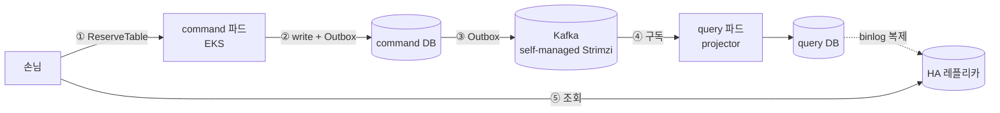
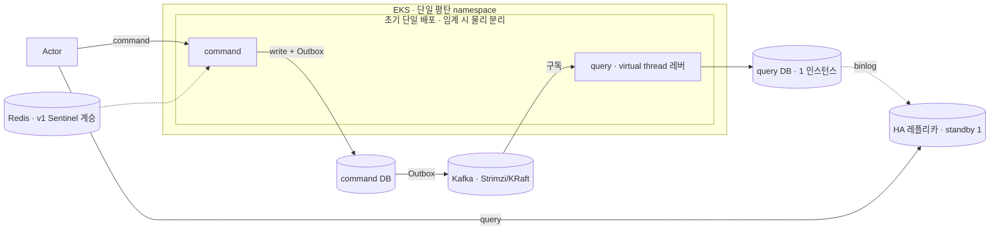

# RFC-007 — 배포·인프라·운영

- **상태**: 🏷 합의 (2026-06-21) · design [[09-deployment-runtime]] 반영 · ADR [[12.kafka-hosting-msk-vs-self-managed]]·[[13.db-hosting-and-read-write-topology]] 비준 대기
- **선행**: [[RFC-001-v2-cqrs-and-event-sourcing]] · 인덱스 [[RFC-INDEX]]
- **닫으면**: [[09-deployment-runtime]] 보강 + [[12.kafka-hosting-msk-vs-self-managed]]·[[13.db-hosting-and-read-write-topology]] 비준(Proposed→Accepted)

---

## 배경 (Background)

### 시나리오: 한 커맨드가 클러스터를 통과해 읽기까지 닿는다

**V1에서는 이렇게 흐른다.**
단일 모놀리식 애플리케이션이 한 DB를 두고 읽기·쓰기를 모두 처리한다. 배포 단위도 하나, DB도 하나라 "어디에 무엇을 둘지"를 고민할 일이 거의 없다 — 대신 읽기 부하와 쓰기 정합성이 같은 인스턴스에서 경합하고, 한쪽이 무너지면 같이 무너진다.

**V2에서는 이렇게 흐른다.**

1. **커맨드 수신** — 손님의 `ReserveTable` 커맨드가 EKS 위의 command 측 파드로 들어온다.
2. **쓰기 + 발행** — command 측이 command DB(쓰기 전용)에 쓰고, Outbox로 통합 이벤트를 낸다.
3. **다리 건너기** — self-managed Strimzi(Kafka)가 command와 query를 잇는 다리 역할을 한다. 이벤트가 Kafka를 통해 흐른다.
4. **읽기 모델 갱신** — query 측 파드의 projector가 이벤트를 구독해 query DB(읽기 전용)를 갱신한다.
5. **읽기 흡수** — 손님의 조회는 query DB의 HA 레플리카가 흡수한다. 애플리케이션은 읽기/쓰기를 직접 라우팅하지 않고, binlog 복제가 HA를 떠받친다.

### 무엇이 이미 잠겼고, 무엇이 남았나

토폴로지의 *방향*은 라운드1에서 이미 잠갔다 — Kafka가 command와 query를 잇는 다리, binlog 복제가 HA를 떠받치고, 애플리케이션은 읽기/쓰기를 라우팅하지 않으며, 호스팅 형태(RDS냐 자가 관리냐)는 그 위에서 투명하다. "EKS냐 ECS냐"를 다시 들출 일은 없다.

| 축 | 잠긴 방향 | 남은 결정 |
|----|-----------|-----------|
| 런타임 | EKS | namespace 구획, command/query 물리 분리 *시점* |
| 메시징 | self-managed Strimzi(Kafka) | Strimzi 스펙·메타데이터, k3s~EKS 패리티 |
| 데이터 | command/query 물리 분리 + binlog HA | standby·복제·페일오버 규약, 환경별 규격 축소 |
| 호스팅 형태 | 투명(RDS vs 자가 관리 무관) | (배포 사이클로 위임) |

---

## 맥락 (Context)

타깃 런타임은 EKS, Kafka는 self-managed Strimzi, command/query DB는 물리적으로 분리한다. 토폴로지의 방향이 이미 잠긴 만큼, 남은 건 *규격과 시점*이다 — namespace 구획, command/query 물리 분리 시점, DB standby·복제·페일오버 규약, DB 환경별 축소, Strimzi 스펙·메타데이터, k3s~EKS 패리티.

- **결정의 형태가 전부 같다 — 방향은 지금, 숫자는 측정 후.** 복제 지연 허용치·분리 임계·브로커 수·복제 팩터·페일오버 소요 같은 숫자는 정상 범위를 관측하기 전엔 허구의 SLO가 된다. → 그래서 방향(정성)만 책상에서 잠그고, 절대 수치는 운영 실측 후 튜닝으로 미룬다(각 논점 결론의 "(이의 여지: …)"에 흡수).
- **자산 — 모듈은 이미 갈라져 있다.** command/query 모듈 분리(논리)는 [[01.cqrs-command-query-module-split]]에서 끝났다. → 따라서 *배포 분리(물리)*는 나중에도 싸게 할 수 있어, 분리 시점을 미루는 게 안전하다(전형적 YAGNI).
- **자산 — Redis는 v1에서 이미 Sentinel로 돈다.** 현재 워크로드는 세션·캐시뿐이라 Cluster 샤딩을 요구하는 신호가 없다. → 계승이 자연스럽고, Cluster 전환은 압박이 실재할 때로 미룬다.
- **자산 — 실트래픽이 없다.** 인스턴스 분할을 유발할 부하 자체가 없다. → "query를 여러 인스턴스로 쪼갠다"는 기본이 될 수 없다(학습 가치도 CQRS·프로젝션·HA가 이미 주는 것 너머가 없다).

핵심 긴장 — **토폴로지 방향은 잠겼으되, *프로덕션 불변식을 흐리지 않는 선에서* 무엇을 지금 규격화하고 무엇을 측정·하위 환경으로 미룰지를, 책상에서 정할 정책과 운영 실측으로 미룰 수치를 갈라 결정한다.**

---

## Goal / Non-goal

**Goal**
- Kubernetes namespace 구획 기본값과 분리 트리거를 정한다.
- command/query 배포 물리 분리의 *시점 기준*(방향)을 정한다.
- 웹 티어 IO 확장 레버(virtual thread)를 박아 둔다.
- 데이터 계층 HA·토폴로지(query/command 인스턴스, Redis, standby, 환경별 축소)의 방향을 정한다.
- Kafka/Strimzi 메타데이터 방식과 환경 패리티 원칙을 정한다.

**Non-goal (이번에 하지 않음)**
- 수치 확정 — command/query 분리 임계, 복제 지연 허용치·페일오버 SLI, 환경별 축소 매트릭스, Strimzi 브로커 수·복제 팩터·PDB·스토리지·리소스 한도, 패리티 속성 목록. → 측정/Design([[09-deployment-runtime]]·[[11-environments-and-testing]]).
- read model 내부 조직(도메인별 스키마). → [[RFC-002-read-model-consistency]] / [[03-read-model]]. 본 RFC는 query *토폴로지*만.
- readiness 신호 정의·핵심 SLI·메트릭 카탈로그·알람 임계. → [[RFC-008-observability]] · catch-up readiness는 [[RFC-011-projection-rebuild-catchup]]. 본 RFC는 배포 측 hook만.
- 호스팅 선택(RDS vs 자가 관리 MySQL, ElastiCache vs 자가 관리 Redis) — 호스팅 형태 투명 원칙에 따라 **배포 사이클**로 위임.
- GitOps 도구(ArgoCD/Flux 등) 선택. → [[index|docs/todo]] 백로그로 이관.

---

## 논의 (Discussion)

### 논점 1. namespace를 처음부터 가를 것인가 → [[09-deployment-runtime]]

**맥락에서 나온 질문.** 런타임이 EKS로 잠긴 이상(맥락), 첫 배치를 단일 namespace로 평탄하게 둘지 처음부터 가를지 정해야 한다.

검토한 선택지:
- **단일 평탄 namespace** — 매니페스트가 단순하다. 대신 RBAC·쿼터·수명주기 격리는 약하다.
- **처음부터 분리** — 격리가 강하다. 대신 매니페스트 중복·NetworkPolicy·디버깅 동선이라는 순수 비용을 압박도 없이 진다.

**내 의견(AI):** 단일 평탄 namespace를 기본값으로 둔다. 분리를 정당화하는 건 셋뿐 — RBAC 경계, 리소스 쿼터, 수명주기 독립 — 이고, 셋 다 압박이 아니면 namespace 분리는 순수 비용이다. 분리 트리거(팀/역할 분화, 리소스 폭주 격리, 배포 수명주기 분기)는 명시해 두고, 당겨지기 전까진 평탄이 옳다. (인정하는 트레이드오프: 컨텍스트 수가 늘어 한 namespace에서 시야를 잃는 게 트리거 셋보다 먼저 올 수 있다.)

**네 결정:** 단일 평탄 namespace 기본 + 분리 트리거 셋 명시, 당겨지기 전까진 평탄 유지. 〔근거 확인/보강 필요〕

**결론:** namespace는 평탄하게 시작하고, RBAC·쿼터·수명주기 트리거가 당겨질 때만 분리한다. (이의 여지: 컨텍스트 증가로 인한 시야 상실이 트리거보다 먼저 올 수 있음 — Design.)

### 논점 2. command/query를 언제 물리적으로 분리하는가 → [[01.cqrs-command-query-module-split]]

**맥락에서 나온 질문.** 모듈은 이미 갈라져 있다(맥락의 자산). 그러면 두 Deployment로 굴리는 *배포 분리(물리)*는 언제 당기나? *모듈 분리(논리)*와 *배포 분리(물리)*는 별개다.

**내 의견(AI):** 초기 단일 배포로 시작해, 읽기 스케일이 결합 배포로 감당 안 되거나 한쪽 장애 격리가 필요할 때 분리한다. 모듈이 이미 갈라져 있어 분리는 나중에도 싸므로 이 미루기가 안전하다(전형적 YAGNI). 임계 지표·수치는 측정으로.

**네 결정:** 초기 단일 배포, 읽기 스케일 한계 또는 장애 격리 필요 시 물리 분리. 〔근거 확인/보강 필요〕

**결론:** command/query 물리 분리는 신호가 임계를 넘을 때 당긴다. (이의 여지: 분리를 당기는 신호의 지표·임계 수치는 Design.)

### 논점 3. 웹 티어 IO 확장을 무엇으로 여는가 → [[RFC-008-observability]]

**맥락에서 나온 질문.** 동시성 확장이 필요해질 때 무엇을 레버로 둘지. 영속화가 블로킹 JPA인 상황에서 non-blocking을 선택지로 둘 수 있나.

검토한 선택지:
- **non-blocking(코루틴/WebFlux)** — 이론상 IO 확장에 강하다. 대신 블로킹 JPA 위에서는 이득 없이 복잡도만 진다.
- **virtual thread** — 명령형 MVC·JPA 코드 그대로, 한 줄 설정으로 블로킹 비용을 낮춘다. MDC·추적도 안 깨진다.

**내 의견(AI):** non-blocking은 채택하지 않는다 — 영속화가 블로킹 JPA라 코루틴/WebFlux는 이득 없이 복잡도만 진다([[RFC-008-observability]] 코루틴 기각). 동시성 확장이 필요해지면 `spring.threads.virtual.enabled=true`(JDK21·Boot 3.4) 한 줄로 명령형 코드 그대로 블로킹 비용을 낮춘다. 지금 켤 필요는 없고, *레버*만 박아 둔다.

**네 결정:** non-blocking 기각, 확장 레버로 virtual thread 채택(지금은 off, 레버만 확보). 〔근거 확인/보강 필요〕

**결론:** 웹 티어 IO 확장 레버 = virtual thread(`spring.threads.virtual.enabled=true`). non-blocking은 채택 안 함.

### 논점 4. query를 여러 인스턴스로 쪼갤 것인가 → [[13.db-hosting-and-read-write-topology]]

**맥락에서 나온 질문.** 읽기 확장을 인스턴스 분할로 풀지, HA 레플리카로 풀지. 실트래픽이 없다는 자산(맥락)이 여기서 직접 작용한다.

**내 의견(AI):** 읽기 부하는 HA 레플리카가 흡수하므로 "query를 여러 인스턴스로 쪼갠다"는 기본이 아니다 — 실트래픽이 없어 인스턴스 분할을 유발할 부하 자체가 없고, 분할 샤딩은 부하가 실재할 때의 운영 수단일 뿐 CQRS·프로젝션·HA 레플리카가 이미 주는 것 너머를 가르치지도 않는다. **읽기 확장은 레플리카로, query 인스턴스 분할은 명시적으로 off.**

**네 결정:** query/command = 각 1 인스턴스 + HA 레플리카, 읽기 확장은 레플리카, 인스턴스 분할 off. 〔근거 확인/보강 필요〕

**결론:** query/command 토폴로지 = 각 1 인스턴스 + HA 레플리카. 읽기 확장은 레플리카로, 인스턴스 분할은 명시적 off. (그 한 인스턴스 *안*의 도메인별 스키마 조직은 [[RFC-002-read-model-consistency]] 소유 — 여기선 토폴로지만.)

### 논점 5. Redis를 Cluster로 갈 것인가 → [[13.db-hosting-and-read-write-topology]]

**맥락에서 나온 질문.** Redis가 v1에서 이미 Sentinel로 돈다(맥락의 자산). 이를 계승할지, Cluster로 전환할지.

**내 의견(AI):** v1의 Sentinel을 계승한다. 현재 워크로드는 세션·캐시이고 Cluster의 샤딩을 요구하는 신호가 없다. v1이 이미 Sentinel로 도므로 계승이 자연스럽다. Cluster 전환은 메모리/처리량이 단일 마스터를 실제로 압박할 때로 미룬다.

**네 결정:** Redis는 v1 Sentinel 계승, Cluster 전환은 단일 마스터 압박 시로 보류. 〔근거 확인/보강 필요〕

**결론:** Redis = v1 Sentinel 계승. Cluster 전환은 보류. (Redis가 *왜* 읽기 캐시가 아니라 조정 상태 전용인지는 [[RFC-018-caching-redis-role]].)

### 논점 6. standby를 몇 대 두고 페일오버를 어떻게 규정하는가 → [[13.db-hosting-and-read-write-topology]]

**맥락에서 나온 질문.** binlog 복제가 HA를 떠받친다는 방향(맥락)을 standby 대수·복제 지연 규약으로 구체화해야 한다. 사이드 프로젝트 규모에 맞는 선은?

검토한 선택지:
- **standby 0대** — 운영이 가장 가볍다. 대신 HA가 아니다.
- **standby 1대** — HA를 성립시키면서 비용이 최소다.
- **standby 다수** — 가용성 여유가 크다. 대신 사이드 프로젝트 규모엔 과하다.

**내 의견(AI):** standby 다수는 과하고 0대는 HA가 아니다. **standby 1 + 지연 허용치 + 임계 초과 알람**이라는 정책 *형태*만 지금 잡고, 허용 지연 절대값과 자동 페일오버 도입 여부는 측정 후 — 둘 다 측정 없이 정하면 허구의 SLO다. 페일오버 소요 시간(HA 고유 지표)은 이 정책에 묶어 둔다(이름·임계는 [[RFC-008-observability]]가 소유하므로 여기선 묶어만 둠).

**네 결정:** standby 1 + 복제 지연 허용 정책(허용치·자동 페일오버 여부는 측정 후), 페일오버 소요는 이 정책에 결속. 〔근거 확인/보강 필요〕

**결론:** standby 1대 + 지연 허용치 + 임계 초과 알람의 정책 형태를 잠근다. (이의 여지: 허용 지연 절대값·자동 페일오버 도입 여부·페일오버 소요 SLI는 측정 후 — Design.)

### 논점 7. DB 규격을 환경별로 어떻게 다룰 것인가 → [[13.db-hosting-and-read-write-topology]]

**맥락에서 나온 질문.** command/query 물리 분리는 *프로덕션 불변식*인데(맥락), 이를 로컬·소규모까지 강제하면 비용만 는다. 환경별로 어디까지 풀어줄 수 있나?

**내 의견(AI):** 물리 분리는 프로덕션 불변식이지만 하위 환경까지 강제할 필요는 없다. 프로덕션은 분리 불변식을 지키고, 로컬은 단일 인스턴스, 스테이지는 토폴로지 동형을 지키되 스펙 축소 — *프로덕션 불변식을 흐리지 않는 선에서* 하위 환경 비용을 깎는다.

**네 결정:** 프로덕션 분리 불변식 유지, 로컬 단일 인스턴스, 스테이지 동형+스펙 축소. 〔근거 확인/보강 필요〕

**결론:** DB는 환경별로 규격을 축소하되 프로덕션 분리 불변식은 흐리지 않는다. (이의 여지: 환경별 축소 매트릭스 — 어디까지 단일 인스턴스/스키마 분리를 허용하나 — 는 [[11-environments-and-testing]].)

### 논점 8. Kafka 메타데이터를 무엇으로 관리하는가 → [[12.kafka-hosting-msk-vs-self-managed]]

**맥락에서 나온 질문.** 메시징이 self-managed Strimzi로 잠긴 이상(맥락), 신규 클러스터의 메타데이터 관리 방식을 정해야 한다.

검토한 선택지:
- **ZooKeeper** — 익숙하다. 대신 별도 앙상블 운영 부담이 있고, 업스트림이 떠나는 방향이다.
- **KRaft** — 별도 앙상블이 없다. 업스트림 표준 이동과도 정렬된다.

**내 의견(AI):** 신규 클러스터를 ZooKeeper에 묶을 이유가 없다 — 별도 앙상블 운영 부담 + 업스트림이 KRaft로 표준 이동. KRaft를 택한다. 브로커 수·복제 팩터·PDB·스토리지 클래스·리소스 한도는 처리량·내구성 측정으로 확정한다.

**네 결정:** Kafka 메타데이터 = KRaft, 클러스터 규격 수치는 측정 후. 〔근거 확인/보강 필요〕

**결론:** Kafka 메타데이터는 KRaft로 관리한다. (이의 여지: 브로커 수·복제 팩터·PDB·스토리지 클래스·리소스 한도는 측정 — Design.)

### 논점 9. k3s~EKS 환경 패리티를 어디까지 맞추는가 → [[12.kafka-hosting-msk-vs-self-managed]]

**맥락에서 나온 질문.** 로컬(k3s)과 프로덕션(EKS)의 Kafka 환경을 전부 똑같이 맞추면 로컬 자원 부담이 크다. 어디는 묶고 어디는 풀어줄까?

**내 의견(AI):** 패리티를 속성별로 끊는다. *동작 정합성*에 영향 주는 속성(리스너 구성·인증 방식·토픽 토폴로지 동형)은 패리티로 묶고, *규모* 속성(브로커 수·스토리지 용량)은 로컬 축소를 허용한다. 그러면 로컬에서 잡히는 버그 대부분(인증·리스너·직렬화)은 잡으면서 자원 부담은 던다.

**네 결정:** 동작 정합성 속성은 패리티, 규모 속성은 로컬 축소 허용. 〔근거 확인/보강 필요〕

**결론:** k3s~EKS 패리티는 속성별로 끊는다 — 동작 정합성은 묶고 규모는 푼다. (이의 여지: 패리티로 묶을 속성 / 축소 허용 속성의 정확한 목록은 [[12.kafka-hosting-msk-vs-self-managed]]·[[11-environments-and-testing]].)

---

## 결정 요약

| # | 결정 | ADR |
|---|------|-----|
| 1 | namespace = **단일 평탄 기본** + RBAC·쿼터·수명주기 트리거 시 분리 | [[09-deployment-runtime]] |
| 2 | command/query **물리 분리는 신호가 임계를 넘을 때**(초기 단일 배포), 모듈은 이미 분리 | [[01.cqrs-command-query-module-split]] |
| 3 | 웹 티어 IO 확장 레버 = **virtual thread**(non-blocking 기각), 지금은 off | [[RFC-008-observability]] |
| 4 | query/command = **각 1 인스턴스 + HA 레플리카**, 읽기 확장은 레플리카·인스턴스 분할 off | [[13.db-hosting-and-read-write-topology]] · [[RFC-002-read-model-consistency]] |
| 5 | Redis = **v1 Sentinel 계승**, Cluster 전환 보류 | [[13.db-hosting-and-read-write-topology]] · [[RFC-018-caching-redis-role]] |
| 6 | DB HA = **standby 1 + 지연 허용치 + 임계 알람**(정책 형태), 절대값·자동 페일오버는 측정 후 | [[13.db-hosting-and-read-write-topology]] |
| 7 | DB는 **환경별 규격 축소**(프로덕션 분리 불변식 유지, 로컬 단일·스테이지 동형+축소) | [[13.db-hosting-and-read-write-topology]] · [[11-environments-and-testing]] |
| 8 | Kafka 메타데이터 = **KRaft**, 클러스터 규격 수치는 측정 후 | [[12.kafka-hosting-msk-vs-self-managed]] |
| 9 | k3s~EKS 패리티 = **속성별로 끊기**(동작 정합성 묶고 규모 축소 허용) | [[12.kafka-hosting-msk-vs-self-managed]] · [[11-environments-and-testing]] |

상세 설계는 [[09-deployment-runtime]] · [[11-environments-and-testing]] 참조.

---

## 결과 (목표 배포 토폴로지 요약)

- **런타임**: 단일 평탄 namespace 기본, command/query는 초기 단일 배포로 시작해 신호가 임계를 넘을 때 물리 분리. IO 확장 레버는 virtual thread.
- **데이터**: query/command 각 1 인스턴스 + HA 레플리카(읽기 확장은 레플리카, 인스턴스 분할 off), standby 1 + 지연 허용 정책, 환경별 규격 축소(프로덕션 분리 불변식 유지), Redis는 v1 Sentinel 계승.
- **메시징**: Strimzi(Kafka) 메타데이터 KRaft, k3s~EKS 패리티는 동작 정합성 속성만 묶고 규모는 로컬 축소.
- **배포 측 hook만**: projector·outbox relay의 readiness 신호를 readiness probe로 게이팅하는 와이어링만 [[09-deployment-runtime]]에 둔다(신호 정의·임계는 [[RFC-008-observability]]·[[RFC-011-projection-rebuild-catchup]]).

상세 런타임·환경 매트릭스는 [[09-deployment-runtime]] · [[11-environments-and-testing]] 참조.

---

## 관련 문서

[[RFC-INDEX]] · [[09-deployment-runtime]] · [[11-environments-and-testing]] · [[12.kafka-hosting-msk-vs-self-managed]] · [[13.db-hosting-and-read-write-topology]] · [[01.cqrs-command-query-module-split]] · [[RFC-002-read-model-consistency]] · [[RFC-008-observability]] · [[RFC-011-projection-rebuild-catchup]] · [[RFC-018-caching-redis-role]] · [[RFC-001-v2-cqrs-and-event-sourcing]]
