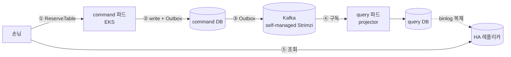
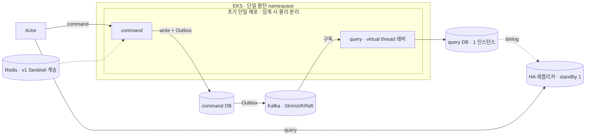

# RFC-007 — 배포·인프라·운영

- **상태**: 🏷 합의 (2026-06-21) · design [[09-deployment-runtime]] 반영 · ADR [[12.kafka-hosting-msk-vs-self-managed]]·[[13.db-hosting-and-read-write-topology]] 비준 대기
- **선행**: [[RFC-001-v2-cqrs-and-event-sourcing]] · 인덱스 [[RFC-INDEX]]
- **닫으면**: [[09-deployment-runtime]] 보강 + [[12.kafka-hosting-msk-vs-self-managed]]·[[13.db-hosting-and-read-write-topology]] 비준(Proposed→Accepted)

---

## 배경 (Background)

### 시나리오: 한 커맨드가 클러스터를 통과해 읽기까지 닿는다

**V1에서는 이렇게 흐른다.**
단일 모놀리식 애플리케이션이 한 DB를 두고 읽기·쓰기를 모두 처리한다. 배포 단위도 하나, DB도 하나라 "어디에 무엇을 둘지"를 고민할 일이 거의 없다 — 대신 읽기 부하와 쓰기 정합성이 같은 인스턴스에서 경합하고, 한쪽이 무너지면 같이 무너진다.

**V2에서는 이렇게 흐른다.**

1. **커맨드 수신** — 손님의 `ReserveTable` 커맨드가 EKS 위의 command 측 파드로 들어온다.
2. **쓰기 + 발행** — command 측이 command DB(쓰기 전용)에 쓰고, Outbox로 통합 이벤트를 낸다.
3. **다리 건너기** — self-managed Strimzi(Kafka)가 command와 query를 잇는 다리 역할을 한다. 이벤트가 Kafka를 통해 흐른다.
4. **읽기 모델 갱신** — query 측 파드의 projector가 이벤트를 구독해 query DB(읽기 전용)를 갱신한다.
5. **읽기 흡수** — 손님의 조회는 query DB의 HA 레플리카가 흡수한다. 애플리케이션은 읽기/쓰기를 직접 라우팅하지 않고, binlog 복제가 HA를 떠받친다.

### 무엇이 이미 잠겼고, 무엇이 남았나

| 축 | 잠긴 방향 | 남은 결정 |
|----|-----------|-----------|
| 런타임 | EKS | namespace 구획, command/query 물리 분리 *시점* |
| 메시징 | self-managed Strimzi(Kafka) | Strimzi 스펙·메타데이터, k3s~EKS 패리티 |
| 데이터 | command/query 물리 분리 + binlog HA | standby·복제·페일오버 규약, 환경별 규격 축소 |
| 호스팅 형태 | 투명(RDS vs 자가 관리 무관) | (배포 사이클로 위임) |

---

## 맥락 (Context)

토폴로지 방향은 잠겼고, 남은 건 *규격과 시점*이다. 원칙: **방향(정성)은 지금 잠그고, 절대 수치는 운영 실측 후 확정한다.**

기존 자산:
- command/query 모듈 분리(논리)는 완료([[01.cqrs-command-query-module-split]]) → 배포 분리(물리)는 나중에도 싸다(YAGNI).
- Redis는 v1에서 이미 Sentinel → 계승. Cluster 전환은 압박 시.
- 실트래픽이 없다 → 인스턴스 분할을 유발할 부하가 없다.

---

## Goal / Non-goal

**Goal**
- Kubernetes namespace 구획 기본값과 분리 트리거를 정한다.
- command/query 배포 물리 분리의 *시점 기준*(방향)을 정한다.
- 웹 티어 IO 확장 레버(virtual thread)를 박아 둔다.
- 데이터 계층 HA·토폴로지(query/command 인스턴스, Redis, standby, 환경별 축소)의 방향을 정한다.
- Kafka/Strimzi 메타데이터 방식과 환경 패리티 원칙을 정한다.

**Non-goal (이번에 하지 않음)**
- 수치 확정 — command/query 분리 임계, 복제 지연 허용치·페일오버 SLI, 환경별 축소 매트릭스, Strimzi 브로커 수·복제 팩터·PDB·스토리지·리소스 한도, 패리티 속성 목록. → 측정/Design([[09-deployment-runtime]]·[[11-environments-and-testing]]).
- read model 내부 조직(도메인별 스키마). → [[RFC-002-read-model-consistency]] / [[03-read-model]]. 본 RFC는 query *토폴로지*만.
- readiness 신호 정의·핵심 SLI·메트릭 카탈로그·알람 임계. → [[RFC-008-observability]] · catch-up readiness는 [[RFC-011-projection-rebuild-catchup]]. 본 RFC는 배포 측 hook만.
- 호스팅 선택(RDS vs 자가 관리 MySQL, ElastiCache vs 자가 관리 Redis) — 호스팅 형태 투명 원칙에 따라 **배포 사이클**로 위임.
- GitOps 도구(ArgoCD/Flux 등) 선택. → [[index|docs/todo]] 백로그로 이관.

---

## 논의 (Discussion)

### 논점 1. namespace를 처음부터 가를 것인가 → [[09-deployment-runtime]]

검토한 선택지:
- **단일 평탄 namespace** — 매니페스트가 단순하다. 대신 RBAC·쿼터·수명주기 격리는 약하다.
- **처음부터 분리** — 격리가 강하다. 대신 매니페스트 중복·NetworkPolicy·디버깅 동선이라는 순수 비용을 압박도 없이 진다.

**결론:** 단일 평탄 namespace 기본. 분리 트리거는 셋 — RBAC 경계, 리소스 쿼터, 수명주기 독립. 당겨지기 전까진 평탄 유지. (이의 여지: 컨텍스트 증가로 인한 시야 상실이 트리거보다 먼저 올 수 있음 — Design.)

### 논점 2. command/query를 언제 물리적으로 분리하는가 → [[01.cqrs-command-query-module-split]]

모듈은 이미 갈라져 있다([[01.cqrs-command-query-module-split]]). 배포 분리(물리)는 별개 — 모듈이 갈라져 있으므로 나중에도 싸다(YAGNI).

**결론:** 초기 단일 배포. 읽기 스케일 한계 또는 장애 격리 필요 시 물리 분리. (이의 여지: 분리 신호의 지표·임계 수치는 Design.)

### 논점 3. 웹 티어 IO 확장을 무엇으로 여는가 → [[RFC-008-observability]]

검토한 선택지:
- **non-blocking(코루틴/WebFlux)** — 영속화가 블로킹 JPA라 이득 없이 복잡도만 진다.
- **virtual thread** — 명령형 MVC·JPA 코드 그대로, 한 줄 설정(`spring.threads.virtual.enabled=true`)으로 블로킹 비용을 낮춘다.

**결론:** non-blocking 기각. 확장 레버 = virtual thread(지금은 off, 레버만 확보).

### 논점 4. query를 여러 인스턴스로 쪼갤 것인가 → [[13.db-hosting-and-read-write-topology]]

실트래픽이 없어 인스턴스 분할을 유발할 부하 자체가 없다. 읽기 부하는 HA 레플리카가 흡수한다.

**결론:** query/command = 각 1 인스턴스 + HA 레플리카. 인스턴스 분할은 off. (도메인별 스키마 조직은 [[RFC-002-read-model-consistency]] 소유.)

### 논점 5. Redis를 Cluster로 갈 것인가 → [[13.db-hosting-and-read-write-topology]]

v1이 이미 Sentinel로 돌고 있고, 현재 워크로드(세션·캐시)는 샤딩을 요구하는 신호가 없다.

**결론:** v1 Sentinel 계승. Cluster 전환은 단일 마스터 압박 시로 보류. (Redis 역할은 [[RFC-018-caching-redis-role]].)

### 논점 6. standby를 몇 대 두고 페일오버를 어떻게 규정하는가 → [[13.db-hosting-and-read-write-topology]]

0대는 HA가 아니고, 다수는 사이드 프로젝트 규모에 과하다.

**결론:** standby 1대 + 복제 지연 허용치 + 임계 초과 알람. 허용 지연 절대값·자동 페일오버 도입 여부는 측정 후 확정.

### 논점 7. DB 규격을 환경별로 어떻게 다룰 것인가 → [[13.db-hosting-and-read-write-topology]]

물리 분리는 프로덕션 불변식이지만 하위 환경까지 강제하면 비용만 는다.

**결론:** 프로덕션은 분리 불변식 유지, 로컬은 단일 인스턴스, 스테이지는 동형+스펙 축소. (환경별 축소 매트릭스는 [[11-environments-and-testing]].)

### 논점 8. Kafka 메타데이터를 무엇으로 관리하는가 → [[12.kafka-hosting-msk-vs-self-managed]]

신규 클러스터를 ZooKeeper에 묶을 이유가 없다 — 별도 앙상블 운영 부담 + 업스트림이 KRaft로 표준 이동.

**결론:** KRaft. 브로커 수·복제 팩터·PDB·스토리지·리소스 한도는 측정 후 확정.

### 논점 9. k3s~EKS 환경 패리티를 어디까지 맞추는가 → [[12.kafka-hosting-msk-vs-self-managed]]

로컬(k3s)과 프로덕션(EKS)을 전부 맞추면 로컬 자원 부담이 크다. 패리티를 속성별로 끊는다.

**결론:** 동작 정합성 속성(리스너·인증·토픽 토폴로지)은 패리티, 규모 속성(브로커 수·스토리지)은 로컬 축소 허용. (속성 목록은 [[12.kafka-hosting-msk-vs-self-managed]]·[[11-environments-and-testing]].)

---

## 결정 요약

| # | 결정 | ADR |
|---|------|-----|
| 1 | namespace = **단일 평탄 기본** + RBAC·쿼터·수명주기 트리거 시 분리 | [[09-deployment-runtime]] |
| 2 | command/query **물리 분리는 신호가 임계를 넘을 때**(초기 단일 배포), 모듈은 이미 분리 | [[01.cqrs-command-query-module-split]] |
| 3 | 웹 티어 IO 확장 레버 = **virtual thread**(non-blocking 기각), 지금은 off | [[RFC-008-observability]] |
| 4 | query/command = **각 1 인스턴스 + HA 레플리카**, 읽기 확장은 레플리카·인스턴스 분할 off | [[13.db-hosting-and-read-write-topology]] · [[RFC-002-read-model-consistency]] |
| 5 | Redis = **v1 Sentinel 계승**, Cluster 전환 보류 | [[13.db-hosting-and-read-write-topology]] · [[RFC-018-caching-redis-role]] |
| 6 | DB HA = **standby 1 + 지연 허용치 + 임계 알람**(정책 형태), 절대값·자동 페일오버는 측정 후 | [[13.db-hosting-and-read-write-topology]] |
| 7 | DB는 **환경별 규격 축소**(프로덕션 분리 불변식 유지, 로컬 단일·스테이지 동형+축소) | [[13.db-hosting-and-read-write-topology]] · [[11-environments-and-testing]] |
| 8 | Kafka 메타데이터 = **KRaft**, 클러스터 규격 수치는 측정 후 | [[12.kafka-hosting-msk-vs-self-managed]] |
| 9 | k3s~EKS 패리티 = **속성별로 끊기**(동작 정합성 묶고 규모 축소 허용) | [[12.kafka-hosting-msk-vs-self-managed]] · [[11-environments-and-testing]] |

상세 설계는 [[09-deployment-runtime]] · [[11-environments-and-testing]] 참조.

---

## 결과 (목표 배포 토폴로지 요약)

- **런타임**: 단일 평탄 namespace 기본, command/query는 초기 단일 배포로 시작해 신호가 임계를 넘을 때 물리 분리. IO 확장 레버는 virtual thread.
- **데이터**: query/command 각 1 인스턴스 + HA 레플리카(읽기 확장은 레플리카, 인스턴스 분할 off), standby 1 + 지연 허용 정책, 환경별 규격 축소(프로덕션 분리 불변식 유지), Redis는 v1 Sentinel 계승.
- **메시징**: Strimzi(Kafka) 메타데이터 KRaft, k3s~EKS 패리티는 동작 정합성 속성만 묶고 규모는 로컬 축소.
- **배포 측 hook만**: projector·outbox relay의 readiness 신호를 readiness probe로 게이팅하는 와이어링만 [[09-deployment-runtime]]에 둔다(신호 정의·임계는 [[RFC-008-observability]]·[[RFC-011-projection-rebuild-catchup]]).

상세 런타임·환경 매트릭스는 [[09-deployment-runtime]] · [[11-environments-and-testing]] 참조.

---

## 관련 문서

[[RFC-INDEX]] · [[09-deployment-runtime]] · [[11-environments-and-testing]] · [[12.kafka-hosting-msk-vs-self-managed]] · [[13.db-hosting-and-read-write-topology]] · [[01.cqrs-command-query-module-split]] · [[RFC-002-read-model-consistency]] · [[RFC-008-observability]] · [[RFC-011-projection-rebuild-catchup]] · [[RFC-018-caching-redis-role]] · [[RFC-001-v2-cqrs-and-event-sourcing]]
