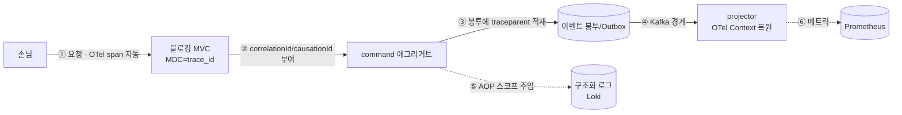
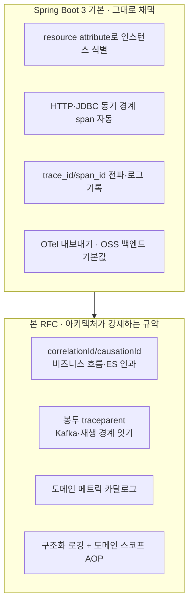
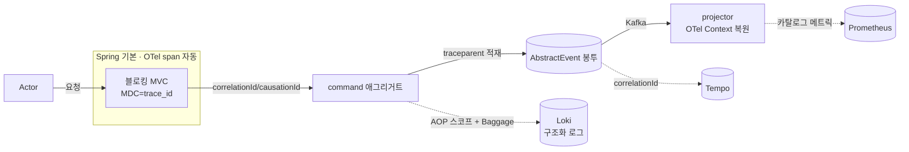

# RFC-008 — 관측성

- **상태**: 🏷 합의 (2026-06-21) · design [[10-observability]] 반영 · 코루틴 기각(블로킹 MVC 유지)
- **선행**: [[RFC-001-v2-cqrs-and-event-sourcing]] · 인덱스 [[RFC-INDEX]]
- **닫으면**: [[10-observability]] 보강

---

## 배경 (Background)

### 시나리오: 한 예약 요청이 추적되며 시스템을 통과한다

**V1에서는 이렇게 흐른다.**
손님이 예약을 만들면 컨트롤러가 도메인 서비스를 부르고, 한 요청이 한 스레드 위에서 동기적으로 끝난다. 이 동안엔 MDC(ThreadLocal)가 그대로 살아 있어 trace_id가 로그에 찍힌다. 문제는 — **그 요청 하나의 추적이 곧 전부**라는 데 있다. "같은 예약 건"이 재처리되거나 컨텍스트를 넘나들면 추적이 끊기고, "이 예약 건의 모든 로그"를 한 번에 끌어오는 구조화된 조회도 안 된다.

**V2에서는 이렇게 흐른다.**

1. **요청 수신** — Spring Boot 3 기본(Micrometer Tracing + OTel 브리지)이 HTTP·JDBC 같은 동기 경계에서 span을 자동 생성하고 trace_id/span_id를 전파한다.
2. **비즈니스 흐름 식별** — 요청 하나짜리인 trace_id 위에 "같은 예약 건"을 묶는 correlationId, ES 인과를 가리키는 causationId가 얹힌다.
3. **이벤트 발행 + 봉투에 추적 적재** — 공통 발행 경로가 이벤트 봉투(AbstractEvent)에 correlationId·causationId·traceparent를 채워, Kafka를 건너도 추적이 끊기지 않게 한다.
4. **비동기·메시지 경계 통과** — `@Async`·스케줄러·Kafka 소비(프로젝터)에서 OTel Context가 복원되고, 로깅 시점에 MDC로 투영돼 찍힌다.
5. **도메인 스코프 자동 주입** — 도메인 경계의 AOP 아스펙트가 운영 이름·애그리거트 id 같은 스코프 키를 컨텍스트에 넣어, 그 안의 모든 로그가 자동으로 그 키를 달고 나간다.
6. **파이프라인 계측** — 프로젝션 지연·Outbox 적체 같은 도메인 메트릭이 정해진 이름·라벨·단위로 찍혀 대시보드로 모인다.

### 무엇이 Spring 기본이고, 무엇이 이 RFC의 몫인가

| 개념 | 현행(전제) | 변경(본 RFC) | 한 줄 정의 |
|------|-----------|-------------|-----------|
| **trace_id** | OTel 자동, 요청 하나에 매임 | 그대로 채택 | "추적 하나(대개 요청 하나)의 식별자" |
| **correlationId** | 권고 수준 | 모든 root span 필수 attribute로 격상 | "trace_id 위에 얹는 비즈니스 흐름 식별자" |
| **봉투 추적 메타** | 개념 예시 | AbstractEvent에 필드 확정 | "메시지 경계를 넘게 직렬화한 추적" |
| **구조화 로깅** | 자유 텍스트 | MDC 구조화 키 + AOP 스코프 주입 | "질의 가능하게 인덱싱되는 로그" |
| **메트릭** | 각자 작성 | 이름·라벨·단위 카탈로그 정의 | "내부 파이프라인 건강 신호" |

---

## 맥락 (Context)

분산 추적의 *기본 계층* — 각 인스턴스/JVM을 resource attribute로 식별하고, HTTP·JDBC 같은 동기 경계에서 span을 자동 생성하며, trace_id/span_id를 전파해 로그에 찍고, OTel로 내보내는 것 — 은 Spring Boot 3의 기본이다(Micrometer Tracing + OTel 브리지). 벤더에 묶이지 않으려 계측을 OTel로 통일하고 백엔드를 OSS 스택(Prometheus/Grafana/Tempo/Loki) 기본값으로 둔다는 방향도 [[10-observability]]에서 이미 섰다.

- **Spring 기본이 닿지 않는 경계가 있다.** 우리 스택이 **블로킹 Spring MVC + CQRS/ES + Kafka**라, 한 요청이 한 스레드에 머무는 동안엔 MDC가 그대로 살아 있어 추가 장치가 필요 없다 → 추적이 끊기는 곳은 *비동기·메시지 경계*뿐이다 — Kafka 소비(프로젝터), Outbox relay·스케줄러, `@Async`.
- **도메인이 요구하는 식별이 기본 trace_id로 표현되지 않는다.** 요청 하나짜리인 OTel trace_id는 "같은 예약 건"이라는 비즈니스 흐름이나 ES 인과를 묶지 못한다 → correlationId/causationId라는 다른 층의 식별자가 필요하다.
- **자산 — Spring 기본은 새로 설계할 게 아니라 스타터를 켜 그대로 채택한다.** "OTel로 span 던지기"는 전제이고, 여기서 닫는 건 그 위에서 우리 아키텍처가 강제하는 규약이다.

여기서 닫는 네 갈래는 — **(1)** "같은 비즈니스 흐름"을 묶고 ES 인과를 가리키는 correlationId/causationId(요청 하나짜리 trace_id와는 다른 층), **(2)** Kafka를 건너고 이벤트를 재생할 때 추적을 잇도록 봉투에 traceparent를 싣는 일, **(3)** 프로젝션 지연·Outbox 적체처럼 무엇을 어떤 이름·라벨로 잴지의 도메인 메트릭 카탈로그, **(4)** 로그를 질의 가능하게 만드는 구조화 로깅(MDC에 trace_id·correlationId·도메인 스코프 키를 실어 인덱싱하되, 그 스코프 주입을 AOP 아스펙트로 자동화하고 비동기·메시지 경계를 넘게 하는 것).

핵심 긴장 — **Spring 기본(OTel span)은 전제로 두고, 블로킹 MVC + CQRS/ES + Kafka가 강제하는 식별·전파·계측 규약만 코드에 박되, 백엔드 배포는 벤더 중립으로 미룬다.**

---

## Goal / Non-goal

**Goal**
- 추적 컨텍스트를 비동기·메시지 경계(`@Async`·스케줄러·Kafka)에서 끊기지 않게 잇는 원칙을 정한다.
- correlationId를 root span attribute로 격상하고, 재처리 시 추적 보존 정책을 정한다.
- AbstractEvent의 추적 메타 필드(correlationId·causationId·traceparent)를 확정한다.
- 구조화 로깅의 MDC 구조화 키와 도메인 스코프 자동 주입 방식을 정한다.
- 핵심 도메인 메트릭의 이름·라벨·단위 카탈로그를 정의한다.

**Non-goal (이번에 하지 않음)**
- Spring Boot 3 기본 추적 계층의 재설계(스타터를 켜 그대로 채택).
- 코루틴 컨텍스트 전파(코루틴 기각, 블로킹 MVC 유지).
- 추적/메트릭/로그 백엔드(Tempo·Prometheus·Grafana·Loki)의 **배포**와 수집 토폴로지. → [[index|docs/todo]] 백로그.
- 메트릭 절대 임계 숫자. → [[RFC-007-deployment-infra-ops]] 측정 트리거.

---

## 논의 (Discussion)

> **코루틴은 기각.** 영속화가 블로킹 JPA/QueryDSL이라 코루틴을 얹어도 결국 스레드풀로 디스패치돼 throughput 이득은 없고, 디스패처 전환으로 MDC가 깨지는 전파 비용만 진다 — 성능상 마이너스다. 그래서 V2도 블로킹 MVC를 유지하고, IO 확장이 필요해지면 코루틴/WebFlux가 아니라 **virtual thread**(JDK21·Boot 3.4)를 레버로 둔다([[RFC-007-deployment-infra-ops]]) — 명령형 코드 그대로, MDC도 안 깨진다. 그 결과 아래에서 "코루틴 컨텍스트 전파" 결정은 다루지 않는다(끊김은 비동기·메시지 경계에만 남는다).

### 논점 1. 추적 컨텍스트를 비동기·메시지 경계에서 어떻게 잇나 → [[10-observability]]

**맥락에서 나온 질문.** 블로킹 MVC라 *요청 안*에서는 MDC(ThreadLocal)가 그대로 살아 추가 장치가 필요 없다(맥락의 "기본이 닿지 않는 경계"). 깨지는 건 스레드가 바뀌는 경계뿐 — `@Async`·스케줄러, 그리고 Kafka 소비다. 이 둘을 어떻게 잇나?

**내 의견(AI):** 원칙은 하나로 둔다 — **전파의 진짜 출처는 OTel Context이고 MDC는 그것을 로그 포맷에 비추는 *투영*이다.** 그래야 추적 출처가 둘로 갈리지 않는다.
- **인-프로세스 비동기(`@Async`·스케줄러)**: Micrometer의 context-propagation(`ContextSnapshot`/`taskDecorator`)으로 OTel Context를 넘긴 스레드에 복원하고, 로깅 시점에 MDC로 복사해 찍는다 — 손으로 `MDC.put`을 나르지 않는다.
- **Kafka 경계**: 인-프로세스 복원으론 안 되고 봉투에 추적을 직렬화해야 한다 — 논점 4의 traceparent로 잇는다.

**네 결정:** 출처=OTel Context, MDC=투영 원칙 채택. 인-프로세스는 context-propagation으로, Kafka는 봉투 직렬화로 분리해 잇는다. 〔근거 확인/보강 필요〕

**결론:** 비동기 경계 전파는 OTel Context를 출처로 삼고 MDC는 투영으로만 둔다. (이의 여지: 어느 `taskDecorator`·어느 경계에 거는지 구체 수단은 Design.)

### 논점 2. correlationId를 span에 박아 교차 조회를 규약으로 올릴까 → [[10-observability]]

**맥락에서 나온 질문.** OTel이 자동으로 붙이는 trace_id는 *추적 하나*(대개 요청 하나)에 매이고, 재처리하면 새 trace_id가 발급된다. 하지만 "같은 예약 건"이라는 비즈니스 흐름은 여러 추적·여러 재처리에 걸쳐 한 묶음으로 조회돼야 한다(맥락의 "기본 trace_id로 표현되지 않는 식별") — 그래서 correlationId는 trace_id 위에 얹는 별도의 비즈니스 흐름 식별자다. 그런데 지금 [[10-observability]]는 그 correlationId를 span attribute로 다는 걸 "권고" 수준으로만 적어 둔다.

**내 의견(AI):** 권고로 두면 어떤 흐름엔 붙고 어떤 흐름엔 안 붙어서, 정작 장애 추적할 때 추적↔로그 교차 조회가 반쪽이 된다. 그래서 *규약*으로 격상한다 — correlationId를 모든 root span의 attribute로 박는 것을 필수로 두면, Tempo에서 추적을 찾아 correlationId를 뽑고 그 값으로 Loki 로그를 한 번에 끌어오는 경로가 보장된다. "권고"는 관측성에서 사실상 "없음"과 같다 — 빠진 한 흐름이 하필 장애난 흐름이기 때문이다.

**네 결정:** correlationId를 모든 root span의 필수 attribute로 격상. 〔근거 확인/보강 필요〕

**결론:** correlationId는 모든 root span에 필수로 박아 추적↔로그 교차 조회를 규약으로 보장한다. (이의 여지: attribute 키 이름을 어떤 표준(예: OTel semantic convention의 커스텀 네임스페이스)에 맞출지는 Design.)

### 논점 3. 재처리할 때 추적 id를 어떻게 보존하나 → [[10-observability]]

**맥락에서 나온 질문.** 스케줄러가 Outbox를 재발행하거나 v1의 PoisonMessage 경로로 이벤트를 다시 태울 때(맥락의 비동기 경계), 추적을 어떻게 잇느냐가 까다롭다. 새 추적을 발급하면 원 흐름과의 인과가 끊기고, 원 추적을 그대로 쓰면 "이건 재처리된 거다"라는 사실이 사라진다. 둘 다 곤란하다.

**내 의견(AI):** 둘을 함께 쓴다 — 원 correlationId는 그대로 유지해 원 흐름과 한 묶음으로 조회되게 하고, 재처리라는 사실은 causationId 체인(또는 재처리 표식 attribute)으로 따로 드러낸다. correlationId는 "같은 비즈니스 흐름"을 묶는 끈이므로 재처리에도 끊지 않는 게 맞고, causationId는 "무엇이 이 이벤트를 낳았나"를 가리키므로 재처리를 일으킨 직전 원인을 가리키게 하면 자연스럽게 "재처리됨"이 식별된다.

**네 결정:** correlationId 유지 + causationId 체인으로 재처리 사실 표식. 〔근거 확인/보강 필요〕

**결론:** 재처리 시 correlationId는 끊지 않고 causationId가 직전 원인을 가리켜 재처리를 식별한다. 이 정책은 v1 PoisonMessage 스케줄러 재처리 경로([[07.reservation]])와 정합해야 한다. (이의 여지: 재처리 표식을 attribute로 둘지 별도 메타 필드로 둘지는 Design.)

### 논점 4. AbstractEvent의 추적 메타 필드를 확정한다 → [[10-observability]]

**맥락에서 나온 질문.** 위 세 결정(논점 1~3)은 결국 이벤트 봉투에 무엇이 실리느냐로 수렴한다. 지금 [[10-observability]]의 추적 메타는 개념 예시에 머물러 있는데, 공통 발행 경로가 의존하려면 실제 필드명·타입·필수 여부가 박혀 있어야 한다.

**내 의견(AI):** AbstractEvent에 correlationId·causationId·traceparent를 추적 메타로 둔다. correlationId는 흐름을 묶고(필수), causationId는 직전 원인을 가리키며(루트 이벤트에선 비거나 자기 자신), traceparent는 W3C Trace Context 포맷으로 OTel 추적을 봉투에 직렬화해 메시지 경계를 넘게 한다. 셋 다 [[02-write-model]]의 공통 발행 경로에서 채워지도록 두면, 발행자가 일일이 신경 쓰지 않아도 추적이 자동으로 흐른다.

**네 결정:** AbstractEvent 추적 메타 = correlationId(필수)·causationId·traceparent(W3C), 공통 발행 경로에서 자동 충전. 〔근거 확인/보강 필요〕

**결론:** AbstractEvent에 correlationId·causationId·traceparent를 두고 공통 발행 경로([[02-write-model]])가 채운다. (이의 여지: 구체 타입(문자열 vs 값 객체)과 traceparent를 봉투 헤더에 둘지 페이로드에 둘지는 Design에서 [[02-write-model]] 스키마와 맞춰 확정.)

### 논점 5. 로그를 어떻게 인덱싱 가능하게 만드나 — MDC 구조화 키와 도메인 스코프 아스펙트 → [[10-observability]]

**맥락에서 나온 질문.** 추적·메트릭과 별개로, 로그 자체가 *질의 가능*해야 한다(맥락의 네 갈래 중 ④). 자유 텍스트 로그는 Loki에서 grep은 돼도 "이 예약 건의 모든 로그"처럼 구조화된 조회가 안 된다. 그러려면 로그 한 줄마다 구조화된 키 — trace_id, correlationId, 도메인 스코프(어느 애그리거트·어느 운영인지) — 가 실려 인덱싱돼야 한다. 표준 수단은 MDC다. 문제는 둘이다 — 그 키를 *누가 넣느냐*, 그리고 그 키가 *비동기·메시지 경계를 넘어 살아남느냐*.

**내 의견(AI):** 첫째(누가 넣느냐), 도메인 메서드마다 손으로 `MDC.put`을 흩뿌리면 빠뜨리고 일관성이 깨지므로 **도메인 경계에 AOP 아스펙트를 걸어 스코프 키를 자동 주입**한다 — 도메인 서비스/커맨드 핸들러 진입 시 아스펙트가 운영 이름·애그리거트 id 같은 스코프를 컨텍스트에 넣고, 그 스코프 안의 모든 로그가 자동으로 그 키를 달고 나간다. 가시성이 코드 산발이 아니라 경계 한 곳에서 일관되게 보장된다. 둘째(경계를 넘느냐), `@Async`·스케줄러·Kafka 경계를 넘으면 raw `MDC.put`(ThreadLocal) 키는 증발하므로, 스코프 키도 MDC에 *직접* 박는 게 아니라 OTel 컨텍스트(특히 키-값을 함께 전파하는 Baggage)에 실어 전파하고 로깅 시점에 MDC로 투영해 찍는다 — 논점 1의 "출처=OTel 컨텍스트, MDC=투영" 원칙을 trace_id뿐 아니라 도메인 스코프 키에도 똑같이 적용한다.

**네 결정:** 도메인 경계 AOP 아스펙트로 스코프 키 자동 주입 + OTel Baggage로 경계 넘어 전파 후 MDC 투영. 〔근거 확인/보강 필요〕

> **⚠ 미비준 표시 (2026-07-05, 트리아지 C33):** 위 "네 결정"의 **Baggage 채택은 사용자가 의식적으로 고른 것이 아니라 「내 의견(AI)」이 구체 메커니즘을 채워 그대로 "네 결정"으로 기록한 초안**이다 — 바로 뒤 〔근거 확인/보강 필요〕가 그 방증. 실제로 확정된 것은 **correlation 사슬을 봉투 필드(correlationId·causationId·traceparent)로 잇는다**는 것뿐. "스코프 키(operation·aggregate_id)를 비동기·Kafka 경계 넘겨 로그에 자동 전파"하는 데 **Baggage를 쓸지는 열린 구현-시점 선택**으로 되돌린다(correlation 자체는 봉투 필드만으로 충분). 채택한다면 전파 키는 non-PII 한정. 근거: [[ai-draft-laundered-as-user-decision]].

**결론:** 구조화 키는 AOP가 도메인 경계에서 자동 주입하고, Baggage로 비동기·메시지 경계를 넘겨 MDC로 투영한다. (이의 여지: 어떤 스코프 키를 표준으로 넣을지·아스펙트를 어느 경계마다 걸지·Baggage 전파 범위는 Design에서 구체화.) — **단 Baggage 채택 자체가 위 ⚠ 미비준 표시 대상(열린 구현-시점 선택)이다.**

### 논점 6. 메트릭 카탈로그를 지금 정의한다 → [[10-observability]]

**맥락에서 나온 질문.** 마지막은 무엇을 재느냐다(맥락의 네 갈래 중 ③). 프로젝션 지연, Outbox 적체, PoisonMessage 건수, consumer lag — v2 CQRS/ES 구조에서 막히면 가장 먼저 신호가 떠야 할 지점들이다. 절대 임계 숫자는 측정해 보기 전엔 의미가 없지만, *무엇을 어떤 이름·라벨·단위로 재느냐*는 지금 정해야 한다.

**내 의견(AI):** 핵심 메트릭의 이름·라벨·단위 카탈로그를 이 RFC에서 정의한다. 카탈로그가 없으면 각자 멋대로 메트릭을 찍어 대시보드가 파편화된다. 이때 [[RFC-007-deployment-infra-ops]]의 SLI와 겹치지 않게 연계하는 게 중요하다 — SLI는 "사용자가 느끼는 수준"을, 여기 카탈로그는 "내부 파이프라인 건강"을 재므로 층이 다르지만, 같은 현상을 두 이름으로 재면 혼선이 난다. 절대 임계 숫자는 [[RFC-007-deployment-infra-ops]]의 측정 트리거로 미룬다.

**네 결정:** 핵심 파이프라인 메트릭의 이름·라벨·단위 카탈로그를 본 RFC에서 정의, 절대 임계는 측정 위임. 〔근거 확인/보강 필요〕

**결론:** 프로젝션 지연·Outbox 적체·PoisonMessage·consumer lag 등의 이름·라벨·단위를 카탈로그로 고정하고 SLI와 층을 갈라 연계한다. (이의 여지: 구체 메트릭 목록·라벨 카디널리티와 [[RFC-007-deployment-infra-ops]] SLI 경계는 Design; 절대 임계 숫자는 [[RFC-007-deployment-infra-ops]] 측정 트리거.)

---

## 결정 요약

| # | 결정 | ADR |
|---|------|-----|
| 1 | 비동기·메시지 경계 전파 = **출처는 OTel Context, MDC는 투영**. 인-프로세스는 context-propagation, Kafka는 봉투 직렬화 | [[10-observability]] |
| 2 | **correlationId를 모든 root span의 필수 attribute로 격상** (권고 → 규약) | [[10-observability]] |
| 3 | 재처리 시 **correlationId 유지 + causationId 체인으로 재처리 식별**, v1 PoisonMessage 경로와 정합 | [[10-observability]] · [[07.reservation]] |
| 4 | **AbstractEvent 추적 메타 = correlationId(필수)·causationId·traceparent(W3C)**, 공통 발행 경로 자동 충전 | [[10-observability]] · [[02-write-model]] |
| 5 | 구조화 로깅 = **도메인 경계 AOP 스코프 키 자동 주입 + OTel Baggage 전파 후 MDC 투영** | [[10-observability]] |
| 6 | **핵심 파이프라인 메트릭 이름·라벨·단위 카탈로그 정의**, SLI와 층 분리, 절대 임계는 측정 위임 | [[10-observability]] · [[RFC-007-deployment-infra-ops]] |

상세 설계는 [[10-observability]] 참조.

---

## 결과 (목표 관측성 규약 요약)

- **전파**: 출처는 OTel Context, MDC는 투영 — 인-프로세스 비동기는 context-propagation으로, Kafka는 봉투 traceparent로 잇는다.
- **식별**: correlationId는 모든 root span 필수 attribute, 재처리에도 끊지 않고 causationId가 재처리를 표식한다.
- **봉투**: AbstractEvent에 correlationId·causationId·traceparent를 두고 공통 발행 경로가 채운다.
- **로그**: AOP가 도메인 경계에서 스코프 키를 자동 주입, Baggage로 경계를 넘겨 MDC로 투영해 인덱싱한다.
- **메트릭**: 파이프라인 건강 메트릭은 이름·라벨·단위 카탈로그로 고정, SLI와 층을 갈라 연계(절대 임계는 측정 위임).

상세 규약·아스펙트·카탈로그는 [[10-observability]] 참조. 백엔드 배포(Tempo·Prometheus·Grafana·Loki)와 수집 토폴로지(중앙 pull scrape vs OTel Collector 에이전트 push)는 벤더 중립 규약을 따르므로 교체 가능하며 [[index|docs/todo]] 백로그로 둔다(배포 사이클에서 검증).

---

## 관련 문서

- 인덱스: [[RFC-INDEX]]
- ADR/설계: [[10-observability]]
- 연계: [[02-write-model]] · [[RFC-007-deployment-infra-ops]]
- 계승: [[RFC-001-v2-cqrs-and-event-sourcing]] · [[07.reservation]]
- 백로그: [[index|docs/todo]]
