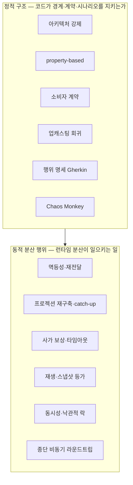
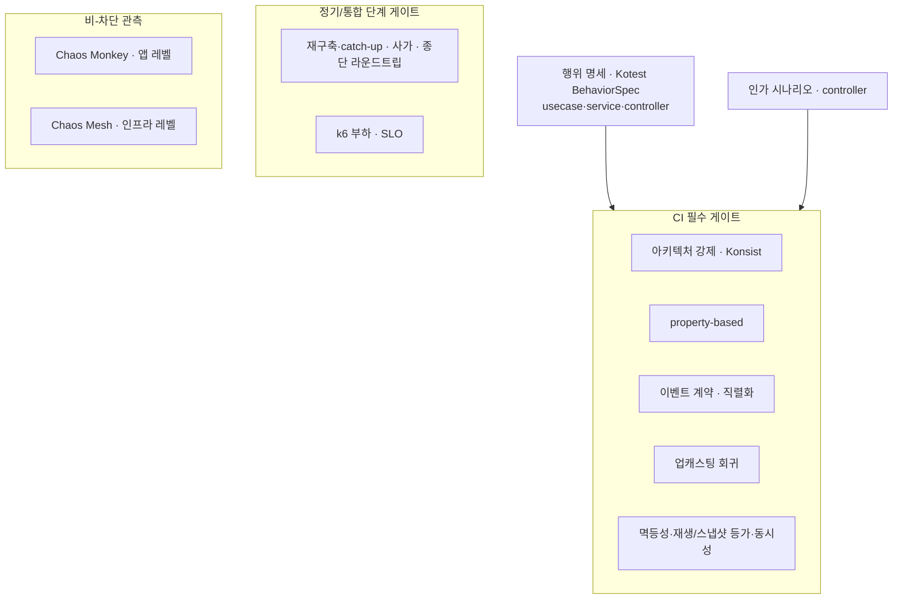

# RFC-009 — 테스트·품질 게이트

- **상태**: 🏷 합의 (2026-06-23) · 생산자·소비자 이벤트 계약 절은 [[RFC-023-event-schema-contract-management]]로 분리
- **선행**: [[RFC-001-v2-cqrs-and-event-sourcing]] · 인덱스 [[RFC-INDEX]]
- **닫으면**: [[11-environments-and-testing]] 보강 + [[14.testing-strategy]] 비준 (Proposed→Accepted)

---

## 배경 (Background)

### 시나리오: 누군가 query 모듈에서 command 애그리거트를 import 한다

**V1에서는 이런 침범이 리뷰로만 걸린다.**
읽기와 쓰기가 같은 모델·DB를 공유하니([[RFC-001-v2-cqrs-and-event-sourcing]]) "경계를 넘었다"는 개념 자체가 약하다. 테스트는 "이 코드가 도는가"를 확인할 뿐, 모듈이 서로를 어떻게 부르는지는 사람 눈으로 막는다. 그리고 V1은 대체로 동기·단일 모델이라 — 메시지가 두 번 오거나, 투영을 다시 세우거나, 사가가 중간에 실패하는 *분산 행위*가 거의 없다. 검증할 분산이 없으니 그걸 보는 테스트도 없다.

**V2에서는 테스트가 두 층을 동시에 잡아야 한다.**

1. **정적 구조** — "query 모듈은 command 모듈을 import 하지 않는다", "도메인은 JPA 애너테이션을 모른다", "command↔query는 이벤트로만 통한다" 같은 경계 규칙을 컴파일/테스트 시점에 깨뜨린다. CQRS+ES로 가면 가장 먼저 무너지는 게 모듈 경계인데, 이건 사람이 리뷰로 막을 수 있는 종류의 침범이 아니다.
2. **동적 분산 행위** — 같은 이벤트가 두 번 적용돼도 상태가 같은가, 리플레이로 다시 세운 read model이 라이브와 같은가, 사가가 중간에 실패해도 종결에 도달하는가. RFC-003·004·006·011·012가 *결정한 메커니즘*이 실제로 성립하는지는 정적 테스트로 안 보인다.

### 검증 범주의 두 갈래

| 갈래 | 무엇을 보나 | 범주 |
|------|------------|------|
| 정적 구조 | 코드가 경계·계약·시나리오를 지키는가 | 아키텍처 강제 · property-based · 소비자 계약 · 업캐스팅 회귀 · 행위 명세(Gherkin) · Chaos Monkey |
| 동적 분산 행위 | 런타임에 분산이 일으키는 행위가 결정대로인가 | 멱등성·재전달 · 재구축·catch-up · 사가 보상 · 재생/스냅샷 등가 · 동시성·낙관적 락 · 종단 라운드트립 |

---

## 맥락 (Context)

라운드1의 다섯 범주(아키텍처 강제·property-based·소비자 계약·업캐스팅 회귀·Chaos Monkey)는 정적 구조에 쏠려 있다. ES/EDA의 동적 분산 행위(멱등성·재구축·사가 보상·리플레이·동시성·종단 라운드트립)는 정적 테스트로 드러나지 않는다.

이 RFC는 정적+동적 양쪽의 도구·게이트를 배치하되, **정책은 지금 잠그고 절대 수치는 측정으로 넘긴다.** 해볼 수 있는 건 다 해본다 — k6·Chaos Monkey·Chaos Mesh 포함.

---

## Goal / Non-goal

**Goal**
- 라운드1 다섯 범주의 실현 도구와 게이트 묶음을 정한다.
- 정적 구조 너머의 동적 분산 행위 범주군을 메커니즘마다 짝지어 세운다.
- 행위 명세(Gherkin)·인가 범주를 새로 세우고 슬라이스 배치를 정한다.
- 게이트 정책(무엇을 CI 필수/정기/비-차단으로 둘지)을 정한다.

**Non-goal (이번에 하지 않음)**
- 커버리지·k6 절대 임계 숫자 확정. → 베이스라인 측정 후.
- 생산자·소비자 이벤트 스키마 계약의 깊은 결정. → [[RFC-023-event-schema-contract-management]]로 분리.
- 업캐스팅(과거 이벤트→새 코드)의 스키마 진화 결정. → [[RFC-022-event-schema-evolution]].
- localstack AWS 서비스 목록의 임의 완결.

---

## 논의 (Discussion)

### 논점 1. 아키텍처 강제를 무엇으로 거나 → [[14.testing-strategy]]

검토한 선택지:
- **ArchUnit** — JVM 표준급 성숙도. 대신 바이트코드/리플렉션 기반이라 Java 타입 세계를 본다.
- **Konsist** — Kotlin 네이티브 DSL로 소스 구조를 직접 질의. 신생이라 기능군이 얇을 수 있다.

**결론:** Konsist. 검증 대상(Kotlin 패키지·import)과 도구 언어가 일치한다. (이의 여지: 사이클 탐지 등 복잡한 규칙이 필요해지면 ArchUnit 재검토.)

### 논점 2. 생산자·소비자 이벤트 스키마 어긋남을 어떻게 잡나 → [[RFC-023-event-schema-contract-management]]

**결론:** [[RFC-023-event-schema-contract-management]]로 분리. 공유 계약 모듈(컴파일 보장) + 직렬화 테스트(wire 모양 보장)가 기본, SCC/Pact는 졸업 조건. 업캐스팅은 [[RFC-022-event-schema-evolution]].

### 논점 3. 행위 명세(Gherkin)를 어느 슬라이스에 깔고 무슨 도구로 쓰나 → [[14.testing-strategy]]

세 슬라이스에 깐다:
- **usecase(application)**: 포트를 목으로 두고 오케스트레이션 행위 검증.
- **service(domain)**: 도메인 불변식을 비즈니스 언어로 고정.
- **controller(standalone)**: standalone MockMvc로 API 계약 검증 + REST Docs 연동.

**결론:** Kotest BehaviorSpec으로 Given-When-Then 행위 명세를 3슬라이스에 깐다. property-based(무작위 입력으로 불변식)와는 보완 관계.

### 논점 4. 동적 분산 행위를 어떻게 검증하나 → [[14.testing-strategy]]

각 항목은 결정 메커니즘과 짝지어 검증한다:

| 범주 | 검증 내용 | 연계 RFC | 게이트 |
|------|----------|----------|--------|
| 멱등성·재전달 | 같은 이벤트 두 번 적용해도 상태 동일 | RFC-003·011·012 | CI 필수 |
| 재생·스냅샷 등가 | 스냅샷+이후 이벤트 = 풀 리플레이 | RFC-004 | CI 필수 |
| 동시성·낙관적 락 | 동시 append → 버전 충돌 409 | RFC-004·012 | CI 필수 |
| 재구축·catch-up | 리플레이 read model = 라이브 투영 | RFC-011 | 정기/통합 |
| 사가 보상·타임아웃 | 타임아웃→점유 해제, 실패→환불 보상, 종결 도달 | RFC-006 | 정기/통합 |
| 종단 비동기 라운드트립 | command→이벤트→프로젝션→query 끝까지 | RFC-002·012 | 정기/통합 |

**결론:** 결정적 범주(멱등성·재생 등가·동시성) = CI 필수, 무거운 통합 범주(재구축·사가·종단) = 정기/통합 단계.

### 논점 5. 인가·인증을 어떻게 검증하나 → [[14.testing-strategy]]

**결론:** controller(standalone) 행위 명세 위에 역할 기반 인가 시나리오를 얹는다. 토큰 발급·검증은 인증 서버 책임, 우리 테스트는 인가 결정에 집중.

### 논점 6. 카오스는 어느 레벨까지 하나 → [[14.testing-strategy]]

두 레벨 모두 한다:
- **앱 레벨**: Chaos Monkey for Spring Boot — 스프링 빈 레벨에서 지연·예외·메모리 압박 주입.
- **인프라 레벨**: Chaos Mesh — 쿠버네티스 네이티브·CRD 기반으로 파드 kill·네트워크 분단.

**결론:** 앱 = Chaos Monkey for Spring Boot, 인프라 = Chaos Mesh. 딥한 시나리오 설계는 인프라가 갖춰진 후.

### 논점 7. 커버리지 목표와 게이트 임계를 어떻게 정하나 → [[14.testing-strategy]]

CI 필수 게이트: 아키텍처 강제·property-based·계약·업캐스팅 회귀·동적 분산 행위 6범주.
비-차단 관측: Chaos(별도 리포팅으로 가시화).

**결론:** 게이트 정책은 지금 잠그고, 커버리지 절대 임계는 베이스라인 측정 후 ratchet(후퇴 금지)으로 점진 상향.

### 논점 8. k6 부하 테스트 → [[14.testing-strategy]]

k6로 부하 테스트를 한다.

**결론:** k6 = 정기/릴리스 전 게이트. 절대 SLO는 베이스라인 측정 후 확정.

### 논점 9. localstack로 무엇을 검증하나 → [[14.testing-strategy]]

**결론:** AWS 의존이 굳는 대로 채우는 살아있는 목록으로 둔다. S3 항목은 [[RFC-004-event-store-schema-evolution]]의 아카이브 매체 결정에 의존.

---

## 결정 요약

| # | 결정 | ADR |
|---|------|-----|
| 1 | 아키텍처 강제 도구 = **Konsist**(Kotlin 네이티브 DSL), 경계 규칙을 컴파일/테스트 시점 강제 | [[14.testing-strategy]] · [[01.cqrs-command-query-module-split]] |
| 2 | 생산자·소비자 이벤트 스키마 계약은 **[[RFC-023-event-schema-contract-management]]로 분리**(공유 계약 모듈+직렬화 테스트 기본, SCC/Pact 졸업) | [[RFC-023-event-schema-contract-management]] |
| 3 | 행위 명세 = **Kotest BehaviorSpec**(Gherkin 구조), usecase·service·controller(standalone) 3슬라이스 | [[14.testing-strategy]] |
| 4 | 동적 분산 행위 6범주(멱등성·재구축·사가 보상·재생/스냅샷 등가·동시성·종단)를 메커니즘별 검증, **결정적=CI 필수 / 무거운 통합=정기 단계** | [[14.testing-strategy]] |
| 5 | 인가 = controller(standalone) 행위 명세 위 **역할 기반 인가 시나리오**, 토큰 발급·검증은 인증 서버 책임 | [[14.testing-strategy]] |
| 6 | 카오스 = 앱 레벨 **Chaos Monkey for Spring Boot** + 인프라 레벨 **Chaos Mesh** | [[14.testing-strategy]] · [[11-environments-and-testing]] |
| 7 | 게이트 정책 = 아키텍처 강제·property-based·계약·업캐스팅 회귀는 **CI 필수**, Chaos Monkey는 비-차단 관측. 커버리지 임계는 **측정 후 ratchet** | [[14.testing-strategy]] |
| 8 | k6 = **정기/릴리스 전 게이트**, 절대 SLO는 베이스라인 측정 후 | [[14.testing-strategy]] |
| 9 | localstack 목록 = 실제 의존을 따라 채우는 **살아있는 목록**, 콜드 S3 항목은 [[RFC-004-event-store-schema-evolution]] 매체 결정에 의존 | [[14.testing-strategy]] · [[RFC-004-event-store-schema-evolution]] |

상세 설계는 [[14.testing-strategy]] · [[11-environments-and-testing]] 참조.

---

## 결과 (목표 테스트 전략 요약)

- **정적 구조**: 아키텍처 강제(Konsist)·property-based·계약(RFC-023)·업캐스팅 회귀 → CI 필수.
- **행위 명세**: Kotest BehaviorSpec, 3슬라이스 + 인가 시나리오 → CI 필수.
- **동적 분산 행위**: 결정적(멱등성·재생 등가·동시성) = CI 필수, 무거운 통합(재구축·사가·종단) = 정기 단계.
- **부하**: k6 = 정기/릴리스 전 게이트.
- **카오스**: Chaos Monkey(앱) + Chaos Mesh(인프라), 비-차단 관측.
- **수치**: 커버리지·SLO 절대값은 측정 후 ratchet.

상세 범주·게이트 배치·도구 구성은 [[14.testing-strategy]] · [[11-environments-and-testing]] 참조.

---

## 관련 문서

- 인덱스: [[RFC-INDEX]]
- ADR/설계: [[14.testing-strategy]] · [[11-environments-and-testing]] · [[01.cqrs-command-query-module-split]] · [[01-module-structure]]
- 후속/분리: [[RFC-023-event-schema-contract-management]] · [[RFC-022-event-schema-evolution]]
- 연계: [[RFC-002-read-model-consistency]] · [[RFC-003-messaging-delivery]] · [[RFC-004-event-store-schema-evolution]] · [[RFC-006-saga-process-manager]] · [[RFC-011-projection-rebuild-catchup]] · [[RFC-012-command-query-api-contract]] · [[RFC-013-data-migration-genesis-events]]
- 계승: [[RFC-001-v2-cqrs-and-event-sourcing]]
