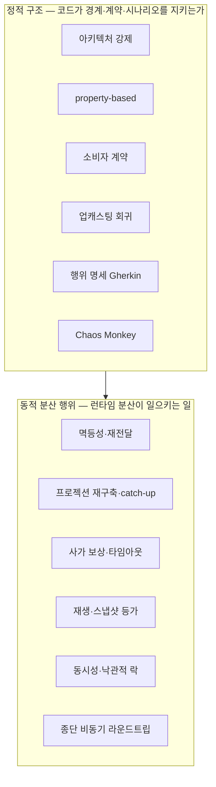
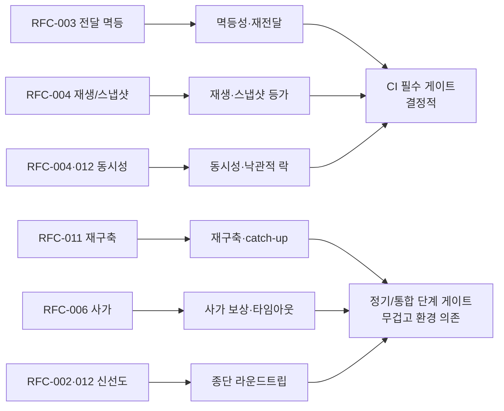
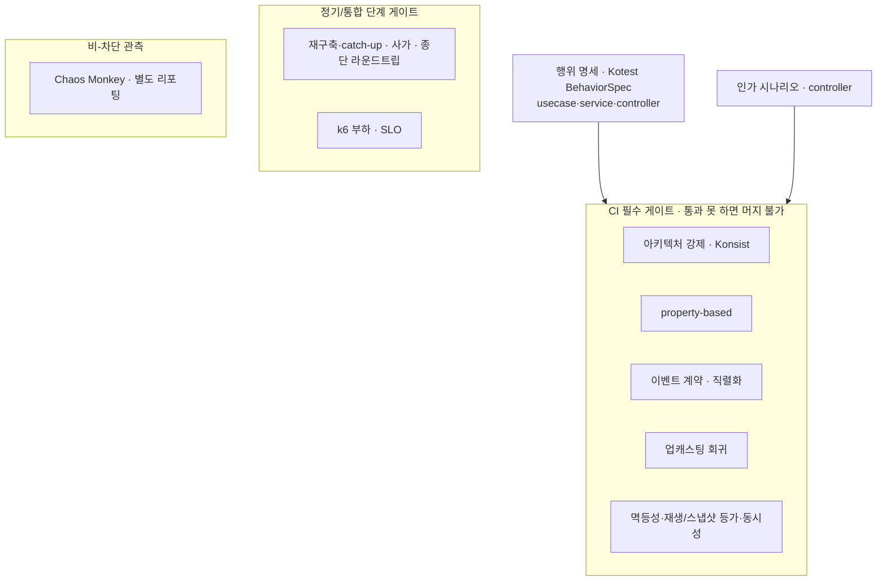

# RFC-009 — 테스트·품질 게이트

- **상태**: 🏷 합의 (2026-06-23) · 생산자·소비자 이벤트 계약 절은 [[RFC-024-event-schema-contract-management]]로 분리
- **선행**: [[RFC-001-v2-cqrs-and-event-sourcing]] · 인덱스 [[RFC-INDEX]]
- **닫으면**: [[11-environments-and-testing]] 보강 + [[14.testing-strategy]] 비준 (Proposed→Accepted)

---

## 배경 (Background)

### 시나리오: 누군가 query 모듈에서 command 애그리거트를 import 한다

**V1에서는 이런 침범이 리뷰로만 걸린다.**
읽기와 쓰기가 같은 모델·DB를 공유하니([[RFC-001-v2-cqrs-and-event-sourcing]]) "경계를 넘었다"는 개념 자체가 약하다. 테스트는 "이 코드가 도는가"를 확인할 뿐, 모듈이 서로를 어떻게 부르는지는 사람 눈으로 막는다. 그리고 V1은 대체로 동기·단일 모델이라 — 메시지가 두 번 오거나, 투영을 다시 세우거나, 사가가 중간에 실패하는 *분산 행위*가 거의 없다. 검증할 분산이 없으니 그걸 보는 테스트도 없다.

**V2에서는 테스트가 두 층을 동시에 잡아야 한다.**

1. **정적 구조** — "query 모듈은 command 모듈을 import 하지 않는다", "도메인은 JPA 애너테이션을 모른다", "command↔query는 이벤트로만 통한다" 같은 경계 규칙을 컴파일/테스트 시점에 깨뜨린다. CQRS+ES로 가면 가장 먼저 무너지는 게 모듈 경계인데, 이건 사람이 리뷰로 막을 수 있는 종류의 침범이 아니다.
2. **동적 분산 행위** — 같은 이벤트가 두 번 적용돼도 상태가 같은가, 리플레이로 다시 세운 read model이 라이브와 같은가, 사가가 중간에 실패해도 종결에 도달하는가. RFC-003·004·006·011·012가 *결정한 메커니즘*이 실제로 성립하는지는 정적 테스트로 안 보인다.

### 검증 범주의 두 갈래

| 갈래 | 무엇을 보나 | 범주 |
|------|------------|------|
| 정적 구조 | 코드가 경계·계약·시나리오를 지키는가 | 아키텍처 강제 · property-based · 소비자 계약 · 업캐스팅 회귀 · 행위 명세(Gherkin) · Chaos Monkey |
| 동적 분산 행위 | 런타임에 분산이 일으키는 행위가 결정대로인가 | 멱등성·재전달 · 재구축·catch-up · 사가 보상 · 재생/스냅샷 등가 · 동시성·낙관적 락 · 종단 라운드트립 |

---

## 맥락 (Context)

라운드1에서 *어떤 종류의 테스트를 쌓을지*는 이미 다섯 범주로 정리됐다. (1) 아키텍처 강제 — query↛command, 도메인↛JPA, command↔query는 이벤트로만 통하게 하는 경계 규칙을 컴파일/테스트 시점에 깨뜨리는 것. (2) property-based — Fixture Monkey로 도메인 불변식을 무작위 입력에 노출. (3) 소비자 계약 — 이벤트 스키마 생산자와 컨슈머 사이의 합의. (4) 업캐스팅 회귀 — 구버전 이벤트가 신버전 코드로 항상 복원되는지. (5) Chaos Monkey — 장애 주입.

- **다섯 범주는 정적 구조에 쏠려 있다.** 코드가 경계·계약·시나리오를 지키는가는 보지만, ES/EDA 시스템이 실제로 깨지는 *동적 분산 행위*는 거의 못 본다. → 메시지가 두 번 오고, 투영을 다시 세우고, 사가가 중간에 실패하고, 이벤트를 리플레이하고, 같은 애그리거트에 동시 쓰기가 붙는 — RFC-003·004·005·006·007·011·012·013에서 결정한 메커니즘이 진짜 성립하는지는 정적 테스트로 드러나지 않는다.
- **자산 — 슬라이스 테스트 전략이 이미 서 있다.** CLAUDE.md의 usecase·service·controller(standalone) 슬라이스 규약이 있다. → 여기에 행위를 비즈니스 언어로 고정하면 테스트가 곧 살아있는 명세가 되는 범주를 하나 더 세울 수 있다(행위 명세·Gherkin).
- **정책과 수치가 섞여 있다.** "어느 범주를 게이트로 둘 것인가"는 추론으로 정할 수 있지만, "라인 커버리지 X%"·"p99 < Yms" 같은 절대 숫자는 베이스라인을 측정하기 전엔 근거가 없다. → 책상에서 정할 정책과 측정으로 미룰 수치를 가려야 한다.

핵심 긴장 — **라운드1의 다섯 범주를 각각 어떤 도구로 실현하고 어디까지를 CI 게이트로 묶을지, 그리고 정적 구조 너머의 동적 분산 행위·행위 명세·인가 범주를 새로 세워 그 도구·범위·게이트를 배치하되, 정책은 지금 잠그고 절대 수치는 측정으로 넘긴다.** 이 RFC가 그 허브이고, 각 범주는 [[14.testing-strategy]] 아래 개별 design_doc으로 펼쳐 나갈 씨앗이다.

---

## Goal / Non-goal

**Goal**
- 라운드1 다섯 범주의 실현 도구와 게이트 묶음을 정한다.
- 정적 구조 너머의 동적 분산 행위 범주군을 메커니즘마다 짝지어 세운다.
- 행위 명세(Gherkin)·인가 범주를 새로 세우고 슬라이스 배치를 정한다.
- 게이트 정책(무엇을 CI 필수/정기/비-차단으로 둘지)을 정한다.

**Non-goal (이번에 하지 않음)**
- 커버리지·k6 절대 임계 숫자 확정. → 베이스라인 측정 후.
- 생산자·소비자 이벤트 스키마 계약의 깊은 결정. → [[RFC-024-event-schema-contract-management]]로 분리.
- 업캐스팅(과거 이벤트→새 코드)의 스키마 진화 결정. → [[RFC-023-event-schema-evolution]].
- 인프라 카오스 도구 도입(파드 kill·네트워크 분단).
- localstack AWS 서비스 목록의 임의 완결.

---

## 논의 (Discussion)

### 논점 1. 아키텍처 강제를 무엇으로 거나 → [[14.testing-strategy]]

**맥락에서 나온 질문.** 경계 규칙이 1순위인 이유는 CQRS+ES로 가면서 가장 먼저 무너지는 게 모듈 경계이기 때문이다(맥락 1번 범주). 사람이 리뷰로 막을 수 있는 침범이 아니니, 무슨 도구로 컴파일/테스트 시점에 강제하나?

검토한 선택지:
- **ArchUnit** — JVM 진영의 표준에 가깝고 성숙도·레퍼런스가 압도적이다(안전한 선택). 대신 바이트코드/리플렉션 기반이라 본질적으로 Java의 타입 세계를 본다.
- **Konsist** — Kotlin 네이티브로 코틀린 심볼·소스 구조를 DSL로 직접 질의한다(패키지·클래스·함수·import를 코틀린 코드로 순회·단언). 대신 비교적 신생이라 검증된 기능군이 얇을 수 있다.

**내 의견(AI):** Konsist가 유력하다. 우리가 강제하려는 규칙은 "query 모듈은 command 모듈을 import 하지 않는다", "도메인은 JPA 애너테이션을 모른다" 같은 **Kotlin 소스 구조에 붙는** 규칙이고, [[01.cqrs-command-query-module-split]]의 분리와 [[01-module-structure]]의 레이아웃이 코틀린 패키지 단위로 그어져 있다. 검증 대상과 검증 도구의 언어가 일치하는 쪽이 규칙을 더 자연스럽게 표현한다. [[14.testing-strategy]]가 이 경계를 1순위로 둔 만큼 규칙 표현력이 성숙도보다 우선한다.

**네 결정:** 아키텍처 강제 도구 = Konsist. 〔근거 확인/보강 필요〕

**결론:** 경계 규칙은 Konsist DSL로 강제한다. (이의 여지: ArchUnit의 생태계 두께를 포기하는 비용 — Konsist는 신생이라 복잡한 의존성 사이클 탐지 등에서 약할 수 있어, 경계 규칙이 단순 import 금지를 넘어 "사이클 없음" 류로 커지면 재검토. 규칙 셋의 구체·예외 화이트리스트는 Design.)

### 논점 2. 생산자·소비자 이벤트 스키마 어긋남을 어떻게 잡나 → [[RFC-024-event-schema-contract-management]]

**맥락에서 나온 질문.** 라운드1의 3번 범주(소비자 계약). 생산자가 이벤트 모양을 바꾸면(필드 rename·삭제) 빌드는 통과하고 런타임에 프로젝터가 깨진다. 그 어긋남을 무엇으로 막나?

**내 의견(AI):** 이 결정은 이 RFC에서 다루기엔 결이 따로 서서 [[RFC-024-event-schema-contract-management]]로 분리한다(topical, not parked). 그쪽 입장 요약 — **얇은 통합 이벤트 공유 계약 모듈(컴파일 보장) + 직렬화 테스트(wire 모양 보장)를 기본**으로 두고, SCC/Pact는 외부 소비자·독립 배포 스큐가 실제 문제로 올라올 때 졸업한다. (업캐스팅 — 과거 이벤트를 새 코드로 — 은 또 다른 축이라 [[RFC-023-event-schema-evolution]].)

**네 결정:** 이벤트 스키마 계약 일체를 [[RFC-024-event-schema-contract-management]]로 분리. 〔근거 확인/보강 필요〕

**결론:** 생산자·소비자 계약은 본 RFC 범위 밖, [[RFC-024-event-schema-contract-management]]가 닫는다. (이의 여지: 업캐스팅 축은 [[RFC-023-event-schema-evolution]].)

### 논점 3. 행위 명세(Gherkin)를 어느 슬라이스에 깔고 무슨 도구로 쓰나 → [[14.testing-strategy]]

**맥락에서 나온 질문.** 테스트가 "이 코드가 도는가"를 넘어 "이 동작이 무엇인가"를 비즈니스 언어로 적으면 곧 살아있는 명세가 된다(맥락의 슬라이스 자산). Given-When-Then(Gherkin)이 그 도구다 — 어디에 깔고, 무엇으로 쓰나?

세 슬라이스에 깐다(CLAUDE.md 슬라이스 전략과 같은 결):
- **usecase(application)**: 출력 포트를 목으로 두고 "주어진 커맨드·포트 상태에서 유스케이스를 실행하면 어떤 포트 호출·결과가 나오는가" — 오케스트레이션 행위 검증.
- **service(domain)**: "주어진 도메인 상태에서 도메인 서비스를 호출하면 어떤 불변식·결과가 성립하는가" — 순수 도메인 로직을 비즈니스 언어로 고정.
- **controller(standalone)**: 전체 Spring 컨텍스트 없이 standalone MockMvc로 "주어진 HTTP 요청에 어떤 상태·바디가 나오는가" — [[RFC-012-command-query-api-contract]]의 API 계약(202·에러 분류 등)이 여기서 행위로 검증되고 REST Docs와 엮인다.

도구는 두 갈래:
- **진짜 Gherkin `.feature` + Cucumber** — 비개발자도 읽는 명세. 대신 글루 코드 부담.
- **Kotest `BehaviorSpec`** — Given/When/Then 구조를 코틀린으로. 별도 feature 파일·글루 없음.

**내 의견(AI):** 스택이 이미 Kotest인 만큼 **Kotest BehaviorSpec을 기본**으로 본다 — Gherkin 구조의 가독성은 얻으면서 `.feature` 글루 machinery는 피한다(앞 계약 절과 같은 overspec 회피 결). 비개발자가 읽는 `.feature` 명세가 실제로 필요해지면 그때 Cucumber를 얹는다.

**네 결정:** 행위 명세 기본 = Kotest BehaviorSpec, usecase·service·controller(standalone) 3슬라이스에 배치. 〔근거 확인/보강 필요〕

**결론:** Given-When-Then 행위 명세를 Kotest BehaviorSpec으로, 세 슬라이스에 깐다. (이의 여지: property-based와 역할이 겹쳐 보이나 층이 다르다 — property-based는 *무작위 입력*으로 불변식을 흔들고, 행위 명세는 *명명된 시나리오*로 동작을 고정하는 보완 관계. controller standalone 명세와 RFC-013 계약·REST Docs의 책임 경계, `.feature` 필요 시 Cucumber 졸업은 Design.)

### 논점 4. 동적 분산 행위를 어떻게 검증하고 어디에 게이트를 거나 → [[14.testing-strategy]]

**맥락에서 나온 질문.** 정적 구조 범주는 코드의 구조를 잡는데, 런타임에 분산이 일으키는 행위는 거의 못 본다(맥락의 첫 한계). 다른 RFC가 결정한 메커니즘마다 "그 결정이 실제로 도는지"를 어떻게 짝짓나?

각 항목은 결정 메커니즘과 짝지어 검증한다:
- **멱등성·재전달**: 같은 이벤트·메시지를 두 번 적용해도 상태가 같다 — 전달 멱등([[RFC-003-messaging-delivery]] 컨슈머), 프로젝터 멱등([[RFC-011-projection-rebuild-catchup]] upsert+버전 가드), 요청 멱등([[RFC-012-command-query-api-contract]])을 각각 재전달 시나리오로 흔든다. at-least-once를 택한 이상 선택이 아니라 필수.
- **프로젝션 재구축·catch-up**: 이벤트 스토어를 리플레이해 세운 read model이 라이브 투영과 같은가, blue-green 스왑이 원자적인가, catch-up이 readiness까지 수렴하는가([[RFC-011-projection-rebuild-catchup]]).
- **사가 보상·타임아웃**: 타임아웃이 점유 해제(`SeatReleased`)를 일으키는가, 확정 실패가 환불 보상(`PaymentRefunded`)으로 되감기는가, 부분 보상 후에도 종결에 도달하는가([[RFC-006-saga-process-manager]]). 보상 경로는 가장 안 짜이고 가장 늦게 터지는 곳이라 명시적으로 테스트.
- **이벤트 재생·스냅샷 등가**: 스냅샷 + 이후 이벤트로 재수화한 상태가 처음부터 풀 리플레이한 상태와 같은가([[RFC-004-event-store-schema-evolution]]). 업캐스팅 회귀와는 다른 축 — 이쪽은 리플레이 정확성.
- **동시성·낙관적 락**: 같은 애그리거트에 동시 append가 붙으면 기대 버전 충돌이 409로 정확히 걸러지는가([[RFC-004-event-store-schema-evolution]]·[[RFC-012-command-query-api-contract]]).
- **종단 비동기 라운드트립**: command를 받아 이벤트를 적고 프로젝션을 거쳐 query에 나타나기까지 끝까지 흐르는가, 그 사이 read-your-writes 신선도가 규약대로인가([[RFC-002-read-model-consistency]]·[[RFC-012-command-query-api-contract]]). Testcontainers + Kafka 통합 티어 — 슬라이스 테스트가 못 보는 이음매를 잡는다.

**내 의견(AI):** 게이트 성격이 갈린다 — 멱등성·재생 등가·동시성은 결정적이라 CI 필수 게이트로, 재구축·종단·사가는 무겁고 환경 의존이 커서 정기/통합 단계 게이트로 두는 게 합리적이다. [[RFC-013-data-migration-genesis-events]]의 **V1↔V2 등가성**(건수·핵심 필드·재구성 상태 일치)은 그쪽이 컷오버 게이트로 소유하되, 회귀로 묶이는 자리는 이 전략 안이다.

**네 결정:** 6개 동적 범주를 메커니즘별로 세우고, 결정적=CI 필수 / 무거운 통합=정기 단계로 게이트 배치, V1↔V2 등가성은 회귀 편입. 〔근거 확인/보강 필요〕

**결론:** 멱등성·재구축·사가 보상·재생/스냅샷 등가·동시성·종단 라운드트립을 각 메커니즘과 짝지어 검증하고 게이트를 성격별로 배치한다. (이의 여지: 이 범주군은 스토어·Kafka 환경을 띄워야 해 빌드가 무거워진다 — 경량화 모킹 vs 실제 환경(Testcontainers+Kafka)의 경계, 구체 게이트 배치는 Design.)

### 논점 5. 인가·인증을 어떻게 검증하나 → [[14.testing-strategy]]

**맥락에서 나온 질문.** [[RFC-012-command-query-api-contract]]가 게이트웨이·인증 서버를 전제로 깔지만, 역할 기반 인가(USER·SELLER·ADMIN)가 command/query 경로마다 옳게 걸리는지는 별도 범주로 봐야 한다.

**내 의견(AI):** 권한 없는 호출이 거부되고 권한 경계가 컨텍스트마다 일관된지를, controller(standalone) 행위 명세 위에 인가 시나리오로 얹는다. 토큰 발급·검증 자체는 인증 서버 책임이므로 우리 테스트는 *인가 결정*에 집중한다.

**네 결정:** 인가는 controller(standalone) 행위 명세 위 인가 시나리오로 검증, 토큰 발급·검증은 인증 서버 책임. 〔근거 확인/보강 필요〕

**결론:** 역할 기반 인가를 controller 슬라이스 행위 명세로 검증한다. (이의 여지: 인가 규칙이 도메인 깊숙이 들어가면 controller 슬라이스만으로 부족할 수 있어 usecase 슬라이스에도 인가 시나리오가 필요한지 Design.)

### 논점 6. 카오스는 어느 레벨까지 자동화하나 → [[14.testing-strategy]]

**맥락에서 나온 질문.** 라운드1의 5번 범주(Chaos Monkey). 앱 레벨은 굳었고, 쟁점은 그 위 인프라(파드 kill·네트워크 분단) 레벨이다.

검토한 선택지(인프라 레벨):
- **수동 kill** — 도구 없음. 대신 재현·자동화 불가.
- **Chaos Mesh** — 쿠버네티스 네이티브·CRD 기반.
- **Litmus** — 쿠버네티스 카오스 프레임워크.

**내 의견(AI):** 앱 레벨은 **Chaos Monkey for Spring Boot로 확정** — 스프링 빈 레벨에서 지연·예외·메모리 압박을 주입하는 데 더 나은 대안이 없다. 인프라 레벨은 "지금 도입하지 않는다, 단 트리거를 명시한다." 인프라 카오스는 쿠버네티스 위에서 의미가 큰데, 우리가 그 레벨의 회복탄력성을 *시험할 대상*(다중 파드·네트워크 토폴로지)을 아직 갖고 있지 않다. 도구를 미리 들이는 건 검증할 게 없는 검증이다. 트리거는 [[11-environments-and-testing]]의 T-05 확장 — 인프라 레벨 회복탄력성이 실제 운영 리스크로 올라오는 시점 — 으로 잡고, 그때 Chaos Mesh를 1순위 후보로 둔다.

**네 결정:** 앱 레벨 = Chaos Monkey for Spring Boot 확정, 인프라 카오스는 T-05 확장 트리거까지 보류(도달 시 Chaos Mesh 1순위). 〔근거 확인/보강 필요〕

**결론:** 카오스는 앱 레벨(Chaos Monkey)만 지금, 인프라 레벨은 T-05 트리거에 위임한다. (이의 여지: "필요해지면 그때"는 카오스 엔지니어링 정신과 어긋난다 — 장애는 준비됐을 때 오지 않는다. 다만 앱 레벨이 당장의 표면을 덮으므로 인프라 연기는 감당 가능한 빚.)

### 논점 7. 커버리지 목표와 게이트 임계를 어떻게 정하나 → [[14.testing-strategy]]

**맥락에서 나온 질문.** 정책과 수치가 섞여 있다(맥락 3번 한계). 다섯 범주의 커버리지 목표와 그중 무엇을 CI 필수 게이트로 묶을지를 가른다.

**내 의견(AI):** *어느 범주를 게이트로 둘 것인가*라는 정책은 지금 추론으로 정한다 — 아키텍처 강제는 무조건 필수 게이트(통과 못 하면 머지 불가), property-based·계약·업캐스팅 회귀도 게이트, Chaos Monkey는 게이트가 아니라 비-차단 관측으로(장애 주입은 본질적으로 비결정적이라 머지를 막는 기준으로 부적합). 반면 "라인 커버리지 X%" 같은 절대 숫자는 지금 정하면 근거 없는 숫자다 — 베이스라인 측정 전에 임계를 박으면 늘 너무 느슨하거나 너무 빡빡하다. 그래서 임계는 측정에서 검증하고, 후퇴 금지(ratchet) 방식으로 점진 상향한다.

**네 결정:** 게이트 정책 = 아키텍처 강제·property-based·계약·업캐스팅 회귀는 CI 필수, Chaos Monkey는 비-차단 관측. 절대 임계는 측정 후 ratchet. 〔근거 확인/보강 필요〕

**결론:** 무엇을 게이트로 둘지는 지금, 임계 숫자는 베이스라인 측정 후 ratchet으로. (이의 여지: 비-차단 관측 게이트는 시간이 지나면 아무도 안 본다 — Chaos Monkey 결과를 별도 리포팅 경로로 가시화하지 않으면 죽은 테스트가 된다.)

### 논점 8. k6 SLO와 부하 게이트는 어디에 거나 → [[14.testing-strategy]]

**맥락에서 나온 질문.** 부하 테스트(k6)도 논점 7과 같은 모양 — 정책은 지금, 절대 SLO는 측정 후.

**내 의견(AI):** *부하 테스트를 CI 게이트로 둘 것인가*는 지금 입장을 낼 수 있다 — 매 PR마다 부하 테스트를 돌려 머지를 막는 건 비용·시간상 비현실적이므로, k6는 CI 차단 게이트가 아니라 정기/릴리스 전 게이트로 둔다. 절대 SLO(p99 응답시간, 처리량 하한)는 지금 숫자로 박을 근거가 없어 베이스라인 측정 후 정한다.

**네 결정:** k6 = 정기/릴리스 전 게이트(CI 차단 아님), 절대 SLO는 베이스라인 측정 후. 〔근거 확인/보강 필요〕

**결론:** k6는 정기/릴리스 전 게이트, SLO 숫자는 측정으로. (이의 여지: 릴리스 전에만 도는 부하 게이트는 회귀를 늦게 잡는다 — 성능 회귀가 잦은 경로가 드러나면 그 경로만 경량 부하 스모크로 CI에 올리는 절충이 필요할 수 있고, 이것도 측정으로 판단.)

### 논점 9. localstack로 무엇을 검증하나 → [[14.testing-strategy]]

**맥락에서 나온 질문.** localstack로 흉내 낼 AWS 서비스 목록은, 우리가 실제로 어떤 AWS 의존을 갖는지가 확정돼야 닫힌다.

**내 의견(AI):** 컨텍스트 전환 작업이 진행되며 실제 의존(예: 메시징·시크릿·오브젝트 스토리지)이 드러나야 목록이 완결된다. 그래서 지금 임의로 나열하기보다 의존이 굳는 대로 채우는 살아있는 목록으로 둔다. 특히 콜드 스토리지 S3 검증을 넣을지는 우리가 단독으로 못 정한다 — [[RFC-004-event-store-schema-evolution]]가 아카이브 매체를 아카이브 테이블로 갈지 오브젝트 스토리지(S3)로 갈지 결정해야 한다. 테이블이면 localstack S3는 빠지고, S3면 들어온다.

**네 결정:** localstack 서비스 목록은 컨텍스트 전환에서 드러나는 실제 의존을 따라 채우는 살아있는 목록, 콜드 S3 항목은 [[RFC-004-event-store-schema-evolution]] 매체 결정에 의존. 〔근거 확인/보강 필요〕

**결론:** localstack 목록은 의존이 굳는 대로 채우고, S3 갈래는 RFC-004 산물로 닫는다. (이의 여지: 의존 RFC를 기다리는 동안 localstack 검증이 무기한 미뤄질 수 있다 — S3 외의 확정된 의존은 먼저 목록화해 검증을 시작하는 게 낫다.)

---

## 결정 요약

| # | 결정 | ADR |
|---|------|-----|
| 1 | 아키텍처 강제 도구 = **Konsist**(Kotlin 네이티브 DSL), 경계 규칙을 컴파일/테스트 시점 강제 | [[14.testing-strategy]] · [[01.cqrs-command-query-module-split]] |
| 2 | 생산자·소비자 이벤트 스키마 계약은 **[[RFC-024-event-schema-contract-management]]로 분리**(공유 계약 모듈+직렬화 테스트 기본, SCC/Pact 졸업) | [[RFC-024-event-schema-contract-management]] |
| 3 | 행위 명세 = **Kotest BehaviorSpec**(Gherkin 구조), usecase·service·controller(standalone) 3슬라이스 | [[14.testing-strategy]] |
| 4 | 동적 분산 행위 6범주(멱등성·재구축·사가 보상·재생/스냅샷 등가·동시성·종단)를 메커니즘별 검증, **결정적=CI 필수 / 무거운 통합=정기 단계** | [[14.testing-strategy]] |
| 5 | 인가 = controller(standalone) 행위 명세 위 **역할 기반 인가 시나리오**, 토큰 발급·검증은 인증 서버 책임 | [[14.testing-strategy]] |
| 6 | 앱 레벨 카오스 = **Chaos Monkey for Spring Boot 확정**, 인프라 카오스는 T-05 확장 트리거까지 보류(Chaos Mesh 1순위) | [[14.testing-strategy]] · [[11-environments-and-testing]] |
| 7 | 게이트 정책 = 아키텍처 강제·property-based·계약·업캐스팅 회귀는 **CI 필수**, Chaos Monkey는 비-차단 관측. 커버리지 임계는 **측정 후 ratchet** | [[14.testing-strategy]] |
| 8 | k6 = **정기/릴리스 전 게이트**(CI 차단 아님), 절대 SLO는 베이스라인 측정 후 | [[14.testing-strategy]] |
| 9 | localstack 목록 = 실제 의존을 따라 채우는 **살아있는 목록**, 콜드 S3 항목은 [[RFC-004-event-store-schema-evolution]] 매체 결정에 의존 | [[14.testing-strategy]] · [[RFC-004-event-store-schema-evolution]] |

상세 설계는 [[14.testing-strategy]] · [[11-environments-and-testing]] 참조.

---

## 결과 (목표 테스트 전략 요약)

- **정적 구조**: 아키텍처 강제(Konsist)·property-based·계약(RFC-024)·업캐스팅 회귀를 CI 필수 게이트로.
- **행위 명세**: Kotest BehaviorSpec으로 usecase·service·controller(standalone) 슬라이스에 살아있는 명세를, 인가 시나리오를 controller 위에.
- **동적 분산 행위**: 결정적 범주(멱등성·재생/스냅샷 등가·동시성)는 CI 필수, 무거운 통합 범주(재구축·사가·종단)는 정기 단계.
- **카오스/부하**: 앱 레벨 Chaos Monkey는 비-차단 관측(별도 리포팅), k6는 정기/릴리스 전 게이트.
- **수치**: 커버리지·SLO 절대값은 측정 후 ratchet, localstack 목록은 의존이 굳는 대로.

상세 범주·게이트 배치·도구 구성은 [[14.testing-strategy]] · [[11-environments-and-testing]] 참조.

---

## 관련 문서

- 인덱스: [[RFC-INDEX]]
- ADR/설계: [[14.testing-strategy]] · [[11-environments-and-testing]] · [[01.cqrs-command-query-module-split]] · [[01-module-structure]]
- 후속/분리: [[RFC-024-event-schema-contract-management]] · [[RFC-023-event-schema-evolution]]
- 연계: [[RFC-002-read-model-consistency]] · [[RFC-003-messaging-delivery]] · [[RFC-004-event-store-schema-evolution]] · [[RFC-006-saga-process-manager]] · [[RFC-011-projection-rebuild-catchup]] · [[RFC-012-command-query-api-contract]] · [[RFC-013-data-migration-genesis-events]]
- 계승: [[RFC-001-v2-cqrs-and-event-sourcing]]
