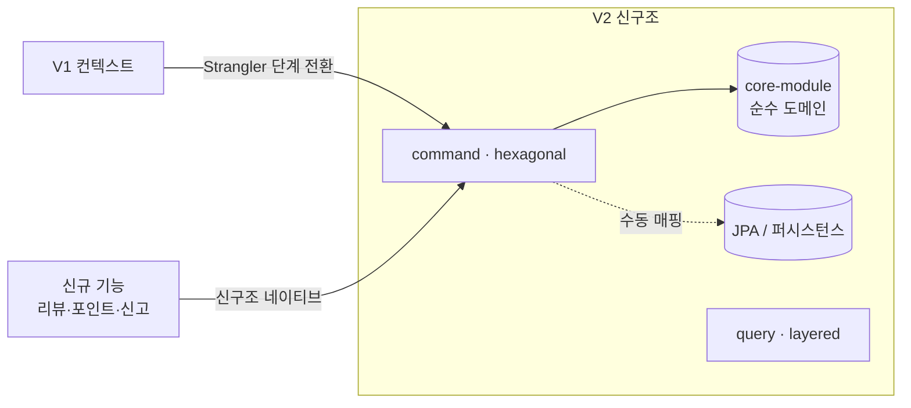
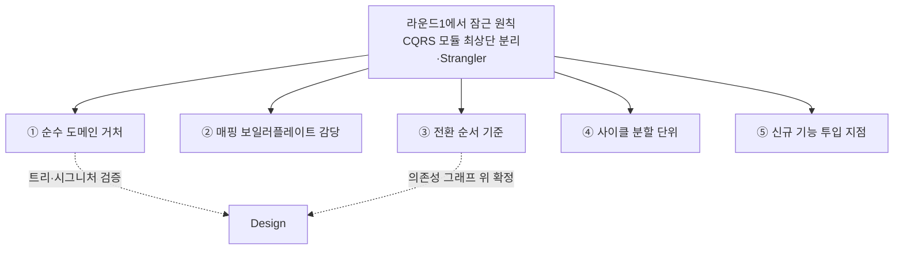
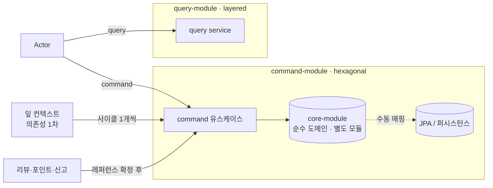

# RFC-010 — 모듈 구조·마이그레이션 확정

- **상태**: 🏷 합의 (2026-06-23) · 순수 도메인 거처 (b) 현행 `core-module` 유지로 확정
- **선행**: [[RFC-001-v2-cqrs-and-event-sourcing]] · 인덱스 [[RFC-INDEX]]
- **닫으면**: [[01-module-structure]]·[[04-migration]] 보강 + [[06.strangler-migration]]·[[07.command-domain-jpa-separation]] 비준

---

## 배경 (Background)

### 시나리오: 한 컨텍스트가 V1에서 V2 신구조로 옮겨간다

**V1에서는 이렇게 생겼다.**
순수 도메인은 의존성 없는 별도 `core-module`에 살고, JPA 엔티티는 어댑터/퍼시스턴스 레이어에 따로 있다. 둘 사이는 컨텍스트마다 손으로 쓴 매핑 함수가 잇는다 — 도메인↔JPA를 섞지 않는다는 원칙이 이미 서 있고, 그 대가로 변환 코드가 경계 안쪽에 명시적으로 남아 있다. 읽기와 쓰기는 같은 모델·DB를 공유한다.

**V2 신구조로 옮기면 이렇게 흐른다.**

1. **CQRS를 모듈 최상단에서 가른다** — top-level이 `command`/`query`로 갈린다. command 쪽은 hexagonal, query 쪽은 layered.
2. **순수 도메인은 그대로 `core-module`에 둔다** — command 쪽 hexagonal은 의존성 없는 별도 `core-module`을 그대로 잇는다. "도메인은 인프라를 모른다"가 빌드 차원의 컴파일 의존성으로 강제된다.
3. **도메인↔JPA는 수동 매핑으로 잇는다** — 컨텍스트별로 손으로 쓴 매핑 함수가 경계 안쪽에 명시적으로 남는다. 코드 생성 도구도, 공통 매퍼 추상도 쓰지 않는다.
4. **빅뱅이 아니라 Strangler로 한 컨텍스트씩 옮긴다** — 신구조와 구구조가 공존하는 기간을 두고, 컨텍스트 단위로 신구조로 이행한다.
5. **첫 컨텍스트가 레퍼런스가 된다** — 첫 전환에서 매핑 규약·검증 규칙·전환 절차를 함께 굳히고, 이후 컨텍스트는 그 레퍼런스를 복제한다.
6. **신규 기능은 처음부터 신구조 네이티브로** — 리뷰·포인트·신고는 Strangler 전환 대상이 아니라 별도 command 컨텍스트로, 레퍼런스 확정 이후 투입한다.

### 이 RFC가 닫는 것 / 넘기는 것

| 결정 거리 | 라운드1이 준 것 | 이 RFC가 닫는 것 | Design/타 RFC로 |
|-----------|----------------|------------------|------------------|
| 순수 도메인 거처 | 도메인↔JPA 비혼합 원칙 | 거처 = 별도 `core-module`(b) | 디렉터리 트리 |
| 매핑 보일러플레이트 | 분리의 대가로 변환 코드 발생 | 엄격한 수동 매핑 유지 | 국소 컨벤션 형태 |
| 전환 순서 | "초안 — 의존성 기반" | 의존성 1차·위험/학습 결선 | 그래프 위 1~5단계 확정 |
| 사이클 분할 | 사이클은 설계까지 | 컨텍스트 1개=사이클 1개 | 얽힌 묶음 예외 |
| 신규 기능 | "전환된 패턴 위에 추가" | 별도 컨텍스트·레퍼런스 이후 | 각 도메인 상세 |
| **물리 배포 분리** | — | (범위 밖) | [[RFC-007-deployment-infra-ops]] |

---

## 맥락 (Context)

라운드1에서 *원칙*은 이미 잠갔다. CQRS를 모듈 최상단에서 가른다 — command 쪽은 hexagonal, query 쪽은 layered. 그리고 빅뱅 재작성이 아니라 Strangler 패턴으로 컨텍스트를 하나씩 신구조로 옮긴다. 이 둘은 다시 들추지 않는다.

- **원칙은 섰으나 디렉터리·일정에 앉히는 일이 남았다.** 순수 도메인 코드를 물리적으로 어디 두는가, 도메인↔JPA 분리의 대가인 매핑 보일러플레이트를 어떻게 감당하는가, [[06.strangler-migration]]에 "초안"으로 적힌 전환 순서를 무엇 기준으로 확정하는가 → 원칙만으로는 이 빈칸이 채워지지 않으니 추론으로 방향을 닫아야 한다.
- **전환은 사이클로 돌고, 신규 기능도 이 흐름에 끼워야 한다.** 그 순서를 어떤 단위의 사이클로 쪼개 도는가, 리뷰/포인트/신고 같은 신규 기능을 이 전환 흐름 어디에 끼워 넣는가 → WIP=1 규율과 패턴 안정성이 걸려 있어 투입 지점을 가려야 한다.
- **물리 배포 분리는 자산이 아니라 경계 밖이다.** command/query의 별도 프로세스·별도 배포 파이프라인 분리 시점은 [[RFC-007-deployment-infra-ops]]가 맡는다. → 이 문서의 "모듈 분리"는 어디까지나 *논리적* 분리, 즉 소스 트리와 빌드 모듈의 경계까지다.

핵심 긴장 — **라운드1의 원칙(CQRS 최상단 분리·Strangler)을 실제 디렉터리·매핑·전환 순서·사이클 단위·신규 기능 투입선에 추론으로 앉히되, 디렉터리 트리·매퍼 시그니처 같은 검증은 Design에 넘긴다.**

---

## Goal / Non-goal

**Goal**
- 순수 도메인 코드의 물리적 거처를 정한다.
- 도메인↔JPA 매핑 보일러플레이트를 감당하는 방식을 정한다.
- Strangler 전환 순서의 확정 기준을 정한다.
- 전환을 사이클로 쪼개는 단위를 정한다.
- 신규 기능(리뷰·포인트·신고)을 전환 흐름 어디에 끼울지 정한다.

**Non-goal (이번에 하지 않음)**
- command/query의 **물리 배포** 분리(별도 프로세스·파이프라인). → [[RFC-007-deployment-infra-ops]].
- 디렉터리 트리·매퍼 시그니처 등 구체 형태 검증. → Design.
- 의존성 그래프 위에서 첫 컨텍스트·1~5단계의 실제 확정. → Design.
- 신규 기능 각각의 상세 도메인 설계. → 후속 사이클.

---

## 논의 (Discussion)

### 논점 1. 순수 도메인을 어디 둘 것인가 → [[07.command-domain-jpa-separation]]

**맥락에서 나온 질문.** [[07.command-domain-jpa-separation]]에서 도메인과 JPA를 섞지 않는다는 원칙은 확정했다. 남은 건 순수 도메인 코드의 물리적 거처다.

검토한 선택지:
- **(a) command 모듈 안 `domain` 패키지** — CQRS를 모듈 최상단에서 가른 경계와 일치한다. command 컨텍스트의 도메인이 그 모듈에 응집해 "어느 컨텍스트 소속인가"가 디렉터리로 드러난다. 대신 순수성을 패키지 의존성 규칙(ArchUnit)이라는 *검증 경계*로 지켜야 해, 물리 경계만큼 안 새지는 못한다.
- **(b) V1처럼 의존성 없는 별도 `core-module` 유지** — 별도 모듈이라는 *물리 경계*가 "도메인은 인프라를 모른다"를 빌드 차원에서 강제한다. 순수성이 검증 규칙이 아니라 *컴파일 의존성*으로 보장된다. 현행이 이미 (b)라 전환 비용도 없다.

**내 의견(AI):** (b)다. 핵심은 순수성의 강제 방식 — 별도 모듈의 물리 경계가 컴파일 의존성으로 순수성을 보장하므로, (a)의 검증 경계(ArchUnit)보다 덜 샌다. (a)의 매력(CQRS 경계와의 일치, 컨텍스트 응집의 디렉터리 가시성)은 인정하지만, 현행이 이미 (b)인 이상 전환 비용까지 들지 않는다는 점이 결정적이다. (인정하는 트레이드오프: 컨텍스트가 늘면 단일 `core-module`이 비대해져 컨텍스트 응집이 흐려질 수 있다.)

**네 결정:** (b) — 현행 V1 구조 유지. 별도 `core-module`의 물리 경계로 순수성을 컴파일 의존성으로 강제, command 쪽 hexagonal은 이 현행 구조를 그대로 잇는다. 〔근거 확인/보강 필요〕

**결론:** 순수 도메인 거처 = 별도 `core-module`(b), 모듈 통합 (a)는 비채택. (이의 여지: 컨텍스트가 늘어 단일 core가 비대해지면 (a)로의 회귀가 아니라 `core-module` 내부를 컨텍스트별 패키지·서브모듈로 가른다 — 그 임계선은 Design.)

### 논점 2. 매핑 보일러플레이트를 어떻게 감당하나 → [[07.command-domain-jpa-separation]]

**맥락에서 나온 질문.** 도메인↔JPA를 분리하면 둘 사이를 오가는 변환 코드가 반드시 생긴다. 이게 분리의 대가다([[07.command-domain-jpa-separation]]). 방치하면 컨텍스트마다 손으로 베껴 쓰는 매핑이 쌓이고, 그게 분리 원칙을 무너뜨리는 첫 압력이 된다.

검토한 선택지:
- **엄격한 수동 매핑 유지** — 명시적이고 예측 가능하며 경계의 엄격함을 지킨다. 대신 보일러플레이트가 남는다.
- **코드 생성 도구(MapStruct류)** — 손으로 쓰는 양을 줄인다. 대신 우리 스택은 Kotlin인데 MapStruct는 kapt 기반 Java 애너테이션 프로세서라 data class·불변·널 안전성과 마찰이 크고, 우리 매핑은 도메인 생성자·VO 검증과 얽혀 단순 필드 복사가 아닌 경우가 많아 코드젠이 오히려 우회 코드와 디버깅 난이도를 키운다.
- **공통 매퍼 인터페이스/추상** — 매핑을 한곳으로 모아 편해 보인다. 대신 그 추상이 도메인과 인프라 양쪽을 동시에 알아야 하므로 엄격한 hexagonal 경계를 흐리는 틈이 된다.

**내 의견(AI):** 현재 V1이 하던 엄격한 hexagonal 수동 매핑을 그대로 유지한다. 도메인↔JPA 사이를 컨텍스트별로 손으로 쓴 매핑 함수가 잇고, 그 매핑은 경계 안쪽(어댑터/퍼시스턴스 레이어)에 명시적으로 남는다. 코드젠과 공통 추상 둘 다 배제한다 — 전자는 Kotlin 스택과의 마찰, 후자는 경계를 흐리는 틈 때문이다. 보일러플레이트가 남는 건 분리의 정당한 대가이지 제거해야 할 결함이 아니다 — 명시적이고 예측 가능한 수동 매핑이 경계의 엄격함을 지키는 값이다. (인정하는 트레이드오프: 컨텍스트가 크게 늘어 동일 패턴 매핑이 과도하게 반복되면 유지비가 눈에 띄게 커질 수 있다.)

**네 결정:** 엄격한 hexagonal 수동 매핑 유지, 코드젠 도구·공통 매퍼 추상 비채택. 〔근거 확인/보강 필요〕

**결론:** 도메인↔JPA = 컨텍스트별 명시적 수동 매핑(경계 안쪽). (이의 여지: 반복이 과도해지면 답은 공통 추상이 아니라 경계를 흐리지 않는 국소 컨벤션(같은 자리·같은 시그니처) — 그 구체 형태는 한두 컨텍스트 전환 후 Design.)

### 논점 3. 전환 순서를 무엇으로 확정하나 → [[06.strangler-migration]]

**맥락에서 나온 질문.** [[06.strangler-migration]]의 1~5단계 순서는 아직 "초안 — 의존성 기반"이다. 확정 기준을 정해야 한다.

검토한 선택지:
- **의존성** — 다른 컨텍스트가 적게 기대는 것 먼저.
- **위험** — 실패 영향이 작은 것 먼저.
- **학습 가치** — 패턴을 가장 잘 드러내는 것 먼저.

**내 의견(AI):** *의존성을 1차 기준, 위험·학습 가치를 결선 기준*으로 두는 게 맞다. Strangler는 신구조와 구구조가 공존하는 기간을 전제하므로, 다른 컨텍스트가 많이 기대는 허브 컨텍스트를 먼저 옮기면 그 컨텍스트가 구버전을 향해 만든 통합 지점을 두 번 손대게 된다 — 의존도 낮은 잎(leaf) 컨텍스트부터 옮기는 게 재작업을 줄인다. 의존도가 비슷한 후보가 둘 이상이면, 그중 위험이 낮고 새 패턴(command=hexagonal, 도메인↔JPA 분리, 매핑 규약)을 온전히 한 바퀴 보여 주는 것을 첫 타자로 둔다. 첫 컨텍스트는 곧 팀의 레퍼런스 구현이 되므로 학습 가치가 가산점이다. (인정하는 트레이드오프: 잎 컨텍스트가 너무 사소해 새 패턴을 충분히 검증하지 못할 수 있다.)

**네 결정:** 의존성 1차 기준(의존도 낮은 잎부터), 동률 시 위험·학습 가치로 결선. 〔근거 확인/보강 필요〕

**결론:** 전환 순서 기준 = 의존성 1차 + 위험·학습 가치 결선. (이의 여지: 잎이 너무 사소하면 약간의 재작업을 감수하고 더 대표성 있는 컨텍스트를 첫 타자로 올리는 게 나을 수 있다 — 실제 의존성 그래프 위에서 첫 컨텍스트와 1~5단계 확정은 Design.)

### 논점 4. 어떤 단위 사이클로 쪼개 도나 → [[06.strangler-migration]]

**맥락에서 나온 질문.** 이 사이클은 설계까지다 — 실제 코드 전환은 별개다. 그래서 전환 단계를 사이클로 어떻게 분할하느냐가 따로 다룰 거리가 된다. 한 사이클에 여러 컨텍스트를 묶으면 WIP가 부풀고 중간 검증이 흐려진다.

**내 의견(AI):** *컨텍스트 1개 전환 = 사이클 1개*를 기본 단위로 둔다. 첫 컨텍스트 사이클은 패턴을 세우는 사이클이므로 가장 무겁게 잡고(매핑 규약·검증 규칙·전환 절차를 여기서 함께 확정), 이후 컨텍스트는 그 레퍼런스를 복제하는 가벼운 사이클로 돈다. 순서는 논점 3에서 정한 의존성 기반 순서를 그대로 따른다. 이렇게 하면 WIP=1 규율과도 맞고, 각 컨텍스트 전환이 독립적으로 열리고 닫힌다. (인정하는 트레이드오프: 의존성이 강하게 얽힌 묶음은 1개 단위로 쪼개면 공존 기간이 길어져 오히려 통합 비용이 커질 수 있다.)

**네 결정:** 컨텍스트 1개 = 사이클 1개, 첫 사이클은 무겁게(패턴 확정)·이후는 가볍게(복제). 〔근거 확인/보강 필요〕

**결론:** 분할 단위 = 컨텍스트 1개당 사이클 1개, 순서는 의존성 기반. (이의 여지: 강하게 얽힌 묶음의 식별과 예외 처리는 의존성 그래프를 본 뒤 Design.)

### 논점 5. 신규 기능을 어디에 끼우나 → [[06.strangler-migration]]

**맥락에서 나온 질문.** 리뷰/별점·포인트·신고는 [[RFC-001-v2-cqrs-and-event-sourcing]]에서 "전환된 패턴 위에서 추가한다"는 방향만 잡혀 있다([[06.strangler-migration]]·[[04-migration]]). 별도 컨텍스트로 둘지, 어느 전환 단계 이후 투입할지가 남았다.

**내 의견(AI):** *각각 별도 command 컨텍스트로 두되, 기존 컨텍스트 전환이 한 바퀴 끝난 뒤 투입*한다. 셋 다 명확히 자기 도메인(리뷰·포인트·신고)을 가지므로 기존 컨텍스트에 욱여넣을 이유가 없고, 별도 컨텍스트로 두면 신구조 위에서 깨끗하게 시작할 수 있다 — Strangler 전환 대상이 아니라 처음부터 신구조 네이티브다. 다만 첫 한두 컨텍스트 전환으로 패턴(모듈 구조·매핑 규약·검증 규칙)이 검증되기 전에 신규 기능을 올리면, 아직 흔들리는 규약 위에 새 코드를 쌓는 셈이라 패턴이 바뀔 때 신규 기능도 같이 흔들린다. 그래서 "레퍼런스 컨텍스트 확정 이후"가 안전한 투입선이다. (인정하는 트레이드오프: 신규 기능의 사업 우선순위가 전환보다 높으면 순서가 뒤집힐 수 있다.)

**네 결정:** 리뷰·포인트·신고 각각 별도 command 컨텍스트(신구조 네이티브), 레퍼런스 컨텍스트 확정 이후 투입. 〔근거 확인/보강 필요〕

**결론:** 신규 기능 = 별도 command 컨텍스트, 레퍼런스 확정 이후 투입선. (이의 여지: 사업 우선순위가 전환보다 높으면 패턴 미확정 리스크를 명시한 채 순서가 뒤집힐 수 있고, 각각의 상세 도메인 설계는 카탈로그·전환 진행 상황에 달려 후속 사이클.)

---

## 결정 요약

| # | 결정 | ADR |
|---|------|-----|
| 1 | 순수 도메인 거처 = **별도 `core-module`(b) 현행 유지**, 모듈 통합 (a) 비채택 | [[07.command-domain-jpa-separation]] |
| 2 | 도메인↔JPA = **엄격한 hexagonal 수동 매핑 유지**, 코드젠·공통 매퍼 추상 비채택 | [[07.command-domain-jpa-separation]] |
| 3 | 전환 순서 기준 = **의존성 1차(잎부터) + 위험·학습 가치 결선** | [[06.strangler-migration]] |
| 4 | 분할 단위 = **컨텍스트 1개 = 사이클 1개**, 첫 사이클 무겁게·이후 복제 | [[06.strangler-migration]] |
| 5 | 신규 기능 = **별도 command 컨텍스트(신구조 네이티브)**, 레퍼런스 확정 이후 투입 | [[06.strangler-migration]] · [[04-migration]] |

상세 설계는 [[01-module-structure]] · [[04-migration]] 참조.

---

## 결과 (목표 모듈·전환 흐름 요약)

- 순수 도메인은 별도 `core-module`에 두어 순수성을 컴파일 의존성으로 강제하고, command 쪽 hexagonal이 이를 그대로 잇는다.
- 도메인↔JPA는 컨텍스트별 명시적 수동 매핑으로 잇는다(코드젠·공통 추상 없음).
- 의존성 1차(잎부터)·위험/학습 결선으로 순서를 잡고, 컨텍스트 1개당 사이클 1개로 돈다(첫 사이클이 레퍼런스).
- 신규 기능은 별도 command 컨텍스트로, 레퍼런스 확정 이후 신구조 네이티브로 투입한다.
- command/query의 물리 배포 분리는 본 범위 밖 — [[RFC-007-deployment-infra-ops]].

상세 모듈 트리·전환 단계는 [[01-module-structure]] · [[04-migration]] 참조.

---

## 관련 문서

- 인덱스: [[RFC-INDEX]]
- ADR: [[06.strangler-migration]] · [[07.command-domain-jpa-separation]]
- 설계: [[01-module-structure]] · [[04-migration]]
- 계승/연관: [[RFC-001-v2-cqrs-and-event-sourcing]] · [[RFC-007-deployment-infra-ops]]
