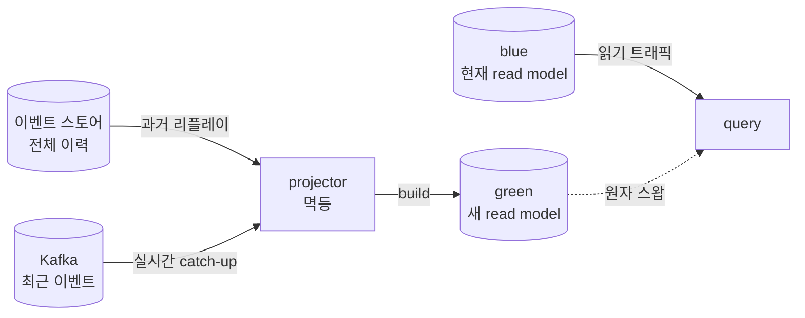
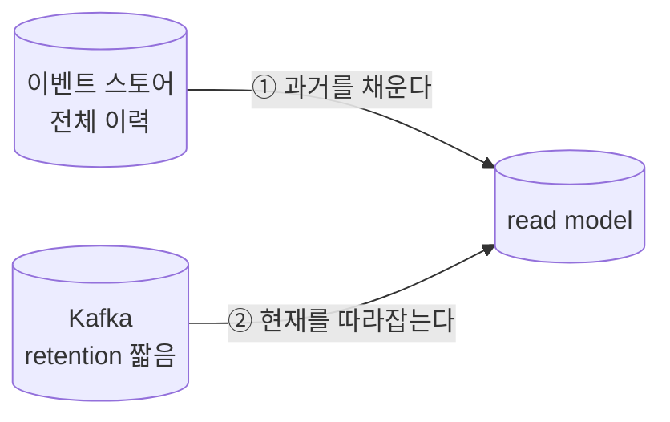
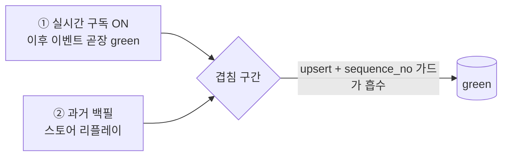
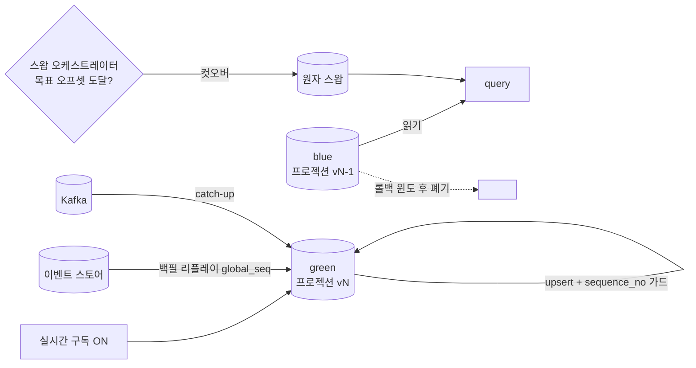

# RFC-011 — 프로젝션 재구축·catch-up 운영

- **상태**: 🏷 합의 (2026-06-25) · 독립 리뷰 게이트 통과(정합·메커니즘) · design [[03-read-model]] 보강 + 신규 ADR(프로젝션 운영 전략) 비준 대기
- **선행**: [[RFC-001-v2-cqrs-and-event-sourcing]] · 인덱스 [[RFC-INDEX]]
- **닫으면**: [[03-read-model]] 보강 + 신규 ADR(프로젝션 운영 전략) 가능

---

## 배경 (Background)

### 시나리오: read model 하나를 통째로 다시 만든다

**V1에서는 이런 상황이 거의 생기지 않는다.**
읽기와 쓰기가 같은 `reservation` 테이블·같은 모델을 공유하므로, "조회용 구조를 다시 만든다"는 개념 자체가 없다. 행을 `UPDATE`하면 그게 곧 현재 상태이자 조회 대상이다. 다시 만들 것도, 따라잡을 것도 없다.

**V2에서는 read model이 이벤트로부터 파생된 2차 구조물이라 사정이 다르다.**
이벤트 스토어와 토픽이라는 진실 원천이 있고, projector가 그것을 소비해 read model 테이블을 채운다. 그렇다면 read model은 언제든 버려도 되고, 다시 만들 수 있어야 한다. 다시 만들어야 하는 순간은 넷이다.

1. **스키마가 바뀌었을 때** — read model의 컬럼·형태를 바꾼다.
2. **projector 버그로 잘못 채워졌을 때** — 오염된 투영을 정정한다.
3. **새 read model을 운영 중에 투입할 때** — 무중단으로 끼워 넣는다.
4. **개인정보 셰딩으로 특정 주체의 PII를 정정(redaction)해야 할 때** ([[RFC-005-pii-security]]) — RFC-005가 "셰딩을 이벤트로 취급해 다운스트림 프로젝션이 자기 투영을 정정"하도록 정한 결정의 실행면이고, 그 정정 기계가 곧 이 RFC의 재구축·정정 경로이며 같은 멱등 projector로 흡수된다.

### 세 개념을 평이하게

| 개념 | 한 줄 정의 | 다루는 위험 |
|------|-----------|-------------|
| **재구축(rebuild)** | read model을 과거 이벤트로 처음부터 다시 만드는 것 | 진실 원천 선택·성능 |
| **catch-up** | 다시 만드는 동안 흘러 들어온 신규 이벤트를 따라잡는 것 | gap·중복 |
| **무중단 교체** | 그 사이 읽기 트래픽을 끊지 않는 것 | 가용성·컷오버 판정 |

이것은 ES/EDA를 택한 순간 따라오는 핵심 운영 주제인데, 정작 어느 design_doc에도 절차로 적혀 있지 않다(T-09 백로그).

---

## 맥락 (Context)

[[RFC-002-read-model-consistency]]가 *무엇을* 읽기 모델에 두느냐의 문서라면, 이 RFC는 *그것을 어떻게 운영하느냐*의 문서다. read model이 파생 구조물인 이상 "다시 만든다"는 일상적 운영 행위인데, 그 절차가 어디에도 prose로조차 정리돼 있지 않다.

- **진실 원천이 둘이고 성질이 다르다.** 이벤트 스토어는 전체 이력을 무한 보관하지만, Kafka 토픽은 보존기간이 짧다([[RFC-003-messaging-delivery]]). → 재구축의 기본 원천을 어느 쪽으로 둘지가 정확성을 좌우한다 — 토픽 위에서 재구축하면 보존 경계 이전 상태가 통째로 빈다.
- **재구축 중에도 읽기는 들어온다.** 테이블을 그 자리에서 비우고 다시 채우면 채우는 동안 결과가 불완전하다. → 가용성을 깨지 않으려면 교체 전략이 필요하다.
- **at-least-once 전달이라 중복이 정상이다.** 토픽 전달이 at-least-once인 한([[RFC-003-messaging-delivery]]) projector는 같은 이벤트를 다시 본다. → "두 번 적용해도 결과가 같다"가 전제되지 않으면 재구축 자체가 read model을 오염시킨다.
- **자산 — 정확성 불변식은 이미 박혀 있다.** [[RFC-021-event-identity-and-global-ordering]]가 per-애그리거트 순서(파티션 키=`aggregate_id`) + 멱등 upsert + per-애그리거트 버전 가드(`sequence_no`)를 못박았다. → 재구축·catch-up은 이 불변식을 *운영면에서 재사용*하면 되지, 새로 발명할 게 아니다.

핵심 긴장 — **재구축·catch-up·무중단 교체를 진실 원천(스토어 vs 토픽)·중복·gap의 함정을 피해 절차로 세우되, RFC-021이 박은 정확성 불변식을 그대로 재사용하면서 방향만 지금 확정하고 수치·구체 메커니즘은 측정·Design으로 가른다.**

---

## Goal / Non-goal

**Goal**
- 프로젝션 재구축의 진실 원천과 2단(과거 스토어 + 현재 토픽) 구조를 정한다.
- 재구축 중 읽기를 끊지 않는 무중단 교체 전략을 정한다.
- catch-up 완료를 무엇으로 판정하고 컷오버와 어떻게 묶는지 규약을 정한다.
- projector 멱등의 형태(upsert·버전 가드·오프셋·dedup 분리)를 못박는다.
- 스키마 변경·신규 프로젝션 투입의 재구축 트리거·순서를 정한다.

**Non-goal (이번에 하지 않음)**
- blue-green 스왑 원자성의 구체 수단(뷰/별칭 vs 라우팅 스위치)과 롤백 윈도 — Design.
- catch-up 완료 판정의 lag 임계 수치 — 측정.
- 멱등 책임의 배치(projector 코드 vs 공통 inbox 인프라) — Design.
- 이벤트 스토어 리플레이의 성능·부하·병렬화 — Design.
- 비-ES 컨텍스트 재구축 경로의 구체 절차 — Design.
- 스키마 변경 시 자동 재구축 트리거의 자동화 범위 — Design.
- 상시 lag이 비정상적으로 튀는 degraded 운영 케이스 — [[RFC-002-read-model-consistency]] · [[09-deployment-runtime]].

---

## 논의 (Discussion)

### 논점 1. 재구축의 진실 원천을 무엇으로 둘 것인가

**맥락에서 나온 질문.** "진실 원천이 둘이고 성질이 다르다"(맥락 1)에서 곧장 나온다. read model을 처음부터 다시 채우려면 과거 이벤트 전체를 어딘가에서 다시 읽어야 한다.

검토한 선택지:
- **토픽 from-beginning 재소비** — 통로가 이미 있어 매력적이다. 대신 [[RFC-003-messaging-delivery]]에서 보존기간을 짧게 가져가기로 한 이상, 토픽은 "최근 이벤트의 전달 통로"일 뿐 "전체 이력의 보관소"가 아니다 — retention이 7일이면 8일 전 이벤트는 없고, from-beginning이라 해봐야 보존 경계까지밖에 못 거슬러 올라가 경계 이전 상태가 통째로 빈다.
- **이벤트 스토어 리플레이** — 정의상 전체 이력을 무한 보관하는 진실 원천. 대신 ES 컨텍스트에만 있다.
- **혼합** — 둘을 섞는다.

**내 의견(AI):** 재구축의 기본 원천을 **이벤트 스토어 리플레이로** 둔다. ES 컨텍스트(`reservation`·`timetable`·`restaurant`)는 거기서 애그리거트별·전역 스트림을 처음부터 다시 읽어 프로젝션을 재구축한다. 전역 스캔의 열거·재개 기준은 `global_seq` 커서다([[RFC-021-event-identity-and-global-ordering]] · ADR [[22.event-identity-and-global-ordering]]) — 이는 *진행/열거 커서*이지 교차-애그리거트 *전순서 보장*이 아니다. 정확성 불변식은 RFC-021이 박은 그대로 — per-애그리거트 순서(파티션 키=`aggregate_id`) + 멱등 upsert + per-애그리거트 버전 가드(`sequence_no`) — 이므로 아래 §멱등에서 "멱등이 흡수한다"는 *같은 애그리거트 스트림의 재전달·역전*에 한정된 말이다. 여러 애그리거트를 가로지르는 불변식이 실제로 필요하면 그건 projector가 아니라 **사가**가 진다([[RFC-021-event-identity-and-global-ordering]] · [[16.optimistic-concurrency-control]]). 토픽은 재구축 원천이 아니라 실시간 catch-up 구간에서만 쓴다 — "스토어로 과거를 채우고, 토픽 구독으로 현재를 따라잡는다"는 2단 구조다.

**네 결정:** 재구축 기본 원천 = 이벤트 스토어 리플레이, 토픽은 실시간 catch-up 전용의 2단 구조. 비-ES 컨텍스트는 원본 테이블에서 read model을 다시 빌드하는 별도 경로. 〔근거 확인/보강 필요〕

**결론:** ES 컨텍스트는 스토어 리플레이(`global_seq` 커서로 열거)로 과거를 채우고 토픽으로 catch-up한다. 비-ES 컨텍스트는 이벤트 스토어가 없어 진실 원천이 약하므로 원본 테이블 기반 재빌드를 쓰고, 여기에 토픽 from-beginning을 끼우는 건 retention 때문에 신뢰할 수 없다. (이의 여지: 비-ES 쪽 재구축 경로가 ES 쪽과 절차가 갈리면 운영이 복잡해진다는 반론 — 다만 애초에 진실 원천이 다른 두 세계라 절차가 같을 수 없다. 구체 절차는 [[03-read-model]] Design.)

### 논점 2. 재구축 중에 읽기를 끊지 않으려면

**맥락에서 나온 질문.** "재구축 중에도 읽기는 들어온다"(맥락 2)에서 나온다. 스키마가 바뀌거나 대량 재구축이 필요할 때, read model 테이블을 그 자리에서(in-place) 비우고 다시 채우면 채우는 동안 읽기 결과가 불완전하다.

검토한 선택지:
- **in-place 재구축** — 절차가 단순하다. 대신 재구축 중 읽기 가용성을 희생한다.
- **blue-green 스왑** — blue를 둔 채 green을 빌드 후 원자 전환, 롤백 안전망 확보. 대신 테이블 두 벌을 동시에 유지한다.
- **섀도 빌드 후 비교** — 검증 정밀도가 높다. 다만 가용성 문제 자체는 blue-green과 같은 방식으로 푼다.

**내 의견(AI):** **blue-green 프로젝션 스왑**이다. 현재 트래픽이 보는 테이블(blue)은 그대로 두고, 새 테이블(green)을 이벤트 스토어 리플레이로 처음부터 빌드한다 — green 빌드도 아래 §운영 중 신규 프로젝션의 "구독 먼저 → 백필" 순서와 `global_seq ≤ HWM` 경계를 그대로 따른다(라이브 구독이 백필의 commit-skew 구멍을 메우고 버전 가드가 겹침을 dedup한다, [[RFC-021-event-identity-and-global-ordering]]). green이 catch-up까지 끝나 blue와 동등해지면 읽기 경로가 가리키는 대상을 green으로 원자적으로 스왑한다(뷰/별칭 교체 또는 라우팅 스위치). blue는 롤백 안전망으로 잠시 남겼다가 폐기한다. in-place는 단순하지만 가용성을 희생하므로 기본값으로 두지 않는다.

**네 결정:** blue-green 프로젝션 스왑을 기본값으로, in-place는 비기본. green은 catch-up 완료 후 원자 스왑, blue는 롤백 윈도 후 폐기. 〔근거 확인/보강 필요〕

**결론:** 무중단 교체 = blue-green 스왑. (이의 여지: 테이블 두 벌을 동시에 유지하는 스토리지·운영 비용, 그리고 스왑 원자성을 무엇으로 보장하느냐 — 별칭인지 애플리케이션 레벨 스위치인지 — 는 [[03-read-model]] Design에서 검증.)

### 논점 3. catch-up이 끝났는지를 무엇으로 판단하고, 그게 readiness와 어떻게 묶이나

**맥락에서 나온 질문.** 논점 2의 스왑과 논점 6의 신규 투입이 모두 "충분히 따라잡았다"는 판정을 전제한다. 판정 없이 라우팅하면 lag이 큰 read model로 트래픽이 흘러 신선도가 깨진다([[RFC-002-read-model-consistency]]).

**내 의견(AI):** **catch-up 완료를 컷오버(go-live) 완성도 판정으로** 둔다 — *상시 신선도 게이트가 아니다.* 정상 읽기는 eventually consistent라 lag을 게이트하지 않는다([[RFC-002-read-model-consistency]]가 stale 허용을 베이스라인으로 둔다); 막아야 하는 건 "조금 stale한" 프로젝션이 아니라 재구축 중이라 **통째로 미완성**인 프로젝션이다 — 그건 stale이 아니라 틀린 결과다. 그래서 "green의 추적 오프셋이 목표에 도달 = 컷오버 가능"을 **swap 오케스트레이터가 1회 평가**해 blue→green 스왑·신규 프로젝션 go-live를 결정한다 — 매 읽기를 막는 k8s readiness 프로브가 아니라 *스왑 시점 판정*이다. 이로써 "누구의 readiness냐"(인바운드 트래픽이 없는 projector냐, 읽기를 받는 query API냐)라는 혼동이 사라진다: 같은 사실(프로젝션이 목표 오프셋 도달, 논점 4의 오프셋 추적으로 측정)을 컷오버 판정에 쓸 뿐이다.

**네 결정:** catch-up 완료 = 스왑 오케스트레이터의 1회 컷오버 판정(목표 오프셋 도달), 상시 readiness 프로브 아님. 규약(미완성 프로젝션엔 컷오버하지 않는다)만 지금 확정, 임계 수치는 측정 트리거로 위임. 〔근거 확인/보강 필요〕

**결론:** "미완성 프로젝션엔 컷오버하지 않는다"는 규약을 확정하고, 구체적 임계 수치는 실제 이벤트량·재구축 시간 측정이 필요하므로 측정 트리거로 남긴다. (이의 여지: 상시 lag이 비정상적으로 튀는 degraded 운영 케이스 처리는 [[RFC-002-read-model-consistency]] · [[09-deployment-runtime]] 몫으로 분리.)

### 논점 4. projector가 같은 이벤트를 두 번 봐도 안전한가

**맥락에서 나온 질문.** "at-least-once라 중복이 정상이다"(맥락 3)에서 나온다. 재구축이든 catch-up이든 장애 복구든 projector는 같은 이벤트를 다시 적용하게 되므로, "두 번 적용해도 결과가 같다"가 전제되지 않으면 재구축 자체가 read model을 오염시킨다.

**내 의견(AI):** **projector를 멱등하게 강제**한다. 구체적으로 (1) 단순 삽입이 아니라 키 기반 upsert로 쓰고, (2) 이벤트에 실린 버전/시퀀스를 가드로 두어 이미 반영된(또는 더 최신인) 상태에 과거 이벤트를 덮어쓰지 않으며, (3) 프로젝션별 처리 오프셋을 추적해 어디까지 봤는지 안다. 여기서 **dedup과 순서 가드는 다른 일임을 분리한다**([[RFC-021-event-identity-and-global-ordering]]) — dedup("이 이벤트를 봤나")은 `event_id` inbox로, 순서 가드("더 과거로 덮지 마라")는 `sequence_no` 버전 가드로 푼다. 자연 멱등(예: 절대값 상태 치환)이고 **순서 역전이 없는** 경우에 한해 순서 가드를 생략할 수 있으나, 재구축·catch-up은 스토어 리플레이와 라이브 토픽 **2경로가 겹쳐 역전이 정상 발생**한다(애초에 이 RFC의 주제가 그 구간이다) — 그러므로 기본은 가드 유지이고, 이는 [[RFC-003-messaging-delivery]]가 가드 생략을 "순서 역전 없을 때뿐"으로 한정한 것과 같은 선이다. 누적·증분 갱신, 특히 **교차-애그리거트 카운터**는 한 애그리거트의 버전 가드로 멱등이 안 되므로 `event_id` inbox로 "이미 적용한 이벤트는 다시 더하지 않음"을 보장하거나 절대값에서 재계산한다. 끝으로 **한 이벤트의 다중 행 갱신은 한 MySQL 트랜잭션으로 묶고 오프셋 커밋을 그 안/직후에 둬**, 부분 적용 뒤 가드가 재시도를 막아 영구 gap이 나는 일을 차단한다.

**네 결정:** projector 멱등 강제 = 키 upsert + `sequence_no` 버전 가드 + 프로젝션별 오프셋 추적, dedup(`event_id` inbox)과 순서 가드 분리, 교차-애그리거트 카운터는 inbox 또는 절대값 재계산, 다중 행 갱신은 단일 트랜잭션 + 오프셋 커밋 동봉. 〔근거 확인/보강 필요〕

**결론:** 멱등은 위 규약으로 강제하고, 재구축·catch-up의 2경로 겹침에서는 순서 가드 유지가 기본이다. (이의 여지: 멱등을 projector 코드에 둘지, inbox 같은 공통 인프라로 한 번에 풀지 — 책임 배치는 [[03-read-model]] Design에서 검증.)

### 논점 5. 읽기 모델 스키마가 바뀌면 재구축을 어떻게 트리거하나

**맥락에서 나온 질문.** read model이 파생 구조라 바꾸는 비용이 원칙적으로 싸다 — 버리고 다시 만들면 되니까(맥락의 재구축 동기 ①). 문제는 "언제, 어떻게 다시 만드느냐"의 절차다.

**내 의견(AI):** **프로젝션에 버전을 태깅하고, 버전이 바뀌면 새 버전 테이블을 blue-green으로 재구축**한다. 스키마 변경을 곧 새 프로젝션 버전의 등장으로 취급하면, 논점 2에서 정한 blue-green 스왑 절차가 그대로 재사용된다 — 별도의 "스키마 마이그레이션" 메커니즘을 따로 만들 필요가 없다. 자동 재구축을 어디까지 자동화할지(배포 시 버전 불일치 감지 → 자동 빌드 트리거)는 매력적이지만, 대량 재구축을 무인으로 도는 건 위험이 있어 **트리거 조건만 규약화하고 실행은 운영 승인 단계를 두는** 쪽으로 기운다.

**네 결정:** 프로젝션 버전 태깅 + 버전 변경 시 blue-green 재구축, 트리거 조건만 규약화하고 실행은 운영 승인 게이트. 〔근거 확인/보강 필요〕

**결론:** 스키마 변경 = 새 프로젝션 버전 등장 = blue-green 재구축 재사용. (이의 여지: 점진 전환 — 구버전 읽기 + 신버전 백필 동시 운영 — 이 blue-green보다 나은 경우가 있는지, 자동화 범위는 [[03-read-model]] Design에서 검증.)

### 논점 6. 운영 중 신규 프로젝션을 어떻게 끼워 넣나

**맥락에서 나온 질문.** 새 read model을 무중단 운영에 투입하는 건 재구축의 특수 케이스다(맥락의 재구축 동기 ③). 핵심 위험은 이음매다 — 과거 이벤트를 백필하는 동안 흘러 들어온 신규 이벤트를 놓치면 gap이 생기고, 백필과 실시간 구독이 겹치면 중복이 생긴다.

**내 의견(AI):** **"구독 먼저, 백필 나중, 멱등으로 봉합"** 순서다. 먼저 실시간 구독을 켜서 그 시점 이후 이벤트를 **메모리 버퍼 없이 곧장 green에 적용**하고, 그 다음 이벤트 스토어에서 과거를 백필한다. 두 구간이 겹치는 부분은 논점 4의 멱등 projector(upsert + `sequence_no` 가드)가 흡수하므로 버퍼가 필요 없다 — 이 무버퍼 봉합은 §멱등의 버전 가드가 **필수**임을 전제로만 성립한다(가드를 생략하면 나중 도착한 백필 과거가 먼저 적용된 라이브 최신을 덮어쓴다). 반대로 "백필 먼저, 구독 나중"은 백필 종료 시점과 구독 시작 시점 사이에 발생한 이벤트가 어느 쪽에도 안 잡혀 gap이 된다 — 토픽 retention이 짧아 그 구멍을 토픽 from-beginning으로 메울 수도 없다([[RFC-003-messaging-delivery]]). 겹침은 가드가 복구하지만 gap은 복구 불가라, 빈틈 날 순서가 아니라 겹칠 순서를 택한다.

**네 결정:** 신규 프로젝션 투입 = "구독 먼저 → 백필 나중 → 멱등 봉합(무버퍼)" 순서, catch-up 완료 전엔 논점 3 규약대로 트래픽 미전송. 〔근거 확인/보강 필요〕

**결론:** gap은 복구 불가하고 겹침은 가드가 복구하므로, 빈틈 날 순서가 아니라 겹칠 순서를 택한다. catch-up이 끝나기 전엔 readiness 규약대로 트래픽을 보내지 않는다.

---

## 결정 요약

| # | 결정 | ADR |
|---|------|-----|
| 1 | 재구축 진실 원천 = **이벤트 스토어 리플레이**(과거) + **토픽 catch-up**(현재)의 2단 구조, 비-ES는 원본 테이블 재빌드 | [[03-read-model]] · [[RFC-021-event-identity-and-global-ordering]] · 신규 ADR(프로젝션 운영 전략) 예정 |
| 2 | 무중단 교체 = **blue-green 프로젝션 스왑**(green 빌드→catch-up→원자 스왑→blue 롤백 윈도), in-place 비기본 | [[03-read-model]] · 신규 ADR(프로젝션 운영 전략) 예정 |
| 3 | catch-up 완료 = **스왑 오케스트레이터 1회 컷오버 판정**(목표 오프셋 도달), 상시 readiness 게이트 아님, 임계 수치는 측정 | [[03-read-model]] · [[RFC-002-read-model-consistency]] |
| 4 | projector **멱등 강제** = 키 upsert + `sequence_no` 버전 가드 + 프로젝션별 오프셋, dedup(`event_id` inbox)·순서 가드 분리, 다중 행은 단일 TX | [[03-read-model]] · [[RFC-021-event-identity-and-global-ordering]] |
| 5 | 스키마 변경 = **프로젝션 버전 태깅 + blue-green 재구축**, 트리거 규약화·실행은 운영 승인 게이트 | [[03-read-model]] · 신규 ADR(프로젝션 운영 전략) 예정 |
| 6 | 신규 프로젝션 투입 = **"구독 먼저 → 백필 나중 → 멱등 무버퍼 봉합"**, gap 불가·겹침 흡수 | [[03-read-model]] · [[RFC-021-event-identity-and-global-ordering]] |

상세 설계는 [[03-read-model]] 참조.

---

## 결과 (목표 운영 흐름 요약)

- **재구축**: ES 컨텍스트는 스토어 리플레이로 과거를 채우고 토픽으로 현재를 따라잡는 2단 구조, 비-ES는 원본 테이블 재빌드.
- **무중단**: blue를 둔 채 green을 빌드·catch-up하고 원자 스왑, blue는 롤백 윈도 후 폐기.
- **판정**: catch-up 완료는 스왑 오케스트레이터가 목표 오프셋 도달로 1회 판정 — 미완성 프로젝션엔 컷오버하지 않는다.
- **멱등**: 키 upsert + `sequence_no` 가드 + 오프셋 추적, dedup과 순서 가드를 분리, 다중 행은 단일 트랜잭션.
- **스키마 변경·신규 투입**: 버전 태깅으로 blue-green을 재사용하고, 신규 투입은 "구독 먼저 → 백필 나중 → 멱등 봉합"으로 gap을 피한다.

상세 절차·시퀀스는 [[03-read-model]] 참조.

---

## 관련 문서

- 인덱스: [[RFC-INDEX]]
- 선행/연관 RFC: [[RFC-001-v2-cqrs-and-event-sourcing]] · [[RFC-002-read-model-consistency]] · [[RFC-003-messaging-delivery]] · [[RFC-005-pii-security]] · [[RFC-007-deployment-infra-ops]] · [[RFC-021-event-identity-and-global-ordering]]
- ADR: [[22.event-identity-and-global-ordering]] · [[16.optimistic-concurrency-control]] · 신규 ADR(프로젝션 운영 전략) 비준 대기
- 설계: [[03-read-model]] · [[09-deployment-runtime]]
