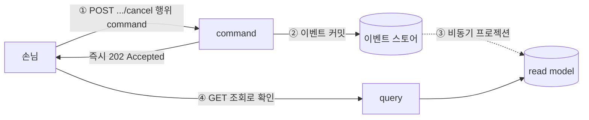
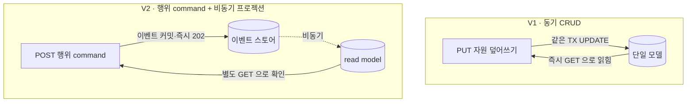
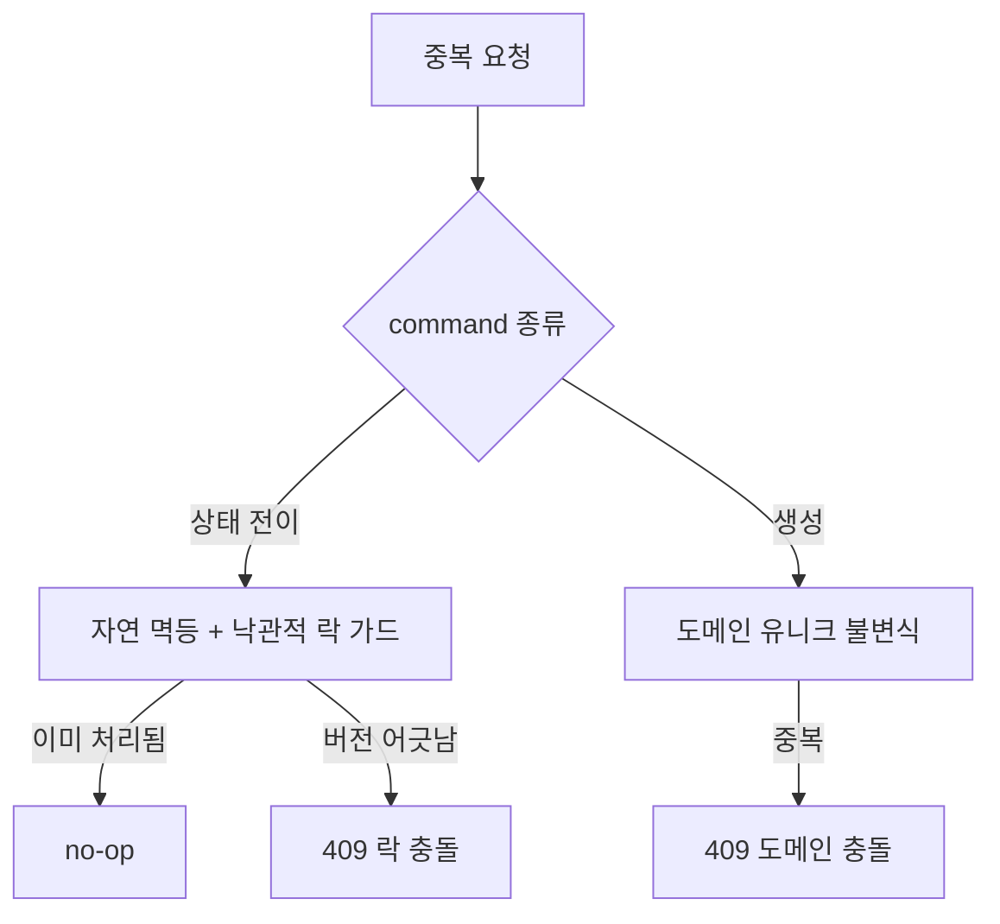
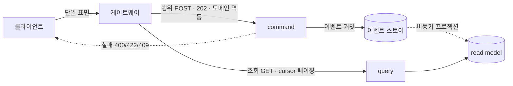

# RFC-012 — command/query API 계약·비동기 command

- **상태**: ✅ 종결 (2026-06-23) · 하류 산출물 없음 — 구현 시점에 결정
- **선행**: [[RFC-001-v2-cqrs-and-event-sourcing]] · 인덱스 [[RFC-INDEX]]

---

## 배경 (Background)

### 시나리오: 손님이 예약을 만들고, 곧장 "내 예약"을 연다

**V1에서는 이렇게 흐른다.**
클라이언트가 `PUT /reservations/{id}`로 자원을 통째로 보내면 서버가 같은 트랜잭션 안에서 행을 고치고 200으로 결과를 돌려준다. 끝나자마자 `GET /reservations/{id}`를 때리면 방금 쓴 값이 그대로 돌아온다 — 동기 CRUD라서 "쓰면 바로 읽힌다"가 공짜로 성립한다. 클라이언트는 이 가정 위에서 화면을 짠다.

**V2에서는 이렇게 흐른다.**

1. **행위 단위 command 수신** — 클라이언트가 `POST /reservations/{id}/cancel`처럼 *의도*를 들고 들어온다.
2. **이벤트 커밋 + 즉시 202** — 서버는 그 의도를 도메인 이벤트로 적재(즉시 커밋)하고, 결과 반영을 기다리지 않고 `202 Accepted`를 돌려준다.
3. **비동기 프로젝션** — 그 이벤트로 read model이 갱신되는 것은 별도 경로에서 비동기로 일어난다.
4. **결과는 별도 조회로 확인** — 클라이언트는 `GET`(cursor 페이징 규약)으로 read model을 읽어 반영을 확인한다 — 단, 방금 쓴 것이 *즉시* 보장되지는 않는다.

### V1 ↔ V2, 외부 표면에서 무엇이 달라지나

| 개념 | V1 | V2 | 한 줄 정의 |
|------|-----|-----|-----------|
| **command 모양** | 자원 CRUD(`PUT`) | 행위 단위 task-based(`POST .../cancel`) | "자원을 덮어쓰는 게 아니라 의도를 보낸다" |
| **응답 규약** | 동기 200 + 결과 | 비동기 202, 결과는 별도 조회 | "받아 적었다를 돌려주고 반영은 뒤따른다" |
| **read-your-writes** | 항상 성립(같은 모델) | 기본 보장 안 됨 | "쓰고 바로 그 결과를 읽을 수 없다" |

---

## 맥락 (Context)

[[RFC-001-v2-cqrs-and-event-sourcing]]에서 쓰기·읽기를 갈라놓았지만, 외부 HTTP 표면은 아직 정의되지 않았다. V2의 기본값은 "쓰고 바로 못 읽음"(비동기 프로젝션)이므로, API 계약이 이 성질을 정직하게 드러내야 한다. V1의 `@ControllerAdvice` 글로벌 예외 처리는 실패 분류 매핑 토대로 계승.

---

## Goal / Non-goal

**Goal**
- command 엔드포인트의 스타일(행위 단위 vs CRUD)을 정한다.
- 비동기 쓰기의 응답 규약을 정한다.
- 중복 제출에 대한 멱등 책임의 소재를 정한다.
- command 실패를 클라이언트가 분기할 수 있게 분류·표기하는 원칙을 정한다.
- 클라이언트에게 보이는 API 표면을 한 개로 둘지 두 개로 둘지, 버저닝 통로를 둘지 정한다.
- query 조회의 페이징 표준을 정한다.

**Non-goal (이번에 하지 않음)**
- command 엔드포인트 목록·행위 명명 규약·도메인 이벤트 카탈로그의 실제 작성. → Design.
- 202 결과 조회 메커니즘의 구체(폴링/SSE/웹소켓). → [[RFC-002-read-model-consistency]]의 read-your-writes 결론에 종속해 Design.
- command/query를 다른 백엔드로 라우팅·물리 분리·배포하는 토폴로지. → [[RFC-007-deployment-infra-ops]].
- API 버저닝의 구체 방식(경로 prefix vs 헤더). → Design.

---

## 논의 (Discussion)

### 논점 1. command를 무슨 모양으로 받을까

검토한 선택지:
- **자원 CRUD** (`PUT /reservations/{id}`) — V1과의 연속성·익숙함. 대신 diff를 역산해 어떤 이벤트가 발생했는지 추측해야 한다.
- **행위 단위 task-based** (`POST /reservations/{id}/cancel`) — 의도가 그대로 이벤트가 된다. API 표면과 이벤트 저장소가 정렬된다.

**의견:** 프로토타입 단계에서는 **자원 CRUD + 헤더**로 충분할 수 있다. 안쪽이 이벤트 기반이더라도 바깥 표면까지 task-based로 가져갈 필요는 없다 — CRUD로 받고 서버 안에서 의도를 해석하면 된다. task-based가 정말 필요해지는 시점(행위가 복잡해지거나 CRUD 매핑이 어색해질 때)에 바꿔도 늦지 않다.

**결론:** 프로토타입은 자원 CRUD + 헤더를 기본으로 시작하고, 행위 분리가 정말 필요해지면 task-based로 전환한다.

### 논점 2. 쓰고 바로 못 읽는다면, 응답을 어떻게 돌려줄까

검토한 선택지:
- **(a) 동기 200** — 프로젝션이 끝날 때까지 기다렸다가 결과를 돌려준다. 쓰기 경로가 프로젝션 완료를 기다려야 해 쓰기·읽기 분리가 무력화된다.
- **(b) 즉시 202 Accepted** — 이벤트만 커밋하고 즉시 응답, 결과는 별도 조회.
- **(c) command별로 섞는다** — 사안별 절충.

**결론:** 기본 응답 = 202 Accepted. 검증 실패처럼 이벤트를 적기도 전에 거절할 수 있는 것은 즉시 4xx. 결과 조회 방식(폴링/SSE/웹소켓)은 [[RFC-002-read-model-consistency]]의 read-your-writes 결론에 종속.

### 논점 3. 같은 command가 두 번 들어오면

검토한 선택지:
- **클라이언트 발급 Idempotency-Key** — 클라이언트가 키로 재시도/의도된 중복을 선언. 외부·비신뢰 클라이언트에 적합. 대신 클라이언트에 계약을 지운다.
- **서버 책임 + 도메인 흡수** — 멱등을 도메인이 떠안아 클라이언트 표면을 가볍게 둔다.

멱등 흡수 구조:
- **상태 전이** — 자연 멱등 + 낙관적 락 버전 가드. 이미 취소된 것을 다시 취소하면 no-op, 버전 어긋남은 409.
- **생성** — 도메인 유니크 불변식. "같은 사용자가 같은 슬롯을 두 번 예약할 수 없다" → 더블클릭은 409.

**결론:** 멱등 = 서버(도메인) 책임. 클라이언트 발급 키 미도입. 요청-단 멱등(HTTP 중복)과 [[RFC-003-messaging-delivery]]의 전달 멱등(브로커 중복)은 다른 층이라 독립적으로 필요. 자연 유니크 불변식이 없는 생성 command의 잔여 케이스는 서버 측 디듀프로 처리.

### 논점 4. 실패를 어떻게 구분해 알릴까

실패 경로가 세 가지이고 클라이언트 대응이 다르다:
- **검증 실패**(형식 오류) → 요청 고쳐 재시도
- **도메인 예외**(규칙 위반) → 고쳐도 안 됨
- **낙관적 락 충돌**(동시 쓰기) → 최신 읽고 재시도하면 풀림

**결론:** 검증=400, 도메인 규칙=422, 낙관적 락=409로 분류. 바디에 에러 코드+메시지. `@ControllerAdvice` 중앙 매핑 계승.

### 논점 5. 클라이언트에게 한 표면으로 보일까, 두 표면으로 보일까

검토한 선택지:
- **(a) 별도 표면** — command와 query를 별도 호스트/경로로 분리 노출.
- **(b) 단일 표면** — 게이트웨이 뒤 한 표면, 경로·메서드 규약으로 성격 구분.

**결론:** 단일 표면. 안쪽이 아직 한 덩어리인데 바깥만 둘로 보일 필요 없다. 물리 분리·라우팅은 배포 토폴로지가 익으면 [[RFC-007-deployment-infra-ops]]에서 결정. 버저닝 통로는 처음부터 확보.

### 논점 6. query는 어떻게 조회하게 할까

검토한 선택지:
- **offset 페이징** — 직관적. 대신 비동기 갱신되는 read model에서 페이지 넘기는 사이 데이터가 밀려 중복/누락 발생.
- **cursor 페이징** — 정렬 키 기준점으로 잡아 데이터 끼어들어도 안정적.

**결론:** 페이징 표준 = cursor. 관리용 조회 등 offset이 실용적인 예외는 구현 시점에 한정.

---

## 결정 요약

| # | 결정 | ADR |
|---|------|-----|
| 1 | command 엔드포인트 = **자원 CRUD + 헤더** 기본, task-based는 필요 시 전환 | — |
| 2 | command 기본 응답 = **즉시 202 Accepted**, 결과는 별도 조회 | — |
| 3 | 멱등 = **서버(도메인) 책임** — 상태 전이는 자연 멱등+낙관적 락, 생성은 도메인 유니크 불변식 | — |
| 4 | 실패 분류 = **검증 400 / 도메인 규칙 422 / 낙관적 락 409**, `@ControllerAdvice` 중앙 매핑 | — |
| 5 | API 표면 = **게이트웨이 뒤 단일 표면**, 라우팅 분리는 배포 토폴로지 결정 시 | — |
| 6 | query 페이징 표준 = **cursor** | — |

---

## 결과 (목표 API 표면 요약)

- **command**: 자원 CRUD + 헤더 기본(task-based는 필요 시 전환), 이벤트 커밋 후 즉시 202, 결과는 별도 조회로 확인.
- **멱등**: 도메인이 흡수 — 상태 전이는 자연 멱등+낙관적 락, 생성은 유니크 불변식, 클라이언트 키 없음.
- **실패**: 검증 400 / 도메인 422(또는 409 계열) / 락 409로 갈라, 락 409는 재시도 가능 신호. `@ControllerAdvice` 중앙 매핑.
- **표면**: 게이트웨이 뒤 단일 표면, 규약 차이가 성격 구분. 라우팅·표면 분리는 배포 토폴로지가 익으면 재검토.
- **query**: cursor 페이징 표준, 정렬 키는 read model 투영에 의존.

상세 엔드포인트·시퀀스는 구현 시점에 결정.

---

## 관련 문서
- 인덱스: [[RFC-INDEX]]
- 연관 RFC: [[RFC-002-read-model-consistency]] · [[RFC-003-messaging-delivery]] · [[RFC-007-deployment-infra-ops]]
- 계승: [[RFC-001-v2-cqrs-and-event-sourcing]]
