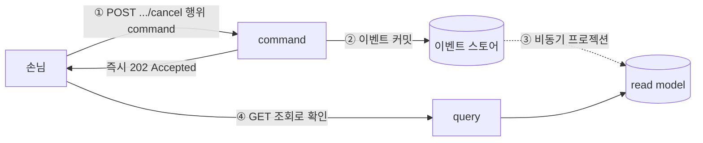
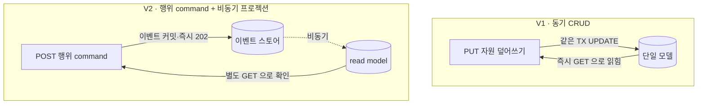
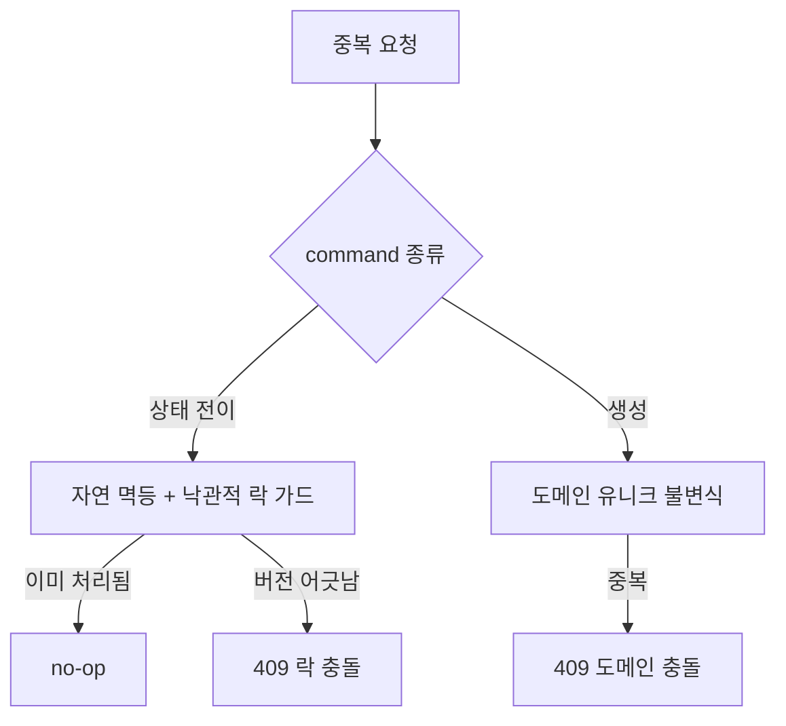
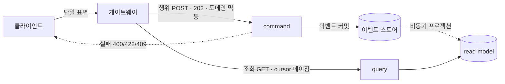

# RFC-012 — command/query API 계약·비동기 command

- **상태**: ✅ 종결 (2026-06-23)
- **선행**: [[RFC-001-v2-cqrs-and-event-sourcing]] · 인덱스 [[RFC-INDEX]]
- **닫으면**: 신규 design_doc(API 계약) + ADR 가능

---

## 배경 (Background)

### 시나리오: 손님이 예약을 만들고, 곧장 "내 예약"을 연다

**V1에서는 이렇게 흐른다.**
클라이언트가 `PUT /reservations/{id}`로 자원을 통째로 보내면 서버가 같은 트랜잭션 안에서 행을 고치고 200으로 결과를 돌려준다. 끝나자마자 `GET /reservations/{id}`를 때리면 방금 쓴 값이 그대로 돌아온다 — 동기 CRUD라서 "쓰면 바로 읽힌다"가 공짜로 성립한다. 클라이언트는 이 가정 위에서 화면을 짠다.

**V2에서는 이렇게 흐른다.**

1. **행위 단위 command 수신** — 클라이언트가 `POST /reservations/{id}/cancel`처럼 *의도*를 들고 들어온다.
2. **이벤트 커밋 + 즉시 202** — 서버는 그 의도를 도메인 이벤트로 적재(즉시 커밋)하고, 결과 반영을 기다리지 않고 `202 Accepted`를 돌려준다.
3. **비동기 프로젝션** — 그 이벤트로 read model이 갱신되는 것은 별도 경로에서 비동기로 일어난다.
4. **결과는 별도 조회로 확인** — 클라이언트는 `GET`(cursor 페이징 규약)으로 read model을 읽어 반영을 확인한다 — 단, 방금 쓴 것이 *즉시* 보장되지는 않는다.

### V1 ↔ V2, 외부 표면에서 무엇이 달라지나

| 개념 | V1 | V2 | 한 줄 정의 |
|------|-----|-----|-----------|
| **command 모양** | 자원 CRUD(`PUT`) | 행위 단위 task-based(`POST .../cancel`) | "자원을 덮어쓰는 게 아니라 의도를 보낸다" |
| **응답 규약** | 동기 200 + 결과 | 비동기 202, 결과는 별도 조회 | "받아 적었다를 돌려주고 반영은 뒤따른다" |
| **read-your-writes** | 항상 성립(같은 모델) | 기본 보장 안 됨 | "쓰고 바로 그 결과를 읽을 수 없다" |

---

## 맥락 (Context)

[[RFC-001-v2-cqrs-and-event-sourcing]]에서 쓰기와 읽기를 갈라놓기로 방향을 잡았지만, 그 결정의 *외부 인터페이스*는 어느 design_doc에도 적혀 있지 않다.

- **내부 분리와 외부 표면은 별개 문제다.** command 핸들러와 read model을 나눈다는 것과, 그것을 HTTP API로 어떻게 노출하느냐는 다르다. → 클라이언트가 보는 것은 결국 엔드포인트와 응답 바디뿐이고, 그 표면이 CQRS의 성질을 정직하게 드러내지 못하면 내부를 아무리 잘 나눠도 클라이언트는 V1과 똑같은 가정을 하고 깨진다.
- **가장 정직해야 할 지점은 비동기다.** ES 위에서 쓰기를 받으면 이벤트는 즉시 커밋되지만 그 이벤트로 read model 프로젝션이 갱신되는 것은 비동기다 — 즉 "쓰고 바로 그 결과를 읽을 수 없다"가 V2의 기본값이다. → V1의 동기 CRUD에 익숙한 클라이언트(그리고 우리 자신)는 `POST` 직후 `GET`이 방금 쓴 것을 돌려주리라 기대하는데, V2에서는 그 기대가 더 이상 보장되지 않는다. API 계약이 이 사실을 숨기면 클라이언트는 경합에서 산발적으로 실패하고, 그 실패는 재현이 어렵다.
- **자산 — V1의 `@ControllerAdvice` 글로벌 예외 처리.** 도메인 예외 계층을 HTTP 응답으로 옮기는 일을 컨트롤러마다 흩지 않고 한 곳에 모으는 발상은 V2에서도 유효하다. → 실패 분류 매핑의 토대로 그대로 계승할 만하다.

핵심 긴장 — **내부의 CQRS·ES 성질(특히 비동기로 "쓰고 바로 못 읽음")을 외부 HTTP 표면에 정직하게 새기되, 멱등·실패·표면 분할·페이징을 클라이언트에게 과한 계약을 지우지 않는 선에서 한 묶음으로 정렬한다.**

---

## Goal / Non-goal

**Goal**
- command 엔드포인트의 스타일(행위 단위 vs CRUD)을 정한다.
- 비동기 쓰기의 응답 규약을 정한다.
- 중복 제출에 대한 멱등 책임의 소재를 정한다.
- command 실패를 클라이언트가 분기할 수 있게 분류·표기하는 원칙을 정한다.
- 클라이언트에게 보이는 API 표면을 한 개로 둘지 두 개로 둘지, 버저닝 통로를 둘지 정한다.
- query 조회의 페이징 표준을 정한다.

**Non-goal (이번에 하지 않음)**
- command 엔드포인트 목록·행위 명명 규약·도메인 이벤트 카탈로그의 실제 작성. → Design.
- 202 결과 조회 메커니즘의 구체(폴링/SSE/웹소켓). → [[RFC-002-read-model-consistency]]의 read-your-writes 결론에 종속해 Design.
- command/query를 다른 백엔드로 라우팅·물리 분리·배포하는 토폴로지. → [[RFC-007-deployment-infra-ops]].
- API 버저닝의 구체 방식(경로 prefix vs 헤더). → Design.

---

## 논의 (Discussion)

### 논점 1. command를 무슨 모양으로 받을까

**맥락에서 나온 질문.** 외부 표면이 내부 CQRS·ES를 정직하게 드러내야 한다는 맥락에서, command 엔드포인트의 스타일부터 갈린다.

검토한 선택지:
- **자원 CRUD** (`PUT /reservations/{id}`) — V1과의 연속성·익숙함. 대신 diff를 역산해 어떤 이벤트가 발생했는지 추측해야 한다.
- **행위 단위 task-based** (`POST /reservations/{id}/cancel`) — 의도가 그대로 이벤트가 된다. API 표면과 이벤트 저장소가 정렬된다.

**내 의견(AI):** task-based로 가야 한다 — V2의 안쪽이 이미 그 모양이기 때문이다. [[RFC-001-v2-cqrs-and-event-sourcing]]에서 쓰기를 도메인 이벤트로 적재하기로 했는데, 이벤트는 본질적으로 "무슨 일이 일어났다"는 행위 기록이다. 클라이언트가 `PUT`으로 자원 전체를 덮어쓰는 모양으로 들어오면 그 diff를 역산해 `Cancelled`인지 `Rescheduled`인지를 필드 비교로 복원해야 하는데 이는 손실이 크고 깨지기 쉽다. command가 처음부터 의도(`cancel`, `reschedule`)를 들고 들어오면 그 의도가 그대로 이벤트가 되어 API 표면과 이벤트 저장소가 한 줄로 정렬된다. CRUD의 매력은 V1과의 연속성뿐인데, 안쪽이 이벤트로 바뀐 마당에 바깥만 CRUD로 두는 것은 임피던스 불일치를 클라이언트가 아니라 우리가 떠안는 거래다.

**네 결정:** command 엔드포인트는 행위 단위 task-based로 노출. 〔근거 확인/보강 필요〕

**결론:** command = task-based(`POST .../cancel` 류), 의도가 곧 이벤트가 되게 한다. (이의 여지: 모든 command가 깔끔한 행위로 떨어지지는 않는다 — 단순 메타데이터 수정 같은 것은 task-based가 오히려 과해 보일 수 있다. 행위로 명명할 가치가 있는 것과 그렇지 않은 것의 경계는 Design에서 도메인 이벤트 카탈로그와 함께 긋는다.)

### 논점 2. 쓰고 바로 못 읽는다면, 응답을 어떻게 돌려줄까

**맥락에서 나온 질문.** 맥락에서 짚은 비동기("쓰고 바로 그 결과를 읽을 수 없다")가 여기서 응답 규약으로 떨어진다. command를 받았을 때 무엇을 언제 돌려줄 것인가.

검토한 선택지:
- **(a) 동기 200** — 프로젝션이 끝날 때까지 기다렸다가 결과를 돌려준다. 표면상 가장 친절하다. 대신 쓰기 경로가 프로젝션 완료를 기다린다.
- **(b) 즉시 202 Accepted** — 이벤트만 커밋하고 즉시 응답, 결과는 별도 조회. 쓰기/읽기 분리를 지킨다.
- **(c) command별로 섞는다** — 사안별 절충.

**내 의견(AI):** 202를 기본으로 삼아야 한다. (a)는 친절해 보이지만, 동기 200을 돌려주려면 쓰기 경로가 프로젝션 완료를 기다려야 하고 이는 [[RFC-001-v2-cqrs-and-event-sourcing]]에서 쓰기·읽기를 가른 이유 자체를 무력화한다 — 두 경로의 결합도가 다시 올라가고, 프로젝션이 느리거나 막히면 쓰기까지 같이 멈춘다. 그래서 응답은 "이벤트는 받아 적었다(202), 결과 반영은 곧 따라온다"를 정직하게 말하고, 클라이언트는 결과를 별도 조회로 확인한다. 이 "결과를 어떻게 확인하느냐"가 정확히 [[RFC-002-read-model-consistency]]의 read-your-writes 문제와 맞물린다 — 202를 받은 클라이언트가 자기 쓰기를 확인하려면 그쪽에서 정한 메커니즘(이벤트 위치 토큰을 들고 폴링하든, 그 토큰까지 따라잡은 read를 보장받든)을 그대로 빌려 쓰는 것이 자연스럽다.

**네 결정:** command 기본 응답은 즉시 202 Accepted, 결과는 별도 조회로 확인. 〔근거 확인/보강 필요〕

**결론:** 기본 응답 = 202 Accepted. 결과 조회 방식의 구체(폴링이냐 SSE냐 웹소켓이냐)는 [[RFC-002-read-model-consistency]]가 read-your-writes를 어떻게 매듭짓느냐에 종속시켜 Design에서 함께 본다. (이의 여지: 모든 command를 비동기로 두면 클라이언트 경험이 일률적으로 무거워진다. 검증 실패처럼 이벤트를 적기도 전에 동기로 거절할 수 있는 것은 202가 아니라 즉시 4xx여야 하고, 그 경계 — 어디까지가 동기 거절이고 어디부터가 202인지 — 는 Design에서 긋는다.)

### 논점 3. 같은 command가 두 번 들어오면

**맥락에서 나온 질문.** 비동기 202를 기본으로 두는 순간(논점 2) 중복 제출이 현실 문제가 된다. 클라이언트는 202만 받았을 뿐 결과를 즉시 확인할 수 없으니, 불안하면 다시 누른다 — 더블클릭, 타임아웃 후 재시도. 같은 의도가 두 번 들어와 이벤트가 두 개 쌓이면 예약이 두 번 취소되거나 두 번 생성된다.

검토한 선택지:
- **클라이언트 발급 Idempotency-Key** (결제 API류) — 서버가 자기 상태만으로는 "재시도인지 의도된 두 번째 요청인지" 구분할 수 없으니 클라이언트가 키로 그 구분을 *선언*한다. 외부·비신뢰 클라이언트에 적합. 대신 클라이언트에 계약을 지운다.
- **서버 책임 + 도메인 흡수** — 멱등을 도메인이 떠안아 클라이언트 표면을 가볍게 둔다.

**내 의견(AI):** 멱등을 서버 책임으로 두고, 클라이언트에게 멱등 키 같은 계약을 지우지 않는 방향이 맞다. 결제 API류의 클라이언트 발급 키 패턴은 서버가 재시도/의도된 중복을 구분 못 하니 클라이언트가 선언하게 하는 장치인데, 우리는 클라이언트를 우리가 만들고(renewal) 도메인 불변식을 우리가 쥐고 있으므로 그 구분을 클라이언트에 떠넘길 필요가 없다. 대신 도메인이 떠안게 해서 두 갈래로 서버에서 흡수한다.

- **상태 전이 command**(`cancel`·`reschedule` 등 이미 존재하는 애그리거트에 가하는 행위)는 *자연 멱등 + 낙관적 락 버전 가드*로 흡수한다. 이미 취소된 것을 다시 취소하면 no-op이고, 기대 버전과 어긋난 재시도는 락 충돌(409)로 걸러진다 — 도메인 상태 자체가 "두 번째 요청"을 무해하게 만든다.
- **생성 command**는 자연 멱등이 약하므로 *도메인 유니크 불변식*에 기댄다. "같은 사용자가 같은 슬롯을 두 번 예약할 수 없다" 같은 규칙이 있으면, 더블클릭의 두 번째 요청은 도메인 충돌(409)로 자연히 거절된다.

핵심은, 재시도인지 의도된 중복인지를 *클라이언트가 키로 선언*하게 하는 대신 *도메인이 그 구분을 떠안게* 하는 것이다. 그러면 멱등이 API 계약이 아니라 도메인 규칙으로 내려가, 클라이언트 표면이 가벼워진다.

**네 결정:** 요청-단 멱등은 서버(도메인) 책임 — 상태 전이는 자연 멱등+낙관적 락, 생성은 도메인 유니크 불변식. 클라이언트 발급 키는 도입하지 않음. 〔근거 확인/보강 필요〕

**결론:** 멱등을 도메인 규칙으로 흡수. 이 요청-단 멱등은 [[RFC-003-messaging-delivery]]의 *전달 멱등*과 다른 층이다 — 그쪽은 메시지가 브로커를 거쳐 컨슈머에게 두 번 도착하는 것을 막고, 이쪽은 HTTP 요청이 두 번 들어오는 것을 도메인이 무해화한다. 둘은 독립적으로 필요하다(요청을 도메인이 한 번만 받아들였어도 그로 인해 적힌 이벤트가 컨슈머에게 두 번 전달될 수 있으므로 RFC-003의 전달 멱등이 여전히 따로 필요). (이의 여지: 자연 유니크 불변식이 없는 생성 command — 같은 사용자가 동일해 보이는 요청을 의도적으로 두 번 보낼 수도 있는 경우 — 는 도메인만으로 재시도와 의도된 중복을 구분할 수 없다. 이 잔여 케이스에 한해 짧은 윈도의 서버 측 디듀프, 혹은 *서버 발급* 토큰이 필요할 수 있고, 외부·비신뢰 클라이언트가 붙는 그림이 생기면 클라이언트 발급 키 패턴이 다시 테이블에 오른다. 경계는 Design.)

### 논점 4. 실패를 어떻게 구분해 알릴까

**맥락에서 나온 질문.** command가 거절될 수 있는 경로는 한 가지가 아니다 — 입력 검증 실패(형식이 틀림), 도메인 예외(규칙 위반, 영업시간 밖 예약 등), 낙관적 락 충돌(같은 애그리거트에 동시 쓰기가 붙어 기대한 버전과 어긋남). 셋 다 "실패"지만 클라이언트의 대응은 제각각이다 — 검증 실패는 요청을 고쳐 다시, 도메인 예외는 보통 고쳐도 안 되며, 락 충돌은 최신 상태를 다시 읽고 재시도하면 풀린다. 이걸 한 덩어리 500이나 막연한 400으로 뭉뚱그리면 클라이언트는 셋을 구분할 수 없다.

**내 의견(AI):** 셋을 HTTP 상태와 바디로 명시적으로 갈라야 한다 — 검증 실패는 400, 도메인 규칙 위반은 422(또는 409 계열), 낙관적 락 충돌은 409로 나누고, 바디에는 기계가 분기할 수 있는 에러 코드와 사람이 읽을 메시지를 함께 싣는다. 특히 락 충돌의 409는 "재시도하면 풀릴 수 있다"는 신호이므로 영구 실패와 반드시 구분되어야 한다. V1의 `@ControllerAdvice` 글로벌 예외 처리는 이 분류를 한곳에서 매핑하는 토대로 그대로 계승할 만하다 — 도메인 예외 계층을 HTTP 응답으로 옮기는 일을 컨트롤러마다 흩지 않고 한 곳에 모으는 발상은 V2에서도 유효하다.

**네 결정:** 검증 실패=400, 도메인 규칙 위반=422(또는 409 계열), 낙관적 락 충돌=409로 분류하고, 바디에 기계 분기용 에러 코드+사람용 메시지. 매핑은 `@ControllerAdvice` 한곳에 모음. 〔근거 확인/보강 필요〕

**결론:** 실패는 세 갈래로 명시 분류, 락 충돌 409는 영구 실패와 구분. `@ControllerAdvice`로 중앙 매핑 계승. (이의 여지: 낙관적 락을 409로 노출할지, 아니면 202 비동기 모델 안에서 결과 조회 시점에 충돌을 알릴지는 비동기 응답 모델과 엮여 있어 Design에서 함께 본다.)

### 논점 5. 클라이언트에게 한 표면으로 보일까, 두 표면으로 보일까

**맥락에서 나온 질문.** 내부에서 command와 query를 나눈 그 분리를, 클라이언트에게 어떻게 보일 것인가. 모든 트래픽 앞단에 게이트웨이와 인증 서버가 선다는 것은 이 문서가 다투는 사안이 아니라 주어진 토대다(그 토폴로지·배치는 [[RFC-007-deployment-infra-ops]]의 몫). 여기서 묻는 것은 그보다 좁다 — 내부 분리를 두 개의 API 표면으로 보일 것인가, 한 표면으로 보일 것인가.

검토한 선택지:
- **(a) 별도 표면** — command와 query를 처음부터 별도 호스트/별도 베이스 경로로 갈라 노출.
- **(b) 단일 표면** — 게이트웨이 뒤 한 표면으로 통합하되 경로·메서드 규약으로 성격만 드러낸다.

**내 의견(AI):** (b)가 지금 단계에 맞다. command/query를 물리적으로 다른 서비스로 쪼개 배포하기 전까지는 클라이언트에게 두 표면을 강제할 실익이 없다 — 게이트웨이 하나가 모든 호출을 받고, 그 안에서 command는 행위 POST에 202·도메인 멱등 규약이, query는 조회 GET에 cursor 페이징 규약이 붙는다는 식으로 *규약의 차이가 곧 성격 구분*이 되게 한다. 클라이언트는 한 호스트만 알면 되고, 어떤 호출에 비동기·멱등 규약이 적용되는지는 메서드와 경로 모양으로 자명해진다. 반대로 (a)처럼 표면을 처음부터 갈라두면, 정작 안쪽이 아직 한 덩어리인데 바깥만 둘로 보여 클라이언트에게 불필요한 토폴로지 지식을 떠넘긴다.

**네 결정:** 게이트웨이 뒤 단일 표면, command/query 성격은 경로·메서드 규약으로 구분. 버저닝 정책은 처음부터 박아둠(경로 prefix든 헤더든). 〔근거 확인/보강 필요〕

**결론:** 클라이언트가 보는 표면은 하나, 규약 차이가 곧 성격 구분. 게이트웨이가 command/query를 실제로 다른 백엔드로 *라우팅*하는 분리는 다른 층의 문제이며, 모듈을 물리적으로 분리·배포하는 시점에 [[RFC-007-deployment-infra-ops]]가 정한다 — "표면은 하나, 라우팅 분리는 배포 토폴로지가 익으면". 버저닝은 깨는 변경을 흡수할 통로가 필요하므로 정책만 지금 박고 구체 방식은 Design. (이의 여지: 모듈을 물리적으로 분리·배포하는 시점이 오면 표면 분리가 다시 테이블에 오른다 — V2 배포 토폴로지([[RFC-007-deployment-infra-ops]])가 결정되어야 답할 수 있다.)

### 논점 6. query는 어떻게 조회하게 할까

**맥락에서 나온 질문.** 읽기 쪽 규약 — 페이지네이션·필터·정렬을 표준화해야 하는데, 핵심 결정은 페이징을 offset으로 하느냐 cursor로 하느냐다. read model이 비동기로 계속 갱신된다는 맥락이 여기서 페이징 안정성 문제로 떨어진다.

검토한 선택지:
- **offset 페이징** — 직관적. 대신 read model이 계속 갱신되는 V2에서는 페이지를 넘기는 사이 새 프로젝션이 끼어들면 offset 기준이 밀려 항목이 중복되거나 건너뛰어진다.
- **cursor 페이징** — 위치를 절대 인덱스가 아니라 정렬 키 기준점으로 잡아 그 사이 데이터가 끼어들어도 안정적이다.

**내 의견(AI):** cursor 페이징을 표준으로 삼아야 한다. read model은 정의상 비동기로 흘러드는 데이터이므로 "고정된 0번부터 N번"이라는 offset의 전제가 성립하지 않는다. cursor는 위치를 정렬 키 기준점으로 잡으므로 그 사이에 데이터가 끼어들어도 안정적이다. 다만 cursor가 안정적이려면 정렬 키가 read model 프로젝션에서 안정적으로 채워져 있어야 하므로, 이 규약은 read model을 어떤 형태로 투영하느냐와 맞물린다.

**네 결정:** query 페이징 표준 = cursor. 〔근거 확인/보강 필요〕

**결론:** 페이징 표준 = cursor, 정렬 키 안정성은 read model 투영 형태와 맞물려 본다. (이의 여지: 임의 정렬·복합 필터를 cursor로 일반화하는 것은 까다롭고, 일부 관리용 조회는 offset이 실용적일 수 있다 — 표준은 cursor로 두되 예외 범위를 Design에서 한정한다.)

---

## 결정 요약

| # | 결정 | ADR |
|---|------|-----|
| 1 | command 엔드포인트 = **행위 단위 task-based**(의도가 곧 이벤트) | 신규 ADR 예정 |
| 2 | command 기본 응답 = **즉시 202 Accepted**, 결과는 별도 조회(read-your-writes는 [[RFC-002-read-model-consistency]]에 종속) | 신규 ADR 예정 |
| 3 | 멱등 = **서버(도메인) 책임** — 상태 전이는 자연 멱등+낙관적 락, 생성은 도메인 유니크 불변식, 클라이언트 발급 키 미도입 | 신규 ADR 예정 |
| 4 | 실패 분류 = **검증 400 / 도메인 규칙 422(또는 409 계열) / 낙관적 락 409**, 에러 코드+메시지, `@ControllerAdvice` 중앙 매핑 | 신규 ADR 예정 |
| 5 | API 표면 = **게이트웨이 뒤 단일 표면**(규약 차이로 성격 구분), 라우팅·표면 분리는 [[RFC-007-deployment-infra-ops]]로, 버저닝 통로는 지금 확보 | 신규 ADR 예정 |
| 6 | query 페이징 표준 = **cursor**(offset은 예외 한정) | 신규 ADR 예정 |

상세 설계는 신규 design_doc(API 계약) 참조.

---

## 결과 (목표 API 표면 요약)

- **command**: 행위 단위 task-based POST, 이벤트 커밋 후 즉시 202, 결과는 별도 조회로 확인.
- **멱등**: 도메인이 흡수 — 상태 전이는 자연 멱등+낙관적 락, 생성은 유니크 불변식, 클라이언트 키 없음.
- **실패**: 검증 400 / 도메인 422(또는 409 계열) / 락 409로 갈라, 락 409는 재시도 가능 신호. `@ControllerAdvice` 중앙 매핑.
- **표면**: 게이트웨이 뒤 단일 표면, 규약 차이가 성격 구분. 라우팅·표면 분리는 배포 토폴로지가 익으면 재검토.
- **query**: cursor 페이징 표준, 정렬 키는 read model 투영에 의존.

상세 엔드포인트·시퀀스는 신규 design_doc(API 계약) 참조.

---

## 관련 문서
- 인덱스: [[RFC-INDEX]]
- 연관 RFC: [[RFC-002-read-model-consistency]] · [[RFC-003-messaging-delivery]] · [[RFC-007-deployment-infra-ops]]
- 계승: [[RFC-001-v2-cqrs-and-event-sourcing]]
