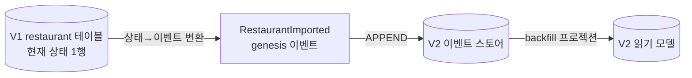
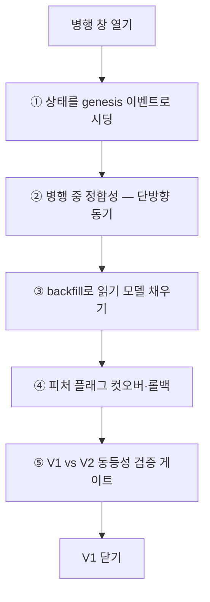
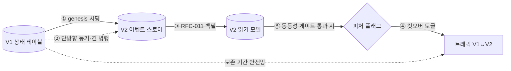

# RFC-013 — V1→V2 데이터 이행 (제네시스 이벤트)

- **상태**: ✅ 종결 (2026-06-23)
- **선행**: [[RFC-001-v2-cqrs-and-event-sourcing]] · 인덱스 [[RFC-INDEX]]
- **닫으면**: [[04-migration]] 보강 + 신규 ADR 가능

---

## 배경 (Background)

### 시나리오: `restaurant` 한 컨텍스트를 V2로 옮긴다

**V1에서는 이렇게 산다.**
`restaurant` 테이블에는 식당 한 곳당 행 한 줄이 있다. 이름이 바뀌고 영업시간이 바뀌고 휴업했다가 다시 열려도, 테이블에 남는 건 언제나 *지금의 한 줄* — 즉 "현재 상태"뿐이다. 그 상태에 도달하기까지 무슨 사건이 있었는지는 어디에도 없다. V1에서는 그래도 됐다. 읽기·쓰기가 같은 행을 쓰니 현재 상태만 있으면 충분했다.

**V2(이벤트 소싱)에서는 그 한 줄로는 모델이 성립하지 않는다.**

1. **진실 원천이 다르다** — [[RFC-001-v2-cqrs-and-event-sourcing]]에서 정한 대로 ES 컨텍스트의 진실은 *이벤트 이력*이다. 현재 상태는 그 이력을 재생(replay)해서 도출되는 결과일 뿐이다.
2. **V1 테이블엔 이력이 없다** — 행 한 줄에는 현재 상태만 있고, 그 앞의 사건들은 비어 있다.
3. **그래서 그냥 복사할 수 없다** — V1 행을 V2 이벤트 테이블에 그대로 부어 넣을 수가 없다. 현재 상태를 **이벤트 이력의 형태로 바꿔서** 적재해야 비로소 V2 모델이 돈다. 그 "현재 상태를 통째로 싣는 한 줄짜리 첫 이벤트"가 **제네시스(genesis) 이벤트**다.

### 이행은 "병행 운영"이다

이 이행의 본질은 빅뱅 교체가 아니라 **V1과 V2를 한동안 병행 운영하는 일**이다 — 두 시스템이 공존하는 창(window)을 열고, 그 창 안에서 상태를 옮기고 트래픽을 넘긴 뒤 V1을 닫는다.

| 하위 문제 | 질문 | 한 줄 정의 |
|-----------|------|-----------|
| 시딩 | 현재 상태를 어떤 이벤트로 바꾸나 | "현재 상태를 genesis 이벤트로 선언" |
| 병행 정합성 | 두 시스템이 함께 사는 동안 어떻게 어긋나지 않나 | "단방향 동기로 진실을 한쪽에 고정" |
| 백필 | 적재한 이벤트로 읽기 모델을 어떻게 채우나 | "이벤트 스트림으로 read model 재빌드" |
| 컷오버·롤백 | V1↔V2를 어떻게 스위치하고 되돌리나 | "피처 플래그 토글 + V1 보존" |
| 검증 | 이행이 맞게 됐는지 어떻게 아나 | "동등성 체크를 컷오버 게이트로" |

---

## 맥락 (Context)

[[RFC-010-module-structure-migration]]은 전환의 *순서*만 다룬다. 어느 컨텍스트를 먼저 V2로 떼어낼지, 모듈 경계를 어떻게 쪼갤지는 거기서 정리됐다. 그런데 정작 손에 쥐어야 할 질문 하나가 비어 있다.

- **이행 메커니즘이 비어 있다.** Strangler로 컨텍스트를 V2로 옮길 때, 기존 V1의 상태 테이블을 이벤트 스토어와 읽기 모델로 *어떻게* 이행하는지가 [[RFC-010-module-structure-migration]]에는 없다. → 순서를 알아도 옮기는 방법이 없으면 첫 컨텍스트조차 못 뗀다.
- **ES이기 때문에 단순 복사가 막힌다.** V1 테이블에는 현재 상태 한 줄만 있고 이력이 없는데, V2의 진실 원천은 이벤트 이력이다([[RFC-001-v2-cqrs-and-event-sourcing]]). → 상태를 이벤트 형태로 변환해 적재해야 하므로, "복사"가 아니라 "변환 이행"이라는 별도 설계가 필요하다.
- **자산 — 보호할 실트래픽이 없다.** 이 프로젝트엔 지켜야 할 실서비스 트래픽이 없다. → 다운타임·프리즈를 아끼는 최적화는 *존재하지 않는 비용*을 푸는 셈이고, 대신 살아 있는 축은 *학습*이다([[RFC-001-v2-cqrs-and-event-sourcing]]의 분산 패턴·운영 학습 목표). 실트래픽 부재는 진짜 운영 패턴을 위험 없이 연습할 샌드박스다.

핵심 긴장 — **V1의 "현재 상태 한 줄"을 ES의 "이벤트 이력"으로 정직하게(허구 이력 없이) 옮기되, 병행 창의 정합성·컷오버·검증을 빅뱅 없이 관리하면서, 실트래픽이 없다는 사실을 단축의 면죄부가 아니라 진짜 운영 패턴을 연습할 기회로 쓴다.**

---

## Goal / Non-goal

**Goal**
- V1 상태 행을 V2 이벤트로 시딩하는 방식(genesis 이벤트)을 정한다.
- 병행 운영 창의 동기 방향과 길이 정책을 정한다.
- 적재한 이벤트로 읽기 모델을 채우는 백필 경로를 정한다.
- 컷오버·롤백 스위치와 이행 검증의 형태를 정한다.

**Non-goal (이번에 하지 않음)**
- **V1 데이터의 실제 계승** — V2는 클린 슬레이트로 시작하며, 아래 논의의 genesis 시딩·이중 기록·병행 운영은 현재 적용 범위 밖이다(향후 계승이 필요해지면 V1 전체 상태를 단일 스냅샷으로 두고 시작, 이는 genesis (a) 옵션에 가장 가깝다).
- genesis 이벤트를 별도 타입으로 둘지/`source=imported` 플래그로 얹을지의 스키마 디테일. → [[RFC-004-event-store-schema-evolution]] 진화 규칙 + Design.
- 컨텍스트별 실제 이행 스크립트. → 각 전환 사이클.
- 동등성 검증을 어떤 테스트 계층에 회귀로 얹을지. → [[14.testing-strategy]] + Design.

---

## 논의 (Discussion)

### 논점 1. V1 행을 어떤 이벤트로 시딩하는가 → [[RFC-004-event-store-schema-evolution]]

**맥락에서 나온 질문.** ES이기 때문에 단순 복사가 막힌다(맥락 2). 그럼 현재 상태 한 줄을 어떤 이벤트로 바꿔 적재할 것인가.

검토한 선택지:
- **(a) 단일 genesis 이벤트** — 행 하나당 `RestaurantImported` 같은 이벤트 하나로 현재 스냅샷을 통째로 싣는다. 비용이 압도적으로 싸고 정직하다.
- **(b) 합성 이력 복원** — V1의 부산물(감사 로그, `updated_at` 흔적, 별도 이력 테이블)을 긁어 가능한 한 이력을 복원해 여러 이벤트로 푼다. 이력이 풍부해 보이지만 대부분은 *지어낸 허구*다.
- **(c) 컨텍스트마다 (a)/(b) 혼합.**

**내 의견(AI):** 기본은 (a), 컨텍스트별 예외만 (b)다. 합성 이력 복원은 매력적으로 들리지만 대부분의 V1 데이터에 대해 만들어 낸 이력은 곧 허구다 — 실제로 일어나지 않은 중간 사건을 그럴듯하게 지어내 이벤트 스토어에 박는 것은, 진실 원천을 이벤트로 삼겠다는 [[RFC-001-v2-cqrs-and-event-sourcing]]의 전제를 스스로 더럽힌다. 차라리 "이 상태는 V1에서 통째로 가져왔고 그 이전 이력은 알 수 없다"고 한 줄짜리 genesis 이벤트로 정직하게 선언하는 편이 모델의 신뢰성을 지킨다. 비용도 (a)가 압도적으로 싸다 — (b)는 진실성도 미심쩍고 구현 부담만 크다. (b)는 도메인이 정말 이력 자체를 필요로 하고 V1에 신뢰할 원천이 실제로 남아 있을 때로 한정한다.

**네 결정:** genesis 단일 이벤트 (a) 기본 + 컨텍스트별 (b) 예외, (b) 적용 여부는 전환 사이클에서 데이터를 보고 판단. 〔근거 확인/보강 필요〕

**결론:** V1 행 → 단일 genesis 이벤트가 기본, 합성 이력 복원은 신뢰할 원천이 있는 컨텍스트로 한정. genesis 이벤트도 이벤트 스토어 일급 시민이라 스키마·버전을 가지며 [[RFC-004-event-store-schema-evolution]]의 진화 규칙을 따른다. (이의 여지: genesis를 별도 이벤트 타입으로 둘지, 기존 `Created` 계열에 `source=imported` 플래그를 얹을지, "Imported" 류가 일반 도메인 이벤트·프로젝션에서 어떻게 구분·취급되는지는 Design.)

### 논점 2. 병행 창의 동기를 어떻게 거는가 → [[RFC-001-v2-cqrs-and-event-sourcing]]

**맥락에서 나온 질문.** 이행은 병행 운영이다(배경). 컨텍스트 하나를 옮기는 동안 V1과 V2가 함께 사는 그 창에서, 양쪽에 동시에 쓰는 dual-write를 할 것인가. 그리고 창을 얼마나 길게 열 것인가.

검토한 선택지(길이 축):
- **긴 병행** — V1이 컷오버 전까지 계속 쓰기를 받고, V1→V2 단방향 동기로 신규 변경을 이벤트로 흘려 V2를 따뜻하게 데워 두다가 플래그로 넘긴다. 다운타임 0이지만 지속 동기 파이프를 운영·검증해야 한다.
- **얇은 컷오버** — 컨텍스트별로 짧은 쓰기 프리즈(읽기전용)를 걸고, 그 시점 상태를 일회성 제네시스 임포트로 옮긴 뒤 V2로 전환한다. 지속 동기가 없어 단순한 대신, 컨텍스트당 수 분의 프리즈를 감수한다.

**내 의견(AI):** 두 가지를 분리해서 본다 — 동기의 *방향*과 병행 창의 *길이*.
방향은 단방향으로 고정한다. 양방향 dual-write는 정합성 보장이 가장 어렵고 두 시스템 사이에서 진실 원천이 모호해지는 전형적 함정이므로 배제한다. 진실 원천은 한쪽으로 고정하고, 변경은 그 한쪽에만 일어나며 다른 쪽으로 단방향으로만 흘린다 — 양방향을 피하면 "전환 창의 진실 원천"이라는 질문 자체가 사라진다.
길이는 긴 병행이 기본이다. 얇은 컷오버의 명분은 "병행 기계장치를 운영·검증하는 비용을 아낀다"였는데, 그 절감은 *지킬 실트래픽이 있을 때만* 의미가 있다. 우리에겐 보호할 실서비스 트래픽이 없으므로(맥락의 자산) 비용 축은 사실상 비어 있고, 그걸 최적화하는 건 존재하지 않는 문제를 푸는 셈이다. 운영 관점의 정답은 명백히 긴 병행이다 — 실서비스는 쓰기를 멈출 수 없으니 무중단 단방향 동기 + 플래그 컷오버로 옮긴다. 곧 긴 병행이야말로 "실제로 배워야 할 그것"이고, 실트래픽이 없다는 사실은 그걸 건너뛸 면죄부가 아니라 위험 없이 그 진짜 패턴을 연습할 안전한 샌드박스다.

**네 결정:** 동기 방향은 단방향 고정, 길이는 긴 병행(무중단 단방향 동기 + 플래그 컷오버)을 표준 목표 패턴으로, 적어도 레퍼런스 컨텍스트 한 바퀴는 온전히 세워 본다. 얇은 컷오버는 그 패턴을 한 번 증명한 뒤, 동기 파이프를 또 세워봐야 새로 배울 게 없는 잎(사소) 컨텍스트에 한해 허용하는 단축으로 남긴다. 〔근거 확인/보강 필요〕

**결론:** 병행 창 = 단방향 동기 + 긴 병행 기본, 레퍼런스 한 바퀴 후 잎 컨텍스트만 얇은 컷오버 단축 허용. (이의 여지: 긴 병행을 컨텍스트마다 반복하는 건 학습 가치가 체감하는데도 시간을 먹으니, 어디까지 반복하고 어디부터 얇게 갈지의 경계는 첫 컨텍스트를 해본 뒤 정한다. 컷오버 직전 V2가 받은 쓰기를 V1로 되돌려야 하는 경우의 부분적 역방향은 Design에서 검증.)

### 논점 3. 적재한 이벤트로 읽기 모델을 어떻게 채우는가 → [[RFC-011-projection-rebuild-catchup]]

**맥락에서 나온 질문.** genesis 이벤트를 스토어에 적재했다고 끝이 아니다(논점 1). 그 이벤트들로 읽기 모델을 채워야(backfill) 쿼리가 작동한다. 백필을 위한 별도 파이프라인을 새로 만들어야 하나?

**내 의견(AI):** 만들지 않는다. 이미 적재된 이벤트 스트림으로 읽기 모델을 다시 빌드하는 일은 [[RFC-011-projection-rebuild-catchup]]가 다루는 프로젝션 재구축과 정확히 같은 동작이다. 별도 코드 경로를 두면 그 경로만 따로 검증·유지해야 하는 부담이 생기는데, 이미 운영에 필요한 재구축 메커니즘이 있는 마당에 똑같은 일을 두 벌 만들 이유가 없다. 백필은 "초기 이벤트 묶음에 대한 첫 프로젝션 실행"일 뿐이다.

**네 결정:** 백필 전용 파이프라인을 만들지 않고 [[RFC-011-projection-rebuild-catchup]]의 재구축/캐치업 메커니즘을 그대로 재사용. 〔근거 확인/보강 필요〕

**결론:** 이행 시딩이 끝나면 RFC-011의 재구축/캐치업을 그대로 돌려 읽기 모델을 만든다. 백필 = 첫 프로젝션 실행.

### 논점 4. 컷오버와 롤백을 어떻게 스위치하는가 → [[RFC-001-v2-cqrs-and-event-sourcing]]

**맥락에서 나온 질문.** 빅뱅은 ES 이행에서 가장 위험한 선택이다(배경: 병행 운영). 컨텍스트별로 V1을 끄고 V2를 켜는 스위치가 필요하고, 문제가 보일 때 되돌릴 길이 있어야 한다. 어떻게 토글하고 어떻게 되돌리나?

**내 의견(AI):** 스위치는 피처 플래그로 둔다. 플래그로 컨텍스트 단위 트래픽을 V1↔V2로 토글하면, 문제가 보일 때 즉시 V1으로 되돌릴 수 있다. 롤백의 결은 둘로 갈린다. *트래픽* 롤백은 플래그 토글로 즉시 — V1이 단방향 동기로 여전히 진실을 들고 있으니(논점 2) 읽기·쓰기를 V1로 되돌리면 그만이다. 문제는 *데이터* 롤백이다 — V2에서 새로 쌓인 이벤트를 V1으로 어떻게 되돌리나. 이벤트 스토어는 append-only라 V2에 쌓인 이력을 물리적으로 "지우는" 보상은 까다롭다(보상 이벤트로 무를 수는 있어도 그 시점에 V1으로의 양방향 역동기까지 요구하면 이중 기록의 함정으로 되돌아간다). 그러니 데이터 되돌리기를 정교하게 설계하기보다, 컷오버 직후 일정 기간 V1을 폐기하지 않고 보존하고 그 기간엔 트래픽 롤백만으로 안전망을 삼는 게 단순하고 견고하다 — 위험을 시간으로 흡수한다.

**네 결정:** 컷오버·롤백 스위치 = 피처 플래그(컨텍스트 단위 V1↔V2 토글), 컷오버 직후 V1 보존 기간 + 트래픽 롤백을 안전망으로. 〔근거 확인/보강 필요〕

**결론:** 컷오버는 피처 플래그 토글, 트래픽 롤백은 즉시(V1이 진실 보유), 데이터 롤백은 V1 보존 기간 + 트래픽 토글로 시간 흡수. (이의 여지: 보존 기간을 얼마로 잡을지, 그 안에 V2 단독 쓰기를 V1으로도 흘려 둘지는 Design에서 검증.)

### 논점 5. 이행이 맞게 됐는지 어떻게 검증하는가 → [[14.testing-strategy]]

**맥락에서 나온 질문.** 이행이 맞게 됐는지는 믿음이 아니라 측정으로 말해야 한다(배경: 검증). 무엇을 비교하고, 그 결과를 어디에 쓰나?

**내 의견(AI):** 검증의 축은 셋이다 — 건수 일치(V1 행 수 = 적재된 genesis 이벤트 수 = 백필된 읽기 모델 행 수), 핵심 필드 일치(키·금액·상태 등 도메인이 정한 비교 대상), 재구성 상태 일치(V2 이벤트로 다시 세운 현재 상태가 V1의 현재 상태와 같은가). 이 세 축을 컷오버 게이트로 쓴다 — 동등성 체크가 통과해야만 피처 플래그를 V2로 넘긴다. 검증을 사후 모니터링으로만 두면 이미 트래픽이 넘어간 뒤 불일치를 발견하게 되는데, 그건 롤백 비용을 키운다. 다만 이 검증은 일회성 스크립트가 아니라 회귀로 묶어야 한다 — 이행 로직이 바뀔 때마다 동등성이 깨지지 않는지 보게끔.

**네 결정:** 동등성 검증 3축(건수·핵심 필드·재구성 상태)을 컷오버 게이트로, 일회성이 아니라 회귀로 고정. 〔근거 확인/보강 필요〕

**결론:** 동등성 체크 통과가 컷오버 전제 게이트, 검증은 회귀로 유지. (이의 여지: 그 회귀를 어떤 테스트 계층에 어떻게 얹을지는 [[14.testing-strategy]]와 연계해 Design.)

---

## 결정 요약

| # | 결정 | ADR |
|---|------|-----|
| 0 | **V2는 V1 데이터를 계승하지 않는다(클린 슬레이트)** — 아래 시딩·병행 전략은 현재 적용 범위 밖, 향후 계승 시 단일 스냅샷(genesis (a))이 기본 | [[RFC-001-v2-cqrs-and-event-sourcing]] |
| 1 | V1 행 시딩 = **genesis 단일 이벤트 (a) 기본 + 컨텍스트별 (b) 합성 이력 예외**, genesis도 스키마·버전 보유 | [[RFC-004-event-store-schema-evolution]] |
| 2 | 병행 창 = **단방향 동기 + 긴 병행(무중단 동기 + 플래그 컷오버) 기본**, 레퍼런스 한 바퀴 후 잎 컨텍스트만 얇은 컷오버 | [[RFC-001-v2-cqrs-and-event-sourcing]] |
| 3 | 백필 = **[[RFC-011-projection-rebuild-catchup]] 재구축/캐치업 재사용**, 별도 파이프라인 없음 | [[RFC-011-projection-rebuild-catchup]] |
| 4 | 컷오버·롤백 = **피처 플래그 토글 + V1 보존 기간**, 트래픽 롤백 즉시·데이터 롤백은 시간 흡수 | [[RFC-001-v2-cqrs-and-event-sourcing]] |
| 5 | 검증 = **동등성 3축(건수·핵심 필드·재구성 상태)을 컷오버 게이트로**, 회귀로 고정 | [[14.testing-strategy]] |

상세 설계는 [[04-migration]] 참조.

---

## 결과 (목표 이행 흐름 요약)

- **시딩**: V1 행 → genesis 단일 이벤트 기본, 신뢰할 원천 있는 컨텍스트만 합성 이력.
- **병행**: 단방향 동기로 긴 병행을 표준 패턴으로 세우고, 증명 후 잎 컨텍스트만 얇은 컷오버.
- **백필**: RFC-011 재구축/캐치업을 그대로 재사용(별도 경로 없음).
- **컷오버·롤백**: 피처 플래그 토글, 트래픽 롤백 즉시, 데이터 롤백은 V1 보존 기간으로 흡수.
- **검증**: 동등성 3축을 컷오버 게이트로, 회귀로 유지.

상세 이행 절차는 [[04-migration]] 참조.

---

## 관련 문서

- 인덱스: [[RFC-INDEX]]
- 계승: [[RFC-001-v2-cqrs-and-event-sourcing]]
- 연관 RFC: [[RFC-010-module-structure-migration]] · [[RFC-011-projection-rebuild-catchup]] · [[RFC-004-event-store-schema-evolution]]
- 설계: [[04-migration]] · [[14.testing-strategy]]
