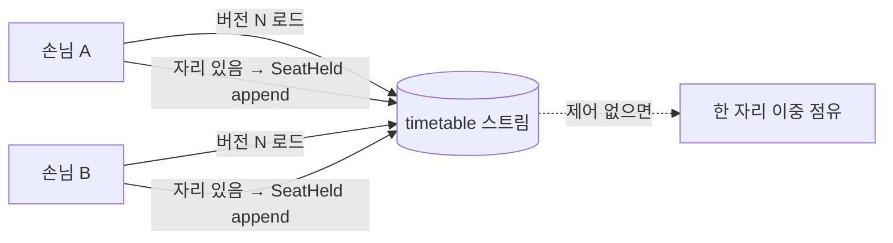
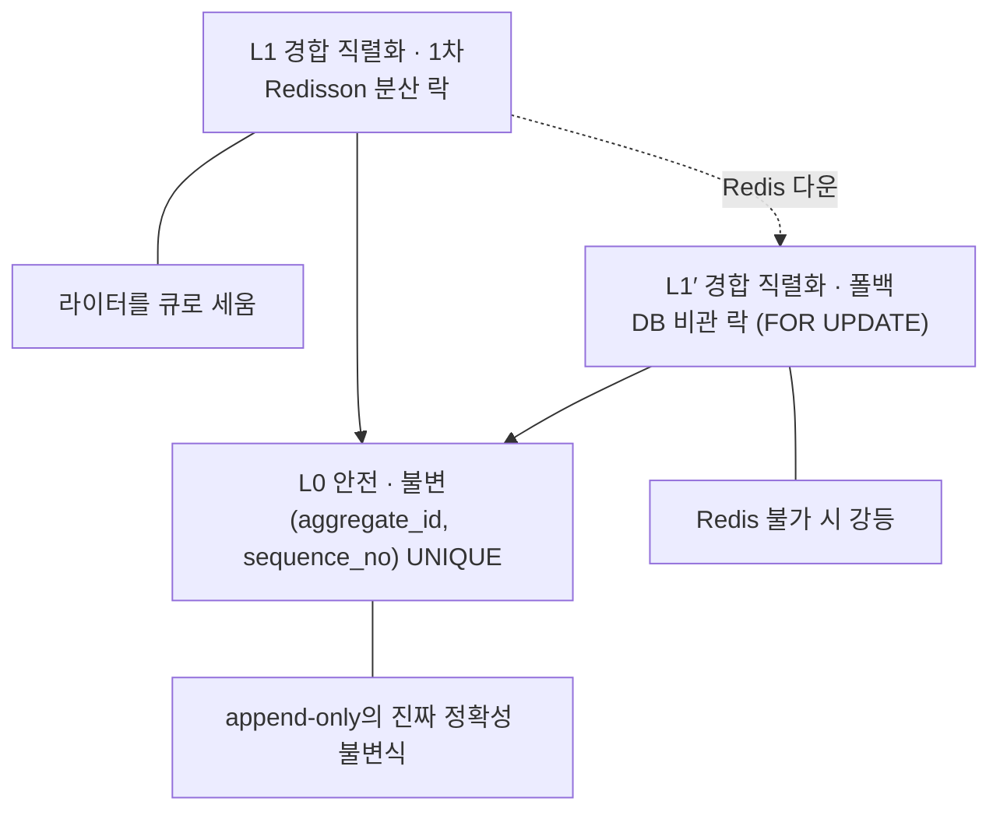

# RFC-014 — 애그리거트 동시성·쓰기 경합 제어

- **상태**: 🏷 합의 (2026-06-17) · 비관 락 전환 — 원안(낙관, 2026-06-16)은 비관 락 결정이 supersede · ADR [[16.optimistic-concurrency-control]] 재작성
- **선행**: [[RFC-001-v2-cqrs-and-event-sourcing]] · 인덱스 [[RFC-INDEX]]
- **계기(재개)**: 전수 감사 [[04-design-completeness-audit]] ① 처리 중 동시성 재검토 + Redisson 활용 결정
- **닫으면**: [[05-aggregate-design]] 보강 + [[16.optimistic-concurrency-control]] 재작성(비관 락)

---

## 배경 (Background)

### 시나리오: 두 손님이 같은 7시 테이블을 동시에 노린다

**V1에서는 이렇게 흐른다.**
예약 하나를 만드는 건 사실상 DB 트랜잭션 하나였다([[RFC-006-saga-process-manager]] 맥락). 자리를 확인하고 잡는 일이 한 트랜잭션 안에서 일어났으니, 두 손님이 같은 자리를 동시에 노려도 행 잠금과 유니크 제약이 경합을 막아 줬다 — 한쪽이 행을 잡고 있는 동안 다른 쪽은 기다리고, 유니크 제약을 두 번째로 건드린 쪽이 거절됐다. 동시성은 DB가 알아서 막아 줬고, 우리는 그 위에 얹혀만 있었다.

**V2의 ES 컨텍스트에서는 그 잠글 행이 없다.**
애그리거트의 현재 상태는 테이블에 박힌 한 행이 아니라 이벤트 스트림을 리플레이해 메모리에서 재구성한 결과다([[02-write-model]]). 쓰기는 그 상태를 갱신하는 게 아니라 스트림 끝에 새 이벤트를 *append*하는 것뿐이다. 갱신할 행이 없으니 잠글 행도 없다. 그러면 경합은 누가 막는가.

구체적으로 이렇게 깨진다.

1. 두 손님이 같은 7시 테이블을 동시에 예약한다.
2. 둘 다 `timetable` 애그리거트를 버전 N에서 로드한다(같은 N개의 이벤트를 리플레이한다).
3. 둘 다 "자리 있음"으로 판단한다 — 둘 다 같은 과거만 봤으니.
4. 둘 다 `SeatHeld`를 append한다.
5. 제어가 없으면 스트림에 `SeatHeld`가 둘 붙고, 한 자리가 두 번 점유된다. V1이라면 행 잠금이 막았을 이중 점유가, append-only에서는 그냥 통과한다.



### 무엇으로 막나 — 잠그되 믿지 않는 3층

이 경합을 막는 방법은 둘로 갈린다. 잠그지 않고 *충돌한 뒤에* 거절하는 **낙관적** 길(append 시점에 버전이 어긋나면 거절)과, 읽기 전에 잠가 다른 라이터를 *기다리게* 하는 **비관적** 길이다. 본 RFC는 처음 낙관을 택했다가 **비관 락 + UNIQUE 백스톱의 3층 구조**로 전환했다.



| 개념 | V1 | V2(이 RFC) | 한 줄 정의 |
|------|-----|-----------|-----------|
| **동시성 제어** | DB 행 락 + UNIQUE | Redisson 락(또는 DB 락 폴백) + UNIQUE | "경합을 큐로 세우되 UNIQUE가 최종 심판" |
| **낙관 vs 비관** | (행 락 = 비관) | 비관 락 채택, 낙관은 supersede | "잠그고 한 줄로 세운다" |
| **expected-version** | (행 갱신) | `(aggregate_id, sequence_no)` UNIQUE | "같은 버전 위에 두 쓰기는 성공 못 함" |

---

## 맥락 (Context)

[[RFC-001-v2-cqrs-and-event-sourcing]]에서 쓰기 모델의 진실 원천을 append-only 이벤트 스토어로 잡으면서, V1이 DB 행 락으로 공짜로 받던 단일 라이터 보장이 사라졌다. [[05.event-store-mysql-table]]는 이 자리를 "기대 시퀀스로 append, `(aggregate_id, sequence_no)` UNIQUE 위반 시 재시도"라는 한 줄로 메워 뒀다. 그 한 줄이 끌고 오는 긴장이 이 RFC의 출발점이다.

- **낙관(원안)은 핫 스트림에서 무너진다.** 원안은 비관 락을 "경합 없어도 항상 직렬화 비용"으로 기각하고 낙관을 택했으나, 스스로 트레이드오프로 **핫 스트림 retry storm/라이브락**을 자인했다([[04-design-completeness-audit]]의 "리플레이 상한 없음"도 같은 신호). → 인기 슬롯 경합이 곧 핫 스트림인 예약 도메인에서, N명이 동시에 리플레이→충돌→재시도하는 낭비가 정확성·관측성 모두를 해친다.
- **자산 — Redisson이 이미 인프라에 있다.** [[19.caching-redis-role]]가 Redisson을 이미 provision해 뒀다. → "평소 공짜"라는 낙관의 이득은 측정할 트래픽이 없는 학습 프로토타입에서 실재하지 않고, 분산 락을 직접 겪는 학습가치가 더 크다. 낭비를 **질서 있는 큐**로 바꾸고 둘째 이후를 **재시도 없이 확정적으로 거절**하는 편이 낫다.
- **자산 — command DB는 어차피 필수다.** 이벤트 append에 command DB가 이미 하드 의존이다. → Redis 다운 시 DB 비관 락으로 폴백해도 **새 하드 의존이 0**이라, 락을 쓰기 경로 필수로 박아도 쓰기 가용성을 단일 Redis에 묶지 않을 길이 있다.
- **제약 — Redis는 손실 허용·단일 인스턴스다.** [[19.caching-redis-role]]가 Redis를 **단일 인스턴스·손실 허용·`allkeys-lru`**로 확정했다. → Redisson 락은 키 evict·페일오버·리스 만료·GC pause 중 풀릴 수 있어 **safety(정확성) 보장이 아니라 liveness(경합 완화) 도구일 뿐**이다.

핵심 긴장 — **잠그되 믿지 않는다: Redisson(또는 Redis 다운 시 DB)으로 라이터를 한 줄로 세워 경합을 소거하되, 락은 안전장치가 아니므로 `(aggregate_id, sequence_no)` UNIQUE를 절대 제거하지 않고 최종 심판으로 남긴다. 그리고 이 모든 제어는 단일 애그리거트 경계 안에서만 끝나고, 경계를 넘는 일관성은 락이 아니라 사가가 흡수한다.**

---

## Goal / Non-goal

**Goal**
- ES 쓰기 경로에서 단일 `aggregate_id`의 동시 쓰기 경합을 직렬화하는 제어 계층을 정한다.
- 락이 풀려도 이중 점유가 새지 않게 하는 안전 불변식(UNIQUE 백스톱)을 못박는다.
- Redis 다운 시에도 쓰기 가용성과 비관 의미론을 유지하는 폴백을 정한다.
- 충돌 처리(흡수 vs 표면화)의 경계와 남는 충돌 표면을 정한다.

**Non-goal (이번에 하지 않음)**
- 애그리거트 경계(granularity)를 *긋는* 일 — 불변식 경계로 식별되는 도메인 결정으로 [[05-aggregate-design]]·이벤트 스토밍에 위임. 이 RFC는 그 경계가 동시성에 갖는 의미만 명시.
- 교차 애그리거트 일관성을 동시성 제어로 푸는 것 — 사가([[RFC-006-saga-process-manager]])의 몫.
- 비-ES(상태+Outbox) 컨텍스트의 동시성 — V1과 동일하게 DB 행 락 그대로.
- 요청 멱등·전달 멱등의 결정 자체 — 각 [[RFC-012-command-query-api-contract]]·[[RFC-003-messaging-delivery]]에 있음(여기선 경계만 선언).

---

## 논의 (Discussion)

### 논점 1. 낙관이냐 비관이냐 → [[16.optimistic-concurrency-control]]

**맥락에서 나온 질문.** append할 행이 없는 ES에서 단일 라이터를 누가 보장하나(맥락 전반). 원안은 낙관을 택했는데, 그것을 유지할 것인가 뒤집을 것인가.

검토한 선택지:
- **낙관(원안)** — 잠그지 않고 append 시점에 버전이 어긋나면 거절. 충돌이 없으면 비용 0, 충돌 시에만 거절·재시도 비용. **약점**: 인기 슬롯 한 줌에 몰리는 예약 경합에서 핫 스트림 retry storm/라이브락.
- **비관(채택)** — 단일 `aggregate_id`를 락으로 잡아 라이터를 큐로 세운다. 평소에도 락 획득 비용을 내지만 둘째 이후를 재시도 없이 확정적으로 거절. **약점**: 경합 없어도 직렬화 비용.

**내 의견(AI):** 낙관의 "평소 공짜" 이득은 측정할 트래픽이 없는 학습 프로토타입에서 실재하지 않는다. 반면 인기 슬롯 경합이 곧 핫 스트림인 예약 도메인에서, N명이 동시에 리플레이→충돌→재시도하는 낭비를 질서 있는 큐로 바꾸고 둘째 이후를 확정적으로 거절하는 편이 정확성·관측성 모두 낫다. Redisson이 이미 [[19.caching-redis-role]]로 provision돼 있어 분산 락을 직접 겪는 학습가치도 크다. 평소 락 획득 비용은 수용한다.

**네 결정:** 비관 락으로 전환. 원안(낙관)은 supersede하되 원 분석은 "왜 처음에 낙관을 택했고 무엇을 뒤집는가"의 사료로 보존. 〔근거 확인/보강 필요〕

**결론:** 비관 락 채택. 단 "비관 대신 낙관"이 아니라 "비관 락을 UNIQUE 앞단에 — UNIQUE는 안전망으로 잔존"이다(논점 2). (이의 여지: 멱등 3층 분리·"교차는 사가"·granularity 위임은 원안에서 그대로 계승 — 논점 5·6·7.)

### 논점 2. 락이 풀려도 이중 점유를 막는 안전 불변식은 무엇인가 → [[16.optimistic-concurrency-control]]

**맥락에서 나온 질문.** Redis는 단일 인스턴스·손실 허용·`allkeys-lru`로 확정됐다(맥락 제약). 그러면 Redisson 락은 키 evict·페일오버·리스 만료·GC pause 중 풀려 두 라이터가 같은 `N+1`을 적을 수 있다 — 그게 원안이 막던 이중 점유다. 락만 믿어도 되나.

**내 의견(AI):** Redisson 분산 락은 **liveness(경합 완화)** 도구지 **safety(정확성)** 보장이 아니다. 따라서 [[05.event-store-mysql-table]]의 `(aggregate_id, sequence_no)` UNIQUE를 **L0 안전 불변식**으로 절대 제거하지 않는다 — append-only 스토어의 진짜 정확성 불변식이다. 어떤 락을 얹든 둘째 append는 UNIQUE로 거절되어 충돌 경로로 흡수된다. 락을 떼고 Redisson만 믿으면 이중 점유가 부활한다.

**네 결정:** L0 = `(aggregate_id, sequence_no)` UNIQUE를 불변으로 항상 유지, 락 계층과 독립한 최종 심판. 〔근거 확인/보강 필요〕

**결론:** UNIQUE는 백스톱으로 잔존한다. 락(L1)이 경합을 *완화*하고, UNIQUE(L0)가 정확성을 *보장*한다. (이의 여지: append 경로의 시퀀스 채번을 한 곳으로 모아 이 자리의 UNIQUE 위반이 *항상* 동시성 충돌로만 발생하도록 좁히는 것, 스냅샷이 낀 로드의 expected-version 계산[스냅샷 버전 + 이후 이벤트 수]은 Design.)

### 논점 3. Redis가 다운되면 쓰기 가용성을 어떻게 지키나 → [[16.optimistic-concurrency-control]]

**맥락에서 나온 질문.** 락을 쓰기 경로 필수로 박으면(논점 1) 쓰기 가용성이 단일 Redis에 묶인다. command DB는 어차피 필수라는 자산(맥락)을 어떻게 쓰나.

검토한 선택지:
- **낙관으로 회귀** — Redis 다운 시 비관을 버리고 낙관 재시도로. 의미론이 갈려 일관성이 흔들린다.
- **DB 비관 락 폴백(채택)** — Redis 불가 시 command DB의 per-aggregate lock-row를 `SELECT … FOR UPDATE`로 잡는다(트랜잭션 스코프 자동 해제). 비관 의미론 유지, 새 하드 의존 0.

**내 의견(AI):** DB 폴백이 낙관 회귀보다 강하다 — 비관 의미론을 유지하기 때문이다. command DB는 이벤트 append에 어차피 필수라 새 하드 의존이 없다. 락 제공자만 Redis→DB로 강등할 뿐, **낙관으로 회귀하지 않는다.** 전환 창에 일부 노드는 Redisson, 일부는 DB 락을 쓰는 dual-provider split-brain이 생길 수 있으나, 그 창의 정확성은 L0 UNIQUE가 흡수한다(둘째 append가 UNIQUE로 거절→충돌 경로). split-brain은 *비효율*(일시 재시도)일 뿐 *부정확*이 아니다 — UNIQUE를 백스톱으로 유지하는 또 하나의 이유다.

**네 결정:** Redis 불가 시 DB 비관 락(per-aggregate lock-row `FOR UPDATE`)으로 폴백, 락 제공자만 강등, 낙관 회귀 없음(사용자 결정 2026-06-17). 〔근거 확인/보강 필요〕

**결론:** L1′ = DB 비관 락 폴백. 가용성을 단일 Redis에 묶지 않으면서 비관 의미론 유지, split-brain의 정확성은 L0가 흡수. (이의 여지: DB 폴백 lock-row 스키마·트랜잭션 스코프·`FOR UPDATE` 경합 동작, Redis up/down 판정[서킷 브레이커]과 폴백 전환 창 처리, split-brain의 UNIQUE 흡수 검증은 Design. Redisson 락 키 포맷[`{aggregate_type}:{aggregate_id}`]·리스 TTL·watchdog 자동 연장도 Design.)

### 논점 4. 충돌이 나면 — 서버가 삼키나, 호출자에게 알리나 → [[16.optimistic-concurrency-control]]

**맥락에서 나온 질문.** 락 보유로 동시 충돌이 대부분 소거되지만(논점 1·3) 잔여 충돌은 남는다. 원안의 "흡수 vs 409"는 어떻게 축소되나.

**내 의견(AI):** 둘을 섞되 경계를 **도메인 판단이 바뀌느냐**로 긋는다. 충돌은 두 종류다 — *재판단해도 결과가 같은 충돌*은 서버가 짧은 횟수의 바운디드 재시도(재로드→재append)로 흡수하고(클라가 영문도 모르고 같은 요청을 다시 보낼 뿐이므로), *재판단하면 결과가 뒤집히는 충돌*(7시 자리 경합 — 먼저 들어온 쪽이 `SeatHeld`를 적고 나면 둘째는 "자리 없음"으로 판단이 뒤집힘)은 클라에 알린다. 무한정 재시도해 봐야 자리는 안 생긴다. [[RFC-012-command-query-api-contract]]의 "락 충돌 409는 재시도 신호"에 한 겹을 더한다 — 흡수되는 충돌은 클라가 아예 보지 않고, 흡수 한도를 넘기거나 판단이 뒤집힌 경합만 409로 올라간다. 락 보유로 동시 충돌이 대부분 소거되므로 이 잔여 표면은 셋으로 좁아진다.

남는 충돌 표면:
- **lock-wait 타임아웃**(앞 라이터가 점유 중, 한도 내 미획득) → 호출자에 재시도 신호(409/503 + retry-after).
- **도메인 거절**(락 잡고 reload하니 "자리 없음", 판단 뒤집힘) → 422/409, 재시도 storm 없이 확정적.
- **잔여 UNIQUE 위반**(락 유실·split-brain edge) → 동시성 충돌로 흡수(바운디드 재시도/409). 드물지만 경로는 반드시 존재(L0가 발동하는 자리).

**네 결정:** 서버 흡수(바운디드 재시도) vs 409 표면화의 경계 = 도메인 판단이 뒤집히느냐, 흡수 한도 소진·판단 뒤집힘만 409. 〔근거 확인/보강 필요〕

**결론:** 잔여 충돌은 위 세 표면으로 축소되고, 흡수/표면화 경계는 도메인 판단 변화로 긋는다. (이의 여지: 바운디드 재시도 횟수·백오프, "도메인 판단이 뒤집히는 충돌"의 판정, [[RFC-012-command-query-api-contract]] 202 비동기 모델 안에서 흡수·409 노출 시점[요청 처리 중이냐 결과 조회 시점이냐], lock-wait 타임아웃 응답 코드와 잔여 UNIQUE 충돌의 `DuplicateKeyException`→충돌 매핑은 Design.)

### 논점 5. 락 재시도 흐름이 요청 멱등도 흡수하나 → [[16.optimistic-concurrency-control]]

**맥락에서 나온 질문(2026-06-23 추가).** UNIQUE 위반(충돌) 후 서버 재로드→재판단 흐름(논점 4)은 동시성 경합만 처리하나, 아니면 요청 멱등(중복 제출)도 자연스럽게 커버하나.

```
UNIQUE 위반
  → 재로드 (최신 버전으로)
  → 도메인 재판단
    → 판단 동일 (이미 같은 상태 전이가 완료됨) → 흡수 → 성공
    → 판단 뒤집힘 (다른 command가 먼저 변경)    → 409
```

**내 의견(AI):** 이 흐름은 요청 멱등도 자연스럽게 커버한다. "클라이언트가 응답을 못 받고 재시도"(요청 멱등 케이스)도 도메인의 자연 멱등("이미 취소된 예약을 다시 취소 → no-op")과 결합해 서버에서 조용히 흡수된다. 즉 UNIQUE 위반이 "동일 command 재시도(멱등)"인지 "경합하는 다른 command"인지를 서버가 명시적으로 구분하지 않아도, 재판단 결과가 그 구분을 대신한다. 단, 이 흡수가 성립하려면 **재로드→재판단 흐름이 반드시 실행**되어야 한다 — UNIQUE 위반을 곧장 409로 노출하면 멱등 케이스까지 클라에 튕겨진다.

각 멱등 층과의 관계:
- **요청 멱등([[RFC-012-command-query-api-contract]])** "상태 전이 자연 멱등 + 버전 가드": 버전 가드(UNIQUE)가 충돌을 감지하고 재판단에서 자연 멱등이 흡수 — 두 메커니즘이 순서대로 협력.
- **전달 멱등([[RFC-003-messaging-delivery]])**: 이 흐름과 독립. append 이후 이벤트의 중복 전달은 별도 층(inbox/upsert)이 막는다.

**네 결정:** 락 재시도 흐름이 요청 멱등을 커버함을 명시, "바운디드 재시도" 구현 시 재로드→재판단 흐름을 빠뜨리지 않는 것을 핵심 구현 제약으로 둠. 〔근거 확인/보강 필요〕

**결론:** UNIQUE 위반의 재로드→재판단 흐름은 동시성 경합과 요청 멱등을 함께 흡수한다. (이의 여지: 이 흐름을 빠뜨리지 않는 구현은 Design — 논점 4의 바운디드 재시도와 같은 자리.)

### 논점 6. 핫 애그리거트 경합 — 직렬화를 받아들이되 어디까지 완화하나 → [[05-aggregate-design]]

**맥락에서 나온 질문.** 비관 락으로 라이터를 큐로 세우면(논점 1) 인기 슬롯 하나가 곧 핫 스트림 하나라 그 슬롯의 모든 시도가 같은 스트림에서 직렬화된다. 이 직렬화를 받아들이나, 완화하나.

**내 의견(AI):** 직렬화 자체는 받아들인다 — 한 자리에 대한 결정이 한 줄로 서야 이중 점유가 안 나므로, 직렬화는 버그가 아니라 정확성의 근거다. 그걸 깨면서 처리량을 사는 건 본말이 전도된 것이다. 다만 같은 정확성을 유지하며 경합을 줄이는 길은 있다 — **스트림 granularity를 더 잘게 잡는 것**. "한 식당의 하루 전체 타임테이블"이 한 애그리거트면 모든 예약이 한 스트림에 직렬화되지만, "슬롯(시각×테이블) 하나"가 한 애그리거트면 다른 슬롯의 예약은 다른 스트림이라 동시에 진행된다 — 직렬화가 진짜 경합하는 그 한 자리로 좁혀진다. 다만 **애그리거트 경계를 어디로 잡을지는 동시성 RFC가 결정할 사안이 아니다.** 그건 불변식 경계로 식별되는 도메인 결정이고([[05-aggregate-design]] 가이드 1·2: 불변식 경계로 식별, 작게 유지), 이벤트 스토밍이 굳어야 답이 나온다. 내가 할 수 있는 건 요구사항을 도메인 트랙에 넘기는 것까지다.

**네 결정:** 직렬화는 정확성 근거로 수용, 완화는 granularity로만(도메인 판단을 바꾸지 않는 선까지), 락 단위 = 애그리거트 = 직렬화 단위. 〔근거 확인/보강 필요〕

**결론:** "애그리거트가 곧 동시성 직렬화 단위다 — 핫스팟이 예상되는 경계(슬롯·좌석)는 경합 범위를 줄이는 방향으로 잘게 식별하라"를 [[05-aggregate-design]]·이벤트 스토밍에 위임. (이의 여지: 너무 잘게 쪼개면 "한 식당 안에서 동시에 N석까지만" 같은 교차-슬롯 불변식을 한 애그리거트로 못 지켜 사가로 떠넘겨야 한다 — granularity는 경합과 교차 불변식 사이의 트레이드오프, 균형점은 카탈로그와 함께 [[05-aggregate-design]] Design.)

### 논점 7. 교차 애그리거트 불변식은 락이 아니라 무엇이 흡수하나 → [[RFC-006-saga-process-manager]]

**맥락에서 나온 질문.** 이 제어는 *한 애그리거트 스트림 안의* 단일 라이터만 보장한다(논점 1·2·6). 여러 애그리거트에 걸친 불변식 — "결제와 예약 확정이 함께 성립", "한 식당에서 동시에 정원 이상 예약 불가" — 은 누가 지키나.

**내 의견(AI):** 한 스트림의 UNIQUE 제약은 다른 스트림을 모른다. 그렇다고 교차 일관성을 **전역 락**으로 풀어선 안 된다 — 전역 락은 여러 스트림을 한꺼번에 잠가 처리량을 죽이고, 애그리거트를 작게 유지해 경합을 줄인다는 [[05-aggregate-design]] 원칙과 정면으로 부딪치며, V2가 컨텍스트를 쪼갠 이유([[RFC-001-v2-cqrs-and-event-sourcing]])를 스스로 무른다. **이 RFC의 동시성 제어는 애그리거트 경계 안에서 끝나고, 경계를 넘는 일관성은 사가([[RFC-006-saga-process-manager]])가 보상 기반으로 흡수한다.** 예약 라이프사이클이 정확히 그 모양이다 — 점유(`timetable`)·결제(`payment`)·확정(`reservation`)이 각자 자기 스트림에서 쓰고, 단계 간 어긋남(타임아웃·실패)은 PM이 `SeatReleased`·`PaymentRefunded` 보상으로 되감는다. 즉시 일관성(한 애그리거트)은 락, 최종 일관성(여러 애그리거트)은 사가 — 둘의 경계가 곧 애그리거트 경계다. [[09.event-ordering-and-delivery-guarantee]]도 "전역 순서가 필요하면 사가로 풀라"고 같은 선을 그었다.

**네 결정:** 교차 애그리거트 일관성은 사가로 위임, 전역 락 금지, 락 범위 = 단일 `aggregate_id`만(원안 계승). 〔근거 확인/보강 필요〕

**결론:** 동시성 제어는 애그리거트 경계 안에서 끝나고 교차 불변식은 사가가 흡수한다. (이의 여지: 사가는 보상이 *결국* 도는 최종 일관성이라 보상이 도는 잠깐 동안 교차 불변식이 깨진 상태가 노출될 수 있다[환불 직전의 이중 차감 등]. 이 노출 창을 도메인이 견딜 수 있는지는 흐름별로 [[RFC-006-saga-process-manager]]·[[06-consistency-and-sagas]] Design — 견딜 수 없는 불변식이면 애초에 한 애그리거트 안에 들어가야 한다는 신호.)

### 논점 8. 멱등·중복 전달과 동시성 충돌은 같은 층인가

**맥락에서 나온 질문.** 동시성 충돌·요청 멱등·전달 멱등이 같은 409·중복 언저리에서 헷갈린다(논점 4·5에서 계속 손이 맞물렸다). 한 메커니즘이 다른 둘을 대신할 수 있나.

**내 의견(AI):** 셋은 *서로 다른 문제*고 *각자 따로* 필요하다 — 층위를 분명히 갈라 둔다.
- **동시성 충돌(이 RFC)** — *서로 다른* 두 요청이 *같은 버전* 위에 동시에 쓰려 할 때. expected-version UNIQUE가 막는다. 막는 대상: 이중 점유 같은 *경합*.
- **요청 멱등([[RFC-012-command-query-api-contract]])** — *같은* 요청이 두 번 들어올 때(더블클릭·재시도). 도메인이 흡수(상태 전이는 자연 멱등 + 버전 가드, 생성은 도메인 유니크 불변식). 막는 대상: 같은 의도의 *중복 제출*. 상태 전이 멱등은 *바로 이 RFC의 버전 가드*에 일부 기댄다 — 두 RFC가 손을 맞잡지만 푸는 문제는 다르다.
- **전달 멱등([[RFC-003-messaging-delivery]])** — *append된 뒤*의 이벤트가 브로커를 거쳐 *두 번 전달*될 때. inbox / Zero Payload upsert가 흡수(effectively-once). 막는 대상: 프로젝션 *오염*.

한 줄로: 동시성 충돌은 **쓰기 경합**(write 시점, command DB), 요청 멱등은 **중복 제출**(요청 진입, HTTP), 전달 멱등은 **중복 전달**(append 이후, 메시징). 같은 예약 한 건이 이 셋을 차례로 다 통과한다 — 어느 하나가 다른 둘을 대신하지 못한다.

**네 결정:** 세 층을 경계로 선언, 각각의 결정은 각 RFC에 둠(이 절은 결정이 아니라 경계 선언). 〔근거 확인/보강 필요〕

**결론:** 동시성 충돌 ≠ 요청 멱등 ≠ 전달 멱등 — 다른 시점·다른 메커니즘·다른 막는 대상. (이의 여지 없음 — 경계 선언이며 셋 각각의 결정은 [[RFC-012-command-query-api-contract]]·[[RFC-003-messaging-delivery]]에 있다.)

---

## 결정 요약

| # | 결정 | ADR |
|---|------|-----|
| 1 | **비관 락 채택**(원안 낙관은 supersede) — 핫 스트림 retry storm을 질서 있는 큐로 | [[16.optimistic-concurrency-control]] |
| 2 | **L0 안전 = `(aggregate_id, sequence_no)` UNIQUE 불변 유지** — 락은 liveness, UNIQUE가 정확성 최종 심판 | [[16.optimistic-concurrency-control]] · [[05.event-store-mysql-table]] |
| 3 | **L1 = Redisson 분산 락, L1′ = Redis 다운 시 DB 비관 락(`FOR UPDATE`) 폴백** — 락 제공자만 강등, 낙관 회귀 없음 | [[16.optimistic-concurrency-control]] · [[19.caching-redis-role]] |
| 4 | 충돌 처리 = **도메인 판단 변화로 흡수/409 경계**, 잔여 표면 셋(lock-wait 타임아웃·도메인 거절·잔여 UNIQUE) | [[16.optimistic-concurrency-control]] · [[RFC-012-command-query-api-contract]] |
| 5 | 락 재시도(재로드→재판단) 흐름이 **요청 멱등도 흡수** — 흐름 누락 금지가 핵심 구현 제약 | [[16.optimistic-concurrency-control]] · [[RFC-012-command-query-api-contract]] |
| 6 | 핫 애그리거트 = **직렬화 수용**, 완화는 granularity로만, 경계 식별은 도메인에 위임 | [[05-aggregate-design]] |
| 7 | 교차 애그리거트 불변식 = **사가가 흡수, 전역 락 금지**, 락 범위 = 단일 `aggregate_id` | [[RFC-006-saga-process-manager]] · [[09.event-ordering-and-delivery-guarantee]] |
| 8 | 동시성 충돌 ≠ 요청 멱등 ≠ 전달 멱등 — **세 층 경계 선언** | [[RFC-012-command-query-api-contract]] · [[RFC-003-messaging-delivery]] |

상세 설계는 [[05-aggregate-design]] · [[02-write-model]] 참조.

---

## 결과 (목표 동시성 제어 요약)

```mermaid
graph LR
    W[라이터] -->|① 락 획득| LK{Redis up?}
    LK -->|yes| RD[Redisson 락<br/>L1]
    LK -->|no| DB[DB 비관 락 FOR UPDATE<br/>L1′]
    RD -->|② reload→재판단| AP[append N+1]
    DB -->|② reload→재판단| AP
    AP -->|③ UNIQUE 검사| U[(aggregate_id, sequence_no)<br/>UNIQUE · L0]
    U -. 위반 .-> C[충돌: 흡수 or 409]
    AP -. 교차 불변식 .-> SAGA[사가 보상]
```

- **L0(안전·불변)**: `(aggregate_id, sequence_no)` UNIQUE가 락과 독립한 최종 심판 — 어떤 락을 얹어도 제거하지 않는다.
- **L1/L1′(경합 직렬화)**: Redis 정상 시 Redisson 락으로 라이터를 큐로, Redis 다운 시 DB 비관 락으로 폴백(낙관 회귀 없음). split-brain의 정확성은 L0가 흡수.
- **충돌 처리**: 락으로 동시 충돌 대부분 소거, 잔여는 lock-wait 타임아웃·도메인 거절·잔여 UNIQUE 셋. 흡수/409 경계는 도메인 판단 변화로. 재로드→재판단 흐름이 요청 멱등도 함께 흡수.
- **경계**: 락 범위 = 단일 `aggregate_id`. 교차 애그리거트는 락이 아니라 사가([[RFC-006-saga-process-manager]]). 동시성 충돌·요청 멱등·전달 멱등은 다른 층.

한 줄 요약 — **"잠그되 믿지 않는다 — Redisson(또는 Redis 다운 시 DB)으로 한 줄로 세우고, `(aggregate_id, sequence_no)` UNIQUE가 최종 심판. 교차는 여전히 사가."**

상세 라이프사이클·시퀀스는 [[05-aggregate-design]] · [[02-write-model]] 참조.

---

## 관련 문서

- 인덱스/계승: [[RFC-INDEX]] · [[RFC-001-v2-cqrs-and-event-sourcing]]
- 연관 RFC: [[RFC-006-saga-process-manager]] · [[RFC-012-command-query-api-contract]] · [[RFC-003-messaging-delivery]]
- 설계: [[02-write-model]] · [[05-aggregate-design]] · [[06-consistency-and-sagas]] · [[04-design-completeness-audit]]
- ADR: [[16.optimistic-concurrency-control]] · [[05.event-store-mysql-table]] · [[09.event-ordering-and-delivery-guarantee]] · [[19.caching-redis-role]]
