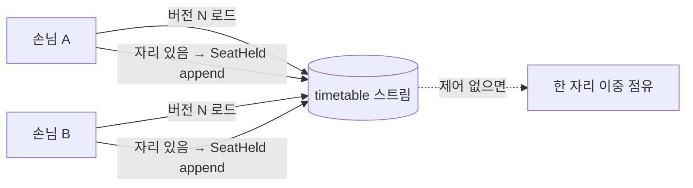
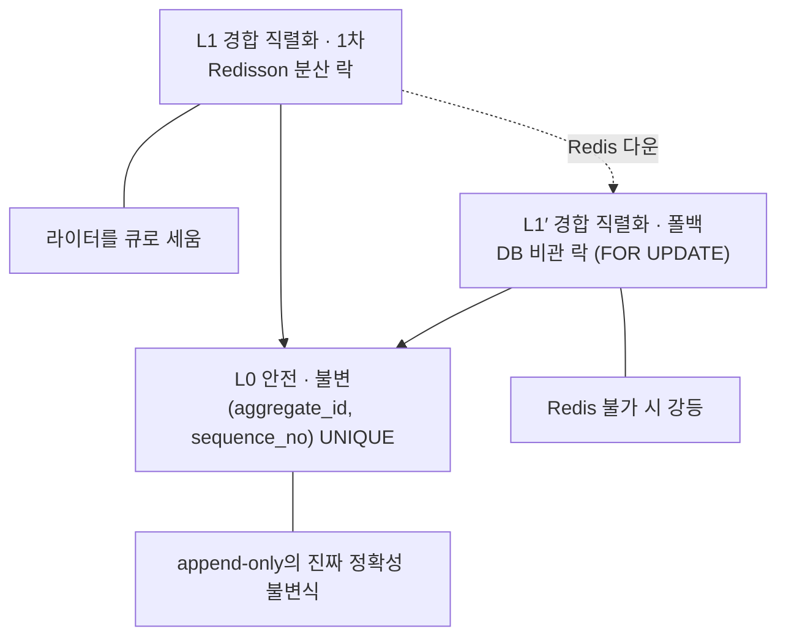

# RFC-014 — 애그리거트 동시성·쓰기 경합 제어

- **상태**: 🏷 합의 (2026-06-29) · 비관 락 전환 — 원안(낙관)은 supersede
- **선행**: [[RFC-001-v2-cqrs-and-event-sourcing]] · 인덱스 [[RFC-INDEX]]
- **계기(재개)**: 전수 감사 [[04-design-completeness-audit]] ① 처리 중 동시성 재검토 + Redisson 활용 결정

---

## 배경 (Background)

### 시나리오: 두 손님이 같은 7시 테이블을 동시에 노린다

**V1에서는 이렇게 흐른다.**
예약 하나를 만드는 건 사실상 DB 트랜잭션 하나였다([[RFC-006-saga-process-manager]] 맥락). 자리를 확인하고 잡는 일이 한 트랜잭션 안에서 일어났으니, 두 손님이 같은 자리를 동시에 노려도 행 잠금과 유니크 제약이 경합을 막아 줬다 — 한쪽이 행을 잡고 있는 동안 다른 쪽은 기다리고, 유니크 제약을 두 번째로 건드린 쪽이 거절됐다. 동시성은 DB가 알아서 막아 줬고, 우리는 그 위에 얹혀만 있었다.

**V2의 ES 컨텍스트에서는 그 잠글 행이 없다.**
애그리거트의 현재 상태는 테이블에 박힌 한 행이 아니라 이벤트 스트림을 리플레이해 메모리에서 재구성한 결과다([[02-write-model]]). 쓰기는 그 상태를 갱신하는 게 아니라 스트림 끝에 새 이벤트를 *append*하는 것뿐이다. 갱신할 행이 없으니 잠글 행도 없다. 그러면 경합은 누가 막는가.

구체적으로 이렇게 깨진다.

1. 두 손님이 같은 7시 테이블을 동시에 예약한다.
2. 둘 다 `timetable` 애그리거트를 버전 N에서 로드한다(같은 N개의 이벤트를 리플레이한다).
3. 둘 다 "자리 있음"으로 판단한다 — 둘 다 같은 과거만 봤으니.
4. 둘 다 `SeatHeld`를 append한다.
5. 제어가 없으면 스트림에 `SeatHeld`가 둘 붙고, 한 자리가 두 번 점유된다. V1이라면 행 잠금이 막았을 이중 점유가, append-only에서는 그냥 통과한다.



### 무엇으로 막나 — 잠그되 믿지 않는 3층

이 경합을 막는 방법은 둘로 갈린다. 잠그지 않고 *충돌한 뒤에* 거절하는 **낙관적** 길(append 시점에 버전이 어긋나면 거절)과, 읽기 전에 잠가 다른 라이터를 *기다리게* 하는 **비관적** 길이다. 본 RFC는 처음 낙관을 택했다가 **비관 락 + UNIQUE 백스톱의 3층 구조**로 전환했다.



| 개념 | V1 | V2(이 RFC) | 한 줄 정의 |
|------|-----|-----------|-----------|
| **동시성 제어** | DB 행 락 + UNIQUE | Redisson 락(또는 DB 락 폴백) + UNIQUE | "경합을 큐로 세우되 UNIQUE가 최종 심판" |
| **낙관 vs 비관** | (행 락 = 비관) | 비관 락 채택, 낙관은 supersede | "잠그고 한 줄로 세운다" |
| **expected-version** | (행 갱신) | `(aggregate_id, sequence_no)` UNIQUE | "같은 버전 위에 두 쓰기는 성공 못 함" |

---

## 맥락 (Context)

[[RFC-001-v2-cqrs-and-event-sourcing]]에서 쓰기 모델을 append-only 이벤트 스토어로 잡으면서, V1이 DB 행 락으로 공짜로 받던 단일 라이터 보장이 사라졌다. [[05.event-store-mysql-table]]가 `(aggregate_id, sequence_no)` UNIQUE로 메워 뒀지만, 낙관 락은 충돌 시 리플레이→재시도 비용이 높다 — 인기 슬롯 경합이 빈번한 예약 도메인에서 핫 스트림 retry storm이 문제다. Redisson이 이미 인프라에 있고([[19.caching-redis-role]]), command DB도 어차피 필수이므로 폴백 경로도 열려 있다. 단, Redis는 단일 인스턴스·손실 허용이라 락이 풀릴 수 있으므로 UNIQUE를 최종 안전망으로 유지해야 한다.

핵심 — **잠그되 믿지 않는다: Redisson(또는 DB)으로 경합을 직렬화하되, `(aggregate_id, sequence_no)` UNIQUE가 최종 심판. 제어는 단일 애그리거트 경계 안에서만, 교차는 사가.**

---

## Goal / Non-goal

**Goal**
- ES 쓰기 경로에서 단일 `aggregate_id`의 동시 쓰기 경합을 직렬화하는 제어 계층을 정한다.
- 락이 풀려도 이중 점유가 새지 않게 하는 안전 불변식(UNIQUE 백스톱)을 못박는다.
- Redis 다운 시에도 쓰기 가용성과 비관 의미론을 유지하는 폴백을 정한다.
- 충돌 처리(흡수 vs 표면화)의 경계와 남는 충돌 표면을 정한다.

**Non-goal (이번에 하지 않음)**
- 애그리거트 경계(granularity)를 *긋는* 일 — 불변식 경계로 식별되는 도메인 결정으로 [[05-aggregate-design]]·이벤트 스토밍에 위임. 이 RFC는 그 경계가 동시성에 갖는 의미만 명시.
- 교차 애그리거트 일관성을 동시성 제어로 푸는 것 — 사가([[RFC-006-saga-process-manager]])의 몫.
- 비-ES(상태+Outbox) 컨텍스트의 동시성 — V1과 동일하게 DB 행 락 그대로.
- 요청 멱등·전달 멱등의 결정 자체 — 각 [[RFC-012-command-query-api-contract]]·[[RFC-003-messaging-delivery]]에 있음(여기선 경계만 선언).

---

## 논의 (Discussion)

### 논점 1. 3층 동시성 제어 구조

검토한 선택지:
- **낙관(원안)** — 잠그지 않고 append 시점에 버전 어긋남으로 거절. 충돌 없으면 비용 0이지만, 실패 시 리플레이→재시도 비용이 높다. 인기 슬롯 경합이 빈번한 예약 도메인에서 핫 스트림 retry storm.
- **비관(채택)** — 락으로 라이터를 큐로 세운다. 평소 락 획득 비용은 있지만 둘째 이후를 재시도 없이 확정적으로 거절.

**의견:** 낙관 자체는 좋지만 실패 시 cost가 높다. Redisson으로 1차 보장하고 fallback으로 DB 비관 락을 잡으면 문제없다.

**결론:** 비관 락 채택. 3층 구조:

| 층 | 역할 | 메커니즘 |
|---|------|---------|
| **L0 (안전·불변)** | 정확성 최종 심판 | `(aggregate_id, sequence_no)` UNIQUE — 어떤 락을 얹든 제거 금지 |
| **L1 (경합 직렬화)** | 라이터를 큐로 세움 | Redisson 분산 락 |
| **L1' (폴백)** | Redis 다운 시 비관 의미론 유지 | DB per-aggregate `SELECT … FOR UPDATE` — 낙관 회귀 없음 |

Redisson 락은 liveness(경합 완화) 도구지 safety(정확성) 보장이 아니다 — 단일 인스턴스·손실 허용 Redis에서 키 evict·리스 만료 등으로 풀릴 수 있으므로 L0 UNIQUE가 반드시 남아야 한다. split-brain(일부 노드 Redisson, 일부 DB 락)의 정확성도 L0가 흡수.

### 논점 2. 충돌 처리 — 흡수 vs 표면화

락으로 동시 충돌이 대부분 소거되지만 잔여 충돌은 남는다. 경계는 **도메인 판단이 뒤집히느냐**로 긋는다.

- 재판단해도 결과가 같은 충돌 → 서버가 바운디드 재시도(재로드→재판단)로 흡수
- 재판단하면 결과가 뒤집히는 충돌(자리 경합 등) → 409로 클라에 알림

남는 충돌 표면 셋:
- **lock-wait 타임아웃** → 재시도 신호(409/503 + retry-after)
- **도메인 거절**(락 잡고 reload하니 "자리 없음") → 422/409, 확정적 거절
- **잔여 UNIQUE 위반**(락 유실 edge) → 동시성 충돌로 흡수(바운디드 재시도/409)

재로드→재판단 흐름은 요청 멱등(중복 제출)도 자연스럽게 흡수한다 — "이미 취소된 예약을 다시 취소 → no-op". 단, UNIQUE 위반을 곧장 409로 노출하면 멱등 케이스까지 튕기므로 재로드→재판단 흐름을 빠뜨리지 않는 것이 핵심 구현 제약.

### 논점 3. 경계 — 애그리거트 안과 밖

- **락 범위 = 단일 `aggregate_id`**. 직렬화는 정확성의 근거이므로 수용. 핫스팟 완화는 애그리거트 granularity를 잘게 잡는 것으로만(도메인 판단, [[05-aggregate-design]]에 위임).
- **교차 애그리거트 불변식 = 사가가 흡수**([[RFC-006-saga-process-manager]]). 전역 락 금지.
- **동시성 충돌 ≠ 요청 멱등 ≠ 전달 멱등** — 다른 시점·다른 메커니즘·다른 막는 대상. 각각의 결정은 이 RFC · [[RFC-012-command-query-api-contract]] · [[RFC-003-messaging-delivery]]에 있다.

---

## 결정 요약

| # | 결정 | ADR |
|---|------|-----|
| 1 | **비관 락 3층**: L1 Redisson → L1' DB `FOR UPDATE` 폴백 → L0 `(aggregate_id, sequence_no)` UNIQUE 불변 | [[16.optimistic-concurrency-control]] |
| 2 | 충돌 처리: **도메인 판단 변화로 흡수/409 경계**, 재로드→재판단 흐름이 요청 멱등도 흡수 | — |
| 3 | 락 범위 = **단일 `aggregate_id`**, 직렬화 수용, 교차는 **사가**, 전역 락 금지 | — |
| 4 | 동시성 충돌 ≠ 요청 멱등 ≠ 전달 멱등 — **경계 선언** | — |

---

## 결과 (목표 동시성 제어 요약)

```mermaid
graph LR
    W[라이터] -->|① 락 획득| LK{Redis up?}
    LK -->|yes| RD[Redisson 락<br/>L1]
    LK -->|no| DB[DB 비관 락 FOR UPDATE<br/>L1′]
    RD -->|② reload→재판단| AP[append N+1]
    DB -->|② reload→재판단| AP
    AP -->|③ UNIQUE 검사| U[(aggregate_id, sequence_no)<br/>UNIQUE · L0]
    U -. 위반 .-> C[충돌: 흡수 or 409]
    AP -. 교차 불변식 .-> SAGA[사가 보상]
```

- **L0(안전·불변)**: `(aggregate_id, sequence_no)` UNIQUE가 락과 독립한 최종 심판 — 어떤 락을 얹어도 제거하지 않는다.
- **L1/L1′(경합 직렬화)**: Redis 정상 시 Redisson 락으로 라이터를 큐로, Redis 다운 시 DB 비관 락으로 폴백(낙관 회귀 없음). split-brain의 정확성은 L0가 흡수.
- **충돌 처리**: 락으로 동시 충돌 대부분 소거, 잔여는 lock-wait 타임아웃·도메인 거절·잔여 UNIQUE 셋. 흡수/409 경계는 도메인 판단 변화로. 재로드→재판단 흐름이 요청 멱등도 함께 흡수.
- **경계**: 락 범위 = 단일 `aggregate_id`. 교차 애그리거트는 락이 아니라 사가([[RFC-006-saga-process-manager]]). 동시성 충돌·요청 멱등·전달 멱등은 다른 층.

한 줄 요약 — **"잠그되 믿지 않는다 — Redisson(또는 Redis 다운 시 DB)으로 한 줄로 세우고, `(aggregate_id, sequence_no)` UNIQUE가 최종 심판. 교차는 여전히 사가."**

상세 라이프사이클·시퀀스는 [[05-aggregate-design]] · [[02-write-model]] 참조.

---

## 관련 문서

- 인덱스/계승: [[RFC-INDEX]] · [[RFC-001-v2-cqrs-and-event-sourcing]]
- 연관 RFC: [[RFC-006-saga-process-manager]] · [[RFC-012-command-query-api-contract]] · [[RFC-003-messaging-delivery]]
- 설계: [[02-write-model]] · [[05-aggregate-design]] · [[06-consistency-and-sagas]] · [[04-design-completeness-audit]]
- ADR: [[16.optimistic-concurrency-control]] · [[05.event-store-mysql-table]] · [[09.event-ordering-and-delivery-guarantee]] · [[19.caching-redis-role]]
