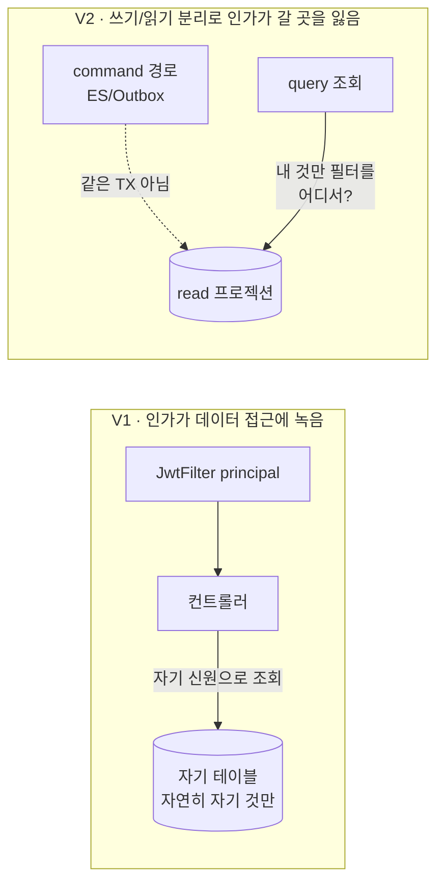
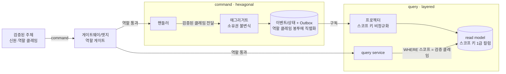

# RFC-015 — V2 인가 모델

- **상태**: ✅ 종결 (2026-06-16) · [[17.authorization-model]]로 닫힘
- **선행**: [[RFC-001-v2-cqrs-and-event-sourcing]] · [[RFC-012-command-query-api-contract]] · 인덱스 [[RFC-INDEX]]
- **닫으면**: 신규 design_doc(인가 모델) + 신규 ADR

---

## 배경 (Background)

### 시나리오: SELLER가 "내 식당 예약 목록"을 연다

**V1에서는 이렇게 흐른다.**
`SecurityConfig`가 경로 prefix에 역할을 박는다 — `requestMatchers(USER_PATHS).hasRole("USER")`, `…hasRole("MANAGER")`, `…hasRole("ADMIN")` 식이다. 역할은 셋이다(`Role` = {ROOT, RESTAURANT_OWNER, USER} → `SecurityRole` = {ROLE_ADMIN, ROLE_MANAGER, ROLE_USER}; "SELLER"는 곧 RESTAURANT_OWNER = ROLE_MANAGER다). `JwtFilter`가 Bearer 토큰을 풀어 principal(id·username·역할)을 `SecurityContextHolder`에 앉히고, 그 뒤로는 같은 앱·같은 동기 호출 안에서 컨트롤러가 그 principal로 자기 DB를 읽는다. 그래서 "내 것만 보인다"는 따로 검사한 게 아니라, **호출자 신원으로 자기 테이블을 조회하니 자연히 자기 것만 나왔다** — 인가가 데이터 접근 경로에 녹아 있었다.

**V2에서는 이렇게 흐른다.**

V2는 이 녹아 있던 것을 둘로 찢는다. 쓰기는 ES/Outbox command 경로([[02-write-model]]), 읽기는 별도 프로젝션 조회([[03-read-model]])로 갈렸고([[03.command-hexagonal-query-layered]]), 둘은 더는 같은 트랜잭션·같은 테이블을 공유하지 않는다. SELLER의 "내 식당 예약 목록"은 V2에선 `reservation` read-model 프로젝션 조회가 되는데, "DB를 자기 신원으로 읽으니 알아서 걸리던" 인가가 갈 곳을 잃는다. "내 것만"이라는 필터를 *어디서* 거는가가 따로 풀어야 할 문제로 떨어진다.

### 무엇이 새로 필요해지나

먼저 경계를 분명히 한다. **인증(authentication)** — 이 호출자가 누구인지 — 은 이 문서의 사안이 아니다. 모든 트래픽 앞단에 게이트웨이와 인증 서버가 서서 토큰을 검증하고 신원·역할 클레임을 확정한다는 것은 주어진 토대다([[RFC-012-command-query-api-contract]]·[[RFC-007-deployment-infra-ops]]). 이 RFC가 다투는 것은 그다음, 더 좁은 질문이다 — **인가(authorization)**: *검증된 이 주체가, 이 자원에, 이 행위를 해도 되는가.* 운영 인프라 확장(Vault·OIDC 등, 백로그 T-13)은 인증을 *어디에 호스팅하고 어떻게 키를 돌리느냐*의 문제라 여기 사안이 아니다 — 여긴 인가 *모델*만 다룬다.

| 개념 | V1 | V2 | 한 줄 정의 |
|------|-----|-----|-----------|
| **역할 기반 인가** | 경로 prefix에 역할 박기 | 엣지(게이트웨이)에서 거친 역할 게이트 | "이 역할이 이 행위를 할 수 있나, 자원 무관" |
| **소유권/스코프 인가** | 자기 신원으로 자기 DB 읽어 자연히 걸림 | 명시적 검사로 분리 | "이 *특정* 자원이 이 주체 것인가" |
| **인가의 위치** | 데이터 접근 경로에 녹음 | command·query에 각각 명시 배치 | "쓰기·읽기가 갈리니 인가도 둘로 갈린다" |

---

## 맥락 (Context)

구체 시나리오 둘이 긴장을 끌고 온다.

- **(시나리오 A) SELLER가 "내 식당 예약 목록"을 연다.** 자기 식당 예약만 보여야 한다. V2에선 이게 `reservation` read-model 프로젝션 조회인데, "내 것만"이라는 필터를 *어디서* 거는가. → 조회엔 애그리거트가 없으니 command 측 불변식이 작동하지 않는다.
- **(시나리오 B) USER가 예약 취소 command를 보낸다.** 그가 그 예약의 주인인지 누가 검사하나 — 게이트웨이? command 핸들러? 애그리거트? → "DB를 자기 신원으로 읽으니 알아서 걸리던" 층이 쓰기에서 사라졌다.
- **자산 — 검증된 신원·역할 클레임은 엣지에서 확정돼 들어온다.** 게이트웨이/인증이 토큰을 검증해 신원·역할을 확정한다([[RFC-012-command-query-api-contract]]). → 인가는 "누구인가"를 다시 풀 필요 없이, 확정된 클레임을 *어디로 흘려보내 어떻게 쓰느냐*만 정하면 된다.

이 둘을 따라가면 "역할로 끝나던 인가"가 V2에선 "역할 + 소유권(이 자원이 이 주체 것인가)"으로 커지고, 그 소유권 검사가 command 측과 query 측에서 서로 다른 모양이 된다는 게 드러난다. 핵심 긴장 — **V1에서 데이터 접근 경로에 녹아 있던 인가를, 쓰기·읽기가 갈린 V2에서 "역할은 엣지, 소유권은 앱"으로 재배치하되, 그 소유권 검사를 command(애그리거트)·query(쿼리 스코프)·프로젝션(스코프 키)에 각각 어떤 모양으로 심을지를 정한다.**

---

## Goal / Non-goal

**Goal**
- 인가를 역할 기반·소유권 기반으로 쪼개고, 각각의 강제 지점(엣지 vs 앱)을 정한다.
- command 측 소유권 검사의 위치(애그리거트 불변식)와 신원 전파 원칙을 정한다.
- query 측 소유권 검사의 형태(쿼리 시점 스코프 조건)를 정한다.
- 프로젝션이 인가를 거들기 위해 들어야 할 스코프 키와 그 갱신 경로를 정한다.
- 신원·역할 클레임이 컨텍스트를 건너 전파되는 방식을 정한다.

**Non-goal (이번에 하지 않음)**
- **인증** — 토큰 검증·신원 확정. 게이트웨이/인증 서버가 처리한다는 토대([[RFC-012-command-query-api-contract]]·[[RFC-007-deployment-infra-ops]]).
- 운영 인프라 확장(Vault·OIDC 등, 백로그 T-13) — 인증 호스팅·키 회전 문제.
- 위 논의의 "Design으로 넘기는 것"으로 표시된 구현 세부(각 논점 결론의 "이의 여지"로 흡수).

---

## 논의 (Discussion)

### 논점 1. 역할로 끝나던 인가가 왜 V2에서 안 끝나나 — 무엇을 어디서 거나

**맥락에서 나온 질문.** V1의 경로-prefix 역할 게이트는 거친 체다. "이 URL은 ADMIN만"까지는 거르지만 "이 예약이 이 USER 것인가"는 못 거른다 — 그건 컨트롤러가 자기 신원으로 DB를 읽으면 자연히 걸렸으니까(맥락 시나리오 A·B). V2에서 쓰기·읽기가 갈리고 프로젝션이 따로 서면 이 "자연히 걸리던" 층이 사라진다. 그래서 V2 인가는 두 종류로 쪼개야 한다 — (1) **역할 기반 인가**(이 행위 자체를 이 역할이 할 수 있나, 자원 무관), (2) **소유권/스코프 기반 인가**(이 *특정* 자원이 이 주체 것인가). 둘을 어디서 거나?

**내 의견(AI):** **(1)은 게이트웨이/엣지에서, (2)는 애플리케이션 안에서** 거는 쪽을 택한다. 역할 게이트는 자원을 몰라도 판단되니(이 토큰에 SELLER 역할이 있나) 엣지에서 거칠게 거는 게 맞고 V1의 경로-prefix 발상을 그대로 잇는다. 그러나 소유권은 자원의 상태를 봐야 안다("이 reservationId의 주인이 이 userId인가") — 그건 도메인 지식이라 엣지가 알 수 없다. 엣지에 소유권을 떠넘기면 엣지가 도메인 데이터를 알아야 하고, 그건 게이트웨이를 도메인에 결합시키는 안티패턴이다.

**네 결정:** 역할=엣지, 소유권=앱으로 분담을 박는다. 〔근거 확인/보강 필요〕

**결론:** 역할 기반 인가는 게이트웨이/엣지에서 거친 게이트로, 소유권/스코프 인가는 애플리케이션 안에서. (이의 여지: 역할 게이트를 엣지와 앱에 *이중*으로 둘지 — 엣지 1차 + 앱 재확인의 defense-in-depth — 는 배포 토폴로지가 익으면 [[RFC-007-deployment-infra-ops]]와 함께 Design에서 정한다. 모델 차원에선 분담만 박는다.)

### 논점 2. 인가가 CQRS의 어디에 사나 — command 측

**맥락에서 나온 질문.** 시나리오 B다. USER가 예약 취소 command를 보낸다. 소유권 검사 후보는 셋 — 게이트웨이, command 핸들러(application), 애그리거트(domain).

검토한 선택지:
- **게이트웨이** — 엣지에서 일괄. 대신 소유권을 모른다(자원 상태를 안 본다) → 논점 1에서 이미 배제.
- **command 핸들러(application)** — 도메인 밖에서 검사. 대신 도메인이 "누구나 취소 가능"한 빈약 모델로 샌다.
- **애그리거트(domain)** — 소유권을 상태 전이의 불변식으로. 빈약 도메인 탈피와 정렬.

**내 의견(AI):** **소유권 검사를 애그리거트의 불변식으로, 즉 도메인 안에 두는 쪽**을 택한다. "예약은 그 주인만 취소할 수 있다"는 보안 규칙이 아니라 *도메인 규칙*이다 — 취소라는 상태 전이의 정당성 조건의 일부다. 이걸 핸들러에 두면 V2가 명시적으로 탈피하려는 빈약 도메인([[02-write-model]] "애그리거트 책임")으로 되돌아간다. command 메타에 실린 **검증된 주체 신원**(게이트웨이/인증이 확정한 클레임)을 핸들러가 애그리거트에 전달하면, 애그리거트가 자기 상태(주인 userId)와 대조해 전이를 허용/거부한다. 거부는 도메인 예외로 떨어지고 [[RFC-012-command-query-api-contract]]의 에러 분류 표에 매핑된다. 결정적인 건, 핸들러가 넘기는 신원이 **클라이언트 페이로드가 아니라 검증된 클레임**이어야 한다는 점이다 — command 바디의 자칭 "내 userId는 X"를 믿으면 누구나 남의 자원에 대한 command를 위조한다.

**네 결정:** 소유권을 애그리거트 불변식으로 두고, 신원은 토큰에서 나온 검증된 클레임만 쓴다(자칭 신원은 무시하거나 일치 강제). 〔근거 확인/보강 필요〕

**결론:** command 측 소유권 검사 = 애그리거트 불변식, 신원은 검증된 클레임으로만 전달. (이의 여지: 역할만으로 충분한 행위 — 예: ADMIN의 전역 강제 취소 — 는 소유권을 건너뛰어야 한다. 즉 불변식은 "주인 본인 OR 충분 권한 역할" 형태가 되는데, 그 "충분 권한"을 도메인이 역할 enum으로 직접 아는 게 맞는지, 핸들러가 역할을 판정해 "권한 우회 플래그"로 넘기는 게 맞는지 — 도메인에 보안 역할 어휘를 얼마나 들일지 — 는 Design에서 가른다.)

### 논점 3. 인가가 CQRS의 어디에 사나 — query 측

**맥락에서 나온 질문.** 시나리오 A다. SELLER가 자기 식당 예약 목록을 연다. 읽기는 command를 거치지 않고 프로젝션을 직접 조회한다([[03-read-model]] "읽기는 항상 query 측"). 그러니 command 측 애그리거트 불변식(논점 2)이 여기선 작동하지 않는다 — 조회엔 애그리거트가 없다. 그럼 "내 것만"을 어떻게 거나?

검토한 선택지:
- **(a) 사후 필터링** — 애플리케이션이 결과를 받아 남의 것을 뺀다. 대신 페이징이 깨지고(100건 받아 90건 버리면 페이지 크기가 망가짐), 한 줄 빠뜨리면 전량 유출.
- **(b) 쿼리 스코프 조건** — `WHERE owner_id = :subject`로 쿼리에 박는다. "내 것만"이 쿼리의 구조적 일부라 빠뜨릴 자리가 없고 페이징도 자연히 맞는다.

**내 의견(AI):** **(b), 쿼리 시점에 주체 스코프를 조건으로 박는 쪽**을 택한다. (a)의 두 위험(페이징 파손·필터 누락 시 전량 유출)을 (b)는 구조적으로 막는다. 검증된 주체(SELLER의 식당 식별자 또는 ownerId)는 query 측 application 레이어([[03.command-hexagonal-query-layered]]의 layered query)가 검증된 클레임에서 받아 쿼리 조건으로 내린다. 여기서도 command 측과 같은 원칙 — 스코프 키는 클라이언트 파라미터가 아니라 검증된 클레임에서 나온다(클라이언트가 `?ownerId=남`을 못 끼운다).

**네 결정:** query 측 소유권 = 쿼리 시점 스코프 조건, 스코프 키는 검증된 클레임에서. 〔근거 확인/보강 필요〕

**결론:** 읽기 인가는 사후 필터가 아니라 쿼리 스코프 조건으로 박는다. (이의 여지: 역할별로 스코프 폭이 다르다 — USER는 자기 예약, SELLER는 자기 *식당의* 예약, ADMIN은 전체. "스코프 술어를 역할이 어떻게 결정하나" — 쿼리 빌더가 역할을 보고 분기 vs 역할별 분리 쿼리 핸들러 — 는 Design에서 정한다.)

### 논점 4. read model이 소유권 인가를 거들려면 무엇을 들고 있어야 하나

**맥락에서 나온 질문.** 논점 3의 (b)가 성립하려면 전제가 하나 있다 — **프로젝션이 스코프 키를 컬럼으로 들고 있어야 한다.** `reservation` 예약 목록 프로젝션이 `owner_id`(예약자)와 `restaurant_owner_id`(식당 주인) 같은 스코프 키를 갖고 있지 않으면 `WHERE`로 거를 게 없다. 그래서 인가는 read model 조회 시점의 관심사로 끝나지 않고 **프로젝션 설계 단계로 거슬러 올라간다** — 프로젝터가 이벤트를 투영할 때 스코프 키를 함께 비정규화해 심어야 한다.

**내 의견(AI):** **소유권/테넌트 스코프 키를 프로젝션의 1급 컬럼으로 두고, 인가에 쓰이는 키는 프로젝터가 반드시 채우도록 강제하는 쪽**을 택한다. 이건 [[03-read-model]]의 비정규화 원칙(식당명을 예약 프로젝션에 박는 것)과 같은 결이다 — 다만 비정규화하는 게 표시용 데이터가 아니라 *인가용 스코프 키*다. 까다로운 건 [[RFC-002-read-model-consistency]]와 만나는 지점이다: 프로젝션은 결과적 일관성이라, 소유권이 *바뀌는* 순간(예: 식당 양도로 ownerId가 바뀜)에 스코프 키가 프로젝션에 반영되기까지의 지연 동안 인가 판단이 옛 키로 이뤄진다. 이 케이스는 **소유권 이전 자체를 도메인 이벤트로 모델링하고, 그 이벤트가 프로젝션 스코프 키를 갱신하게** 하는 쪽으로 본다 — 소유권 변경은 보안 패치가 아니라 도메인 사실이니 이벤트로 흐르는 게 맞다.

**네 결정:** 스코프 키를 프로젝션 1급 컬럼으로 강제, 소유권 변경은 도메인 이벤트로 모델링해 스코프 키를 갱신. 〔근거 확인/보강 필요〕

**결론:** 인가용 스코프 키를 프로젝션에 비정규화하고 프로젝터가 빠짐없이 채우게 강제, 소유권 변경은 이벤트로 흘려 스코프 키를 갱신. (이의 여지: 소유권 변경 직후의 좁은 일관성 창에서 "막 양도한 옛 주인이 잠깐 더 본다"가 허용 가능한 위험인지, 아니면 그런 민감 전이는 query 측 프로젝션이 아니라 command 측 권위 상태로 재확인해야 하는지는 자원 민감도별로 Design에서 가른다 — 모든 조회를 command 측으로 재확인하면 CQRS 분리가 무의미해지니 "어떤 자원이 그 정도로 민감한가"의 분류가 선행한다. [[RFC-002-read-model-consistency]] 종속.)

### 논점 5. user/authenticate가 ES가 아니라 상태라서 — 신원·역할·소유권이 핸들러·프로젝터에 어떻게 닿나

**맥락에서 나온 질문.** [[02-write-model]]에서 `user`·`authenticate`는 ES가 아니라 **상태 테이블 + Outbox**로 잡혔다. 즉 "이 주체가 누구이고 무슨 역할인가"의 진실은 이벤트 스트림이 아니라 상태 테이블에 있다. 그런데 인가는 다른 컨텍스트(예: `reservation`)의 command 핸들러·프로젝터에서 필요하다(논점 2·3·4). `reservation` 핸들러가 매번 `user` 상태 테이블을 동기 조회해 역할·소유권을 확인하면, 컨텍스트 간 동기 결합이 생겨 V2가 피하려는 모놀리식 결합으로 되돌아간다.

**내 의견(AI):** **인가에 필요한 신원·역할은 command/이벤트 메타에 실린 검증된 클레임으로 전파하고, 컨텍스트 간 런타임 조회를 만들지 않는 쪽**을 택한다. 게이트웨이/인증이 토큰에서 확정한 신원·역할 클레임이 command 메타에 실려 들어오고(논점 2와 동일 원천), 그 메타는 [[02-write-model]]의 공통 발행 경로에서 추적 메타(`correlationId` 등)를 채우는 바로 그 자리에서 함께 봉투에 직렬화된다. 그러면 다운스트림 프로젝터·핸들러는 `user` 컨텍스트를 동기 호출하지 않고도 "이 행위를 한 주체가 누구·무슨 역할이었나"를 이벤트 봉투에서 읽는다. *역할*(누구냐의 속성)은 이렇게 클레임으로 흐르는 게 맞다. 다만 *소유권*은 다르다 — "이 예약의 주인이 누구인가"는 `user` 컨텍스트의 클레임이 아니라 `reservation` 자기 자신의 상태/이벤트다(예약 생성 이벤트에 주인 userId가 박혀 있으니 애그리거트도 프로젝션도 자기 안에서 안다). 그래서 소유권은 컨텍스트를 건너오지 않는다.

**네 결정:** 역할은 클레임으로 전파(컨텍스트 횡단), 소유권은 자기 컨텍스트의 이벤트/상태에서(컨텍스트 내부), 컨텍스트 간 런타임 조회는 만들지 않음. 〔근거 확인/보강 필요〕

**결론:** 역할은 command/이벤트 봉투의 검증된 클레임으로 흐르고, 소유권은 자기 컨텍스트 안에서 안다 — 인가 때문에 컨텍스트 간 동기 결합을 만들지 않는다. (이의 여지: 클레임에 실린 역할이 토큰 발급 후 변경되면(권한 강등) command 메타의 역할이 한 토큰 수명만큼 stale할 수 있다 — 토큰 수명·강등 즉시성 요구가 실제로 빡빡한지, 빡빡하면 인증 토큰 정책(T-13 인프라)으로 넘어가는지의 경계는 운영 요구가 잡힌 뒤 Design에서 본다. 모델 차원에선 "역할은 토큰 발급 시점의 스냅샷"으로 둔다.)

---

## 결정 요약

| # | 결정 | ADR |
|---|------|-----|
| 1 | 인가를 둘로 쪼갬 — **역할 기반=게이트웨이/엣지, 소유권/스코프 기반=애플리케이션** | [[17.authorization-model]] · 신규 ADR 예정 |
| 2 | command 측 소유권 = **애그리거트 불변식**, 신원은 **검증된 클레임으로만** 전달(자칭 신원 불신) | [[17.authorization-model]] · [[RFC-012-command-query-api-contract]] |
| 3 | query 측 소유권 = **쿼리 시점 스코프 조건**(사후 필터 아님), 스코프 키는 검증된 클레임에서 | [[17.authorization-model]] · [[03.command-hexagonal-query-layered]] |
| 4 | 프로젝션이 **인가용 스코프 키를 1급 컬럼으로** 보유·프로젝터가 강제 채움, 소유권 변경은 **도메인 이벤트로 갱신** | [[17.authorization-model]] · [[RFC-002-read-model-consistency]] |
| 5 | **역할은 클레임으로 횡단 전파, 소유권은 자기 컨텍스트 내부**, 인가용 컨텍스트 간 런타임 조회 금지 | [[17.authorization-model]] · [[02-write-model]] |

상세 설계는 [[17.authorization-model]] 참조.

---

## 결과 (목표 인가 모델 요약)

- **역할**은 엣지에서 거친 게이트로 거르고, command/이벤트 봉투에 검증된 클레임으로 실려 컨텍스트를 횡단한다.
- **command 측 소유권**은 애그리거트 불변식으로 검사하고, 신원은 검증된 클레임만 신뢰한다(거부는 도메인 예외 → 에러 분류).
- **query 측 소유권**은 쿼리 시점 스코프 조건으로 박고, 그 전제로 프로젝션이 인가용 스코프 키를 1급 컬럼으로 들고 프로젝터가 빠짐없이 채운다.
- **소유권**은 컨텍스트를 건너오지 않고 자기 컨텍스트의 이벤트/상태에서 알며, 소유권 변경은 도메인 이벤트로 흘러 스코프 키를 갱신한다.

상세 모델·강제 규칙은 [[17.authorization-model]] · [[14.testing-strategy]] 참조.

---

## 관련 문서

- [[RFC-INDEX]] · [[RFC-001-v2-cqrs-and-event-sourcing]] · [[RFC-012-command-query-api-contract]] · [[RFC-002-read-model-consistency]] · [[RFC-007-deployment-infra-ops]] · [[RFC-005-pii-security]] · [[RFC-019-auth-token-transport]]
- [[02-write-model]] · [[03-read-model]] · [[03.command-hexagonal-query-layered]] · [[14.testing-strategy]]
- 설계: [[17.authorization-model]]
