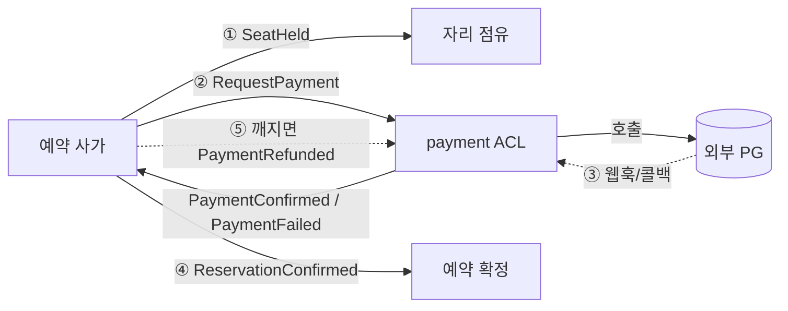
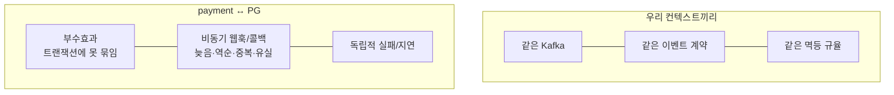
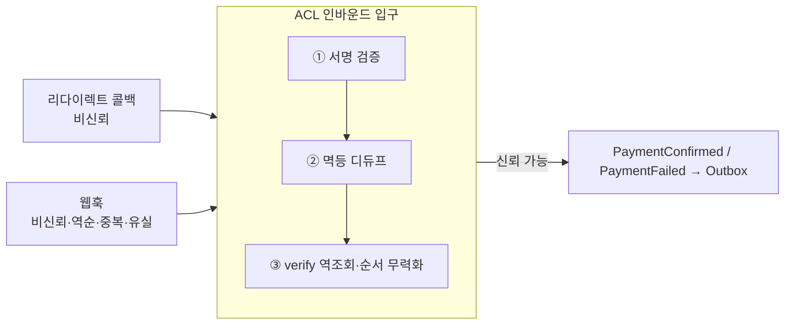
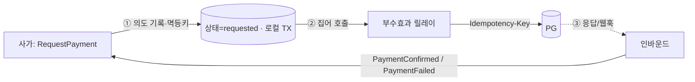
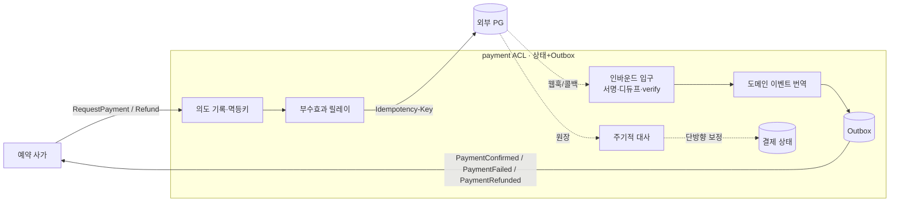

# RFC-016 — 결제 연동 경계

- **상태**: ✅ 종결 (2026-06-16) · [[15.payment-acl-boundary]]로 닫힘
- **선행**: [[RFC-001-v2-cqrs-and-event-sourcing]] · [[RFC-006-saga-process-manager]] · 인덱스 [[RFC-INDEX]]
- **닫힘**: [[14-payment-integration]] (design_doc) + [[15.payment-acl-boundary]] (ADR). 사가 표면 3 이벤트 동결은 [[06-consistency-and-sagas]] 보강.

---

## 배경 (Background)

### 시나리오: 손님이 "결제까지 끝난 예약"을 만든다

**V1에는 이 흐름 자체가 없다.**
V1 코드베이스에는 결제의 흔적이 없다 — `payment`·`refund`로 잡히는 `.kt`도, 마이그레이션도 0건이다. 그러니 이건 "V1을 어떻게 옮기나"가 아니라 **그린필드 경계 설계**다. 다른 컨텍스트(`timetable`·`reservation`)는 V1의 EDA·Outbox를 계승하지만([[07.reservation]]), `payment`는 계승할 V1이 없다.

**V2에서는 이렇게 흐른다.**

1. **자리 점유** — 사가가 자리를 잡는다(`SeatHeld`).
2. **결제 요청** — 사가가 `RequestPayment`를 보내고, `payment`가 외부 PG(결제 게이트웨이)에 결제를 요청한다.
3. **외부 결과 수신** — 돈이 실제로 움직였다는 사실은 우리가 내는 게 아니라, PG가 비동기 웹훅/콜백으로 알려 줘야 비로소 안다. 검증을 거쳐 `PaymentConfirmed`(또는 `PaymentFailed`)로 번역한다.
4. **예약 확정** — 결제가 확정되면 예약을 확정한다(`ReservationConfirmed`). 결제가 안 오면 점유를 푼다(`SeatReleased`).
5. **보상** — 결제는 됐는데 확정이 깨지면 환불한다(`PaymentRefunded`).

[[RFC-006-saga-process-manager]]가 예약 사가에 결제 단계를 끼워 넣으면서 `payment`라는 컨텍스트를 하나 새로 끌어들였다. RFC-06은 이 이벤트들을 사가의 *단계*로 소비할 뿐, `payment`가 *무엇인지*는 열어 두었다. 이 RFC가 그 컨텍스트를 정의한다.

### 무엇이 다른가 — 외부 시스템과 말하는 컨텍스트

| 측면 | 우리 컨텍스트끼리 | payment ↔ PG | 한 줄 정의 |
|------|------------------|--------------|-----------|
| **트랜잭션** | 같은 트랜잭션·멱등 위 | HTTP 호출 한 번이 돈을 움직이는 부수효과 | "PG 호출은 우리 커밋에 못 묶인다" |
| **결과 전달** | 이벤트 메시지 | 비동기 웹훅/콜백(늦음·역순·중복·유실) | "외부가 그렇다고 말해 줘야 안다" |
| **실패** | 같은 규율로 흡수 | 우리와 독립적으로 실패/지연 | "PG는 우리 통제 밖이다" |

평이하게 말하면 — `PaymentConfirmed`는 우리가 마음대로 낼 수 있는 이벤트가 아니라, *외부 세계가 그렇다고 말해 줘야* 비로소 낼 수 있는 이벤트다.

---

## 맥락 (Context)

`payment`는 단순한 "새 컨텍스트 하나 추가"가 아니다 — **우리가 통제하지 못하는 외부 PG와 말하는 컨텍스트**다. 이 "외부"가 모든 긴장의 근원이다.

- **PG는 우리 트랜잭션에 못 묶인다.** HTTP 호출 한 번이 돈을 움직이는 부수효과다. → PG 호출과 우리 이벤트 append를 한 원자 단위로 묶으려는 시도 자체가 깨진다(이중 청구의 씨앗).
- **결과가 비동기 웹훅/콜백으로 온다.** 그 도착은 늦고·순서가 어긋나고·중복되고·때로 유실된다. → 도착 순서로 상태를 전이하거나, 한 번 받은 알림을 곧장 믿으면 우리 상태가 외부 진실과 어긋난다.
- **PG는 우리와 독립적으로 실패/지연한다.** → 모든 방어를 갖춰도 경계엔 잔여 불일치가 남는다(대사 필요).
- **자산이자 그린필드 — `payment`는 계승할 V1이 없다.** 다른 컨텍스트는 V1의 EDA·Outbox를 계승하지만([[07.reservation]]) 결제는 V1 흔적이 0건이다. → "옮기기"가 아니라 경계를 처음부터 그리는 설계다. 다만 우리 컨텍스트끼리의 멱등·전달 규율([[07-messaging-topology]] · [[RFC-003-messaging-delivery]])은 그대로 재활용할 자산이다.

핵심 긴장 — **외부 진실(PG 원장)을 우리 도메인 이벤트로 들이는 길, 우리 의도를 외부로 내보내는 길, 둘이 어긋났을 때 맞추는 길을 잡되, PG 벤더의 모델이 우리 사가 안으로 새어 들지 않게 경계를 봉인하는 것.**

---

## Goal / Non-goal

**Goal**
- `payment`를 외부 PG와 도메인 사이의 번역 경계(ACL)로 정의한다.
- PG 웹훅·콜백을 신뢰할 수 있는 도메인 이벤트로 들이는 인바운드 규율을 정한다.
- 우리 의도를 PG로 내보내는 아웃바운드 규율(dual-write 회피)을 정한다.
- 보상(환불)과 외부-우리 상태 정합성 조정(reconciliation)의 원칙을 정한다.
- 사가가 보는 `payment`의 이벤트 표면을 고정한다.

**Non-goal (이번에 하지 않음)**
- 결제 거래 상태 모델·테이블 스키마·상태 전이의 구체 (→ Design).
- 인바운드 ACL 상세(웹훅 엔드포인트·서명 알고리즘·디듀프 키/GC·verify 정책) (→ Design).
- 아웃바운드 릴레이 배치(전용 vs 공용)·멱등키 생성 규약·verify-before-call 보수 경로 (→ Design).
- 대사 주기·소스(정산 파일 vs 조회 API)·미스매치 처리 범위 (→ Design).
- 실 PG 선정·연동 시점, PG 스텁/시뮬레이터의 충실도 수준 (→ Design).

---

## 논의 (Discussion)

### 논점 1. payment는 무슨 컨텍스트인가 — ES도, 단순 상태도 아닌 ACL → [[15.payment-acl-boundary]]

**맥락에서 나온 질문.** V2의 쓰기 모델은 두 갈래다([[02-write-model]]): ES 컨텍스트(`reservation`·`timetable`)와 상태+Outbox 컨텍스트(`user`·`schedule`). `payment`를 이 둘 중 하나에 욱여넣고 싶은 유혹이 있는데, 맥락이 말하듯 `payment`의 본질은 *데이터 모델*(이벤트냐 상태냐)이 아니라 **외부 시스템과의 번역**이다.

**내 의견(AI):** 둘 다 틀린 출발점이다. PG는 자기만의 어휘로 말한다 — `transactionId`, `paid`/`failed`/`cancelled`/`partially_refunded`, 자기 타임스탬프, 자기 재시도 규약. 이걸 도메인이 날것으로 받으면 PG 벤더의 모델이 사가 안으로 새어 들어온다(벤더를 바꾸면 사가가 깨진다). 그래서 **`payment`를 부패방지층(ACL, Anti-Corruption Layer)으로 짓는다.** 바깥쪽으로는 PG의 언어를 받아 안쪽으로 우리 도메인 이벤트(`PaymentConfirmed`/`PaymentFailed`/`PaymentRefunded`)로 *번역*하는 것이 이 컨텍스트의 유일한 책임이다. PG가 무엇이든(토스·아임포트·스트라이프·가짜 스텁) 사가가 보는 표면은 동일한 세 이벤트로 고정된다.

그 안에서 데이터는 **상태+Outbox 패턴으로 둔다**([[02-write-model]] §B). 결제 거래의 현재 상태(requested/confirmed/failed/refunded)를 테이블로 들고, 같은 트랜잭션에서 도메인 이벤트를 Outbox에 적어 사가로 흘린다. ES로 갈 이유는 약하다 — 결제 거래의 "진실 원천"은 우리가 아니라 PG의 원장이고, 우리 이력은 PG 콜백을 받아 적은 *그림자*다. append-only로 풍부한 이력을 쌓아도 외부 진실의 사본일 뿐, 우리 결정으로 상태가 진화하는 애그리거트가 아니다.

**네 결정:** `payment` = ACL, 내부 데이터는 상태+Outbox. 〔근거 확인/보강 필요〕

**결론:** `payment`는 PG↔도메인 번역을 유일 책임으로 하는 ACL이고, 내부 상태는 상태+Outbox로 둔다. (이의 여지: 분쟁·부분환불·재시도가 겹치면 결제 거래의 *내부 상태 전이*가 풍부해져 ES가 다시 테이블에 오를 수 있다 — 사가가 보는 바깥 표면은 세 이벤트로 같으니 ES↔상태 선택은 컨텍스트 내부 결정으로 미뤄도 사가 계약은 흔들리지 않는다. 구체는 Design.)

### 논점 2. PG 웹훅을 어떻게 도메인 이벤트로 들이나 → [[15.payment-acl-boundary]]

**맥락에서 나온 질문.** 맥락의 "결과가 비동기 웹훅/콜백으로 온다(늦음·역순·중복·유실)"를 어떻게 신뢰할 수 있는 도메인 이벤트로 바꾸나. PG는 결제 결과를 두 경로로 알린다 — 사용자가 결제창에서 돌아오는 **리다이렉트 콜백**(브라우저 경유 — 비신뢰·유실 가능)과 PG 서버가 우리 엔드포인트를 직접 때리는 **웹훅**(서버-투-서버). 둘 다 비동기이고 둘 다 못 믿는다.

**내 의견(AI):** **결제 확정의 진실은 콜백이 아니라 웹훅(+ 검증 조회)으로 받는다.** 콜백은 "사용자가 결제창을 마쳤다"는 UX 신호일 뿐 돈이 실제로 움직였다는 근거가 아니다(위조·중단·재현 가능). 콜백이 와도 곧장 `PaymentConfirmed`로 승격하지 않고, **PG에 거래를 역조회(verify)해 금액·상태가 우리 기대와 일치하는지 확인한 뒤** 이벤트를 낸다. PG가 우리에게 단언하는 것만 믿는다. 그리고 들어오는 알림 자체가 못 믿을 물건이므로 ACL 인바운드 입구에 세 겹을 둔다.

- **진위 검증**: 웹훅 서명(HMAC/공개키)을 검증해 PG가 보낸 게 맞는지부터 확인한다. 통과 못 하면 도메인에 닿기 전에 버린다.
- **멱등 흡수**: 같은 웹훅이 두 번(혹은 콜백 1 + 웹훅 1로 같은 사실이 두 경로로) 와도 `PaymentConfirmed`가 두 번 나면 안 된다. PG 거래 ID를 멱등키로 하는 **인바운드 디듀프 테이블**로 흡수한다 — 이미 처리한 거래 ID면 두 번째는 no-op. 이건 [[RFC-003-messaging-delivery]]의 *전달 멱등*(컨슈머 inbox)과 같은 발상을 ACL 입구에 적용한 것이고, [[RFC-012-command-query-api-contract]]의 *요청-단 멱등*과는 또 다른 층이다 — RFC-12은 우리 클라이언트의 더블클릭을, 이건 외부 PG의 중복 통지를 막는다. 셋 다 독립적으로 필요하다.
- **순서 무력화**: 웹훅은 순서를 보장하지 않는다 — `refunded`가 `confirmed`보다 먼저 도착할 수 있다. 도착 순서로 상태를 전이하지 않고, **각 알림이 실어 온 PG 측 상태/타임스탬프**(혹은 verify 조회 결과)를 진실로 받아 우리 상태를 그쪽에 *수렴*시킨다. 늦게 온 옛 상태는 무시한다.

**네 결정:** 진실은 웹훅+verify, 인바운드 입구는 서명 검증 → 멱등 디듀프 → verify·순서 무력화 3겹. 〔근거 확인/보강 필요〕

**결론:** **외부의 비신뢰 입력 → (검증·디듀프·verify) → 신뢰할 수 있는 도메인 이벤트.** 검증·멱등을 통과한 알림만 ACL 안에서 도메인 이벤트로 번역돼 Outbox로 나간다. (이의 여지: 웹훅 엔드포인트·서명 알고리즘, 디듀프 테이블 키·GC, verify가 언제 어떤 필드를 대조하나는 Design.)

### 논점 3. 우리 의도를 PG로 어떻게 내보내나 — dual-write 함정 → [[15.payment-acl-boundary]]

**맥락에서 나온 질문.** 맥락의 "PG는 우리 트랜잭션에 못 묶인다"가 가장 미끄럽게 드러나는 지점이다. 사가가 `RequestPayment`를 보내면 ACL은 PG API를 호출해야 하는데, 이건 **부수효과이자 비-트랜잭션**이다. 순진하게 한 트랜잭션 안에서 (a) PG에 HTTP로 결제를 요청하고 (b) 결과를 우리 상태/이벤트로 적으면 — (a)와 (b)는 한 원자 단위가 아니다. PG 호출은 성공했는데 커밋 직전 죽으면 **돈은 빠져나갔는데 우리는 모른다.** 이게 [[RFC-003-messaging-delivery]]가 짚은 "멱등으로 못 막는 외부 부수효과"의 결제판이고, at-least-once 재처리 아래선 **이중 청구**로 직결된다.

**내 의견(AI):** RFC-03의 부수효과-Outbox 노선을 그대로 결제에 적용한다 — **의도를 먼저 (로컬 트랜잭션으로) 기록하고, 별도 릴레이가 그 의도를 보고 PG를 호출하며, 결과를 다시 이벤트로 적는다.**

1. 사가의 `RequestPayment`를 받으면 ACL은 *PG를 부르지 않고* "이 주문에 대해 결제를 요청할 의도가 있다"를 로컬 트랜잭션으로 기록한다(상태=requested, **클라이언트 발급 멱등키 생성**).
2. 부수효과 릴레이가 그 의도를 집어 PG API를 호출한다 — 이때 **PG가 지원하는 Idempotency-Key를 그 멱등키로 넘긴다.** 릴레이가 재시도해 같은 호출이 두 번 나가도, PG 쪽 멱등으로 *돈은 한 번만* 움직인다. (RFC-12에서 우리 클라이언트에는 멱등키 계약을 안 지웠지만, *우리가 PG의 클라이언트일 때*는 정확히 그 패턴을 우리가 쓴다.)
3. PG의 응답(동기 결과 또는 이후 웹훅)은 인바운드 경로로 들어와 `PaymentConfirmed`/`PaymentFailed`로 번역된다.

요지는 PG 호출을 이벤트 append와 *원자적으로 묶으려는 시도 자체를 포기*하고, "기록된 의도 + 멱등키 + 재시도 가능한 릴레이"로 **at-least-once 호출을 effectively-once 청구로** 만드는 것이다([[07-messaging-topology]]의 effectively-once 철학과 같은 결).

**네 결정:** 의도 먼저 기록 → 멱등키 단 릴레이가 PG 호출 → 결과를 이벤트로. 〔근거 확인/보강 필요〕

**결론:** 결제 아웃바운드는 부수효과-Outbox로, 기록된 의도 + Idempotency-Key + 재시도 릴레이로 effectively-once 청구를 보장한다. (이의 여지: 모든 PG가 Idempotency-Key를 지원하진 않는다 — 미지원 PG에선 호출 전 verify로 "이미 청구됐나"를 먼저 확인하는 보수 경로가 필요하다. 부수효과 릴레이를 결제 전용으로 둘지 공용 릴레이에 태울지, 멱등키 생성·전달 규약은 Design.)

### 논점 4. 환불을 어떻게 다루나 — 보상은 새 정방향이지 롤백이 아니다 → [[15.payment-acl-boundary]]

**맥락에서 나온 질문.** 결제까지 됐는데 예약 확정이 깨지면 사가는 환불로 되감는다([[06-consistency-and-sagas]] 보상 표: `PaymentConfirmed` ↔ `PaymentRefunded`). 보상이 논점 3의 dual-write 함정과 논점 2의 비신뢰 외부 진실을 똑같이 타는지가 질문이다.

**내 의견(AI):** 두 가지를 분명히 한다. 첫째, **환불은 PG에 대한 또 하나의 아웃바운드 호출**이라 dual-write 함정을 똑같이 탄다 — 환불도 "의도 기록 → 멱등키 단 릴레이 호출 → 결과 이벤트"의 같은 경로를 쓴다. 보상이라고 특별 취급하지 않는다. 둘째, **환불은 반드시 멱등**이어야 한다([[06-consistency-and-sagas]]). 사가가 타임아웃에 보상을 두 번 트리거하거나 환불 웹훅이 중복으로 와도 *이중 환불*이 나면 안 된다. 정방향 청구와 같은 멱등키 공간을 쓰되, 보상은 "이미 환불된 거래면 무시"를 PG verify로 판별한다 — 외부 상태를 진실로 삼는 인바운드 규율을 보상에도 그대로 적용한다.

**네 결정:** 환불 = 정방향과 같은 의도-멱등키-릴레이 경로 + 이중 환불 가드(verify). 〔근거 확인/보강 필요〕

**결론:** 환불은 롤백이 아니라 새 정방향 호출이며, 청구와 같은 멱등 규율로 이중 환불을 막는다. (이의 여지: 청구와 환불의 멱등키 공유 모델·이중 환불 가드의 구체는 Design.)

### 논점 5. 외부 진실과 우리 이벤트가 끝내 어긋나면 → [[15.payment-acl-boundary]]

**맥락에서 나온 질문.** 맥락의 "PG는 우리와 독립적으로 실패/지연한다 → 모든 방어를 갖춰도 경계엔 잔여 불일치가 남는다"의 처리다. 멱등·verify·릴레이를 다 갖춰도 웹훅이 끝내 유실되고, verify 조회가 타임아웃 나고, PG 비동기 처리가 우리 추정보다 늦어진다.

**내 의견(AI):** ACL은 "우리가 받은 알림으로 만든 상태"가 곧 진실이라고 가정하지 않는다 — 진실은 PG의 원장이고 우리 상태는 그 사본일 뿐이다. 이걸 메우는 게 **주기적 대사(reconciliation)** 다. 일정 주기로 PG 원장(정산 파일 또는 거래 조회 API)과 우리 결제 상태를 대조해 어긋난 건을 찾는다 — 우리는 requested인데 PG는 paid면 누락된 `PaymentConfirmed`를 *늦게라도* 낸다(웹훅 유실 복구); 우리는 confirmed인데 PG에 거래가 없으면 경보를 띄운다(우리 쪽 유령 상태). **대사를 안전망으로 상시 두되, 자동 보정은 "PG가 진실"이라는 단방향으로만** 한다 — 우리 상태를 PG에 맞추지, PG를 우리에 맞추려 들지 않는다. 자동으로 못 풀리는 어긋남(금액 불일치·정체불명 거래)은 [[RFC-003-messaging-delivery]]의 DLQ 수동 루프처럼 **운영 보정 큐**로 올린다.

**네 결정:** 주기적 대사를 상시 안전망으로, 자동 보정은 PG→우리 단방향, 미해결은 운영 보정 큐. 〔근거 확인/보강 필요〕

**결론:** 외부 경계의 잔여 불일치는 단방향 대사(PG가 진실)로 메우고, 자동으로 못 풀리는 건은 운영 보정 큐로 올린다. (이의 여지: 대사 주기·소스가 PG 정산 파일이냐 거래 조회 API냐는 벤더에 달렸고, 대사 미스매치를 도메인 이벤트로 표현할지 운영 알람으로만 둘지는 Design.)

### 논점 6. 실 PG 없이 무엇으로 학습하나 → [[15.payment-acl-boundary]]

**맥락에서 나온 질문.** 맥락의 "그린필드 — 계승할 V1이 없다"에 더해, 지금 붙일 실제 PG도 없다. 그렇다고 "가짜 인라인 호출"로 때우면 ACL·웹훅·멱등·대사라는 *배울 가치가 있는 구조*가 통째로 증발한다(그게 이 RFC의 학습 목표다).

**내 의견(AI):** **PG 인터페이스(포트)는 실제처럼 정의하고, 그 뒤에 비동기·실패·중복을 흉내 내는 PG 스텁/시뮬레이터를 꽂는다.** 스텁이 지연 후 웹훅을 *콜백으로* 쏘고, 가끔 중복·유실·순서뒤집기를 일으키게 해서 우리 인바운드 방어가 진짜로 동작하는지 검증한다. *경계의 모양*(ACL 포트 + 웹훅 인바운드 + 부수효과 릴레이 + 대사)은 실 PG 유무와 무관하게 동일하다는 게 핵심이다.

**네 결정:** PG 포트는 실제처럼 정의하고 뒤에 결함 주입 스텁/시뮬레이터를 꽂아 인바운드 방어를 검증. 〔근거 확인/보강 필요〕

**결론:** 실 PG 없이도 경계 모양은 동일하게 짓고, 결함 주입 스텁으로 학습·검증한다. (이의 여지: 어떤 실 PG를 언제 붙이느냐, 스텁의 충실도 수준·결함 주입(지연·중복·유실·순서뒤집기) 시나리오는 Design.)

### 논점 7. 사가가 보는 payment의 표면을 무엇으로 고정하나 → [[06-consistency-and-sagas]]

**맥락에서 나온 질문.** 논점 1에서 "PG가 무엇이든 사가가 보는 표면은 동일한 세 이벤트로 고정된다"고 했다. 그 표면을 명시적으로 동결해야 ACL 내부 결정(ES↔상태 등)이 사가 계약을 흔들지 않는다.

**내 의견(AI):** `payment`가 사가에 노출하는 이벤트는 `PaymentConfirmed`/`PaymentFailed`/`PaymentRefunded` 셋으로 동결한다. 이 동결이 논점 1의 ACL 책임("PG가 무엇이든 표면은 세 이벤트")을 계약으로 못 박는 장치다.

**네 결정:** 사가 노출 이벤트를 세 개로 동결. 〔근거 확인/보강 필요〕

**결론:** `payment`의 사가 표면은 `PaymentConfirmed`/`PaymentFailed`/`PaymentRefunded` 3 이벤트로 동결한다([[06-consistency-and-sagas]] 보강).

---

## 결정 요약

| # | 결정 | ADR |
|---|------|-----|
| 1 | `payment` = **ACL**(PG↔도메인 번역이 유일 책임), 내부 데이터는 **상태+Outbox** | [[15.payment-acl-boundary]] · [[02-write-model]] |
| 2 | 인바운드 = **웹훅+verify가 진실**, 입구 3겹(서명 검증·멱등 디듀프·verify/순서 무력화) | [[15.payment-acl-boundary]] · [[RFC-003-messaging-delivery]] |
| 3 | 아웃바운드 = **의도 먼저 기록 → 멱등키 단 릴레이 호출 → 결과 이벤트** (effectively-once 청구) | [[15.payment-acl-boundary]] · [[RFC-003-messaging-delivery]] |
| 4 | 환불 = **정방향과 같은 경로 + 이중 환불 가드(verify)**, 보상은 롤백이 아닌 새 정방향 | [[15.payment-acl-boundary]] · [[06-consistency-and-sagas]] |
| 5 | 정합성 = **주기적 단방향 대사(PG가 진실)**, 미해결은 운영 보정 큐 | [[15.payment-acl-boundary]] · [[RFC-003-messaging-delivery]] |
| 6 | 학습 = **PG 포트 실제 정의 + 결함 주입 스텁/시뮬레이터**(경계 모양은 실 PG 무관) | [[15.payment-acl-boundary]] |
| 7 | 사가 표면 = **`PaymentConfirmed`/`PaymentFailed`/`PaymentRefunded` 3 이벤트 동결** | [[06-consistency-and-sagas]] |

상세 설계는 [[14-payment-integration]] 참조.

---

## 결과 (목표 경계 요약)

- `payment`는 PG↔도메인 번역만 책임지는 ACL이고, 내부는 상태+Outbox다.
- 인바운드는 서명·멱등·verify 3겹을 통과한 알림만 도메인 이벤트로 번역한다(진실은 웹훅+verify).
- 아웃바운드(청구·환불)는 의도 먼저 기록 + 멱등키 릴레이로 effectively-once 청구를 만든다.
- 잔여 불일치는 단방향 대사(PG가 진실)로 메우고, 사가가 보는 표면은 3 이벤트로 동결된다.

상세 경계·시퀀스는 [[14-payment-integration]] 참조.

---

## 관련 문서

- [[RFC-INDEX]] · [[RFC-006-saga-process-manager]] · [[RFC-003-messaging-delivery]] · [[RFC-012-command-query-api-contract]] · [[RFC-001-v2-cqrs-and-event-sourcing]]
- [[06-consistency-and-sagas]] · [[02-write-model]] · [[07-messaging-topology]]
- ADR: [[15.payment-acl-boundary]] · [[08.saga-orchestration-vs-choreography]] · [[09.event-ordering-and-delivery-guarantee]]
- 설계: [[14-payment-integration]]
- 계승: [[07.reservation]] (V1 — Outbox·PoisonMessage 규율; `payment`는 계승할 V1 없음 = 그린필드)
