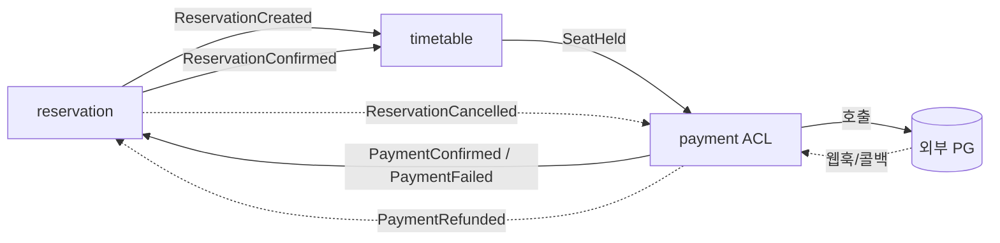
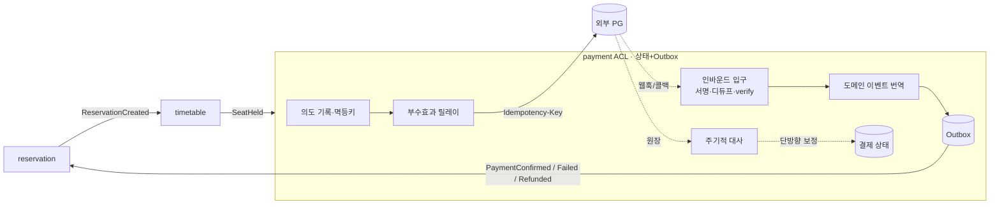

# RFC-016 — 결제 연동 경계

- **상태**: ✅ 종결 (2026-06-29 개정) · [[15.payment-acl-boundary]]로 닫힘
- **선행**: [[RFC-001-v2-cqrs-and-event-sourcing]] · [[RFC-006-saga-process-manager]] · 인덱스 [[RFC-INDEX]]

---

## 배경 (Background)

### 시나리오: 손님이 "결제까지 끝난 예약"을 만든다

V1에는 결제 흔적이 없다(`payment`·`refund` 코드 0건). 그린필드 경계 설계다.

V2에서는 코레오그래피([[RFC-006-saga-process-manager]])로 흐른다 — 중앙 지휘자 없이 각 컨텍스트가 이벤트에 반응한다.

1. **자리 점유** — `reservation`이 예약 요청을 받으면 `timetable`이 자리를 잡는다(`SeatHeld`).
2. **결제** — `SeatHeld`를 받은 `payment`가 외부 PG에 결제를 요청한다.
3. **외부 결과 수신** — PG가 비동기 웹훅/콜백으로 결과를 알린다. `payment`가 검증 후 `PaymentConfirmed`(또는 `PaymentFailed`)를 발행한다.
4. **예약 확정** — `PaymentConfirmed`를 받은 `reservation`이 예약을 확정한다(`ReservationConfirmed`).
5. **보상** — 각 컨텍스트가 자기 aggregate 상태를 보고 자기 보상을 판단한다(코레오그래피 보상).

[[RFC-006-saga-process-manager]]가 예약 흐름을 코레오그래피로 정의하면서 `payment` 컨텍스트를 끌어들였으나, `payment`가 *무엇인지*는 열어 두었다. 이 RFC가 그 컨텍스트를 정의한다.

### 무엇이 다른가 — 외부 시스템과 말하는 컨텍스트

| 측면 | 우리 컨텍스트끼리 | payment ↔ PG | 한 줄 정의 |
|------|------------------|--------------|-----------|
| **트랜잭션** | 같은 트랜잭션·멱등 위 | HTTP 호출 한 번이 돈을 움직이는 부수효과 | "PG 호출은 우리 커밋에 못 묶인다" |
| **결과 전달** | 이벤트 메시지 | 비동기 웹훅/콜백(늦음·역순·중복·유실) | "외부가 그렇다고 말해 줘야 안다" |
| **실패** | 같은 규율로 흡수 | 우리와 독립적으로 실패/지연 | "PG는 우리 통제 밖이다" |

---

## 맥락 (Context)

`payment`는 외부 PG와 말하는 컨텍스트다. PG 호출은 우리 트랜잭션에 못 묶이고, 결과는 비동기 웹훅으로 오며(늦음·역순·중복·유실), PG는 독립적으로 실패한다. 핵심 긴장 — **외부 진실(PG 원장)을 도메인 이벤트로 들이고, 의도를 외부로 내보내고, 어긋나면 맞추되, PG 벤더 모델이 코레오그래피 안으로 새지 않게 경계를 봉인하는 것.**

---

## Goal / Non-goal

**Goal**
- `payment`를 외부 PG와 도메인 사이의 번역 경계(ACL)로 정의한다.
- PG 웹훅을 도메인 이벤트로 들이는 인바운드 규율, 의도를 PG로 내보내는 아웃바운드 규율을 정한다.
- 보상(환불)과 대사(reconciliation)의 원칙을 정한다.
- 코레오그래피에서 `payment`가 노출하는 이벤트 표면을 고정한다.

**Non-goal (이번에 하지 않음)**
- 상태 모델·스키마·인바운드 ACL 상세·릴레이 배치·대사 주기·PG 선정 → Design.

---

## 논의 (Discussion)

### 논점 1. payment의 정체 — ACL + 상태+Outbox

`payment`의 본질은 데이터 모델(ES냐 상태냐)이 아니라 **외부 PG와의 번역**이다. PG의 어휘(`transactionId`, `paid`/`failed` 등)를 도메인이 날것으로 받으면 벤더 모델이 코레오그래피 안으로 샌다. `payment`를 **ACL(부패방지층)**로 짓고, PG 어휘를 `PaymentConfirmed`/`PaymentFailed`/`PaymentRefunded` 3 이벤트로 번역하는 것이 유일 책임이다. 내부 데이터는 **상태+Outbox**([[02-write-model]] §B) — 결제의 진실 원천은 PG 원장이고 우리 이력은 그림자일 뿐이라 ES로 갈 이유가 약하다.

### 논점 2. 인바운드 — PG 웹훅을 도메인 이벤트로

결제 확정의 진실은 리다이렉트 콜백(브라우저 경유, 비신뢰)이 아니라 **웹훅 + verify 역조회**로 받는다. ACL 인바운드 입구에 3겹:

1. **서명 검증** — HMAC/공개키로 PG가 보낸 게 맞는지 확인
2. **멱등 디듀프** — PG 거래 ID 기준, 이미 처리한 건은 no-op
3. **verify 역조회 + 순서 무력화** — PG 측 상태를 진실로 받아 수렴, 늦게 온 옛 상태는 무시

### 논점 3. 아웃바운드 — dual-write 회피

PG 호출은 우리 트랜잭션에 못 묶인다. **의도를 먼저 로컬 TX로 기록 → 멱등키 단 릴레이가 PG 호출 → 결과를 이벤트로.** PG의 Idempotency-Key로 at-least-once 호출을 effectively-once 청구로 만든다. 환불도 같은 경로 — 보상은 롤백이 아니라 새 정방향 호출이다.

### 논점 4. 대사(reconciliation) — 잔여 불일치

모든 방어를 갖춰도 웹훅 유실·verify 타임아웃 등 잔여 불일치가 남는다. 주기적으로 PG 원장과 우리 상태를 대조해 **단방향 보정(PG가 진실)**. 자동으로 못 풀리는 건은 운영 보정 큐.

### 논점 5. 코레오그래피에서 payment의 이벤트 표면

`payment`가 다른 컨텍스트에 노출하는 이벤트는 `PaymentConfirmed`/`PaymentFailed`/`PaymentRefunded` **3개로 동결**. PG 벤더가 바뀌어도 이 표면은 불변이다.

---

## 결정 요약

| # | 결정 | ADR |
|---|------|-----|
| 1 | `payment` = **ACL**, 내부 **상태+Outbox** | [[15.payment-acl-boundary]] |
| 2 | 인바운드 = **웹훅+verify 진실**, 입구 3겹(서명·디듀프·verify) | [[15.payment-acl-boundary]] |
| 3 | 아웃바운드 = **의도 기록 → 멱등키 릴레이** (effectively-once). 환불도 같은 경로 | [[15.payment-acl-boundary]] |
| 4 | 잔여 불일치 = **단방향 대사(PG가 진실)** + 운영 보정 큐 | [[15.payment-acl-boundary]] |
| 5 | 이벤트 표면 = **3 이벤트 동결** (`PaymentConfirmed`/`Failed`/`Refunded`) | — |

---

## 결과 (목표 경계 요약)

- `payment`는 PG↔도메인 번역만 책임지는 ACL, 내부는 상태+Outbox.
- 인바운드는 서명·멱등·verify 3겹 통과 후 도메인 이벤트로 번역.
- 아웃바운드(청구·환불)는 의도 기록 + 멱등키 릴레이로 effectively-once.
- 잔여 불일치는 단방향 대사(PG가 진실). 이벤트 표면은 3개로 동결.
- 코레오그래피 기반([[RFC-006-saga-process-manager]]) — 중앙 지휘자 없이 각 컨텍스트가 이벤트에 반응.

---

## 관련 문서

- 인덱스: [[RFC-INDEX]]
- 연관 RFC: [[RFC-006-saga-process-manager]] · [[RFC-003-messaging-delivery]] · [[RFC-001-v2-cqrs-and-event-sourcing]]
- ADR: [[15.payment-acl-boundary]]
- 설계: [[06-consistency-and-sagas]]
