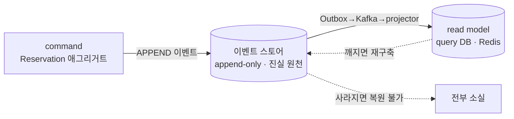
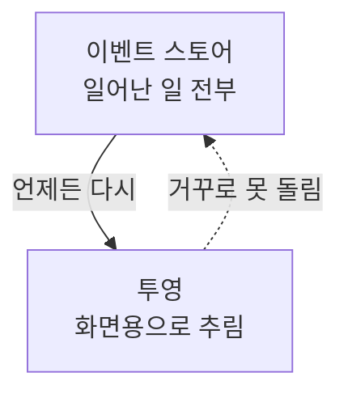
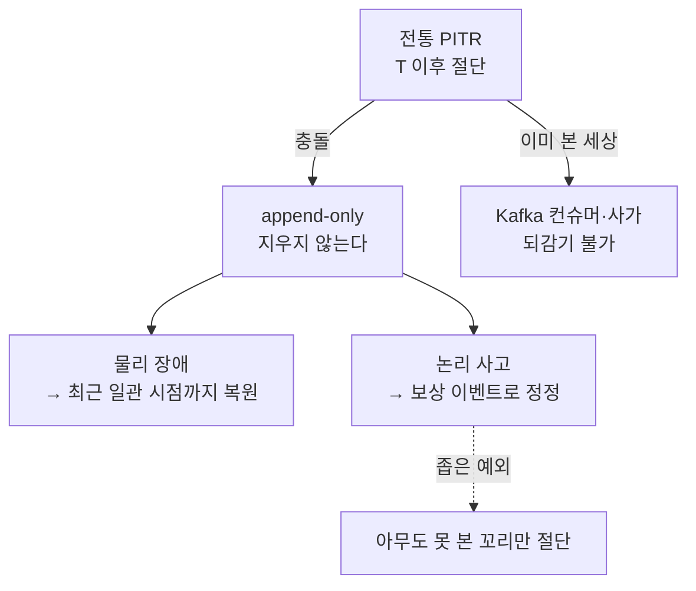
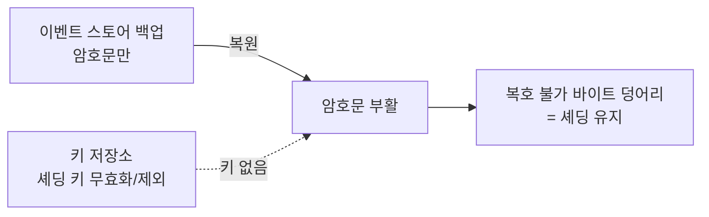
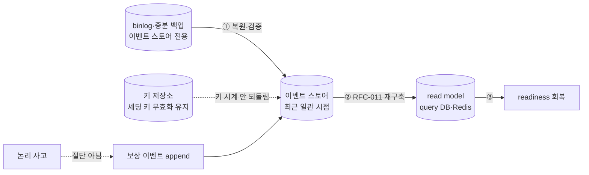

# RFC-017 — 재해 복구·백업 (이벤트 스토어 복구 의미론)

- **상태**: ✅ 종결 (2026-06-16) · [[18.event-store-recovery-semantics]]로 닫힘
- **선행**: [[RFC-001-v2-cqrs-and-event-sourcing]] · [[RFC-011-projection-rebuild-catchup]] · 인덱스 [[RFC-INDEX]]
- **닫으면**: [[08-event-store-lifecycle]] 보강 + 신규 ADR(이벤트 스토어 복구 의미론)

---

## 배경 (Background)

### 시나리오: 디스크가 날아간 다음 날 아침

**V1에서는 이렇게 흐른다.**
상태가 MySQL 테이블에 그대로 들어 있으니, 표준 DB 백업을 복원하면 *현재 상태*가 곧장 되살아난다. 백업 시점의 행이 곧 그 시점의 진실이고, 잃는 건 마지막 백업 이후의 변경뿐이다. 복구의 질문은 단순하다 — "상태를 백업했나."

**V2에서는 이렇게 흐른다.**

1. **진실 원천은 이벤트** — 쓰기 모델의 진실은 append-only 이벤트 스토어에 있다([[RFC-001-v2-cqrs-and-event-sourcing]] · [[05.event-store-mysql-table]]). read model은 그 이벤트로부터 파생된 투영일 뿐이다.
2. **파생물은 다시 만든다** — query DB·Redis가 깨져도 겁먹을 필요가 없다. 이벤트로부터 재구축하면 된다([[RFC-011-projection-rebuild-catchup]]).
3. **그래서 복구의 무게중심이 옮겨간다** — "상태를 백업했나"에서 **"이벤트가 살아있나"**로.

### 비대칭: 투영은 이벤트의 손실성 파생이다

투영은 이벤트의 *손실성 파생*이다 — 이벤트는 일어난 일 전부를 담지만 투영은 그중 화면에 필요한 만큼만 추린다.

| 자산 | 백업이 유일 복원 경로인가 | 깨지면 | 보호 등급 |
|------|--------------------------|--------|-----------|
| **이벤트 스토어(command DB)** | ✅ 예 | 영구 소실 | 손실 없는 보호 |
| query DB | ✗ 아니오 | 재구축으로 복원 | best-effort |
| Redis | ✗ 아니오 | 재구축으로 복원 | best-effort |

read model 100개가 멀쩡해도 이벤트 스토어가 사라지면 거기서 이벤트를 복원할 길은 없다. **이벤트가 사라지면 전부 사라진다.** V2에서 진짜로 지켜야 하는 단 하나의 자산은 append-only 로그 그 자체다.

---

## 맥락 (Context)

V1의 복구는 "DB 전체를 백업해 상태를 되살린다"였다. V2는 진실 원천(이벤트)과 파생물(투영)이 갈라지면서 그 단순함이 깨진다.

- **보호 등급이 자산마다 다르다.** command DB·query DB·Redis는 같은 보호가 필요하지 않다([[13.db-hosting-and-read-write-topology]]). query DB·Redis는 파생물이라 이벤트만 있으면 [[RFC-011-projection-rebuild-catchup]]로 재구축된다 — 백업이 없어도 잃는 건 시간뿐이다. → 백업이 *유일한* 복원 경로인 것은 이벤트 스토어가 사는 command DB뿐이다.
- **append-only가 "복원"의 의미를 비튼다.** 전통적 PITR은 "시점 T로 되감기"인데, 이벤트 스토어에서 그것은 T 이후 append된 이벤트를 절단(truncate)하는 일이고 append-only 불변성과 정면으로 충돌한다. → "복원이 무엇을 의미하는가"부터 다시 정의해야 한다.
- **복원은 다른 결정과 맞물린다.** 옛 시점 복원은 크립토 셰딩([[RFC-005-pii-security]])과 충돌할 수 있고(지운 PII 부활), 복원 후 read model은 재구축([[RFC-011-projection-rebuild-catchup]])과 순서가 맞물린다. → 복구는 셰딩·재구축을 깨지 않는 가드레일 안에서만 성립한다.
- **자산 — append-only는 보호를 오히려 쉽게 만든다.** 변형(update/delete)이 없고 끝에 붙기만 하니 마지막 백업 이후 *추가된* 이벤트만 따라잡으면 된다. [[13.db-hosting-and-read-write-topology]]가 HA용으로 이미 켜둔 binlog가 그대로 연속 복제·PITR의 재료가 된다.

핵심 긴장 — **V2에서 진짜로 지켜야 하는 단 하나의 자산(append-only 로그)의 복구 의미론과 불변식을, append-only를 깨지 않고 셰딩·재구축과 정합하게 잠그되, 실트래픽이 없어 의미를 갖지 못하는 RTO/RPO·런북 같은 운영 수치는 가드레일만 남기고 미룬다.**

---

## Goal / Non-goal

**Goal**
- 백업·복구 설계의 1급 보호 대상을 **이벤트 스토어 한 곳**으로 못박는다.
- append-only 위에서 "시점 복구"가 무엇을 의미하는지 정의한다(물리 장애 vs 논리 사고).
- 복원이 크립토 셰딩을 부활시키지 않는다는 불변식을 백업 설계의 1급 제약으로 잠근다.
- 복구의 *순서 불변식*(진실 원천 먼저, 파생 나중)을 명시한다.

**Non-goal (이번에 하지 않음)**
- RTO/RPO 목표·백업 보존 주기·복구 런북 등 운영 수치·절차 — 실트래픽·운영 부하·비용을 봐야 의미가 있어 **T-18 운영 백로그**로. 이 RFC는 가드레일만 제공한다.
- 복구 리허설(restore drill) 절차 — 운영 백로그로.
- read model 재구축·catch-up 경로의 재정의 — [[RFC-011-projection-rebuild-catchup]]가 정의하므로 참조만 한다.
- binlog→PITR/연속 복제의 구체 메커니즘·호스팅 선택 — [[13.db-hosting-and-read-write-topology]].

---

## 논의 (Discussion)

### 논점 1. 무엇을 보호 대상으로 둘 것인가

**맥락에서 나온 질문.** 보호 등급이 자산마다 다르다는 맥락에서, V1식 "DB 전체 백업"이 더 이상 답이 아니라면 무엇을 1급 보호 대상으로 못박나?

**내 의견(AI):** 백업·복구 설계의 1급 대상을 이벤트 스토어 한 곳으로 못박는다. 파생물(query DB·Redis)은 best-effort로 백업하되(재구축 시간을 줄이는 캐시일 뿐), 진실 원천은 손실 없는 보호를 요구한다. 이 한 자산이 append-only라는 점이 보호를 오히려 쉽게 만든다 — 변형이 없고 끝에 붙기만 하니 마지막 백업 이후 *추가된* 이벤트만 따라잡으면 된다. 증분/연속 백업과 궁합이 좋고, [[13.db-hosting-and-read-write-topology]]가 HA용으로 이미 켜둔 binlog가 그대로 연속 복제·PITR의 재료가 된다. 새 인프라를 들이는 게 아니라 *이미 있는 binlog의 용도를 복구로 확장*하는 것이다.

**네 결정:** 백업·복구의 1급 대상 = 이벤트 스토어(command DB) 단일, 파생물은 best-effort. 〔근거 확인/보강 필요〕

**결론:** 손실 없는 보호는 이벤트 스토어에만, 파생물은 재구축 시간 단축용 캐시로 best-effort 백업. (이의 여지: binlog가 "같은 모델 DB의 HA 이중화"로 정의돼 있는 만큼([[13.db-hosting-and-read-write-topology]]), 이를 시점 복구의 진실 재료로 끌어쓰는 게 호스팅 투명성 원칙과 충돌하지 않는지는 호스팅 결정과 함께 Design에서 본다.)

### 논점 2. append-only 위에서 "시점 복구"는 무엇을 의미하는가

**맥락에서 나온 질문.** "append-only가 복원의 의미를 비튼다"는 맥락의 두 번째 긴장. 전통적 PITR은 T 이후 변경을 *없던 일로* 만드는데, 이벤트 스토어에서 그것은 T 이후 append된 이벤트를 **절단(truncate)**하는 일이고 "한번 쓴 이벤트는 지우지 않는다"는 append-only 정의와 정면으로 부딪친다. 게다가 절단은 데이터 문제로 끝나지 않는다 — T 이후의 이벤트는 이미 발행돼 Kafka 컨슈머가 투영을 갱신했고([[RFC-011-projection-rebuild-catchup]]), 사가가 그 이벤트에 반응해 후속 커맨드를 쐈을([[RFC-006-saga-process-manager]]) 수 있다. 진실 원천만 T로 되감아도 그걸 본 세상은 되감기지 않는다. **깨끗한 되감기는 없다.**

**내 의견(AI):** 입장은 둘로 갈린다. (1) **물리 장애 복구(디스크 고장·리전 다운·노드 유실)에서는 "가장 최근 일관된 시점까지" 복원이 목표지, 임의 시점 되감기가 목표가 아니다** — 잃을 수 있는 건 마지막 복제분 이후의 꼬리뿐이고, 그 꼬리는 아직 아무도 확정적으로 보지 못한 이벤트이길 바란다(RPO 논의로 연결). (2) **논리적 사고(실수 truncate·잘못된 대량 이벤트 주입)의 정정은 PITR이 아니라 *보상 이벤트*로 한다** — append-only의 정정 방식은 과거를 지우는 게 아니라 "그것을 무효화한다"는 새 이벤트를 앞으로 붙이는 것이다. 이렇게 두면 불변성과 다운스트림 일관성이 둘 다 보존된다. 절단형 PITR은 "아직 아무도 본 적 없는 꼬리를 잘라내는" 좁은 경우(예: 복원 직후, 발행 전)로만 한정한다.

**네 결정:** 물리 장애 = 최근 일관 시점까지 복원, 논리 사고 = 보상 이벤트 정정, 절단은 미발행 꼬리로만 한정. 〔근거 확인/보강 필요〕

**결론:** "복원"은 임의 시점 되감기가 아니라 (1) 물리 장애 시 최근 일관 시점까지 복원, (2) 논리 사고 시 보상 이벤트로 정정이며, 절단형 PITR은 아무도 보지 못한 꼬리로만 허용한다. (이의 여지: "아무도 보지 못한 꼬리"의 경계를 무엇으로 판정하느냐 — Kafka 발행 오프셋·아웃박스 커밋 위치 등 — 는 [[RFC-003-messaging-delivery]]의 발행 보장과 맞물려 Design에서 정해야 한다. 보상 이벤트가 모든 논리 사고를 덮는지(예: 절대 일어나선 안 됐던 PII 노출 이벤트)도 사례별로 따진다.)

### 논점 3. 복원이 셰딩된 PII를 부활시키지 않는가 — 그리고 키 유실 시 활성 유저 PII는?

**맥락에서 나온 질문.** "복원은 다른 결정과 맞물린다"는 맥락에서 가장 위험한 결합. 문제는 두 방향이다. (1) 셰딩된 유저의 PII가 복원으로 부활하지 않아야 한다(GDPR). (2) 반대로, **셰딩하지 않은 활성 유저인데 재해로 키 저장소까지 같이 유실되면 그 유저의 PII는 암호문만 남아 영구 복호 불가**가 된다 — 이것이 진짜 미결 논점이다. 키 저장소 백업이 두 조건을 동시에 만족해야 한다: 활성 유저 키는 복원 가능, 셰딩된 유저 키는 백업에서도 제외/무효화(복원 불가).

크립토 셰딩([[RFC-005-pii-security]])과 백업은 본질적으로 위험한 조합이다. 셰딩은 "주체의 키를 지워서 사실상 삭제한다"인데, 옛 백업을 복원하면 그 시점의 데이터가 통째로 살아난다 — 자칫 *지운 PII가 부활*할 수 있고, 이건 GDPR 삭제권을 정면으로 위반한다.

**내 의견(AI):** [[RFC-005-pii-security]]의 설계가 이미 이 함정을 막아두었다. 핵심은 **이벤트 본문(암호문)과 셰딩 키를 같은 백업 단위에 두지 않는다**는 점이다 — 이벤트 스토어를 복원해 암호문이 되살아나도, 그 시점에 키가 이미 파기됐다면 복호할 수 없는 바이트 덩어리만 돌아온다. 즉 **셰딩은 복원을 견딘다**. 이 불변식을 백업 설계의 1급 제약으로 못박는다: (1) 이벤트 스토어 백업은 암호문만 담고 키를 포함하지 않는다, (2) 키 저장소의 백업은 [[RFC-005-pii-security]]가 이미 요구한 대로 셰딩 의미론을 깨지 않는 형태여야 한다 — 셰딩된 키는 키 백업에서도 무효화되거나 애초에 백업 대상에서 빠진다, (3) 따라서 "이벤트 스토어를 옛 시점으로 복원"과 "키는 현재 상태(이미 셰딩됨)를 유지"가 독립적으로 성립한다. 복원은 이벤트의 시계를 되돌리지만 키의 시계는 되돌리지 않는다 — 이 비대칭이 셰딩을 지킨다.

**네 결정:** 암호문과 키를 분리 백업, 셰딩 키는 키 백업에서도 무효화/제외, 이벤트 복원과 키 현재상태 유지를 독립화. 〔근거 확인/보강 필요〕

**결론:** 복원은 이벤트의 시계만 되돌리고 키의 시계는 되돌리지 않으며, 그 비대칭이 셰딩을 견디게 한다. (이의 여지: 키 저장소 자체가 물리 장애로 유실됐을 때의 복원 경로 — 키 백업의 무결성과 셰딩 정합성을 *동시에* 만족시키는 복원 — 은 [[RFC-005-pii-security]]의 키 백업 스코프와 함께 Design에서 검증한다. blind index([[RFC-005-pii-security]])가 주체 키 파생이므로 키와 함께 무효화된다는 점도 같은 불변식 안에서 확인한다.)

### 논점 4. 이벤트 스토어를 복원한 다음, read model은?

**맥락에서 나온 질문.** "복원은 재구축과 순서가 맞물린다"는 맥락에서, 진실 원천이 회복된 뒤 파생 read model은 어떻게 따라잡나? 그리고 둘의 순서를 어떻게 고정하나?

**내 의견(AI):** 이 질문은 이미 답이 있다. 이벤트 스토어가 복원돼 진실 원천이 회복되면 query DB·Redis 같은 파생 read model은 [[RFC-011-projection-rebuild-catchup]]의 재구축·catch-up 절차로 따라잡는다 — 백업에서 복원하든 처음부터 다시 투영하든 그건 재구축 운영의 결정이다. **이 RFC는 그 경로를 중복해서 정의하지 않고 참조만 한다.** 다만 한 가지 *순서 불변식*은 여기서 명시할 가치가 있다: 복구는 항상 **진실 원천 먼저, 파생 나중**이다. 이벤트 스토어가 일관된 시점으로 복원되기 전에 read model 재구축을 시작하면, 사라질 운명인 꼬리 이벤트를 투영하거나 빈 스토어 위에서 헛돌게 된다.

**네 결정:** 재구축 경로는 RFC-011 참조, 복구 시퀀스는 "① 이벤트 스토어 복원·검증 → ② 재구축 트리거 → ③ readiness 회복"로 고정. 〔근거 확인/보강 필요〕

**결론:** read model 복구는 [[RFC-011-projection-rebuild-catchup]]에 위임하되, 순서 불변식(진실 원천 먼저, 파생 나중)만 못박는다. (이의 여지: read model 백업이 이벤트 스토어 백업보다 *최신*이라 둘의 시점이 어긋나는 경우 — read model을 신뢰하지 않고 버린 뒤 재구축으로 통일하는 게 안전한지는 재구축 비용과 함께 [[RFC-011-projection-rebuild-catchup]] 쪽에서 본다.)

### 논점 5. 운영 수치·런북은 이 RFC가 정하는가

**맥락에서 나온 질문.** 핵심 긴장의 후반 — 복구의 *아키텍처 의미론*은 책상에서 잠글 수 있지만, RPO·RTO·보존 주기·런북은 실트래픽·운영 부하·비용을 봐야 의미가 있다. 그런데 V2는 아직 실트래픽이 없다. 지금 RTO=N분 같은 숫자를 박으면 무엇을 최적화하는 셈인가?

**내 의견(AI):** 복구의 아키텍처 의미론(무엇을 보호하고, 복원이 불변식 위에서 무엇을 뜻하며, 셰딩·재구축과 어떻게 맞물리는가)은 논점 1~4에서 잠근다. 하지만 **얼마나 자주 백업하고(RPO), 얼마나 빨리 복구하며(RTO), 백업을 얼마나 오래 보존하고, 누가 어떤 순서로 복구를 집행하는가(런북)** 같은 운영 수치·절차는 여기서 정하지 않는다. 지금 숫자를 박으면 존재하지 않는 비용을 최적화하는 셈이다. 그래서 이것들은 **T-18 운영 백로그로 넘긴다** — 이 RFC는 그 백로그가 *어떤 불변식을 깨면 안 되는지*(셰딩을 부활시키지 않을 것, append-only를 존중할 것, 진실 원천 먼저 복원할 것)의 가드레일만 제공한다.

**네 결정:** 운영 수치·런북·복구 리허설은 T-18 운영 백로그로, 이 RFC는 가드레일만. 〔근거 확인/보강 필요〕

**결론:** RTO/RPO·보존 주기·런북·restore drill은 본 RFC 범위 밖(운영 백로그), 본 RFC는 셰딩·append-only·진실 원천 우선의 가드레일만 남긴다. (이의 여지: 가드레일과 운영 수치의 경계가 정말 깔끔하게 나뉘는지 — 예컨대 "보존 기간"이 셰딩 정합성에 영향을 주는 지점이 있다면 그건 의미론으로 끌어와야 한다 — 는 운영 백로그를 채우며 재확인한다.)

---

## 결정 요약

| # | 결정 | ADR |
|---|------|-----|
| 1 | 백업·복구 1급 대상 = **이벤트 스토어(command DB) 단일**, 파생물은 best-effort 캐시 | 신규 ADR 예정 · [[13.db-hosting-and-read-write-topology]] |
| 2 | "복원" = **물리 장애 시 최근 일관 시점 복원 + 논리 사고 시 보상 이벤트**, 절단은 미발행 꼬리로만 | 신규 ADR 예정 · [[RFC-003-messaging-delivery]] · [[RFC-006-saga-process-manager]] |
| 3 | 복원이 셰딩을 부활시키지 않는다 = **암호문/키 분리 백업**, 셰딩 키는 키 백업에서도 무효화, 이벤트·키 시계 독립 | 신규 ADR 예정 · [[RFC-005-pii-security]] |
| 4 | 복구 순서 불변식 = **진실 원천 먼저, 파생 나중**(① 복원·검증 → ② 재구축 → ③ readiness) | 신규 ADR 예정 · [[RFC-011-projection-rebuild-catchup]] |
| 5 | 운영 수치(RTO/RPO·보존·런북·리허설)는 **T-18 운영 백로그**, 본 RFC는 가드레일만 | 신규 ADR 예정 |

상세 설계는 [[18.event-store-recovery-semantics]] · [[08-event-store-lifecycle]] 참조.

---

## 결과 (목표 복구 의미론 요약)

- **보호 대상**: 손실 없는 보호는 이벤트 스토어 한 곳, 파생물(query DB·Redis)은 재구축 시간 단축용 best-effort 백업.
- **복원의 의미**: 물리 장애 = 최근 일관 시점까지, 논리 사고 = 보상 이벤트 정정, 절단은 아무도 못 본 꼬리로만.
- **셰딩 정합**: 암호문과 키를 분리 백업하고 키의 시계는 되돌리지 않아 셰딩이 복원을 견딘다.
- **복구 순서**: 진실 원천 먼저(복원·검증) → 파생 나중(재구축) → readiness.
- **운영 수치**: RTO/RPO·보존·런북·리허설은 가드레일만 남기고 T-18 운영 백로그로.

상세 복구 의미론·시퀀스는 [[18.event-store-recovery-semantics]] · [[08-event-store-lifecycle]] 참조.

---

## 관련 문서

- 분석/인덱스: [[RFC-INDEX]]
- 설계: [[18.event-store-recovery-semantics]] · [[08-event-store-lifecycle]]
- 연관: [[RFC-001-v2-cqrs-and-event-sourcing]] · [[RFC-011-projection-rebuild-catchup]] · [[RFC-005-pii-security]] · [[RFC-004-event-store-schema-evolution]] · [[RFC-003-messaging-delivery]] · [[RFC-006-saga-process-manager]] · [[RFC-008-observability]]
- 인프라: [[05.event-store-mysql-table]] · [[13.db-hosting-and-read-write-topology]]
