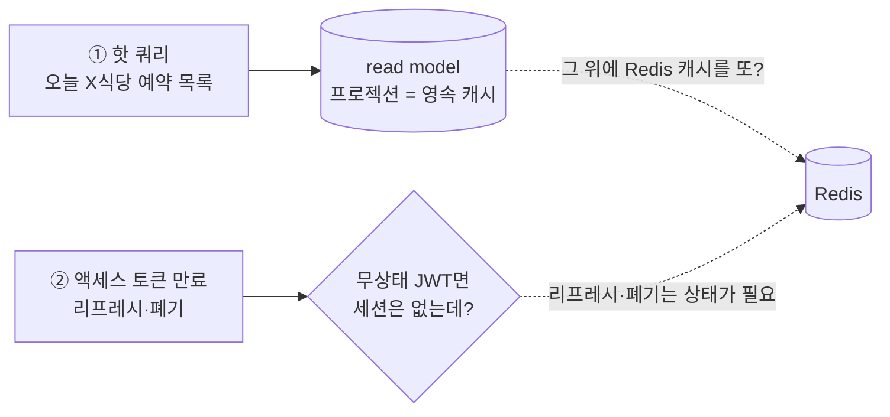
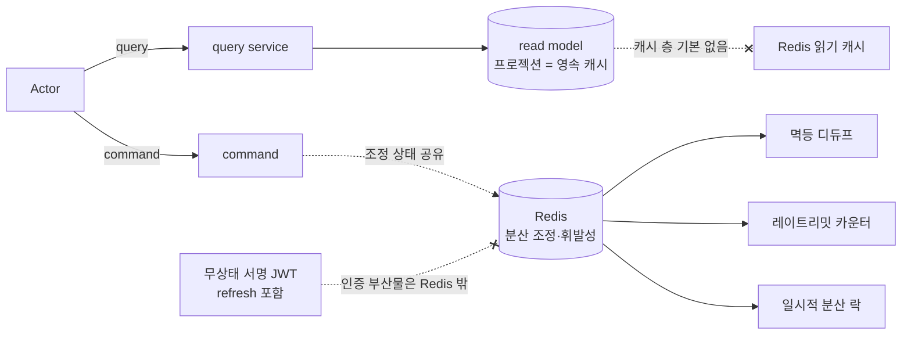

# RFC-018 — 캐싱·Redis의 V2 역할

- **상태**: ✅ 종결 (2026-06-23)
- **선행**: [[RFC-001-v2-cqrs-and-event-sourcing]] · [[RFC-002-read-model-consistency]] · 인덱스 [[RFC-INDEX]]
- **닫으면**: [[03-read-model]] 보강 + 신규 ADR

---

## 배경 (Background)

### 시나리오: 핫 쿼리 한 건과 만료된 토큰 한 건이 시스템을 통과한다

**V1에서는 이렇게 흐른다.**
V1의 Redis는 한 가지 역할이 아니었다. 코드를 열어 보면 Redis(+ Redisson) 위에 올라간 것이 꽤 여럿이다 — Redisson 분산 락(`AcquireLockAdapter`·`FairLock`)과 세마포어(`timetable`의 자리 점유), 레이트리미터(`AcquireRateLimitRedisAdapter`), 리프레시 토큰 저장(`SaveGeneralUserRefreshTokenTemplate`·`SaveSellerUserRefreshTokenTemplate`), 피처 플래그(`FeatureFlagRedisTemplate`), 재시도 컨텍스트 캐시(`RedisRetryContextCache`), 그리고 `RedisCacheManager`(스프링 `@Cacheable` 받침대). 즉 V1의 Redis는 "캐시"라기보다 *동기 모놀리식이 못 들고 있던 휘발성·분산 상태를 한 군데 모아 둔 사이드 저장소*였다. (흔히 짐작하는 "Redis 세션"은 V1에 실제로는 없다 — `HttpSession`·spring-session을 쓰지 않고, 인증 상태로 남기는 건 *리프레시 토큰*뿐이다.)

**V2에서는 이렇게 흐른다.**

V2는 이 그림을 두 군데에서 흔든다.

1. **읽기가 별도 프로젝션 조회로 갈렸다** ([[03-read-model]]). 프로젝션 read model은 그 자체가 **이미 질의에 맞춰 비정규화해 둔 머티리얼라이즈드 뷰** — 일종의 영속 캐시다. 그러니 "그 위에 Redis 캐시를 또 얹나?"가 새로 생긴다.
2. **인증이 무상태 JWT 토큰으로 정리됐다** ([[RFC-015-authorization-model]] — 신원·역할은 토큰 클레임으로 흐른다). 그러면 "서버가 들고 있던 세션 상태"라는 명목이 사라지는데, V1이 Redis에 넣던 리프레시 토큰은 그래도 어딘가 남아야 하지 않나.

### 두 시나리오로 본 긴장

- **(시나리오 A) "오늘 X식당 예약 목록"** 같은 핫 쿼리가 분(分) 단위로 같은 화면에 쏟아진다. 이건 `reservation` read-model 프로젝션을 친다 — 이미 읽기 최적화된 뷰다. 그 앞에 Redis 캐시 한 겹을 더 두는 게 이득인가, 아니면 무효화 부담만 늘리나?
- **(시나리오 B) USER가 로그인해 액세스 토큰이 만료됐다.** 클라이언트가 리프레시 토큰으로 새 액세스 토큰을 받는다. 무상태 JWT라면 서버 세션은 없는데, 이 리프레시 토큰과 "강제 로그아웃(토큰 폐기)"은 무상태로 둘 수 없다 — 어딘가 저장·조회·삭제가 필요하다. 이게 Redis인가?

| 개념 | V1 | V2 | 한 줄 정의 |
|------|-----|-----|-----------|
| **읽기 캐시** | `RedisCacheManager`(`@Cacheable`) | 기본 안 함 (프로젝션이 이미 영속 캐시) | "읽기를 미리 최적화해 둔 머티리얼라이즈드 뷰 위에 또 캐시를 얹지 않는다" |
| **세션 상태** | (없음 — `HttpSession` 미사용) | 무상태 JWT라 불필요 | "로그인 중인가의 서버 보관분 — 토큰이 스스로 증명" |
| **Redis 역할** | 휘발성·분산 상태의 사이드 저장소 | 분산 조정·휘발성 상태 저장소로 좁힘 | "캐시 층이 아니라 인스턴스 간 공유하는 짧은 TTL 조정 상태" |

---

## 맥락 (Context)

위 두 시나리오를 따라가면, V2에서 Redis의 역할이 "읽기 가속 캐시"에서 *프로젝션이 싸게 못 푸는 좁은 패턴 전용 저장소*로 줄어든다는 게 드러난다.

- **프로젝션 read model은 이미 영속 캐시다.** 이벤트를 구독해 화면·조회 모양으로 비정규화해 둔, 조인을 미리 풀어 디스크에 영속한 머티리얼라이즈드 뷰다([[03-read-model]]). → 그 앞에 Redis를 한 겹 더 두면 *캐시 위의 캐시*가 되어, 같은 일을 두 번 하면서 무효화 부담만 들여온다.
- **최종 일관 세계에서 캐시는 staleness를 두 겹으로 쌓는다.** read model은 이벤트를 비동기로 받아 갱신되어 이미 프로젝션 지연이라는 staleness 창이 하나 있다([[RFC-002-read-model-consistency]]). → 그 위에 TTL 캐시를 얹으면 "이게 프로젝션이 늦은 건지 캐시가 안 비워진 건지"를 가르기 어려워진다.
- **무상태 JWT는 세션 상태만 없앤다.** 매 요청의 신원·역할은 토큰 클레임으로 얻으므로 서버 세션 저장소는 없어도 된다([[RFC-015-authorization-model]]). → 그러나 리프레시 토큰·토큰 폐기(블랙리스트)는 무상태로 둘 수 *없는* 잔여분이라, 어딘가 정확한 상태로 저장·조회·삭제되어야 한다.
- **자산 — V1 Redis의 일부는 V2에서도 정당하다.** 레이트리밋 카운터(`AcquireRateLimitRedisAdapter`)·Redisson 분산 락처럼 *여러 인스턴스가 공유해야 하는 휘발성 조정 상태*는 인스턴스 로컬로 둘 수 없다. → 이건 캐시가 아니라 분산 조정이며, V2 Redis 역할의 본체다.

미리 못 박을 경계 하나 — **사가의 임시 점유 TTL은 이 RFC의 Redis 후보가 아니다.** [[RFC-006-saga-process-manager]]에서 점유 만료는 *스케줄러 DB 폴링*으로 이미 결정됐다(Redisson 세마포어가 아니라). V1의 `timetable` 세마포어를 V2 점유로 착각해 끌어오지 말 것.

핵심 긴장 — **읽기는 프로젝션이라는 영속 캐시를 이미 가졌고 인증은 무상태로 정리됐다. 그렇다면 Redis를 "읽기 가속 캐시"로 더 얹지 않고 "분산 조정·휘발성 상태" 전용으로 좁히되, 그 안에 섞인 durability 등급이 인스턴스를 가를 근거가 되는지까지 정해야 한다.**

---

## Goal / Non-goal

**Goal**
- V2에서 read model 앞에 캐시 층을 둘지의 기본 입장을 정한다.
- 무상태 인증이 남기는 잔여 상태(리프레시 저장·토큰 폐기)의 거취를 정한다.
- V2에서 Redis가 정당하게 사는 아키텍처 역할을 좁혀 정의한다.
- Redis 안의 durability 등급 발산과 인스턴스 분리 여부를 정한다.

**Non-goal (이번에 하지 않음)**
- 캐시를 정말 둘 "프로젝션이 싸게 못 푸는 패턴"의 식별과 손익분기 임계 — 읽기 분포 측정 트리거로 Design/운영에 위임([[RFC-002-read-model-consistency]] 측정 정책과 연동).
- 캐시를 둔다면 그 한 패턴에 한한 무효화 전략(이벤트 기반 비우기 vs TTL)·허용 staleness — 화면별로 Design에서.
- 요청-단 멱등 디듀프의 Redis 키 구성·윈도 길이 — [[RFC-012-command-query-api-contract]] 잔여 케이스 확정과 함께 Design에서.
- V1 Redis 잔재(피처 플래그·재시도 컨텍스트·Redisson 락 사용 면적)의 V2 항목별 귀속표 — Design에서.
- Redis의 *호스팅*·토폴로지(관리형 vs 자가, 단일/센티넬/클러스터, 인스턴스 개수) — 배포 사이클([[RFC-007-deployment-infra-ops]] 투명 원칙)에 위임. 여긴 아키텍처 *역할*만 정한다.

---

## 논의 (Discussion)

### 논점 1. 프로젝션이 이미 캐시인데, 그 위에 캐시를 또 얹나

**맥락에서 나온 질문.** 시나리오 A다. 프로젝션 read model은 이벤트를 구독해 화면·조회 모양으로 비정규화해 둔 뷰다([[03-read-model]] "(가) 이벤트 프로젝션 read model"). 즉 조인을 미리 풀어 둔, 디스크에 영속된 머티리얼라이즈드 캐시다. 그 앞에 Redis를 한 겹 더 두면 그건 *캐시 위의 캐시* — 2차 캐시 층이다.

**내 의견(AI):** **기본적으로 read model 앞에 캐시 층을 얹지 않는다.** 프로젝션을 두는 목적 자체가 "읽기를 미리 최적화해 둔다"이므로, 그 위에 또 캐시를 얹는 것은 같은 일을 두 번 하는 것이다. 핫 쿼리가 느리다면 1차 대응은 Redis 한 겹이 아니라 *프로젝션을 그 쿼리 모양에 맞게 다시 비정규화하는 것* — read model은 화면·조회 용도마다 여럿 둘 수 있으니([[03-read-model]] "도메인별 스키마 분리"), "오늘 X식당 예약 목록"이 뜨거우면 그 화면 전용 프로젝션을 추가하는 게 정공법이다. 캐시 층은 새 인프라 컴포넌트, 직렬화 포맷, 무효화 정책을 통째로 들여오는 데 반해, 프로젝션을 한 벌 더 만드는 건 이미 가진 메커니즘의 재사용이다. 읽기 확장도 캐시가 아니라 query 인스턴스의 HA 레플리카로 분산한다([[RFC-007-deployment-infra-ops]]).

**네 결정:** Redis 읽기 캐시는 기본 안 함 — 프로젝션이 구조적으로 싸게 못 푸는 게 측정으로 드러난 특정 패턴에만. 〔근거 확인/보강 필요〕

**결론:** read model 앞에 캐시 층을 기본으로 두지 않는다. 핫 쿼리 1차 대응은 화면 전용 프로젝션 추가, 읽기 확장은 query HA 레플리카. (이의 여지: 프로젝션으로도 비싼 진짜 핫 패턴이 있을 수 있다 — 초당 수천 회 같은 키, 혹은 한 행에 매번 무거운 집계가 필요한 경우. "프로젝션 재설계 vs Redis 캐시 한 겹"의 손익분기는 실제 읽기 분포 측정으로만 갈리며, 그 측정 트리거·임계는 [[RFC-002-read-model-consistency]] 측정 정책과 연동해 Design/운영으로 넘긴다.)

### 논점 2. 최종 일관 세계에서 캐시 무효화를 어떻게 다루나

**맥락에서 나온 질문.** 논점 1의 입장을 더 미는 이유가 일관성에 있다. read model은 이벤트를 *비동기로* 받아 갱신되어, 쓰기와 읽기 사이에 이미 프로젝션 지연이라는 staleness 창이 하나 있다([[RFC-002-read-model-consistency]] "프로젝션 지연을 얼마나 허용하나"). 그 위에 TTL 캐시를 얹으면 staleness가 *두 겹*이 된다 — 이벤트→프로젝션 지연에, 프로젝션→캐시 TTL 지연이 더해진다.

**내 의견(AI):** 이 2차 staleness를 *기본적으로 사들이지 않는다.* 무효화를 제대로 하려면 캐시를 프로젝터의 갱신에 묶어 이벤트 기반으로 비워야 하는데(같은 이벤트가 프로젝션도 갱신하고 캐시도 무효화), 그건 프로젝터에 캐시 무효화 책임을 더 얹는 일이라 결국 "프로젝션을 갱신하는 김에 캐시도 갱신"이 되어 프로젝션을 한 벌 더 두는 것과 비용이 비슷해진다. TTL 기반 무효화는 구현은 싸지만 "옛 데이터를 TTL만큼 보여 줘도 되는 화면"에서만 정당하고, 그 정당성은 화면별로 다르다.

**네 결정:** 2차 staleness를 기본으로 사들이지 않고, 전역 캐시 정책을 먼저 세우지 않는다. 〔근거 확인/보강 필요〕

**결론:** 캐시 무효화 전략은 캐시를 *정말 둘 그 특정 패턴이 정해진 다음* 그 패턴에 한해 결정한다. (이의 여지: 무효화 전략(이벤트 기반 비우기 vs TTL)과 허용 staleness는 화면별로 다르며, 캐시를 둘 패턴이 확정되면 그때 Design에서 정한다.)

### 논점 3. 세션 상태와 토큰 폐기를 어떻게 가르나

**맥락에서 나온 질문.** 시나리오 B다. V2 인증은 무상태 JWT다([[RFC-015-authorization-model]]) — 매 요청의 신원·역할은 토큰 클레임을 검증해 얻고, 서버는 "이 사용자가 로그인 중"이라는 세션 상태를 들지 않는다. 그러니 V1식 *서버 세션 저장소*는 V2에 없어도 된다 — 애초에 V1도 `HttpSession`을 쓰지 않았으니 잃을 게 없다. 다만 무상태 토큰이 *전부*를 무상태로 만들지는 않는다.

검토한 선택지(둘을 갈라야 한다):
- **세션 상태** — "로그인 중인가"의 서버 보관분. 무상태 JWT면 필요 없다. 액세스 토큰 자체가 만료 시각까지 스스로를 증명하므로 서버 조회가 없다.
- **토큰 폐기·리프레시 저장** — 무상태로 둘 수 *없는* 잔여분. (a) 리프레시 토큰: 액세스 토큰을 짧게 두고 리프레시로 재발급하는 구조라면 어딘가 저장·조회·삭제되어야 한다(V1이 Redis에 넣던 그것). (b) 토큰 폐기(블랙리스트/revocation): "지금 즉시 로그아웃·강제 만료"는 무상태 토큰의 본질적 빈틈이라, 즉시 무효화하려면 "폐기됨" 목록을 *상태로* 들고 매 검증 때 대조해야 한다.

**내 의견(AI):** **"세션 없음, 그러나 토큰 폐기·리프레시 저장은 짧은 TTL 상태 저장소가 필요할 수 있다"**로 가른다. 그 저장소가 Redis여야 하는 이유는 "세션 캐시"가 아니라 *짧은 TTL·고빈도 키-값·만료 자동 정리*라는 접근 패턴이 Redis에 곧게 맞기 때문이다. 핵심은 **이게 "읽기 캐시"가 아니라 "인증 부산물 상태"라는 분류**다 — 캐시 갈래(논점 1·2)와 섞지 말아야 한다(토큰은 stale해도 되는 데이터가 아니라 *정확해야 하는* 상태다). 한 가지 더 — 토큰이 "정확해야 하는 상태"라는 말은 **메모리 압박 시에도 evict되면 안 된다**는 뜻이다. 특히 폐기 목록 항목이 eviction으로 떨어지면 *폐기된 토큰이 되살아나는* 보안 구멍이 된다. 이 must-not-evict 성질은 논점 5의 조정 상태와 갈리는 지점이다.

**네 결정:** 세션 상태는 없앤다(무상태). 리프레시 저장·토큰 폐기는 "인증 부산물 상태"로 분류하되 그 거취는 [[RFC-019-auth-token-transport]]가 닫았다 — refresh를 무상태 서명 JWT로 두고 **Redis 서버 사본을 제거**, 즉시 폐기는 **포기**(요구 입증 시에만 denylist 부활). 〔근거 확인/보강 필요〕

**결론:** V2 기본에서 "인증 부산물" 후보는 *Redis에 남지 않는다*([[RFC-019-auth-token-transport]] 갱신, 2026-06-16). (이의 여지: 폐기 목록을 실제로 둘지는 "즉시 강제 로그아웃" 요구가 정말 빡빡한지에 달렸다 — 액세스 토큰 수명을 충분히 짧게 잡으면 "토큰 자연 만료를 기다린다"로도 대부분 덮인다. 토큰 수명 vs 즉시성의 트레이드오프는 [[RFC-015-authorization-model]]이 "역할은 토큰 발급 시점 스냅샷"으로 남긴 문제와 한 몸이며, 인증 토큰 정책(인프라 백로그) 및 즉시성 요구 입증 시 TTL·스키마 확정은 Design으로 넘긴다.)

### 논점 4. 그래서 V2에서 Redis가 정당하게 사는 자리는 어디인가

**맥락에서 나온 질문.** 캐시도 아니고 세션도 아니라면, V1이 Redis에 올렸던 나머지는 V2에서 어떻게 되나(맥락의 "자산").

**내 의견(AI):** Redis를 *읽기 가속*에서 떼어내, **"여러 인스턴스가 공유해야 하는 휘발성·짧은 TTL 조정 상태" 전용**으로 좁힌다. 그 자리에 드는 후보는 —

- **요청-단 멱등 디듀프(짧은 윈도).** [[RFC-012-command-query-api-contract]]가 남긴 잔여 케이스 — 자연 유니크 불변식이 없는 생성 command에 한해, 짧은 윈도의 서버 측 디듀프가 필요할 수 있다. 윈도가 짧고 TTL로 청소되며 여러 인스턴스가 공유해야 하므로 Redis 패턴에 맞다.
- **레이트리밋 카운터.** V1의 `AcquireRateLimitRedisAdapter` 계승. 다중 인스턴스가 공유하는 분산 카운터라 인스턴스 로컬로 둘 수 없다.
- **일시적 분산 락.** V1의 Redisson 락 계승. 단, 도메인 동시성 제어는 V2에서 우선 애그리거트 + 낙관적 락([[RFC-012-command-query-api-contract]] "상태 전이 command"의 버전 가드)으로 흡수하므로, 분산 락은 *도메인 불변식으로 못 푸는 인프라 레벨 상호배제*에만 — 사용 면적이 V1보다 줄어든다.

공통점은 셋 다 "읽기를 빠르게 하려는 캐시"가 아니라 "분산 환경에서 인스턴스 간에 공유해야 하는, 본질적으로 휘발성이고 TTL이 자연스러운 조정 상태"라는 점이다.

**네 결정:** Redis의 V2 아키텍처 역할 = *분산 조정·휘발성 상태 저장소*(멱등 디듀프·레이트리밋 카운터·일시적 분산 락). 〔근거 확인/보강 필요〕

**결론:** Redis는 캐시 층이 아니라 분산 조정·휘발성 상태 저장소다. (이의 여지: 피처 플래그(V1 `FeatureFlagRedisTemplate`)·재시도 컨텍스트(`RedisRetryContextCache`)·Redisson 락 사용 면적 같은 V1 잔재가 V2에서 Redis에 남을지 설정/메시징 인프라로 흡수될지는, 항목별 V2 거취가 정해질 때 가른다 — 이 RFC는 "캐시냐 아니냐" 분류 원칙만 세우고 항목별 귀속표는 Design으로 넘긴다.)

### 논점 5. 같은 Redis라도 durability 등급이 갈리면 인스턴스를 가르나

**맥락에서 나온 질문.** 역할은 논점 4에서 "분산 조정·휘발성 상태" 하나로 좁혀졌지만, 그 안에 **메모리 압박 시 동작이 정반대여야 하는 두 등급**이 섞여 있다(논점 3의 must-not-evict와 논점 4의 evict 가능). "Redis가 다재다능해서 여러 개로 쪼개야 하나"라는 직관이 정당한지 따진다.

검토한 두 등급:
- **(등급 1) 조정 상태 — 손실 허용, evict 가능.** 레이트리밋 카운터·일시적 분산 락·요청-단 멱등 디듀프. 재시작·eviction으로 날아가도 최악이 "몇 건이 한 번 더 새거나 윈도가 리셋되는" 정도다. `allkeys-lru` 같은 eviction이 정당하다.
- **(등급 2) 인증 부산물 — must-not-evict.** 리프레시 토큰·폐기 목록. eviction으로 폐기 항목이 떨어지면 *폐기된 토큰이 되살아나는* 보안 구멍이다(논점 3). `noeviction`이라야 한다.

**내 의견(AI):** 문제는 **한 Redis 인스턴스의 `maxmemory-policy`는 하나**라는 점이다. 카운터에 맞춘 `allkeys-lru`는 폐기 목록을 조용히 떨궈 보안 구멍을 내고, 인증에 맞춘 `noeviction`은 카운터가 메모리 압박에서 쓰기 실패로 번지게 한다. 두 등급은 한 정책으로 깨끗이 양립하지 못한다 — 여기가 "Redis를 기능별로 여러 개 두자"가 *정당하게* 서는 지점이다("일을 너무 많이 해서"가 아니라 **durability 요구가 갈려서**). 그런데 V2는 이 발산을 *쪼개서 관리*하지 않고 *발산하는 워크로드를 제거*해 해소한다. [[RFC-019-auth-token-transport]]가 인증 부산물(refresh 저장·폐기)을 Redis 밖으로 들어냈으므로(무상태 서명 JWT + 폐기 포기), **Redis에 남는 건 등급 1(조정 상태)뿐 — 단일 durability 등급**이다. 그러면 기능별로 인스턴스를 가를 must-not-evict 이유가 사라진다.

**네 결정:** Redis에 남는 워크로드가 등급 1 단일 durability이므로 단일 `allkeys-lru`(혹은 `volatile-lru`)로 충분하고 인스턴스도 하나면 된다. **인스턴스 분리는 추후 진행.** 〔근거 확인/보강 필요〕

**결론:** "Redis가 다재다능해 여러 개로 쪼개야 하나"라는 물음은 *쪼개기가 아니라 워크로드 축소로* 닫힌다 — 단일 인스턴스·단일 eviction 정책. (이의 여지: [[RFC-019-auth-token-transport]]에서 즉시 폐기 요구가 입증돼 denylist가 부활하면 must-not-evict 등급이 되살아나고 인스턴스 분리 논의도 함께 되살아난다 — 그 경우의 실현은 토폴로지 결정이라 [[RFC-007-deployment-infra-ops]]로 넘긴다. 참고: 논리 DB(`SELECT 0~15`)·키 프리픽스는 네임스페이스만 가를 뿐 메모리·단일 스레드 코어를 공유하므로 eviction·blast-radius를 격리하지 못한다 — 진짜 격리가 필요하면 별도 인스턴스다. `maxmemory-policy` 확정은 단일 등급(조정 상태)만 남았으므로 `allkeys-lru`/`volatile-lru` 계열로 단순화해 Design에서.)

---

## 결정 요약

| # | 결정 | ADR |
|---|------|-----|
| 1 | **읽기 캐시 = 기본 안 함** — 프로젝션이 이미 영속 캐시. 핫 쿼리는 화면 전용 프로젝션 추가, 읽기 확장은 query HA 레플리카 | [[03-read-model]] · [[RFC-007-deployment-infra-ops]] · 신규 ADR 예정 |
| 2 | 캐시 무효화·2차 staleness는 **전역 정책을 먼저 세우지 않음** — 캐시를 둘 특정 패턴 확정 후 그 패턴에 한해 결정 | [[RFC-002-read-model-consistency]] |
| 3 | 세션 상태는 무상태로 제거. **인증 부산물(refresh 저장·토큰 폐기)은 V2 기본에서 Redis에 남지 않음** | [[RFC-019-auth-token-transport]] · [[RFC-015-authorization-model]] |
| 4 | **Redis 역할 = 분산 조정·휘발성 상태 저장소** (요청-단 멱등 디듀프·레이트리밋 카운터·일시적 분산 락) | [[RFC-012-command-query-api-contract]] · 신규 ADR 예정 |
| 5 | Redis에 남는 워크로드는 **등급 1(조정 상태) 단일 durability** → 단일 `allkeys-lru`/`volatile-lru`, **단일 인스턴스(분리는 추후)** | [[RFC-019-auth-token-transport]] · [[RFC-007-deployment-infra-ops]] |

상세 설계는 [[03-read-model]] 보강 + 신규 ADR 참조.

---

## 결과 (목표 아키텍처 요약)

- **읽기**: 프로젝션 read model이 영속 캐시 역할을 하므로 그 앞에 Redis 캐시 층을 기본으로 두지 않는다. 핫 쿼리는 화면 전용 프로젝션, 읽기 확장은 query HA 레플리카.
- **인증**: 세션 상태 없음(무상태 JWT), refresh도 무상태 서명 JWT라 Redis 서버 사본 없음, 즉시 폐기는 포기(요구 입증 시 denylist 부활).
- **Redis**: 캐시 층이 아니라 *분산 조정·휘발성 상태 저장소* — 멱등 디듀프·레이트리밋 카운터·일시적 분산 락만.
- **durability**: 남는 워크로드가 등급 1 단일이라 단일 eviction 정책·단일 인스턴스로 충분(인스턴스 분리는 추후).

상세 모듈·정책은 [[03-read-model]] 보강 + 신규 ADR 참조.

---

## 관련 문서

- [[RFC-INDEX]] · [[RFC-001-v2-cqrs-and-event-sourcing]] · [[RFC-002-read-model-consistency]] · [[RFC-012-command-query-api-contract]] · [[RFC-015-authorization-model]] · [[RFC-019-auth-token-transport]] · [[RFC-006-saga-process-manager]] · [[RFC-007-deployment-infra-ops]] · [[03-read-model]]
