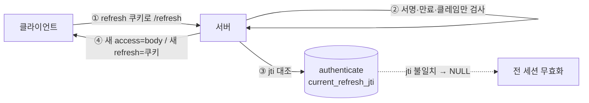
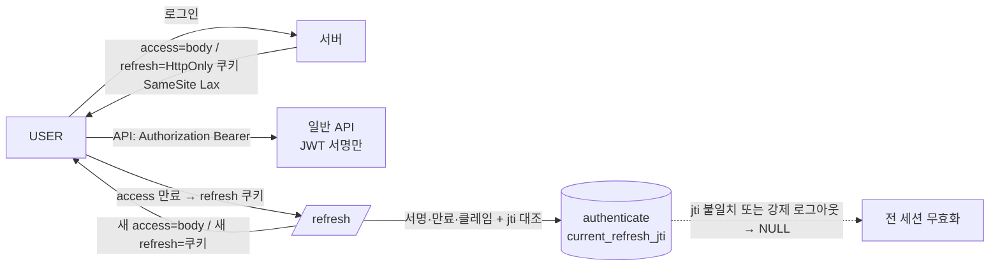

# RFC-019 — 인증 토큰의 transport·무상태성과 폐기 포기

- **상태**: ✅ 종결 (2026-06-23)
- **선행**: [[RFC-015-authorization-model]] · [[RFC-018-caching-redis-role]] · 인덱스 [[RFC-INDEX]]
- **닫으면**: 신규 design_doc(인증 토큰) 또는 [[RFC-015-authorization-model]] design_doc 보강 + 신규 ADR

---

## 배경 (Background)

### 시나리오: USER의 access가 만료돼 토큰을 갈아끼운다

**V1에서는 이렇게 흐른다.**
로그인 시 `GeneralUserSignInController`가 access 토큰을 응답 body(`LoginGeneralUserResponse`)로 내리고, refresh 토큰은 `HttpOnly`·`Secure` 쿠키(`RefreshTokenDefinitions`: `path=/`)로 심는다. 클라이언트는 access를 Authorization 헤더(Bearer)로 들고 다니고(`JwtFilter`가 푼다), refresh는 브라우저가 `/refresh`에 자동으로 실어 보낸다(`RefreshGeneralUserController`가 쿠키에서 꺼낸다). 여기까지는 깔끔한데, V1은 그 위에 *하나 더* 얹었다 — refresh 토큰을 서버 측 Redis에도 저장하고(`SaveGeneralUserRefreshToken`), `/refresh` 때 그 저장분을 조회해(`FindGeneralUserRefreshToken`) 검증한 뒤 새 access·새 refresh를 발급(rotation)한다. 즉 V1의 refresh는 쿠키로 오가는 동시에 *서버가 사본을 들고 검증하는* 토큰이었다. (한편 `GeneralUserSignOutController`는 쿠키만 `maxAge=0`으로 지울 뿐 Redis 사본을 끊지 않는다.)

**V2에서는 이렇게 흐른다.**

1. **transport는 V1 그대로** — refresh=HttpOnly 쿠키, access=body→Authorization 헤더. 다만 쿠키에 V1이 빠뜨린 `SameSite`(Lax)와 path 스코프를 채운다.
2. **refresh 검증을 서명으로만** — `/refresh`가 들어오면 refresh를 self-contained 서명 JWT로 보고 서명·만료·클레임만 검사한다. Redis 사본 조회가 사라진다.
3. **rotation** — `/refresh`마다 새 refresh를 발급해 잇는다.
4. **재사용 탐지** — `authenticate` 테이블의 `current_refresh_jti` 컬럼과 대조한다(DB 조회는 /refresh 시에만; 일반 API는 JWT 서명만). jti가 어긋나면 탈취로 보고 jti를 NULL로 만들어 전 세션을 무효화한다.
5. **즉시 폐기는 두지 않는다** — 강제 로그아웃은 jti NULL → 다음 /refresh 실패 → 잔여 access 자연 만료로 덮는다.

### 무엇을 들어내고 무엇을 잇나

가를 두 개념을 평이하게 박는다 — **transport**: 토큰이 클라이언트와 서버 사이를 *어떻게 오가나*(쿠키냐 헤더냐 body냐). **server-side state**: 서버가 토큰의 사본·상태를 *들고 있나*(검증·폐기를 위해). V1은 전자는 갈라 뒀고, 후자는 refresh에 대해 들고 있었다. 이 RFC는 후자를 들어낸다.

| 개념 | V1 | V2 | 한 줄 정의 |
|------|-----|-----|-----------|
| **transport(refresh)** | HttpOnly 쿠키(`SameSite` 없음) | HttpOnly 쿠키 + `SameSite` Lax·path 스코프 | "쿠키로 오가되 CSRF 빈틈을 메운다" |
| **transport(access)** | body→Authorization 헤더 | 동일 (계승) | "body로 내려 CSRF 면역, 헤더로 들고 다닌다" |
| **refresh 검증** | Redis 서버 사본 조회·대조 | 서명·만료·클레임만(무상태) | "검증을 위해 서버가 사본을 들지 않는다" |
| **즉시 폐기** | 사실상 없음(signout이 쿠키만 삭제) | 기본 포기 | "무상태 토큰은 만료로 끊는다" |

---

## 맥락 (Context)

V1을 열어 보면 토큰 transport는 이미 갈려 있다(배경의 시나리오) — refresh=쿠키, access=body. 즉 **"refresh=쿠키, access=body"는 V2가 새로 정할 결정이 아니라 V1이 이미 하고 있는 것**이고, V2는 이 transport를 잇는다. 그 위에서 V2가 그림을 흔드는 지점이 둘이다.

- **access가 무상태 서명 JWT로 정리됐다.** 신원·역할은 서명된 클레임으로 흐르고 매 요청 서버 조회가 없다([[RFC-015-authorization-model]] 토대). → access가 사본 없이 검증되는데 refresh만 Redis 사본을 들고 있는 비대칭이 드러난다.
- **Redis의 역할이 좁혀졌다.** "분산 조정·휘발성 상태"로 한정되면서([[RFC-018-caching-redis-role]]), refresh의 서버 저장분이 그 좁힌 역할에 맞는지가 도마에 오른다. → must-not-evict 등급(리프레시 저장·폐기 목록)을 계속 둘지가 refresh 결정에 직접 걸린다.
- **자산 — transport 분담은 V1에서 이미 검증됐다.** refresh=쿠키, access=body, `JwtFilter`/`/refresh` 경로가 작동한다. → "처음부터"가 아니라 "잇되 빈틈(`SameSite`)만 메우면" 된다.

구체 시나리오 둘로 긴장을 끌어온다. **(시나리오 A) 로그인한 USER의 access가 만료된다** — 클라가 쿠키의 refresh로 `/refresh`를 쳐 새 access를 body로 받는데, 이때 서버는 refresh를 *무엇으로* 검증하나(Redis 사본 조회 vs 서명만)? **(시나리오 B) 운영자가 "이 사용자 지금 강제 로그아웃"을 누른다** — 무상태 서명 토큰은 발급 후 만료까지 스스로 유효해 서버가 사본을 안 들면 *즉시 끊을* 방법이 없다. 그런데 V1도 실은 못 했다(signout이 쿠키만 지웠다).

핵심 긴장 — **refresh의 검증을 무상태로 들어내 Redis 역할 축소를 완성하되, 그 대가인 즉시 폐기 불능을 메울 것인가 받아들일 것인가를 토큰 수명과 한 몸으로 정한다.**

---

## Goal / Non-goal

**Goal**
- refresh의 transport(쿠키)·검증 방식(무상태 서명)·rotation을 정한다.
- refresh 쿠키의 CSRF 빈틈(`SameSite`)을 메운다.
- 재사용 탐지와 강제 로그아웃을 *최소 서버 상태*(jti 컬럼)로 푼다.
- 즉시 폐기(denylist)의 기본 입장과 부활 조건을 정한다.

**Non-goal (이번에 하지 않음)**
- refresh JWT 클레임 구성·TTL·서명 키와 access TTL의 구체 값 → design_doc([[RFC-015-authorization-model]] "역할은 발급 시점 스냅샷"의 stale 창과 한 몸).
- 쿠키 속성 확정(`SameSite` Lax vs Strict, path `/` vs `/…/refresh`, 도메인) → design_doc.
- rotation 정책의 만료 연장 방식·재사용 탐지 최종 확인 → design_doc.
- 서명 키의 *호스팅·회전*(키 롤오버, OIDC/Vault 등) → 인증 인프라(백로그 T-13)·[[RFC-007-deployment-infra-ops]].
- V1의 `General`/`Seller` 분리 sign-in/refresh/signout 컨트롤러를 V2에서 통합할지 → design_doc.

---

## 논의 (Discussion)

### 논점 1. `/refresh`는 refresh를 무엇으로 검증하는가

**맥락에서 나온 질문.** 시나리오 A다. V1은 refresh를 Redis에 저장해 두고 `/refresh`마다 조회·대조했다. access가 이미 무상태 서명 JWT로 정리된 마당에(맥락 1), refresh만 서버 사본을 들고 검증할 이유가 있나?

**내 의견(AI):** refresh를 self-contained 서명 JWT로 두고, 검증을 서명·만료·클레임 검사로만 하며, Redis 서버 사본을 제거하는 쪽이다. 이유는 access를 무상태로 정리한 것과 정확히 같다 — 서명이 위변조를 막고 만료가 수명을 막으면, *검증*을 위해 서버가 사본을 들 이유가 없다. 서버 사본이 정당화되는 자리는 검증이 아니라 *폐기*(논점 3)인데, 그건 별도 요구이므로 검증 비용으로 끌어오지 않는다. (인정하는 트레이드오프: refresh를 무상태로 두면 한 번 발급된 refresh는 만료까지 서버가 통제하지 못한다 — 이 통제 불능이 받아들일 만한지는 논점 3의 폐기 트레이드오프와 한 몸이다.)

이 결정의 파급이 [[RFC-018-caching-redis-role]]에 곧장 닿는다. 거기서 Redis는 "인증 부산물 = must-not-evict" 등급(리프레시 저장·폐기 목록)과 "조정 상태 = 손실 허용" 등급으로 갈렸는데, refresh 저장을 들어내면 **must-not-evict 워크로드가 Redis에서 사라진다.** 그러면 Redis에 남는 건 손실 허용 조정 상태(레이트리밋·락·디듀프)뿐 — 단일 durability 등급이다. 이게 "Redis가 다재다능해 인스턴스를 기능별로 쪼개야 하나"라는 물음을 *쪼개기가 아니라 워크로드 제거로* 해소한다.

**네 결정:** refresh = 무상태 서명 JWT, 검증은 서명·만료·클레임만, Redis 서버 사본 제거. 〔근거 확인/보강 필요〕

**결론:** refresh 검증은 무상태 서명 검증으로 통일하고 Redis 사본을 들어낸다. must-not-evict 워크로드가 사라져 Redis는 단일 durability 등급이 된다. (이의 여지: 무상태 refresh의 통제 불능이 받아들일 만한지는 논점 3과 한 몸 — design_doc에서 토큰 수명과 함께 확정.)

### 논점 2. transport는 어떻게 잇고 무엇을 보완하는가

**맥락에서 나온 질문.** transport 분담은 V1에서 검증됐다(맥락의 자산). 그대로 잇되, V1 쿠키(`RefreshTokenDefinitions`)가 `Secure`·`HttpOnly`·`path=/`까지만 두고 `SameSite`를 박지 않은 빈틈은 어떻게 하나? refresh 쿠키는 브라우저가 자동 전송하므로 `/refresh`가 CSRF 표면이 된다.

**내 의견(AI):** transport 분담(refresh=HttpOnly 쿠키, access=body→Authorization 헤더)은 V1 그대로 잇되, 쿠키에 `SameSite`(기본 Lax)와 path 스코프를 채워 V1의 빈틈을 메운다. 여기 좋은 상호작용이 하나 있다 — access를 body로 내리는 V1·V2 공통 선택이 *오히려 CSRF 노출을 낮춘다*: 공격 페이지가 victim의 쿠키로 `/refresh`를 위조 호출해도, 새 access는 cross-origin **body**라 그 응답을 읽지 못한다. access를 쿠키로 내렸다면 자동 심겨 위험했을 표면이, body라 막힌다. 비대칭(자동 전송이 필요한 refresh는 쿠키, CSRF 면역이 필요한 access는 헤더)이 우연이 아니라 원리적이다. (덧붙임: access의 *클라이언트* 저장은 in-memory가 정답 — localStorage는 XSS-readable이라 refresh를 HttpOnly 쿠키로 숨긴 보람을 깬다. 새로고침 시엔 refresh 쿠키로 재발급한다.)

**네 결정:** transport = V1 계승(refresh 쿠키 / access body→헤더) + 쿠키에 `SameSite` Lax·path 스코프 보완. 〔근거 확인/보강 필요〕

**결론:** transport 분담은 V1을 잇고 `SameSite`·path만 채운다. access=body가 CSRF 면역을 원리적으로 보장한다. (이의 여지: `SameSite` Lax vs Strict, path `/` vs `/…/refresh`, 도메인은 design_doc에서 확정.)

### 논점 3. 즉시 폐기를 메우는가 받아들이는가

**맥락에서 나온 질문.** 시나리오 B다. 무상태 토큰의 본질적 빈틈은 즉시 폐기다(논점 1에서 refresh마저 무상태로 가면 서버가 통제할 손잡이가 없다). 이 빈틈을 V2는 메우나, 받아들이나?

**내 의견(AI):** 즉시 강제 폐기(블랙리스트/denylist)를 V2 기본에서 포기한다. 셋을 근거로 — (1) 폐기 목록을 들면 논점 1에서 막 들어낸 must-not-evict 서버 상태를 *다시* 들이는 것이라, [[RFC-018-caching-redis-role]]의 Redis 역할 축소가 무의미해진다. (2) V1도 사실 즉시 폐기를 못 했다 — `signOut`이 쿠키만 지웠으니, 무상태로 가도 *잃을 게 없다*. (3) 짧은 access TTL + refresh 만료로 대부분의 "로그아웃" 요구가 덮인다 — 쿠키 삭제로 클라가 refresh를 잃으면 잔여 access는 곧 자연 만료된다.

rotation은 매 `/refresh`마다 새 refresh를 발급해 잇는다. **재사용 탐지**(같은 refresh가 두 번 쓰이면 도난으로 보고 끊기)는 *서버 상태가 필요*한데, 이건 폐기 목록 같은 휘발성 must-not-evict가 아니라 `authenticate` 테이블의 `current_refresh_jti` 컬럼 *하나*로 푼다 — `/refresh` 시에만 jti를 대조하고(일반 API는 JWT 서명만), jti가 어긋나면 탈취 의심으로 보고 jti를 NULL로 만들어 전 세션을 무효화한다. 강제 로그아웃도 같은 손잡이다 — jti NULL → 다음 /refresh 실패 → 잔여 access 자연 만료.

**네 결정:** 즉시 폐기(denylist) 기본 포기. rotation 유지 + `current_refresh_jti` 컬럼으로 재사용 탐지·강제 로그아웃. 〔근거 확인/보강 필요〕

**결론:** 즉시 폐기는 포기하고 짧은 수명으로 덮는다. 재사용 탐지·강제 로그아웃은 jti 컬럼 하나로 메운다. (이의 여지: "즉시 강제 로그아웃"이 도메인·규제 요구로 입증되면 그때만 [[RFC-018-caching-redis-role]]의 must-not-evict 등급을 *되살려* denylist를 둔다 — 토큰 잔여 수명만큼만 사는 목록이라 TTL로 자청소된다. 모델 기본은 "폐기 없음", 예외는 "요구 입증 시". 이는 [[RFC-015-authorization-model]]이 "역할은 토큰 발급 시점 스냅샷"으로 남긴 권한 강등 즉시성 문제와 같은 결 — 토큰 수명을 짧게 잡을수록 폐기 없이도 덮인다. 구체 TTL·트리거는 design_doc.)

---

## 결정 요약

| # | 결정 | ADR |
|---|------|-----|
| 1 | refresh = **무상태 서명 JWT**(서명·만료·클레임 검증), Redis 서버 사본 제거 | 신규 ADR 예정 · [[RFC-018-caching-redis-role]] |
| 2 | **transport** = refresh HttpOnly 쿠키(`SameSite` Lax) / access body→Authorization 헤더, V1 계승 + `SameSite`·path 보완 | 신규 ADR 예정 |
| 3 | **Refresh rotation** — `/refresh`마다 새 refresh 발급 | 신규 ADR 예정 |
| 4 | **재사용 탐지 + 강제 로그아웃** — `authenticate.current_refresh_jti` 대조(/refresh 시에만), jti 불일치 = 탈취 의심 → jti NULL로 전 세션 무효화 | 신규 ADR 예정 · [[02-write-model]] |
| 5 | **즉시 폐기(denylist)** = 기본 포기, 요구 입증 시에만 부활 | 신규 ADR 예정 · [[RFC-015-authorization-model]] |

상세 설계는 신규 design_doc(인증 토큰) 또는 [[RFC-015-authorization-model]] design_doc 보강 참조.

---

## 결과 (목표 토큰 모델 요약)

- **transport**: refresh=HttpOnly 쿠키(`SameSite` Lax), access=body→Authorization 헤더. V1 계승 + `SameSite`·path 보완. access=body가 CSRF 면역을 준다.
- **검증**: refresh는 무상태 서명 검증, 일반 API도 JWT 서명만. DB 조회는 `/refresh` 시 jti 대조에만.
- **rotation·재사용 탐지**: 매 /refresh 새 refresh 발급, `current_refresh_jti` 불일치 = 탈취 → jti NULL로 전 세션 무효화.
- **폐기**: 즉시 denylist 포기, 짧은 수명으로 덮음. 강제 로그아웃 = jti NULL → /refresh 실패 → access 자연 만료. 요구 입증 시에만 must-not-evict 등급을 되살려 부활.

상세 클레임·TTL·쿠키 속성·키 회전은 design_doc 참조.

---

## 관련 문서

- [[RFC-015-authorization-model]] · [[RFC-018-caching-redis-role]] · [[RFC-012-command-query-api-contract]] · [[RFC-007-deployment-infra-ops]] · [[RFC-INDEX]]
- [[02-write-model]] (`user`·`authenticate` 상태 테이블 + Outbox)
