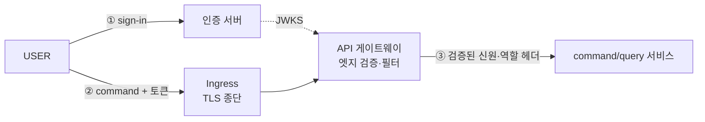
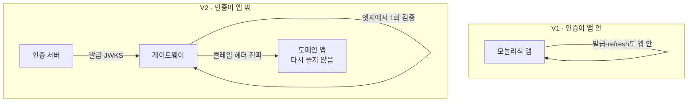
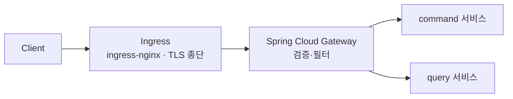
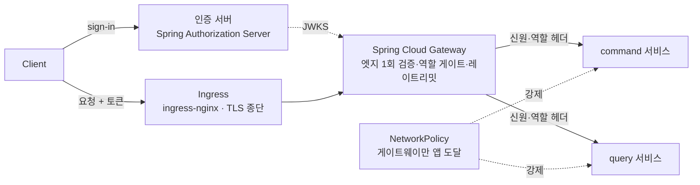

# RFC-020 — 인증 경계: API 게이트웨이 + 인증 서버 (k3s 인클러스터)

- **상태**: ✅ 종결 (2026-06-23)
- **선행**: [[RFC-015-authorization-model]] · [[RFC-019-auth-token-transport]] · [[RFC-007-deployment-infra-ops]] · 인덱스 [[RFC-INDEX]]
- **닫으면**: [[09-deployment-runtime]] 워크로드 토폴로지 보강 + 신규 ADR(인증 경계)

---

## 배경 (Background)

### 시나리오: USER가 예약 command를 보낸다

**V1에서는 이렇게 흐른다.**
인증이 앱 *안*에 있었다. `JwtFilter`가 매 요청 Bearer 토큰을 풀어 `SecurityContextHolder`에 신원을 앉혔고, 토큰 발급(sign-in)·검증·refresh가 모두 같은 모놀리식 앱 안에서 일어났다. "이 호출자가 누구인가"를 앱이 직접 풀었다. 모든 앱이 똑같이 `JwtFilter`로 토큰을 풀었으니 검증 로직이 중복됐고, 서명 키도 모든 워크로드가 들고 있어야 했다.

**V2에서는 이렇게 흐른다.** 컨텍스트가 여럿(command·query·projector…)이라 각자 토큰을 푸는 대신, 인증을 앱 밖으로 꺼낸다.

1. **발급** — 별도 **인증 서버**가 sign-in을 받아 무상태 서명 JWT를 발급하고, 게이트웨이·서비스가 검증에 쓸 JWKS 엔드포인트를 노출한다.
2. **엣지 검증** — `Client → Ingress(TLS 종단) → API 게이트웨이` 경로에서, 게이트웨이가 엣지에서 토큰을 **한 번** 검증한다(서명·만료·클레임).
3. **클레임 전파** — 게이트웨이가 검증된 신원·역할을 헤더로 다운스트림 앱에 넘긴다.
4. **앱은 신뢰** — command/query 서비스는 토큰을 다시 풀지 않고 전달된 클레임을 신뢰한다.

### V1 ↔ V2, 무엇이 달라지나

| 개념 | V1 | V2 | 한 줄 정의 |
|------|-----|-----|-----------|
| **인증(authentication)** | 앱마다 `JwtFilter`로 검증 | 게이트웨이가 엣지에서 1회 검증 | "이 호출자가 누구인가 — 토큰 발급·검증" |
| **발급(issuing)** | 모놀리식 앱에 섞임 | 별도 인증 서버 | "sign-in·refresh rotation·서명 키 보유" |
| **인가(authorization)** | (앱 내부) | [[RFC-015-authorization-model]]이 담당 | "검증된 주체가 뭘 해도 되나" |

---

## 맥락 (Context)

V2는 인증을 앱 밖으로 꺼내기로 했지만, 정작 그 *경계 자체* 를 결정한 문서가 없었다.

- **인접 RFC들이 인증 경계를 전제로만 깔고 있다.** [[RFC-015-authorization-model]](인가)·[[RFC-019-auth-token-transport]](토큰)이 둘 다 *"게이트웨이·인증 서버가 토큰을 검증해 신원·역할 클레임을 확정한다"* 를 전제로 동작한다. → 그 전제가 결정되지 않으면 두 RFC가 공중에 뜬다.
- **출처가 순환 참조로 비어 있다.** design_doc 13·ADR-17이 출처를 [[12-api-contract]]·[[09-deployment-runtime]]로 떠넘기지만 거기에도 없다. → "역할=엣지", "클레임 전파"가 어디에 서는지가 미정인 채로 남아 있다.
- **인증과 인가는 가른다.** 인증(authentication) = 이 호출자가 누구인가(토큰 발급·검증). 인가(authorization) = 검증된 주체가 뭘 해도 되나([[RFC-015-authorization-model]]). → 이 RFC는 전자의 *경계와 토폴로지*(누가 발급, 어디서 검증, 어디 배치)만 정하고, 인가 규칙은 RFC-015, 토큰 모델(무상태·폐기 포기)은 [[RFC-019-auth-token-transport]]이 이미 잡았다.

핵심 긴장 — **인증을 엣지로 단일화해 검증 중복과 서명 키 확산을 없애되, 그 대가로 따라오는 *네트워크 신뢰 가정*(헤더를 믿는다)을 강제 장치로 막을 것인가, 아니면 처음부터 서비스마다 재검증하는 제로트러스트를 지불할 것인가.**

---

## Goal / Non-goal

**Goal**
- 토큰 검증의 위치(엣지 1회 vs 서비스마다)와 클레임 전파 방식을 정한다.
- 토큰 발급 주체(예약 앱 vs 별도 인증 서버)를 정한다.
- 게이트웨이·인증 서버의 제품과 배치(인클러스터 vs 관리형)를 정한다.

**Non-goal (이번에 하지 않음)**
- 게이트웨이 제품 구성 — 라우트·필터, ingress(nginx) ↔ SCG 역할 분담, 클레임 전달 형식(헤더 이름·서명 헤더 vs 평문). → [[09-deployment-runtime]] · [[12-api-contract]].
- 모델 A 강제 장치의 구체 — 인입 신원 헤더 strip 규칙, "게이트웨이만 앱 도달" NetworkPolicy(또는 mTLS) 구현. → [[09-deployment-runtime]].
- 인증 서버 구현 — Spring Authorization Server 설정, 키 회전·OIDC·외부 IdP 흡수. → 인프라 백로그 T-13 · [[RFC-007-deployment-infra-ops]].
- 비동기 command 인증 신선도 재검증 정책. → [[RFC-015-authorization-model]].
- V1 `General`/`Seller` 분리 sign-in/refresh/signout 컨트롤러의 인증 서버 통합. → [[RFC-019-auth-token-transport]]와 함께.
- ingress 제품(nginx) 등 배포 디테일의 세밀 선택. → [[09-deployment-runtime]].

---

## 논의 (Discussion)

### 논점 1. 토큰을 어디서 검증하는가 — 엣지 1회인가, 서비스마다인가

**맥락에서 나온 질문.** V2는 컨텍스트가 여럿이라(맥락 1) 각자 토큰을 푸는 건 검증 로직 중복 + 서명 키를 모든 워크로드에 흩뿌리는 것이다. 그럼 검증을 한 곳으로 모을 것인가, 아니면 각 서비스가 다시 검증할 것인가?

검토한 선택지:
- **모델 A — 엣지 1회 검증 + 헤더 전파** — API 게이트웨이가 엣지에서 토큰을 한 번 검증(서명·만료·클레임)하고, 검증된 신원·역할을 헤더로 다운스트림에 전달한다. 앱은 토큰을 다시 풀지 않고 전달된 클레임을 신뢰한다. 검증이 한 곳, 서명 키도 한 곳. 대신 헤더 신뢰 = *네트워크 신뢰* 가정을 진다.
- **모델 B — 서비스마다 Resource Server로 JWKS 재검증(제로트러스트)** — 더 정석이고 네트워크 신뢰가 덜 치명적이다. 대신 검증 설정이 서비스마다 붙는다.

**내 의견(AI):** V2 기본은 모델 A다. 컨텍스트가 여럿인 만큼 검증 중복과 서명 키 확산을 엣지 단일화로 끊는 이득이 크고, 게이트웨이가 거친 역할 게이트도 겸할 수 있어 [[RFC-015-authorization-model]] "역할=엣지"·[[RFC-019-auth-token-transport]] 클레임 전파가 바로 그 위에 선다. 다만 A는 두 가지를 **의무로** 진다 — 안 지키면 A는 뚫린다: (헤더 strip) 게이트웨이는 클라이언트가 보낸 신원 헤더(`X-User-Id` 등)를 반드시 제거/덮어쓰기한다 — 안 하면 클라가 `X-User-Id: 남`을 끼워 위조한다. (우회 차단) NetworkPolicy로 "게이트웨이만 앱에 도달"을 강제한다 — 안 하면 게이트웨이를 우회해 앱에 직접 위조 헤더를 보낸다. 이 둘이 모델 A의 비용이고, 헤더 신뢰는 곧 네트워크 신뢰 가정이다. (인정하는 트레이드오프: 분산 신뢰가 빡빡해지면 A의 네트워크 신뢰 가정이 깨질 수 있다.)

**네 결정:** V2 기본은 모델 A(엣지 1회 검증 + 헤더 전파), 모델 B는 분산 신뢰가 네트워크 신뢰 가정을 넘어설 때의 업그레이드 경로로 남긴다. 〔근거 확인/보강 필요〕

**결론:** 게이트웨이가 엣지에서 1회 검증하고 클레임을 헤더로 전파, 앱은 다시 풀지 않는다. 모델 A의 의무 = 신원 헤더 strip + "게이트웨이만 앱 도달" 네트워크 강제. (이의 여지: 모델 B 승격 트리거 — 분산 신뢰 요구가 네트워크 신뢰 가정을 넘어설 때; strip 규칙·NetworkPolicy/mTLS 구체는 [[09-deployment-runtime]] Design)

### 논점 2. 토큰 발급을 누가 하는가

**맥락에서 나온 질문.** 검증을 엣지로 모았으면(논점 1), 발급(sign-in)·refresh rotation·서명 키 보유는 누구 책임인가? V1은 이게 모놀리식 앱에 섞여 있었다(맥락의 V1 대비).

**내 의견(AI):** 토큰 발급은 예약 도메인의 책임이 아니다. **별도 인증 서버**로 분리한다 — `user`·`authenticate` 컨텍스트(상태+Outbox, [[02.selective-event-sourcing-scope]])를 다루고, [[RFC-019-auth-token-transport]]의 무상태 서명 JWT(RS256)를 발급·rotation하며, 게이트웨이·서비스가 검증에 쓸 JWKS 엔드포인트를 노출한다. 그래야 도메인 앱은 발급을 모르고, 논점 1의 엣지 검증이 그 JWKS로 선다.

**네 결정:** 발급은 별도 인증 서버가 맡는다 — `user`·`authenticate` 컨텍스트, RS256 무상태 JWT 발급·rotation, JWKS 노출. 도메인 앱은 발급을 모른다. 〔근거 확인/보강 필요〕

**결론:** 토큰 발급·refresh·서명 키는 예약 도메인에서 떼어 별도 인증 서버로. (이의 여지: 인증 서버 구현·키 회전·외부 IdP 흡수, V1 분리 sign-in/refresh/signout 컨트롤러 통합은 [[RFC-007-deployment-infra-ops]]·[[RFC-019-auth-token-transport]] Design)

### 논점 3. 게이트웨이·인증 서버를 무슨 제품으로 구현하는가

**맥락에서 나온 질문.** 논점 1의 엣지 게이트웨이와 논점 2의 인증 서버가 정해졌으니, 각각 무엇으로 만드나?

검토한 선택지:
- **엣지 게이트웨이 = Spring Cloud Gateway** — reactive, 필터로 JWT 검증·역할 게이트·레이트리밋([[19.caching-redis-role]] Redis 카운터). 스택이 Spring/Kotlin이라 인증 로직을 코드/필터로 두는 게 자연스럽다.
- **인증 서버 = Spring Authorization Server** — OIDC·JWKS 노출.
- **Keycloak(풀 IdP)** — 기능은 많으나 학습·운영 표면이 과하다.
- **자작 발급** — 비표준이라 학습가치·신뢰성에서 손해.

**내 의견(AI):** 엣지 게이트웨이 = Spring Cloud Gateway, 인증 서버 = Spring Authorization Server. 근거 — 스택이 Spring/Kotlin이라 인증 로직을 코드/필터로 두는 게 자연스럽고, 둘 다 정석(공식) 컴포넌트라 학습가치가 높다([[v2-optimize-for-learning-not-cost]]). Keycloak·자작 발급은 각각 과하거나 비표준이라 기각.

**네 결정:** 게이트웨이 = Spring Cloud Gateway, 인증 서버 = Spring Authorization Server. 〔근거 확인/보강 필요〕

**결론:** SCG(검증·역할 게이트·레이트리밋) + Spring Authorization Server(OIDC·JWKS). Keycloak·자작 발급 기각. (이의 여지: 라우트·필터·클레임 전달 형식 등 제품 구성은 [[09-deployment-runtime]]·[[12-api-contract]] Design)

### 논점 4. 게이트웨이·인증 서버를 어디에 배치하는가

**맥락에서 나온 질문.** 제품이 정해졌으니(논점 3) 어디서 굴리나 — 클러스터 안의 워크로드인가, 관리형(클라우드 API GW·Cognito)인가?

검토한 선택지:
- **k3s/EKS 인클러스터 워크로드** — 게이트웨이·인증 서버를 클러스터 안에 둔다. 로컬 k3s~EKS 패리티가 살고, K8s 토폴로지를 직접 운영하는 학습이 된다.
- **관리형(클라우드 API GW·Cognito)** — 운영 부담은 줄지만 로컬 재현이 불가해 패리티가 깨진다.

**내 의견(AI):** 인클러스터를 택한다. 근거: V2 학습 목표가 K8s 토폴로지를 직접 운영하는 것이고([[12.kafka-hosting-msk-vs-self-managed]] Strimzi 자가운영과 같은 결), 로컬 k3s~EKS 패리티([[RFC-007-deployment-infra-ops]])를 위해 게이트웨이도 같은 평면에 있어야 인증·리스너 동작 정합을 로컬에서 검증한다. 관리형은 로컬 재현 불가라 패리티가 깨진다. 트래픽 흐름은 `Client → Ingress(ingress-nginx, TLS 종단) → Spring Cloud Gateway(검증·필터) → command/query 서비스`. ingress 제품(nginx) 같은 세밀 선택은 배포 디테일이지 이 RFC 사안이 아니다.

**네 결정:** 게이트웨이·인증 서버를 k3s/EKS 인클러스터 워크로드로 배치, 관리형 기각. 〔근거 확인/보강 필요〕

**결론:** 인클러스터 배치. 트래픽 = `Client → Ingress(TLS 종단) → SCG → command/query`. (이의 여지: ingress 제품·SCG 역할 분담 등 배포 디테일은 [[09-deployment-runtime]] Design)

### 논점 5. 비동기 command의 인증 신선도를 어떻게 다루는가

**맥락에서 나온 질문.** 엣지 검증(논점 1)은 인입 시점에 일어나는데, 비동기 command(202)는 핸들러 실행이 그 뒤다. 그 사이 토큰이 만료/강등될 수 있다([[04-design-completeness-audit]] 지적).

**내 의견(AI):** [[RFC-019-auth-token-transport]]가 즉시 폐기를 포기했으니 in-flight 통과를 받아들이는 게 기본선이다. 다만 민감 command까지 그대로 통과시킬지는 [[RFC-015-authorization-model]] 민감도 분류와 엮여 있어 여기서 단정하지 않는다.

**네 결정:** in-flight 통과를 기본선으로 받아들이고, 민감 command 재검증 필요 여부는 민감도 분류와 함께 Design으로 넘긴다. 〔근거 확인/보강 필요〕

**결론:** 비동기 in-flight 토큰 만료/강등은 기본적으로 통과를 수용. (이의 여지: 민감 command 재검증 정책은 [[RFC-015-authorization-model]] 민감도 분류와 함께 Design)

---

## 결정 요약

| # | 결정 | ADR |
|---|------|-----|
| 1 | **모델 A — 엣지 1회 검증 + 헤더 전파**(앱은 다시 풀지 않음). 의무 = 신원 헤더 strip + "게이트웨이만 앱 도달" 네트워크 강제. 모델 B는 업그레이드 경로 | 신규 ADR(인증 경계) 예정 · [[RFC-015-authorization-model]] · [[RFC-019-auth-token-transport]] |
| 2 | 토큰 발급 = **별도 인증 서버**(`user`·`authenticate`, RS256 무상태 JWT 발급·rotation·JWKS 노출), 도메인 앱은 발급 미인지 | 신규 ADR(인증 경계) 예정 · [[02.selective-event-sourcing-scope]] |
| 3 | 제품 = **Spring Cloud Gateway**(엣지) + **Spring Authorization Server**(발급·JWKS). Keycloak·자작 발급 기각 | 신규 ADR(인증 경계) 예정 · [[v2-optimize-for-learning-not-cost]] |
| 4 | 배치 = **k3s/EKS 인클러스터** 워크로드, 관리형 기각. 트래픽 `Client → Ingress(TLS 종단) → SCG → command/query` | 신규 ADR(인증 경계) 예정 · [[12.kafka-hosting-msk-vs-self-managed]] |
| 5 | 비동기 command 인증 신선도 = **in-flight 통과 수용**(즉시 폐기 포기 전제), 민감 command 재검증은 민감도 분류와 함께 위임 | [[RFC-015-authorization-model]] · [[RFC-019-auth-token-transport]] |

상세 설계는 [[09-deployment-runtime]] · [[12-api-contract]] 참조.

---

## 결과 (목표 인증 토폴로지 요약)

- **검증**: 게이트웨이가 엣지에서 1회 검증, 앱은 클레임 헤더를 신뢰하고 다시 풀지 않는다(모델 A).
- **모델 A 의무**: 인입 신원 헤더 strip + NetworkPolicy로 "게이트웨이만 앱 도달" 강제 — 안 지키면 헤더 위조로 뚫린다.
- **발급**: 별도 인증 서버가 RS256 무상태 JWT를 발급·rotation하고 JWKS를 노출, 도메인 앱은 발급을 모른다.
- **배치**: 게이트웨이·인증 서버 모두 인클러스터 워크로드, 로컬 k3s~EKS 패리티로 인증 동작을 로컬에서 검증.
- **비동기**: in-flight 토큰 만료/강등은 통과 수용, 민감 command 재검증은 민감도 분류와 함께 본다.

상세 워크로드 토폴로지·시퀀스는 [[09-deployment-runtime]] · [[12-api-contract]] 참조.

---

## 관련 문서

- [[RFC-015-authorization-model]] · [[RFC-019-auth-token-transport]] · [[RFC-007-deployment-infra-ops]] · [[RFC-012-command-query-api-contract]] · [[RFC-INDEX]]
- 설계: [[09-deployment-runtime]] · [[12-api-contract]] · [[13-authorization]] · [[16-auth-token]]
- ADR: [[17.authorization-model]] · [[20.auth-token-transport]] · [[02.selective-event-sourcing-scope]] · [[12.kafka-hosting-msk-vs-self-managed]]
