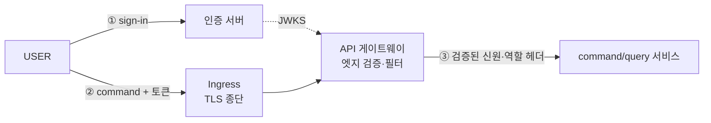
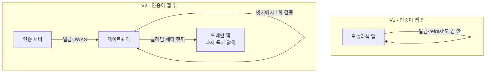
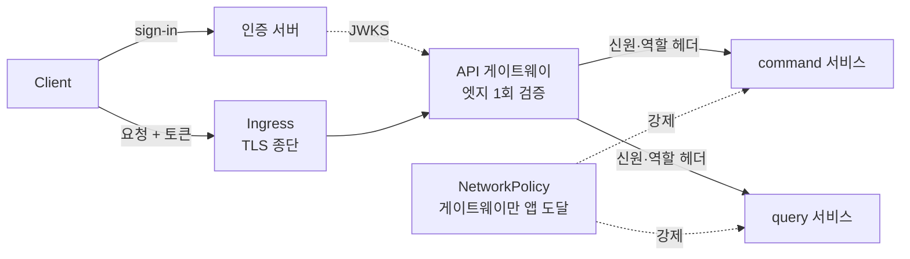

# RFC-020 — 인증 경계: 엣지 1회 검증 모델

- **상태**: ✅ 종결 (2026-06-30) — 검증=엣지 1회(모델 A) · 구현=기성 프록시 무상태(②) · 인증 서버=Spring Authorization Server 직접(로그인/로그아웃·JTI 집중)
- **선행**: [[RFC-015-authorization-model]] · [[RFC-019-auth-token-transport]] · [[RFC-007-deployment-infra-ops]] · 인덱스 [[RFC-INDEX]]
- **닫으면**: [[09-deployment-runtime]] 워크로드 토폴로지 보강 + 신규 ADR(인증 경계)

---

## 배경 (Background)

### 시나리오: USER가 예약 command를 보낸다

**V1에서는 이렇게 흐른다.**
인증이 앱 *안*에 있었다. `JwtFilter`가 매 요청 Bearer 토큰을 풀어 `SecurityContextHolder`에 신원을 앉혔고, 토큰 발급(sign-in)·검증·refresh가 모두 같은 모놀리식 앱 안에서 일어났다. "이 호출자가 누구인가"를 앱이 직접 풀었다. 모든 앱이 똑같이 `JwtFilter`로 토큰을 풀었으니 검증 로직이 중복됐고, 서명 키도 모든 워크로드가 들고 있어야 했다.

**V2에서는 이렇게 흐른다.** 컨텍스트가 여럿(command·query·projector…)이라 각자 토큰을 푸는 대신, 인증을 앱 밖으로 꺼낸다.

1. **발급** — 별도 **인증 서버**가 sign-in을 받아 무상태 서명 JWT를 발급하고, 게이트웨이·서비스가 검증에 쓸 JWKS 엔드포인트를 노출한다.
2. **엣지 검증** — `Client → Ingress(TLS 종단) → API 게이트웨이` 경로에서, 게이트웨이가 엣지에서 토큰을 **한 번** 검증한다(서명·만료·클레임).
3. **클레임 전파** — 게이트웨이가 검증된 신원·역할을 헤더로 다운스트림 앱에 넘긴다.
4. **앱은 신뢰** — command/query 서비스는 토큰을 다시 풀지 않고 전달된 클레임을 신뢰한다.

### V1 ↔ V2, 무엇이 달라지나

| 개념 | V1 | V2 | 한 줄 정의 |
|------|-----|-----|-----------|
| **인증(authentication)** | 앱마다 `JwtFilter`로 검증 | 게이트웨이가 엣지에서 1회 검증 | "이 호출자가 누구인가 — 토큰 발급·검증" |
| **발급(issuing)** | 모놀리식 앱에 섞임 | 별도 인증 서버 | "sign-in·refresh rotation·서명 키 보유" |
| **인가(authorization)** | (앱 내부) | [[RFC-015-authorization-model]]이 담당 | "검증된 주체가 뭘 해도 되나" |

---

## 맥락 (Context)

V2는 인증을 앱 밖으로 꺼내기로 했지만, 정작 그 *경계 자체* 를 결정한 문서가 없었다.

- **인접 RFC들이 인증 경계를 전제로만 깔고 있다.** [[RFC-015-authorization-model]](인가)·[[RFC-019-auth-token-transport]](토큰)이 둘 다 *"게이트웨이·인증 서버가 토큰을 검증해 신원·역할 클레임을 확정한다"* 를 전제로 동작한다. → 그 전제가 결정되지 않으면 두 RFC가 공중에 뜬다.
- **출처가 순환 참조로 비어 있다.** design_doc 13·ADR-17이 출처를 [[12-api-contract]]·[[09-deployment-runtime]]로 떠넘기지만 거기에도 없다. → "역할=엣지", "클레임 전파"가 어디에 서는지가 미정인 채로 남아 있다.
- **인증과 인가는 가른다.** 인증(authentication) = 이 호출자가 누구인가(토큰 발급·검증). 인가(authorization) = 검증된 주체가 뭘 해도 되나([[RFC-015-authorization-model]]). → 이 RFC는 전자의 *검증 위치와 클레임 전파 방식*만 정하고, 인가 규칙은 RFC-015, 토큰 모델(무상태·폐기 포기)은 [[RFC-019-auth-token-transport]]이 이미 잡았다.

핵심 긴장 — **인증을 엣지로 단일화해 검증 중복과 서명 키 확산을 없애되, 그 대가로 따라오는 *네트워크 신뢰 가정*(헤더를 믿는다)을 강제 장치로 막을 것인가, 아니면 처음부터 서비스마다 재검증하는 제로트러스트를 지불할 것인가.**

---

## Goal / Non-goal

**Goal**
- 토큰 검증의 위치(엣지 1회 vs 서비스마다)와 클레임 전파 방식을 정한다.

**Non-goal (이번에 하지 않음)** — 검증 *패턴*(②)·인증 서버 *제품*(Spring AS)·로그인/로그아웃 집중은 논점 2·3에서 결정. 남는 구체만 위임:
- 구체 프록시 제품(Envoy Gateway vs nginx ingress) 택일·배치, 라우트·필터, 클레임 전달 형식(헤더 이름·서명 헤더 vs 평문). → [[09-deployment-runtime]] · [[12-api-contract]].
- 모델 A 강제 장치의 구체 — 인입 신원 헤더 strip 규칙, "게이트웨이만 앱 도달" NetworkPolicy(또는 mTLS) 구현. → [[09-deployment-runtime]].
- 인증 서버 *구현 설정* — 키 회전·OIDC·외부 IdP 흡수, V1 `General`/`Seller` sign-in/refresh/signout 컨트롤러의 이관 절차. → cycle · [[RFC-007-deployment-infra-ops]] T-13.
- 비동기 command 인증 신선도 재검증 정책. → [[RFC-015-authorization-model]].

---

## 논의 (Discussion)

### 논점 1. 토큰을 어디서 검증하는가 — 엣지 1회인가, 서비스마다인가

**맥락에서 나온 질문.** V2는 컨텍스트가 여럿이라(맥락 1) 각자 토큰을 푸는 건 검증 로직 중복 + 서명 키를 모든 워크로드에 흩뿌리는 것이다. 그럼 검증을 한 곳으로 모을 것인가, 아니면 각 서비스가 다시 검증할 것인가?

검토한 선택지:
- **모델 A — 엣지 1회 검증 + 헤더 전파** — API 게이트웨이가 엣지에서 토큰을 한 번 검증(서명·만료·클레임)하고, 검증된 신원·역할을 헤더로 다운스트림에 전달한다. 앱은 토큰을 다시 풀지 않고 전달된 클레임을 신뢰한다. 검증이 한 곳, 서명 키도 한 곳. 대신 헤더 신뢰 = *네트워크 신뢰* 가정을 진다. K8s 기본은 파드 간 격리가 없으므로, 이 가정을 지키려면 NetworkPolicy를 명시적으로 설정해야 한다.
- **모델 B — 서비스마다 Resource Server로 JWKS 재검증(제로트러스트)** — 네트워크 신뢰 가정을 지지 않는다. Istio 같은 서비스 메시가 있으면 사이드카(mTLS)가 파드 간 신원을 보장해 B의 비용이 크게 줄어든다. 서비스 메시 없이 B를 쓰면 검증 설정이 서비스마다 붙는다.

**내 의견(AI):** V2 기본은 모델 A다. 서비스 메시를 도입하지 않은 일반 K8s 환경에서 모델 A + NetworkPolicy는 Kong, AWS API Gateway, Spring Cloud Gateway 등 현업 표준 패턴과 동일하다. 컨텍스트가 여럿인 만큼 검증 중복과 서명 키 확산을 엣지 단일화로 끊는 이득이 크고, 게이트웨이가 거친 역할 게이트도 겸할 수 있어 [[RFC-015-authorization-model]] "역할=엣지"·[[RFC-019-auth-token-transport]] 클레임 전파가 바로 그 위에 선다. 다만 A는 두 가지를 **의무로** 진다 — 안 지키면 A는 뚫린다: (헤더 strip) 게이트웨이는 클라이언트가 보낸 신원 헤더(`X-User-Id` 등)를 반드시 제거/덮어쓰기한다. (우회 차단) NetworkPolicy로 "게이트웨이만 앱에 도달"을 강제한다.

**네 결정:** V2 기본은 모델 A(엣지 1회 검증 + 헤더 전파). 모델 B는 서비스 메시(Istio 등) 도입 시 자연스럽게 전환할 수 있는 업그레이드 경로로 남긴다.

**결론:** 게이트웨이가 엣지에서 1회 검증하고 클레임을 헤더로 전파, 앱은 다시 풀지 않는다. 모델 A의 의무 = 신원 헤더 strip + NetworkPolicy로 "게이트웨이만 앱 도달" 강제. 모델 B 전환 트리거 = 서비스 메시(Istio) 도입 시. strip 규칙·NetworkPolicy 구체는 [[09-deployment-runtime]] Design.

### 논점 2. 엣지 검증을 무엇으로 구현하나 — 게이트웨이 앱인가, 기성 프록시인가

**맥락에서 나온 질문.** 논점 1이 "엣지 1회 검증"을 정하자, 그 *엣지가 무슨 물건*이냐가 따라 나온다. K8s에선 엣지 계층이 여럿이고(ingress controller·Gateway API·서비스 메시), "검증 로직을 누가 들고 있나"로 패턴이 갈린다.

검토한 선택지:
- **① 게이트웨이 앱 직접(Spring Cloud Gateway)** — 라우팅+검증+필터를 내가 만든 Spring 앱이 통째로 진다. 별도 워크로드·홉 +1. "인증을 앱 밖으로"라면서 또 앱을 세우는 모순.
- **② 기성 프록시 자체 검증(Envoy/nginx ingress)** — ingress controller(Envoy 등)가 인증 서버의 JWKS URL을 가리켜 무상태 JWT 검증(서명·만료·클레임)을 *설정만으로* 한다. 내 게이트웨이 코드 0. 검증된 신원·역할을 헤더로 주입.
- **③ 기성 프록시 + 외부 인가(Envoy ext_authz / nginx auth_request)** — 프록시가 매 요청 "통과?"를 내가 만든 작은 판정 앱에 묻는다. 라우팅은 인프라, 검증 판정만 내 앱. ① 통째보다 가볍다.

**내 의견(AI):** 기본은 **②**다. access token 검증은 무상태(서명·만료·클레임)라 기성 프록시 설정만으로 끝나고, JTI 같은 상태 검사는 refresh 경로(인증 서버)로 격리되므로(논점 3) 엣지가 상태를 들 일이 없다 — ②면 게이트웨이 앱을 만들지 않는다. ③(ext_authz + 내 판정 앱)이나 ①(SCG)은 *매 요청 상태 조회*가 필요할 때만 값을 한다(예: per-user 세밀 rate limit, Redis 카운터 — [[19.caching-redis-role]]의 "분산 조정·휘발성 상태"). 그 경우에도 ③이 ①보다 가볍다(라우팅은 인프라에 두고 판정만). 거친 rate limit(IP·경로)은 ②의 프록시 기능으로 흡수되니 패턴을 안 바꾼다.

**네 결정:** 엣지 검증은 **② 기성 프록시 무상태 검증을 기본**으로(게이트웨이 앱 미구현), 도메인 앱은 전파된 신원 헤더를 신뢰하는 **pre-authenticated 필터**만 둔다(V1 `JwtFilter`·JWKS·서명검증 제거). ③(ext_authz) 또는 ①(SCG)은 매 요청 상태 검증(per-user 세밀 rate limit 등)이 실증될 때 도입. 구체 프록시 제품(Envoy Gateway vs nginx ingress)·배치는 [[09-deployment-runtime]].

**결론:** 엣지 = 기성 프록시 설정(무상태 JWT 검증), 내 게이트웨이 앱 없음. 상태 의존 검증이 생기면 ext_authz로 *판정만* 내 앱에. 거친 rate limit은 프록시 내장, 세밀(per-user) rate limit이 ext_authz/SCG의 트리거.

### 논점 3. 인증 서버는 무엇이고, 무엇을 그쪽으로 모으나

**맥락에서 나온 질문.** ②(기성 프록시)가 검증에 쓰는 JWKS 엔드포인트는 누군가 노출해야 한다 — 발급·서명·키의 주인이 필요하다. 그게 인증 서버다. 그러면 무엇으로 세우고, 어디까지 그쪽으로 모으나?

검토한 선택지:
- **기성 IdP(Keycloak 등)** — 발급·JWKS·rotation·세션 무효화 내장, 컨테이너 하나로 빠르게. 단 JWT 발급·JWKS·JTI rotation 내부가 블랙박스라 메커니즘을 배우지 않고, [[RFC-019-auth-token-transport]]에서 직접 정한 JTI 재사용 탐지가 "설정 토글"로 흡수돼 코드로 안 남는다.
- **Spring Authorization Server 직접** — 발급·JWKS 노출·refresh rotation·JTI 재사용 탐지를 내 코드로 구현. [[RFC-019-auth-token-transport]]의 결정을 그대로 실현한다.

**내 의견(AI):** 비대칭 서명(RS/ES) + JWKS 공개키 노출이 "검증자는 비밀 없이 공개키로만 검증"을 가능케 해 엣지 무상태 검증(②)의 토대다([[RFC-019-auth-token-transport]] — V1이 서명 키를 모든 워크로드에 흩뿌린 문제의 해법). 인증 서버는 그 발급·JWKS의 주인이자 refresh rotation·JTI 상태의 거처다. 학습 초점이 ES/EDA라도([[v2-optimize-for-learning-not-cost]]) 인증 메커니즘을 RFC-019에서 직접 결정해 둔 이상, 그 결정을 코드로 남기는 Spring AS가 결정과 일관된다.

**네 결정:** 인증 서버 = **Spring Authorization Server 직접 구현**. 발급·JWKS 노출·refresh rotation·**JTI 재사용 탐지·강제 로그아웃**([[RFC-019-auth-token-transport]])과 더불어 **로그인·로그아웃(sign-in/sign-out)을 도메인 앱에서 인증 서버로 집중**한다 — V1의 `General`/`Seller` 분리 sign-in/refresh/signout 컨트롤러를 인증 서버로 통합. 도메인 앱은 발급·검증 어디에도 관여하지 않는다(pre-auth 필터만).

**JTI 정합:** JTI 재사용 탐지는 *refresh 제출 시점*에만 일어난다(rotate된 refresh가 재등장 = 탈취 의심 → 토큰 family 무효화). refresh는 인증 서버 엔드포인트로 가므로 **매 API 요청(access 검증)에선 JTI를 볼 일이 없다 → 엣지는 무상태(②) 유지.** 즉시 로그아웃 불가(access TTL 지연)는 [[RFC-019-auth-token-transport]]이 이미 수용한 트레이드오프(짧은 access TTL로 완화).

**결론:** 인증 서버 = Spring Authorization Server(직접). 발급·JWKS·refresh·JTI·로그인/로그아웃을 모두 인증 서버로 모으고, 도메인 앱은 신원 헤더만 신뢰. 엣지는 무상태 access 검증(②)이라 JTI 상태를 안 진다. 구현 설정·키 회전·OIDC 흡수는 cycle([[RFC-007-deployment-infra-ops]] T-13).

---

## 결정 요약

| # | 결정 | ADR |
|---|------|-----|
| 1 | **모델 A — 엣지 1회 검증 + 헤더 전파**(앱은 다시 풀지 않음). 의무 = 신원 헤더 strip + NetworkPolicy "게이트웨이만 앱 도달". 모델 B는 서비스 메시(Istio) 도입 시 전환 경로 | 신규 ADR(인증 경계) 예정 · [[RFC-015-authorization-model]] · [[RFC-019-auth-token-transport]] |
| 2 | **엣지 검증 = 기성 프록시 무상태 JWT 검증(②)** — 게이트웨이 앱 미구현, 도메인 앱은 pre-auth 필터만. ext_authz(③)·SCG(①)는 매 요청 상태검증(per-user 세밀 rate limit) 실증 시. 거친 rate limit은 프록시 내장 | [[09-deployment-runtime]] |
| 3 | **인증 서버 = Spring Authorization Server(직접 구현)** — 발급·JWKS·refresh·JTI 재사용 탐지·**로그인/로그아웃**을 인증 서버로 집중, 도메인 앱은 비관여. JTI는 refresh 경로 전용이라 엣지 무상태 유지 | [[RFC-019-auth-token-transport]] · [[RFC-007-deployment-infra-ops]] |

발급은 인증 서버(Spring AS)·검증은 기성 프록시로 확정(논점 2·3). 구체 프록시 제품·배치, 인증 서버 구현 설정은 [[09-deployment-runtime]] · cycle로 위임.

---

## 결과 (목표 인증 토폴로지 요약)

- **검증**: 게이트웨이가 엣지에서 1회 검증, 앱은 클레임 헤더를 신뢰하고 다시 풀지 않는다(모델 A).
- **모델 A 의무**: 인입 신원 헤더 strip + NetworkPolicy로 "게이트웨이만 앱 도달" 강제 — 안 지키면 헤더 위조로 뚫린다.

상세 워크로드 토폴로지·시퀀스·제품 선택은 [[09-deployment-runtime]] · [[12-api-contract]] 참조.

---

## 관련 문서

- [[RFC-015-authorization-model]] · [[RFC-019-auth-token-transport]] · [[RFC-007-deployment-infra-ops]] · [[RFC-012-command-query-api-contract]] · [[RFC-INDEX]]
- 설계: [[09-deployment-runtime]] · [[12-api-contract]] · [[13-authorization]] · [[16-auth-token]]
- ADR: [[17.authorization-model]] · [[20.auth-token-transport]] · [[02.selective-event-sourcing-scope]] · [[12.kafka-hosting-msk-vs-self-managed]]
