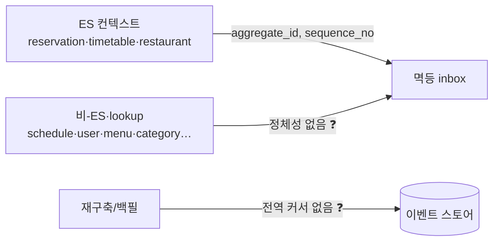
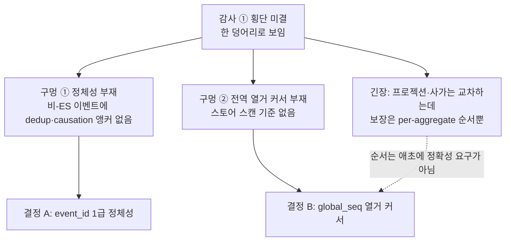
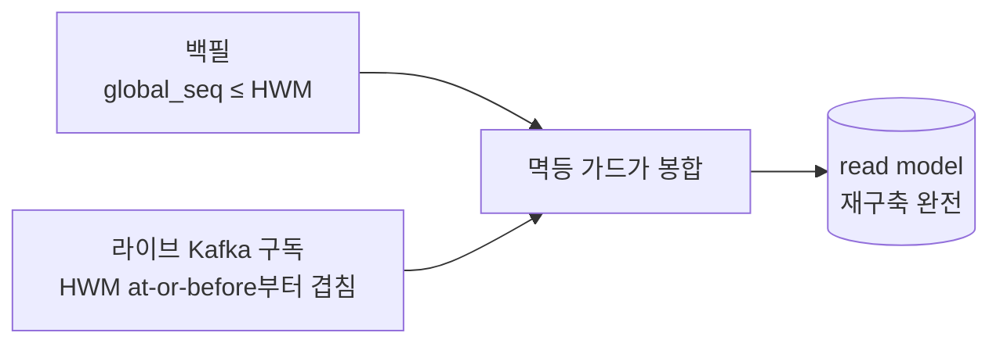
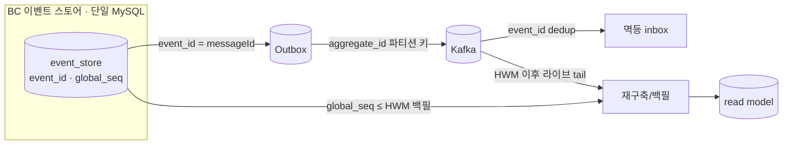

# RFC-021 — 이벤트 정체성·전역 순서

- **상태**: 🏷 합의 (2026-06-25) · 독립 리뷰 게이트 통과(정합·메커니즘) · event_store=BC별 분리(B)·global_seq=store-global 확정 · ADR [[22.event-identity-and-global-ordering]] 비준 대기(Proposed→Accepted) + design 보강
- **선행**: [[RFC-001-v2-cqrs-and-event-sourcing]] · [[RFC-004-event-store-schema-evolution]] · 인덱스 [[RFC-INDEX]]
- **계기**: 전수 감사 [[04-design-completeness-audit]] 횡단 미결 ①
- **닫으면**: [[05.event-store-mysql-table]] 스키마 보강(신규 ADR) + [[02-write-model]]·[[08-event-store-lifecycle]]·[[RFC-011-projection-rebuild-catchup]] 보강

---

## 배경 (Background)

### 시나리오: 비-ES 컨텍스트의 이벤트 하나가 컨슈머에 두 번 도착한다

**V1에서는 문제가 안 보인다.**
V1은 상태를 테이블 행으로 들고, 컨텍스트 통합도 거의 없다(도메인 이벤트가 `timetable`·`restaurant` 둘뿐). 같은 메시지를 두 번 봤는지, 스토어 전체를 어떤 순서로 훑을지를 물을 일이 애초에 없다.

**V2에서는 이렇게 흐른다.**

1. **ES 컨텍스트의 이벤트** — `reservation`·`timetable`·`restaurant`는 이벤트 스토어에 append하므로 `(aggregate_id, sequence_no)`라는 스트림 좌표가 붙는다. 컨슈머는 이 좌표로 "이 메시지를 봤는가"를 가린다(멱등 inbox).
2. **비-ES/lookup 컨텍스트의 이벤트** — `schedule`·`user`·`authenticate`(비-ES), `menu`·`category`·`company`(lookup)는 상태+Outbox라 스트림도 시퀀스도 없다. 이들이 발행한 이벤트는 **정체성이 없다** — Outbox→Kafka가 같은 이벤트를 재전달해도 컨슈머가 가려낼 dedup 키가 없고, 추적 메타 `causationId`("직전 원인")가 가리킬 안정 식별자도 없다.
3. **재구축이 스토어를 훑는다** — [[RFC-011-projection-rebuild-catchup]]는 프로젝션 재구축 원천을 이벤트 스토어 리플레이로 둔다. 그런데 `sequence_no`는 per-aggregate라, 스토어 전체를 **빠짐없이·재개 가능하게** 훑을 전역 단조 기준이 없다.



### 감사 ①은 한 모순처럼 보였지만 결정할 건 둘이다



| 구멍 | 무엇이 없나 | 따라오는 질문 | 닫는 수단 |
|------|-------------|---------------|-----------|
| 정체성 부재 | 비-ES/lookup 이벤트에 안정 식별자 | dedup 키·causation 앵커를 무엇으로 | **`event_id`** |
| 전역 열거 부재 | 스토어 전체 단조 커서 | 재구축이 무엇으로 훑고 재개하나 | **`global_seq`** |
| 교차 순서 긴장 | (오해) 전순서가 정확성 요구처럼 보임 | 교차 적용 순서를 보장해야 하나 | (보장 불필요 — 사가가 푼다) |

---

## 맥락 (Context)

전수 감사가 ①로 묶은 것은 사실 **한 모순처럼 보이는 세 구멍**이었다. 풀어 보면 결정해야 할 건 둘이다.

- **정체성 부재.** [[05.event-store-mysql-table]]의 `event_store` 스키마에 `event_id`가 없다. → [[09.event-ordering-and-delivery-guarantee]]의 멱등 컨슈머/inbox는 "이 메시지를 봤는가"를 가를 **정체성**을 요구하고, [[02-write-model]]의 추적 메타 `causationId`("직전 원인")도 가리킬 **안정 식별자**가 있어야 하는데, 그게 없다. ES 이벤트는 `(aggregate_id, sequence_no)`로 정체성이 서지만, **비-ES·lookup 컨텍스트(상태+Outbox)** 이벤트는 `sequence_no`가 없어 정체성이 아예 없다 — dedup 키도, causation 앵커도 없다.
- **전역 열거 커서 부재.** `sequence_no`는 per-aggregate다. [[RFC-011-projection-rebuild-catchup]]는 재구축 원천을 이벤트 스토어 리플레이로 두는데, 전역 단조 컬럼이 없으면 **스토어 전체를 빠짐없이·재개 가능하게 훑을 기준**이 없다. → 감사는 이를 "스캔 순서 정의 불가"로 적었다.
- **자산 — 이미 그어진 선.** [[09.event-ordering-and-delivery-guarantee]]·[[16.optimistic-concurrency-control]]가 "전역 순서·전역 불변식은 사지 않고, 교차는 사가"로 같은 선을 이미 그어 뒀다. → 셋째 구멍("프로젝션·사가는 애그리거트를 가로지르는데 보장은 per-aggregate 순서뿐")은 새 결정이 아니라 이 선의 재확인이다.

핵심 긴장 — **정체성은 `event_id`로, 전역 열거는 `global_seq`로 닫되, "순서"가 애초에 정확성 요구가 아니었음(교차 순서는 사가 몫)을 명문화해, 한 모순처럼 보이던 세 구멍을 둘의 결정으로 분리한다.**

---

## Goal / Non-goal

**Goal**
- 전 컨텍스트(ES·비-ES·lookup) 공통의 1급 정체성 `event_id`를 도입해, inbox/dedup 키·`causationId` 앵커·Kafka `messageId`를 통일한다.
- BC 스토어별 재구축/백필 열거·재개 커서 `global_seq`를 도입한다.
- 재구축 완전성을 커서 단독이 아니라 (백필 `≤ HWM`) ∪ (라이브 tail) + 멱등 가드로 못박는다.
- 교차-애그리거트 전순서가 정확성 요구가 아님을, point-in-time 파생 사실의 페이로드 박제 처방과 함께 명문화한다.

**Non-goal (이번에 하지 않음)**
- `event_id` 물리 표현 확정(`BINARY(16)` vs `CHAR(36)`, UUIDv7 채택) — Design.
- Outbox 경로의 `event_id` 전파 배선(기록 채번→봉투→inbox) — Design.
- 비-ES inbox 적용 범위 판정(자연 멱등이라 inbox 생략 가능 컨텍스트) — Design([[09.event-ordering-and-delivery-guarantee]] 미결과 연동).
- `global_seq` 기반 재구축 페이지네이션·재개 체크포인트 구현 — [[RFC-011-projection-rebuild-catchup]].
- BC를 가로지르는 단일 시퀀스(교차-BC 전순서는 정확성 요구가 아니므로 불필요).

---

## 논의 (Discussion)

### 논점 1. event_id 는 왜 1급 컬럼이어야 하나 → [[22.event-identity-and-global-ordering]]

**맥락에서 나온 질문.** 맥락 "정체성 부재"에서 곧장 나온다. ES 이벤트의 dedup은 `(aggregate_id, sequence_no)`로 이미 가능하다([[09.event-ordering-and-delivery-guarantee]] inbox 키). 문제는 **그 키가 없는 이벤트**다 — `schedule`·`user`·`authenticate` 같은 비-ES, `menu`·`category`·`company` 같은 lookup은 상태+Outbox라 스트림도 시퀀스도 없다. 이들이 발행한 이벤트는 정체성이 없어, 컨슈머가 중복 전달을 가려낼 키도, `causationId`가 가리킬 대상도 만들 수 없다.

**내 의견(AI):** **`event_id`를 전 이벤트 공통의 1급 정체성으로** 둔다. 그러면:

- **inbox/dedup 키를 `event_id`로 일반화**한다. ES·비-ES를 가리지 않고 한 키로 중복을 흡수한다([[09.event-ordering-and-delivery-guarantee]]의 `(aggregate_id, sequence_no)` inbox 키는 ES의 특수 케이스로 흡수). ES Zero-Payload upsert는 `sequence_no` 버전 가드를 **병행** 유지한다 — dedup(누가 봤나)과 순서 가드(더 과거를 덮지 마라)는 다른 일이다.
- **`causationId` = 직접 원인 메시지의 `event_id`**(원인이 커맨드면 `commandId`). **`correlationId` = 사슬 루트**로, 신규 사슬은 originating 커맨드에서 채번하고 이후 무변경 전파한다. 이로써 [[02-write-model]] §공통의 추적 메타가 실제로 가리킬 앵커가 생긴다.
- **Kafka 봉투의 `messageId`**로도 쓴다. 단 **파티션 키는 `aggregate_id` 그대로**다([[09.event-ordering-and-delivery-guarantee]] 불변) — `event_id`는 정체성이지 라우팅 키가 아니다.

생성은 **append/Outbox 기록 시점**에 한다(트랜잭션 안). 전역 유일.

**네 결정:** `event_id`를 전 컨텍스트 공통 1급 정체성으로 도입, inbox/dedup 키·`causationId`/`correlationId` 앵커·Kafka `messageId`를 이것으로 통일, 채번은 append/Outbox 기록 시점(TX 안)·전역 유일, 파티션 키는 `aggregate_id` 불변. 〔근거 확인/보강 필요〕

**결론:** `event_id`가 ES·비-ES·lookup을 가리지 않는 공통 정체성이 된다. inbox 키는 여기로 일반화하되 ES의 `sequence_no` 버전 가드는 병행 유지. (이의 여지: 물리 표현·전파 배선·비-ES inbox 적용 범위는 Design.)

### 논점 2. global_seq 는 "순서"인가 "열거 커서"인가 → [[22.event-identity-and-global-ordering]]

**맥락에서 나온 질문.** 맥락 "전역 열거 커서 부재"에서 나온다. 감사는 "전역 단조 커서 부재 → 재구축 스캔 순서 정의 불가"로 적었지만, 여기에 숨은 오해가 있다. **재구축에 필요한 건 전순서(total order)가 아니라, 빠짐없이·중복 없이·재개 가능하게 훑는 열거(enumeration)다.**

핵심 재구성 — 프로젝터의 정확성은 이미 다음으로 선다:

> per-aggregate 순서(파티션 키=`aggregate_id`가 전달에서 보장) + 멱등 upsert + per-aggregate 버전 가드(`sequence_no`).

그러면 **교차-애그리거트 적용 순서는 정확성 의존이 아니다** — 최종 상태가 순서 불변이다(멱등이 흡수). 단 한 부류의 예외를 명시한다: *여러 애그리거트의 상대 시점에 의존하는 파생 사실*(예: "예약 순간 그 슬롯이 열려 있었나" 같은 point-in-time 관계)은 LWW 수렴도 per-aggregate 가드 결과도 아니라, 리플레이의 교차 interleaving에 따라 값이 달라질 수 있다. 이런 사실은 **생산 시점에 이벤트 페이로드로 박아 넣어**(그 커맨드 핸들러가 이미 맥락을 쥐고 있었다) 프로젝션이 cross-stream 순서를 재구성하지 않게 한다 — 그러면 "순서는 정확성 요구가 아니다"가 이 부류에도 성립한다(진짜 교차 *불변식 강제*는 그대로 사가 몫). [[09.event-ordering-and-delivery-guarantee]]·[[16.optimistic-concurrency-control]]가 이미 "전역 순서·전역 불변식은 사지 않고, 교차는 사가"로 같은 선을 그어 뒀다. 즉 감사가 가리킨 "스캔 순서"는 *정확성으로서의 순서*가 아니라 *진행/열거로서의 커서* 문제였다.

**내 의견(AI):** **`global_seq BIGINT AUTO_INCREMENT`를 (바운디드 컨텍스트별) 이벤트 스토어의 삽입 커서로** 둔다. 여기서 "global"은 *시스템 전역*이 아니라 **그 스토어 안 모든 애그리거트에 걸친 store-global**이다 — 이벤트 스토어는 BC별로 분리되고([[13.db-hosting-and-read-write-topology]]의 "도메인 경계=스키마 경계"), 각 스토어가 자기 `global_seq` 카운터를 갖는다. **BC를 가로지르는 단일 시퀀스는 없고, 필요하지도 않다**(교차-BC 순서는 정확성 요구가 아니므로). 용도는 딱 하나 — 재구축/백필이 `ORDER BY global_seq`로 *그 스토어*를 페이지네이션하고 중단점에서 재개하는 것. **교차-애그리거트 전순서 정확성은 보장하지 않음을 명문화**한다.

**네 결정:** `global_seq BIGINT AUTO_INCREMENT`를 BC 스토어별 삽입/열거 커서로 도입("global"=store-global, BC 횡단 단일 시퀀스 없음), 용도는 재구축/백필의 `ORDER BY global_seq` 페이지네이션·재개로 한정, 교차-애그리거트 전순서 정확성은 비보장. 〔근거 확인/보강 필요〕

**결론:** `global_seq`는 순서가 아니라 BC 스토어별 *열거* 커서다. point-in-time 파생 사실은 생산 시점에 페이로드로 박제해 프로젝션이 cross-stream 순서를 재구성하지 않게 하고, 진짜 교차 불변식 강제는 사가가 푼다. (이의 여지: BC 스토어를 수평 샤딩하면 store-global 단조가 깨지지만 [[13.db-hosting-and-read-write-topology]]가 샤딩을 명시 기각했으므로 범위 밖.)

### 논점 3. AUTO_INCREMENT 커서 단독으로 백필 완전성을 보장할 수 있나 → [[22.event-identity-and-global-ordering]]

**맥락에서 나온 질문.** 논점 2가 `global_seq`를 재구축 열거 커서로 두자, 그 커서로 *라이브* 스토어를 안전하게 재개할 수 있는지가 따라 나온다. AUTO_INCREMENT는 INSERT 때 채번하고 COMMIT 때 가시화되므로, 라이브 스토어에서 `WHERE global_seq > :last`로 단순 재개하면 *커서보다 낮은 seq가 늦게 커밋된 row*를 영구히 놓칠 수 있다(commit-skew gap). blue-green은 살아있는 시스템 위에서 도니 "과거가 얼었다"는 전제가 그냥은 성립하지 않는다.

**내 의견(AI):** 백필 완전성을 **커서 단독에 맡기지 않는다.**

- 백필은 **고정 상한(HWM) 이하**(`global_seq <= HWM`)만 열거한다. HWM은 라이브 쓰기 프론티어보다 뒤로 잡아, 그 이하 txn이 모두 커밋 완료된 구간만 훑게 한다.
- HWM 경계 이후(및 skew로 빠진 row)는 **라이브 Kafka 구독**이 메운다 — 재구축은 *구독을 백필보다 먼저* 켜서 HWM at-or-before 지점부터 겹치게 받고, `sequence_no` 버전 가드가 겹침을 dedup한다. 이 "구독 먼저" 규율은 [[RFC-011-projection-rebuild-catchup]] §신규 프로젝션뿐 아니라 **모든 스토어-리플레이 재구축에 일반화**한다.
- 즉 **완전성 = (백필 `≤ HWM`) ∪ (라이브 tail), 멱등 가드가 봉합** — `global_seq` 단독이 아니다. 실시간 catch-up을 스토어 tailing이 아니라 Kafka 구독으로 두는([[RFC-011-projection-rebuild-catchup]] 2단 구조: 스토어로 과거, 토픽으로 현재) 이유가 이것이다.



**네 결정:** 백필은 `global_seq <= HWM`만 열거하고, HWM 이후·skew로 빠진 row는 백필보다 먼저 켠 라이브 Kafka 구독이 메우며, `sequence_no` 버전 가드가 겹침을 dedup한다("구독 먼저" 규율을 모든 스토어-리플레이 재구축에 일반화). 〔근거 확인/보강 필요〕

**결론:** 재구축 완전성 = (백필 `≤ HWM`) ∪ (라이브 tail), 멱등 가드가 봉합 — `global_seq` 단독이 아니다. (전제: 각 BC 이벤트 스토어는 command 측 단일 MySQL 인스턴스에 살아 그 AUTO_INCREMENT가 store-global 단조다 — [[13.db-hosting-and-read-write-topology]] 토폴로지 고정, 샤딩 명시 기각. 이의 여지: 페이지네이션·재개 체크포인트 구현은 [[RFC-011-projection-rebuild-catchup]] Design.)

### 논점 4. temporal/as-of 질의와 어떻게 정합하나

**맥락에서 나온 질문.** 논점 2가 `global_seq`로 store-global 결정적 정렬을 주자, 기존 as-of 질의([[08-event-store-lifecycle]] §3)와의 관계가 따라 나온다. as-of time은 `occurred_at <= T` + `sequence_no` tiebreak인데, `sequence_no`가 per-aggregate라 **단일 애그리거트 안에서만** 결정적이다.

**내 의견(AI):** 교차 시점 스냅이 필요하면 `global_seq <= G`가 결정적 정렬을 준다. 다만 as-of는 단일 애그리거트 복원이 기본 용도(감사·디버깅)라 영향은 작다 — "교차 as-of가 필요하면 `global_seq`가 그 기준"이라는 점만 박는다.

**네 결정:** 교차 시점 스냅이 필요하면 `global_seq <= G`를 결정적 정렬 기준으로 쓰고, 단일 애그리거트 as-of는 기존 `occurred_at <= T` + `sequence_no` tiebreak를 그대로 둔다. 〔근거 확인/보강 필요〕

**결론:** 교차 as-of의 결정적 기준 = `global_seq`. 단일 애그리거트 복원이 기본 용도라 영향은 작다. (이의 여지: as-of 노출 범위 자체는 [[08-event-store-lifecycle]] 소관.)

### 논점 5. 어떤 대안을 기각했나

**맥락에서 나온 질문.** 논점 2~3에서 `global_seq AUTO_INCREMENT`를 열거 커서로 택하기 전에, 그 자리를 메울 수 있어 보이는 대안들을 가렸다.

검토한 선택지:
- **`occurred_at` + tiebreak를 소비 순서로 승격** — 컬럼을 더 안 만든다. 대신 시계 의존(skew·역행)이라 단조 보장이 약하고, tiebreak가 per-aggregate `sequence_no`면 교차에서는 무의미. 열거 커서로 불안정.
- **`event_id`를 UUIDv7로 만들어 정체성·커서 겸용** — 컬럼 하나 아낀다. 대신 정체성과 순서를 한 컬럼에 결합하고 단조성이 근사(시간 기반)다.

**내 의견(AI):** 둘 다 기각. 전용 `global_seq`가 "열거"라는 단일 책임으로 더 명확하고, `occurred_at` 기반은 단조가 약해 재개 커서로 못 쓴다.

**네 결정:** `occurred_at` 승격·UUIDv7 겸용을 모두 기각하고 전용 `global_seq`를 둔다. 〔근거 확인/보강 필요〕

**결론:** 정체성(`event_id`)과 열거 커서(`global_seq`)를 별도 컬럼으로 분리한다 — 각자 단일 책임. (이의 여지: `event_id` 물리 표현으로 UUIDv7을 쓸지는 대략 시간 정렬 보너스 차원에서 Design.)

---

## 결정 요약 (스키마 델타)

```
event_store(
  global_seq   BIGINT AUTO_INCREMENT,   -- (BC 스토어별) store-global 스캔 커서(재구축/백필 열거·재개 전용). 시스템 전역·교차 전순서 아님
  event_id     BINARY(16),              -- 전역 유일 정체성. inbox/dedup·causation 앵커·Kafka messageId
  aggregate_type, aggregate_id, sequence_no,
  event_type, event_version, payload(JSON), occurred_at,
  -- 봉투 추적메타: correlation_id, causation_id, traceparent  ([[02-write-model]]·[[10-observability]])
  PRIMARY KEY (global_seq),
  UNIQUE (aggregate_id, sequence_no),    -- 순서 + 동시성 백스톱(기존, 불변)
  UNIQUE (event_id)
)
```

| # | 결정 | ADR |
|---|------|-----|
| 1 | **`event_id`를 전 컨텍스트 공통 1급 정체성**으로 도입 — inbox/dedup 키·`causationId`/`correlationId` 앵커·Kafka `messageId` 통일, 채번은 append/Outbox 기록 시점(TX)·전역 유일, 파티션 키는 `aggregate_id` 불변 | [[22.event-identity-and-global-ordering]] · [[05.event-store-mysql-table]] · [[09.event-ordering-and-delivery-guarantee]] |
| 2 | **`global_seq BIGINT AUTO_INCREMENT`를 BC 스토어별 열거 커서**로 도입 — store-global(BC 횡단 단일 시퀀스 없음), 재구축/백필 `ORDER BY global_seq` 페이지네이션·재개 전용, 교차-애그리거트 전순서 비보장 | [[22.event-identity-and-global-ordering]] · [[05.event-store-mysql-table]] · [[13.db-hosting-and-read-write-topology]] |
| 3 | **재구축 완전성 = (백필 `≤ HWM`) ∪ (라이브 tail)**, 멱등 가드 봉합 — "구독 먼저" 규율을 모든 스토어-리플레이 재구축에 일반화(커서 단독 비의존) | [[22.event-identity-and-global-ordering]] · [[RFC-011-projection-rebuild-catchup]] |
| 4 | **point-in-time 교차 파생 사실은 생산 시점에 페이로드로 박제**, 교차 불변식 강제는 사가 — "순서는 정확성 요구가 아니다" 명문화 | [[22.event-identity-and-global-ordering]] · [[09.event-ordering-and-delivery-guarantee]] · [[16.optimistic-concurrency-control]] |
| 5 | **교차 as-of의 결정적 기준 = `global_seq <= G`**, 단일 애그리거트 as-of는 기존 `occurred_at` + `sequence_no` tiebreak 유지 | [[08-event-store-lifecycle]] |
| 6 | `occurred_at` 소비 순서 승격·`event_id` UUIDv7 정체성·커서 겸용 **기각** — 정체성·열거를 별도 컬럼으로 분리 | [[22.event-identity-and-global-ordering]] |

- 비-ES/lookup Outbox 이벤트도 `event_id`를 보유한다. **inbox dedup 키 = `event_id`**(공통).
- `(aggregate_id, sequence_no)` UNIQUE는 그대로 — 순서·동시성 제어([[16.optimistic-concurrency-control]])의 토대.
- [[05.event-store-mysql-table]]는 **합의됨**이라 제자리 수정 불가 → 스키마 보강은 신규 ADR로(본 RFC가 그 근거). adr/09·dd02·dd08·RFC-011 동반 보강.

상세 설계는 [[05.event-store-mysql-table]] · [[02-write-model]] 참조.

---

## 결과 (목표 정체성·열거 구조)



- **정체성**: `event_id`가 ES·비-ES·lookup 공통 1급 키 — inbox/dedup·`causation`/`correlation` 앵커·Kafka `messageId`. 채번은 기록 시점(TX), 파티션 키는 여전히 `aggregate_id`.
- **열거**: `global_seq`는 BC 스토어별 store-global 커서로 재구축/백필이 `ORDER BY global_seq`로 페이지네이션·재개. BC 횡단 단일 시퀀스 없음, 교차 전순서 비보장.
- **완전성**: (백필 `≤ HWM`) ∪ (라이브 tail), 멱등 가드 봉합 — 커서 단독 아님("구독 먼저").
- **순서**: 교차-애그리거트 순서는 정확성 요구가 아니다 — point-in-time 사실은 페이로드 박제, 교차 불변식은 사가.

상세 흐름·시퀀스는 [[02-write-model]] · [[08-event-store-lifecycle]] · [[RFC-011-projection-rebuild-catchup]] 참조.

---

## 관련 문서

- 분석/인덱스: [[04-design-completeness-audit]] · [[RFC-INDEX]] · [[RFC-011-projection-rebuild-catchup]] · [[RFC-004-event-store-schema-evolution]]
- ADR: [[22.event-identity-and-global-ordering]] · [[05.event-store-mysql-table]] · [[09.event-ordering-and-delivery-guarantee]] · [[16.optimistic-concurrency-control]] · [[13.db-hosting-and-read-write-topology]]
- 설계: [[02-write-model]] · [[08-event-store-lifecycle]] · [[10-observability]]
- 계승: [[RFC-001-v2-cqrs-and-event-sourcing]]
