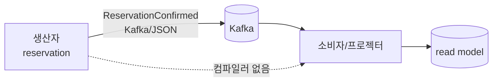
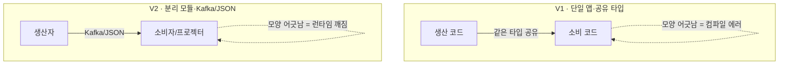
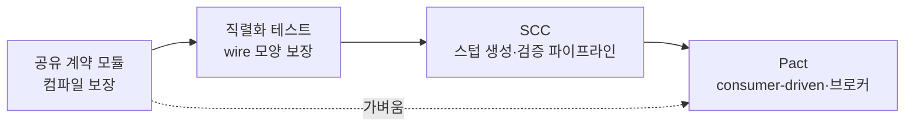
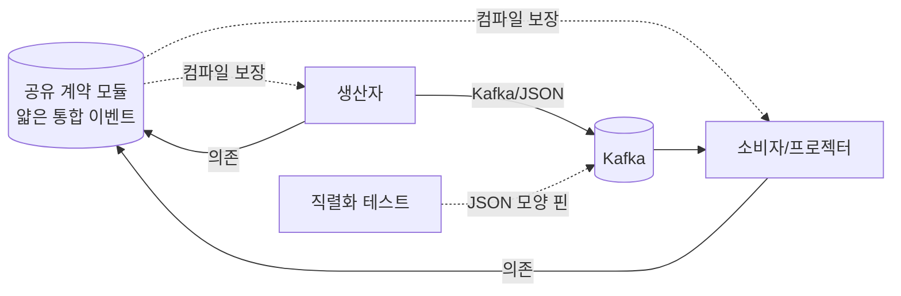

# RFC-023 — 이벤트 스키마 관리: 생산자·소비자 계약 (공유 통합-이벤트 모듈·계약 테스트)

- **상태**: ✅ 종결 (2026-06-30) — 공유 계약 모듈 + 직렬화 골든 테스트 + additive-only 규율 기본, 스키마 레지스트리·SCC/Pact는 멀티팀·외부 소비자 실증 시 졸업
- **선행**: [[RFC-001-v2-cqrs-and-event-sourcing]] · [[RFC-003-messaging-delivery]] · [[RFC-009-testing-quality-gates]]에서 분리 · 인덱스 [[RFC-INDEX]]
- **이웃과의 경계**: [[RFC-022-event-schema-evolution]](과거 이벤트를 새 코드로 끌어올리는 업캐스팅)·[[RFC-004-event-store-schema-evolution]](저장·보존 라이프사이클)와 다른 축이다 — 이쪽은 *같은 시점에 생산자 변경이 소비자를 깨뜨리지 않는가*라는 wire 계약이다.
- **닫으면**: [[07-messaging-topology]](통합 이벤트 = published language) + [[14.testing-strategy]](직렬화·계약 테스트) 보강 + 신규 ADR

---

## 배경 (Background)

### 시나리오: `reservation`이 `ReservationConfirmed`의 필드 하나를 바꾼다

**V1 모놀리스에서는 이렇게 흐른다.**
이벤트를 내는 쪽과 읽는 쪽이 같은 앱·같은 타입을 공유했다. 누군가 `ReservationConfirmed`의 `confirmedAt`을 `confirmedTime`으로 고치면, 그 타입을 읽던 코드가 같은 빌드 안에 있으니 **컴파일러가 즉시 잡는다.** 모양이 어긋나면 빌드가 안 된다 — 깨짐이 런타임까지 갈 수 없다.

**V2에서는 이렇게 흐른다.**

1. **생산자가 이벤트를 낸다** — `reservation`이 `ReservationConfirmed`를 발행한다.
2. **소비자/프로젝터가 읽는다** — 별개 모듈이 그 이벤트를 받아 read model을 만든다.
3. **사이에 컴파일러가 없다** — 둘은 따로 배포되는 별개 모듈이고 Kafka/JSON으로만 통한다.
4. **모양이 바뀌면 배포 뒤 런타임에 깨진다** — `confirmedAt`을 `confirmedTime`으로 고치거나 필드를 빼도 빌드는 멀쩡히 통과하고, *배포된 뒤* 프로젝터가 못 알아먹어 깨진다. 이런 깨짐은 사람 리뷰로 막기 어렵고 발견도 늦다.

### V1 ↔ V2, 무엇이 달라지나

| 개념 | V1 | V2 | 한 줄 정의 |
|------|-----|-----|-----------|
| **wire 계약** | 공유 타입 = 컴파일러가 보장 | 모듈 분리 = 보장 사라짐 | "생산자가 내는 모양과 소비자가 기대하는 모양의 일치" |
| **계약 테스트** | 불필요(컴파일러가 함) | 어긋남을 빌드에서 잡는 안전망 | "둘이 어긋나는 변경이 들어오면 런타임 전에 빨갛게 뜨게 한다" |
| **축 구분** | — | wire(같은 시점) ≠ 업캐스팅(시간 축) | "지금 생산자 변경이 지금 소비자를 깨나(이 RFC) vs 과거 이벤트를 새 코드로 읽나([[RFC-022-event-schema-evolution]])" |

---

## 맥락 (Context)

V1 모놀리스에서는 이벤트를 내는 쪽과 읽는 쪽이 같은 앱·같은 타입을 공유했다 — 모양이 어긋나면 컴파일러가 즉시 잡았다. V2는 그 둘을 갈라놓는다. 생산자는 이벤트를 내고(예: `reservation`이 `ReservationConfirmed`), 소비자/프로젝터는 그걸 읽어 read model을 만든다. 둘은 따로 배포되는 별개 모듈이고 Kafka/JSON으로만 통하므로 *사이에 컴파일러가 없다*.

- **모듈을 갈라놓는 순간 컴파일러의 보장이 사라진다.** 생산자가 이벤트 모양을 바꾸면 — `ReservationConfirmed`의 `confirmedAt`을 `confirmedTime`으로 고치거나 필드를 빼면 — 빌드는 멀쩡히 통과하고 *배포된 뒤 런타임에* 프로젝터가 못 알아먹어 깨진다. → 이런 깨짐은 사람 리뷰로 막기 어렵고 발견도 늦다. 그 어긋남을 *런타임에 닿기 전에* 잡는 안전망이 필요하다.
- **이 RFC가 다루는 건 wire 축이다.** 업캐스팅([[RFC-022-event-schema-evolution]])은 *과거* 이벤트를 새 코드로 읽는 *시간 축* 호환이고, 여기 계약은 *같은 시점에* 생산자 변경이 소비자를 깨지 않는지를 본다. → 둘 다 필요하지만 결이 다르므로 섞으면 안 된다. [[RFC-004-event-store-schema-evolution]]은 저장·보존(시간 축에서 저장소를 어떻게 운영하나)이라 또 다른 축이다.

핵심 긴장 — **분리된 생산자·소비자 사이의 wire 모양 어긋남을 런타임 전에 잡되, 솔로·모노레포 규모에 과한 계약 machinery(스텁 생성·브로커)를 미리 지불하지 않는다.**

---

## Goal / Non-goal

**Goal**
- 분리된 생산자·소비자 사이의 wire 모양 어긋남을 *런타임에 닿기 전*에 잡을 안전망을 무엇으로 칠지 정한다.
- machinery 스펙트럼(공유 모듈 ↔ 직렬화 테스트 ↔ SCC/Pact)에서 지금 단계의 기본을 고른다.
- SCC/Pact로 졸업하는 트리거의 방향을 잡는다.

**Non-goal (이번에 하지 않음)**
- 과거 이벤트를 새 코드로 읽는 업캐스팅(시간 축 호환). → [[RFC-022-event-schema-evolution]].
- 이벤트 저장·보존 라이프사이클(시간 축 저장소 운영). → [[RFC-004-event-store-schema-evolution]].
- 공유 계약 모듈의 위치·소유·버저닝 규약, 직렬화 테스트의 구체(도구·CI 게이트 편입), SCC/Pact 졸업 트리거의 구체 조건과 도구 택일. → Design([[07-messaging-topology]] · [[14.testing-strategy]]).

---

## 논의 (Discussion)

### 논점 1. 분리된 생산자·소비자 사이 안전망을 무엇으로 칠 것인가 — machinery 스펙트럼

**맥락에서 나온 질문.** 모듈을 갈라 컴파일러의 보장이 사라진 상태(맥락)에서, wire 모양 어긋남을 런타임 전에 잡으려면 안전망이 필요하다. 계약 테스트가 그 안전망이다 — "생산자가 내는 이벤트 모양"과 "소비자가 기대하는 모양"을 코드로 못박아, 둘이 어긋나는 변경이 들어오면 런타임까지 가기 전에 *빌드에서* 빨갛게 뜨게 한다. 그 안전망을 무엇으로 치느냐엔, 도구 택일보다 먼저 *machinery를 얼마나 쓸 것이냐*의 스펙트럼이 있다.

검토한 선택지:
- **공유 이벤트 계약 모듈** — 이벤트 정의를 한 모듈에 두고 생산자·소비자가 함께 의존하면, 모양이 어긋나는 변경은 런타임이 아니라 *컴파일*에서 깨진다. 도구도 브로커도 스텁도 없어 솔로·모노레포 규모에선 가장 단순하고 강력하다. 다만 두 단서 — (1) 공유하는 건 *내부 도메인 이벤트*가 아니라 *얇은 통합 이벤트(published language, [[RFC-003-messaging-delivery]])*다. 내부 도메인 이벤트까지 공유 타입으로 묶으면 이벤트로 떼어 놓은 컨텍스트 내부가 도로 결합된다(내부 이벤트는 각 컨텍스트 소유, 버전·업캐스팅은 [[RFC-022-event-schema-evolution]]). (2) 공유 타입의 컴파일 보장은 *같은 모듈 버전*일 때만 성립한다. 생산자·소비자가 독립 배포돼 서로 다른 버전을 들면 보장은 사라지고 런타임 JSON 호환만 남는다. 그래서 공유 모듈만으로는 *버전 스큐 시 wire 모양 호환*을 못 잡는다.
- **직렬화/스키마 테스트** — 무거운 계약 프레임워크 없이 공유 모듈의 구멍(버전 스큐 시 wire 호환)을 메운다. "이 이벤트의 JSON 모양은 이렇다"를 핀으로 박아 두면 필드 rename·삭제가 그 테스트를 깬다.
- **Pact** — 소비자가 기대를 적고 생산자가 검증하는 consumer-driven. Pact Broker라는 별도 서버가 필요하다.
- **Spring Cloud Contract(SCC)** — 생산자가 모양을 선언해 스텁 생성, Spring 빌드에 얹힘, 브로커 불필요. 본격 프레임워크다.

**내 의견(AI):** **얇은 통합 이벤트 공유 계약 모듈 + 직렬화 테스트를 기본**으로 둔다. 공유 모듈이 컴파일 보장을, 직렬화 테스트가 wire 모양 보장을 맡으면 스텁·브로커 machinery 없이 대부분을 덮는다. Spring Cloud Contract는 솔로·내부 단계엔 overspec에 가깝다 — 스텁 생성·생산자/소비자 검증 파이프라인이 지금 우리가 치를 결합 문제보다 무겁다. SCC/Pact는 *소비자가 외부로 나가거나 독립 배포 스큐가 실제 문제가 될 때* 졸업 후보로 남긴다. (인정하는 트레이드오프: 통합 이벤트가 늘고 wire 호환 규칙이 복잡해지면 손으로 쓰는 직렬화 테스트가 감당 안 되는 선이 온다 — 그게 SCC가 값을 하기 시작하는 지점이다. 외부 파트너 구독이 생기면 consumer-driven인 Pact가 살아난다.)

**네 결정:** 얇은 통합 이벤트 공유 계약 모듈 + 직렬화 테스트를 기본으로 채택, SCC/Pact는 외부 소비자·독립 배포 스큐가 실제 문제로 올라올 때 졸업 후보로 보류. 〔근거 확인/보강 필요〕

**결론:** 안전망 = 공유 계약 모듈(컴파일 보장) + 직렬화 테스트(wire 모양 보장). SCC/Pact는 미도입·졸업 후보. (이의 여지: 공유 계약 모듈의 위치·소유·버저닝 규약과 내부 도메인 이벤트와의 경계는 [[07-messaging-topology]] Design, 직렬화 테스트의 구체·CI 게이트 편입은 [[14.testing-strategy]] Design, SCC/Pact 졸업 트리거의 구체 조건과 그때의 도구 택일은 후속 Design으로.)

### 논점 2. 스키마 레지스트리(Avro/Confluent)를 지금 도입하나 → 보류, 경량 대체

**맥락에서 나온 질문.** 논점 1의 machinery 스펙트럼에서 SCC/Pact 위, 현업 Kafka 진영의 사실상 표준 해법이 **스키마 레지스트리**(Confluent/Apicurio + Avro/Protobuf)다 — 생산자가 스키마를 등록하고 레지스트리가 호환성 정책(`BACKWARD`/`FULL`)을 기계로 강제해, 깨는 변경은 *등록 단계에서* 거부된다. wire 계약을 가장 강하게 닫는 도구다. 그러면 이걸 지금 들여야 하나?

**내 의견(AI):** 지금은 **보류**한다. 이유는 두 겹이다.

- **학습 초점이 어긋난다.** 이 단계의 목적은 ES·EDA를 체득하는 것이다([[v2-optimize-for-learning-not-cost]]). 스키마 레지스트리를 꽂으면 배우는 건 ES/EDA 코어(이벤트 소싱·프로젝션·멱등·재구축·사가)가 아니라 *Confluent/Avro SerDe 운영*이다 — 학습 대상이 스키마 거버넌스가 아니므로 우선순위 밖이다.
- **인프라 비용이 코어를 가린다.** 레지스트리는 별도 서비스(가용성·운영 표면 하나 더)이고, JSON+업캐스팅([[RFC-022-event-schema-evolution]])으로 잡은 직렬화 경로를 Avro/Protobuf로 전면 교체해야 한다. 이는 [[RFC-022-event-schema-evolution]]이 이미 "JSON 유지·레지스트리 미도입(외부·폴리글랏 컨슈머 증명 시 별도 ADR)"로 닫은 선과 같다 — 본 RFC도 *계약 거버넌스* 관점에서 그 보류를 재확인한다.

대신 레지스트리가 강제하는 **호환성의 값은 인프라 0에 경량으로 흉내** 낸다:

- **직렬화 골든 테스트** — 통합 이벤트의 JSON 모양을 스냅샷으로 핀 박아, 필드 rename·삭제가 그 테스트를 깨게 한다(레지스트리 호환성 체크를 코드로). → 논점 1의 "직렬화 테스트"가 곧 이것이다.
- **additive-only 규율** — 필드는 추가만(소비자 기본값 처리), 삭제·rename 금지. 깨야 하면 `schemaVersion` + 업캐스팅([[RFC-022-event-schema-evolution]]). → 이게 레지스트리 `BACKWARD` 정책이 강제하는 바로 그 규칙이다.

**네 결정:** 스키마 레지스트리·Avro/Protobuf 전환은 보류(ES/EDA 학습 초점·인프라 비용 — [[RFC-022-event-schema-evolution]] 보류와 정합), 호환성은 **직렬화 골든 테스트 + additive-only 규율**로 경량 강제, 레지스트리/SCC/Pact는 멀티팀·외부 소비자·독립 배포 스큐가 실증될 때 졸업.

**결론:** wire 계약 거버넌스의 강한 해법(레지스트리)은 지금 과하다 — ES/EDA를 가리는 인프라다. 호환성 가치는 골든 테스트 + additive-only로 인프라 0에 얻고, 레지스트리는 졸업 후보로 남긴다.

---

## 결정 요약

| # | 결정 | ADR |
|---|------|-----|
| 1 | 안전망 = **얇은 통합 이벤트 공유 계약 모듈(컴파일 보장) + 직렬화 테스트(wire 모양 보장)** 기본, SCC/Pact는 외부 소비자·배포 스큐 시 졸업 후보로 보류 | 신규 ADR 예정 · [[07-messaging-topology]] · [[14.testing-strategy]] |
| 2 | 스키마 레지스트리·Avro/Protobuf 전환 **보류**(ES/EDA 학습 초점·인프라 비용, [[RFC-022-event-schema-evolution]] 보류와 정합) — 호환성은 **직렬화 골든 테스트 + additive-only 규율**로 인프라 0에 강제, 레지스트리/SCC/Pact는 멀티팀·외부·배포 스큐 실증 시 졸업 | 신규 ADR 예정 · [[14.testing-strategy]] · [[RFC-022-event-schema-evolution]] |

상세 설계는 [[07-messaging-topology]] · [[14.testing-strategy]] 참조.

---

## 결과 (목표 계약 구조 요약)

- 생산자·소비자는 *얇은 통합 이벤트(published language)*만 공유 계약 모듈로 묶는다 — 내부 도메인 이벤트는 각 컨텍스트 소유.
- 공유 모듈이 같은 버전일 때 컴파일 보장을, 직렬화 테스트가 버전 스큐 시 wire 모양 보장을 맡는다.
- SCC/Pact 같은 스텁·브로커 machinery는 외부 소비자·독립 배포 스큐가 실제 문제로 올라올 때 졸업 후보로만 둔다.

상세 토폴로지·테스트 구체는 [[07-messaging-topology]] · [[14.testing-strategy]] 참조.

---

## 관련 문서

- 분석/인덱스: [[RFC-INDEX]]
- 선행/분리: [[RFC-001-v2-cqrs-and-event-sourcing]] · [[RFC-003-messaging-delivery]] · [[RFC-009-testing-quality-gates]]
- 이웃 축: [[RFC-022-event-schema-evolution]] · [[RFC-004-event-store-schema-evolution]]
- 설계: [[07-messaging-topology]] · [[14.testing-strategy]]
