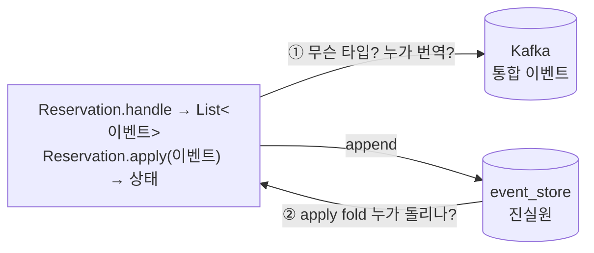
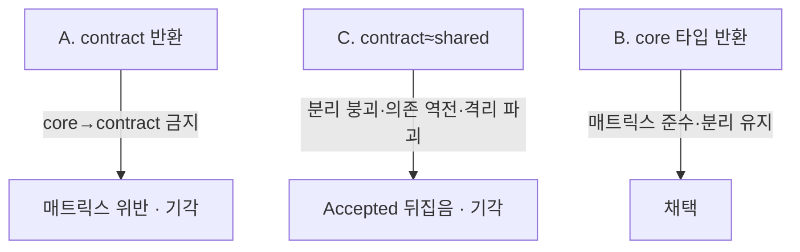
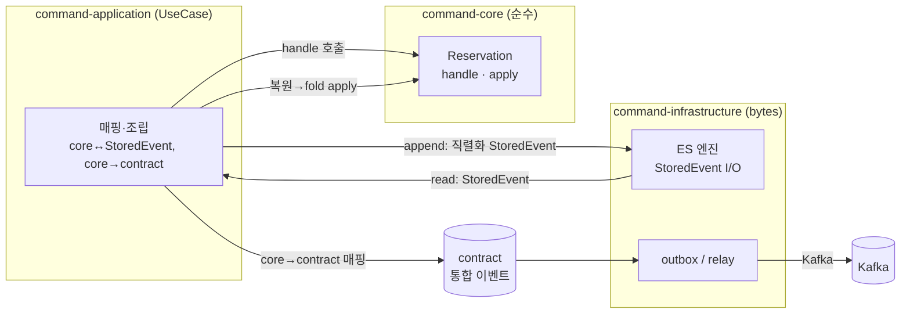

# RFC-024 — 도메인 이벤트 타입 소유와 리플레이 실행의 계층 분업 (core 타입 · application 매핑·발행 · infra bytes-only)

- **상태**: 🏷 합의 (2026-07-04) — core 타입 반환 · application에서 contract 매핑·발행 · 리플레이 fold도 application 조립(infra는 `StoredEvent` bytes-only) · append↔outbox 동일 트랜잭션. ADR 비준 대기
- **사이클**: `20260612-v2-cqrs-es-architecture`
- **선행**: [[RFC-010-module-structure-migration]](모듈 구조·의존성 매트릭스) · [[RFC-023-event-schema-contract-management]](내부↔통합 이벤트 분리) · [[RFC-006-saga-process-manager]] · 인덱스 [[RFC-INDEX]]
- **이웃과의 경계**: [[RFC-022-event-schema-evolution]](과거 이벤트를 새 코드로 읽는 업캐스팅)·[[RFC-023-event-schema-contract-management]](생산자↔소비자 wire 계약)와 다른 축이다 — 이쪽은 *한 애그리거트가 뱉은 이벤트 객체가 어느 모듈 타입이고, 그 저장·재생·발행을 어느 계층이 조립하는가*라는 계층 분업이다.
- **닫으면**: [[DESIGN-019-event-execution-layering]] 신설 + [[DESIGN-002-module-structure]] §4.4 매트릭스 정합 확인 + 신규 ADR
- **분석 출처**: [[06-design-weakness-triage]] C03 (D-002 §4.2·§4.4 자기리뷰 라인 299–300)

---

## 배경 (Background)

### 시나리오: `Reservation`이 `ReservationConfirmed`를 만들고, 나중에 그 이벤트로 상태를 되감는다

**V1에서는 이런 질문이 없었다.**
V1은 이벤트 소싱이 없다. 예약을 확정하면 `reservation` 테이블의 상태 컬럼을 직접 `UPDATE`했다. "이벤트 객체가 어느 모듈 소유냐", "저장된 이벤트로 상태를 어떻게 재조립하냐" 같은 질문 자체가 성립하지 않았다 — 상태가 곧 진실원이었으니까.

**V2에서는 이렇게 흐른다.**

1. **애그리거트가 이벤트를 만든다** — `Reservation.handle(ConfirmReservation)`이 `ReservationConfirmed`를 반환한다.
2. **그 이벤트가 진실원으로 저장된다** — event_store에 append 되고, 상태는 저장하지 않는다.
3. **상태가 필요하면 되감아 만든다(리플레이)** — `events.fold(초기){ s, e -> s.apply(e) }`. `apply`로 이벤트를 하나씩 적용해 현재 상태를 재조립한다.
4. **밖으로는 다른 모양이 나간다** — Kafka로 나가는 것은 이 내부 이벤트가 아니라 *얇은 통합 이벤트(published language)*다([[RFC-023-event-schema-contract-management]]).

그런데 이 4단계를 **계층(모듈) 규칙**과 겹쳐 놓으면 두 자리가 비어 있다:
- ① 1단계의 `ReservationConfirmed`는 **어느 모듈 타입**인가? 그리고 4단계의 내부→통합 번역은 **누가** 하는가?
- ② 3단계의 `apply`는 애그리거트(core) 소유인데, 그 fold를 **누가** 돌리는가?

### 핵심 개념

| 개념 | V1 | V2 | 한 줄 정의 |
|------|-----|-----|-----------|
| **내부 도메인 이벤트** | 없음 | 애그리거트가 뱉는 진실원, event_store 저장·리플레이 | "이 컨텍스트 안에서만 쓰는 이벤트 — 자유롭게 진화" |
| **통합 이벤트(contract)** | 없음 | Kafka로 나가는 published language, 버전 관리 | "컨텍스트 밖·외부로 발행하는 안정 계약" ([[RFC-023-event-schema-contract-management]]) |
| **리플레이 apply** | 없음(상태가 진실원) | 이벤트를 접어(fold) 상태 재조립 | "저장된 이벤트를 처음부터 다시 적용해 현재 상태를 만든다" |
| **의존성 매트릭스** | 계층 top-level | 서브모듈 컴파일 경계 | "어느 모듈이 어느 모듈을 import 해도 되는지" ([[DESIGN-002-module-structure]] §4.4) |

---

## 맥락 (Context)

의존성 매트릭스는 이미 확정돼 있다([[DESIGN-002-module-structure]] §4.4). 이 RFC의 두 공백은 매트릭스를 *바꾸는* 문제가 아니라, 매트릭스가 *이미 정한 자리 위에* 이벤트 실행 모델의 책임을 배정하지 않은 문제다.

- **자산 — 매트릭스가 이미 답의 절반을 강제한다.** `command-core`는 `contract` import 금지(허용=`shared`만), `command-infrastructure`는 `command-core` import 금지, `command-application`은 `command-core`·`contract` **둘 다 허용**. → 애그리거트가 contract 타입을 반환하는 선택지는 매트릭스가 이미 막았고, 번역을 할 수 있는 유일한 계층(core·contract를 다 보는)이 application임도 이미 정해져 있다.
- **자산 — 내부 이벤트 ≠ 통합 이벤트 구분이 확정돼 있다.** [[RFC-023-event-schema-contract-management]]·[[DESIGN-008-messaging-topology]] §4.12가 "Kafka로 나가는 건 내부 도메인 이벤트가 아니라 통합 이벤트"라고 못박았다. → 두 범주 사이에 번역이 존재한다는 전제는 이미 서 있다. 다만 그 번역의 *주체·위치*가 비어 있다.
- **공백 ① — 반환 타입·번역 주체 미배정.** [[RFC-023-event-schema-contract-management]]은 "내부 도메인 이벤트와 contract의 경계는 Design으로" 명시적으로 유보했다. 어느 문서도 애그리거트 반환 이벤트의 타입과 core→contract 번역 주체를 짚지 않았다. → 이대로 구현하면 개발자마다 다르게 짜거나, 편의로 core가 contract를 참조해 매트릭스를 어긴다.
- **공백 ② — 리플레이 조립 주체 미배정.** `apply`는 core 소유인데 ES 엔진은 `command-infrastructure`라 core를 못 부른다([[DESIGN-002-module-structure]] §4.4). fold를 누가 돌리는지 어느 문서도 분업선을 긋지 않았다(D-002 자기리뷰 라인 299). → 재조립 로직이 어댑터로 새거나 ES 엔진이 반쪽이 된다.

핵심 긴장 — **매트릭스(core·infra 제약)를 바꾸지 않고, 이벤트의 저장·재생·발행 실행을 어느 계층이 조립할지 배정한다.**

---

## Goal / Non-goal

**Goal**
- 애그리거트 반환 이벤트의 타입 소유를 정한다.
- core→contract(통합 이벤트) 번역·발행 주체를 정한다.
- 리플레이 `apply` fold의 조립 주체와 event_store 저장 형태를 정한다.
- event_store append와 통합 이벤트 발행(outbox)의 트랜잭션 경계를 정한다.

**Non-goal (이번에 하지 않음)**
- contract 모듈의 위치·소유·버저닝, 통합 이벤트 스키마 관리. → [[RFC-023-event-schema-contract-management]].
- 과거 이벤트를 새 코드로 읽는 업캐스팅. → [[RFC-022-event-schema-evolution]].
- outbox→Kafka relay의 순서 계약(SKIP LOCKED·DLQ 재생). → 별도(트리아지 C09).
- 스냅샷 N값·재구성 전략. → [[DESIGN-009-event-store-lifecycle]].

---

## 논의 (Discussion)

### 논점 1. 애그리거트가 반환하는 이벤트는 core 타입인가 contract 타입인가

**맥락에서 나온 질문.** 공백 ①의 앞쪽. `handle(cmd) → List<이벤트>`에서 이 이벤트의 모듈 타입을 정해야 뒤(저장·발행)가 결정된다.

검토한 선택지:
- **A. contract 타입 반환** — 애그리거트가 통합 이벤트를 바로 뱉는다. 번역 계층이 필요 없어 단순. 단 **`command-core → contract` 는 매트릭스 금지** → 위반. 물리적으로 불가(core build.gradle에 contract 의존 없음).
- **B. core 타입 반환** — 내부 도메인 이벤트를 core 타입으로 반환. 매트릭스 준수, 내부↔통합 분리 유지. 대신 발행 시 core→contract 번역이 필요(논점 2).
- **C. contract를 shared처럼 취급(매트릭스 완화)** — `core → contract` 를 허용해 A를 합법화. 하지만 (1) 내부 이벤트 ≠ 통합 이벤트 구분 붕괴 → 도메인이 published language와 한 몸이 되어 독립 진화 불가, (2) 가장 안정적이어야 할 core가 가장 자주 바뀌는 contract에 의존 → 의존 안정성 역전, (3) contract가 단일 모듈이면 모든 컨텍스트 core가 서로의 통합 이벤트를 봄 → 컨텍스트 격리 파괴, (4) event_store가 published 계약 버저닝의 인질. 게다가 이미 Accepted된 매트릭스·[[RFC-023-event-schema-contract-management]]를 뒤집는다.

**내 의견(AI):** **B**. C(collapse)는 솔로 프로토타입에서 매핑 보일러플레이트를 피하는 정당한 극이지만, 내부↔통합 분리는 ES/CQRS의 핵심 학습 포인트라 접으면 V2의 학습 목표([[v2-optimize-for-learning-not-cost]])와 어긋나고, 매트릭스·RFC-023을 supersede해야 한다. B는 매트릭스 무변경으로 분리를 지킨다. (인정하는 트레이드오프: 논점 2의 매핑 계층 비용을 진다.)

**네 결정:** **B — 애그리거트는 core 타입(내부 도메인 이벤트)을 반환한다.**

**결론:** 반환 이벤트 = `command-core` 타입. contract 반환(A)·매트릭스 완화(C)는 기각.

### 논점 2. core→contract 번역·발행은 어느 계층이 하는가

**맥락에서 나온 질문.** 공백 ①의 뒤쪽. 논점 1로 반환이 core 타입이 됐으니, Kafka로 나갈 통합 이벤트로의 번역 주체가 필요하다.

검토한 선택지:
- **core** — 불가. core는 contract를 못 본다(매트릭스).
- **command-infrastructure** — 불가. core를 못 봐서 core 이벤트를 읽어 번역할 수 없다.
- **command-adapter** — core·contract·application을 다 보므로 가능. 하지만 발행 결정과 상태 변경 트랜잭션 경계가 어긋난다.
- **command-application(UseCase)** — `command-core`·`contract` 둘 다 import 허용(매트릭스). 유스케이스가 command 트랜잭션 경계를 쥔다 → 상태 append와 통합 이벤트 발행을 한 경계로 묶기 가장 자연스럽다.

**내 의견(AI):** **application(UseCase)**. 매트릭스가 이미 application→core·contract를 허용하므로 **매트릭스 변경 0으로 합법**이다 — 이 RFC가 하는 일은 "새 권한 부여"가 아니라 "이미 있는 권한에 책임 배정". adapter도 가능하나 트랜잭션 경계(논점 4) 때문에 application이 맞다.

**네 결정:** **UseCase(command-application)에서 core 이벤트 → contract 통합 이벤트로 매핑해 발행(EMIT)한다.**

**결론:** core→contract 매핑·발행 주체 = `command-application`. 매트릭스 무변경(이미 허용된 의존 위에 책임 배정).

### 논점 3. 리플레이 `apply` fold는 누가 조립하고, event_store에는 무엇이 저장되나

**맥락에서 나온 질문.** 공백 ②. `apply`는 core 소유, ES 엔진은 infra라 core를 못 부른다. fold 주체와 저장 형태를 함께 정해야 한다(저장 형태가 조립 가능 계층을 좌우).

검토한 선택지:
- **a. application이 fold 조립 + infra는 직렬화 레코드 I/O만** — event_store엔 core 이벤트를 **직렬화 형태(`StoredEvent`: event_type 태그 + payload)**로 저장. infra는 그 레코드를 읽고 쓸 뿐 core 타입을 모른다(매트릭스 infra↛core 유지). application이 레코드를 core 이벤트로 복원해 `fold(apply)`를 돈다(application→core 허용). ES 엔진은 진짜 raw I/O가 되지만 그게 제 역할.
- **b. event_store에 contract(통합) 이벤트를 저장** — infra가 contract만 알아도 재생 가능. 하지만 published 계약을 진실원으로 삼아 논점 1-C의 "event_store가 계약 버저닝 인질" 문제를 그대로 들인다 → 수년치 히스토리 리플레이가 발행 계약에 묶임.

**내 의견(AI):** **a**. 핵심 불변식은 **"infra는 core 타입을 쥐지 않는다 — 직렬화 형태만 주고받고, core 이벤트 타입을 아는 유일한 계층은 application이다"**. 이 한 줄이 append(직렬화)·리플레이(역직렬화+fold)를 대칭으로 닫고 매트릭스도 지킨다. b는 논점 1에서 기각한 결합을 뒷문으로 들인다. (주의: [[DESIGN-002-module-structure]] §4.4는 "infra는 contract 이벤트 타입만 안다"고 적었는데, 이는 *발행 경로*(relay가 outbox의 contract 이벤트를 Kafka로) 한정으로 정합화해야 한다 — event_store append/replay 경로에서 infra는 타입-불가지의 직렬화 레코드만 다룬다.)

**네 결정:** application이 fold 조립, event_store엔 core 이벤트를 직렬화 `StoredEvent`로 저장, infra는 bytes-only. (논점 1·2를 성립시키는 기계적 귀결로 함께 채택.)

**결론:** 리플레이 조립 = `command-application`; event_store 저장 = 직렬화 `StoredEvent`; infra는 event_store 경로에서 타입-불가지.

### 논점 4. event_store append와 통합 이벤트 발행의 트랜잭션 경계

**맥락에서 나온 질문.** 논점 2(매핑·발행)와 논점 3(append)이 별도 트랜잭션이면 둘 사이에 죽을 때 반쪽만 남는다(dual-write).

검토한 선택지:
- **동일 트랜잭션·동일 datasource** — UseCase 한 트랜잭션 안에서 event_store append + contract→outbox insert. relay가 outbox를 나중에 Kafka로. 트랜잭셔널 아웃박스([[RFC-003-messaging-delivery]])와 정합.
- **분리** — append 후 별도로 발행 → 사이에 크래시 시 이벤트는 저장됐으나 발행 유실. 트리아지 C06(원자성) 재발.

**내 의견(AI):** **동일 트랜잭션**. append와 outbox insert가 같은 datasource의 한 트랜잭션이어야 "원자적 발행" 주장이 성립한다. (event_store와 outbox가 같은 datasource라는 전제는 C06과 함께 확인 대상.)

**네 결정:** append + contract outbox insert = 동일 트랜잭션.

**결론:** 매핑·outbox insert는 event_store append와 동일 트랜잭션. (event_store↔outbox 동일 datasource 전제는 C06과 함께 구현 시 확인.)

---

## 결정 요약

| # | 결정 | 상태 | ADR |
|---|------|------|-----|
| 1 | 애그리거트는 **core 타입(내부 도메인 이벤트)** 을 반환 — contract 반환·매트릭스 완화(collapse) 기각 | 결정 | 신규 ADR 예정 · [[DESIGN-002-module-structure]] |
| 2 | core→contract 매핑·발행 주체 = **command-application(UseCase)** — 매트릭스 무변경(이미 허용된 의존에 책임 배정) | 결정 | 신규 ADR 예정 · [[DESIGN-019-event-execution-layering]] |
| 3 | 리플레이 fold 조립 = **application**, event_store 저장 = **직렬화 StoredEvent**, infra는 event_store 경로에서 타입-불가지 | 결정 | 신규 ADR 예정 · [[DESIGN-009-event-store-lifecycle]] |
| 4 | event_store append + contract outbox insert = **동일 트랜잭션** | 결정 | 신규 ADR 예정 · [[RFC-003-messaging-delivery]](C06 정합) |

상세 설계는 [[DESIGN-019-event-execution-layering]] 참조.

---

## 결과 (목표 계층 분업 요약)

- **core**: `handle`/`apply`만. contract도 저장 형태도 모른다.
- **application(UseCase)**: core 이벤트 타입을 아는 **유일한** 계층. append용 직렬화·리플레이용 역직렬화+fold·core→contract 매핑을 한 트랜잭션으로 조립.
- **infra**: event_store 경로에선 `StoredEvent`(bytes) I/O만. 발행 경로에선 outbox의 contract 이벤트를 relay가 Kafka로.
- 핵심 불변식: **infra는 core 타입을 쥐지 않는다. core 이벤트 타입을 아는 건 application 뿐.**

상세 시퀀스·`StoredEvent` 스키마는 [[DESIGN-019-event-execution-layering]] 참조.

---

## 관련 문서

- 분석/인덱스: [[06-design-weakness-triage]] (C03) · [[RFC-INDEX]]
- 선행: [[RFC-010-module-structure-migration]] · [[RFC-023-event-schema-contract-management]] · [[RFC-003-messaging-delivery]]
- 이웃 축: [[RFC-022-event-schema-evolution]]
- 설계: [[DESIGN-019-event-execution-layering]] · [[DESIGN-002-module-structure]] · [[DESIGN-009-event-store-lifecycle]]
