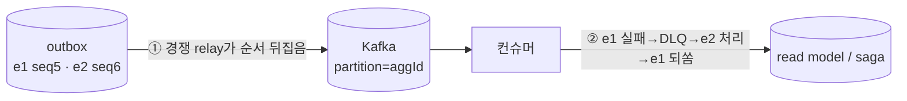
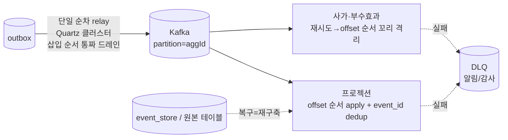

# RFC-025 — aggregate별 순서 계약과 relay·DLQ의 상호작용 봉합 (단일 순차 relay · Kafka offset 순서 · DLQ=알림/재구축)

- **상태**: 🏷 합의 (2026-07-04) → **개정 반영 (2026-08-03)** — 단일 순차 relay(**Quartz 클러스터**) · **Kafka offset 순서**(구안 LWW seq 가드 폐기) · DLQ는 되쏘지 않고 재구축으로 복구 · 순서 결정적 소비는 offset 순서 꼬리 격리. [[ADR-009-event-ordering-and-delivery-guarantee]]로 비준 대기
- **사이클**: `20260612-v2-cqrs-es-architecture`
- **선행**: [[RFC-003-messaging-delivery]](SKIP LOCKED·DLQ 수동 재생 원안) · [[RFC-021-event-identity-and-global-ordering]](순서 가드) · [[RFC-011-projection-rebuild-catchup]](재구축) · 인덱스 [[RFC-INDEX]]
- **이웃과의 경계**: [[RFC-024-domain-event-type-and-replay-layering]](발행 계층 분업)와 다른 축 — 이쪽은 *발행·소비 순서 계약을 relay 병렬성·실패 처리와 어떻게 지키는가*다.
- **닫으면**: [[DESIGN-020-ordering-and-failure-handling]] 신설 + [[DESIGN-008-messaging-topology]] §4.9·§4.10 정합 갱신 + 신규 ADR
- **분석 출처**: [[06-design-weakness-triage]] C09 (D-008 §4.9 Weakness §264 · §4.10 · audit §101)

---

> ## 개정 (2026-08-03) — LWW seq 가드 폐기 → Kafka offset 순서
>
> 아래 2026-07-04 합의 중 **논점 2의 "LWW seq 가드"와 그 토대인 inbox `last-applied sequence_no`(결정 2·5)**, 그리고 relay 단일성 기전(**ShedLock**)이 개정됐다. 논거는 [[ADR-009-event-ordering-and-delivery-guarantee]] 2026-08-03 정정과 같다:
> - **순서를 깨는 발행-측 발생원은 경쟁 드레인 하나뿐**이다. 단일 순차 relay가 outbox를 **삽입 순서로 통짜 드레인**하면, 리더 교체 창의 이중 발행조차 두 인스턴스 모두 삽입 순서라 각 이벤트의 최초 등장 offset이 seq 순서다 — 겹침은 **중복만 만들고 역전이 아니다**. 소비 측이 **파티션당 단일 스레드 offset 순서 apply + `event_id` dedup**을 지키면 LWW 가드는 **일어날 수 없는 역전을 막는 잉여**였다.
> - 오히려 LWW의 `seq ≤ 적용됨 → drop`은 **파트별 세부(delta) 이벤트**에서 다른 필드 갱신을 유실시키는 **결함**이었다(offset 순서 apply는 drop이 없어 안전).
> - 동반 변경: relay 단일성 **ShedLock → Quartz 클러스터**(예약 타임아웃 스케줄러 재사용, `@DisallowConcurrentExecution`), **inbox `last-applied sequence_no` 제거**(dedup은 `event_id`만), 꼬리 park 판정 **seq → offset(도착) 순서**(비-ES 소비자에도 적용), **producer 펜싱 미도입**(좀비 중첩=중복, dedup 흡수), 불변식 **I-RELAY-ORDER**(삽입 순서 통짜 드레인·경쟁 드레인 금지)·**I-CONSUME-ORDER**(파티션당 단일 스레드 offset 순서 apply) 명문화.
>
> 아래 2026-07-04 대화는 그날의 판단 **기록으로 보존**한다. 현재 유효한 결정은 이 배너와 아래 **결정 요약** 표(개정 표기)·**결과** 다이어그램, 그리고 [[DESIGN-020-ordering-and-failure-handling]]·[[ADR-009-event-ordering-and-delivery-guarantee]]다.

---

## 배경 (Background)

### 시나리오: 예약 A에 `확정` 다음 `취소`가 났다

**V1에서는 이렇게 흐른다.**
한 앱 안에서 확정·취소가 호출 순서대로 같은 트랜잭션 경로를 탄다. 순서가 뒤집힐 자리가 없다.

**V2에서는 이렇게 흐른다.**

1. 애그리거트가 `e1=ReservationConfirmed`(seq 5), `e2=ReservationCancelled`(seq 6)를 outbox에 순서대로 쌓는다.
2. relay가 outbox를 읽어 Kafka로 발행한다. 파티션 키 = `aggregate_id`([[RFC-021-event-identity-and-global-ordering]]).
3. 컨슈머(프로젝터·사가)가 읽어 read model·사가를 갱신한다.

여기서 두 자리가 순서를 깬다:
- **① 병렬 relay** — relay를 여러 개 SKIP LOCKED로 경쟁시키면 relay-1이 e1을, relay-2가 e2를 집어 e2가 먼저 Kafka에 도착한다(D-008 §264 자인).
- **② DLQ 수동 재생** — 컨슈머가 e1 처리에 실패해 DLQ로 보내고 e2를 처리한 뒤, 나중에 e1을 손으로 되쏘면 앞 순서를 건너뛴 재주입이 된다(D-008 §4.10, audit §101).

### 핵심 개념

| 개념 | 뜻 |
|------|-----|
| **relay** | outbox에 쌓인 이벤트를 읽어 Kafka로 내보내는 발행 일꾼 |
| **SKIP LOCKED** | 여러 relay가 남이 잡은 행은 건너뛰고 경쟁 소비 — 빠르나 순서 직렬화 안 함 |
| **ShedLock** | 분산 락으로 스케줄 작업을 한 인스턴스(리더)만 돌게 하는 장치 |
| **CDC** | DB 트랜잭션 로그(binlog)를 커밋 순서로 tailing (Debezium 등) — 단일 커넥터 = 순서 스트림 |
| **Last-Writer-Wins(LWW)** | 같은 대상에 갱신이 여러 개 오면 *가장 나중 것*만 남기는 방식. 여기선 "나중" = 높은 `sequence_no` |
| **seq 가드** | 들어온 이벤트의 aggregate seq ≤ 이미 적용한 seq면 무시, 크면 적용 — LWW의 구현 |
| **DLQ** | 처리 실패 이벤트를 격리하는 대기소(Dead Letter Queue) |
| **inbox** | 컨슈머의 중복 방지 장치 — 현재는 `event_id`로 "봤나?"만 봄 |

---

## 맥락 (Context)

순서 계약(파티션 키=`aggregate_id`)과 두 메커니즘(SKIP LOCKED 경쟁 relay, DLQ→수동 재생)은 각각 결정됐으나 그 *상호작용*을 봉합하는 결정이 없다. 정상 흐름에선 Kafka가 이미 aggregate별 순서를 지킨다(같은 파티션·순차 소비) — 순서가 깨지는 건 오직 relay 병렬성(①)과 실패 시 건너뛰기·되쏘기(②)뿐이다.

- **자산 — 순서 가드가 반쯤 서 있다.** [[RFC-021-event-identity-and-global-ordering]] §63이 "더 과거를 덮지 마라" 순서 가드를 이미 언급했다. → LWW seq 가드로 곧장 발전시킬 수 있다.
- **자산 — 프로젝션은 재구축 가능하다.** [[RFC-011-projection-rebuild-catchup]]이 event_store에서 프로젝션을 다시 만드는 경로를 확정했다. → DLQ를 라이브 스트림에 되쏘지 않아도 복구 경로가 있다.
- **한계 ① — relay 경쟁이 순서를 직렬화하지 않는다.** SKIP LOCKED는 처리량을 위해 직렬화를 포기하는 선택이다(D-008 §264 자인). → 같은 aggregate의 두 이벤트가 순서 뒤집혀 발행된다.
- **한계 ② — inbox가 갭을 못 본다.** inbox는 `event_id`로 dedup만 하고 "앞 순서를 건너뛰었나"는 못 본다([[RFC-021-event-identity-and-global-ordering]]). → DLQ 수동 재생의 순서 역전을 흡수하지 못한다.

핵심 긴장 — **aggregate별 순서 계약을, relay 병렬성과 컨슈머 실패 처리 양쪽에서 지키되, 솔로·무트래픽 규모에 과한 machinery 없이.**

---

## Goal / Non-goal

**Goal**
- relay 병렬성이 순서를 깨는 문제(①)를 봉합한다.
- 컨슈머 실패·DLQ가 순서를 깨는 문제(②)를 봉합한다.

**Non-goal**
- outbox↔event_store 원자성(트리아지 C06 — 동일 datasource 전제). → 구현 시 확인.
- 발행 이벤트의 계층 소유·매핑. → [[RFC-024-domain-event-type-and-replay-layering]].
- CDC 전환 트리거의 구체 임계값. → 별도(트리아지 C47).

---

## 논의 (Discussion)

### 논점 1. relay 병렬성이 깨는 순서(①)를 어떻게 봉합하나

**맥락에서 나온 질문.** 순서를 깨는 근본 원인은 relay를 여러 개 경쟁시키는 것(SKIP LOCKED)이다. 그럼 relay를 어떻게 두나.

검토한 선택지:
- **단일 순차 relay(ShedLock 리더)** — outbox 폴링을 한 인스턴스만 돈다. outbox를 `sequence_no` ASC로 읽어 순차 발행(Kafka 프로듀서는 idempotent/ordered). 가장 단순, outbox 패턴 유지.
- **파티션드 relay** — outbox를 `aggregate_id` 해시로 나눠 relay N개가 각자 파티션만 담당. 순서+병렬 둘 다. 더 복잡.
- **CDC(Debezium)** — binlog를 커밋 순서로 tailing, 단일 커넥터 = 순서 스트림. dual-write도 제거. 단 Kafka Connect·Debezium 인프라가 무거움.

**내 의견(AI):** 지금은 **단일 순차 relay(ShedLock)**. 무트래픽 프로토타입엔 처리량 병목이 문제 안 되고 가장 단순하다. 처리량이 실제 문제가 되면 파티션드 relay로, 폴링 부채가 커지면 **CDC로 졸업**(트리아지 C47). 전역 단일 relay는 과직렬화지만(우린 aggregate별 순서만 필요) 지금은 충분하다.

**네 결정:** 단일 순차 relay(ShedLock 리더) 채택, CDC는 졸업 후보. — SKIP LOCKED 경쟁 소비(D-008 §4.9·[[RFC-003-messaging-delivery]] 논점3)를 supersede.

**결론:** relay = 단일 순차(ShedLock). Kafka 프로듀서 idempotent/ordered. CDC·파티션드는 처리량/폴링 부채 실증 시 졸업.

### 논점 2. 컨슈머 실패·DLQ가 깨는 순서(②)를 어떻게 봉합하나 — 컨슈머 종류별

**맥락에서 나온 질문.** 정상 흐름은 Kafka가 순서를 지키므로, ②는 "실패 시 건너뛰거나 되쏠 때"만 터진다. 올바른 처리는 컨슈머 종류로 갈린다.

검토한 선택지(종류별):
- **프로젝션(state-snapshot)** — **Last-Writer-Wins seq 가드**: 들어온 aggregate seq가 이미 적용한 seq보다 크면 적용, 작거나 같으면 무시. e2가 e1보다 먼저 와도 e2가 이기고, 뒤늦은 e1(더 과거)은 가드가 떨어뜨림 → 최종 상태 정확. 재정렬 자가치유.
- **프로젝션(commutative 집계)** — 순서 무관, `event_id` dedup(현 inbox)만으로 안전.
- **순서 결정적 소비(사가·부수효과·비가환 집계)** — LWW 불가. **바운드 재시도(transient) → 실패 지속 시 그 aggregate의 꼬리째 격리**(e1과 후속을 seq 순서로 park, 다른 aggregate는 계속). 고치면 seq 순서로 드레인.

**DLQ의 위치:** 어느 경우든 **DLQ를 라이브 스트림에 되쏘지 않는다.** 실패 이벤트는 event_store에 그대로 있으므로, 복구는 **버그 수정 후 프로젝션 재구축**([[RFC-011-projection-rebuild-catchup]])이다 — 재구축은 event_store를 seq 순서로 재적용하므로 순서가 보장된다. DLQ는 **알림/감사 로그**로 강등된다.

**inbox 확장:** 위를 위해 inbox에 **aggregate별 last-applied `sequence_no`** 를 더한다(현 `event_id` dedup의 상위집합). LWW 가드와 갭 감지의 공통 토대.

**내 의견(AI):** 하나의 전역 정책이 아니라 **컨슈머 특성별**로. 대부분(프로젝션)은 LWW 가드로 거의 공짜에 닫히고, DLQ 되쏘기 대신 재구축이 복구를 맡아 ②가 근본에서 사라진다. 순서 결정적 소수만 꼬리 격리를 문다.

**네 결정:** 프로젝션 = **LWW seq 가드**(superseded 무시·최신 적용). **DLQ는 되쏘지 않고 무시** — 복구는 event_store 재구축. 순서 결정적 소비(사가·부수효과)는 꼬리 격리(적용 보장). inbox에 aggregate별 seq 추가. — DLQ 수동 재생(D-008 §4.10)을 supersede.

**결론:** ② 봉합 = (프로젝션) LWW seq 가드 + (순서 결정적) 꼬리 격리, DLQ는 알림·감사이며 복구는 재구축. inbox에 aggregate별 seq 추가.

---

## 결정 요약

| # | 결정 (개정 2026-08-03 반영) | 상태 | ADR |
|---|------|------|-----|
| 1 | relay = **단일 순차(~~ShedLock 리더~~ → Quartz 클러스터, `@DisallowConcurrentExecution`)**, Kafka 프로듀서 idempotent/ordered, **삽입 순서 통짜 드레인(경쟁 드레인 금지, I-RELAY-ORDER)** — SKIP LOCKED 경쟁 supersede. CDC·파티션드는 졸업 후보(그때 producer 펜싱 검토) | 결정 · **개정** | [[ADR-009-event-ordering-and-delivery-guarantee]] · [[DESIGN-008-messaging-topology]] |
| 2 | 프로젝션 = ~~**Last-Writer-Wins seq 가드**~~ → **Kafka offset 순서 apply + `event_id` dedup**(파티션당 단일 스레드, I-CONSUME-ORDER); commutative는 dedup만. **LWW 폐기 사유**: 잉여 + delta 이벤트 필드 유실 | ~~결정~~ **개정(대체)** | [[ADR-009-event-ordering-and-delivery-guarantee]] · [[RFC-021-event-identity-and-global-ordering]] 정합 |
| 3 | **DLQ는 라이브 스트림에 되쏘지 않음** — 알림/감사 로그, 복구는 재구축([[RFC-011-projection-rebuild-catchup]]) — 수동 재생 supersede | 결정 | [[ADR-009-event-ordering-and-delivery-guarantee]] · [[DESIGN-008-messaging-topology]] |
| 4 | 순서 결정적 소비(사가·부수효과·비가환) = **바운드 재시도 → aggregate 꼬리 격리**(적용 보장), park·드레인 판정 ~~seq~~ → **offset(도착) 순서**(비-ES 소비자에도 적용) | 결정 · **개정** | [[ADR-009-event-ordering-and-delivery-guarantee]] · [[DESIGN-006-aggregate-design]]·[[DESIGN-007-consistency-and-sagas]] |
| 5 | ~~inbox에 **aggregate별 last-applied `sequence_no`** 추가~~ → **폐기**. inbox는 `event_id` dedup만; 순서는 offset 순서 + 단일 relay가 보존 | ~~결정~~ **개정(철회)** | [[ADR-009-event-ordering-and-delivery-guarantee]] |

상세 설계는 [[DESIGN-020-ordering-and-failure-handling]] 참조.

---

## 결과 (목표 순서 보장 요약)

- **발행**: 단일 순차 relay(Quartz 클러스터)가 삽입 순서 통짜 드레인으로 aggregate 순서를 보존. 경쟁 드레인 금지. (처리량 문제 시 파티션드/CDC 졸업.)
- **프로젝션**: 파티션 offset 순서 apply + `event_id` dedup으로 순서 보존 — 겹침은 중복만 만들고 dedup이 흡수. delta 이벤트도 drop 없이 안전.
- **DLQ**: 되쏘지 않음. 복구는 재구축(ES=event_store seq 순서, 비-ES=원본 테이블).
- **순서 결정적 소비**: offset 순서 꼬리 격리로 앞 순서 미적용 원천 차단, 무관 aggregate는 안 막음.

---

## 관련 문서

- 분석/인덱스: [[06-design-weakness-triage]] (C09) · [[RFC-INDEX]]
- 선행/supersede: [[RFC-003-messaging-delivery]] · [[RFC-021-event-identity-and-global-ordering]] · [[RFC-011-projection-rebuild-catchup]]
- 이웃: [[RFC-024-domain-event-type-and-replay-layering]]
- 설계: [[DESIGN-020-ordering-and-failure-handling]] · [[DESIGN-008-messaging-topology]] · [[DESIGN-007-consistency-and-sagas]]
