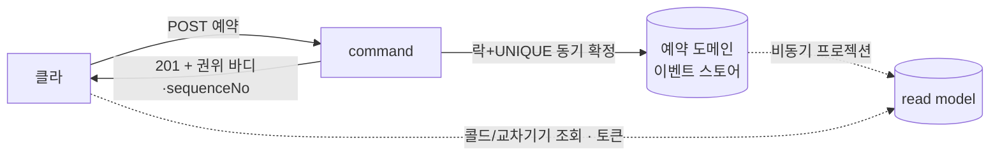
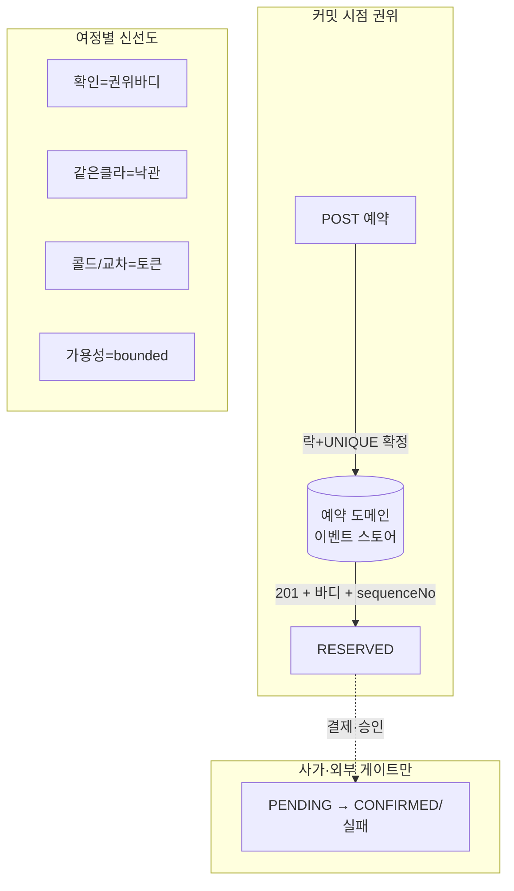

# RFC-030 — 읽기 신선도 계약: 동기 권위 응답 기본 + read-after-write 토큰 (트리아지 C14, RFC-012 "202 기본" 재검토)

- **상태**: 🏷 합의 (2026-07-05) — command 기본 응답을 동기 권위 응답(201/200 + 바디)으로, read gap을 여정별 신선도 등급 + `sequence_no` 토큰으로 계약화. RFC-012의 "202 기본"을 부분 supersede. ADR 비준 대기
- **사이클**: `20260612-v2-cqrs-es-architecture`
- **범위**: command HTTP 응답 규약과 read-your-writes 신선도 계약. 무엇이 동기로 확정되고, read gap을 여정별로 어떻게 지불하는지.
- **선행**: [[RFC-012-command-query-api-contract]](202 기본·비동기 command) · [[RFC-002-read-model-consistency]](read-your-writes deferral) · [[RFC-014-aggregate-concurrency-control]](동기 불변식·`sequence_no`) · [[RFC-029-event-carried-payload-uniform]](event-carried) · 인덱스 [[RFC-INDEX]]
- **계승**: V1 동기 CRUD의 read-your-writes — 폐기가 아니라 **핵심 여정에 한해 부분 계승**
- **분석 출처**: [[06-design-weakness-triage]] C14 (D-004 §184·§4.7 · D-013 §192 · ADR-04 line 55 · RFC-INDEX line 23 "존재하지 않는 예외 정책 ADR")

---

## 배경 (Background)

### 시나리오: 예약하고 바로 "내 예약"을 연다

**V1에서는 이렇게 흐른다.** 동기 CRUD다. `POST` 하면 같은 트랜잭션에서 상태가 바뀌고 결과가 200으로 돌아온다. 바로 목록을 열면 방금 만든 예약이 그대로 보인다 — 읽기·쓰기가 같은 상태라 "쓰면 바로 읽힘"이 공짜.

**RFC-012의 "202 기본"에서는 이렇게 흐른다.** `POST` → 이벤트 커밋 → **빈 202** → 클라가 목록을 `GET` → **read model이 아직 안 따라와 비어 있음.** "예약했는데 목록에 없다." 취소도 마찬가지 — "취소했는데 아직 예약된 것처럼."

핵심을 놓친 지점: **command는 커밋 시점에 이미 권위 있는 결과를 손에 쥔다**(ES 애그리거트를 방금 재구성했으니까). 202는 그걸 버리고 밀린 projection 재조회를 강제한다.



### 먼저 용어

| 말 | 뜻 |
|---|---|
| **read-your-writes** | 방금 내가 쓴 걸 바로 읽었을 때 반영돼 보이는 성질 |
| **권위 응답** | 커밋된 write측 상태를 응답 바디에 그대로 담아 돌려줌 (projection 안 거침) |
| **read gap** | 커밋과 projection 반영 사이, read model이 잠깐 stale한 구간 |
| **신선도 등급** | 화면(여정)마다 "얼마나 최신이어야 하나"를 다르게 계약 |
| **read-after-write 토큰** | 클라가 "내 쓰기가 반영됐나" 확인하려 되쏘는 버전 값 = `sequence_no` |
| **RESERVED / PENDING** | 동기 확정된 상태 / 사가·외부 결과를 기다리는 상태 |

---

## 맥락 (Context)

- **자산 — 정확성은 read gap과 무관하게 이미 안전하다.** 중복예약 불변식은 [[RFC-014-aggregate-concurrency-control]]가 쓰기 경로에서 동기 확정한다(단일 슬롯 애그리거트 · 락 · `(aggregate_id, sequence_no)` UNIQUE 최종심판 · 재로드→재판단). read model이 아무리 밀려도 이중예약은 물리적으로 불가능. → **read gap은 *신선도* 문제지 *정확성* 문제가 아니다.**
- **자산 — command는 커밋 시점에 권위 상태를 안다.** append 직후 애그리거트 상태가 손에 있으므로 201 바디로 돌려주는 비용이 0. → 202로 그 정보를 버릴 이유가 없다.
- **자산 — `sequence_no`가 곧 causal token이다.** [[RFC-014-aggregate-concurrency-control]]의 `(aggregate_id, sequence_no)`를 그대로 반환하면 별도 버전 벡터·논리시계 없이 read-after-write가 성립. `sequence_no`는 앱-할당 애그리거트별 단조 버전(`load→N`·`append N+1`, DB AUTO_INCREMENT 아님)이다.
- **전제 — 이벤트 스토어는 도메인(BC)별로 분리된다.** "도메인 경계 = 스키마 경계"([[13.db-hosting-and-read-write-topology]]), BC 가로지르는 단일 시퀀스 없음·`global_seq` 불채택([[RFC-021-event-identity-and-global-ordering]]). → 이 RFC는 이를 **기결 전제로 삼는다**(여기서 정하지 않는다). 귀결: 토큰은 **쓴 도메인 스토어 하나**에만 스코프되고, 교차-도메인 신선도는 구조적으로 bounded staleness다.
- **한계 — RFC-012가 "202 기본 + read-your-writes 미보장"으로 닫았다.** 커밋 시점에 아는 결과를 버리고(빈 202) 밀린 projection 재조회를 강제하며, 결과 조회 채널은 [[RFC-002-read-model-consistency]]로 되던졌다(RFC-012 line 73·98). 그 read-your-writes 결론도, 예고된 "읽기 신선도 예외 정책" ADR도 끝내 만들어지지 않았다(RFC-INDEX line 23).

핵심 긴장 — **read gap은 CQRS의 정의된 값이다: {비동기로 갱신되는 별도 read model} + {항상 최신 읽기}는 동시에 못 가진다. 없앨 게 아니라 여정별로 무엇을 지불할지 고른다. 그리고 "202 기본"은 커밋 시점에 아는 결과를 버린 범주 오류 — CQRS(모델 분리) ≠ 비동기 쓰기.**

---

## Goal / Non-goal

**Goal**
- command 기본 응답 = **동기 권위 응답**(생성 201 + 바디 / 상태전이 200 + 바디)으로 확정. RFC-012 "202 기본" 부분 supersede.
- read gap을 **여정별 신선도 등급**으로 계약화한다.
- read-after-write 토큰을 `sequence_no` 재사용으로 확정한다.
- 201/200 응답 바디 구성을 확정한다.

**Non-goal (이번에 하지 않음)**
- **진짜 async 작업(외부 결제 캡처·업체 승인)의 결과 통지 채널(폴링/SSE/푸시) 선택** — 이 경우에만 202가 남는다는 *경계*만 여기서 긋고, 채널 구체는 [[RFC-016-payment-integration-boundary]]·[[RFC-006-saga-process-manager]] 및 알림 설계 소관(미결 인프라 선점 금지).
- 정확성 불변식 자체 — [[RFC-014-aggregate-concurrency-control]].
- 페이징·에러 매핑 등 RFC-012 잔여 계약.
- ADR 비준(사용자 권한).

---

## 논의 (Discussion)

### 논점 1. "202 기본"이냐, 동기 권위 응답이냐 (RFC-012 재검토)

**맥락에서 나온 질문.** RFC-012가 202를 기본으로 닫았는데, 예약 핵심 여정("예약 직후 목록", "취소 결과 확인")이 전부 read gap에 걸린다.

검토한 선택지:
- **(a) 빈 202 Accepted** (RFC-012) — 이벤트만 커밋, 결과는 별도 조회. 커밋 시점에 아는 걸 버리고 재조회 강제.
- **(b) 동기 200 + 프로젝션 대기** — read model 반영까지 기다려 응답. 쓰기가 읽기 완료를 기다려 CQRS 분리 무력화.
- **(c) 동기 권위 응답** — 커밋한 애그리거트 상태를 201/200 바디로 즉시 반환. projection을 기다리지도, 거치지도 않는다.

**결정: (c) 동기 권위 응답 기본.** command는 커밋 시점에 결과를 이미 아니 그걸 돌려준다 — read-your-writes(확인 화면)가 응답 바디로 공짜 해결. 202는 폐기가 아니라 **결과가 커밋 시점에 안 알려지는 경우로 축소**(논점 2 참조).

### 논점 2. 무엇이 동기 확정이고 무엇이 202로 남나 — 단일 애그리거트 vs 사가 게이트

**맥락에서 나온 질문.** 동기 201이 항상 "확정"인가? 아니다 — 사가/외부 결과에 걸린 부분은 커밋 시점에 모른다.

- **단일 애그리거트 결정 = 동기 확정 → 201/200 + `status: RESERVED`.** 슬롯 잡기는 [[RFC-014-aggregate-concurrency-control]]가 커밋 안에서 확정하므로 권위적이다.
- **사가·외부 결과에 게이트되는 결정 = 커밋 시점 미확정 → 201 + `status: PENDING`, 최종 결과는 비동기.** 예: 결제 캡처·업체 승인이 확정을 가르면, 201로 "요청 접수·슬롯 확보(PENDING)"까지만 권위적으로 반환하고, 최종 CONFIRMED/실패는 진짜 async(이 경우에만 202-성격 + 통지 채널, Non-goal).

**결정: 상태가 현실을 정직하게 반영한다.** 동기 확정분은 권위 상태로 즉시, 사가 게이트분은 PENDING + 후속 이벤트. "202 기본"의 잔존 영역은 이 사가 게이트 케이스뿐.

### 논점 3. read gap을 여정별로 어떻게 지불하나

정확성은 안전(맥락)하므로 남는 건 신선도. 시나리오별로 다른 값을 지불한다:

| 시나리오 | gap | 계약 |
|---|---|---|
| A. 예약 직후 "됐나?" 확인 | 안 뭄 | **201 권위 바디** — read model 안 거침 |
| B. 같은 클라가 바로 목록 | 다리 놓임 | 클라가 A의 객체를 **낙관적 삽입** |
| **C. 같은 클라 콜드(앱 재시작·새로고침, 토큰 보존)** | **진짜 뭄** | **read-after-write 토큰**(논점 4) — projection이 토큰까지 못 왔으면 짧게 대기/폴백 |
| C'. **다른 기기**(토큰 없음) | 뭄 | 토큰 없으니 **bounded staleness**로 떨어진다 — 토큰은 세션/클라 인과 보장이지 크로스-디바이스 보장이 아니다 |
| C''. **교차-도메인 조인**(목록에 식당·타임테이블) | 뭄 | 토큰은 **쓴 도메인(예약)분만** 보장, 타 도메인은 **bounded staleness** — 스토어가 BC별 분리라 구조적 |
| D. 남의 가용성 조회 | 무해 | **bounded staleness**(컨슈머 lag SLO) + 동기 거절에 의존. "방금 마감"은 UX지 오염 아님 |

**결정: 위 등급을 계약으로 못박는다.** 동기 프로젝션·write측 직접 읽기(gap=0이지만 CQRS 재결합 = 부분적 V1 회귀)는 **특정 화면이 증명되기 전엔 봉인** — 최후 수단.

### 논점 4. read-after-write 토큰 = `sequence_no` 재사용

새 버전 벡터를 만들지 않는다. [[RFC-014-aggregate-concurrency-control]]의 `(aggregate_id, sequence_no)`에서 **그 `sequence_no`를 응답에 담는다.**

- 클라가 이후 읽기에 `(reservationId, sequenceNo)`를 실으면, 읽기 엔드포인트가 "projection이 이 애그리거트를 `seq ≥ N`까지 반영했나" 확인 → 못 왔으면 짧게 대기(long-poll 타임아웃) 또는 write측 폴백.
- **취소·상태전이도 자동으로 풀린다**: 취소는 `seq 2`를 만든다 → 클라가 `seqNo=2`로 조회 → projection이 `seq ≥ 2`(CANCELLED) 될 때까지 대기. "취소했는데 아직 예약됨" gap이 토큰 하나로 닫힘.

**한계 (정직하게):**
- `sequence_no`는 **per-aggregate지 global이 아니다** — global 위치값은 애초에 없다(BC별 스토어·`global_seq` 불채택, [[RFC-021-event-identity-and-global-ordering]]). 그래서 "이 엔티티가 이 버전까지 왔나"만 답하고, "read model 전체가 따라왔나"는 답 못 한다. read-your-writes엔 정확히 충분(범용 신선도 토큰 아님).
- **토큰을 쥔 클라만** 덕 본다(세션 인과). 다른 기기는 bounded staleness(위 C').
- **쓴 도메인 스토어에만** 스코프. 교차-도메인 조인은 타 도메인 bounded staleness(위 C'').

**결정: `sequence_no`(쓴 도메인 스토어 기준)가 causal token. projection row는 적용한 원본 `sequence_no`를 보유해 비교를 가능케 한다. global·크로스-BC·크로스-디바이스 보장이 아님을 명문화.**

### 논점 5. 201/200 바디 구성

실제 `Reservation` 애그리거트(`booker`·`restaurantInformation`·`schedule`·`occupancy`·`reservationStatus`) 기반:

```json
{
  "reservationId": "01J8...",
  "status": "RESERVED",
  "booker":     { "userId": "01J8..." },
  "restaurant": { "restaurantId": "01J8...", "tableNumber": 12, "tableSize": 4 },
  "schedule":   { "timeTableId": "01J8...", "date": "2026-07-10", "day": "FRIDAY",
                  "startTime": "19:00", "endTime": "21:00" },
  "occupancy":  { "timeTableOccupancyId": "01J8...", "occupiedDatetime": "2026-07-05T14:03:12" },
  "sequenceNo": 1,
  "createdAt":  "2026-07-05T14:03:12Z"
}
```

**이름 비정규화 — 열린 선택.** write 애그리거트는 ID-lean이라 `restaurantId`는 있어도 식당명·메뉴명이 없다. 확인 화면의 "○○식당 예약 완료"는 ⓐ 클라가 예약 플로우에서 이미 든 이름을 쓰거나, ⓑ command 응답에 event-carried로 이름을 보강([[RFC-029-event-carried-payload-uniform]] 연습)한다.

**결정: 무트래픽·학습 프로토타입이므로 ⓐ를 기본, ⓑ 보강은 구현 시점 선택으로 이월.** (바디를 얼마나 두껍게 할지의 문제라 정확성·신선도 계약과 독립.)

---

## 결정 요약

| # | 결정 |
|---|------|
| 1 | command 기본 응답 = **동기 권위 응답**(생성 201 / 상태전이 200) + 바디. RFC-012 "202 기본" 부분 supersede. |
| 2 | **단일 애그리거트 결정 = 동기 확정(RESERVED)**, **사가·외부 게이트 = PENDING + 비동기**. 202-성격은 이 게이트 케이스로 축소. |
| 3 | read gap = 신선도(정확성 아님). **여정별 신선도 등급**(A 권위바디 / B 낙관 / C 토큰 / D bounded). 동기 프로젝션·write측 읽기는 봉인. |
| 4 | **read-after-write 토큰 = `sequence_no`**([[RFC-014-aggregate-concurrency-control]] 재사용). projection이 원본 seq 보유. |
| 5 | 201/200 바디 = 권위 예약 상태 + `sequenceNo` + `createdAt`. 이름 보강(event-carried)은 구현 이월. |

## supersede / 정합

- **부분 supersede**: [[RFC-012-command-query-api-contract]]의 "command 기본 = 즉시 202"(line 98·154·175) → **동기 권위 응답 기본**으로 대체. 202는 사가·외부 게이트 케이스로 축소. RFC-012의 페이징·에러 계약은 유지.
- **착지**: [[RFC-002-read-model-consistency]]가 열어둔 read-your-writes 예외 정책 + RFC-012가 되던진 "202 결과 조회"를 여기서 계약화. 예고됐던 "읽기 신선도 예외 정책"을 이 RFC가 실체화.
- **재사용**: 동기 불변식·`sequence_no`([[RFC-014-aggregate-concurrency-control]]), event-carried([[RFC-029-event-carried-payload-uniform]]).

## 결과 (목표 계약 요약)



- command 응답은 커밋 시점에 아는 권위 결과를 담는다 — 예약/취소 확인은 재조회 없이 즉시.
- 콜드·교차기기 read-your-writes만 `sequence_no` 토큰으로 보장, 나머지는 bounded staleness + 낙관 클라이언트.
- CQRS는 비동기 읽기가 견딜 만한 곳에, 동기는 못 견디는 핵심 여정에 — 그 선을 여정별로 긋는 것이 이 계약의 본질.

## 관련 문서

- API 계약: [[RFC-012-command-query-api-contract]] · 읽기 모델: [[RFC-002-read-model-consistency]]
- 동시성·토큰: [[RFC-014-aggregate-concurrency-control]] · 페이로드: [[RFC-029-event-carried-payload-uniform]]
- 분석: [[06-design-weakness-triage]] (C14)
- 후속 경계: [[RFC-016-payment-integration-boundary]] · [[RFC-006-saga-process-manager]] (사가 게이트 결과 채널)
